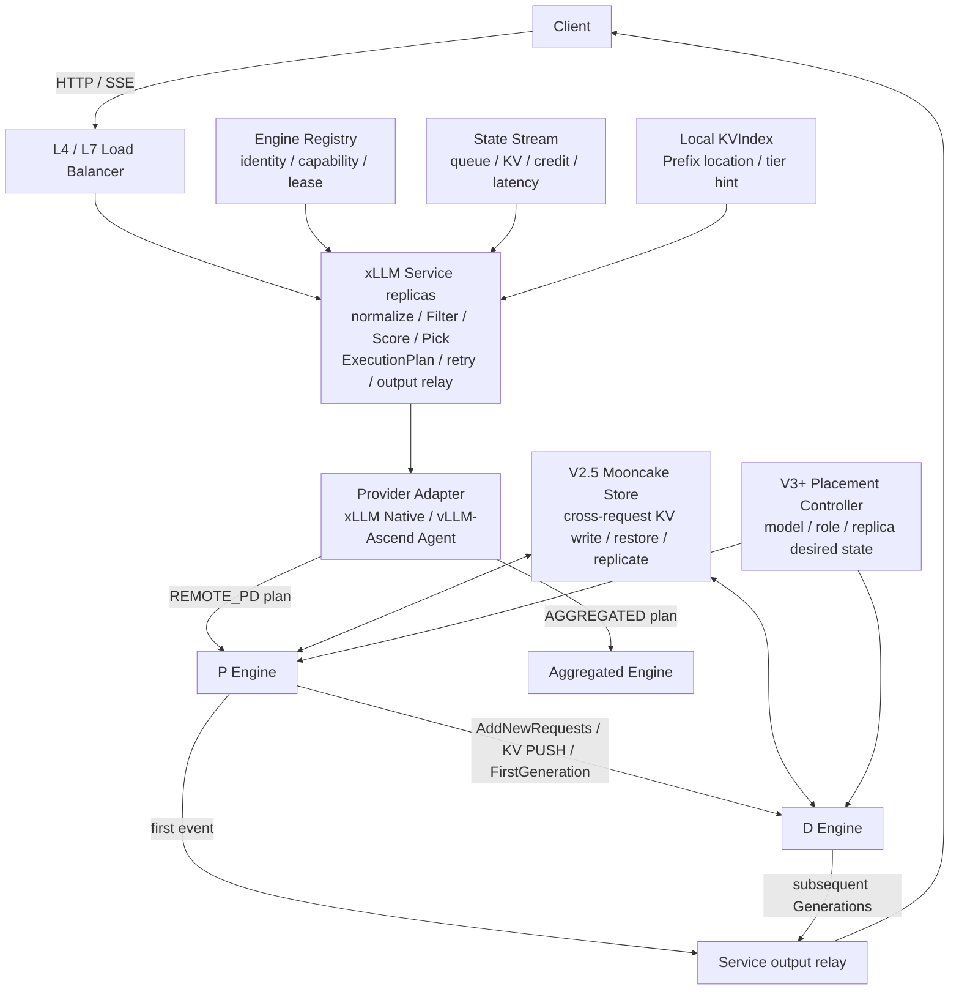
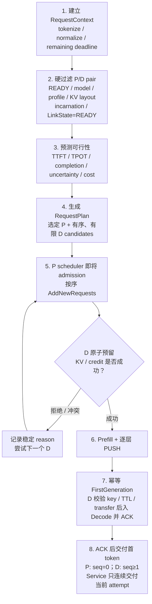
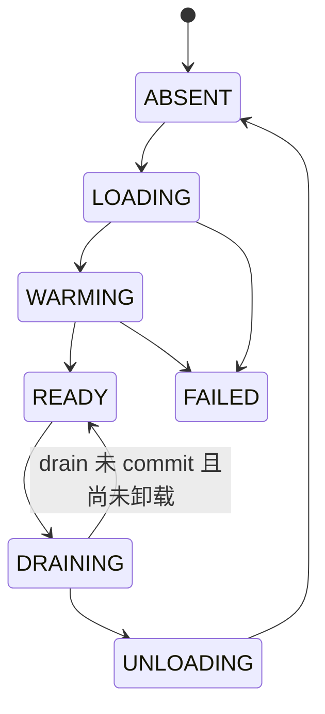

# xLLM Service 总体架构与多轴演进设计

## 1. 文档定位

- 状态：最终架构、阶段目标与系统边界基线
- 日期：2026-08-07
- 设计对象：xLLM Service 请求控制面；xLLM Native 与 vLLM-Ascend Provider 为首批执行数据面
- 实现基线：xllm-service `322bcda03793`，xLLM `8164a701bab7`，vLLM-Ascend `ba58907c6d1c`，Mooncake `129a9db9579c`
- V1 实现协议：[xLLM Service V1 实现规格](./02_XLLM_SERVICE_V1_IMPLEMENTATION_SPEC.md)
- 集群 KV 路由：[集群级 KV-aware Router](./08_XLLM_SERVICE_CLUSTER_KV_AWARE_ROUTER_DESIGN.md)
- V2 流控与执行模式：[有界流控与执行模式](./09_XLLM_SERVICE_V2_FLOW_CONTROL_AND_EXECUTION_MODES_DESIGN.md)
- 集群 KV 内存层：[Mooncake Store 与跨请求 KV](./05_XLLM_PD_STORE_SESSION_DESIGN.md)
- 多引擎接入：[Provider 与 Adapter 设计](./11_XLLM_SERVICE_MULTI_ENGINE_PROVIDER_DESIGN.md)

本文只保留确定方案。V1 是首个生产版本；后续阶段沿请求调度、执行拓扑和 KV 内存层级三条轴扩展，不改变“Service 软选择和协调、Engine/Store 持有资源与数据真相”的基础边界。

### 1.1 业界推理服务框架与演进方向

截至 2026 年 8 月，代表性开源推理服务框架已经从“模型前面加一个负载均衡器”演进为请求控制面、Engine 执行面和 KV 数据面的组合：

- **[llm-d](https://llm-d.ai/docs/architecture)：Kubernetes 原生推理控制面。** Gateway/Envoy 接入请求，EPP 可在 InferencePool 上执行有界流控与 `Filter → Score → Pick`，Model Server 负责实际推理；演进重点包括 Gateway 侧公平调度、精确 Prefix 索引、分层 KV、异构/SLO autoscaling 和 Batch 推理。
- **[NVIDIA Dynamo](https://docs.nvidia.com/dynamo/dev/knowledge-base/overview)：后端无关的分布式推理 Runtime。** Frontend/Router 处理请求，Worker 执行模型，事件面同步负载与 KV，NIXL 传输数据，KVBM 管理分层 KV，Planner 负责放置和扩缩容；继续向条件化 P/D、拓扑/KV 感知、跨模型规划和可选 Worker 故障重放演进。
- **[SGLang Model Gateway](https://github.com/sgl-project/sglang/blob/main/docs/advanced_features/sgl_model_gateway.md)：与 Runtime 深度协同的统一 Gateway。** Gateway 集成 Worker 注册、健康/负载监控和 HTTP/gRPC 数据面，可管理聚合与 P/D 路径；方向是多模型、多协议、E/P/D 分离，以及 agent/MCP 和可选会话能力。
- **[AIBrix](https://github.com/vllm-project/aibrix)：Kubernetes 上的可插拔推理基础设施。** Gateway/Router 管理多模型与 Engine Pod，Runtime sidecar 统一指标和生命周期，Autoscaler 调整副本，分布式 KV 层支持跨 Engine 复用；方向是可组合路由、多 Gateway 状态同步、异构 SLO/成本优化和可插拔 P/D/KV 数据面。

这些实现的共同方向可以归纳为四点：

1. **控制面与执行面分离：** Gateway/Router 做流控、软选择和协调，Engine 对准入、KV、Decode 和资源释放拥有最终决定权。
2. **请求快环与放置慢环分离：** 快环按负载、KV、SLO 和拓扑选择执行路径，慢环按长期流量和成本调整模型、角色、规格与副本。
3. **P/D 分离从固定拓扑变成逐请求选择：** 是否远程 Prefill、选择哪组 P/D，取决于请求形状、缓存收益、排队和传输成本；分离不是所有请求的默认最优解。
4. **KV 从 Engine 私有缓存演进为集群级分层资源：** Router 消费 KV 事件建立位置索引，HBM、DRAM、SSD 和共享 Store 共同扩大可复用容量，但资源与数据真相仍留在 Engine/Store。
5. **多 Runtime 通过能力接口接入：** 控制面选择经过验证的执行计划，Provider Adapter 适配 Runtime 的请求、状态和故障语义，不要求所有 Engine 使用相同 wire 或支持相同 P/D 模式。

xLLM Service 的最终目标与这条主线一致，但不照搬某个框架：V1 先补齐实时状态、P-D pair 就绪、延迟绑定、Engine 原子准入、本地 deadline 和观测闭环；后续再增加有界流控、精确 KV 路由、分层 Store、Placement/Autoscale 和跨域执行。现有逐层 P→D PUSH 重叠继续保留，Service 不持久化对话/工具状态，也不默认承诺控制面崩溃后的在飞请求跨副本续传。更完整的技术对照见 [推理系统优化技术全景](./90_VLLM_INFERENCE_SYSTEM_OPTIMIZATION_GUIDE.md) 和 [外部架构评估](./opus5_xllm_review.md)。

## 2. 当前现状与最终目标

这里的三种形态不是三套系统：当前 xLLM Service 已经是推理控制面，V1 在现有实现上补齐生产能力，最终形态再把同一个控制面扩展为整个推理集群的调度与资源协调中心。

**当前现状**

现有 xllm-service 已经支持多副本接入。每个 Service 副本持有全量 Engine Registry，可使用 RR、CAR 或 SLO-aware 策略为 xLLM 请求动态选择 P 和 D，因此它不是固定 P/D 配对，也不是只负责转发 HTTP 的网关。代码还通过 Python sidecar 和独立 HTTP relay 接入 vLLM；该路径可以转发请求，却只注册少量 backend 元信息和聚合指标，尚未进入统一的能力、状态、准入和故障框架。

一次请求进入后，Service 会立即选定一个 P 和一个 D；P 先向 D 申请 Decode 所需 KV，再完成 Prefill 和 KV 传输，D 随后执行 Decode，并通过当前 Service 把 token 返回客户端。Service 保存本次请求的上下文和调度计划，Engine 保存真实的 KV、reservation、Decode 状态和传输任务。

当前主要问题有两层。第一层是 xLLM 选择和执行之间缺少可靠闭环：Service 主要依据约 3 秒粒度的负载状态，P/D 又在请求到达时过早确定；多个 Service 同时竞争同一个 D 时，幂等预留、超时停止、失败回收、Engine 失效隔离和请求事件还不完整。第二层是多引擎抽象缺失：`Scheduler` 依据进程级 `default_backend_type` 决定请求编码，多处逻辑直接判断 `backend_type == "vllm"`，当前 vLLM sidecar 的 lease、健康和无标签指标也不足以证明 vLLM-Ascend 实例具备严格准入与 self-fencing。结果是系统在低负载下可以工作，高负载下却容易出现选点不均、TTFT 排队、Admission 重试或拒绝、客户端已经超时但 Engine 仍继续计算等问题；现有日志也无法总是判断时间究竟消耗在 Service、P、KV 交接还是 D，详见 [GLM-5.2 线上瓶颈分析](./10_XLLM_SERVICE_GLM52_ONLINE_BOTTLENECK_ANALYSIS.md)。

所以，**当前系统解决的是“分别通过两条路径把请求跑起来”，还没有完整解决“在统一能力边界下，从多个 Runtime 选择可验证执行计划，并在并发、故障和 SLO 约束下可靠地跑完”。**

**V1 目标**

V1 不是推倒重写，也不急于加入复杂的全局优化；它先把现有 xllm-service 改造成单域、单模型、支持多个 Engine Provider 的生产控制面。Registry 保存完整 Provider Descriptor、能力、profile、incarnation 和 lease，实时 State Stream 提供带 DP/rank 语义的队列、KV、吞吐和延迟视图；Service 通过公共 Provider SPI 和 Adapter 生成执行计划，不再直接依赖全局 backend 分支。

V1 中，xLLM Native 使用严格 `REMOTE_PD + LAYERWISE_PUSH`：请求先选择 P 和少量有序 D 候选，在 P 真正 admission 前结合最新容量、链路和剩余时间绑定 D。vLLM-Ascend 先使用严格 `AGGREGATED` 计划，由与受控 vLLM 同一失效域的 Provider Agent 代理 HTTP/SSE、状态、取消、deadline 和 fencing；远程 P/D 等到其 reservation、KV 交接和首 token 提交语义通过独立门禁后再开放。Service 负责软选择与协调，所有 Provider 的本地 Engine/Agent 仍是资源权威。

V1 同时补齐故障与观测闭环：Engine 状态不确定时停止接收新工作，确认失效后旧实例不能原身份复活；单条 P-D 链路故障只摘除该组合，不影响其他健康组合。Gateway、Service、P、D 使用统一请求标识和结构化事件，使每个 Admission attempt 都有唯一终态，并能分别解释 TTFT、TPOT、完成时间、重试、拒绝和超时后的资源浪费。

V1 完成后，系统应该能够明确回答：**为什么选择这个 Provider 和执行模式、请求是否真正获得资源、时间花在哪一段、失败后资源何时释放、Engine/Agent 或 Service 故障影响了哪些请求。** 这时它才具备生产高可用和持续性能优化的基础。V1 仍不建设 Service 侧策略队列、全局租户公平、共享 KV Store、自动 Placement、跨 Provider P/D 或在飞请求跨副本续传。

**最终形态**

最终的 xLLM Service 是整个推理集群的统一控制面：在一个入口下通过 Provider Adapter 管理多个 Runtime、硬件、超节点、domain、模型、角色和已验证执行规格。业务只提交模型、输入、输出上限、SLO、优先级和租户信息，不需要知道底层使用 xLLM、vLLM-Ascend 或其他 Runtime，也不需要自己决定聚合推理还是哪组 P/D。

对每个请求，快环调度器会联合实时负载、Prefill 和 Decode 性能、Prefix/KV 所在位置、网络拓扑、deadline、优先级和成本，形成完整执行计划：选择本地或远程 Prefill/Decode，决定复用 HBM 中的 KV、从 DRAM/SSD/共享 Store 加载、跨节点传输，还是直接重算；过载时通过有界流控和租户公平保护已准入请求，而不是把所有请求继续压入 Engine 队列。

在请求快环之外，Placement 慢环根据长期流量、模型热度、KV 热度、SLO 和成本调整模型副本、P/D 角色、并行规格和超节点放置。HBM、DRAM、SSD 与共享 Store 共同形成集群 KV 内存层，支持 system prompt、RAG、batch、多轮和 agentic Prefix 复用；但对话文本、工具状态和业务记忆仍由 Gateway、客户端或上层应用保存，xLLM Service 不变成会话数据库。

最终优化目标不是单独追求设备利用率或峰值吞吐，而是**在 TTFT、TPOT、完成时间、容量、公平性和成本约束下，最大化真正满足 SLO 的请求量，并持续用线上数据校准调度和放置决策。** Service 决定请求应该怎样执行，Engine/Store 决定资源是否真实存在以及能否安全执行；这一边界在所有阶段都不改变。

**三者关系与演进轴**

当前到 V1 是先补正确性、可用性和可观测性；V1 到最终形态才逐步增加流控、KV、Placement 和跨域能力。演进不是只扩大拓扑的一条直线，而是三条可以独立开发、独立验收的能力轴：

- **请求调度轴：** V1 硬准入与快速拒绝 → V2 策略感知的有界流控 → V2 优先级与租户公平 → 持续演进 SLO goodput 与成本联合优化。
- **执行拓扑轴：** V1 单域单模型、多 Provider（xLLM 动态 P/D + vLLM-Ascend 聚合）→ V2 多模型与逐请求执行模式 → V3 模型与角色自动放置 → V4 跨域整请求溢出 → V5 收益可证明的有限跨域 P/D。
- **KV 内存轴：** V1 Engine 本地 HBM → V2 精确 Prefix 位置索引 → V2.5 DRAM、SSD 与共享 Store → V2.5 跨请求恢复、复用与放置。

箭头只表示同一轴内部的能力成熟顺序，不表示三条轴之间存在全序依赖。例如 V2.5 KV 内存层与 V3 Placement 可以并行开发和独立上线。三条轴共用一个不变边界：**Service 做软选择和协调，Engine/Store 持有资源与数据真相。**

**明确不做**

Service 崩溃后的在飞流式请求跨副本透明续传、默认 Decode 状态迁移、任意异构自动转换、由推理控制面持久化对话/工具/业务状态，以及用共享 Store 替代正常 P→D 直传。当前 vLLM sidecar/HTTP 中继继续作为 BEST_EFFORT 兼容路径；只有升级为满足 Provider 门禁的 vLLM-Ascend Agent 后才能进入严格聚合池。跨 Provider P/D 默认禁止。未来若增加 Decode checkpoint，必须作为独立恢复等级立项，不能把 Prefix KV 或 session manifest 当作 Decode 状态。

### 2.1 术语与兼容边界

| 术语 | 本文唯一含义 |
| --- | --- |
| xLLM Service | 本项目的推理请求控制面；在现有 `xllm-service` 代码库上演进，不另建一套平行调度服务 |
| Engine Provider | 一类 Runtime 接入实现；首批为 `XLLM_NATIVE` 与 `VLLM_ASCEND`，通过 Adapter 提供公共状态和执行语义 |
| Engine instance | 一次 Provider Runtime 启动形成的可调度执行实例，可包含多个 worker/rank/device |
| role | `AGGREGATED`、`PREFILL`、`DECODE` 或 Provider 声明的扩展角色；xLLM V1 动态 P/D 不在同一实例内切换角色 |
| Engine profile | 对 incarnation 不可变的执行规格，包括 Provider/Runtime 版本、硬件、TP/DP/PP/CP/EP、KV layout、Connector、scheduler 和协议能力 |
| 角色内同构 | P 池内使用一种已验证 P profile，D 池内使用一种已验证 D profile |
| P/D 兼容 | P profile 与 D profile 可以不同，但其模型版本、KV layout/dtype、分片映射和传输 backend 的组合已通过兼容矩阵验证 |
| domain | 一组具备已验证直连 KV 传输能力、共同故障与容量边界的 Engine；V1 为一个超节点内的单 domain |
| 动态池 | Service 按请求从兼容候选中选择 Provider 与执行计划；可以是聚合 Engine 或 P/D，不动态加载模型或改变 Engine profile |
| 现有单对路径 | 当前 `xllm-service` 在请求到达时只选一个 P 和一个 D；可使用 RR/CAR/SLO-aware，并不等同于静态固定配对 |
| 静态固定配对 | 部署预先限定 P/D 组合；仅是现有单对路径的一种配置 |

因此，“V1 同构”只表示**角色内同构**，不表示 P 与 D 必须使用相同并行配置。比如 P 可以使用 TP4，D 可以使用 TP2；只有 `P profile × D profile` 已通过 KV layout、分片和传输正确性测试时，该组合才可进入生产兼容矩阵。

## 3. 架构原则

### 3.1 Service 无持久请求状态，Engine 是资源权威

一个请求从接入到结束由同一个 xLLM Service 副本的内存 `RequestContext` 驱动，不写外部请求状态。副本非计划崩溃时，该副本的在飞请求连接中断并由客户端重试；其他副本继续接收新请求。

每个 Service 都可以选择任意满足请求模型、角色、profile、链路和协议能力要求的 READY Engine，不拥有 Engine。Engine 自己负责原子准入、去重、超时回收和执行状态。多个 Service 基于同一软快照选中同一个 D 是正常竞争；D 的本地准入结果是唯一事实。

### 3.2 软状态只影响选择质量

- etcd Engine Registry：保存低频身份、角色、模型版本、能力和 lease。
- State Stream：V1 由 master 聚合并向所有 Service 副本发布亚秒级队列、KV、credit、吞吐和延迟，只用于过滤与排序。
- P/D 本地 allocator：决定请求是否真正获得资源。

Registry lease/incarnation 决定 Engine 是否仍是集群成员；State Stream 新鲜度只决定是否接收新请求。软状态陈旧最多导致选点变差、降级路由或停止新准入，不能直接触发成员删除、P/D unlink 或清理在飞请求，也不能造成资源超卖。高频 Engine 状态不写 etcd。

### 3.3 请求快环与放置慢环分离

request router 按请求执行 `Filter -> Predict/Score -> Pick`，只选择 READY 候选。V3 placement controller 按秒到分钟决定模型副本、P/D 角色和实例规格。请求关键路径不加载模型、不切换角色、不等待 placement。

### 3.4 只保留物理上必要的复杂性

传输终态未证明前不得复用源/目标内存，这是 DMA 安全约束，必须保留 cancel、轮询、drain 和 quarantine。其他可靠性问题优先使用本地 TTL、幂等、稳定错误和客户端重试，不建设分布式请求事务。

### 3.5 状态归属决定控制面边界

“Service 记录某种信息”不等于“Service 是该信息的持久权威”。各类状态必须只有一个最终权威，其他副本中的副本或索引都是可丢失视图：

| 信息或资源 | Service 中的形态 | 生命周期 | 最终权威 |
| --- | --- | --- | --- |
| 请求输入、tokens、SLO、RequestPlan、重试、输出排序 | 接入副本的 `RequestContext` | 单次请求 | 当前 Service；崩溃后不恢复 |
| Provider/Engine/Service 身份、版本、模型、profile、capability、lifecycle、lease | 本地 Registry cache | lease/incarnation | etcd Registry/Provider Descriptor |
| P-D pair link 状态 | 本地 `LinkState(P,D)` cache | pair incarnation；可重建 | Engine link handshake + 周期对账，经 State Stream 发布 |
| queue、running/waiting、KV headroom、credit、吞吐、延迟 | 本地 EngineState cache | 高频、可重建 | Engine，经 State Stream 发布 |
| Prefix block 的 Engine/tier 位置 | V2 起本地有界 `KVIndex` | 高频、可丢失 | Engine 实际 cache/allocator |
| reservation、KV tensor、Decode/sampler、transfer handle | 不进入 Service | Engine 进程/对象生命周期 | P/D Engine |
| 共享层 KV 对象和可选 session manifest | 只保留查询/路由结果 | Store TTL | Mooncake Store/强一致元数据服务 |
| 对话文本、业务幂等、工具状态、用户记忆 | 请求期可见但不持久化 | 由上层决定 | Client/Gateway/应用 |
| 指标、trace、审计和计量事件 | 异步导出 | 观测保留期 | Metrics/Trace/Audit 系统 |
| 模型/角色/profile/副本 desired state | V3 慢环状态 | 部署生命周期 | Placement Controller/部署系统 |

Service 默认不把完整 prompt、输出或 token 序列写入普通日志。跨租户 KV 复用必须显式授权，KV hash 命名空间必须包含 tenant isolation/salt、模型、tokenizer、模板、adapter 和 cache semantics；否则只能在租户内使用。多模态摘要按 block 而不是按 namespace 参与哈希，否则共享文本前缀会因图像不同而无法互认。Router、Engine、KV 事件和共享层 Store 对象使用同一个链式 block hash，其唯一定义在 [集群级 KV-aware Router](./08_XLLM_SERVICE_CLUSTER_KV_AWARE_ROUTER_DESIGN.md) §4。

V1 的 Gateway 边界是鉴权、API 级限流、业务幂等和客户端连接；xLLM Service 负责推理级准入、选点、P/D 协调和输出。V2 若引入全局租户公平或精确配额，必须明确 quota authority：本地近似配额可分片，严格全局配额不能假装由各 Service 独立计数得到。

观测身份与执行身份分离：Gateway 生成的 `global_request_id/trace_id` 只用于跨组件关联，Service 生成的 `request_uid + attempt_seq` 才参与执行幂等和资源协议。事件异步导出、允许丢失但必须计数；观测系统故障不能改变 Engine 资源真相或请求正确性。

### 3.6 Engine 失效与 fencing

Heartbeat/State Stream 陈旧只表示观测不新鲜：Service 停止向该 Engine 分配新请求并探活，但不执行破坏性清理。Registry lease 失效表示该 incarnation 不再是有效成员，却不天然证明操作系统进程、DMA 或设备工作已经物理停止。

Service 只有在带 revision 的权威 Registry DELETE/revoke 或 incarnation 变化时才把实例置为 `MEMBERSHIP_LOST`，并从下一次选择起停止向旧 incarnation 产生新计划；宽限只收敛在飞请求。heartbeat、地址探活和 watch 恢复不是成员证明，不能恢复旧 incarnation。watch 断连、重新 list 的歧义或探活失败只进入 `REGISTRY_BLIND`/状态降级，不能伪造成成员删除。

Engine lease 状态分为 `OWNED -> OWNERSHIP_UNCERTAIN -> FENCED`。单次 keepalive 失败只进入 UNCERTAIN：停止新 admission/transfer，继续有界完成在飞工作；恢复 ownership 可回到 OWNED。其本地 monotonic deadline 必须早于“最近一次确认续约 + lease TTL - drift margin”；到期、注册键已消失/被覆盖或发现新 incarnation 时进入不可逆 FENCED，停止输出并通过 cancel/TTL/drain 收敛。FENCED 后只能以新 incarnation 完成 load/warmup/health/READY，禁止用旧注册 value 复活。

所有 RPC、输出和 KV event 都携带 incarnation；Service 丢弃失效 incarnation 和旧 attempt 的迟到结果。只有 self-fencing、部署系统确认进程终止，或本地 Query/TTL/transfer 终态提供证明时，调用方才能把旧资源视为安全终结；仅有 lease 过期不能解除 DMA quarantine。

vLLM-Ascend 的 fencing 权威在 Agent、资源在 vLLM，二者必须同命：原始端口不可旁路，Agent 退出必须在硬 `agent_fate_bound` 内终止受控 vLLM 的新准入和在飞执行。否则该部署只能进入 BEST_EFFORT，不能发布 `SELF_FENCING`。结果不明的聚合 Submit 与远程/本地 D 统一视为执行资源 hold；Query/cancel/fence 收敛前不得创建替代 attempt。

### 3.7 Provider 能力决定执行模式

Service 不根据产品名推断能力。每个 Engine incarnation 注册不可变 Provider Descriptor，明确 Runtime/插件版本、模型与 renderer、拓扑、KV/Connector、scheduler、执行模式和 capability。Compatibility Resolver 只生成已通过 conformance 的计划；能力缺失或未知时 fail closed。

xLLM Native 与 vLLM-Ascend 可以共享 Registry、State Stream、选择器和观测，但保留各自 wire、请求编码与内部 scheduler。跨 Provider P/D 默认关闭；Provider/profile/mode 也是 CapacityProfile、trace 和 online residual 的隔离边界。完整接口见 [多引擎 Provider 设计](./11_XLLM_SERVICE_MULTI_ENGINE_PROVIDER_DESIGN.md)。

## 4. 总体架构



### 4.1 组件职责

| 组件 | 职责 |
| --- | --- |
| Gateway/LB | 可由现有 HTTP 接入层与外部 L4/L7 共同承担；负责鉴权、API 级限流、业务幂等、连接和 Service 副本负载均衡，不选择 P/D |
| xLLM Service | 推理级有界流控、请求规范化、Provider/执行模式选择、进程内重试、KV 路由和结果中继；V1 不启用策略队列 |
| Provider Adapter/Agent | 把公共 Descriptor、状态、请求、取消、deadline、fencing 和可选 P/D 语义映射到具体 Runtime；不伪造 Runtime 不具备的能力 |
| Engine Registry | Service/Engine 发现、incarnation、模型和静态能力 |
| State Stream | V1 的 xllm-service 内置模块，负责全量 Engine 高频软状态扇出；不独立部署 |
| Aggregated Engine | 在一个 Provider 实例内完成完整推理；vLLM-Ascend V1 的首个严格接入模式 |
| P Engine | Prefill、本地准入、源 KV 和传输驱动 |
| D Engine | 目标 KV/credit 原子准入、预留 TTL、Decode 和输出 |
| Placement Controller | V3 慢环：模型 load/warmup/drain、角色和副本目标 |
| Mooncake Store | V2.5 的 Prefix/跨请求 KV 数据层，不参与基础请求正确性，也不保存 Decode 执行状态 |

V1 没有请求级 Coordination Store、Request Journal、Stable Request Plane、Engine manager 或 Capability Issuer。

### 4.2 多 Service 的集群视图

当前 `xllm-service` 的每个副本已经 watch etcd 中的全部 Engine 注册信息，并各自维护 `InstanceMgr`、本地请求表和 RR/CAR/SLO-aware 策略；Engine heartbeat 只发往 etcd 选出的 master。master 目前每 3 秒把 `waiting_requests_num` 和 `gpu_cache_usage_perc` 等粗粒度负载写回 etcd，其他副本通过 watch 更新。当前选择结果是一个 `Routing{prefill_name, decode_name}`，即请求到达时一次锁定单个 P 和单个 D；实例故障直接失败相关请求，没有跨 Service 请求接管。

V1 直接扩展这些现有类：`Scheduler` 继续负责请求规范化和调度，`InstanceMgr` 继续维护全量实例视图，`LoadBalancePolicy` 扩展为统一候选接口。保留 heartbeat 到 master 的接入方式，但停止经 etcd 扇出高频负载，改为 xllm-service 内置 State Stream：

1. Registry 身份和 lease 仍写 etcd，Service watch 后缓存在本地。
2. master 聚合高频 EngineState，经 State Stream 发送增量事件和周期性全量快照；请求状态不进入该通道。
3. master lease value 和每个 StateBatch 都携带唯一 `master_incarnation` 与单调 `snapshot_seq`；Service 只接受 Registry 当前 master 的 batch。
4. master 发现 keepalive 失败或主键已由其他 incarnation 持有时立即降级并停止发送；旧 master 的迟到 batch 由订阅方 fencing 丢弃。
5. 慢订阅方只保留最新状态并等待下一次全量快照，不能反压 master 或形成无界队列。
6. Service 分别判断 `registry_known` 与 `state_fresh`。Registry 正常而 State Stream 陈旧时进入 `OBSERVATION_STATE_BLIND`：先在 `state_blind_grace` 内使用最后良好状态并扩大 guard，之后只保留最近有直接 RPC/探活成功证据的 Engine；没有足够的 P/D 候选时停止新准入。Registry 不可读时进入 `OBSERVATION_REGISTRY_BLIND`，只在不超过最短 Engine lease TTL 的短宽限内使用缓存成员。
7. 正常观测下，动态池和现有单对 fallback 共用 `IsSchedulable`：Registry lease、lifecycle READY、Engine heartbeat age 和 state age 都必须通过 hard TTL。单个 Engine 陈旧时只从新请求候选中剔除并触发探活，不能仅凭软状态执行 `deregister`。
8. master key 变化本身不改变观测模式。Service 继续使用最后合法快照，仅当状态新鲜度实际越过阈值才进入 `OBSERVATION_STATE_BLIND`；新 master 接收重定向 heartbeat 并发布 FULL 后按迟滞条件恢复。
9. HTTP/RPC listener 与 LB readiness 分离。`/livez` 表示进程存活，`/readyz` 表示 `accepting_new_requests`；false 时副本退出 LB READY，并对竞争窗口内的新请求返回稳定错误，但 listener 保持运行以完成在飞请求、健康检查和 drain。
10. `InstanceMgr` 为每个兼容的 `(P incarnation, D incarnation)` 维护 `PENDING | READY | DEGRADED` LinkState，经 State Stream 发布。周期对账补齐并发注册遗漏；单个 link 失败只降级该 pair 并有界重试，不回滚其他健康 link。任何策略只有在两端可调度且 pair READY 时才能返回候选。

State Stream 是 `Scheduler/InstanceMgr` 的内部模块，不是新部署服务。master 只负责软状态聚合，不拥有请求或 Engine；切主无需请求对账。现有 `service_name` 就是 `ip:rpc_port`，继续作为 Registry member value 和推送地址，不改 value 格式。master 枚举成员时必须先按完整 key 排除 `XLLM:SERVICE:MASTER`，再校验地址并去重；普通 Service 不保存其他 Service 的请求、负载或 ownership 信息，也不执行 Service 间请求级调用。

### 4.3 公共标识

```text
request_id        API/业务追踪 ID，不承担 Engine 唯一性
request_uid       一次请求执行的 UUIDv7 ID；不是连接 ID，也不是业务 request_id
attempt_seq       当前 Service 内单调递增的重试序号
model_revision    不可变权重、配置、tokenizer 和模板版本
profile_digest    单个 Engine 的角色、硬件、并行、KV layout/dtype、backend 和协议能力摘要
provider_id       XLLM_NATIVE | VLLM_ASCEND；标识 Adapter 与 Runtime 实现族
incarnation_id    Engine 本次进程身份
link_class        intra_domain | cross_domain
```

P/D 本地对象以 `(request_uid, attempt_seq, incarnation_id)` 关联。客户端重试创建新的 `request_uid`，因此 Service 崩溃后不需要跨副本恢复 attempt_seq，也不会与旧 Engine 对象发生业务 request_id 冲突。

V1 不提供跨 Service 的请求去重或 exactly-once 生成。`request_id` 只用于业务追踪；客户端在结果不明时重试会创建一次新的生成执行，业务若要求幂等必须在 Gateway 或上层系统实现。

模型、角色、权重或不兼容 profile 变化必须创建新 Engine incarnation，不能原地改标签后继续旧请求。

## 5. 核心 P/D 选择与执行流程

### 5.1 端到端流程



普通 P/D 请求在首 token 写入 Service 响应流边界前失败：best-effort cancel 旧 P/D，`attempt_seq += 1`，按剩余 SLO 重选。P 只有拿到 D 的 FirstGeneration ACK 才能向 Service 上报首 token；这是一次域内 P→D 点对点确认，不写共享 Store。ACK 结果不明时先 Query：D 已进入 Decode 等价于 ACK 成功，否则 cancel 并等待终态后再重选。一旦 Service 开始向响应流写出首 token，当前 attempt 即不可再替换，此后故障明确中断，不迁移或重算 Decode。`PREFILL_ONLY` 请求不创建 D reservation，由 P 直接返回结果。

跨阶段统一称该首 token 前置条件为 `GenerationCommit`：远程路径是 FirstGeneration ACK，V2 本地 Prefill+Decode 是 D 原子 mixed admission 和幂等 submission 提交，`PREFILL_ONLY` 是 P 对无后续 D 的完整执行原子准入。任何模式在自身 commit 前都不得交付 seq=0。

`output_event_seq` 只解决 P 首事件与 D 后续事件跨连接乱序：P 固定发送 0，D 从 1 单调递增，Service 在内存中有界重排和去重。缺口在 `output_gap_timeout_ms` 内未补齐时终止当前 attempt；该状态不持久化，也不用于跨副本恢复。

业务 deadline 不作为跨机绝对时间传输。Service 每次下发计算剩余 duration，P/D 接收后转换成本地 monotonic deadline；P 在排队/Prefill 边界、D 在每个 Decode 调度边界主动检查。到期进入 `DEADLINE_EXCEEDED` 正常终态并释放资源，Service Cancel 只是更快的通知，不能是停止无人等待 Decode 的唯一条件。

同一快照下多个请求选中同一个 D 是允许的。Service 只负责给出选择顺序；D 在本地锁域内串行化 KV、credit、slot 和 transfer quota，只有一个请求能消费最后一份资源。P 最多尝试 `max_d_candidates_per_plan` 个预选 D；全部失败后才把稳定原因返回原 Service，由 Service 决定是否换 P。RPC timeout 视为结果不明；同一请求最多保留一个 outcome 不明的执行资源持有，同时覆盖远程 D reservation、V2 本地 D submission 和聚合 execution，Query/cancel、TTL 或 fencing 收敛前不能创建替代 attempt。该约束不包含普通 P submission。

远程 hold 从创建时就携带本次 plan 的有界 D 候选 incarnation 集；P 回填成功 reservation 后才收窄为单个 confirmed holder。P 在回填前失联时，Service 对候选集执行有界 cancel：未知 key 的 Query 只返回观测，未知 key 的 Cancel 必须在 D 上安装 `CANCELLED_BEFORE_CREATE` 否定 fence，阻止迟到 `AddNewRequests`。Service 与 D 分别只用本地 monotonic duration；不引入跨机绝对 deadline。请求可以先失败，但有界 cleanup record 必须继续到所有候选终态/fence，或已发布的 P 排队、D admission、RPC lifetime 和 reservation TTL 上界共同构成的终态证明成立。为保证请求结束时一定能保留该最小记录，Service 在 dispatch 前预留 cleanup capacity token，hold 收敛后才释放。

### 5.2 硬过滤、预测与排序

```text
ttft_ub(P,D) =
  p_queue_ub + d_admission_ub + prefill_ub
  + transfer_ub + first_generation_ack_ub
  + first_token_return_ub

tpot_ub(D) = decode_step_ub + output_return_ub

completion_ub =
  ttft_ub + max(0, output_tokens_quantile - 1) * tpot_ub
```

PULL 的数据搬运发生在 FirstGeneration RPC 内，但仍只计入 `transfer_ub`；`first_generation_ack_ub` 只计算校验、状态翻转、入队和 RPC 尾部，不能重复计算传输。

先删除资源或兼容性不可行的候选。Service 用真实 D profile 的 per-rank block 上限提前删除永久不可行 pair；D 继续作为最终资源权威，并把现有永久/临时判断结构化返回。`STRICT` 请求再删除任一上界不满足剩余 SLO 的候选；`BEST_EFFORT` 请求允许保留硬容量可行但预测超出 SLO 的候选，必须标记 `slo_at_risk`，且不得对外宣称满足 SLO。排序按 workload bucket 固定：

- 交互短请求：TTFT 超限概率、TTFT、D headroom；
- 长生成：TPOT 超限概率、完成时间、D headroom；
- 低优先级吞吐：边际设备时间、抢占代价、完成时间；
- agentic/多轮：历史 Prefix、新增 token 比例、轮次间隔、工具等待和 KV 恢复成本；
- Prefix 无可靠索引时只作一致性哈希 tie-break，有真实事件索引后才进入主评分。

V2 的 KV-aware Router 不采用“命中最多者必胜”。Service 从 Engine KV 事件构建带 incarnation、epoch、sequence 和 TTL 的软索引，把 P 侧可复用 Prefill、D 侧可减少的分配/传输与实时队列共同代入同一个 TTFT/完成时间模型。事件缺口、索引过期或收益置信下界不为正时，自动退回 M0/M1 负载选择。详细协议见[集群级 KV-aware Router](./08_XLLM_SERVICE_CLUSTER_KV_AWARE_ROUTER_DESIGN.md)。

预测可以超时和回退；Engine 准入必须轻量、确定、原子。D 返回结构化永久/临时状态及 `NO_DECODE_KV、NO_DECODE_CREDIT、CAPACITY_CHANGED、STALE_INCARNATION` 等稳定 reason，Service 按 `engine + reason + bucket` 短期负缓存。

### 5.3 算法持续演进

每个阶段都扩展同一选择接口并与上一版本 A/B：

```text
SelectCandidates(SchedulingContext, ClusterSnapshot) -> [Candidate]
```

| 版本/阶段 | 新增模型能力 | 优化目标 |
| --- | --- | --- |
| V1-M0 | 硬过滤、保守上界、power-of-k | 动态池正确上线，消除明显 P/D 失衡 |
| V1-M1 | 复用 Engine Prefill/Decode 建模 | 按请求长度和 SLO 选择 P/D |
| V1-M2 | Service 处理开销、P 排队、状态陈旧、准入冲突和在线 residual | 提高预测覆盖率与 SLO goodput |
| V2 | 多 ModelPool、有界流控、优先级、租户预算、精确 HBM KV 事件与 Prefix 收益模型 | 多模型公平、Prefix 复用与集群 goodput |
| V2.5 | DRAM/SSD/Store 加载、D 写穿、D→P 与重算成本 | 跨请求/agentic KV 内存层收益 |
| V3 | load/warmup、P/D 比例、角色和副本成本 | 联合优化路由、放置和弹性 |
| V4 | domain 容量、入口 RTT 和故障域 | 选择整请求执行 domain |
| V5 | 链路带宽/尾延迟、KV bytes、异构和故障风险 | 全集群资源图上的最优执行计划 |

```text
PlanPrediction =
  EnginePrediction + ServicePrediction
  + KVHierarchyPrediction + PlacementPrediction
  + Domain/LinkPrediction
```

每层输出分位数、不确定性、OOD 和 model version。M0 永久保留为 fallback；模型不进入 Engine 原子准入临界区，也不承担正确性。

## 6. 简单容错边界

| 故障 | 行为 |
| --- | --- |
| Service 计划发布 | 先启动并就绪替代副本，再从 LB 摘流；若为 master，先释放软状态聚合 lease；等待在飞请求归零后退出 |
| Service 非计划崩溃 | 该副本连接中断；客户端重试到其他副本；Engine 本地终止孤儿请求 |
| 客户端断连或主动取消 | 原 Service 立即向当前 P/D 传播幂等 Cancel；Engine 本地 TTL 兜底 |
| request deadline 到期 | Service/P/D 各自按本地 monotonic deadline 进入 `DEADLINE_EXCEEDED`；停止后续执行并释放资源，不等待 Cancel 必达 |
| P 首 token 前故障 | 已知 D 时 Query/cancel 该 holder；P 在回填前失联时对 plan 候选集安装有界否定 fence。只有 hold 收敛后才在剩余 SLO/retry token 内重选；请求可先失败，cleanup 继续 |
| D 首 token 前故障 | outcome 明确时由 P 尝试下一 D；outcome 不明时先 Query/cancel/TTL，transfer 涉及的内存等终态或 quarantine |
| D 已输出后故障 | 中断流并明确失败，不迁移 Decode 状态 |
| D 预留超时 | D 本地 monotonic TTL 回收；迟到 FirstGeneration 由 tombstone 拒绝 |
| transfer 终态不明 | cancel、轮询、drain、quarantine/retire generation，最后才重启 worker |
| 单个 Engine lease 存活但 heartbeat 假死 | 正常观测下从所有策略剔除并探活；不因软状态陈旧执行 deregister，恢复需新 heartbeat 和健康探测 |
| Engine keepalive 暂时失败 | 进入 `OWNERSHIP_UNCERTAIN`，停止新工作但不立刻重启；在 lease 最早外部失效时间前恢复 OWNED 或进入 FENCED |
| Engine lease 失效或重启 | 旧 incarnation 立即退出新请求候选并使其 KV location 失效；禁止复用旧注册 value，新进程以新 incarnation 完成 load、warmup、健康检查和 FULL 状态后重新加入；物理终态仍遵守 self-fencing/transfer 安全规则 |
| Agent 单独崩溃 | 同命部署在 `agent_fate_bound` 内停止受控 vLLM 新准入、中止在飞请求并释放资源；不能证明时该 Provider 只允许 BEST_EFFORT |
| 聚合 Submit 结果不明 | 保留 `AGGREGATED_EXECUTION` hold；Query/cancel/fence 或硬时间证明收敛前不创建替代 attempt |
| State Stream 陈旧、Registry 正常 | 进入 `OBSERVATION_STATE_BLIND`；宽限内用最后良好状态，之后仅路由到有近期直接成功证据的 Engine；无足够候选时退出 LB READY |
| Registry 暂时不可用 | 热 Service 在 `registry_blind_grace` 内使用缓存成员并扩大 guard，超时退出 LB READY；冷启动保持 NOT_READY |
| master 计划或非计划切换 | key 变化本身不触发降级；仅状态实际陈旧时按 State Stream 故障处理，不引入额外交接协议 |
| output subscriber 不可达 | D 在有界等待后终止该请求并释放资源，不阻塞其他请求 |

V1 高可用承诺是：单 Service 故障不影响其他副本的新请求；计划发布在允许等待完整 request deadline 时无损。它不承诺单个流在进程崩溃后透明续传。

Engine 恢复是“替换实例”而不是“恢复旧进程内执行状态”：部署系统保持 desired count，创建新 Engine，依次执行 load、warmup、health、注册新 incarnation 和 READY。旧 Engine 的 HBM KV、reservation 和 Decode 状态不恢复；其他 Engine 或 V2.5 共享层中仍存在的 Prefix KV 只帮助后续请求，不能续接已经开始输出的 Decode。如果 D 已 ACK 且首事件已经交付，后续 token 由 D 直达 Service，P 此后故障不必中断该 Decode；D 故障则明确中断流。

xLLM Native 的 V1 远程 P/D 池只接受注册为固定 `PREFILL` 或 `DECODE` 的 Engine。现有 `MIX` 实例的本地 `flip_prefill_to_decode/flip_decode_to_prefill` 在该池中关闭；角色变化由 V3 placement 慢环执行 drain，并以新 incarnation 重新注册。vLLM-Ascend 的 `AGGREGATED` 实例进入独立执行模式池，不参与 xLLM P/D 配对。

## 7. 阶段交付与并行演进轴

阶段号描述能力成熟度，不是全序依赖图。V1 是共同基础，V2 的流控/KVIndex、V2.5 的共享 KV 层和 V3 的 Placement 可以按依赖分别 shadow；尤其 V2.5 与 V3 可并行、独立上线，任何一方失败都不得阻塞另一方或基础 request router。

| 阶段 | 可上线能力 | 主要新增机制 |
| --- | --- | --- |
| V1 | 单 domain、单模型、多 Provider；xLLM Native 动态 P/D，vLLM-Ascend 聚合模式；完整历史多轮对话 | Provider SPI/Adapter、全链路事件、实时 State Stream、统一 `IsSchedulable`、Engine 原子准入与 TTL、能力门禁；M0 上线，M1/M2 迭代 |
| V2 | 单 domain 多模型、策略感知有界流控、优先级/租户公平与集群级 HBM KV-aware 路由 | ModelCatalog/ModelPool、有界队列和饱和检测、按 class 账本、KV 事件索引、Prefix/负载联合评分；能力允许时逐请求选择本地或远程 Prefill |
| V2.5 | 集群 KV 内存层和跨请求/agentic Prefix 恢复 | D 生成 KV 写穿共享层、D→P 直传、Store restore、分层 tier credit、复制/预取/淘汰与重算决策 |
| V3 | 动态模型放置与 Engine 复用 | placement leader、模型生命周期、角色/副本 autoscale、路由与放置联合模型 |
| V4 | 跨 domain 整请求溢出 | 候选集扩展、domain 容量摘要、入口 RTT/故障域模型；无新请求协议 |
| V5 | 有限异构与低优先级跨域 P/D | link-aware 兼容矩阵、跨域传输模型和 break-even 门禁 |

### 7.1 V1

V1 复用现有 xllm-service 代码骨架、Registry/lease、heartbeat 入口、xLLM PD 数据通路和 vLLM relay，但不复用现状的全局 backend 分支与调度行为。首个生产版本必须交付 Provider Contract/Adapter、全链路请求事件、实时 State Stream、统一 `IsSchedulable`、Engine 原子准入与完整回收、能力化 `ExecutionPlan`、首 token 前有界重试、完整历史多轮对话和 M0。xLLM Native 计划包含“选定 P + 有序 D candidates”并在 P admission 前绑定 D；vLLM-Ascend 计划先为单个严格聚合实例。满足对应 Provider 门禁的 bucket 才能进入生产动态池，现有单对和 relay 仅承接兼容矩阵外请求与紧急回退。

其中 D `received_request_map_` 无预留超时、`unlink_instance` 只删 map 不释放 allocator 资源、3 秒 etcd 负载快照、RR 绕过状态新鲜度和 MIX 本地角色翻转都必须在 V1 关闭。M1/M2 作为 V1.x 在相同协议上按 bucket 迭代，不阻塞 M0 上线。V1 不引入策略感知 Service 排队，每轮可以按完整历史独立 Prefill；有界流控进入 V2，跨请求 KV 内存层进入 V2.5。详细接口与门禁见 [V1 实现规格](./02_XLLM_SERVICE_V1_IMPLEMENTATION_SPEC.md)。

V1 各 Provider/profile 的实例数量由容量规划离线确定，运行期允许人工独立扩缩容，不做自动 autoscale。xLLM Native 分别规划 P/D，vLLM-Ascend 聚合模式按完整请求 CapacityProfile 规划；两者的 trace、拐点和 residual 不混池。冷启动时先分离两类未知量：Engine 能力通过合成长度网格离线压测得到；业务到达率和输入/输出分布来自业务容量包络 `BootstrapEnvelope`。最低输入为峰值 QPS、burst、SLO、prompt/output 长度均值与分布、请求 `max_new_tokens` 策略和 prefix 命中率假设。

单请求到达后，Provider `RequestCodec` 使用 Descriptor 中的 tokenizer/template contract 得到准确或带保守上界的 `prompt_tokens`；STRICT 调度要求计数 profile 与目标 Provider 一致。输出长度始终未知，单请求准入使用 `min(max_new_tokens, conditional_output_quantile)`。没有历史样本时使用 BootstrapEnvelope 的保守分位数并扩大 guard；池规模的单位时间总工作量仍使用长度均值，不把每个请求都按分位数计算。

按容量包络的 workload bucket 计算搜索起点：

```text
seed_P = ceil(sum_b(
  lambda[b] * prompt_tokens_mean[b]
  / prefill_capacity_tokens_per_s[b]
) / target_util_P)

seed_D = ceil(sum_b(
  lambda[b] * output_tokens_mean[b]
  / decode_capacity_tokens_per_s[b]
) / target_util_D)
```

聚合 Provider 使用 02 §8.2 的 `seed_A` 作为搜索起点。最终数量与请求分配由跨 Provider trace 重放共同决定，不能把不同 Provider 的单实例 QPS 直接相加后宣称满足同一 SLO。

容量公式使用均值计算单位时间总工作量；长度分位数只用于单请求 credit/延迟风险和后续 trace 重放，不能把每个请求都按 p90/p99 重复放大。

最终 `initial_P/initial_D` 不是直接采用公式，而是在 `seed` 附近离散搜索，用 BootstrapEnvelope 合成 trace 或历史真实 trace 重放验证各 SLO bucket 的 TTFT、TPOT、goodput、KV 峰值和声明的单 Engine 故障降级目标，并加入容量余量。生产动态池至少保留两个 READY P 和两个 READY D，否则不能承诺 P/D 故障后的候选重选。

业务完全不给 QPS/长度先验时，系统只能以 `min_ready_p=min_ready_d=2` 和保守输出上界进入小流量 bootstrap，使用 admission limit 防止过载；达到每个主要 bucket 的最小样本量后再更新分布并人工调整 desired count。该模式不承诺未知峰值下的 SLO。

V1 扩容按 `create -> load -> warmup -> READY` 执行，只有 READY 实例进入候选；缩容由部署系统请求 Engine 本地进入 DRAINING，Engine 先拒绝新准入再发布状态，等待 P 队列/传输或 D reservation/Decode/output 全部归零后再卸载。P、D 使用独立 desired count。卸载前可以显式取消缩容；撤销 lease、卸载模型或释放静态资源后只能以新 incarnation 恢复。缩容超时保持 DRAINING 并告警，不能直接杀进程释放仍在使用的资源。

### 7.2 V2

一个 Engine incarnation 只服务一个 `model_revision`。多模型指多个 ModelPool 共享入口和物理集群，不在同一 Engine batch 中混合不兼容权重。V2 使用静态部署的模型副本，加入 priority/SLO class、租户配额、保留容量、借用/回收和抢占对照，不同时引入在线换模。

V2 在 Service 增加有界、work-conserving 的策略队列。请求按优先级 band、租户 flow 和 flow 内 FCFS/EDF/SLO deadline 出队；整池饱和时暂停 dispatch，队列达到请求数、token、字节或等待时间上限后才稳定 load shedding。该队列只保存尚未提交 Engine 的 `RequestContext`，不持久化、不跨 Service 同步，也不改变 Engine 本地硬准入。V2 基线提供副本内公平，并通过上游稳定/均匀分流和 skew 门禁近似集群公平；严格全局配额或公平必须由明确 quota authority/aggregate 提供，不能用每个 Service 的本地队列冒充。

V2 同时交付集群级 KV-aware Router。它复用 xllm-service 的 `GlobalKVCacheMgr`、State Stream 和统一选择接口，不部署独立 Router 或把 block 索引写入 etcd。Engine 上报有序 KV 增删事件；每个 Service 维护有界软索引，先按能力和容量过滤，再对低负载候选与高 Prefix overlap 候选的并集做 P/D 联合评分。P 命中抵扣 Prefill 工作，D 命中抵扣目标 KV 分配和传输工作；最终是否命中及是否有资源仍由 Engine admission 时的真实状态决定。索引未就绪、事件断档、TTL 超时或收益不足只关闭 KV credit，不影响普通负载路由。

“改变 Engine 注册角色”和“某个请求是否使用远程 Prefill”是两件事。前者仍只能由 V3 慢环 drain 后以新 incarnation 完成；后者属于 V2 快环候选生成。只有 D profile 已验证支持本地 chunked prefill 时，Service 才能根据 `effective_prefill_tokens`、P 池积压、D 负载和传输成本选择本地 Prefill；否则保持远程 P/D 路径。三种执行模式、共驻 Decode TPOT 外部性、队列故障预算和 drain 语义见 [V2 有界流控与执行模式](./09_XLLM_SERVICE_V2_FLOW_CONTROL_AND_EXECUTION_MODES_DESIGN.md)。本地 Prefill 与 V2.5 Store snapshot copy/write-back 在 D 上共用同一原子 `DInterferenceBudget`，必须通过联合门禁，不能由两个独立硬上限各自超卖 Decode 余量。两者共享由当前 Decode 最严格 SLO/profile 默认值派生的绝对 TPOT guard；分类 share 只控制优先级，最终准入按当前快照重算包含非线性交互的 candidate 后绝对 TPOT。

### 7.3 V2.5

V2.5 把 [集群 KV 内存层](./05_XLLM_PD_STORE_SESSION_DESIGN.md)列为主路线能力。正常同轮 P→D handoff 继续直接传输；共享层解决跨请求、跨轮和跨实例的 Prefix 存活与移动：D 将新增生成 KV 按策略写穿共享层，下一请求优先复用原 Engine，随后尝试 D→P 直传或从 Store 恢复到兼容 P，最后才完整重算。

Store/manifest 不保存对话文本，也不是请求正确性依赖。默认 full-history 模式中，manifest 不匹配、KV 缺失或 Store 故障都按 cache miss 降级；只有显式 strict-session API 才使用单 writer、version/CAS 和冲突错误。V2.5 不保存 Decode sampler、输出 cursor 或执行 checkpoint，因此不提高首 token 后的在飞请求恢复等级。

V2.5 不阻塞 V3。V3 没有共享层时把缩容导致的本地 cache loss 和重新 warmup 计入目标函数；V2.5 只有在目标 Prefix 对象已经 Put/Query 提交且副本达标时才能抵扣该损失，不能用计划写入或软 KVIndex 命中假装数据已持久。

### 7.4 V3

placement controller 通过标准 leader election 维护慢环 desired state：



每个控制周期，placement controller 根据 workload forecast、P/D queue、SLO 预测、准入拒绝率、KV/credit headroom 和实例成本，搜索每个 `model_revision × role × profile` 的最小成本 desired count：

```text
minimize  instance_cost(P, D)
subject to
  predicted_slo_goodput >= target
  TTFT/TPOT quantile <= SLO
  declared_failure_headroom satisfied
  min_replicas <= desired <= max_replicas
```

扩容在预测超限、队列或拒绝率持续超过高水位时快速触发；预测窗口必须覆盖 Engine `load + warmup` 的 p99 时长，启动过慢时保留 warm spare，不能假设扩容立即生效。缩容只有在完整低负载窗口内低于低水位、缩容后重放仍满足 SLO、主要 bucket 样本量达标且 cooldown 到期时执行。冷启动和 OOD 期间禁止自动缩容。每轮变更受 `max_scale_step` 限制，P、D 分别计算，避免用固定比例联动扩缩。模型或角色切换先 drain，完成后使用新 incarnation。placement 失败不阻塞 request router；只有 READY Engine 进入候选。

新模型没有流量历史时，先用该模型的 CapacityProfile 和同类业务保守 BootstrapEnvelope 启动最小 P/D 池并限流采样；样本不足期间只扩不缩。每个 ModelPool 独立计算 P、D desired count。

Placement Controller 可以在 V2.5 之前上线。没有共享 KV 层时使用保守 `cache_loss_cost`；共享层可用后只根据已确认 Store 副本覆盖率降低该项。这样 V2.5 改善缩容质量，但不成为 V3 可用性的依赖。

### 7.5 V4

跨超节点整请求溢出只是扩大候选集合。Service 依据模型可用性、domain 容量、入口 RTT 和故障域选择目标 domain，然后在该 domain 内执行普通 P/D 流程。不增加 domain request head、跨域 Coordination Store 或在飞迁移。

### 7.6 V5

只开放显式验证的 `P profile × D profile × link_class`。跨域默认按串行计算与传输建模，不假设逐层 overlap：

```text
cross_pd_cost_ub =
  kv_bytes_ub / pessimistic_bandwidth
  + transfer_tail_ub + remote_reservation_hold_ub
  + link_failure_penalty_ub
```

只有相对本地排队/抢占和 V4 整请求溢出的收益置信下界为正，目标 bucket 才启用跨域 P/D；否则 V5 只交付有限异构。

## 8. 阶段门禁与纪律

| 阶段 | 核心上线门禁 |
| --- | --- |
| V1 | 请求/attempt 事件 100% 可关联且计时有效；pair READY 与 incarnation fencing 可验证；deadline 后执行有界停止；无永久资源泄漏；Service 永久可行性预判与 Engine 结构化 Admission；相对现网 RR 的 SLO goodput 与失衡收益 |
| V2 | 多模型隔离、公平性和错误预算；有界队列在过载下不形成无界内存或饥饿；KV 索引故障自动退回 load-only；相对静态模型池和 load-only 的 SLO goodput 提升 |
| V2.5 | agentic/共享 Prefix bucket 的写穿成功率、恢复成本和 SLO goodput 优于重算；Store 故障不影响普通请求；跨租户隔离和对象 GC 正确 |
| V3 | load/warmup/drain 故障隔离；换版和 autoscale 不破坏在飞请求 |
| V4 | domain 故障不影响其他 domain 新请求；整请求溢出净收益为正 |
| V5 | profile/link/bucket break-even 为正；跨域故障无内存泄漏；SLO goodput 优于 V4 |

设计纪律：

1. V1 新机制必须回答“改善多少 SLO goodput/利用率”或“防住哪个已量化损失”。
2. 后续能力不得把请求级持久状态、跨副本接管或分布式 Commit 反向加入 V1。
3. Engine 本地 TTL、内存安全和稳定错误是基础协议，后续阶段只能扩展字段，不能改变语义。
4. 被删除机制及重新引入条件记录在[设计决策记录](./06_XLLM_SERVICE_DECISION_LOG.md)。
