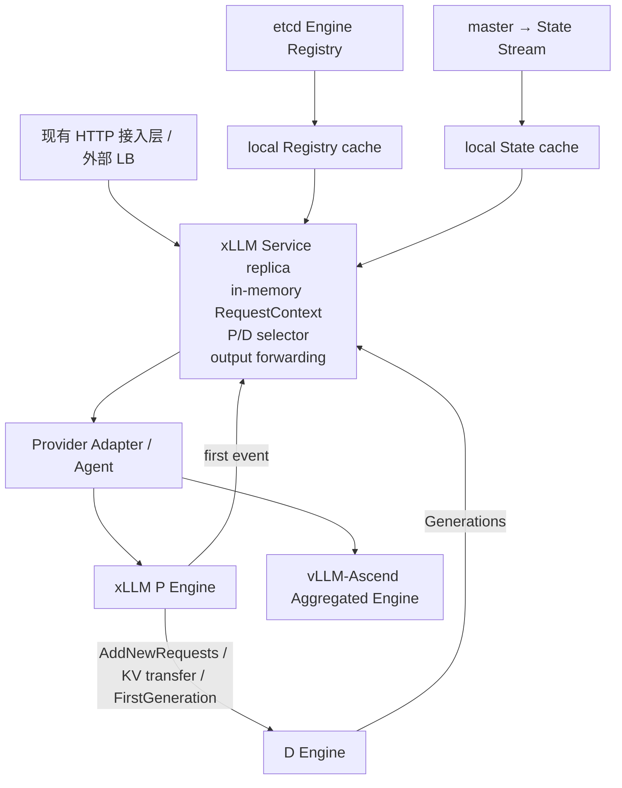
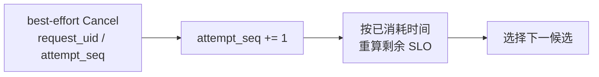
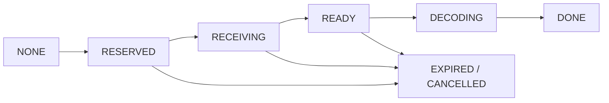
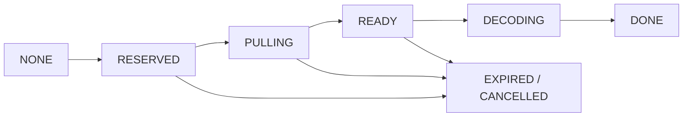
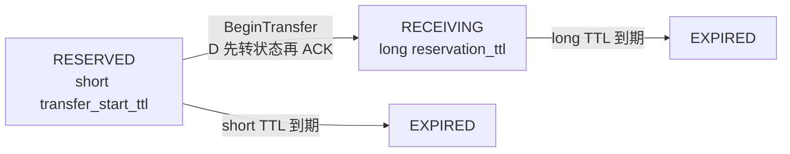

# xLLM Service V2 基础协议规格（原 V1 能力集）

> 版本口径：首个产品版本直接交付 V2，不存在独立 V1 版本。本文为保持既有
> 评审编号可追溯而保留的 “V1” 表述，全部解释为 V2 内部基础门 `V2-B0`；
> 它们必须与 08/09/11 的 V2 能力一起交付，不能单独上线或宣称完成。

## 1. V2 基础能力定义

**当前基线：** `Scheduler + InstanceMgr + LoadBalancePolicy` 已能从全量 Registry 为 xLLM 请求选出一个 P/D，但使用 3 秒 etcd 负载快照并在请求到达时锁定 D；旧 RR 可绕过状态新鲜度，Engine reservation 缺少完整 TTL、幂等和回收闭环。vLLM 由 sidecar 注册并经独立 HTTP relay 执行，当前依赖全局 `backend_type` 分支，尚未提供完整 Provider、能力、状态与 fencing 语义。

**V2-B0 结果：** 保留上述代码结构和成熟数据通路，增加公共 Engine Provider SPI，将后端分支迁入 `XllmNativeAdapter` 与 `VllmAscendAdapter/Agent`。多个无持久请求状态的 Service 副本共享实时 Engine 视图并生成 `ExecutionPlan`：xLLM Native 为“选定 P + 有序 D candidates”，vLLM-Ascend 首先为单个聚合 Engine。各 Provider 以本地原子操作决定最终准入。V2-B0 必须通过 Provider 对应的正确性、性能、容量和故障门禁，但通过该门不等于 V2 已交付。

V2-B0 范围为单 domain、单 `model_revision`，首批支持 `XLLM_NATIVE` 和 `VLLM_ASCEND`。xLLM P 池内实例使用同一种已验证 P profile，D 池内实例使用同一种已验证 D profile；P/D profile 可以采用不同 TP/DP 或设备数，但组合必须满足 KV layout、分片和传输兼容矩阵。vLLM-Ascend 先以经过 Provider Agent 门禁的 `AGGREGATED` profile 接入；其远程 P/D 不是 V2 首发范围。每个 Service 仍在内存中保存自己正在处理的 `RequestContext`，Provider Engine/Agent 执行本地硬准入和资源回收。

V2-B0 基础门：

- 内置 State Stream 取代 3 秒 etcd 负载快照，所有策略共用 `IsSchedulable`；
- 公共 Provider Descriptor、Capability、RequestCodec、EngineState 和 ExecutionPlan；
- xLLM Native 严格远程 P/D 与 vLLM-Ascend 严格聚合模式可以在同一控制面按能力选择；
- P/D 独立设置 desired count、安全人工扩缩容和动态组合；
- Engine 原子准入、reservation TTL、传输终态证明和完整资源回收；
- Service 多副本，新请求不依赖固定 master 副本；
- 首 token 前的容量冲突、P/D 故障和传输失败有界重试；
- 计划发布通过 LB 摘流和 drain 完成；
- 客户端携带完整历史的多轮请求，每轮独立完整 Prefill；
- M0/M1/M2 三步选择算法按 workload bucket 灰度。

V2-B0 本身不包含请求级持久状态、跨 Service 接管、结果 replay、策略感知 Service 侧队列、动态多模型、精确全局 KV 索引、跨 domain、Decode 状态迁移和 Store KV。V2-B0 的过载语义按 STRICT/BEST_EFFORT 契约稳定拒绝；完整 V2 必须继续按 08/09 加入有界 flow control、多模型和精确 HBM KVIndex，不能在该基础门停止开发。

V2 首发不把所有请求直接切到新 Provider 动态池。请求只有同时满足以下条件，才进入对应执行模式：

1. Provider Descriptor 完整，`provider_id + profile_digest + incarnation_id` 有效，目标 mode 的 capability 与 conformance test 均通过。
2. 只生成一条候选结果，即 `n == 1 && best_of == 1`。
3. `model/tokenizer/template/API feature` 与目标 Provider 匹配；不能等价转换的 Provider 特有参数固定路由。
4. 对 `REMOTE_PD`，Compatibility Resolver 按执行职责检查两端、handoff、KV layout、Connector 与 topology transform；该 pair profile 已通过正确性与故障测试。
5. 首次生产远程 P/D 只开放 xLLM Native 可靠逐层 PUSH。vLLM-Ascend PULL/layerwise PUSH 只有在 Adapter 补齐硬准入、attempt、deadline、取消和 GenerationCommit 并通过专用门禁后才可加入。
6. vLLM-Ascend `AGGREGATED` 必须经 Provider Agent 入口，具备可靠健康、带标签状态、deadline、cancel 和 ingress fencing；旧 sidecar/raw relay 只进入显式 BEST_EFFORT 兼容 bucket。

满足以上条件并通过上线门禁的生产 bucket 默认进入 Provider 动态池。不满足条件的请求继续使用现有单对或 relay 兼容路径，避免上线删掉已有功能；兼容路径不是 V2 的主调度方案，也不能绕过 Registry identity、稳定错误、Service readiness 和本地资源保护。跨 Provider P/D 默认禁止。

## 2. 组件与状态边界



- Service 进程是其在飞请求唯一输出决策者；进程崩溃后不恢复 RequestContext。
- etcd 只保存 Engine/Service 静态身份、能力和 lease；请求路径与高频 Engine 状态不写 etcd。
- V1 内置 State Stream 扇出高频软状态；陈旧只影响选择质量。
- Provider Engine/Agent 是本地 allocator、reservation 和 scheduler 状态的唯一权威；Adapter 不能用软指标伪造容量承诺。
- V1 没有 Coordination Store、Request Journal、Engine manager 和分布式 Commit。

| 状态 | V1 存放位置 | 是否持久/权威 |
| --- | --- | --- |
| 当前请求、计划、重试、输出排序 | 接入 Service 的 `RequestContext` | 不持久；仅当前请求权威 |
| Provider、版本、Engine profile、能力、lifecycle、lease | etcd + Service Registry cache | Registry Descriptor 权威 |
| queue、KV/credit headroom、延迟 | State Stream + Service State cache | Engine 权威的可丢失观测 |
| reservation、KV tensor、Decode、transfer handle | P/D Engine | Engine 权威，不进入 Service |
| prompt/output 日志、业务幂等、会话文本 | Gateway/上层应用按策略处理 | 不由 V1 持久化 |

## 3. 标识与不变量

### 3.1 标识

```text
global_request_id Gateway 生成并全链路透传的关联 ID
trace_id          跨组件 span 关联 ID
request_id        API/业务追踪 ID，可与 global_request_id 不同
request_uid       一次请求执行的 UUIDv7 ID；不是连接 ID，也不是业务 request_id
attempt_seq       Service 内从 0 单调递增的重试序号
model_revision    不可变模型版本
provider_id       XLLM_NATIVE | VLLM_ASCEND
profile_digest    Runtime/插件、角色、硬件、并行、KV、Connector、scheduler 和协议能力摘要
incarnation_id    Engine 本次进程身份
link_class        V1 固定 intra_domain
```

Gateway 生成并透传 `global_request_id/trace_id`；直连或缺失时由 Service 补齐并标记来源。两者只用于观测，不参与去重、资源所有权或重试。`request_uid` 由接收请求的 Service 无协调生成；V1 直接升级现有 wire 字段 `service_request_id` 的生成规则和语义来承载它，不并行维护第二个执行 ID。客户端重试生成新 UID。P/D 所有运行对象和 RPC 幂等键使用 `(request_uid, attempt_seq, incarnation_id)`，不能只使用业务或观测 ID。

V1 不提供跨 Service 的请求去重或 exactly-once 生成。`request_id` 只用于业务追踪；客户端在结果不明时重试会创建新的 `request_uid` 和一次新的生成执行，业务幂等由 Gateway 或上层系统负责。

### 3.2 不变量

1. 同一时刻只有当前请求的协调 Service 副本可以向该请求的响应流交付输出。
2. P/D 资源只由 Engine 本地原子准入授予，Service 软状态不构成容量承诺。
3. P submission、D reservation 和 output subscriber 都有本地时限，超时必回收；V2 local submission 同样受 request deadline、queue TTL 和 tombstone 约束。
4. 传输终态未证明前，源/目标内存不得重新分配。
5. Provider/profile 未通过显式模式兼容矩阵时 fail closed。P/D 模式按 `P/D provider + profile + model_revision + kv_layout_digest + connector/version + transfer_mode + topology_transform` 验证；不要求两端 `profile_digest` 相等，但跨 Provider P/D 默认禁止。
6. 任何执行模式只能在自身的 `GenerationCommit` 屏障成立后向 Service 交付 `output_event_seq=0`：`AGGREGATED` 以 Provider 原子接受完整请求并建立唯一输出 attempt 为准；`REMOTE_PD` 以 P 获得 D `FirstGeneration` ACK（D 已进入 `DECODING/DONE`）为准；V2 `LOCAL_PREFILL_DECODE` 以 D 原子授予完整 mixed Prefill+Decode 资源并安装幂等 local submission 为准；`PREFILL_ONLY` 以 P 原子准入已确认无后续 D 的完整执行为准。后两种模式不属于 V2-B0 内部门，但属于 V2 首发范围；`first_token_emitted=true` 后当前 attempt 不再自动替换。
7. Service 只向客户端交付当前 attempt 连续的 `output_event_seq`，跨 P/D 乱序不得造成 token 缺失或重复。
8. 同一 `request_uid` 同时最多存在一个 outcome 不明的 **执行资源持有**：`REMOTE_D_RESERVATION`、`LOCAL_DECODE_SUBMISSION` 和 `AGGREGATED_EXECUTION` 都计入，普通 P submission 不计入。`max_unresolved_execution_holds_per_request=1` 是固定协议常量；它防止重试在多个执行单元并发占用 KV/credit/slot 或完整生成容量，不声称任意时刻最多只有一个进程在计算。已证明进入 `GenerationCommit/DECODING` 的旧 attempt 在 cancel 传播期间可与新 attempt 短暂重叠，但必须先发 cancel，Service 丢弃旧输出，且重叠计入 retry/device-time 浪费预算。远程 hold 的安全作用域是 plan 的有界 D 候选集，聚合 hold 的作用域是已提交 Agent/Engine；Query 的 `ABSENT` 只是观测，只有 terminal outcome、已安装的 cancel fence、self-fencing/进程终止，或全部硬 duration 上界成立才能解除。普通 P submission 仍不计入该常量。
9. Provider 动态池、RR/CAR/SLO-aware 和兼容 fallback 共用同一 `IsSchedulable`。正常观测下必须检查 Descriptor、目标 mode capability、Registry lease、READY lifecycle、Engine/Agent heartbeat hard TTL 和 state hard TTL；观测失明时只能按第 8.1 节使用缓存状态或近期直接成功证据，任何路径都不能绕过 Registry 身份、本地硬准入或 Service readiness。
10. Engine/Agent lease ownership 使用 `OWNED | OWNERSHIP_UNCERTAIN | FENCED`。单次 keepalive 失败先进入 UNCERTAIN、停止新工作；其本地 monotonic deadline 早于最近一次确认续约加 lease TTL 再减 drift margin。恢复 ownership 可回到 OWNED；deadline 到期、键消失/被覆盖或发现新 incarnation 时进入不可逆 FENCED。FENCED 后禁止用旧注册 value 复活，只能以新 incarnation 重新 load/warmup/health/READY。vLLM-Ascend Agent 必须阻断绕过 ingress 或终止受控进程；lease 失效本身不天然证明计算/DMA 已停止。
11. 远程 P/D 候选必须同时满足两端 `IsSchedulable` 和 `(P incarnation,D incarnation)` 的 `LinkState=READY`。注册成功不等于任意 pair 已连通；单个 link 失败只降级该 pair，不能回滚其他健康 link。
12. 请求只跨进程传递剩余 duration，不传业务绝对 deadline。Provider Engine/Agent 接收时转换为本地 monotonic deadline，并在排队、Prefill 和每次 Decode 调度边界检查；到期以 `DEADLINE_EXCEEDED` 正常终态停止并释放资源，不能依赖 Cancel 必达。

重复内部计算是有界资源浪费，不是客户端正确性问题。Service 只转发当前 `attempt_seq` 的输出；旧 attempt 的迟到输出直接丢弃并触发 cancel。

## 4. Provider 与执行计划选择

### 4.1 统一接口

```text
SelectPlans(SchedulingContext, ClusterSnapshot) -> [ExecutionPlan]

ExecutionPlan = {
  provider_id, mode, transfer_mode, selection_order,
  selected_roles[{role, engine_uid, incarnation_id, order_index}],
  p_selection_delegated, binding_stage,
  compatibility_proof, provider_payload,
  prediction: {ttft_ub, tpot_ub, completion_ub, uncertainty},
  resource_estimate, score, reason_codes
}

XllmRemotePdPayload = {
  selected_p,
  ordered_d_candidates[0:max_d_candidates_per_plan]
}
```

选择器先按 Descriptor、11 §4.3 的 mode/capability 矩阵、API 兼容和 SLO 硬过滤，再在可行计划间排序。绑定顺序由 `(provider_id, mode, transfer_mode)` 的 Descriptor 声明：xLLM `REMOTE_PD + LAYERWISE_PUSH` 为 `P_FIRST`，固定一个 P 并生成有限 D 候选；vLLM-Ascend `AGGREGATED` 为 `SINGLE`。未来 `D_FIRST` 计划允许 Provider 委托选择 P，但必须在 attempt status 回填实际 P；V1 对该 profile 稳定拒绝。Provider 本地结果决定是否真正获得资源。算法版本、Provider/profile、特征 schema、预测版本、OOD 和 fallback reason 全部打点。

该接口是现有 `LoadBalancePolicy::select_instances_pair` 的演进，不是新建并行调度器。灰度期保留 RR/CAR/SLO-aware 和 raw relay 作为兼容策略；动态策略统一返回 `ExecutionPlan`，按 Provider/mode/profile/workload bucket 切流。收益对照使用各 Provider 当前生产基线，不能把两套 Runtime 的 trace 混成一个基线。

### 4.2 V2-B0 三步迭代

| 版本 | 算法 | 上线条件 |
| --- | --- | --- |
| M0 | 硬过滤 + queue/token/KV 保守上界 + power-of-k | 资源正确性、性能和失衡收益门禁通过 |
| M1 | 复用 [Engine 建模](./03_XLLM_INFERENCE_ENGINE_MODELING_DESIGN.md)的 Prefill/Decode 预测 | 区间覆盖率和规则基线 A/B 通过 |
| M2 | 加入 Service 处理开销、P 排队、状态陈旧、准入冲突和在线 residual 校准 | SLO goodput 置信下界优于 M1 |

三个版本共享同一 Provider Contract，不要求共享内部 Engine 协议，可按 Provider/profile/workload bucket 独立灰度。M0 永久保留为模型 timeout/OOD fallback。

### 4.3 输入与上界

```text
request:
  global_request_id, trace_id, model_revision,
  prompt_tokens, token_count_quality, max_new_tokens,
  provider_api_features, runtime_profile, workload_class,
  output_tokens_quantile, output_uncertainty,
  priority, slo_class, ttft_slo, tpot_slo, deadline,
  n, best_of, required_capabilities

P:
  queue histogram by priority/SLO,
  running/waiting tokens, KV headroom,
  profile, health, state_age

D per rank/cache group:
  running/waiting sequences and tokens,
  free/held KV, decode credit, transfer headroom,
  profile, health, state_age
```

`prompt_tokens` 由目标 Provider 的 `RequestCodec` 按 Descriptor 中的 tokenizer/template contract 计算。STRICT 请求要求 exact 且 renderer digest 一致；否则只能使用经过覆盖率校准的保守上界或退出该 Provider。输出使用：

```text
output_tokens_quantile = min(
  max_new_tokens,
  Q_q(output_tokens | model, tenant, prompt_bucket, sampling_features)
)
```

API 未显式提供 `max_new_tokens` 时，规范化层必须使用该 API 已发布且有界的默认值，并记录为 `effective_max_new_tokens`；如果某入口没有有界默认值，该请求不进入动态池。任何默认值都不得静默扩成整个剩余模型上下文。

冷启动或样本不足时，`Q_q` 来自 BootstrapEnvelope 的保守先验并扩大 uncertainty/guard；模型 OOD 或 timeout 回退同一先验。实际输出超过预测时进入 `E_credit`，D 仍按本地增量资源检查执行，预测值不能绕过硬准入。

```text
ttft_ub(P,D) =
  p_queue_ub + d_admission_ub + prefill_ub
  + transfer_ub + first_generation_ack_ub
  + first_token_return_ub

tpot_ub(D) = decode_step_ub + output_return_ub

completion_ub =
  ttft_ub + max(0, output_tokens_quantile - 1) * tpot_ub
```

PULL 的搬运虽然在 FirstGeneration RPC 内执行，仍只计入 `transfer_ub`；`first_generation_ack_ub` 只覆盖校验、状态翻转、入队和 RPC 尾部，不能重复计时。

硬过滤先保证资源、协议和兼容性可行。`STRICT` 请求还要求候选满足剩余 TTFT、TPOT 和 request deadline；`BEST_EFFORT` 请求允许保留硬容量可行但预测超出 SLO 的候选。冲突与重试按实际已消耗时间重算，不加入正常延迟加法式；其概率和浪费 device time 单独进入错误预算。

SLO 准入按请求契约分档：默认 `BEST_EFFORT`，在 Engine 硬容量允许时可以继续准入，但必须标记 `slo_at_risk=true`，不能对外宣称满足 SLO；只有客户端显式要求 `STRICT` 时，无 SLO 可行候选才返回 `SLO_UNSATISFIABLE`。`BEST_EFFORT` 连硬容量候选也没有时返回 `CAPACITY_EXHAUSTED`，不能误报成 SLO 合同失败。

`d_admission_ub` 是可在选点前计算的保守上界：

```text
d_admission_ub = max_d_candidates_per_plan
  * (add_new_requests_rpc_ub + d_local_admission_ub)
```

实际命中首个成功 D 后即停止，实际尝试次数和额外 RPC 时延单独打点，不能用事后次数重新定义先验上界。

Prefix 在 V1 没有可靠全局索引，不进入硬过滤；使用 prompt 前缀一致性哈希作同分 tie-break。V2 打通真实 cache event 后再进入主评分。

### 4.4 公共硬过滤与 xLLM P/D 冲突处理

公共硬过滤只依赖可验证事实：Provider Descriptor 与 mode capability 完整、`IsSchedulable` 为真、incarnation 有效、模型/API/profile 兼容、状态未超过 soft TTL，并有保守容量余量。远程 P/D 还要求两端 layout/Connector/transfer/topology 兼容且 pair `LinkState=READY`。这些过滤同时用于现有单对和 relay fallback，不能直接调用不检查新鲜度的旧 RR，也不能把能力未知解释为支持。

D 把现有永久/临时判断暴露为结构化 `AdmissionResult`，其中不可变布局上永远不可容纳与当前资源不足必须分开：

```text
AdmissionResult = {
  status: ACCEPTED | PERMANENT_INFEASIBLE | TRANSIENT_EXHAUSTED,
  reason, retryable, retry_after_ms,
  selected_dp_rank,
  requested_blocks_by_rank, max_blocks_per_sequence_by_rank,
  free_blocks_by_rank, held_blocks_by_rank,
  reservation_id?, reservation_ttl_ms?
}
```

稳定 reason 至少包括：

```text
PROMPT_EXCEEDS_DECODE_KV_CAPACITY,
NO_DECODE_KV, NO_DECODE_CREDIT, DECODE_SLO_HEADROOM_EXHAUSTED,
BATCH_BUDGET_EXHAUSTED,
CAPACITY_CHANGED, STALE_INCARNATION,
RESERVATION_EXPIRED, ATTEMPT_CONFLICT,
RESERVATION_TTL_UNSUPPORTED,
TOMBSTONE_CAPACITY, TRANSFER_LIMIT,
NEGATIVE_FENCE_CAPACITY, ENGINE_DRAINING
```

`SLO_UNSATISFIABLE` 是 Service 的请求契约结果，不是 D 本地资源拒绝原因。

Service 在路由前用 profile 的真实 block/layout 上限计算 `required_blocks_by_rank`；若所有兼容 D 都满足 `required > max_blocks_per_sequence`，立即返回永久不可行错误，不进入候选重试。只有动态 headroom/credit/budget 不足才允许换 D 或按 `retry_after_ms` 做有界抖动退避，禁止固定周期盲重试。

D admission 在同一临界区检查 KV/credit/slot 和版本化的保守 Decode guard。该 guard 由离线 CapacityProfile 与本地实时快照生成，不调用 M1/M2；BEST_EFFORT 可以不保证本请求 SLO，但不能让新请求突破已准入 Decode 的最严格 TPOT guard。单请求预算检查失败必须原子回滚，只失败该请求，不能清空或污染同 batch 的其他请求。

Service 按 `engine + reason + workload bucket` 更新短期负缓存；P 在当前 RequestPlan 内尝试下一 D，全部失败后由 Service 生成下一 plan。冲突率越界先扩大 guard，仍越界则该 bucket 回现有单对路径；负缓存只影响排序，不替代 Engine 健康状态。

并发请求可以基于同一软快照选中同一个 D。D 本地锁域保证最后一份资源只被一个请求获得；P 在同一 RequestPlan 内最多尝试 `max_d_candidates_per_plan` 个 D，全部失败后才把稳定原因返回 Service 并结束本次 P attempt。确定拒绝可以立即试下一 D；timeout 结果不明时，P 必须 Query/cancel，并在终态或 TTL 到期前停止创建新 reservation，保证 `max_unresolved_execution_holds_per_request=1`。V2 本地 submission、聚合 submission 和跨模式切换复用同一闸门，见 09 §2.1。

目标 Engine 的权威 Registry DELETE/revoke 已被带 revision 观测，或 `incarnation_id` 已变化时，旧 incarnation 立即进入 `MEMBERSHIP_LOST`，下一次选择不得再产生指向它的新计划；宽限只收敛在飞请求。heartbeat、地址探活和 watch 恢复都不能把它恢复为成员，只有携带新 incarnation 的重新注册可以恢复。watch 断连、重新 list 的歧义或探活失败不等价于权威 DELETE，统一进入 §8.1 的 `REGISTRY_BLIND`/状态降级，不能误驱逐成员。只有 Engine self-fencing 契约已生效、部署系统确认旧进程终止，或 Query/TTL 已证明 reservation 终态时，才可把成员丧失作为旧 reservation 的终态证明并立即尝试其他 D。若只是成员资格丧失而物理终态未知，旧输出会被 incarnation/attempt fencing 丢弃，但 transfer 涉及的内存仍须 cancel、等待终态或 quarantine。

P 记录 `plan_age_at_admission_ms`。M0 在预计 P queue wait 超过候选陈旧度预算时优先选择更短队列 P，或在不突破候选上限时扩大 D 列表；P 不重新评分。Service 重试时必须排除该 request_uid 上仍有未证明执行资源持有的执行单元，并监控 `plan_failure_after_queue_wait_rate`。

P 将被拒 D 的 reason 在首事件中捎带给 Service；全部失败时通过 attempt status 立即返回。反馈丢失只影响负缓存质量，不影响 D 本地资源正确性。

现有单对 fallback 与动态池只允许候选生成和绑定时机不同，必须共用同一 Engine allocator、reservation/TTL、状态缓存和容量指标，禁止维护第二套资源账本。fallback 按 workload bucket 开关；当目标能力矩阵全部被动态池覆盖、连续 `fallback_observation_window` 通过第 12 节门禁且回滚演练完成后，逐 bucket 关闭单对 fallback。M0 规则算法永久保留，但不等于永久保留旧执行路径。

## 5. 请求执行流程

### 5.1 Service RequestContext

```text
RequestContext = {
  global_request_id, trace_id,
  request_id, request_uid, attempt_seq,
  normalized_request, prompt_tokens,
  model_revision, priority, slo_class, stream,
  effective_max_new_tokens,
  request_deadline, remaining_deadline_ms, first_token_emitted,
  next_output_event_seq, bounded_reorder_buffer,
  current_plan, current_provider, current_p, current_d,
  unresolved_execution_hold,
  retry_budget, consumed_attempt_device_ms
}
```

RequestContext 只在内存中存在。CanonicalRequest 只规范化一次；Provider `RequestCodec` 的 tokenized/HTTP 表示按 `provider_id + profile_digest` 缓存并在同一 Service 内重试复用，不能把 xLLM token 输入直接复用于 vLLM-Ascend。副本崩溃时连接中断，客户端重试会创建新的 request_uid。

请求终止不等于 hold 已收敛。需要提前返回错误时，Service 把 `request_uid + attempt_seq + hold_kind + potential_holders + likely_holder? + local_cleanup_deadline?` 移入有界 `ExecutionHoldCleanup` 表，继续 Query/cancel/fence；它不保存 prompt、输出、parser 或重试状态，不用于恢复请求。Service 在安装 hold 前先原子预留一份 cleanup capacity token；RequestContext 存活时由它持有，请求提前终止时把同一个 token 连同最小记录移入 cleanup 表，hold 收敛后释放。没有 token 时在发送任何 RequestPlan 前返回稳定 `SERVICE_CLEANUP_CAPACITY_RETRYABLE`，不能先 dispatch、再赌清理表仍有空位，也不能丢弃旧记录。

cleanup 记录数/字节按 Service、ModelPool 和 workload bucket 固定硬上限：

```text
cleanup_record_capacity >= safety_factor * (
    peak_active_request_unresolved_execution_holds
  + peak_request_termination_before_hold_rate
    * max_execution_hold_auto_terminal_after)

cleanup_bytes_capacity >=
  cleanup_record_capacity
  * max_cleanup_record_bytes(max_potential_holders_per_plan)
```

`max_potential_holders_per_plan` 对远程 P/D 等于 `max_d_candidates_per_plan`，对本地 D 和聚合模式等于 1。

`max_execution_hold_auto_terminal_after` 取该 pool 已开放 mode 的硬收敛上界最大值。公式适用于启用时间证明的 profile；禁用时，以平台保证的 terminal/fencing/restart 收敛硬上界替换。平台连该上界也没有时，任何有限容量都只能保证内存安全，不能保证故障下持续接流；token 用尽后必须 fail closed、告警并继续清理，readiness 仍按 §8.1 的统一规则处理。两个 peak 都按 attempt 而不是进程故障事件计数，并用单副本故障 burst 校准。容量压力本身不改变 Engine 身份。Service 崩溃时该易失表/token 可以丢失，Provider 本地 fence、TTL 和 self-fencing 继续收敛资源，这不改变“不跨副本恢复请求”的边界。

`local_cleanup_deadline` 只在存在可执行的硬时间证明或硬 fencing 收敛上界时设置；到点触发证明检查，不是无条件删除记录。没有硬上界时该字段为空，记录只能由实际 terminal/fence/fencing proof 清除。

### 5.2 xLLM Native 远程 P/D 正常流程

1. Service 生成 request_uid，创建 RequestContext。
2. 生成 `REMOTE_PD + LAYERWISE_PUSH` 计划；硬过滤、预测、排序，只保留两端可调度且 LinkState READY 的 pair，选定 P 并生成有限的有序 D candidates。
3. Service 先预留 cleanup capacity token，并在 `RequestContext` 上原子安装 `unresolved_execution_hold(kind=REMOTE_D_RESERVATION, proof=OUTCOME_UNKNOWN, potential_holders=ordered_d_candidates)`，再向 P 下发 RequestPlan、request_uid、attempt_seq 和当前 `remaining_deadline_ms`；任一步失败都不发 RPC，并释放 token。P 接收后转换成本地 monotonic deadline，转发 D 时重新计算剩余 duration。候选集合在安装时即以 incarnation 固定；P 成功创建 reservation 后通过 attempt status 回填 `confirmed_holder` 和 proof。异步 `ReserveIntent` 只能写 `likely_holder`、优化清理顺序，不能删除安全候选集合。
4. P 在 scheduler 即将 admit 时依序调用候选 D `AddNewRequests`，不重新打分。
5. 首个成功的 D 原子分配 KV/credit/slot，返回 block/slot、实际 `reservation_ttl_ms`；全部拒绝则 P 把稳定原因返回 Service。
6. P 执行 Prefill，并按既有能力逐层 PUSH KV。
7. P 调用 D `FirstGeneration`；D 校验 key、TTL、布局和传输状态，入 Decode queue 后返回明确 ACK。
8. P 收到 ACK 后才向发起 Service 上报首 token；P 首事件携带 `output_event_seq=0`，Service 只接受当前 attempt_seq 的连续事件。Service 将首事件成功写入其响应流边界后设置 `first_token_emitted=true`；该字段不声称客户端进程已经读取该字节。
9. D 通过 `Generations` 从 `output_event_seq=1` 起返回后续事件；P 等首 token 回调完成后释放本地请求与 KV。
10. 完成、取消、订阅断开或本地 deadline 到期后，Engine 停止后续 step，释放全部资源并写短期 tombstone；deadline 使用 `DEADLINE_EXCEEDED`，与故障 cleanup 分开统计。

不同请求的 `AddNewRequests` 由 P 按目标 D 进入有界异步 dispatcher，可在不改变 RPC 结果语义时批量发送；scheduler 线程不等待网络。单请求内部仍按候选顺序推进，前一候选 outcome 不明时必须先按 Query/cancel/hold 规则收敛，不能用并发扇出换吞吐。

FirstGeneration ACK 是 P→D 点对点 handoff 确认，不写共享 Store。相同 `(request_uid, attempt_seq)` 和首事件参数的 FirstGeneration 必须幂等：D 已处于 DECODING/DONE 时返回 `ALREADY_ACCEPTED`，不得二次入队；同 key 参数不一致返回 `ATTEMPT_CONFLICT`。RPC 结果不明时 P 先 Query；D 已进入 Decode 等价于 ACK 成功，READY 且 TTL 有效时重试同 key，其他状态先 cancel 并等待终态。确定失败且 `first_token_emitted=false` 时，P 保留源 KV，只能在旧候选明确拒绝且未创建 reservation，或旧 reservation 已证明 terminal 后，才可在剩余预算内对下一候选重新 Reserve 并完整传输；`PROVEN_PRECOMMIT` 必须先 cancel 并取得 terminal proof，已启动传输还受不变量 4 和 §6.4 约束。现有 `finished_on_prefill_instance` 继续标识 P 首事件，`output_event_seq` 处理 ACK 后 P/D 两路乱序。

### 5.3 首 token 前重试

以下失败允许进程内重试：P/D 准入拒绝、P/D 失效、FirstGeneration 拒绝、传输失败或 deadline 预测失效。



重试判定是确定性的：仅当 `first_token_emitted=false`、retry budget 未尽、剩余 deadline/SLO 可满足，且重算不会超过 `max_nonstream_retry_wasted_device_ms` 时才创建新 attempt；否则明确失败。流式请求在首 token 写出后自然不能重试；非流式请求即使尚未向客户端写出，也不能在已消耗大量 Decode 后无限从头重算。所有被丢弃 attempt 的 device time 计入 `retry_wasted_device_ms` 门禁。

网络 timeout 后先 Query/cancel；无法证明的旧 Decode 资源持有继续隔离到 TTL/传输终态，同一请求在它收敛前不能向另一个 D 创建 reservation 或 local submission，也不能把旧 block 当作已释放。只有 self-fencing、进程终止或本地协议终态已得到证明时才允许提前收敛；Registry lease 过期本身只完成成员 fencing。若 Query 证明旧 attempt 已 `GenerationCommit/DECODING`，该持有不再是“结果不明”；仍要先发 cancel，且只能在重试和浪费预算允许时开始新 attempt。

P 在回填 `confirmed_holder` 前失联时，Service 对 `potential_holders` 逐一发送 Cancel，扇出不超过 `max_d_candidates_per_plan`。每个候选只有满足以下任一证明才算收敛：已有 terminal outcome；Cancel ACK 证明 `CANCELLED_BEFORE_CREATE` fence 已安装；对应 incarnation 已 self-fence/进程终止；或从 hold 安装起已经过 P submission、P queue、D admission、P→D RPC、reservation TTL 与扫描 jitter 的全部硬 duration 上界之和。Query 未知 key 返回的 `ABSENT` 单独不构成证明。无法在请求 deadline 内收敛时先终止请求并转入 `ExecutionHoldCleanup`，不得为了重试删除 hold。

时间兜底全部使用各进程本地 monotonic duration，不传递跨机绝对 deadline：

```text
reservation_creation_horizon_ub =
    p_submission_rpc_lifetime_ub
  + p_max_queue_wait
  + d_admission_ub
  + add_new_requests_rpc_lifetime_ub

remote_d_hold_auto_terminal_after =
    reservation_creation_horizon_ub
  + max_reservation_ttl
  + ttl_scan_jitter
  + cleanup_guard
```

这里的 RPC lifetime 是调用方、transport server queue 和 handler 都必须执行的硬上限，不是延迟预测；P 的本地 submission TTL 到期后也不得再发旧 attempt。若平台不能证明这些硬上限，Service 不得用时间解除 hold，只能等待 fence/terminal/self-fencing，并让当前请求明确失败。

### 5.4 PREFILL_ONLY

`max_new_tokens == 1 && n == 1 && best_of == 1` 且 P capability 已验证时，Service 生成不含 D candidates 的 `PREFILL_ONLY` plan，P 独立完成且不创建 D reservation。其他请求进入普通 P/D 流程。现有 `finished_on_prefill_instance` 路径继续使用，不增加终态 Store。

### 5.5 vLLM-Ascend 聚合流程

1. Compatibility Resolver 按 11 §4.3 验证 Provider Descriptor、renderer/API feature、`AGGREGATED`、`ATTEMPT_QUERY`、`CANCEL_FENCE`、`ENGINE_LOCAL_DEADLINE`、`SELF_FENCING`、`DRAIN` 和目标 SLO profile。
2. Service 选择一个 READY Provider Agent，预留 cleanup capacity token，并在 `RequestContext` 上安装 `unresolved_execution_hold(kind=AGGREGATED_EXECUTION, potential_holders=[agent incarnation])`；随后把 `CanonicalRequest` 经 `VllmAscendRequestCodec` 转换为 OpenAI 请求，并传递 request_uid、attempt_seq 和剩余 duration。安装失败时不发 Submit。
3. Agent 在本地 ingress 原子接受或以稳定原因拒绝；接受后代理 vLLM HTTP/SSE，保存有界 attempt 映射，并将首次有效 SSE 事件映射为 `output_event_seq=0`。明确拒绝或终态证明可清除 hold；Submit 结果不明时保留 hold。
4. Service/客户端断连、Cancel 或 deadline 到期时，Agent 调用 vLLM abort 并停止向旧 attempt 输出；即使上游 Cancel 丢失，Agent 的本地 deadline 仍必须结束请求。
5. Agent ownership 不确定时停止新接单，确认丢失时关闭 ingress 并 drain/cancel 或终止受控 vLLM 进程。Agent 与 vLLM 必须满足 11 §7.2 的同命和端口隔离前置；只有新 incarnation 完成目标 profile 要求的健康检查和 FULL State 后才能重新加入。

聚合请求没有远程 D reservation，但会占用整请求执行容量，因此必须进入统一 `ExecutionHoldCleanup`。Submit 结果不明时，Service 必须先对同一 key 执行 QueryAttempt/Cancel，取得 terminal、已安装 cancel fence 的 ACK、incarnation self-fence/进程终止，或以下全部硬时间上界成立之一，才能创建替代 attempt：

```text
aggregated_hold_auto_terminal_after =
    agent_submission_rpc_lifetime_ub
  + agent_admission_ub
  + vllm_abort_ub
  + fence_scan_jitter
  + cleanup_guard
```

QueryAttempt 返回 `ABSENT` 单独不是证明；未知 key 的 Cancel 必须先原子安装 `CANCELLED_BEFORE_CREATE` fence，再返回成功，迟到的 Submit 稳定返回 `CANCELLED`。平台无法执行上述硬上界时不得按时间解除，只能等待实际 terminal/fence/self-fencing，并让当前请求明确失败。Agent 不需要跨 incarnation 持久化 attempt：11 §7.2 的同命约束保证 Agent 消失时受控 vLLM 和持有一并终止；若部署不能证明同命，只能走 BEST_EFFORT，不能使用本节重试语义。当前只注册 raw vLLM 地址的 sidecar 不满足本节。

## 6. Engine 本地资源协议

### 6.1 P submission

P submission 包含 Service 返回地址、request_uid、attempt_seq、剩余 request deadline 和最大排队时长。排队超过本地期限、Service cancel 或 Engine drain 时直接释放，不允许孤儿请求无限等待。

`AddNewRequests` 从“P 收到请求”推迟到“P scheduler 即将 admit”，避免排队期占用 D HBM，同时保留逐层 PUSH overlap。

### 6.2 D reservation

**PUSH reservation**



**PULL reservation**



`AddNewRequests` 在一个 D 本地锁域内完成 DP rank、各 cache group KV、recurrent slot、decode credit、transfer quota 和 tombstone slot 的检查与扣减；任一失败整体回滚。reservation 不进入 Decode runnable queue。

`AddNewRequests` 以 `(request_uid, attempt_seq)` 幂等：相同不可变 reservation 参数的重试返回原 block/slot 和剩余 TTL，不重复扣资源；同 key 参数不一致返回 `ATTEMPT_CONFLICT`。RPC 结果不明时 P 优先重试同 key 或 Query，不能创建第二份 reservation。

P 在 scheduler admission 时根据真实 prompt/profile/transfer mode 请求 TTL，D 执行本地策略校验并返回实际 TTL：

```text
requested_ttl_ms =
  prefill_ub(prompt_tokens, profile, chunk_stall)
  + transfer_tail_ub + first_generation_rpc_ub + guard

effective_max_ttl_ms = ttl_limit(
  max_reservation_ttl, kv_headroom, held_kv, transfer_pressure)

if requested_ttl_ms > effective_max_ttl_ms:
  reject RESERVATION_TTL_UNSUPPORTED
else:
  reservation_ttl_ms = max(requested_ttl_ms, min_reservation_ttl)
```

D 返回实际 TTL，且只用本地 monotonic clock 判断。`ttl_limit` 在低 headroom 或高 held-KV 压力时可以降低本次可接受上限，但不得低于已发布的最小策略；拒绝使用稳定 `RESERVATION_TTL_UNSUPPORTED` 并上报压力分桶。没有 Renew、ticket、跨机 deadline 或远端 Commit。超过 D 当前可接受 TTL 仍无法完成的请求明确失败重选。

对 `layerwise_push_overlap=true` 且支持可靠控制 RPC 的组合，增加两级本地超时：



P 必须在第一次 DMA 写之前调用幂等 `BeginTransfer`。D 在同一本地临界区内先执行 `RESERVED -> RECEIVING`、切换长 TTL，再发送 ACK；ACK 丢失时 P 只重试同 key，D 返回当前状态。P 只有收到 ACK 后才允许第一次 DMA 写，因此仍处于 RESERVED 且短 TTL 到期时可以证明没有在飞 DMA，D 可直接释放。PULL 或不支持可靠 BeginTransfer 的平台不启用短 TTL，只使用长 reservation TTL；不能用“零接收字节”误判仍在 Prefill 的合法请求。

上述短 TTL 状态只适用于可靠逐层 PUSH。PULL 保持 RESERVED 到 FirstGeneration，在该 RPC 内执行 `PULLING -> READY -> DECODING`，由长 TTL 覆盖完整 Prefill、拉取和入队。

权威 Registry DELETE/revoke 或 incarnation 变化后，调用方必须立即停止向旧 incarnation 发送新动作并拒绝其迟到输出；Service 状态记为 `MEMBERSHIP_LOST`，heartbeat/探活不能恢复。若 Engine 已实现并通过 self-fencing 故障注入，可以把该 fencing 事件作为 reservation 的逻辑终态；否则还需要部署系统的进程终止证明或本地 Query/cancel/TTL。无论哪种情况，已启动的 DMA 都要独立证明终态，不能用成员状态替代 transfer cancel/drain/quarantine。

### 6.3 FirstGeneration 与 tombstone

D 只在 reservation 存在、attempt 匹配、TTL 有效且 transfer 可安全消费时接收 FirstGeneration。首次成功执行本地 `READY -> DECODING`，这是唯一入 Decode queue 的位置；同 key 重试返回当前 outcome，不能再次入队。

reservation 过期、cancel、完成或失败后写带 TTL outcome tombstone：

```text
(request_uid, attempt_seq) -> COMPLETED | CANCELLED | EXPIRED | FAILED
```

迟到 AddNewRequests/FirstGeneration 返回稳定 outcome，不创建第二份资源。tombstone TTL 必须覆盖最大 reservation TTL、RPC retry horizon 和 transfer drain 上界；它只用于 D 本地幂等，不跨 Service 复制。

tombstone 槽容量按下式固定，并远高于正常工作集：

```text
safety_factor * (
  peak_concurrent_active_attempts
  + peak_reservation_create_rate_including_retries * tombstone_ttl_seconds
)
```

每次成功 reservation 同时预留一个 slot；运行资源释放后，该 slot 继续保留到 tombstone 过期。未过期条目不得提前淘汰。

`TOMBSTONE_CAPACITY` 只是内存安全阀，不是常规流控：触发时 D 立即标记 UNHEALTHY、停止新准入并告警，Service 不得对同一 D 盲目重试。恢复前由其他 D 承接流量，避免“拒绝 -> 重试 -> 更多 tombstone”的正反馈。

`EXPIRED/CANCELLED` 是逻辑 outcome，不代表内存立即 FREE。存在未证明终止的传输时，资源继续留在 drain/quarantine 状态，直到第 6.4 节条件满足。

Cancel 与 Query 对未知 key 的语义必须分开：

- `QueryRequest` 返回 `ABSENT`，不分配状态；它只是一瞬间观测，不能阻止随后到达的 `AddNewRequests`，因此单独不能清除 Service hold。
- `CancelRequest` 在 D 本地锁域安装 `(request_uid, attempt_seq) -> CANCELLED_BEFORE_CREATE` 否定 fence 后才 ACK。迟到 `AddNewRequests/FirstGeneration` 返回稳定 `CANCELLED`，不创建资源。

fence 从 Cancel 到达 D 时起只使用 D 本地 monotonic clock，保留时间必须覆盖旧 P 仍可能排队、顺序尝试 D 和完成在途 RPC 的完整硬上界：

```text
negative_fence_ttl >=
    p_submission_rpc_lifetime_ub
  + p_max_queue_wait
  + d_admission_ub
  + add_new_requests_rpc_lifetime_ub
  + fence_guard
```

它不使用 Service/P 生成的绝对 deadline，避免引入跨机时钟正确性依赖。超过上述 RPC lifetime 的请求必须由 transport server queue/handler fail closed；若平台不能执行该硬上限，就不能启用 Service 的时间终态证明。

否定 fence 使用独立容量池，不挤占成功 reservation 预留的 outcome tombstone：

```text
negative_fence_capacity[D, bucket] >= safety_factor
  * peak_negative_fence_create_rate[D, bucket]
  * negative_fence_ttl

peak_negative_fence_create_rate[D, bucket] <=
  peak_p_failure_recovery_rate[pool, bucket]
  * max_d_candidates_per_plan
```

这里的 `peak_p_failure_recovery_rate` 是 P 故障后进入收敛的受影响 attempt/s，不是 P 进程故障事件/s；一次 P 故障携带的全部在飞 attempt 都必须进入 burst。容量按单 D 和故障 burst 校准。池满时返回 `NEGATIVE_FENCE_CAPACITY`，不得伪造成功 Cancel；Service 保留 hold。D 进入 `RECOVERY_FENCE_PRESSURE`、停止新的 Decode admission 但不 deregister、不 unlink、不清理在飞请求，降到固定 low watermark 后恢复。这样压力只能降级容量，不能通过漏装 fence 换取表面可用性。

### 6.4 transfer 回收

TTL 或 cancel 触发回收时：

1. 对 Mooncake Tent 逐 task cancel。
2. 轮询所有 task 到终态。
3. 无 cancel 能力时 drain transport。
4. 仍不可证明 DMA 终止时 quarantine/retire buffer generation。
5. 最后才允许重启 worker。

cancel 返回只表示请求被接受，不表示设备工作已停止。quarantine 仅用于传输终态不可证明，不是通用协议状态。

### 6.5 完整释放

所有出口共用一个幂等 `ReleaseRequestResources`，释放：

```text
KV blocks, recurrent slot, decode credit,
transfer handles, request/instance indexes, output queue
```

`unlink_instance`、TTL scanner、Cancel、FirstGeneration 失败和正常完成都必须调用该路径。禁止只 erase map。

这里的“释放”先撤销请求 ownership，再在 backing memory 没有异步读写者时执行物理复用。V1 只有 P→D transfer handle，不实现 Store connector；后续 connector 若从 KV backing memory 异步读取，必须把其 handle/read pin 或已完成 ownership 转移的 snapshot 纳入同一释放不变量：handle 未到 terminal 时原 block 不 FREE，终态不明时按第 6.4 节 quarantine。该通用约束不把 StorePutHandle 反向加入 V1 交付范围。

## 7. 输出通道

P 的首 token 和 D 的后续 token 都继续直达发起 Service，D 输出不经 P 转发。请求字段 `DisaggRequest.source_xservice_addr` 表示发起 Service 地址，Engine 生成输出时必须把它复制到 `RequestOutput.target_xservice_addr`；两者处于不同消息，语义上是同一个目的地址，不得混用为空值或回退地址。

`DisaggRequest.source_xservice_addr` 是请求协议必填字段，生成的每个 `RequestOutput.target_xservice_addr` 也必须非空。Engine 在任一转换点发现地址为空时必须 fail closed、终止对应请求并释放资源；禁止回退到 master xLLM Service，因为 master 只聚合软状态，不拥有 RequestContext。

V1 将当前 `brpc::Join` 聚合等待改为有界异步 dispatch：

- scheduler/response processor 只入队，不等待 Service RPC；
- 按目标 Service 和 request 隔离队列；同一 request 严格 FIFO；
- 单订阅方阻塞不影响其他请求；
- Service 只接受当前 request_uid/attempt_seq；
- Service 只交付从 0 开始的连续 output_event_seq；乱序事件进入有界内存 buffer，缺口超时终止当前 attempt；
- P 的首 token 使用同一 per-request FIFO 和 `output_event_seq=0` 有界重试；必须满足 `p_first_event_retry_ub + dispatch_margin <= output_gap_timeout_ms`。P 放弃投递时立即通过 attempt status 通知 Service，并 cancel 已知 D，不能让 Service 继续等满另一套无关计时器；
- D 订阅方连续不可达超过 `subscriber_unreachable_abort_ms` 时，主动终止该请求并释放资源；
- 队列满立即终止对应请求并释放资源，不能阻塞整个 Decode step。

`output_event_seq` 是 P/D 两个发送方之间的唯一正确性顺序。重排 buffer 位于 `Scheduler` 的 `RequestContext` 中，只有连续事件才提交给现有 request→thread 队列；线程亲和继续用于减少锁竞争和串行执行 callback，但不再承担跨发送方定序正确性。

Service 增加统一 `RequestWatchdog`，按 timer wheel 或等价有界扫描处理 `request_deadline` 和 `output_gap_timeout_ms`。超时必须原子完成三件事：向仍连接的客户端写明确终态、向当前 P/D 发送 `CancelRequest`、从 `requests_` 和输出线程映射摘除。`Generations` 收到未知或已终止的 `(request_uid, attempt_seq)` 时返回 per-item reject；Engine 将其视为 subscriber 拒绝并终止对应请求，不能继续无限发送。

RequestWatchdog/Cancel 是低延迟通知，Engine 本地 deadline 是容量安全兜底。P 在 submission queue、每个 Prefill chunk 前检查；D 在 admission 和每次 Decode batch 选序列时检查，并只移除过期请求，不清空同 batch。过期请求停止调度后进入统一 `ReleaseRequestResources`；已启动 transfer 仍按 §6.4 收敛。事件记录 `deadline_exceeded`、迟到 token/step 数以及停止和资源释放的本地 duration。

V1 不做 durable cursor、output replay 或 parser checkpoint。Service 崩溃时客户端看到连接断开，D 由 subscriber timeout 终止孤儿 Decode。

P 在 FirstGeneration 已获 ACK、但 seq=0 未送达 Service 时，Service 先 Query 当前 D。D 必须在 DECODING 期间保留 FirstGeneration 携带的有界首事件，并由 `QueryRequest` 返回；Service 用它补齐 seq=0 后继续交付。只有 Query 无首事件，且 `first_token_emitted=false`、retry/device/deadline 预算仍允许时才 cancel 旧 D 并重试；其他情况明确失败。

Gateway/Service 检测到客户端断连、请求 deadline 或主动 cancel 后，立即向当前 P/D 发送幂等 `CancelRequest(request_uid, attempt_seq)`。P 负责取消排队/Prefill 和已知 reservation，D 负责停止 Decode/output；传输中的内存仍按第 6.4 节收敛。取消传播不得等待自然生成结束；通知丢失时仍由 P/D 本地 deadline 停止执行。

## 8. Engine 状态与容量管理

### 8.1 状态分发

Engine 注册继续以 etcd lease 为唯一路径。V1 保留 master 收 heartbeat 的入口，但高频状态改由 xllm-service 内置 State Stream 扇出，不再每 3 秒写 etcd load-metric key：

```text
EngineState = {
  provider_id, incarnation, model_revision, profile_digest,
  lifecycle, ownership, shallow_health, deep_health,
  queue histogram by priority/SLO,
  per-DP running/waiting-by-reason tokens and sequences,
  P: dispatch backlog/inflight/oldest_age, prefill queue age,
  D: admission attempts/accept/reject by reason and latency,
  per-rank/cache-group max/used/held/free KV blocks and credit,
  decode active sequences, step latency, TPOT residual/headroom,
  mergeable latency histogram delta, connector state,
  field_quality, state_version,
  heartbeat_age_ms_at_publish, state_age_ms_at_publish
}

StateBatch = {
  master_incarnation, snapshot_seq, FULL | DELTA,
  repeated EngineState, repeated LinkState
}

LinkState = {
  p_provider/profile/incarnation, d_provider/profile/incarnation,
  PENDING | READY | DEGRADED,
  connector/transfer/protocol version, compatibility_proof,
  last_handshake_result,
  state_version, age_ms_at_publish
}
```

Adapter 必须保留 Provider 原始 label，再按资源语义聚合：counter/rate 可求和；同一 DP 内 TP rank 的 KV headroom 取最小值；不同 DP 的 KV usage 保留逐 DP，单值取选定 DP 或最坏值，禁止把 ratio 求和；延迟必须合并 histogram bucket delta 后再计算分位数，禁止平均 p95 或把 interval average 写入 `recent_max_*`。缺失值记为 `UNKNOWN`，不能补 0。详细规则见 [多引擎 Provider 设计](./11_XLLM_SERVICE_MULTI_ENGINE_PROVIDER_DESIGN.md) §5。

Engine 或同机 Provider Agent 必须监控自身 Registry lease。单次 keepalive 失败进入 `OWNERSHIP_UNCERTAIN`，拒绝新 submission/reservation 和新 transfer，但在 `ownership_uncertain_deadline` 前可继续在飞输出与收敛；ownership 被重新确认可回到 OWNED。deadline 到期、键消失/被覆盖或发现同名新 incarnation 时进入不可逆 `FENCED`，停止输出/KV event 并 cancel/drain 在飞工作。`ownership_uncertain_deadline <= last_confirmed_renewal_local + lease_ttl - drift_margin`。vLLM-Ascend Agent 还必须关闭本地 ingress，不能让调用方绕过 Agent 继续访问旧 vLLM 端口。旧进程即使网络恢复也不能以原 incarnation 返回 READY；`reconcile_registration` 禁止复用旧 registration value。部署系统仍负责最终终止进程和拉起替代实例。

master 的 `InstanceMgr` 为 Registry 中每个兼容 P/D incarnation 建立 LinkState。新 pair 先为 PENDING，成功完成目标地址和 peer incarnation 的幂等 handshake 后才 READY；失败只把该 pair 置为 DEGRADED，并按有界退避重试。周期 reconciler 对 Registry 兼容 pair 与 LinkState 做差集，补齐并发注册窗口遗漏并清除旧 incarnation；不得用“注册时全连接全部成功”替代对账，也不得因一个坏 peer 回滚其他 READY pair。

Service 本地缓存按 `soft_ttl/hard_ttl` 处理。正常观测下，soft TTL 内正常评分，超过 soft TTL 加 guard，单个 Engine 超 hard TTL 后从所有新请求候选中剔除并触发探活；不能用旧 RR 绕过新鲜度过滤。

State Stream 使用 master 到各存活 Service 的异步 `PushEngineState(StateBatch)`。现有 `service_name` 固定为 `ip:rpc_port`，member value 保持纯地址以兼容 xLLM Engine。统一 `ListServiceMembers` 必须在截取前缀前按完整 key 排除 `XLLM:SERVICE:MASTER`，再校验地址并去重。每个接收方最多一个在途 RPC，后续增量按 Engine incarnation 合并为有界 latest-map，不能阻塞其他接收方；超时后保留最新状态并在下一次成功时先发 FULL。

master lease value 和每个 StateBatch 都携带唯一 `master_incarnation`。Service 只接受 Registry 当前 master 的单调 `snapshot_seq`；旧 master 的迟到事件直接丢弃。keepalive 失败或主键已换 owner 时，旧 master 必须停止发送。新 master 先发 FULL，再发 DELTA。

两个 `age_ms_at_publish` 都表示 master 发布时距最近一次对应 Engine 样本的时长。TTL 不比较跨节点绝对时间；接收方接受 batch 时记录本地 monotonic 时间，实际 age 为 `age_ms_at_publish + receiver_elapsed_ms`。重复发布旧 Engine 状态不能把 heartbeat/state age 清零。

状态分发只改变路由健康，不能改变 Registry 成员身份。Service 独立维护三个信号：

```text
registry_known         Registry watch/读取正常，成员 lease/incarnation 可确认
state_fresh            State Stream 新鲜度满足迟滞判据
accepting_new_requests 当前副本是否可进入 LB 新请求路由
```

1. `OBSERVATION_NORMAL`：`registry_known && state_fresh`。`IsSchedulable` 要求 Registry lease 有效、lifecycle 为 READY、`engine_heartbeat_age <= engine_heartbeat_hard_ttl` 且 `state_age <= state_hard_ttl`；远程 P/D 还要求 pair LinkState READY。单个 Engine 陈旧时停止新分配并探活，但不进入破坏性的 `SUSPECT -> deregister`。
2. `OBSERVATION_STATE_BLIND`：Registry 正常，但陈旧 Engine 比例持续 `state_blind_enter_hold` 达到 `state_blind_enter_ratio`。进入后的 `state_blind_grace` 内，只对拥有最后良好状态且没有 RPC/探活失败证据的 Engine 保守路由并扩大 guard；宽限后只保留 `last_direct_success_age <= direct_evidence_ttl` 的 Engine。直接证据来自成功的 admission、Query 或轻量健康探测，不刷新旧负载值。只要仍有满足请求角色和兼容矩阵的 P/D 候选即可继续服务；否则停止新准入。
3. `OBSERVATION_REGISTRY_BLIND`：Registry 不可读，成员身份无法继续确认。热副本只在较短的 `registry_blind_grace` 内使用缓存 Engine 并扩大 guard，RPC/探活失败立即剔除；宽限耗尽后停止新准入。冷启动或空缓存副本始终不准入。
4. 退出 `STATE_BLIND`：接受 Registry 当前 master 的 FULL，且陈旧比例持续 `state_blind_exit_hold` 不高于 `state_blind_exit_ratio`。必须满足 `0 <= state_blind_exit_ratio < state_blind_enter_ratio <= 1`；进入/退出 hold 构成时间迟滞。未覆盖的单个 Engine 继续按陈旧处理。
5. master key 缺失或变化本身不触发模式切换。Service 保留最后合法快照，只有 Registry 可见性或状态新鲜度实际越界才改变模式；计划发布和非计划切主使用同一规则，不增加预选 master 或 handover 协议。
6. 任何软状态超时都不得触发成员删除、P/D unlink 或清理在飞请求；这些破坏性动作只由 Registry lease 失效、incarnation 替换或部署生命周期操作触发。

`state_blind_grace` 覆盖正常切主恢复，但不是无限使用旧负载的授权：

```text
state_blind_grace >=
  master_election_p99 + engine_master_redirect_p99
  + 2 * heartbeat_interval + full_snapshot_p99

0 < registry_blind_grace <= min_engine_registry_lease_ttl
```

HTTP/RPC listener 在进程存活期间保持运行；`/livez` 只反映进程存活，`/readyz` 在且仅在 `accepting_new_requests=true` 时返回 200，否则返回 503 和稳定 reason。以下任一条件成立时置 `accepting_new_requests=false` 并退出 LB READY：冷启动尚未加载 Registry/FULL、`REGISTRY_BLIND` 宽限耗尽、`STATE_BLIND` 下没有足够的近期直接证据候选或副本处于 DRAINING。listener 继续完成在飞请求和健康检查；请求 handler 也必须检查该原子状态，使已到达但与摘流竞争的新请求返回稳定 `SERVICE_NOT_READY`，不能通过停启 listener 表达 drain。恢复条件满足并持续 `readiness_recovery_hold` 后才重新 READY。瞬时 queue/KV/credit 不足不切 readiness，副本保持 READY 并返回稳定容量拒绝，避免负载尖峰导致全体副本同步摘流。

V2 的 Service 队列和 saturation detector 不改变上述观测模式。队列满单独出现时仍快速容量拒绝并保持 READY；本节要求退出 READY 时，禁止新入队，已 dispatch 请求按原协议完成，未 dispatch 队列请求返回稳定可重试错误。detector 的三态证据、失明 probe 与详细故障注入见 09 §5.3。

滚动启用 State Stream 时，先发布包含 `PushEngineState` 接收端和独立 readiness 的新二进制，暂时保留旧 etcd 负载快照；达到最小 `accepting_new_requests=true` 新副本数并排空旧副本后，再切换集群开关并停止高频 etcd 写入。最终 V1 不双写高频状态，也不修改 member value schema。

G0 记录现网 etcd 状态年龄和冲突率；G3/G4 测量 State Stream p99 延迟、带宽、有界队列、FULL 恢复时间、直接探测覆盖率和 readiness 收敛时间。Service 副本之间不交换请求状态，也不执行请求级 peer RPC。

### 8.2 初始容量与 V2 首发人工扩缩容

冷启动由 `CapacityProfile + BootstrapEnvelope` 驱动：

```text
CapacityProfile = {
  provider_id, provider_version, model_revision, engine_profile,
  prompt/output length grid, concurrency grid,
  prefill/decode capacity under SLO,
  per-rank max blocks per sequence, KV/credit limit,
  safe admission range and conservative Decode guard,
  prefix_hit_rate_assumption
}

BootstrapEnvelope = {
  peak_qps, burst_factor, slo_class_mix,
  prompt_length_buckets,
  prompt/output_length_means, output_length_quantiles,
  max_new_tokens_policy, prefix_hit_rate_assumption,
  bootstrap_admission_limit
}
```

G0 为每个 `provider_id + provider_version + profile_digest` 用合成请求独立生成 CapacityProfile，它不依赖业务流量。不同 Runtime、插件、scheduler 或 Connector 的样本不得混池。BootstrapEnvelope 优先来自业务容量目标，其次复用同模型/同租户历史；两者都没有时只能使用平台保守默认值并进入小流量 bootstrap，不能承诺未知峰值 SLO。

按 bucket 计算 `seed_P/seed_D`，再在附近离散搜索；最终 `initial_P/initial_D` 必须通过 BootstrapEnvelope 合成 trace 或历史真实 trace 重放：

```text
seed_P = ceil(sum_b(
  lambda[b] * prompt_tokens_mean[b]
  / prefill_capacity_tokens_per_s[b]
) / target_util_P)

seed_D = ceil(sum_b(
  lambda[b] * output_tokens_mean[b]
  / decode_capacity_tokens_per_s[b]
) / target_util_D)

seed_A[provider,profile] = ceil(sum_b(
  lambda_assigned[provider,profile,b]
  / aggregate_capacity_qps[provider,profile,b]
) / target_util_A)
```

`lambda[b]` 已包含目标峰值和 burst；分母使用 CapacityProfile 中同 Provider/profile/bucket/SLO 条件下的实测单实例容量。`lambda_assigned` 是联合搜索中的候选流量分配，不是预先固定的生产比例；无法通过 API/capability 门禁的 bucket 对该 Provider 取 0。容量公式用均值计算单位时间总工作量；输出分位数用于单请求 credit/风险和 trace 尾部，不进入速率公式。公式只给离散搜索起点，跨 Provider trace 重放结果才决定实例数量与分配策略。

CapacityProfile 默认以 0% prefix 命中生成，作为保守冷启动基线。若使用历史真实 trace，必须用目标动态路由重新模拟 prefix 归属，显式记录 `prefix_hit_rate_assumption`，不能直接沿用旧单对路由时期的命中结果。动态池上线前后 `prefix_hit_rate` 的变化进入性能门禁。

重放同时验证各 SLO bucket、突发窗口、KV 峰值、AddNewRequests 冲突率和声明的单 Engine 故障降级目标。承诺实例故障后仍可重选的生产池中，xLLM `min_ready_p/min_ready_d` 均不低于 2，vLLM-Ascend 聚合 Provider 的 `min_ready_aggregated` 不低于 2；如果资源不足，只能降低故障承诺并在能力状态中明确标记，不能假装可以重选或跨 Provider 接管不兼容请求。

V1 角色内实例同构时，若声明单角色可同时失效 `f_role` 个实例且不降低 admitted load，容量必须满足：

```text
target_util_role <= (ready_role_instances - f_role) / ready_role_instances
```

例如两个 D 承诺失效一个后零降级，则 `target_util_D <= 0.5`。不承诺零降级时，文档和能力状态必须给出故障后的 admission/SLO 降级值，不能只写 `min_ready >= 2`。

V1 由 Kubernetes/现有部署系统写入 P、D 独立 desired count；xLLM Service 只发现和调度 READY Engine，不直接创建或销毁进程。计划缩容由部署系统调用带 `incarnation_id` 的 `SetLifecycleState(DRAINING)`；Engine 在本地原子切换后立即拒绝新的 submission/reservation，再通过 Registry/State Stream 发布 DRAINING。Registry 标签不是唯一执行开关，持有旧 RequestPlan 的 P 也必须收到 `ENGINE_DRAINING`：

- 扩容：创建 Engine，完成模型 load、warmup 和健康检查，注册新 incarnation；Registry 和 State Stream 都观察到 READY 后才进入候选。
- 缩容：部署系统请求 Engine 进入 DRAINING；P 等待 queue/running/transfer 清零，D 等待 reservation/Decode/output/transfer 清零；随后设置 `drain_committed=true`、撤销 lease 并卸载。
- drain 超时：在 `drain_committed=false` 且尚未开始卸载时，部署系统可显式取消并恢复 READY；一旦撤销 lease、卸载模型或释放静态资源，当前 incarnation 不得恢复 READY，只能以新 incarnation 重新加载。其他情况保持 DRAINING 并告警，只有显式强制操作才能终止剩余请求。

启动顺序是：加载 `min_ready_p/min_ready_d` -> Engine synthetic warmup -> 健康检查 -> 开放受限流量 -> 收集每个 bucket 的真实 prompt/output/queue/SLO -> 达到 `min_samples_per_bucket` 后更新先验并人工调整 desired count。bootstrap 期间只允许扩容，不自动缩容。

V1 不根据瞬时利用率自动修改 desired count。自动预测、上下水位、cooldown 和角色转换属于 V3 Placement Controller。

### 8.3 请求事件与计时契约

V1 的 Gateway、Service、P、D 使用同一 `global_request_id + request_uid + attempt_seq + trace_id` 导出结构化事件。最小事件覆盖：接入与路由、P dispatch/D admission、Prefill queue/chunk/forward、KV transfer、首 token generated/ACK/flush、Decode step sample、完成/失败和资源释放。组件身份统一使用 Registry `incarnation_id`；每个 Admission attempt 恰好产生一个 ACCEPTED/REJECTED/FAILED 终态，不能依赖 IP、主机名或自由文本补齐。

每个阶段由拥有该阶段的进程用本地 monotonic clock 记录 duration：P 记录 dispatch RPC 与 Prefill，D 记录 admission/Decode，Service 记录 server TTFT/E2E。禁止相减两个起点不同的 duration。事件至少携带 `event_type`、owner/role/incarnation、profile、阶段 duration、token/KV/batch 规模、result、`error_stage/error_reason` 和 schema version；异步缓冲必须有界，丢弃量单独计数并报警，观测故障不阻塞请求。

结构化事件的唯一 wire 真相是 xLLM `xllm/proto/observability.proto`。`attempt_seq` 和 `event_seq` 必须保留 proto presence，值 0 分别表示首个 attempt 和首个事件，字段缺失才表示协议不完整。Service 侧 producer 只允许写入预分配的固定容量 ring；写锁竞争时立即返回并累计 `dropped_contention`，ring 满时累计 `dropped_capacity`，不得等待 exporter、扩张无界队列或反压执行路径。所有身份字段和 measurement boundary 在进入 ring 前执行长度上限校验。

报表按 `pool/model_revision/runtime_profile/workload_class/prompt_bin/output_bin/max_tokens/finish_reason` 分组。原始 Prompt、输出和 token 序列默认不记录。计时公式、关联覆盖率或事件缺失率未通过第 12 节门禁的数据，不得训练 M1/M2。

## 9. 容错矩阵

| 故障 | V1 行为 |
| --- | --- |
| Service 计划重启 | 先 surge READY 副本，再 LB 摘流；master 先释放聚合 lease；等待在飞归零后退出，强制 deadline 到期的剩余请求允许失败 |
| Service kill -9 | 连接中断，客户端重试；P/D 由本地 queue/reservation/subscriber TTL 回收 |
| 客户端断连或取消 | Service 立即向当前 P/D 传播 CancelRequest；本地 TTL 兜底 |
| P 首 token 前失效 | 已回填 D 时 Query/cancel confirmed holder；回填前失联时对 plan 候选集安装否定 fence。只有 hold 收敛后才在剩余 SLO 内重选；请求可先失败，cleanup 继续 |
| D 首 token 前失效 | self-fencing/进程终止/Query/TTL 已证明终态时立即换 D；只有 lease 过期或 outcome 不明时继续隔离，transfer 终态单独收敛 |
| D 已输出后失效 | 中断流，明确失败 |
| AddNewRequests 冲突 | 稳定 reason、负缓存、下一候选 |
| transfer 终态不明 | cancel、轮询、drain、quarantine，最后重启 |
| 单个 Engine lease 存活但 heartbeat 超时 | 正常观测下从所有新请求候选剔除并探活，不执行 deregister；新 heartbeat 和健康探测通过后恢复 |
| Engine 重启 | 旧 incarnation 退出候选且 KV location 失效；新进程使用新 incarnation，完成 load/warmup/health/Registry/FULL 后重新加入 |
| vLLM-Ascend Agent/Engine 失效 | 同命单元在 `agent_fate_bound` 内关闭 ingress、中止旧执行并释放资源；部署系统以新 Descriptor/incarnation 拉起完整单元，通过目标 profile 的健康门禁和 FULL 后加入。原始端口可旁路、Agent-only 崩溃仍留存 vLLM 或未证明 self-fencing 时只保留 BEST_EFFORT |
| `AGGREGATED` Submit 结果不明 | 保留统一 execution hold；Query/cancel/fence 或硬时间证明收敛前不创建替代 attempt，客户端请求可先明确失败但 cleanup 继续 |
| State Stream 陈旧、Registry 正常 | 进入 `OBSERVATION_STATE_BLIND`；宽限内使用最后良好状态，之后只使用有近期直接成功证据的 Engine；没有兼容 P/D 容量时退出 LB READY |
| Registry 暂时不可用 | 热副本在 `registry_blind_grace` 内使用缓存成员，超时退出 LB READY；冷副本保持 NOT_READY |
| master 切换 | key 变化本身不触发降级；仅 Registry 可见性或 State Stream 新鲜度实际越界时切换模式 |
| output subscriber 不可达 | D 有界等待后终止该请求，其他请求不受影响 |

## 10. RPC 最小改造

| RPC/路径 | V1 改造 |
| --- | --- |
| Engine Registry (etcd) | 继续作为唯一注册路径，增加 Provider/Runtime/插件版本、model/renderer/profile/topology/KV/Connector/capability/lifecycle；Engine/Agent 使用 OWNED/UNCERTAIN/FENCED，FENCED 后只能以新 incarnation 注册；删除未实现且无调用闭环的 `RegisterInstance` RPC/client |
| Provider data path | Service 调用统一 Adapter；xLLM Native 保留 brpc，vLLM-Ascend Agent 代理 OpenAI HTTP/SSE。公共语义一致，不要求共用 wire |
| Engine Heartbeat/State Stream | heartbeat 加 dispatch/queue、按 reason 的 Admission、per-rank KV/credit 和 Decode headroom；State Stream 同时发布 EngineState 与 LinkState，高频状态退出 etcd |
| `PushEngineState` | `rpc_service` 新增接收端；master 向 Registry 中存活的 Service 异步推送 `StateBatch`，每接收方单在途、latest-map 合并、超时后以 FULL 恢复；接收方应用 FULL 后返回 ACK 并更新 `state_fresh` |
| Service readiness | 增加 `/livez` 与 `/readyz`，后者暴露 `accepting_new_requests`；listener 不再随 `has_available_instances()` 停启，request handler 二次检查，NOT_READY 时保留在飞请求并拒绝竞争窗口内的新请求 |
| Service -> P request | 加 global_request_id/trace_id、request_uid、attempt_seq、有序 D candidates 和 `remaining_deadline_ms`；每一跳按本地耗时重新扣减 |
| P -> Service attempt status | 复用现有输出回调返回结构化 AdmissionResult、P admission 失败及稳定 reason |
| `AddNewRequests` | 返回永久不可行/临时不足/成功三态及 block/credit/退避信息；跨请求按目标 D 有界异步/批量，同请求保持顺序；重试保持幂等 |
| Link handshake/reconcile | 以 P/D incarnation 为键幂等建链并返回稳定 outcome；周期对账补齐并发注册遗漏，单 pair 失败不回滚其他 link |
| `BeginTransfer` | 仅可靠逐层 PUSH 使用；D 在本地临界区先进入 RECEIVING/长 TTL 再 ACK，P 收到 ACK 后才允许第一次 DMA 写 |
| `FirstGeneration` | 加 key；返回 `ACCEPTED/ALREADY_ACCEPTED/outcome`；仅首次成功入 Decode queue |
| `CancelRequest` | 按 request_uid/attempt_seq 幂等 cancel；未知 key 原子安装 `CANCELLED_BEFORE_CREATE` fence 后才 ACK，池满返回稳定 reason |
| `QueryRequest` | 返回本地 reservation/Decode/tombstone/fence 状态；未知 key 无副作用返回 `ABSENT`，但不构成 cancel proof；DECODING 且 seq=0 尚可能缺失时返回有界 FirstGeneration 首事件 |
| `SetLifecycleState` | 部署系统按 incarnation 请求 `READY -> DRAINING` 或在卸载前取消；Engine 本地先切状态再发布 Registry |
| `Generations` | 加 request_uid/attempt_seq/output_event_seq；改有界异步；subscriber 失败触发请求终止 |

RPC timeout 触发同 key Query 或 cancel，不创建分布式状态，也不需要签名 capability。V1 假设 Service 与 Engine 位于同一受信 domain。

所有跨仓 wire 类型必须来自单一 proto 源；若构建边界暂时无法共源，G-1 至少交付 descriptor compatibility CI、双向 golden wire test，并在两侧用 `reserved` 声明对方已占用 tag。仅有 ProtocolContract 文档不能作为字段号兼容性证明。

## 11. 开发顺序

**G-2 Provider Contract 与 Adapter 骨架（与 G-1/G0 并行，进入混合 Provider 池的前置）：** 冻结 ProviderDescriptor、Capability、CanonicalRequest/RequestCodec、EngineState 和 ExecutionPlan；建立 Adapter registry、per-DP 指标语义与 conformance harness，把全局 `backend_type` 分支迁到 `XllmNativeAdapter`/`VllmAscendAdapter`。

**G-1 xLLM Native 协议与确定性测试底座（与 G-2/G0 并行）：** 冻结单一 proto/descriptor，交付兼容性 CI、双向 golden wire test、两侧 reserved tag，以及 fake clock/allocator/transport；TTL、fence、deadline 和 incarnation 状态机先在该底座验收。

1. **G0 观测闭环与基线：** 先打通全链路 ID、实际 build/profile、每次 Admission attempt 终态、阶段事件和单调计时，再以现网 RR 为主对照测 TTFT/TPOT/SLO goodput、失衡与 Prefix 命中；计时或关联门禁未通过前不训练模型。CAR/SLO-aware 另列基线，固定 1P1D 只用于拆协议税。
2. **G1 资源与 handoff 安全：** Service 永久可行性预判、对齐/移植线上 Engine 已有的永久/临时判断并结构化暴露、单请求预算失败隔离、request_uid/attempt_seq、D 两级 TTL/tombstone、执行资源 hold、否定 fence/独立容量池、超出 RequestContext 的有界 cleanup、`GenerationCommit` 前禁止 seq=0、统一释放、unlink 修复、Engine self-fencing、transfer cancel/quarantine。
3. **G2 输出、取消与 deadline：** RequestWatchdog、P/D 本地 monotonic deadline、Generations 有界异步、seq 重排、per-request 队列、target Service fail-closed、client cancel 和 subscriber abort；vLLM-Ascend Agent 增加本地 ingress、deadline/abort、稳定错误与 SSE attempt fencing。
4. **G3 多副本视图：** 复用现有 Registry，交付完整 Provider Descriptor、`PushEngineState` 接收端、带标签 EngineState/LinkState、pair 周期对账、FULL-then-READY、内置 State Stream、master lease 降级、Agent/Engine 三态 ownership/incarnation fencing、`STATE_BLIND/REGISTRY_BLIND`、深层健康、独立 readiness 和统一 `IsSchedulable`；xLLM 动态池关闭 MIX 角色翻转。
5. **G4 Provider 动态池 M0：** 公共能力/API/SLO 硬过滤；xLLM 交付保守 Decode guard、稳定 reason、负缓存和首 token 前重试；vLLM-Ascend 交付严格 `AGGREGATED` mode。两者分别灰度和验收。
6. **G5 V1.x M1/M2：** 在 V1 State Stream 和统一选择接口上接入 EnginePrediction、ServicePrediction 和在线校准。

xLLM G1/G2 先在现有单对路径上独立验收，G-1 是其实现前置；vLLM-Ascend Agent 可在 G-2 后独立开发。G-2、G-1 和 G0-G4/M0 通过各自第 12 节门禁后形成首个双 Provider 生产版本。M1/M2 不改变 Provider Contract，不阻塞 M0 上线。

## 12. 上线门禁

### 12.1 正确性与资源

- xLLM Native 与 vLLM-Ascend Descriptor/Capability conformance 均通过；字段缺失、版本未知、能力未验证或 renderer digest 不匹配时 STRICT 请求 fail closed。
- 同一 Service 进程可同时发现并选择两种 Provider，结果不依赖进程级 `default_backend_type`；Provider 特有 API 参数不被静默丢弃或降级。
- Gateway/Service/P/D 的 `global_request_id + request_uid + attempt_seq` 关联覆盖率为 100%；每次 Admission attempt 恰好一个结构化终态，关键事件缺失率、异步丢弃率、build/schema/profile 版本可监控。
- 多 token 成功请求的 TPOT=0、负 ITL 和跨时钟域相减均归零；任何被 guard 丢弃的计时样本单独计数，计时无效时 M1/M2 fail closed。
- 10 万次 P/D 崩溃、RPC timeout、cancel、Service kill -9 和 transfer 故障序列后，无 KV block、credit、slot、handle 或 index 永久泄漏。
- 孤儿 P submission、D reservation 和 output subscriber 在本地 TTL + 扫描周期内 100% 回收。
- AddNewRequests/FirstGeneration 响应丢失后以同 key 重试不重复扣资源或入 Decode queue；参数冲突稳定失败。
- 迟到 FirstGeneration 由当前状态或 tombstone 稳定返回已有 outcome，不重新分配或入 Decode queue。
- P 在任一候选创建 reservation 后、attempt status 回填前失联时，Service 对有界 `potential_holders` 收敛；注入 Cancel 先于迟到 AddNewRequests、异步 intent 丢失/乱序、部分候选不可达、Service cleanup 超出请求生命期和否定 fence 池满，均不出现双份 D 持有。Query `ABSENT` 不清除 hold，只有 terminal/fence/fencing/硬时间证明可以清除。
- 在 hold 安装与 cleanup token 预留之间注入并发和容量耗尽；未取得 token 的请求不得发送 plan，已 dispatch 请求终止时总能把 token 转成最小 cleanup 记录。容量压测按受影响 attempt burst 而不是 P 故障事件数建模。
- 注入 `AGGREGATED` Submit 已接受但响应超时；Query/cancel/fence 收敛前不得并发生成替代 attempt，被放弃执行的 device time 计入浪费预算，一万次重复后无 slot/KV 泄漏。
- `remote_d_hold_auto_terminal_after` 与 `aggregated_hold_auto_terminal_after` 的每个硬 duration 分别做边界前后故障注入；平台无法执行对应 RPC/abort hard lifetime 时禁用该 mode 的时间证明。所有 Provider/Service timer 使用本地 monotonic duration，不依赖跨机绝对 deadline。
- 客户端不收到两个 attempt 的混合输出；`first_token_emitted=true` 后不再切换 attempt。
- P 在 D 接收 FirstGeneration 后、seq=0 到达前退出时，Service 不交付 seq>=1；先 Query D 补取首事件。取不到时，仅在 `first_token_emitted=false` 且 retry/device/deadline 预算均允许时 cancel 旧 D 并重试，否则明确失败。
- 对普通 P/D 请求，D 未 ACK FirstGeneration 时 Service 响应流写出的 token 数严格为 0；ACK 丢失后 Query 到 DECODING 可继续，TTL 过期和 D 拒绝可安全重选。
- 逐层 PUSH 的 RESERVED 在 transfer-start TTL 内无 BeginTransfer 时直接释放；PULL/非逐层长 Prefill 不被短 TTL 误杀。
- output dispatch 永不阻塞其他请求或 scheduler step。
- 空 `target_xservice_addr` 稳定失败且绝不投递 master；对应 P/D 资源有界释放。
- 不满足动态调度范围的请求稳定走现有单对路径，不被误拒或发送到不兼容 Engine。
- 现有单对路径与动态池并发压测不重复计算或超卖 Engine 资源。
- 客户端断连到 P/D 停止执行并释放可安全释放资源的 p99 时延低于 `client_cancel_propagation_ub`。
- 丢弃 Service Cancel 后，P/D 仍在本地 deadline 到期后停止；本地 scheduler 观察到 deadline 后不得再调度该请求，已在途 step 的迟到 token 不超过固定 `max_inflight_step_tokens`，`deadline_exceeded_to_stop_ms` 和 `deadline_exceeded_to_release_ms` 低于门禁。
- vLLM-Ascend Agent 的 OpenAI/SSE、disconnect/abort、deadline、稳定错误和输出 attempt fencing 通过测试；旧 sidecar/raw relay 沿用现有 BEST_EFFORT 路径且无不可接受回退。
- 仅 `SIGKILL` Agent 时，受控 vLLM 在 `agent_fate_bound` 内停止接单、中止在飞请求并释放 KV；原始端口隔离或同命任一失败时不得发布 `SELF_FENCING`。
- vLLM-Ascend 远程 P/D capability 默认关闭；跨 Provider P/D 有负向测试，不能因同名 Mooncake Connector 或伪造 capability 被放行。
- 注入瞬时 keepalive 失败时 Engine 进入 UNCERTAIN 而不全池重启；在最早 lease 失效前恢复 OWNED 或进入 FENCED。删除/覆盖注册键后旧 incarnation 不得重新注册、发布输出或启动 transfer；新 incarnation 接管后没有旧输出/KV event 命中。已启动 transfer 仍按终态或 quarantine 收敛。
- 令单实例 Registry lease 过期但进程继续服务，下一次选择起必须零计划指向旧 incarnation，在飞请求仍按 fence/terminal 收敛；全池 Registry 异常只能进入 `REGISTRY_BLIND` 或以新 incarnation 重建，heartbeat/探活不能恢复已失效成员。
- Mode/capability Resolver 逐行验证 `required ⊆ published`；未知 capability、未分类 mode、`EPD` 和 V1 `D_FIRST` profile 均稳定拒绝。仅 `kv_layout_digest` 不同必须拒绝 P/D；仅 `storage_kv_layout_digest` 不同只改变 Store key，Router block hash 不变。
- 并发注册 P/D、单 peer 建链失败和 Service 重启后，周期 reconciler 最终补齐所有兼容 pair；只有 LinkState READY 的 pair 被所有策略/fallback 选中，坏 pair 不回滚其他健康 link。
- 跨仓 descriptor compatibility CI、双向 golden wire test 和 reserved-tag 检查通过；任一侧单独占用对方 tag 时 CI 必须失败。
- 对每个 profile 的 block 边界做边界前后测试：永久不可容纳请求不重试，临时不足可以换 D/有界退避；向一批正常短请求注入一个超预算请求时只能失败该请求，其他请求预算与执行不受污染。

### 12.2 性能与选择质量

- 性能与预测门禁按 `provider_id + provider/plugin version + profile_digest + mode` 分开报告和校准；不得混合 xLLM/vLLM-Ascend 样本训练同一 CapacityProfile。
- State Stream 保留 vLLM 的 DP/engine labels；KV ratio 不求和，TP rank headroom 取最小值，延迟分位数由 histogram bucket delta 合并。注入缺失 label/metric 时状态为 `UNKNOWN` 并 fail closed，不补 0。
- `success_rate_offered`、`slo_attainment_offered` 和 SLO goodput 以全部 eligible offered requests 为分母/输入，同时按 error stage 报告拒绝和失败；禁止只对成功样本计算“有效容量”。
- 分别固定 `P dispatch queue age`、D allocation RPC、总 Admission wait 和 `D admission → first token` 的 profile budget；任一阶段健康不能掩盖另一阶段长尾。
- 相对现网默认 RR，在相同拓扑和负载下目标 short-prompt bucket 的 p99 server TTFT 回退不超过 5%，p99 TPOT 回退不超过 3%；生产实际启用的其他策略单独报告对照结果；固定 1P1D 只用于拆分协议税，不作为收益对照组。
- 相对现网 RR，均衡负载 goodput 不降低；预设 P/D 失衡负载达到上线前固定的提升目标。
- M1/M2 只有在预测区间覆盖率达标、推理开销有界、SLO goodput 置信下界优于同 bucket 的直接前序版本 M0/M1 时升级默认。
- 状态陈旧、准入冲突、重试次数和浪费 device time 均按 bucket 打点并有上限。
- 非流式从头重算产生的 `retry_wasted_device_ms` 单独打点，不能因尚未向客户端写出而无限重试。
- 动态池上线前后按相同 trace 使用输出 `usage.num_cached_tokens / num_prompt_tokens` 报告实际 `prefix_hit_rate`、有效 Prefill tokens 和 P 容量变化；没有 Engine cache event 时仍可测结果，但不得进行全局 prefix-aware 选点。
- `plan_age_at_admission_ms` 和 `plan_failure_after_queue_wait_rate` 低于上线前固定门禁；重试不选择仍有未证明执行资源持有的执行单元。
- FirstGeneration ACK 的 p99 时延单独报告并计入 `ttft_ub`，TTFT 总门禁仍必须满足。
- 首次生产门禁按可靠逐层 PUSH 测量。PULL 因 FirstGeneration ACK 必须等待完整拉取，不适用“相对旧顺序回退不超过 5%”的承诺；未通过单独批准的 PULL SLO/TTFT 门禁前只能走现有单对路径。
- `initial_P/initial_D` 在峰值 trace 重放中满足目标 SLO/goodput；单 Engine 故障注入满足已声明的降级容量目标。
- 无历史数据的 bootstrap 压测验证 admission limit 生效，达到最小样本量前不缩容，观测分布收敛后容量计划可重复计算。
- 峰值和 burst 压测单独报告 `CAPACITY_EXHAUSTED`、`SLO_UNSATISFIABLE`、客户端重试成功率和最终失败率；BEST_EFFORT 过载行为及允许阈值必须由产品/容量评审固定，不能只凭正常负载延迟门禁上线。
- 阶梯 open-loop 负载覆盖拐点两侧；安全区内新 Decode 不突破已准入请求的 TPOT guard，超过安全点时出现可解释的分流或结构化拒绝，而不是排队到超时。

测量保持相同模型/profile、输入输出分布、并发、预热和网络路径，分别报告 engine/server/client 边界及 quantile 置信区间。

### 12.3 可用性

- vLLM-Ascend Agent 是 Registry 中唯一可路由地址；ownership 丢失后在 `ownership_uncertain_deadline` 内停止新接单，FENCED 后旧 incarnation 不再输出。绕过 raw vLLM 端口的网络策略和进程终止路径均通过故障注入。
- 生产等价滚动发布在允许等待最大 request deadline 时请求失败为 0。
- 生产至少两个 READY Service，滚动发布先 surge 后 drain。`max_concurrent_service_draining` 必须同时满足剩余 READY 副本数不低于 `min_ready_services`，且剩余 Service 容量覆盖当前 admitted load；不固定为 1。
- 发布计划显式计算 `ceil(replica_count / max_concurrent_service_draining) × drain_deadline`，超过运维窗口时先增加 surge/余量，不能靠强杀缩短。
- 单 Service kill -9 的失败数不超过该副本在飞数，其他副本新请求和性能不受影响。
- 上述两条是 **V1 无 Service 排队**时的语义。V2 引入有界队列后，kill -9 的最大失败集合改为配置上界 `QUEUED + DISPATCHED`，且 `drain_deadline` 必须覆盖选定的 queue drain policy；约束见 [V2 有界流控与执行模式](./09_XLLM_SERVICE_V2_FLOW_CONTROL_AND_EXECUTION_MODES_DESIGN.md) §6–§7，不得把 V2 的排队请求隐藏在 V1“在飞数”的口径中。
- Service 崩溃后孤儿 Decode 在 `subscriber_unreachable_abort_ms` 内终止。
- kill master、延迟 Engine master watch 和阻断 State Stream 时，master key 变化本身不触发降级；状态实际越界后热 Service 进入 `STATE_BLIND`，宽限后只保留近期直接成功的 Engine。至少一个完整故障窗口内不批量 deregister Engine、拆除 P/D link 或清理在飞请求。
- 分别注入 State Stream-only 与 Registry-only 故障：前者仍有可探测兼容容量时继续准入，后者超过 `registry_blind_grace` 后退出 LB READY；两个方向的 readiness 收敛时间均有上限。
- 副本 NOT_READY 或 DRAINING 时 HTTP/RPC listener 不重启，在飞请求不中断，新请求收到稳定 `SERVICE_NOT_READY`；恢复持续 `readiness_recovery_hold` 后才重新进入 LB。
- planned master drain 在状态未超过进入阈值时不改变 guard 或 readiness；FULL 延迟越界后才按普通 `STATE_BLIND` 处理。
- 旧 master 分区、新 master 接任且旧进程继续运行时，订阅方只接受新 `master_incarnation`；旧事件不覆盖新状态，旧 master 恢复后降级。
- 单个 Service 暂停消费 State Stream 时，master 对其他副本的发布延迟不回退；该接收方队列保持有界，并在恢复后以 FULL 收敛。
- 正常观测下，单个 Engine lease 保持但停止 heartbeat/推理循环时，在 `engine_heartbeat_hard_ttl` 内从动态池和所有 fallback 同时停止新分配；该 Engine 不能仅因软状态超时被 deregister。
- 新 Service 未加载 Registry 并应用当前 master 的 FULL 时保持 NOT_READY；滚动启用 State Stream 先验证最小新副本数 `accepting_new_requests=true`，再停止旧 etcd 高频快照并 drain 旧副本。
- etcd 不可用时新启动/空缓存副本保持 NOT_READY，已有热副本不被滚动发布或自动缩容全部终止；etcd 恢复后可重新就绪。
- 24 小时混合负载和故障注入无永久悬挂请求。
- quarantine bytes/time、worker restart 频率及受影响共存请求数低于上线前固定上限。

### 12.4 错误预算

```text
E_reassign + E_credit + E_service_crash
+ E_dispatch + E_other_known <= E_total
```

计划 drain 不进入故障预算；强制 drain deadline 到期导致的失败必须单独统计。

## 13. 上线前固定配置

1. Provider/runtime/plugin/hardware-runtime 版本、model/tokenizer/template revision、profile/capability digest、执行 mode；远程 P/D 还需 KV layout、Connector/version、transfer mode、topology transform、link class、protocol version 和 LinkState TTL。
2. P max queue wait、P submission/AddNewRequests RPC hard lifetime、D transfer-start/min/max reservation TTL、扫描周期/jitter、tombstone TTL/容量、negative fence TTL/独立容量池/low watermark、cleanup token/record 数量与字节上限、safety factor 和 request deadline。
3. subscriber unreachable/queue/reorder 上限、RequestWatchdog 扫描周期、output gap timeout、client cancel propagation、deadline stop/release、`max_inflight_step_tokens`、cancel/drain/quarantine deadline。
4. P/D retry 次数、`max_d_candidates_per_plan`、`max_nonstream_retry_wasted_device_ms`、候选陈旧度预算、负缓存、状态 soft/hard TTL 和单对 fallback/退役条件。`max_unresolved_execution_holds_per_request=1` 是协议常量，不可配置；覆盖远程 D、本地 D 与聚合执行。
5. P queue/token/KV 与 D 各 rank/cache group KV/credit/transfer 硬上限。
6. 各 SLO class 的 STRICT/BEST_EFFORT 准入策略、TTFT/TPOT guard、输出长度 quantile、租户配额和错误预算。
7. M0/M1/M2 灰度 bucket、模型 timeout/OOD、`engine_heartbeat_hard_ttl`、`state_hard_ttl`、`state_blind_enter_ratio/exit_ratio`、`state_blind_enter_hold/exit_hold`、`state_blind_grace`、`registry_blind_grace`、`direct_evidence_ttl`、`readiness_recovery_hold`、master 重定向预算、State Stream publish/FULL 周期、带宽、队列和恢复门禁。
8. 最小 READY Service 副本数、`max_concurrent_service_draining`、发布容量余量和 drain deadline。
9. 每个 Provider/profile/mode 独立的 CapacityProfile、BootstrapEnvelope、平台默认输出先验、API 缺省 `max_new_tokens` 策略、prefix 命中率假设、bootstrap admission limit、`min_samples_per_bucket`、实例上下限、目标利用率、故障容忍实例数和 Engine/Agent drain deadline。
10. `p_first_event_retry_ub`、`dispatch_margin`、`output_gap_timeout_ms` 的顺序约束，以及 `max_first_event_bytes`。
11. Engine Registry lease TTL、drift margin、ownership uncertain deadline、部署终止确认、旧 incarnation 输出拒绝和分区故障注入参数；这些参数不能替代 transfer cancel/quarantine deadline。
12. BEST_EFFORT/STRICT 在峰值和 burst 下允许的容量拒绝率、客户端重试策略和产品可见错误阈值；V1 不配置隐藏的 Service 策略队列。
13. 请求事件 schema/采样/缓冲/丢弃阈值、阶段 budget，以及各 profile 的永久 KV 边界、safe-admission 区间和保守 Decode guard。
14. Provider Contract/Capability 版本、conformance 基线；xLLM Native 的单一 proto 来源或 descriptor 基线、reserved tag 清单和 golden wire fixtures。

## 14. 当前代码改造映射

### 14.1 xllm-service `322bcda03793`

| 现有代码 | V1 增量 |
| --- | --- |
| `Scheduler::schedule` 经全局 `default_backend_type` 决定 tokenize/relay，再由 `LoadBalancePolicy::select_instances_pair` 写入单个 `Routing{prefill_name, decode_name}` | 保留 `Scheduler` 入口，引入 CanonicalRequest 与 Adapter registry，把策略接口扩展为第 4.1 节 `SelectPlans`；xLLM payload 为选定 P 和有序 D candidates，vLLM-Ascend payload 为聚合 Agent |
| 每个 Service 的 `InstanceMgr` 已 watch 全量实例 Registry，并维护 RR/CAR/SLO-aware 所需本地视图 | 直接复用，不增加 Service 间请求同步或 peer RPC |
| `InstanceMetaInfo` 只有 type、DP/KV split、地址、backend 和 profiling 数据；`is_instance_schedulable` 允许 `LEASE_LOST`，heartbeat 还能把 `SUSPECT` 拉回该状态 | 增加完整 ProviderDescriptor 与 `READY/DRAINING/MEMBERSHIP_LOST`；权威 DELETE/revoke 或 incarnation 变化后立即禁止新计划，heartbeat/探活不能恢复，重新加入必须携带新 incarnation；watch 可见性不足单独走 `REGISTRY_BLIND` |
| `register_instance` 在锁内 gather、锁外逐个建链、最后才插入索引；失败会回滚已建 link，且没有周期对账 | 增加按 P/D incarnation 的 LinkState 和 reconciler；先发布 PENDING，逐 pair 成功转 READY，失败只降级该 pair；所有策略硬过滤 pair READY |
| master 收 heartbeat，每 3 秒经 etcd 扇出粗粒度 load metrics；当选后无降级路径 | V1 停止高频 etcd 扇出，改用内置 State Stream；master lease/StateBatch 加 incarnation，补 keepalive 丢失降级、订阅方 fencing 和 `STATE_BLIND/REGISTRY_BLIND` |
| `is_instance_schedulable` 只排除 SUSPECT，ACTIVE heartbeat 陈旧不降级，RR 不检查 state age | 建立共享 `IsSchedulable` 并用于所有策略/fallback；单点陈旧停止新分配，State Stream 失明时用直接成功证据，Registry 失明时只允许短宽限；软状态不得调用 `deregister_instance` |
| `service_name` 由 `local_ip:rpc_port` 生成并作为 member key/value；master 选举键位于同一前缀 | 保持纯地址 value；新增 `ListServiceMembers`，在截取前缀前排除完整 master key、校验 `ip:port` 并去重，不迁移 V1 key 布局 |
| `XllmRpcService` 没有状态接收接口，副本启动也不等待全量状态 | 在 proto 与 `rpc_service/service.*` 实现 `PushEngineState`，`Scheduler/InstanceMgr` 应用 FULL/DELTA；冷启动应用当前 master FULL 后才允许 `accepting_new_requests` |
| `manage_http_server_lifecycle()` 按 `has_available_instances()` 启停 HTTP listener | listener 随进程存活；新增 `/livez`、`/readyz` 和 handler 原子检查，将准入、drain 和在飞请求处理分离 |
| `service_request_id` 是 Service 生成并贯穿 Engine/output 的现有执行 ID | 升级其生成规则为 UUIDv7，并以 wire 兼容方式承载 `request_uid`；另加 `attempt_seq`，不并行新增第二个执行 ID |
| Gateway 关联头未稳定贯穿，Engine summary 依赖局部 request ID | 透传/补齐 `global_request_id + trace_id`，Gateway/Service/P/D 使用同一事件 schema；观测 ID 不替代执行幂等键 |
| `requests_`、输出 callback 和 tool/reasoning parser 状态均在接入 Service 内存中 | 继续作为 `RequestContext`；另加不含 prompt/output/parser 的有界 `ExecutionHoldCleanup` 表，允许资源清理活过请求但不恢复请求；Service 崩溃后仍由 Provider fence/TTL 收敛，不增加跨副本恢复 |
| 无逐请求 watchdog；实例失效直接失败请求；客户端断连只删除本地请求 | 增加 RequestWatchdog；逐跳传 `remaining_deadline_ms`；断连/超时主动 Cancel，但 P/D 本地 monotonic deadline 独立兜底 |
| 现有 request→thread 映射只按到达顺序串行 callback | 在 `Scheduler::RequestContext` 先按 `output_event_seq` 重排，再提交同一线程；线程亲和仅作性能优化 |
| CAR 的 cache/load 归一化存在整数除法，且 Engine 当前未上报 cache event | 修正为浮点计算并补边界测试；V1 禁止 CAR cache 分数进入主评分，以输出 usage 测命中；真实 cache event 留到 V2 |
| `RegisterInstance` RPC/client 声明存在但无服务实现，实际注册走 etcd | V1 注册只走 etcd，删除死 RPC/client，避免形成第二条注册通道 |
| 两仓 proto 有单边字段，字段号兼容依赖人工纪律 | 收敛到单一 proto；过渡期加 descriptor CI、双向 golden wire test 和双方 reserved tags |
| vLLM sidecar 与 HTTP relay 走独立执行路径，只上报少量无标签聚合指标，lease 不约束原始 vLLM ingress | 演进为 `VllmAscendAdapter/Agent`：注册自身入口与完整 Descriptor，代理 OpenAI/SSE、deadline/cancel/fencing，保留 per-DP 指标；首版只发布 `AGGREGATED`，raw relay 保留 BEST_EFFORT 回归 |

### 14.2 xLLM Engine `8164a701bab7`

1. 线上日志证明实际 build 已区分永久不可行与临时不足，但本节声明的 `8164a701` 基线尚无该分支；实现前必须取得实际 build 或把既有语义移植到开发分支，不能重新发明另一套分类。随后由 `DisaggPDServiceImpl::decode_recv_new_requests` 暴露结构化 AdmissionResult，为每次 attempt 产出终态事件，并在同一临界区原子回滚失败请求、保护 Decode guard。Service 负责在 RPC 前按 profile 做永久可行性预判。
2. P/D 当前多处只按 `request_id` 索引；统一改为 `request_uid + attempt_seq`。`received_request_map_` 增加 TTL scanner 和 outcome tombstone。
3. `DisaggPDScheduler::decode_recv_first_generation` 保持唯一入 Decode queue 的位置，增加 attempt/TTL/transfer 校验与幂等 ACK；P 必须将流式 `process_stream_requests` 和非流式 `process_completed_requests` 的首事件都暂存在 handoff gate，ACK 后才交给 response processor。
4. `DisaggPDScheduler::unlink_instance` 当前只 erase map；改为调用统一 `ReleaseRequestResources`。
5. P 的 `AddNewRequests` 推迟到 scheduler 即将 admit，减少 D HBM 持有。
6. P→D `AddNewRequests` 增加按目标 D 的有界异步 dispatcher/批量接口；跨请求不串行等待，同请求候选仍按 hold 规则顺序推进。
7. `XServiceClient::generations` 当前发起异步 RPC 后逐个 `brpc::Join`；改为有界 dispatch，删除空 `target_xservice_addr` 回退 master 的逻辑，地址为空或订阅方持续不可达时终止对应请求。
8. Engine heartbeat 增加细粒度状态并继续发 master；V1 由 xllm-service 内置 State Stream 扇出，高频状态不写 etcd。
9. `finished_on_prefill_instance` 已有完整路径；PREFILL_ONLY 直接复用。
10. 可靠逐层 PUSH 增加幂等 BeginTransfer；P 在 ACK 前不得发起第一次 DMA 写。PULL/非逐层模式继续使用单一长 TTL。
11. Service 的客户端断连回调调用当前 request_uid/attempt_seq 的 CancelRequest，并记录端到端取消传播时延。
12. `XServiceClient` 记录 master watch 到下一次成功 heartbeat 的重定向时延；成员 watch 在截取前缀前排除完整 master key，避免把选举记录当作普通 Service。
13. Engine Registry lease client 增加 `OWNED/OWNERSHIP_UNCERTAIN/FENCED`；`reconcile_registration` 发现键消失/被覆盖时生成新 incarnation 或保持 FENCED，绝不复用旧 registration value。UNCERTAIN deadline 使用本地 monotonic lease 证明。
14. D 增加独立 negative-fence 池和 `RECOVERY_FENCE_PRESSURE`；未知 Cancel 留下 `CANCELLED_BEFORE_CREATE`，未知 Query 只返回 `ABSENT`。P 的异步 ReserveIntent 只能作为 `likely_holder` 提示，不能收窄 Service 的安全候选集。
15. P/D 请求对象保存接收时转换的本地 deadline；P 在排队/Prefill chunk、D 在 admission/Decode batch 选择时移除过期请求，以 `DEADLINE_EXCEEDED` 走统一资源释放并记录停止/释放时延。

### 14.3 vLLM-Ascend `ba58907c6d1c`

1. 不 fork vLLM EngineCore/Scheduler 来模拟 xLLM RPC。保留 `vllm serve`、OpenAI API、NPU Platform 和 KV Connector 插件边界，由 xllm-service 的现有 sidecar 演进为同机 Provider Agent。
2. Agent 注册自身 ingress 和完整 ProviderDescriptor；原始 vLLM API 端口只允许 Agent/本机访问，避免 lease/fencing 被旁路。
3. 指标适配保留 vLLM 的 model/engine/DP label，至少接入 running、waiting-by-reason、KV usage、queue、TTFT、ITL/TPOT、E2E、preemption 和 prefix cache；按 §8.1 的资源语义聚合。
4. 健康由 API EngineDead 状态、进程状态和 NPU 深层检查共同构成；当前 worker `check_health()` 会吞掉 `npu-smi` 非 OK 异常并无条件返回，无法发布 `DEEP_HEALTH=true`。Agent 必须独立执行并验证 `npu-smi`，或等待上游接口修复。
5. Agent 代理 OpenAI/SSE，维护有界 request_uid/attempt 映射；客户端断连、Cancel、deadline 或 ownership fencing 时中断上游并验证 vLLM request 已 abort。错误映射和迟到 SSE 由 attempt/incarnation fencing 过滤。
6. vLLM-Ascend 在 V2 首发中只发布 `AGGREGATED`。PULL/layerwise PUSH 后续复用 vLLM-Ascend 现有 Proxy/`kv_transfer_params`/Connector，但必须先增加与公共 reservation、QueryAttempt、GenerationCommit 和 LinkState 的等价映射及测试。
7. Provider 版本元组至少包含 vLLM、vLLM-Ascend、torch/torch-npu、CANN/driver、SOC 和 scheduler/Connector 配置；任一兼容性字段变化创建新 profile/incarnation 并重新校准 CapacityProfile。
8. Agent 与受控 vLLM 必须处于同一失效域，并隔离原始 API 端口；`agent_fate_bound` 必须早于 Service 可创建替代 attempt 的最早时刻。只杀 Agent 的负向测试不通过时不得发布 `SELF_FENCING`。
