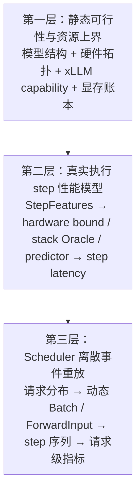
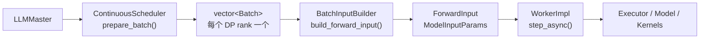
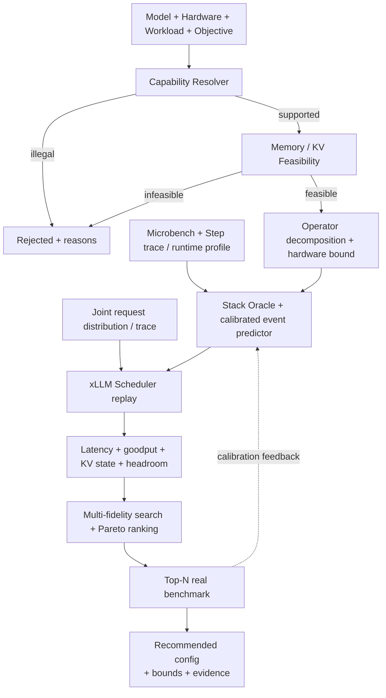
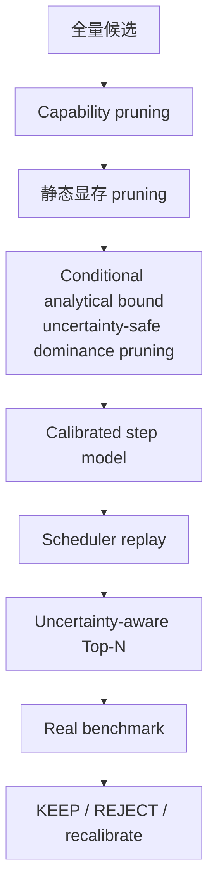
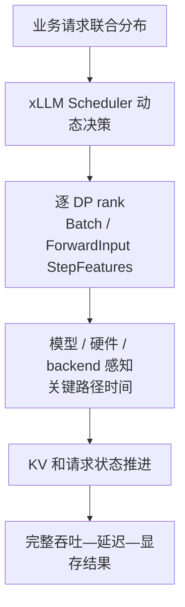

# 单 Provider 实例推理引擎性能建模与自动配置方案

## 1. 文档信息

- 状态：建模专项设计；服务阶段与接口以 01/02 为准
- 日期：2026-08-07
- 详细源码基线：xLLM `af9af7e832f2e37e4890d1e6902790adf01fab59`；vLLM-Ascend 接入基线 `ba58907c6d1c`
- 建模范围：单个 Provider profile 的自回归 LLM instance；instance 内可包含多机、多卡和多个 rank
- 不包含：多 instance Router、集群扩缩容、全局排队和跨副本容灾
- 关联文档：[xLLM 推理引擎能力与性能建模基线](./04_XLLM_INFERENCE_ENGINE_CAPABILITY_GUIDE.md)、[多引擎 Provider 设计](./11_XLLM_SERVICE_MULTI_ENGINE_PROVIDER_DESIGN.md)、[大模型推理系统优化技术全景](./90_VLLM_INFERENCE_SYSTEM_OPTIMIZATION_GUIDE.md)、[GLM-5.2 线上瓶颈分析与优化约束](./10_XLLM_SERVICE_GLM52_ONLINE_BOTTLENECK_ANALYSIS.md)

本文公式与公共特征 schema 适用于多个 Provider，但“当前代码已实现”的精确源码映射主要针对上述 xLLM commit。vLLM-Ascend 首版通过 Provider Adapter、Runtime 指标和黑盒校准接入；在没有等价逐 step trace 前，不宣称拥有与 xLLM 相同的白盒精度。任何 Provider 版本变化都必须重新核验 Capability Resolver 和代码入口。

本文解决的问题是：

> 给定 Provider/Runtime、模型、checkpoint/量化方式、硬件、输入输出长度分布、并发或到达率和 SLO，预测一个 instance 能否部署、不同配置下的显存与性能、理论/校准上限和剩余优化空间，并推荐经过实测闭环验证的最优配置。

## 2. 核心结论

推理引擎不能只用训练中的“模型参数量、全局 batch size、序列长度、MFU”方式建模。训练一个 step 的 shape 和执行图相对稳定，而在线推理每一轮都可能变化：

- Prefill 与 Decode 的算力/带宽特征不同；
- continuous batching 让每轮 sequence 数动态变化；
- chunked prefill 让同一个 Prompt 分成多个不同 shape；
- 每条 Decode sequence 的 KV 长度不同；
- prefix cache、抢占和重算改变真正执行的 token 数；
- Graph padding、MoE 路由和投机 verify 改变设备实际工作量；
- Scheduler 的准入和排队决定 TTFT，不只由 forward 时间决定。
- 延迟随 offered load 通常存在执行、KV 和排队拐点；模型必须预测拐点、SLO 容量边界与安全运行 QPS，而不能只返回若干孤立压测点。
- 同一 SLO 下的比较必须以各候选最大可持续 QPS 定义系统有效容量，同时与固定目标 QPS 的最小卡数、纯硬件下界和单位 SLO 容量成本分开。
- 性能面必须按 `provider_id + runtime/plugin version + profile_digest + execution_mode` 隔离；同模型、同硬件也不能混用 xLLM 与 vLLM-Ascend 的 trace、residual 或容量拐点。

因此方案必须分成三层：



最终配置搜索不能只选择 Roofline 最高的候选，而要在合法性、显存、质量和 SLO 约束下，比较完整 workload 的 goodput、延迟和成本。

## 3. 目标与非目标

### 3.1 首个闭环目标（MP0–MP2）

第一阶段先支持：

- text-only 自回归 LLM；
- 公共 schema 覆盖 xLLM Native 与 vLLM-Ascend；xLLM `DEFAULT/PREFILL/DECODE` 使用白盒 step trace，vLLM-Ascend `AGGREGATED` 使用带标签 Runtime 指标、请求事件和合成压测校准；
- P/D 先分别建模，不在本阶段预测端到端 KV 传输；
- Dense、GQA 和 MLA 模型；
- BF16/FP16 及已验证的 W8A8/FP8 路径；
- eager 与设备 Graph；
- continuous batching、chunked prefill 和 mixed batch；
- instance 内 DP/隐式 TP；
- open-loop 与 closed-loop workload；
- 显存、吞吐、TTFT、ITL/TPOT、E2E、最大可持续 QPS、容量拐点和效率上限预测；
- 同一 scenario 的系统有效容量置换比、固定目标 QPS 最小卡数比和单位 SLO 容量成本。

### 3.2 后续扩展

在基础模型误差达标后再加入：

- MoE、EP、EPLB 和 expert imbalance；
- CP、KV split 和长上下文通信；
- prefix cache、分层 KV、抢占/重算和 Zero Eviction；
- MTP、Eagle3、Suffix、DFlash；
- P/D 端到端 KV transfer 与联动模型；
- VLM encoder、DiT 和 Rec。

### 3.3 明确不做

本方案不直接决定：

- 集群需要启动多少个不同 Provider instance；
- 请求应路由到哪个 instance；
- P/D 副本比例和全局扩缩容；
- 跨 instance 的 prefix-aware routing；
- 业务 API Gateway 的全局排队。

这些属于集群服务模型。本文产出的“单 instance 容量曲线”可以成为其输入，但不能替代集群 Planner。

## 4. 为什么一个 batch size 不够

推理中至少存在五种容易混淆的 batch：

| 名称 | 含义 |
|---|---|
| API batch | 一次 API 调用显式携带的请求数量 |
| client concurrency | 同时在途的客户端请求数 |
| Scheduler sequence batch | 某一轮被选中执行的 sequence 数 |
| token batch | 某一轮实际计算的新 query token 总数 |
| Graph bucket | 为复用 Graph 而 padding/capture 后的执行 shape |

在 DP 下还需要区分全局 Scheduler batch 和每个 DP rank 的 local batch。

例如同样是 `num_sequences=32`：

- 纯 Decode 可能只有 32 个 query token，但 32 条 KV 长度各不相同；
- 纯 Prefill 可能有 8192 个 query token；
- mixed batch 可能包含 28 条 Decode 和 4 个不同大小的 Prefill chunk；
- Graph 实际执行 shape 可能 padding 到 40 或 64 条 sequence。

所以精准预测的最小单位不是标量 batch size，而是 xLLM executor 真正收到的逐 rank `ForwardInput` shape。

## 5. 建模输入规范

### 5.0 ProviderProfile

```yaml
provider:
  provider_id: VLLM_ASCEND
  runtime_family: vllm
  runtime_version: vllm-version-or-commit
  plugin_version: vllm-ascend-version-or-commit
  hardware_runtime_version: cann-driver-version
  execution_mode: AGGREGATED
  profile_digest: immutable-descriptor-digest
  scheduler_policy_digest: scheduler-and-limits-digest
  connector: none
```

模型键必须包含 Provider/Profile。Runtime、插件、CANN/驱动、量化、scheduler class/limit、并行拓扑、KV layout/Connector 或执行模式任一变化都产生新的校准面。不同 Provider 可以共享硬件理论下界和通用 workload schema，但不能共享未经验证的有效带宽、step Oracle、排队曲面或 online residual。

### 5.1 ModelSpec

```yaml
model:
  path: /models/Qwen3-32B
  model_type: qwen3
  checkpoint_revision: sha256-or-version
  dtype: bfloat16
  quantization: none
  kv_cache_dtype: auto
  task: generate
```

模型解析器需要从 checkpoint 和 xLLM `ModelArgs/QuantArgs` 得到：

- 层数、hidden size、head 数、KV head 数、head dim；
- vocab、embedding/lm-head 是否共享；
- MLP intermediate size 和激活类型；
- Dense/MoE、expert 数、top-k、shared expert；
- MLA、SWA、DSA、linear attention 等特殊结构；
- 权重 dtype、quant group/block、动态/静态 activation scale；
- MTP/draft 层和 cache group；
- xLLM model/backend 注册结果。

不能只读 Hugging Face `num_parameters`。xLLM 的实际模型注册、backend 和量化加载路径才决定最终执行图。

### 5.2 HardwareSpec

```yaml
hardware:
  platform: npu
  sku: Ascend-910C
  nodes: 1
  devices_per_node: 8
  memory_bytes_per_device: 68719476736
  topology_id: supernode-profile-v1
  runtime_version: "..."
  driver_version: "..."
  host:
    cpu_model: "..."
    sockets: 2
    physical_cores: 96
    numa_policy: local
    memory_bytes: 1099511627776
  economics:
    device_hour_cost: "<required_for_cost_objective>"
    host_hour_cost: "<required_for_cost_objective>"
    power_limit_watts_per_device: "<optional>"
```

硬件 profile 不能只有规格表 TFLOPS，至少需要：

- 各 dtype/quant 的 GEMM shape 性能曲面；
- Attention backend 的 Prefill/Decode 性能曲面；
- HBM 有效带宽及不同访问模式；
- rank 间链路拓扑、collective latency/bandwidth 曲线；
- host-device、D2H/H2D、RDMA/Mooncake 曲线；
- launch、同步、runtime、Graph replay 固定开销；
- CPU/NUMA 下的 Scheduler、input preparation 和 host memory 行为；
- runtime、driver、kernel/backend 版本。

相同硬件名但软件栈不同，不能复用同一个校准 profile。如果优化目标包含成本或能效，必须同时提供价格、功耗口径和摊销方式；只有设备数量时只能优化卡数，不能声称优化了成本。

### 5.3 WorkloadSpec

推荐输入完整分布或 trace：

```yaml
workload:
  mode: closed_loop
  concurrency: 64
  request_count: auto_from_confidence_target
  warmup: {policy: until_stable, min_requests: 500}
  think_time_ms: {distribution: constant, value: 0}
  length_joint:
    representation: conditional_histogram
    within_bin_sampling: empirical_cdf_or_declared_distribution
    input_histogram:
      - {low: 1, high: 512, probability: 0.20}
      - {low: 513, high: 2048, probability: 0.45}
      - {low: 2049, high: 8192, probability: 0.25}
      - {low: 8193, high: 32768, probability: 0.10}
    output_bins:
      - {id: short, low: 1, high: 128}
      - {id: medium, low: 129, high: 512}
      - {id: long, low: 513, high: 2048}
    output_given_input_bucket:
      - {input: "1-512", probabilities: {short: 0.75, medium: 0.22, long: 0.03}}
      - {input: "513-2048", probabilities: {short: 0.60, medium: 0.33, long: 0.07}}
      - {input: "2049-8192", probabilities: {short: 0.45, medium: 0.40, long: 0.15}}
      - {input: "8193-32768", probabilities: {short: 0.30, medium: 0.40, long: 0.30}}
    output_length_semantics: realized_after_stop
  prefix_reuse:
    enabled: false
  sampling:
    n: 1
    best_of: 1
```

其中：

- `length_joint` 优先使用真实 trace、二维联合直方图或条件分布 `P(output_length | input_bucket)`；
- histogram 必须声明 bin 内采样方式；统一采样、经验 CDF 和集中在上界会产生不同的 Attention/KV 成本；
- `output_length_semantics` 必须区分请求的 `max_new_tokens` 与考虑 EOS/stop 后真正生成的长度；性能重放默认需要后者；
- `closed_loop` 表示固定数量客户端，每个客户端在上一个请求完成后才提交下一个；
- `open_loop` 表示请求由外部到达过程产生，需要提供 QPS 和到达分布；
- 如果业务有 think time，closed-loop 还要提供完成到下一次提交的间隔分布。

输入、输出两个边缘分布再加一个 Pearson/Spearman 相关系数，不能唯一决定联合分布，更不能表达长输入与长输出同时出现的尾部依赖。`input_output_correlation` 只允许作为缺少联合数据时的 fallback，并必须同时指定分布族或 copula；其结果属于情景假设，不属于业务真值。

open-loop 还应允许 arrival 与 request class/长度相关，例如 burst 中长上下文比例上升。若没有真实 timestamp trace，必须明确采用 Poisson、Markov-modulated、周期/burst 等哪种到达模型，并将差异纳入情景范围。

启用 prefix reuse 时还必须提供 request trace、prompt-family/prefix-tree 或等价的 block-hash 复用分布。单个平均 hit rate 不能决定复用长度、KV 驻留时间和并发引用数。

### 5.4 只有 min/mean/max 时怎么办

输入/输出的 `min/mean/max` 可以作为 MVP 输入，但不足以唯一确定分布。两个 workload 可以拥有相同三元组，却有完全不同的长尾比例、KV 峰值和 TTFT p99。

兼容输入可以定义为：

```yaml
input_length:  {min: 128, mean: 2048, max: 32768}
output_length: {min: 16,  mean: 512,  max: 4096}
```

系统必须：

1. 明确选择一个默认分布族或三点分布；
2. 校验 mean 位于 min/max 之间并能构造合法概率；
3. 显式选择 copula/条件分布，生成输入输出联合样本；
4. 输出“假设分布”而不是伪装成业务真值；
5. 同时跑轻尾/基准/重尾三个情景，给出预测区间；
6. 建议用户用真实 histogram/trace 替换。

因此 min/mean/max 足以生成初步方案，不足以支撑“精准 p99”承诺。

### 5.5 EngineSearchSpace

```yaml
engine_search:
  world_sizes: [1, 2, 4, 8]
  dp_sizes: [1, 2, 4]
  ep_sizes: [1]
  cp_sizes: [1]
  kv_split_sizes: [1]
  block_sizes: [64, 128, 256]
  max_tokens_per_batch: [2048, 4096, 8192, 10240]
  max_seqs_per_batch: [32, 64, 128, 200]
  chunked_prefill: [true]
  prefill_chunk_sizes: [512, 1024, 2048, 4096]
  mixed_batch: [true, false]
  schedule_overlap: [true, false]
  graph: [true, false]
  graph_max_tokens: [512, 1024, 2048]
  max_memory_utilization: [0.80, 0.85, 0.90]
```

xLLM 对 LLM 没有通用的显式 `tp_size` 参数；有效并行 group 由 `world_size / dp_size` 等运行语义得到。搜索空间不能照搬训练的 TP/PP/DP 参数集合。

### 5.6 ObjectiveSpec

```yaml
objective:
  primary: min_hardware_cost
  constraints:
    latency_boundary: engine
    engine_ttft_p99_ms: 2000
    tpot_p99_ms: 100
    e2e_p99_ms: 30000
    success_rate_target: 0.999
    slo_attainment_target: 0.99
    memory_safety: deterministic_admissible_envelope
    quality_gate: required
  offered_load_search:
    mode: open_loop_qps_binary_search
    queue_stability_window_s: 600
  search_budget:
    max_real_benchmark_candidates: 24
    max_device_hours: 200
    max_wall_clock_hours: 24
    min_repetitions_per_candidate: 3
    exploration_fraction: 0.20
    stop_if_pareto_unchanged_rounds: 3
    min_expected_improvement: 0.01
  secondary:
    - max_goodput
    - min_ttft_p50
```

`search_budget` 中的数字只是一次任务的示例配额，不是行业默认值；生产使用必须由可用设备、截止时间和 benchmark 单价显式给出。优化器不得在运行中静默扩大预算。

如果用户只说“性能最优、耗时最低”，系统应输出 Pareto frontier：单请求最低延迟、最大吞吐和满足 SLO 后最低成本通常不是同一配置。

## 6. 与 xLLM 源码的对应关系

### 6.1 运行真值链路



源码入口：

- [LLMMaster](https://github.com/xLLM-AI/xllm/blob/af9af7e832f2e37e4890d1e6902790adf01fab59/xllm/core/distributed_runtime/llm_master.cpp)
- [ContinuousScheduler::prepare_batch](https://github.com/xLLM-AI/xllm/blob/af9af7e832f2e37e4890d1e6902790adf01fab59/xllm/core/scheduler/continuous_scheduler.cpp)
- [Batch](https://github.com/xLLM-AI/xllm/blob/af9af7e832f2e37e4890d1e6902790adf01fab59/xllm/core/framework/batch/batch.h)
- [BatchInputBuilder](https://github.com/xLLM-AI/xllm/blob/af9af7e832f2e37e4890d1e6902790adf01fab59/xllm/core/framework/batch/batch_input_builder.cpp)
- [ForwardInput](https://github.com/xLLM-AI/xllm/blob/af9af7e832f2e37e4890d1e6902790adf01fab59/xllm/core/runtime/forward_params.h)
- [ModelInputParams](https://github.com/xLLM-AI/xllm/blob/af9af7e832f2e37e4890d1e6902790adf01fab59/xllm/core/framework/model/model_input_params.h)
- [WorkerImpl](https://github.com/xLLM-AI/xllm/blob/af9af7e832f2e37e4890d1e6902790adf01fab59/xllm/core/runtime/worker_impl.cpp)

### 6.2 可以直接复用的能力

| xLLM 能力 | 建模用途 | 当前不足 |
|---|---|---|
| `KVCacheCapacity` estimator | 结构感知 KV/linear/indexer/cache group 容量 | 需暴露为稳定 dry-run API 并补完整显存账本 |
| `PerfModel::Resource` | FLOPs/HBM/network 统一资源抽象 | 参数固定、模型结构覆盖不完整、非 shape-calibrated |
| `ProfileManager` | 启动时构造请求并实测 step | 特征过粗；复用前还需修复无-prefix Prefill 的拟合/预测变量不一致 |
| `TimePredictor` | Scheduler 中轻量 latency 估算 | batch 近似过粗，且无-prefix quadratic root 的系数索引有误 |
| `Batch/ForwardInput` | 精确 StepFeatures 真值 | 尚缺标准化 trace 与 Observation 导出 |
| Metrics | 线上校准、回归和漂移监测 | 聚合指标不能重建逐 step shape |
| auto_config | 最终推荐配置落盘和 launcher 接口 | 当前主要是 Qwen3 静态 recipe，NPU tuner 仍未完成 |

对应实现见 [KV cache estimator](https://github.com/xLLM-AI/xllm/blob/af9af7e832f2e37e4890d1e6902790adf01fab59/xllm/core/framework/kv_cache/kv_cache_estimation.cpp)、[PerfModel](https://github.com/xLLM-AI/xllm/blob/af9af7e832f2e37e4890d1e6902790adf01fab59/xllm/core/scheduler/perf_model.cpp)、[ProfileManager](https://github.com/xLLM-AI/xllm/blob/af9af7e832f2e37e4890d1e6902790adf01fab59/xllm/core/scheduler/profile/profile_manager.cpp)、[TimePredictor](https://github.com/xLLM-AI/xllm/blob/af9af7e832f2e37e4890d1e6902790adf01fab59/xllm/core/scheduler/profile/time_predictor.cpp) 和 [auto_config](https://github.com/xLLM-AI/xllm/tree/af9af7e832f2e37e4890d1e6902790adf01fab59/xllm/auto_config)。

### 6.3 必须新增的接口

1. `--enable_step_trace`：输出逐 step、逐 DP rank 的执行真值。
2. `--step_trace_dir`：存放版本化 JSONL/Protobuf trace。
3. `KVCacheEstimateRequest/Response`：不加载完整服务即可做 KV 容量 dry-run。
4. `EngineCapability`：给定模型、平台和配置，返回 supported/rejected 及原因。
5. `ProfileManifest`：记录模型、硬件、软件栈和校准数据版本。
6. Scheduler replay adapter：用合成 request 驱动真实策略，执行部分替换为预测时钟。

### 6.4 vLLM-Ascend 建模接入

vLLM-Ascend 不是另一套独立 API Server，而是上游 vLLM Runtime 的 NPU Platform 插件。首版不复制 xLLM 的 `Batch/ForwardInput` 假设，而由 `VllmAscendModelingAdapter` 做以下映射：

| vLLM/vLLM-Ascend 信号 | 建模用途 | 首版边界 |
| --- | --- | --- |
| `num_requests_running`、`num_requests_waiting_by_reason` | 并发、capacity/deferred 排队面 | 保留 model/engine/DP label，不能先全局求和再拟合 |
| `kv_cache_usage_perc` 与 KV config | KV 压力与 admission 边界 | 每个 DP 独立；TP rank 的真实可用余量取最小值，ratio 禁止求和 |
| TTFT、queue、ITL/TPOT、E2E histogram | 请求级 SLO 曲面与拐点 | 合并 histogram bucket delta，不能平均 percentile |
| preemption、prefix query/hit | 重算与 Prefix 影响 | 命中率、路由与配置必须作为 profile 特征 |
| `determine_available_memory` 与 KV cache spec | 静态显存/KV 可行性 | 记录模型 profile 后真实可用 bytes，不以物理 HBM 代替 KV 池 |
| 合成 open-loop 压测 | `Qmax`、TTFT/TPOT 拐点和 CapacityProfile | 每个 Provider/profile 独立搜索，不能用 xLLM residual 校正 |

当 vLLM/vLLM-Ascend 能稳定导出逐 scheduler step 的 scheduled tokens、active sequences、KV context、Graph bucket 和阶段 duration 后，才升级为与 xLLM 等价的白盒 StepFeatures/Replay。此前 M1/M2 对该 Provider 使用黑盒校准区间并扩大 uncertainty，STRICT 选点以覆盖率门禁为准。

## 7. 总体架构



原则是：

- 解析模型负责解释和外推；
- 硬件理论边界与当前软件栈经验 Oracle 分开负责极限和可达目标；
- 实测 LUT/残差负责真实配置的 event latency 校准；
- Scheduler replay 负责状态和排队；
- 真实 benchmark 决定最终 KEEP/REJECT。

不能用单一黑盒回归替代所有层，否则配置外推、错误归因和上界判断都会失去依据。

## 8. 显存与部署卡数模型

### 8.1 每 rank 显存账本与生命周期

显存必须先分成启动后长期驻留的 allocation 和随执行 shape 变化的 transient allocation：

```text
M_static_reserved = M_weight_shard
                  + M_model_runtime_static
                  + M_graph_private_pools
                  + M_kv_pool_reserved
                  + M_linear_or_indexer_pool_reserved
                  + M_speculative_draft_static
                  + M_allocator_non_reclaimable

M_transient(step) = M_activation_live_set(step)
                  + M_backend_workspace(step)
                  + M_collective_live_set(step)
                  + M_logits_sampling_live_set(step)
                  + M_pd_or_store_staging_live_set(step)

M_peak(step) = HighWaterMark(
  allocation_lifetimes(M_static_reserved, M_transient(step))
)
```

Graph pool、allocator reserved memory 和 activation/workspace 可能复用同一物理区域，不能把各工具报告的 peak 简单相加。账本必须记录 allocation 生命周期、是否可复用以及 driver/allocator 的 allocated、reserved 和 device-free 三种口径。

每一项必须标注：解析值、实测值、校准系数和不确定度。`M_safety_reserve` 不属于预测内存本身，只在最终可行性判定中加入一次。

### 8.2 权重

权重显存必须按实际 rank shard 计算：

- Dense linear 的 column/row parallel shard；
- embedding/lm-head 是否共享；
- MoE expert 按 EP placement 和冗余 expert 分布；
- quantized packed weight、scale、zero point、bias 和 workspace；
- draft/MTP 权重是否与 target 共享设备；
- rolling load、XTensor 和 sleep/wakeup 的物理页预算。

不能简单使用 `参数量 × bit / world_size`，因为 replicated tensor、量化 metadata、expert placement 和不均匀 shard 都会破坏这个公式。

### 8.3 Activation peak

Activation 不是总 token 数的固定线性函数。峰值受以下因素影响：

- Prefill/Decode/mixed/spec-verify；
- local token 数和 ragged shape；
- attention backend workspace；
- Graph capture pool 和 bucket；
- fused MoE/grouped GEMM workspace；
- TP/EP/CP collective buffer；
- sampling/logits/top-logprobs；
- input contiguous buffer 和双缓冲；
- schedule overlap 同时保留 N/N+1 元数据。

第一版可用 shape 分桶的实测 live-set/high-water-mark LUT，解析模型负责外推和 sanity check。对于配置允许的最大 token、sequence、Graph bucket 和 backend workspace，必须覆盖 admissible envelope，而不能只覆盖业务 p99 shape。

### 8.4 KV 与混合 Cache

标准 GQA KV 每 token、每 rank 的理想字节数近似：

```text
B_kv_token_rank = 2 * L * H_kv_local * D_head * bytes(kv_dtype)
```

但 xLLM 还支持 SWA、C4、C128、LINEAR、indexer、scale 等 cache group。最终容量应直接复用 xLLM [kv_cache_estimation.cpp](https://github.com/xLLM-AI/xllm/blob/af9af7e832f2e37e4890d1e6902790adf01fab59/xllm/core/framework/kv_cache/kv_cache_estimation.cpp)，并记录：

- block size 与尾部碎片；
- active、prefix-cache、预留和传输中的 block；
- speculative target/draft cache；
- CP 与 `kv_split_size`；
- linear state slot；
- RDMA registration padding；
- host hierarchy 不同层级的容量。

xLLM 主路径在启动时先估算并分配 KV pool。运行中请求增长主要改变的是 pool 内 block 占用；到达容量边界后应由 Scheduler 执行等待、抢占、重算或层级搬移，而不是假设物理 KV tensor 可以无限增长。因此模型必须同时输出：

```text
physical_kv_pool_reserved_bytes
logical_kv_blocks_used(t)
kv_admission_wait(t)
preemption_or_recompute(t)
```

### 8.5 两种“最少卡数”

必须分别输出：

1. **启动下限**：权重、runtime、最低 activation/KV 能放下，实例可以启动；
2. **服务下限**：在目标 workload 下不发生不可接受的 KV 等待/抢占，并满足 SLO。

只计算第一项会产生“模型能启动，但一上并发就 OOM/排队”的错误方案。

### 8.6 可行性规则

确定性内存判定必须 fail closed：

```text
max over step in admissible_engine_envelope:
  M_peak(step)
+ M_model_uncertainty
+ M_safety_reserve
<= M_device_available
```

`admissible_engine_envelope` 不是各维最大值的笛卡尔积，而是 Scheduler、KV pool、Graph/backend 和配置约束共同定义的联合可达集：

```text
A(config) = {step |
  scheduler_reachable(step, config)
  and query_tokens(step) <= max_tokens_per_batch
  and sequences(step) <= max_seqs_per_batch
  and context_i(step) <= max_context_len
  and logical_KV_footprint(step) <= KV_pool_capacity
  and graph_backend_compatible(step, config)
  and speculative_logprobs_constraints_hold(step, config)
}
```

确定性检查对 `step in A(config)` 取峰值，而不是构造“每条 sequence 都达到最大 context，同时 batch token、sequence、speculative K、logprobs 也各自最大”的不可达角点。联合可达集仍覆盖完整引擎输入边界，不是 workload p99；若无法证明某个边界 shape 不可达，则保守纳入或标记 `UNVERIFIED` 送实测。

如果产品接受概率风险，必须改成显式约束：

```text
P(M_peak > M_device_available) <= epsilon
```

并给出置信上界、分布假设和 fallback 行为；统计 p99 不能被写成 `oom_probability=0`。安全余量只加入一次。优化器宁可把边界候选送去实测，也不能把预测 OOM 的候选推荐为可部署。

物理显存可行后还要单独验证 KV 服务能力：

```text
KV_used(t) <= KV_pool_capacity
```

违反时模拟真实等待/抢占/重算策略，并将其反映到 TTFT、ITL 和 goodput，而不是再次把它记成 GPU OOM。

## 9. Step contract：精准执行模型的特征与标签

### 9.1 标准结构

```yaml
step_features:
  step_id: 1203
  timestamp_ns: 0
  dp_rank: 0
  batch_forward_type: mixed
  length_encoding: per_sequence_normalized
  logical_num_sequences: 5
  kernel_num_sequences: 8
  padding_sequences: 3
  runtime_mode: graph_replay
  active_decode_sequences: 4
  estimated_kv_read_bytes: 0
  sequence_features:
    - {request_hash: r1, role: decode, q: 1, kv_before: 2047, kv_after: 2048,
       prefix_cache_reused: 0, requires_logits: true}
    - {request_hash: r2, role: decode, q: 1, kv_before: 8191, kv_after: 8192,
       prefix_cache_reused: 0, requires_logits: true}
    - {request_hash: r3, role: decode, q: 1, kv_before: 511, kv_after: 512,
       prefix_cache_reused: 0, requires_logits: true}
    - {request_hash: r4, role: prefill_chunk, q: 256, kv_before: 3840,
       kv_after: 4096, prefix_cache_reused: 2048, requires_logits: false}
    - {request_hash: r5, role: prefill_final, q: 512, kv_before: 512,
       kv_after: 1024, prefix_cache_reused: 0, requires_logits: true}
  useful_query_tokens: 771
  executed_shape:
    query_token_bucket: 1024
    sequence_bucket: 8
    logits_rows: 4
  backend:
    attention: backend-and-version
    linear: backend-and-version
    moe: none
    sampling: backend-and-version
  graph:
    enabled: true
    replayed: true
    graph_bucket_id: graph-1024t-8s
  parallel:
    world_size: 8
    dp_size: 1
    groups:
      model_tp: {size: 8, topology_path: intra_node}
      attention_tp: {size: 8, topology_path: intra_node}
      ep: {size: 1}
      cp: {size: 1}
      kv_split: {size: 1}
  cache_groups:
    - {id: full_attention, block_size: 128, active_blocks: 3000,
       prefix_blocks: 400, free_blocks: 700, swap_in_blocks: 0,
       swap_out_blocks: 0}
    - {id: linear_state, block_size: 1, active_blocks: 200,
       prefix_blocks: 0, free_blocks: 100, swap_in_blocks: 0,
       swap_out_blocks: 0}
  speculative:
    algorithm: none
    draft_tokens: 0

step_observation:
  timing:
    schedule_us: 0
    input_prepare_us: 0
    model_us: 0
    logits_us: 0
    sampling_us: 0
    collective_exposed_us: 0
    step_wall_us: 0
  memory:
    allocated_peak_bytes: 0
    reserved_peak_bytes: 0
    device_free_min_bytes: 0
    measured_hbm_read_bytes: null
    effective_hbm_bandwidth_bytes_per_s: null
  outcome:
    accepted_tokens: 0
    committed_tokens: 4
  instrumentation:
    trace_mode: sampled_async
    trace_sample_rate: 0.01
    estimated_overhead_pct: 0
```

`StepFeatures` 是执行前即可知道的因果输入；`StepObservation` 是执行后采集的监督标签和结果。训练、插值和 replay 只能把前者作为 predictor 输入，不能把 `model_us`、`step_wall_us` 或 memory peak 泄漏回特征。

逐序列数据在真实 trace 中必须包含完整值，不能只保留 mean/max。逐序列的 role、`q`、`kv_before` 和 `kv_after` 联合决定 attention work、logits/sampling rows、KV 生命周期和 backend 选择。不能仅用 `q=1` 推断 Decode，因为单 token Prefill、padding 和某些 verify 路径也可能具有相同长度。

xLLM 内部长度数组的编码不是所有平台都相同：CUDA/MLU/ILU/DCU 主路径的 `BuilderState` 可以保存带起始零的累计长度，NPU/MUSA 路径可以保存逐序列长度。因此 trace adapter 必须先标准化，不能把 `ForwardInput` 中的原始数组直接当成逐序列长度。本文统一定义：

- `sequence_features[i].q`：序列 `i` 在本 step 实际执行的 query token 数；
- `sequence_features[i].kv_before`：执行本 step 前已经存在的 KV token 数；
- `sequence_features[i].kv_after = kv_before + q`；
- `prefix_cache_reused` 是 `kv_before` 的来源子集，只用于解释命中来源，不能再次加到 attention context 或 KV 占用；
- `logical_num_sequences`：真实参与本 step 的序列数；
- `kernel_num_sequences`：Graph bucket 或 padding 后 kernel 实际看到的序列槽位数。
- `active_decode_sequences/runtime_mode/estimated_kv_read_bytes`：Decode effective-bandwidth surface 的核心输入；硬件计数器不可用时 observation 必须为 null，不能伪装成 0。

这些字段由 adapter 从 `BatchInputBuilder` 的状态、`ForwardInput` metadata 和 Graph padding 信息联合导出；schema 版本必须锁定其语义。

`parallel.groups` 必须记录算子真正使用的 group，而不能只保存一个 `world_size / dp_size` 标量。启用 CP、EP、KV split 或异构 P/D 后，Attention、Dense/MoE 和 KV transfer 可能使用不同的 rank 集合和 topology path。

`backend` 与 `graph_bucket_id` 也是特征的一部分。同一模型和 shape 在 backend fallback、量化 kernel 或 Graph fallback 后可能产生完全不同的时间。

### 9.2 Trace 插桩位置

建议分三层记录：

1. `ContinuousScheduler::prepare_batch()` 后：请求选择、预算、队列和 KV 决策；
2. `BatchInputBuilder::state_to_forward_input()` 后：executor 真正看到的 shape、padding、block table 和并行 metadata；
3. `WorkerImpl/Executor` 返回后：input/model/logits/sampling/collective/step wall time 和 memory high-water mark。

Trace 默认只记录长度、shape、hash/匿名 request id 和统计量，不记录原始 token、Prompt 或业务文本。生产采集应采用有界异步缓冲、采样和丢弃计数，并通过 instrumented/uninstrumented A/B run 量化 Trace 扰动；超过允许开销的数据不能直接用于校准。

### 9.3 Trace 版本键

每条 trace 或 manifest 必须包含：

```text
(schema_version,
 xllm_commit,
 model_checkpoint_hash,
 hardware_sku,
 topology_id,
 host_cpu_numa_profile,
 driver_runtime,
 kernel_backend,
 dtype_quant,
 engine_config_hash,
 scheduler_policy_id,
 scheduler_internal_predictor_profile_id,
 measurement_boundary,
 clock_power_thermal_policy,
 instrumentation_mode)
```

缺少版本键的 profile 不能自动与新运行混用。

## 10. 单 step 解析模型

### 10.1 Linear/GEMM

矩阵乘 `M×K` 乘 `K×N` 的算法工作量：

```text
F_gemm = 2 * M * K * N
```

`M` 不是固定 batch size，而是当前 rank 的有效 query token、expert token 或 selected-logit row 数。TP/EP 后必须使用 local operator shape，而不是 global shape。

### 10.2 Attention

设一个 query chunk 长度为 `q`，此前已缓存 prefix 长度为 `p`。因果 Attention 实际 query-key pair 数为：

```text
N_pairs = q * p + q * (q + 1) / 2
```

QK 与 PV 的主要算法 FLOPs 近似：

```text
F_attn_core = 4 * H_q_local * D_head * N_pairs
```

Decode 是 `q=1`，此时 FLOPs 随当前 KV 长度增长；Prefill 的 chunk 内还有二次项。GQA/MLA/DSA/SWA 的 projection、cache bytes 和 backend 算法必须由模型特定 decomposer 修正。

### 10.3 Dense MLP

以 SwiGLU 的 gate/up/down 三个 linear 为例，忽略 elementwise 小项：

```text
F_mlp ≈ 6 * T_local * H * I_local
```

是否按 TP 切 `I/H`、是否融合和量化，会改变 local shape 与有效吞吐。

### 10.4 MoE

MoE 不能只用 `tokens × top_k` 得到延迟。逐层至少需要：

```text
expert_token_histogram[layer][rank][expert]
```

并计算：

- router/top-k；
- dispatch/combine bytes；
- 每个 local expert 的 GEMM shape；
- capacity/padding；
- shared expert；
- 最慢 rank critical path；
- EPLB layout 与迁移成本。

同样的总 routed token 数，分布均匀和集中在少数 expert 上会产生不同延迟。

### 10.5 Logits 与 Sampling

不能忽略 lm-head、logits processor 和 sampling：

- vocab 很大时 lm-head 可显著占用时间；
- top-k/top-p、logprobs/top-logprobs 影响 kernel 和临时内存；
- `n/best_of/beam` 会增加 sequence 和 KV；
- speculative validation 有独立 rejection sampling 成本。

### 10.6 通信

每个通信事件记录：

```text
(collective_type, message_bytes, ranks, topology_path, stream, dependency)
```

时间来自对应 topology 的 size-dependent curve，而不是统一的 `bytes / peak_link_bw`。TP、EP、CP 和 P/D transfer 必须使用不同 traffic class。

### 10.7 Graph 与 padding

解析模型同时保留：

- useful shape：业务真正需要计算的 token/sequence；
- executed shape：Graph/padding/kernel bucket 真正执行的 token/sequence。

二者差异进入：

```text
padding_efficiency = useful_work / executed_work
```

Graph 的收益来自减少 launch/CPU 空洞，不能错误地减少模型算法 FLOPs。

## 11. 三层性能边界与单步预测

“理论上限”“当前软件栈可达目标”和“真实配置预测”不是一个量，必须分别建模和命名。

### 11.1 第一层：硬件—算法理论边界

对事件 `e`，若使用硬件对应 dtype 的架构峰值、可证明的最小数据移动量和最小通信量：

```text
T_hw_floor(e) = max(
  algorithm_FLOPs_min(e) / C_hw_upper(dtype),
  HBM_bytes_min(e) / BW_hbm_upper,
  Network_bytes_min(e) / BW_net_upper
) + T_unavoidable_min(e)
```

只有当分子是该算法的工作量/流量下界、分母是不会被实现超过的硬件上界时，`T_hw_floor` 才是条件严格的延迟下界。它通常非常乐观，适合回答“物理上最多还有多大空间”，不适合直接预测真实延迟。

如果 FLOPs、bytes 或硬件 rate 只是估算值，报告中必须写 `analytical_bound_estimate`，不能写成已证明上界。经典 [Roofline](https://amcr.lbl.gov/departments/computer-science-department/ppan/roofline-performance-model/) 用于建立这种 compute/memory 性能包络。

### 11.2 第二层：当前软件栈经验 Oracle

对同一模型 shard、shape、dtype、backend family 和拓扑，记录当前允许实现中的最佳稳定 microbenchmark/event 时间：

```text
t_stack_best(e) = min stable measured latency
                  over supported kernels/backends/buckets

T_stack_oracle(step) = ResourceConstrainedCriticalPath(
  cross_rank_DAG(events, t_stack_best),
  current_stack_contention_profile
) + unavoidable_runtime_exposed
```

它表示当前软件栈下较现实的工程目标，但不是永久理论上界：新的 kernel、融合、layout 或 runtime 可能超过现有 microbenchmark。报告中称为 `empirical_stack_oracle`，并附 profile 版本、样本量和置信区间。

[Empirical Roofline Tool](https://amcr.lbl.gov/departments/computer-science-department/ppan/roofline-performance-model/empirical-roofline-tool-ert/) 也区分理论峰值与实测 machine characteristics；这里进一步把经验前沿细化到 xLLM 的 shape/backend。

### 11.3 第三层：真实配置预测器

Analytical、LUT 和 residual 是同一事件的互补预测器，不是三条可以直接做 Critical Path 的 DAG 分支。正确组合顺序是：

```text
for each event e:
  t_base(e) = SelectOrBlend(
    analytical_calibrated(e),
    LUT_interpolation(e),
    OOD_fallback(e),
    uncertainty(e)
  )

  t_pred_raw(e) = t_base(e) + residual(e)

  if bound_is_valid(e) and
     prediction_interval_lower(e) < T_hw_floor(e) - numerical_tolerance:
    mark profile/predictor as INCONSISTENT
    recalibrate or use an explicitly named conservative fallback
  else:
    t_pred(e) = t_pred_raw(e)

T_instance_step_pred = ResourceConstrainedCriticalPath(
  cross_rank_DAG(events, t_pred),
  contention_model
) + T_runtime_exposed_pred
```

- Analytical：用于外推、解释、物理 sanity check 和 OOD fallback；
- LUT/小模型：用于已覆盖 shape 的高精度插值；
- Residual：修正融合、backend、padding 和稳定 runtime 偏差；
- Critical Path：只处理真实事件的依赖、资源竞争与重叠；
- `T_runtime_exposed_pred`：只加入没有被 DAG 事件覆盖的 CPU/launch/sync 尾部。

不能用 `max(T_hw_floor, t_pred_raw)` 静默截断预测分布：clamp 会抬高均值并破坏 prediction interval 的校准。有效 floor 应作为一致性检验；违反时输出 `INCONSISTENT`、记录差值并触发重标定。若部署筛选必须 fail closed，可以额外输出明确命名的 `conservative_feasibility_time=max(T_hw_floor, interval_upper_or_fallback)`，但它不能冒充已校准延迟预测。

必须建立 feature ownership 表，确保同一 Graph、padding、collective 或 runtime overhead 不会同时被 Analytical、LUT、Residual 和 exposed term 重复计算。Residual 不能学习并覆盖 OOM、非法配置或物理下界。

### 11.4 为什么必须做 shape calibration

设备标称峰值无法预测：

- 小 M GEMM 和 Decode 瘦矩阵；
- ragged/paged Attention；
- quant/dequant 和 layout conversion；
- MoE 小 expert batch；
- Graph bucket/padding；
- collective 小消息启动延迟；
- backend fallback。

因此真实配置预测必须由同硬件、同软件栈、同 shape family 的 microbenchmark 和 synthetic-step 数据校准。Vidur 同样采用算子分类、实验 profiling、runtime predictor 和事件调度器，而不是用一个全局 TFLOPS 直接预测请求延迟：[Vidur MLSys 2024](https://www.microsoft.com/en-us/research/wp-content/uploads/2024/05/vidur_mlsys24.pdf)。

## 12. Step DAG 与重叠

### 12.1 资源

最少拆分：

```text
device_compute
hbm_bandwidth
network_tp
network_ep
network_cp
copy_engine_h2d_d2h
pd_or_rdma_transfer
cpu_scheduler
cpu_input_prepare
```

不同 stream 可以并发，但共享 HBM、network 或 compute 时，event duration 不再彼此独立。竞争不能留给单 event residual 暗中吸收，必须由独立的 `ContentionModel` 处理。

第一版采用以下可执行规则：

1. DAG 依赖或同一 exclusive resource/stream 上的 event 串行；
2. 只有依赖允许且资源集合不相交的 event 默认完全重叠；
3. 同时占用 compute、HBM 或同一物理 network link 的 event 使用共享容量，不把各自 isolated latency 直接取 `max`；
4. compute↔collective、compute↔copy 等资源集合看似不同但共同触碰 HBM/PCIe/NIC 的组合，只有存在对应 pair-overlap profile 时才允许部分重叠；未知组合保守串行并标记需要校准。

对一个同时 runnable 的 event 集合 `G`，每个 event 保存资源工作量 `work(e,r)`，窗口时长至少满足：

```text
T_window(G) >= max over shared resource r:
  sum_{e in G} work(e, r) / effective_capacity(r, G)

effective_capacity(r, G)
  = calibrated_capacity(r, shape_bucket(G)) * overlap_efficiency(r, G)
```

因此两个共享 HBM 的 event 至少按总 bytes/共享有效带宽计时；共享 compute 或物理链路同理。`overlap_efficiency` 来自 isolated、A+B concurrent 的成对微基准，首版只拟合受控的二事件 class/shape bucket；未覆盖的三事件以上组合递归分解并给保守区间。资源调度器按完成的工作量推进事件，重新计算 runnable set，直到跨 rank DAG 的所有 sink 完成。

这一定义同时给 15.3 的 counterfactual 提供基准：`ideal overlap` 只把已经存在的依赖保留，并把对应资源的 `overlap_efficiency` 提升到其合法上界；不能凭空删除共享带宽工作量。

### 12.2 Schedule overlap

xLLM schedule overlap 在设备执行 N 时准备 N+1。稳态关键路径近似：

```text
T_steady = max(T_device_N, T_schedule_prepare_N+1) + T_exposed_sync
```

首轮、末轮、pipeline drain 和 fake-token 替换需要单独建模，不能把稳态公式应用到全部 step。

### 12.3 多流与 collective overlap

每个事件需要：

- earliest start dependency；
- resource demand；
- stream affinity；
- overlap eligibility/window；
- hidden segment 和 exposed tail；
- barrier/collective synchronization。

训练估算器已有的 analytical + selective DAG 思路可以复用，但事件必须换成 xLLM 的 Prefill/Decode/Graph/collective/runtime 语义，不能复用训练 forward/backward/optimizer step 图。

### 12.4 DP rank 与 collective 耦合

`dp_size > 1` 时不能独立预测每个 rank 后再平均。简化的同步 stage 可写为：

```text
T_stage = max_{d in DP ranks}(T_local_before_sync[d])
        + T_collective_exposed(
            latest_arrival,
            message_bytes_by_rank,
            topology,
            concurrent_traffic)
        + max_{d in DP ranks}(T_local_after_sync[d])
```

真实 layer 内存在多个 collective 时，应直接构造跨 rank DAG：rank-local event 是普通节点；collective 节点只有所有参与 rank 到达后才能启动，其完成时间由最晚到达者、最慢链路/rank 和 contention model 决定，所有后继 rank 等待该节点完成。instance step 时间为跨 rank DAG 最后一个 sink 的完成时间：

```text
T_instance_step = max_{sink in cross_rank_DAG} finish_time(sink)
```

`enable_dp_balance`、MoE routing 和 EPLB 会改变每个 rank 的 `StepFeatures`，从而改变 `max` 和 collective 到达偏斜；它们不能只作为最终时间的常数修正项。

## 13. Scheduler 离散事件重放

### 13.1 为什么必须重放

单 step predictor 只能回答“这个 batch 多久”。业务问题是“请求如何组成一系列动态 batch，以及每个请求等多久”。这要求维护时间和状态。

### 13.2 RequestState

每个合成或真实请求至少包含：

```text
arrival_time
prompt_length
output_length_realized
processed_prompt_tokens
generated_tokens
cached_prefix_tokens
stage: waiting | prefill | decode | finished | preempted
allocated_blocks_by_group
priority / deadline / TTFT-SLO / TPOT-SLO
sampling multiplicity
speculative acceptance state
terminal_result / error_stage / error_reason
deadline_observed_time / expired_after_deadline_tokens
```

### 13.3 EngineState

```text
simulated_clock
prefill/chunk/decode queues
active requests and sequences
KV block managers and prefix LRU
per-rank batch state
admission accepted/rejected by reason and wait
Graph cache/buckets
in-flight schedule-overlap step
hardware resource timelines
scheduler policy and internal predictor snapshot
```

### 13.4 主循环

```text
while requests remain:
  admit arrivals at simulated_clock
  apply completions/cancellations
  run the same xLLM scheduling policy and internal predictor to build vector<Batch>
  convert Batch/ForwardInput to per-rank StepFeatures
  predict rank and collective critical-path latency
  advance simulated_clock
  commit generated/accepted tokens
  update KV, prefix LRU, preemption and queues
  record request and engine metrics
```

首选方案是把真实 `ContinuousScheduler` 抽成可注入时钟和可替换 executor 的 replay library。若第一版只能在 Python 重写 Scheduler，必须建立与 C++ Scheduler 的 golden trace parity test，并把差异视为 correctness bug。

Replay 同时执行业务 deadline：跨阶段只消费剩余 duration，每个模拟 Engine 在本地排队、Prefill chunk 和 Decode 调度边界移除过期请求。已在途 step 可以按 profile 上界提交迟到 token，但不得再调度下一 step；模型单独输出 deadline 后 device time/token 与资源释放时延，不能把客户端已经放弃的计算算作有效吞吐。

这里存在必须显式处理的策略—性能耦合：`UnifiedPolicy`/一般 policy 会消费 `ProfileManager::TimePredictor`，`PDOOCScheduler` 还会使用 `PerfModel`。外部 step predictor 又根据 Scheduler 产生的 batch 决定真实时钟。replay 应按以下规则闭环：

1. 重放当前线上配置时，Scheduler 内部加载与线上完全相同的 policy、TimePredictor/PerfModel snapshot；外部 calibrated predictor 只负责计算选中 batch 的实际完成时间，不能偷偷替换策略看到的预算；
2. 评估“升级 Scheduler predictor”这一候选时，候选 predictor 必须同时注入 replay policy 和待部署 runtime，作为配置的一部分版本化；
3. 每个候选输出 `scheduler_policy_id`、`scheduler_internal_predictor_profile_id` 和 external step-model profile，任一缺失都不能声称与线上策略等价；
4. 用 golden trace 校验的不只是最终 batch，还包括 latency budget、排序、抢占和 policy fallback。

这样耦合通过逐 step 状态推进求解，而不是让外部 predictor 与 Scheduler 各自使用不一致的延迟真值。

schedule overlap 的 fake token 还需要限定语义。对 `output_length_semantics=realized_after_stop` 的 trace/exogenous-length replay，fake-token replacement 退化为 no-op，请求在给定 realized length 结束；这种模式可以还原 step 数，但不能预测 EOS、stop token/string 或采样变化导致的新结束位置。若要评估会改变 token 内容/接受序列的算法，必须提供实际 output-token/stop trace，或接入能够产生 token 的执行器，不能只靠长度分布推导 stop 行为。

### 13.5 Open-loop

open-loop 根据到达过程生成 arrival：

- 固定间隔；
- Poisson；
- 实际 timestamp trace；
- burst/周期流量。

当到达率超过单 instance 稳态容量时，队列应持续增长。模拟器不能通过悄悄降低到达率使结果看起来稳定。

### 13.6 Closed-loop

closed-loop 维护固定客户端数：

```text
next_arrival(client) = completion(previous_request) + think_time
```

并发数越大通常更容易形成大 batch，但吞吐饱和后请求延迟也会增长。closed-loop 吞吐不能直接解释为同 QPS open-loop 下的 SLO 能力。

### 13.7 Prefix cache

需要重放：

- 按 xLLM block size 切块；
- chained hash 或等价 prefix identity；
- 只有完整 block 可复用；
- 连续 prefix 命中到第一个 miss；
- ref count 与 LRU；
- active/prefix/free block 竞争；
- in-batch prefix cache 开关；
- host hierarchy 的 prefetch/transfer latency。

如果只给 prefix hit rate 而不给复用长度分布，无法准确计算节省的 Prefill work 和占用的 KV。

### 13.8 抢占与重算

每次 preemption 必须记录：

- 被释放 block；
- 已完成但需重算的 token；
- 回到哪个队列；
- 对 TTFT/ITL 和 useful-token efficiency 的影响。

重算 token 属于 executed work，但不属于新的业务输入 token。

### 13.9 投机解码

为每个请求/position 建模接受概率或直接重放 acceptance trace。每个 step 的期望提交 token 不能只使用全局平均接受率，因为 batch、position 和请求类型会影响分布。

投机 step 时间：

```text
T_spec_step = T_draft + T_target_verify + T_validation + T_extra_comm
```

单位有效输出成本：

```text
T_per_committed_token = T_spec_step / committed_tokens
```

## 14. 指标定义

### 14.1 请求级延迟

首先固定时间边界：

```text
engine_TTFT = first_token_ready_by_engine - scheduler_enqueue_time
server_TTFT = first_non_empty_stream_flush - api_request_accepted
client_TTFT = first_non_empty_stream_received - client_request_sent
```

本文单 instance engine 模型的权威输出是 `engine_TTFT`。`server_TTFT` 还包含 tokenization、API runtime、序列化和 stream flush；`client_TTFT` 再包含网络。未建模这些组件时，不能把 engine 结果命名为 client-visible TTFT。

- **TTFT — Time To First Token**：在声明的 measurement boundary 内，到首个非空输出 token 的时间；
- **ITL — Inter-Token Latency**：相邻两个可见输出 token 之间的逐间隔分布；
- **TPOT — Time Per Output Token**：通常为首 token 后生成阶段平均每 token 时间；
- **E2E/TTLT**：从到达到请求完成的总时间。

对输出 token 数大于 1 的请求：

```text
TPOT_request = (completion_time - first_token_time) / (output_tokens - 1)
```

ITL 是每个间隔的分布，TPOT 是请求级平均，不能混为一个指标。投机解码一次提交多个 token 时，还要明确这些 token 的 ready/flush timestamp 口径。指标口径可对照 [NVIDIA GenAI-Perf metrics](https://docs.nvidia.com/nim/benchmarking/llm/1.0.0/metrics.html)，但报告必须固定使用同一套边界，不能混用不同工具的定义。

`completion_time` 与 `first_token_time` 必须来自同一 measurement boundary 和 monotonic clock。TPOT=0、负 ITL、跨进程 duration 相减或被 guard 丢弃的样本都标记 `INVALID_METRIC` 并单独计数，不能静默删除后继续训练。

### 14.2 吞吐

分别报告：

- request/s；
- input token/s；
- output token/s；
- total processed token/s；
- executed token/s；
- useful committed token/s。

业务“Token 消耗”常包含输入和输出，但性能分析不能只给二者之和。Prefill input token 和 Decode output token 的成本完全不同；padding、draft 和重算属于 executed token，不属于业务计费 token。

每个吞吐值必须记录 measurement window。默认排除 warmup，从第一个计量请求进入边界开始，到最后一个计量请求离开同一边界结束；不能把请求生成和结果落盘开销只放进某些候选的分母。

### 14.3 Goodput

固定 offered load `lambda` 时，先定义：

```text
success_rate_offered(lambda)
  = 成功请求数 / eligible offered requests

slo_attainment_offered(lambda)
  = 成功且满足全部目标 SLO 的请求数 / eligible offered requests

achieved_goodput(lambda)
  = measurement_window 内满足 SLO 的完成请求数 / 时间
```

也可报告满足 SLO 的 output token/s。只提高 throughput、同时让 TTFT/TPOT 超标的配置不算有效容量提升。

配置容量必须是另一个指标：

```text
capacity_goodput = max over lambda: achieved_goodput(lambda)

subject to:
  success_rate_offered(lambda) >= success_rate_target
  slo_attainment_offered(lambda) >= slo_attainment_target
  queue_is_stable(lambda)
  memory_policy_is_valid(lambda)
```

`eligible offered requests` 包含进入比较场景的全部请求；入口流控、Service 无候选、Admission 拒绝、执行失败和超时分别计数。只对成功请求计算延迟是诊断视图，不能用来定义容量 goodput。

`queue_is_stable` 至少要求完成率与到达率在统计误差内一致，测量后半段 queue length/waiting work 没有持续正斜率，并通过足够长的 steady-state window。达到请求数上限后直接截断一个仍在增长的队列，不能判为稳定。

对 open-loop QPS 使用 bracket + binary search 找容量，并对临界点复测；closed-loop 只能得到给定 concurrency 下的 achieved goodput，不能直接替代 open-loop capacity。DistServe 也以满足 TTFT/TPOT 约束的最大可持续请求率作为 goodput 优化基础：[DistServe](https://arxiv.org/abs/2401.09670)。

### 14.4 SLO 容量、置换比与成本口径

同一 SLO 下的容量比较不要求两个候选运行在相同的最大 QPS。相反，容量测试的目标就是分别寻找每个候选满足相同约束的最大可持续 offered load。先固定比较场景：

```text
scenario = {
  model/revision,
  correctness_or_quality_constraint,
  request input/output length joint distribution,
  request type/workflow mix and arrival process,
  prefix/cache hit distribution,
  engine/server/client measurement boundary,
  TTFT/TPOT/E2E percentile SLO,
  success_rate_target, slo_attainment_target and timeout/rejection policy,
  steady-state and confidence policy
}
```

精度、量化方式、硬件、Runtime backend 和并行布局属于候选配置，可以不同，但必须显式记录，且都满足同一个 correctness/quality constraint。不能用不同 token 分布、缓存命中率、请求类型比例或平均延迟替代同一场景下的 percentile SLO。

对硬件 `H`、投入的计费物理卡数 `N`、合法并行布局与 Runtime 配置 `L`，定义：

```text
Qmax(H, N, L, scenario)
  = max sustainable open-loop offered QPS

subject to:
  success_rate_offered >= success_rate_target
  slo_attainment_offered >= slo_attainment_target
  all percentile SLOs pass
  completion_rate ~= arrival_rate
  queue is stable
  timeout/drop/rejection policy passes
  memory policy is valid
```

`Qmax` 是负载搜索的结果，不是预先要求两个候选相等的控制变量。只有更高负载已被验证为不可行，或可行下界与不可行上界已经收敛到声明的误差范围，才能把一个点称为最大容量；单次观测峰值、有限请求数截断和仍在增长的队列都不能作为 `Qmax`。

若比较当前两个固定集群/部署的有效容量，定义单位物理卡 SLO 容量与系统置换比：

```text
qmax_per_physical_card(H, N, L, scenario) = Qmax(H, N, L, scenario) / N

R_effective(A replaces B)
  = qmax_per_physical_card(A) / qmax_per_physical_card(B)
```

例如当前校准样本中，若同一约 10 秒 SLO 下，16 张 B200 的 Chat `Qmax=25`，108 张 HC 的 Chat `Qmax=1`：

```text
R_effective_10s(B200 replaces HC)
  = (25 / 16) / (1 / 108) = 168.75
```

若同一约 15 秒 SLO 下分别为 35 和 5 QPS：

```text
R_effective_15s(B200 replaces HC)
  = (35 / 16) / (5 / 108) = 47.25
```

只要这些点确实是同一场景下的最大可持续 QPS，上述计算成立；两边的 `Qmax` 不同正是容量差异的测量结果，不能以“QPS 不一致”为由否定。两个置换比相差 3.57 倍，表示 HC 在 SLO 从约 10 秒放宽到约 15 秒后容量增长 5 倍，而 B200 只增长 1.4 倍，是强 SLO/QPS 拐点的直接证据。

同一校准样本的模型 request QPS 若分别为 `60/2.6` 和 `81/11`，模型层单位卡容量比分别是 155.8 和 49.7，与 Chat 层 168.75 和 47.25 接近。这说明该样本中 workflow fan-out 不是数量级差异的主要来源，但仍不能省略 measurement boundary。若标称 10 秒或 15 秒的样本在权威 SLO 指标上观测到 10.4/10.6 秒或 15.4/15.1 秒，它只能标记为“约 10/15 秒的采样点”；对于严格 `<10s`/`<15s` 的容量边界，该点不满足约束，必须向下搜索或以置信区间插值后复测。

`R_effective` 是当前系统栈的有效容量置换比，不是芯片纯计算或纯 HBM 带宽比。它有意包含：

- 精度和量化带来的执行与显存差异；
- cards-per-replica、TP/PP/DP/EP/CP、跨机 collective 和 rank 木桶；
- 权重/KV/临时内存容量、batch occupancy 和 Graph bucket；
- Scheduler、admission、preemption/recompute、排队和负载均衡；
- 当前 backend/kernel/compiler 的有效效率以及已分配资源的闲置比例。

因此报告必须命名为 `current_stack_effective_capacity_ratio`，不能命名为 `hardware_speed_ratio` 或仅写“单卡性能差”。纯硬件条件下界、当前系统有效容量和未来优化后的容量必须分层报告。

固定集群容量比也不等于任意目标流量下的最小卡数比。对业务目标 `lambda_target`，还必须在合法卡数和并行布局中搜索：

```text
Nmin(H, lambda_target, scenario)
  = min N
    such that exists admissible L:
      lambda_target <= Qmax(H, N, L, scenario)

R_min_cards(A replaces B, lambda_target)
  = Nmin(B, lambda_target, scenario)
    / Nmin(A, lambda_target, scenario)
```

`R_effective` 只有在副本可复制、流量均衡且容量近似线性扩展的区间，才可作为大规模 sizing 的渐近置换比；小流量、最小 TP/PP gang、整节点分配和副本粒度下必须使用 `Nmin`，不能把固定集群的每卡容量无条件线性外推。

成本必须与容量分开计算。若物理卡月成本为 `monthly_cost_per_card`：

```text
monthly_cost_per_slo_qps
  = N * monthly_cost_per_card / Qmax

cost_ratio(A versus B)
  = monthly_cost_per_slo_qps(A)
    / monthly_cost_per_slo_qps(B)
```

卡数置换比不能直接当成本置换比；还要包含整机、网络、CPU/内存、能耗和无法拆分的部署粒度。技术报告同时记录 `physical_card_count`、`accelerator_die_count`、`billable_node_count` 和 `cards_per_replica`。双 die 物理卡不能一处按“卡”、另一处按 die 归一。

Engine 模型与上层 Chat/Agent 容量也必须分开。本文的权威边界是 engine request；若使用 Chat QPS 计算置换比，还要显式建模一次 Chat 触发的模型调用次数、串并行关系、工具调用和非模型等待。应同时报告：

```text
model_calls_per_chat = model_request_qps / chat_qps
engine_capacity_ratio
chat_or_workflow_capacity_ratio
```

两者接近可以说明 workflow fan-out 不是主要差异，但不能反向用 Chat TTFT 替代 engine TTFT。对于固定输入 10k、输出 200 的建模结论，校准数据也必须使用相同长度分布；只有总 input token/s 时，应先除以模型 request QPS 反推平均输入长度，不能默认它等于 10k。例如上述样本按 `28万/60`、`1万/2.6`、`40万/81`、`4.8万/11` 反推的平均输入约为 3.85k～4.94k，并非固定 10k，且输出长度未知，因此只能用于校准当前 workload surface，不能直接作为 10k/200 场景的容量真值。

### 14.5 SLO 容量拐点与安全运行点

`capacity_goodput` 给出最终可持续边界，但控制面还需要知道系统从何处开始进入非线性退化。对固定 workload、硬件、并行布局、Scheduler policy 和 SLO，必须区分：

```text
execution_knee_qps
  Decode/Prefill step latency 对 batch、sum_kv_length 或 offered load 的边际斜率显著增加

kv_knee_qps
  KV 达到显式 high watermark，或首次出现 admission wait、preemption/recompute

queue_knee_qps
  queue wait 占 TTFT/E2E 的比例或 waiting-work 斜率进入显著增长区间

slo_boundary_qps
  满足 success、SLO attainment、queue stability、memory policy 和全部延迟 SLO 的最大 offered load

hard_capacity_qps
  不考虑业务 SLO、但队列仍可稳定的最大 offered load
```

长输出下，Decode 驻留请求数与服务时间形成闭环：

```text
E[active_decode_sequences] ~= lambda * E[decode_residence_time]

decode_residence_time
  <- step_latency(active_decode_sequences, sum_kv_length, parallel_layout, ...)
```

因此 Decode 变慢会增加驻留时间；在固定 open-loop 到达率下，请求会继续到达，使 active batch、KV 驻留和每 step 状态读取继续增加。到达 `max_seqs`、KV 或其他实例内边界后，active set 不再无限增长，额外请求转为排队、admission wait、超时或失败。closed-loop 固定并发不会产生同样的到达反馈，不能混用两者的拐点。

拐点不能由单个 noisy derivative 或肉眼选取。检测协议必须：

1. 对同一 arrival trace seed 在从低负载到明确过载的 QPS 网格上重复 replay/benchmark；
2. 对 `step latency`、TTFT、TPOT、E2E、queue wait、KV occupancy、success rate 和 SLO attainment 做带置信区间的单调或分段单调拟合；
3. 只有当分段斜率变化超过版本化的 `knee_slope_ratio`、变化点两侧达到最小样本数且重复实验区间一致时，才报告统计 change point；
4. KV high watermark、首次 admission/preemption 和 queue instability 等因果事件单独报告，不能被平滑拟合隐藏；
5. 未在已探索区间检测到拐点时输出 `> max_tested_qps`，不能用无证据外推伪造点估计。

总体运行拐点是已验证执行、KV 和排队拐点的最小值；同时保留各分量，避免把所有退化都归因为 HBM：

```text
operational_knee_qps = min(
  execution_knee_qps,
  kv_knee_qps,
  queue_knee_qps
)
```

`safe_admission_qps` 由置信上界和显式 headroom policy 计算，不使用全局硬编码的 80%：

```text
safe_admission_qps = min(
  operational_knee_qps * knee_headroom,
  slo_boundary_qps * slo_headroom,
  hard_capacity_qps * stability_headroom
)
```

三个 headroom 都属于版本化部署策略，取值为 `(0, 1]`；若任一边界只有区间，则使用满足风险策略的保守端。安全余量只加入一次，Planner 不能在 replica capacity 和集群 sizing 两处重复折减。

Scheduler 对拐点有两种不同责任：

- Engine Scheduler 通过 batch composition、Prefill/Decode budget、chunk size、KV admission、preemption 和 per-DP-rank balancing 尽量把执行/KV拐点右移；
- xLLM Service Router/Planner 消费每个 replica 报告的 `safe_admission_qps`、当前 KV/queue headroom 和置信度，将实际负载保持在拐点左侧，超过后执行分流、扩副本或切换合法并行布局。

D Engine 将同一 profile 的安全区间编译成版本化的保守 Decode credit/TPOT guard，在本地快照上做常数级准入；复杂预测仍留在 Service，不能进入 allocator 临界区。BEST_EFFORT 可以承担自身 SLO 风险，但新请求不能突破已准入 Decode 的最严格 guard。

调度不能消除硬件 hard capacity。若反事实 replay 显示理想 Scheduler 仍无法满足目标 QPS，结果必须是增加资源、改变精度/布局或 `infeasible`，不能通过扩大队列让短窗口测量看起来通过。

### 14.6 引擎效率

推理没有一个覆盖所有阶段的单一 MFU。建议同时报告：

- Prefill effective FLOP utilization；
- Decode model/HBM bandwidth utilization；
- collective/link utilization；
- hardware-bound efficiency 与 current-stack efficiency；
- padding efficiency；
- useful-token efficiency；
- Graph hit/fallback rate；
- KV utilization、prefix hit 和 preemption/recompute rate；
- SLO goodput。

## 15. 如何判断优化空间

### 15.1 同工作量的两级 Headroom

对固定模型、精度、并行配置和 StepFeatures，必须同时报告：

```text
eta_hardware = T_hw_floor / T_measured
theoretical_headroom_speedup = T_measured / T_hw_floor

eta_current_stack = T_stack_oracle / T_measured
current_stack_headroom_speedup = T_measured / T_stack_oracle
```

- `theoretical_headroom_speedup`：硬件—算法条件下的极乐观最大空间，通常较松；
- `current_stack_headroom_speedup`：当前 kernel/backend/profile 下更可能兑现的工程空间，是经验目标而非永久理论上界。

例如 `eta_current_stack=0.70`，代表当前时间约为经验 Oracle 的 `1/0.70=1.43×`，不是“还有 70% 性能”。如果 `T_stack_oracle > T_measured`，说明 profile、shape 对齐或测量噪声有问题，应标记 inconsistent，而不是输出负 headroom。

请求/workload 级优化空间不能通过平均 step efficiency 得到。必须在同一 workload 上分别重放 measured predictor、stack-oracle event time 和 hardware-floor event time：

```text
capacity_headroom_current_stack
  = capacity_goodput_stack_oracle / capacity_goodput_predicted

latency_headroom_current_stack
  = latency_predicted / latency_stack_oracle
```

这样 Scheduler 重新组 batch、队列非线性和 KV 状态变化才会进入上限估算。

### 15.2 改变算法后重建分母

量化、投机解码、稀疏 Attention、prefix reuse 和模型压缩会改变 FLOPs/bytes/useful work。此时必须重建 Roofline，不能沿用旧分母宣称效率提升。

### 15.3 Counterfactual Gap 分解

候选 gap 至少分类为：

```text
compute_gap
hbm_gap
network_gap
kernel_launch_and_sync_gap
cpu_scheduler_and_input_gap
padding_fragmentation_gap
recompute_and_draft_waste
queueing_gap
```

前七项主要属于 engine 执行优化，queueing gap 属于 workload 与容量匹配；两者不能混为“Kernel 还有多少空间”。

但这些 gap 相互作用，不能独立估算后直接相加。例如去掉 padding 会同时改变 GEMM shape、HBM traffic 和 Graph 命中。可操作归因必须通过同一 replay 的 counterfactual 开关得到：

```text
C0 = measured/predicted baseline
C1 = C0 + current-stack best kernels
C2 = C1 + ideal graph/launch
C3 = C2 + no avoidable padding/fragmentation
C4 = C3 + no exposed CPU scheduling/input bubble
C5 = C4 + ideal collective overlap within valid dependencies
C6 = C5 + ideal scheduler under the same policy/quality constraints
C7 = C6 + unlimited KV admission for diagnostic only
```

报告每一步的增量、最终联合收益和执行顺序。若需要与顺序无关的归因，使用多顺序平均或 Shapley-style attribution；无论哪种方式，都必须单独显示 interaction residual。

`unlimited KV`、`ideal scheduler` 等 Oracle 只用于定位瓶颈，不一定是可部署方案。最终推荐仍必须通过 capability、内存、质量和真实 benchmark gate。

## 16. 配置合法性与搜索空间剪枝

### 16.1 Capability Resolver

候选进入性能估算前必须回答：

```text
supported(model, platform, backend, quant, parallel, graph, scheduler, spec)
```

结果为：

- `SUPPORTED`；
- `REJECTED(reason, source)`；
- `UNVERIFIED(requires_smoke_test)`。

未知组合默认不能作为最终推荐。

### 16.2 xLLM 特有约束

至少编码：

- `world_size % dp_size == 0`；
- 启用 CP 时 `world_size % (dp_size * cp_size) == 0`，并区分 `attention_tp_size` 与其他模型并行 group；
- LLM effective TP/group-map 语义，而不是使用 DiT `tp_size` 或假设所有算子共享一个 TP 标量；
- CP 模型/backend/角色限制；
- `kv_split_size` 对 CP 的整除和配置入口限制；
- EP backend 和 expert layout；
- CP、MTP、无 chunked prefill 和 P/D Prefill 角色会强制关闭 mixed batch；配置 `multi_slo_and_prio` 时必须解析 effective policy，不能把回退到 `PrefillFirstPolicy` 误认为 `UnifiedPolicy` 生效；
- Graph backend、shape 和 speculative 限制；
- KV INT8 的 MLU/模型限制，并核对 effective KV dtype；未知 `kv_cache_dtype` 可能静默回退，而 estimator 认识 FP8 字符串不等于运行 kernel 支持；
- P/D transfer backend 和 cache group 限制；
- 本基线 `WorkerImpl` 只启用 host D2H/H2D 分层路径，KV Store/Mooncake 主路径硬编码关闭；
- model registry 的 NPU ATB/TORCH 选择。

相关校验入口见 [master.cpp](https://github.com/xLLM-AI/xllm/blob/af9af7e832f2e37e4890d1e6902790adf01fab59/xllm/core/distributed_runtime/master.cpp)、[parallel_config.cpp](https://github.com/xLLM-AI/xllm/blob/af9af7e832f2e37e4890d1e6902790adf01fab59/xllm/core/framework/config/parallel_config.cpp) 和 [model_registry.cpp](https://github.com/xLLM-AI/xllm/blob/af9af7e832f2e37e4890d1e6902790adf01fab59/xllm/models/model_registry.cpp)。

### 16.3 多保真搜索



高成本 replay 和实测只用于 shortlist，但低保真阶段不能用激进规则提前删除可能的最优配置。只有当候选 A 的保守下界仍劣于候选 B 的保守上界，并且两者 capability/quality 约束一致时，才能做 safe dominance pruning；否则保留到更高保真阶段。

搜索开始前必须从 `ObjectiveSpec.search_budget` 固化预算，不能把“Top-N”留成无界参数。第一版采用预算约束的 successive halving：

1. capability/memory/analytical/replay 阶段不消耗真实 device-hour，但记录 CPU wall time；
2. 最多选择 `max_real_benchmark_candidates` 个候选进入短稳态 benchmark，每个至少 `min_repetitions_per_candidate` 次；
3. 根据 paired confidence interval、Pareto 支配关系和 expected improvement 分配剩余 device-hour，保留 `exploration_fraction` 给高不确定/OOD 候选；
4. 只有进入最终轮的候选运行完整容量搜索、尾延迟样本和质量 gate；每次运行前预估 `devices × wall_time`，超过 `max_device_hours` 或 `max_wall_clock_hours` 就不启动。

满足任一条件即停止：预算耗尽、Pareto frontier 连续指定轮数不变、所有剩余候选被置信区间支配，或最佳 expected improvement 低于阈值。预算耗尽但排序仍重叠时，输出 `BUDGET_EXHAUSTED_INCONCLUSIVE`、当前 best observed 和 unresolved candidates，不能宣称找到了全局最优。`N` 因此由预算和不确定度共同决定，不是固定行业常数。

### 16.4 Pareto 排序

至少保留：

- p99 TTFT；
- p99 TPOT；
- output throughput/goodput；
- device 数/成本；
- 显存余量；
- 预测不确定度。

Planner 输出 Pareto frontier，再按用户 primary objective 选推荐项。

## 17. 校准数据体系

### 17.1 Microbenchmark

覆盖：

- Dense/quantized GEMM 的 M/N/K 网格；
- Prefill/Decode paged Attention 的 q/kv/ragged 网格；
- lm-head、sampling、top-k/top-p/logprobs；
- MoE grouped GEMM 和 routed-token 分布；
- TP/EP/CP collective 的消息大小与 rank/topology；
- isolated A/B 与 concurrent A+B 的成对 overlap 网格，至少覆盖 compute↔collective、compute↔H2D/D2H、collective↔copy、双 kernel 共享 HBM，并拟合 `overlap_efficiency`；
- Graph capture/replay/fallback；
- H2D/D2H/RDMA；Mooncake/KV Store 只在 capability 恢复并通过 smoke test 后进入 profile；
- block copy、KV quant/dequant。

### 17.2 Synthetic Step

直接构造 `Batch/ForwardInput`，覆盖：

- 纯 Prefill；
- 纯 Decode；
- ragged mixed batch；
- 长短上下文混合；
- Graph bucket 边界；
- 量化/backend fallback；
- MoE 均匀与热点路由；
- speculative verify。

### 17.3 End-to-end Workload

使用真实或合成长度联合分布，分别验证：

- closed-loop 不同 concurrency；
- open-loop 在约 50%、75%、85%、95% 预测容量以及明确过载点的 QPS；
- 每个候选在同一 scenario 下独立搜索 `Qmax`，保留最高可行点、最低不可行点和边界复测结果；
- 轻尾/重尾长度；
- prefix reuse；
- SLO 饱和点；
- 长时间 KV 稳态和 preemption。

线上校准数据必须来自 02 §8.3 的有效事件链，并按 `provider_id/provider_version/profile_digest/execution_mode/model_revision/workload bucket` 分组。不同 Provider、Runtime/插件版本、scheduler/Connector 配置的数据不得合并训练或更新同一 residual。当前 GLM-5.2 证据只约束实验覆盖：必须包含 per-rank 永久 KV 边界、Admission 前后两段 TTFT、阶梯负载下的 Prefill/Decode 拐点和 Prefix 指标闭环；其中任何实测毫秒值都不是跨版本、跨模型或跨 Provider 常量，见[线上瓶颈分析](./10_XLLM_SERVICE_GLM52_ONLINE_BOTTLENECK_ANALYSIS.md)。

接近容量拐点时，很小的 step 误差会被排队放大，因此不能只在低负载或单一 QPS 验证。Vidur 的评估也专门区分不同容量比例并指出临界点的非线性：[Vidur MLSys 2024](https://www.microsoft.com/en-us/research/wp-content/uploads/2024/05/vidur_mlsys24.pdf)。

### 17.4 测量与统计协议

每个 profile/benchmark 必须记录并执行：

- 固定或记录设备时钟、power limit、温度区间和 throttling；
- 固定 CPU affinity、NUMA policy、主机 governor 和后台负载；
- 明确 runtime/driver/kernel、Graph warmup 和 allocator warmup；
- warmup 以延迟/吞吐进入稳定区间为准，而不是只使用固定请求数；
- device event 计时前后正确同步，区分 host enqueue time 与 device elapsed time；
- 每个 shape 多次重复并保存原始样本、median、tail、MAD/variance 和置信区间；
- 配置比较使用相同 request trace、seed 和到达时间，优先采用 paired comparison；
- 单独运行 instrumented 与 uninstrumented benchmark，量化 Trace/Profiler 扰动和丢弃率；
- 报告关联覆盖率、事件缺失率、`INVALID_METRIC` 数和失败 reason 分布，禁止只保留成功或正值样本；
- 对 thermal drift、异常值和 benchmark failure 使用预先声明的处理规则，不能事后选择性删除。

p95/p99 的样本量由目标置信区间和误差容忍度决定，不能默认 `request_count=10000` 就足够。采用 order-statistic/binomial 或 bootstrap quantile confidence interval，并在结果中报告有效样本数。作为严格基准的参照，MLPerf 的 tail-latency 规则会根据目标 percentile、置信度和 margin-of-error 推导所需样本数，p99 示例可达到约 27 万条：[MLPerf Inference rules](https://github.com/mlcommons/inference_policies/blob/master/inference_rules.adoc)。本项目不必机械照搬该数字，但必须采用同样的统计原则。

容量测试必须满足最小 steady-state 时间、最小完成请求数和 queue stability 检验；若测量窗口结束时队列仍在增长，该点只能标记 `OVERLOADED`，不能输出有限 p99 作为有效容量。`Qmax` 必须同时保存 feasible lower bound、infeasible upper bound、搜索误差和边界重复实验；没有不可行上界的结果只能标记为 `>= max_tested_qps`，不能声称已经找到最大容量。

### 17.5 数据切分

不能把相同 shape 的重复样本随机拆到 train/test。应按以下维度 hold out：

- 未见过的 q/kv length bucket；
- 未见过的 ragged composition；
- 未见过的 concurrency；
- 未见过的模型或层结构；
- 未见过的软件栈版本。

这样才能验证插值和外推能力，而不是记住 benchmark 表。

同一个 workload trace 可用于 paired candidate comparison，但不能同时作为 residual 训练集和最终泛化测试集。最终报告必须列出 train/interpolation/holdout/OOD 四类证据。

## 18. 误差、置信度与验收

### 18.1 误差指标

逐层报告：

- memory absolute/relative error；
- step latency MAE、MAPE、p95 absolute error；
- workload throughput error；
- TTFT/TPOT/E2E p50/p95/p99 error；
- capacity QPS/goodput 和 SLO-attainment error；
- `current_stack_effective_capacity_ratio`、固定目标 QPS 下 `Nmin` 与成本比误差；
- queue stability/overload classification error；
- candidate ranking correlation；
- Top-K 最优候选召回率；
- false-feasible OOM 数。

尾延迟同时报告 point estimate error 和 quantile confidence interval。真实值与预测值的统计区间都很宽时，一个看似精确的百分比误差没有意义。

### 18.2 初始工程门槛

建议第一阶段门槛：

- admissible engine envelope 内不得出现 false-feasible OOM；
- 静态权重/KV 容量误差目标不超过 5%；
- 已覆盖 shape 的 step p50 误差目标不超过 10%；
- 已覆盖 workload 的吞吐和 p50 延迟误差目标不超过 10%；
- p99 延迟误差目标不超过 20%，且预测/实测都达到预先规定的置信区间和有效样本量；
- capacity goodput 误差、SLO attainment error 和稳定/过载分类必须单独验收；
- 真实最优或统计等价候选应进入预测 Top-5。

这些是首版验收目标，不是所有硬件/模型都天然能达到的行业定律。未达标的区域必须标记 `UNVERIFIED`，不能输出过度精确的单点值。

### 18.3 不确定度

预测结果包含：

```text
point_estimate
prediction_interval
in_distribution / out_of_distribution
evidence_count
nearest_profile_distance
```

搜索时对高不确定候选使用保守约束，但也应保留少量探索预算，避免永远不测试潜在更优区域。

## 19. 最终输出规范

```yaml
result:
  status: feasible
  scope:
    provider_id: XLLM_NATIVE
    provider_version: commit-or-version
    profile_digest: immutable-profile-digest
    execution_mode: AGGREGATED
    instance_type: xllm_default
    measurement_boundary: engine
    scenario_id: scenario-v1
    correctness_or_quality_constraint_id: quality-v1
    slo_policy_id: slo-v1
    workload_source: joint_histogram
    workload_assumption_id: workload-v3
  recommended_config:
    world_size: 8
    dp_size: 1
    parallel_groups:
      model_tp_size: 8
      attention_tp_size: 8
      ep_size: 1
      cp_size: 1
      kv_split_size: 1
    max_tokens_per_batch: 8192
    max_seqs_per_batch: 128
    block_size: 128
    chunked_prefill: true
    prefill_chunk_size: 2048
    mixed_batch: true
    effective_scheduler_policy: unified
    scheduler_internal_predictor_profile_id: scheduler-profile-id
    effective_kv_cache_dtype: auto
    schedule_overlap: true
    graph: true
  resource_accounting:
    physical_card_count: 8
    accelerator_die_count: "<explicit>"
    billable_node_count: "<explicit>"
    replica_count: "<explicit>"
    physical_cards_per_replica: "<explicit>"
    accelerator_dies_per_replica: "<explicit>"
  memory:
    static_reserved_per_rank_gib: "<predicted>"
    transient_peak_admissible_per_rank_gib: "<predicted>"
    total_peak_admissible_per_rank_gib: "<predicted>"
    model_uncertainty_gib: "<predicted>"
    safety_reserve_gib: "<policy>"
    available_per_rank_gib: "<from_hardware_spec>"
    deterministic_envelope_pass: "<predicted>"
    admissible_set_definition_hash: "<predicted>"
    kv_pool_reserved_gib: "<predicted>"
    kv_capacity_blocks_by_group: "<predicted>"
    workload_kv_peak_blocks_by_group: "<predicted>"
    kv_wait_or_preemption_rate: "<predicted>"
  performance:
    offered_load_request_per_s: "<input_or_search_point>"
    success_rate_offered: "<predicted>"
    slo_attainment_offered: "<predicted>"
    queue_stable: "<predicted>"
    request_per_s: "<predicted>"
    input_token_per_s: "<predicted>"
    output_token_per_s: "<predicted>"
    engine_ttft_ms: {p50: "<predicted>", p95: "<predicted>", p99: "<predicted>"}
    server_ttft_ms: "<not_modeled_or_separately_predicted>"
    tpot_ms: {p50: "<predicted>", p95: "<predicted>", p99: "<predicted>"}
    e2e_ms: {p50: "<predicted>", p95: "<predicted>", p99: "<predicted>"}
    deadline_exceeded_to_stop_ms: {p95: "<predicted>", p99: "<predicted>"}
    expired_after_deadline_tokens: "<predicted>"
    expired_after_deadline_device_ms: "<predicted>"
    achieved_goodput_request_per_s: "<predicted_at_offered_load>"
    capacity_goodput_request_per_s: "<predicted_by_load_search>"
    capacity_definition:
      mode: max_sustainable_open_loop_offered_qps
      max_sustainable_offered_qps: "<predicted>"
      feasible_lower_bound_qps: "<predicted_and_verified>"
      infeasible_upper_bound_qps: "<predicted_and_verified_or_unbounded>"
      boundary_search_tolerance_pct: "<policy>"
      boundary_repeat_count: "<measured>"
      steady_state_policy_id: "<versioned_policy>"
      percentile_confidence_policy_id: "<versioned_policy>"
    capacity_knees:
      execution_knee_qps: "<point_or_interval_or_lower_bound>"
      kv_knee_qps: "<point_or_interval_or_lower_bound>"
      queue_knee_qps: "<point_or_interval_or_lower_bound>"
      operational_knee_qps: "<point_or_interval_or_lower_bound>"
      slo_boundary_qps: "<point_or_interval>"
      hard_capacity_qps: "<point_or_interval>"
      safe_admission_qps: "<policy_guarded_value>"
      binding_constraint: "<execution_or_kv_or_queue_or_slo>"
      detection_policy_id: "<versioned_policy>"
      headroom_policy_id: "<versioned_policy>"
      action_after_knee: ["<route_or_scale_or_reconfigure>"]
  ceilings:
    hardware_theoretical:
      conditional_bound_valid: "<predicted>"
      predictor_floor_consistency: "<consistent_or_inconsistent>"
      floor_violation_details: "<none_or_report>"
      prefill_efficiency: "<predicted>"
      decode_efficiency: "<predicted>"
      theoretical_headroom_speedup: "<predicted>"
    empirical_current_stack:
      profile_id: "<profile-id>"
      prefill_efficiency: "<predicted>"
      decode_efficiency: "<predicted>"
      current_stack_headroom_speedup: "<predicted>"
      confidence_interval: "<predicted>"
    workload_oracle:
      capacity_goodput_current_stack: "<predicted>"
      capacity_headroom_current_stack: "<predicted>"
    dominant_gap: "<predicted>"
    counterfactual_waterfall: "<predicted>"
    interaction_residual: "<predicted>"
  economics:
    physical_card_count: 8
    cost_per_hour: "<predicted_from_hardware_spec>"
    monthly_cost_per_slo_qps: "<predicted_at_qmax>"
    cost_per_million_output_tokens: "<predicted>"
  comparison:
    baseline_result_id: "<optional_pairwise_baseline>"
    metric_boundary: "<engine_or_chat_or_workflow>"
    qmax_per_physical_card: "<derived>"
    baseline_qmax_per_physical_card: "<derived>"
    current_stack_effective_capacity_ratio: "<derived>"
    target_offered_qps: "<optional_fixed_business_load>"
    minimum_physical_cards_at_target_qps: "<searched_not_linearly_extrapolated>"
    baseline_minimum_physical_cards_at_target_qps: "<searched>"
    minimum_card_count_ratio: "<derived>"
    monthly_cost_per_slo_qps_ratio: "<derived>"
    scaling_assumption: "<measured_linear_region_or_none>"
  confidence:
    level: "<predicted>"
    metric_intervals: "<predicted>"
    out_of_distribution: "<predicted>"
    effective_sample_count: "<measured>"
    queue_stability_evidence: "<measured_or_simulated>"
  search:
    status: "<complete_or_budget_exhausted_inconclusive>"
    candidates_profiled: "<measured>"
    device_hours_used: "<measured>"
    wall_clock_hours_used: "<measured>"
    unresolved_candidates: "<reported>"
  evidence:
    xllm_commit: af9af7e8
    profile_manifest: profile-id
    external_step_predictor_profile_id: step-profile-id
    scheduler_internal_predictor_profile_id: scheduler-profile-id
    contention_profile_id: contention-profile-id
    step_schema_version: v1
    measurement_protocol: protocol-id
    random_seed_and_trace_hash: "..."
    instrumentation_overhead_pct: "<measured>"
    benchmark_command: "..."
```

所有尖括号字段都是 schema 占位，实际报告不能用未经测量的默认数字伪装成预测。

## 20. 实现模块建议

```text
inference_modeling/
  schema/
    model_spec.py
    hardware_spec.py
    workload_spec.py
    engine_config.py
    step_features.py
    step_observation.py
    measurement_boundary.py
  capability/
    xllm_capability_resolver.py
  model/
    xllm_model_parser.py
    operator_decomposer.py
    memory_model.py
    kv_capacity_adapter.py
    analytical_step_model.py
    calibrated_step_model.py
    hardware_bound.py
    stack_oracle.py
    critical_path.py
    contention_model.py
  profile/
    microbench_registry.py
    profile_manifest.py
    trace_ingestion.py
    calibration.py
    measurement_protocol.py
    statistics.py
  replay/
    workload_generator.py
    joint_length_model.py
    scheduler_adapter.py
    scheduler_predictor_adapter.py
    engine_state.py
    metrics.py
    capacity_search.py
    capacity_comparison.py
    cost_model.py
    knee_detection.py
    safe_admission.py
    counterfactual.py
  search/
    candidate_generator.py
    multi_fidelity_search.py
    budget_controller.py
    pareto.py
    validation_runner.py
  report/
    result_schema.py
    explain.py
```

### 20.1 C++ 与 Python 边界

xLLM C++ 侧负责：

- capability 的权威校验；
- KV capacity 计算；
- Scheduler/Batch/ForwardInput 真值；
- 分离的 StepFeatures/StepObservation trace；
- 精确设备时间和 profiler marker；
- 可注入时钟的 Scheduler replay core。

Python/Planner 侧负责：

- workload 生成和统计分布；
- measurement boundary、联合长度模型和统计检验；
- profile 数据管理；
- 解析/LUT/残差模型；
- 多保真搜索和 Pareto；
- benchmark orchestration；
- open-loop capacity/knee search、safe admission 计算和 counterfactual replay；
- 报告和闭环校准。

关键原则是不要在 Python 中长期维护一份与 xLLM C++ Scheduler 分叉的业务逻辑。

### 20.2 与现有训练估算器的复用

可以复用：

- Model/Hardware/Profile 的版本化 schema；
- local operator shape 分解；
- 分层硬件边界、经验 Oracle 与校准 event predictor；
- resource-aware critical-path/DAG；
- capability gate；
- 多保真搜索、Pareto 和 uncertainty；
- online truth ingestion、benchmark 回归、KEEP/REVERT。

必须重写：

- 训练 forward/backward/optimizer step 语义；
- global batch/microbatch 公式；
- PP bubble 和训练 activation 生命周期；
- 训练 MFU 单主指标；
- 训练通信图。

推理主状态机必须来自 continuous batching、KV 和 autoregressive request lifecycle。

## 21. 实施阶段

为避免与 xLLM Service 的 V1–V5 以及选择算法 M0–M2 混淆，本文建模实施步骤统一使用 `MP` 前缀。

### MP0：契约与事实采集

- 固化五类输入 schema；
- 固化 engine/server/client measurement boundary；
- 增加分离的 StepFeatures、StepObservation 和 ProfileManifest；
- 暴露 KV capacity dry-run；
- 建立 capability resolver；
- 建立 deterministic joint-workload runner 和统计协议。

交付标准：同一 trace/seed 可复现请求样本、Scheduler batch、设备 step 和请求指标；Trace 扰动已被量化。

### MP1：Dense 单 step 与角色模型

- Dense/GQA/MLA；
- BF16/FP16；
- eager/graph；
- 单卡与基础 TP/DP；
- 分别生成 DEFAULT/PREFILL/DECODE 角色的单实例 profile，供 Service M1 组合使用；
- 静态/瞬态显存账本和 admissible envelope；
- Prefill/Decode LUT、硬件理论边界和当前软件栈经验 Oracle；
- 正确组合的 event predictor、成对 overlap profile、contention model 与跨 rank resource-constrained critical path。

交付标准：已覆盖 StepFeatures 达到 step 误差门槛，显存无 false feasible；理论 headroom 与经验 headroom 分开输出。

### MP2：Scheduler replay

- continuous batching；
- chunked prefill；
- mixed batch；
- schedule overlap；
- Scheduler 内部 TimePredictor/PerfModel snapshot 与 policy fallback parity；
- open/closed-loop；
- engine TTFT/ITL/TPOT/E2E；
- achieved goodput、open-loop capacity goodput 和 queue stability；
- 同一 scenario 下各候选独立 `Qmax` 搜索、单位物理卡有效容量比和固定目标 QPS 的 `Nmin` 搜索；
- physical card/die/node/replica 资源口径和单位 SLO QPS 成本；
- execution/KV/queue 拐点、SLO/hard capacity boundary 与 safe admission QPS；
- Engine Scheduler 右移拐点和 Service Router/Planner 保持拐点左侧的控制契约；
- counterfactual replay。

交付标准：50%～95% 容量区间及过载点的吞吐—延迟—队列曲线与真实 benchmark 对齐，尾延迟达到样本量和置信区间要求；`Qmax` 具有可行下界、不可行上界和边界复测证据，系统有效容量置换比与固定目标 QPS 最小卡数比不混用；拐点区间覆盖真实 change point，`safe_admission_qps` 下 success、SLO attainment 与 queue stability 达标，越过边界时能触发可解释的分流、扩容或不可行结论。

### MP3：KV 动态

- prefix cache；
- block fragmentation；
- preemption/recompute；
- Zero Eviction；
- host D2H/H2D hierarchy；Mooncake/KV Store 只在 xLLM Store 数据路径重新启用并通过 capability/smoke test 后纳入。

交付标准：KV 峰值、命中、抢占和长时稳态对齐。

### MP4：MoE、长上下文、投机与 P/D 联动

- EP/MoE/EPLB；
- CP/KV split；
- MTP/Eagle3/Suffix/DFlash；
- 量化矩阵；
- P/D KV transfer、P/D-OOC 与端到端联动模型。

交付标准：不同路由/接受率/长上下文分布下模型保持可解释误差边界。

### MP5：自动配置闭环

- capability-aware candidate generation；
- 多保真搜索；
- 在 device-hour、wall-clock 和候选数硬预算内自动 benchmark；
- accuracy/performance gate；
- KEEP/REJECT；
- 回写 xLLM auto_config recipe 和 profile registry。

交付标准：在声明预算内对目标 workload 找到当前实测最优或统计等价 Top-K 配置，并保留完整证据；若预算耗尽且候选仍不可区分，明确返回 inconclusive。

## 22. 首个最小闭环（完成 MP0–MP2）

为了尽快得到可验证结果，第一版只做：

```text
一个 Dense/GQA 模型
+ 一种硬件 SKU
+ BF16
+ world_size/dp 的有限组合
+ eager 与 graph
+ closed-loop concurrency 与 open-loop QPS
+ 输入输出条件联合 histogram
+ chunked prefill/mixed batch
```

按以下顺序实现：

1. 固定 measurement boundary、联合 workload、seed 和统计协议；
2. 从 xLLM 分离导出 StepFeatures 与 StepObservation；
3. 建立 operator/event、成对 overlap profile、shape LUT 和 current-stack Oracle；
4. 接 xLLM KV estimator，验证静态显存和联合可达的 admissible transient envelope；
5. 用真实 Scheduler 或 parity adapter 重放 open/closed-loop，并锁定其内部 predictor snapshot；
6. 预测 throughput、engine TTFT、TPOT、KV 状态、capacity goodput、`Qmax` 和容量拐点；
7. 跑不同 load/config 的 instrumented/uninstrumented benchmark；
8. 校准并按 holdout/OOD 与置信区间评估误差；
9. 在显式 device-hour/wall-clock/candidate 预算内搜索并实测 shortlist；
10. 输出推荐配置、两级 headroom、系统有效容量置换比、固定目标 QPS 最小卡数比、单位 SLO 容量成本和 counterfactual gap。

这条链路跑通后，再增加 MoE、投机和 P/D，而不是一开始同时覆盖全部 xLLM feature。

## 23. 最终判断

对于 xLLM 单实例，精准建模的正确抽象是：



min/mean/max 输入输出长度和一个 batch size 只能生成初始情景；真正决定性能的是这些请求在 xLLM 中形成了什么 step 序列。

方案应把 xLLM 现有 `KVCacheCapacity`、`Batch/ForwardInput`、`PerfModel`、`ProfileManager` 和 auto-config 串成闭环，而不是另造一个与 runtime 分离的计算器。最终输出既要告诉我们哪个配置最好，也要分别告诉我们：硬件—算法理论极限、当前软件栈经验目标、真实 workload 预测、统计误差，以及 counterfactual replay 指向的 compute、HBM、通信、CPU/launch、padding、KV 或调度优化空间。
