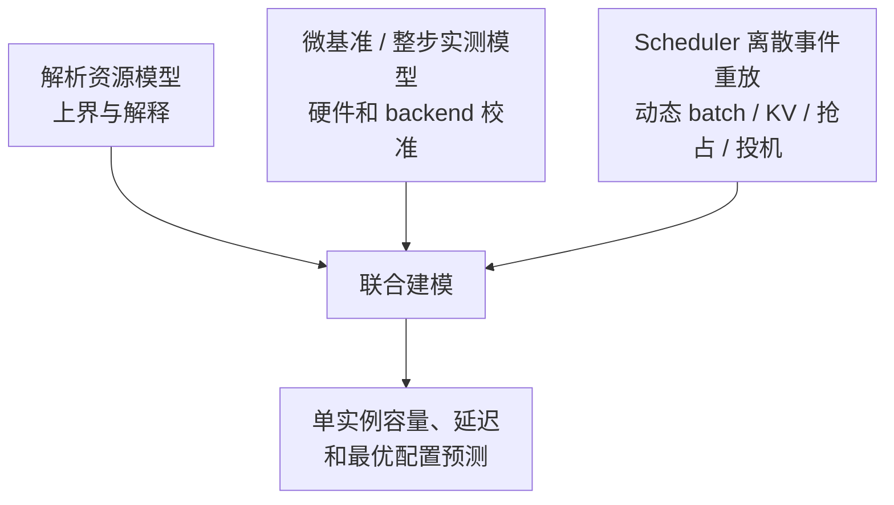
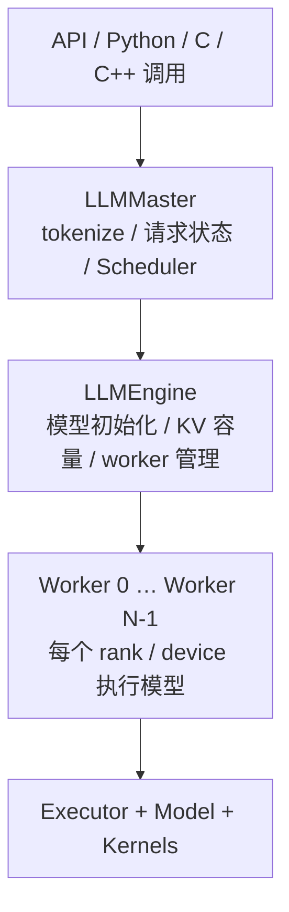

# xLLM 推理引擎能力与性能建模基线

> 基线代码：`af9af7e832f2e37e4890d1e6902790adf01fab59`
>
> 阅读范围：xLLM 引擎本仓库。本文记录的是上述 commit 的代码能力快照，不是 xLLM Service 架构协议；当前控制面边界以 [总体架构](./01_XLLM_SERVICE_ARCHITECTURE_DESIGN.md)和[V1 实现规格](./02_XLLM_SERVICE_V1_IMPLEMENTATION_SPEC.md)为准。
>
> 控制面对照：同级 `xllm-service` 代码库 `322bcda03793`，仅用于核对现有实例发现、调度和输出路径；其 V1 改造以 02 第 14 节为准。
>
> 存放说明：本文是能力基线的 canonical 文档，归档在 vLLM 私有仓库；源码引用固定指向上述 xLLM commit，避免随 xLLM main 分支变化而失效。xLLM 源码仓库根目录下的同名文件只保留跳转指针，不再维护第二份正文。
>
> 文档目标：先准确说明当前 xLLM 能做什么、能力边界在哪里，再给后续“单实例推理性能建模与最优配置搜索”建立统一入口。

## 1. 核心结论

xLLM 不是只在 CUDA 上替换几个 Kernel 的推理框架。它是一套以 C++ runtime 为主、针对多种加速器做后端适配，并覆盖 LLM、VLM、Embedding/Rerank、DiT 和生成式推荐的推理引擎。

对于我们后续最关心的自回归 LLM，当前代码已经覆盖：

1. continuous batching、chunked prefill、prefill/decode 混合批次、优先级与 SLO-aware 调度；
2. block 化 KV、prefix cache、混合 Attention/线性状态缓存、host 分层缓存和 P/D KV 传输；Mooncake/KV Store 封装存在，但本基线主路径未启用；
3. DP、隐式 TP、EP、CP、KV split、多机多卡和计算通信重叠；
4. P/D 分离、P/D online-offline colocation、KV PUSH/PULL 和异构 P/D；
5. CUDA/ACL/MLU/DCU Graph、prefill piecewise graph、输入连续缓冲区和 schedule overlap；
6. MTP、Eagle3、Suffix、DFlash 投机解码；
7. FP8、SmoothQuant、W8A8/W4A8 等多种量化路径；
8. 请求、Scheduler、KV、模型、采样、投机等较完整的运行指标；
9. 一套解析 Roofline 模型和一套启动时实测拟合模型。

但“已经有性能模型”不等于“已经能自动给任意模型、硬件、输入输出分布找到最优配置”。当前缺少的是：

- 面向真实 ragged batch 的逐 step workload 表示和可回放 trace；
- 按模型、后端、量化、并行策略和 graph bucket 标定的算子/整步性能数据库；
- 对 MoE 路由、通信、混合 batch、投机接受率、KV 淘汰和调度动态的统一模型；
- 带显存、正确性和 SLO 约束的配置搜索与实测闭环。

因此，后续建模不应从一个新的纯理论公式重新开始，而应组合现有三部分：



## 2. 先统一 xLLM 中的实例、worker 和 rank

### 2.1 一个 xLLM instance 是什么

本文把“一次 xLLM 服务启动、由一个 Master 统一接收请求并调度的一组计算资源”称为一个 **xLLM instance**。

它可以只使用一张卡，也可以跨本机多卡或多机多卡。一个 instance 内部主要是：



主流程可从 [llm_master.cpp](https://github.com/xLLM-AI/xllm/blob/af9af7e832f2e37e4890d1e6902790adf01fab59/xllm/core/distributed_runtime/llm_master.cpp)、[llm_engine.cpp](https://github.com/xLLM-AI/xllm/blob/af9af7e832f2e37e4890d1e6902790adf01fab59/xllm/core/distributed_runtime/llm_engine.cpp)、[worker.cpp](https://github.com/xLLM-AI/xllm/blob/af9af7e832f2e37e4890d1e6902790adf01fab59/xllm/core/runtime/worker.cpp) 和 [executor_impl_factory.cpp](https://github.com/xLLM-AI/xllm/blob/af9af7e832f2e37e4890d1e6902790adf01fab59/xllm/core/runtime/executor_impl_factory.cpp) 串起来阅读。

### 2.2 worker 与 rank

在 xLLM 引擎内部，`Worker` 是一个设备 rank 的执行封装，不等同于集群 Router 看到的服务副本：

- 每个本地可见设备会创建一个本地 worker；
- 多机时总 `world_size = 每机设备数 × nnodes`；
- worker 之间组成 collective process group；
- 本地 worker 可在线程内运行，也可能为离线推理或 NUMA 隔离创建独立进程；
- 远端 worker 通过 brpc channel 控制；启用条件满足时本地可走共享内存。

实现见 [dist_manager.cpp](https://github.com/xLLM-AI/xllm/blob/af9af7e832f2e37e4890d1e6902790adf01fab59/xllm/core/distributed_runtime/dist_manager.cpp)。

### 2.3 xLLM Service 调度的是 instance

本项目不是在现有 `xllm-service` 之外另建控制面，而是直接扩展它。当前代码已经由每个 Service 的 `InstanceMgr` 维护全量实例视图，并通过 RR/CAR/SLO-aware 在请求到达时选择单个 P/D；目标 V1 将该接口扩展为“选定 P + 有序 D candidates”，增加进程内重试和结果中继约束，但不建设全局 KV、Request Coordination Store 或 Placement Controller。xLLM Engine instance 继续负责本地 Scheduler、KV 分配、原子准入和模型执行。

所以需要区分：

- **实例内决策**：本轮 batch 放哪些 sequence、每个请求本轮做多少 token、KV block 如何分配、是否抢占；
- **集群级决策**：请求发到哪个 xLLM instance；V1 的 P/D 数量由离线容量规划和人工扩缩容决定，V3 才由 Placement Controller 自动调整。

接口边界可参考 [xLLM-service 概览](https://github.com/xLLM-AI/xllm/blob/af9af7e832f2e37e4890d1e6902790adf01fab59/docs/src/content/docs/zh/features/xllm_service_overview.md)、[disagg_pd.md](https://github.com/xLLM-AI/xllm/blob/af9af7e832f2e37e4890d1e6902790adf01fab59/docs/src/content/docs/zh/features/disagg_pd.md) 和 [xservice_client.cpp](https://github.com/xLLM-AI/xllm/blob/af9af7e832f2e37e4890d1e6902790adf01fab59/xllm/core/runtime/xservice_client.cpp)。

## 3. 请求到一次模型执行的路径

### 3.1 Master

`LLMMaster` 完成请求参数校验、模板处理、tokenize、Request 构造、并发准入，并把请求交给 Scheduler。请求处理线程池和模型执行循环分离，避免 tokenizer/API 处理直接阻塞主调度循环。

### 3.2 Scheduler

Scheduler 持有请求/sequence 状态、KV block manager，并为每个 DP rank 构造 `Batch`。它决定的是动态的 step，而不是用户传入的静态 batch：

- 某个 step 可以是纯 Prefill、纯 Decode 或两者混合；
- Prefill 请求可只执行一个 chunk；
- Decode 通常每个活跃 sequence 推进一个 token，投机解码时可能提交多个 token；
- DP 场景下同一调度轮会得到多个 rank-local batch。

### 3.3 Batch 和 ForwardInput

`Batch` 保存本轮选中的 sequence、每条 sequence 的 token allowance、forward type 和 KV 搬移信息。随后 `BatchInputBuilder` 把它展开为 `ForwardInput`：

- 扁平化 `token_ids`、`positions`；
- 每条序列的 `q_seq_lens`、`kv_seq_lens` 和累计长度；
- `block_tables`、`new_cache_slots`、KV swap/copy 信息；
- sampling 参数；
- DP/EP/CP 元数据；
- speculative verify、MTP、multimodal、graph 等附加元数据。

这两个结构是后续逐 step 性能建模最重要的真实 workload 边界，见 [batch.h](https://github.com/xLLM-AI/xllm/blob/af9af7e832f2e37e4890d1e6902790adf01fab59/xllm/core/framework/batch/batch.h)、[model_input_params.h](https://github.com/xLLM-AI/xllm/blob/af9af7e832f2e37e4890d1e6902790adf01fab59/xllm/core/framework/model/model_input_params.h) 和 [forward_params.h](https://github.com/xLLM-AI/xllm/blob/af9af7e832f2e37e4890d1e6902790adf01fab59/xllm/core/runtime/forward_params.h)。

### 3.4 Worker 与 Executor

Worker 根据任务和投机算法选择 LLM、VLM、Embedding、Rec、DiT、MTP、Eagle3、Suffix 或 DFlash 实现。Executor 再选择 eager、设备 Graph 或 Python executor 路径。

xLLM 同时支持：

- 原生 C++ 模型/layer/kernel 实现；
- 嵌入 Python 的模型执行路径；
- Python executor 的 eager、CUDA Graph、ACL Graph 或 `torch.compile` backend。

相关代码见 [worker.cpp](https://github.com/xLLM-AI/xllm/blob/af9af7e832f2e37e4890d1e6902790adf01fab59/xllm/core/runtime/worker.cpp)、[model_registry.cpp](https://github.com/xLLM-AI/xllm/blob/af9af7e832f2e37e4890d1e6902790adf01fab59/xllm/models/model_registry.cpp)、[py_causal_lm.cpp](https://github.com/xLLM-AI/xllm/blob/af9af7e832f2e37e4890d1e6902790adf01fab59/xllm/models/llm/py_causal_lm.cpp) 和 [python/model_executor](https://github.com/xLLM-AI/xllm/tree/af9af7e832f2e37e4890d1e6902790adf01fab59/xllm/python/model_executor)。

## 4. 单实例 Scheduler 能力

### 4.1 Scheduler 类型

[scheduler_factory.cpp](https://github.com/xLLM-AI/xllm/blob/af9af7e832f2e37e4890d1e6902790adf01fab59/xllm/core/scheduler/scheduler_factory.cpp) 中当前可选择：

| Scheduler | 用途 |
|---|---|
| `ContinuousScheduler` | 默认自回归动态批处理 |
| `ZeroEvictionScheduler` | 提前保留未来 Decode 容量，减少中途淘汰/重算 |
| `DisaggPDScheduler` | P/D 分离 |
| `PDOOCScheduler` | P/D 与在线/离线 colocation |
| `FixedStepsScheduler` | 固定步执行，主要用于推荐/特定离线模式 |
| `DiTDynamicBatchScheduler` | DiT 动态 batch |

### 4.2 默认调度参数

以当前 [scheduler_config.cpp](https://github.com/xLLM-AI/xllm/blob/af9af7e832f2e37e4890d1e6902790adf01fab59/xllm/core/framework/config/scheduler_config.cpp) 为准：

| 参数 | 默认值 | 含义 |
|---|---:|---|
| `max_tokens_per_batch` | 10240 | 一轮允许处理的 token budget |
| `max_seqs_per_batch` | 200 | 一轮 sequence 上限 |
| `enable_chunked_prefill` | true | 长 Prefill 分块 |
| `max_tokens_per_chunk_for_prefill` | -1 | 单请求 Prefill chunk 上限，-1 表示不额外限制 |
| `enable_mix_batch` | true | Prefill 与 Decode 混合 |
| `enable_schedule_overlap` | false | CPU 调度与设备执行流水重叠 |
| `prefill_scheduling_memory_usage_threshold` | 0.95 | Prefill 准入的 KV 使用阈值 |
| `priority_strategy` | `fcfs` | 请求排序策略 |
| `use_zero_evict` | false | 启用 Zero Eviction |

模型 recipe 或 auto config 可以覆盖默认值，不能把全局默认值误认为某个模型的推荐值。

### 4.3 Continuous batching 和三类队列

默认 Scheduler 维护新 Prefill、chunk continuation 和 running Decode 等状态。每轮在 token、sequence、KV 和可选 latency budget 下重新组 batch，请求不需要等同批次其他请求全部结束。

这使 Decode 完成的 slot 可以立即释放，新请求也可在下一轮加入；因此 xLLM 的“batch size”至少要拆成：

- `num_sequences`：本轮 sequence 数；
- `num_query_tokens`：本轮实际计算的新 token 总数；
- 标准化后的 `kv_cached_before_step[]`：每条 sequence 在本轮前已有的 KV；
- Prefill/Decode/混合组成；
- padding 后的 graph bucket 或 DP/EP 对齐形状。

仅给一个平均 batch size 无法精确预测 step latency。

### 4.4 Prefill/Decode 策略

调度策略已从 Scheduler 主体中拆出，见 [scheduler_policy.h](https://github.com/xLLM-AI/xllm/blob/af9af7e832f2e37e4890d1e6902790adf01fab59/xllm/core/scheduler/scheduler_policy.h)：

- 不允许混合 batch 时使用 `PrefillFirstPolicy`，Prefill 和 Decode 互斥；
- 允许混合且使用一般优先级策略时使用 `DecodeFirstPolicy`：先保护 running Decode/进行中的工作，再把剩余 budget 给 Prefill；
- 只有 `enable_mix_batch=true && priority_strategy=multi_slo_and_prio` 才使用 `UnifiedPolicy`，把多优先级和 TTFT/TPOT/TTLT SLO 放进统一混批选择逻辑。

这里“Decode first”不是简单地永远拒绝 Prefill。它是在当前 token、sequence、KV 和 starvation 约束下先构造 decode-maximal 部分，再用剩余预算吸收 chunked/new Prefill。

`resolve_batch_mode()` 会在 CP、MTP、未启用 chunked prefill 或 P/D Prefill 角色下强制关闭 mixed batch。此时即使配置了 `multi_slo_and_prio`，factory 也会选择 `PrefillFirstPolicy`，不会进入 `UnifiedPolicy`。`PrefillFirstPolicy` 仍保留部分优先级/SLO 排序与预算逻辑，但 Prefill/Decode 互斥，不能把它当作统一混批 SLO 调度已经生效。配置搜索必须把这个静默策略切换建模为派生配置，而不能只校验字符串参数。

### 4.5 Chunked prefill

长 Prompt 不必在一个 step 内做完，而是被切为多个 chunk。这有三个效果：

- 防止一个长 Prompt 独占整轮 token budget；
- 允许和 Decode 混批，降低 Decode 抖动；
- 把 Prefill 计算粒度变成动态变量。

调度时会先匹配 prefix cache，再对未命中的 prompt 部分计算 chunk budget。新请求的准入仍需考虑完整请求可能占用的 KV footprint，而不只是当前 chunk。

实现见 [continuous_scheduler.cpp](https://github.com/xLLM-AI/xllm/blob/af9af7e832f2e37e4890d1e6902790adf01fab59/xllm/core/scheduler/continuous_scheduler.cpp)、[decode_first_policy.cpp](https://github.com/xLLM-AI/xllm/blob/af9af7e832f2e37e4890d1e6902790adf01fab59/xllm/core/scheduler/decode_first_policy.cpp) 和 [prefill_first_policy.cpp](https://github.com/xLLM-AI/xllm/blob/af9af7e832f2e37e4890d1e6902790adf01fab59/xllm/core/scheduler/prefill_first_policy.cpp)。

### 4.6 优先级与 SLO

当前 comparator 注册了：

- `fcfs`
- `priority`
- `deadline`
- `sjf`
- `decode_density`
- `density`
- `multi_slo_and_prio`
- `decode_urgency_density`
- `urgency_priority`
- `decode_deadline`

请求参数可携带 priority 以及 TTFT、TPOT、TTLT 等目标。排序和 UnifiedPolicy 可以利用这些字段，但只有开启对应策略、提供有效 SLO 并完成必要 profiling 时，才构成真正的 latency-aware scheduling。

实现见 [priority_comparator.cpp](https://github.com/xLLM-AI/xllm/blob/af9af7e832f2e37e4890d1e6902790adf01fab59/xllm/core/framework/request/priority_comparator.cpp)、[unified_policy.cpp](https://github.com/xLLM-AI/xllm/blob/af9af7e832f2e37e4890d1e6902790adf01fab59/xllm/core/scheduler/unified_policy.cpp) 和 [request_params.h](https://github.com/xLLM-AI/xllm/blob/af9af7e832f2e37e4890d1e6902790adf01fab59/xllm/core/framework/request/request_params.h)。

### 4.7 抢占、重算与暂停

KV 不足时，普通 continuous scheduler 可以释放被抢占 sequence 的 block，并把请求重新放回 Prefill 路径，之后通过重算恢复上下文。这不是“无损把活跃请求暂停在设备上”。

面向在线/离线混部还提供 WAIT、KEEP、ABORT 等暂停语义：

- WAIT：等待在途执行排空，保留 KV；
- KEEP：排空后释放 KV，恢复时重新 Prefill；
- ABORT：取消请求。

Zero Eviction 则通过预留未来 Decode 容量降低中途淘汰概率，代价是准入更保守、可能牺牲瞬时吞吐。实现见 [zero_eviction_scheduler.cpp](https://github.com/xLLM-AI/xllm/blob/af9af7e832f2e37e4890d1e6902790adf01fab59/xllm/core/scheduler/zero_eviction_scheduler.cpp) 和 [zero_evict_scheduler.md](https://github.com/xLLM-AI/xllm/blob/af9af7e832f2e37e4890d1e6902790adf01fab59/docs/src/content/docs/zh/features/zero_evict_scheduler.md)。

### 4.8 Schedule overlap

开启后，CPU 在设备执行第 N 轮时准备第 N+1 轮。Scheduler 先写入 fake token，上一轮真实输出返回后再替换，从而形成一阶流水。

它优化的是 CPU 调度、输入准备和设备执行之间的空洞，不会减少模型本身 FLOPs。启用后建模必须同时表示“执行 N”与“准备 N+1”，整步时间近似：

```text
T_steady_step ≈ max(T_device_N, T_schedule_and_prepare_N+1) + T_unhidden_sync
```

而不是把两部分直接相加。实现和限制见 [async_schedule.md](https://github.com/xLLM-AI/xllm/blob/af9af7e832f2e37e4890d1e6902790adf01fab59/docs/src/content/docs/zh/features/async_schedule.md) 和 [continuous_scheduler.cpp](https://github.com/xLLM-AI/xllm/blob/af9af7e832f2e37e4890d1e6902790adf01fab59/xllm/core/scheduler/continuous_scheduler.cpp)。

## 5. KV Cache 能力

### 5.1 默认内存策略

当前 [kv_cache_config.cpp](https://github.com/xLLM-AI/xllm/blob/af9af7e832f2e37e4890d1e6902790adf01fab59/xllm/core/framework/config/kv_cache_config.cpp) 的关键默认值为：

| 参数 | 默认值 |
|---|---:|
| `block_size` | 128 tokens |
| `max_memory_utilization` | 0.8 |
| `max_cache_size` | 0，按可用显存自动估算 |
| `enable_prefix_cache` | true |
| `enable_in_batch_prefix_cache` | false |
| `kv_cache_dtype` | `auto` |
| `indexer_cache_dtype` | `auto` |
| `xxh3_128bits_seed` | 1024 |

启动时每个 worker 报告可用/总设备内存，Engine 扣除配置保留量并取各 rank 最小值，再根据模型结构、KV dtype、local KV heads、层数、block size、线性状态和投机配置计算 block 数。实现见 [llm_engine.cpp](https://github.com/xLLM-AI/xllm/blob/af9af7e832f2e37e4890d1e6902790adf01fab59/xllm/core/distributed_runtime/llm_engine.cpp) 和 [kv_cache_estimation.cpp](https://github.com/xLLM-AI/xllm/blob/af9af7e832f2e37e4890d1e6902790adf01fab59/xllm/core/framework/kv_cache/kv_cache_estimation.cpp)。

### 5.2 KV block、slot 与 block table

- slot 对应一条 sequence 的一个 token 在某类 cache 中的位置；
- block 是固定数量 slot 的分配和淘汰单位；
- block table 把逻辑 token 区间映射到物理 cache block；
- 默认一个 block 容纳 128 token，但可配置。

大 block 减少 metadata 和查表开销，但加大尾部碎片、prefix 复用粒度和抢占代价；因此 `block_size` 既是内存参数，也是性能搜索参数。

### 5.3 Prefix cache

只有完整 block 才进入可复用索引。当前 hash 实现是 chained XXH3-128。设固定配置种子为 `s`：

```text
h_0 = XXH3_128(block_tokens_0, seed = s)
h_i = XXH3_128(h_(i-1) || block_tokens_i, seed = s)
```

多模态块还会把 modality item hash 纳入标识。匹配从第一个 block 连续向后，一旦中断就停止；空闲缓存块按 LRU 选择淘汰，活跃引用通过 ref count 保护。

实现见 [block_hasher.cpp](https://github.com/xLLM-AI/xllm/blob/af9af7e832f2e37e4890d1e6902790adf01fab59/xllm/core/framework/prefix_cache/block_hasher.cpp)、[prefix_cache.cpp](https://github.com/xLLM-AI/xllm/blob/af9af7e832f2e37e4890d1e6902790adf01fab59/xllm/core/framework/prefix_cache/prefix_cache.cpp) 和 [block_manager_impl.cpp](https://github.com/xLLM-AI/xllm/blob/af9af7e832f2e37e4890d1e6902790adf01fab59/xllm/core/framework/block/block_manager_impl.cpp)。

需要注意：仓库文档 [prefix_cache.md](https://github.com/xLLM-AI/xllm/blob/af9af7e832f2e37e4890d1e6902790adf01fab59/docs/src/content/docs/zh/features/prefix_cache.md) 描述了 `enable_prefix_cache_aware_dp_routing` 及两个 threshold，但本基线源码中未检索到这些参数的注册或实现。当前不能仅凭该文档把“实例内 prefix-aware DP routing”认定为已闭环能力；后续应以可运行参数和测试重新确认。

### 5.4 混合 Cache 形态

xLLM 不只支持标准 MHA KV，block 类型还包括：

- 标准 `KV`；
- Sliding Window Attention 的 `SWA`；
- DeepSeek V4 等结构使用的 `C4`、`C128`；
- speculative decode 使用的逐 sequence `EMBEDDING` row slot；
- 线性 Attention/SSM 的 `LINEAR` 状态。

因此不能用统一的 `2 × layers × kv_heads × head_dim × bytes` 公式覆盖所有模型。DeepSeek V4、Qwen3.5 hybrid attention 等需要按 cache group 分项计算，并加入固定窗口、indexer、scale 和 linear checkpoint 预算。

入口见 [block.h](https://github.com/xLLM-AI/xllm/blob/af9af7e832f2e37e4890d1e6902790adf01fab59/xllm/core/framework/block/block.h)、[composite_block_manager.cpp](https://github.com/xLLM-AI/xllm/blob/af9af7e832f2e37e4890d1e6902790adf01fab59/xllm/core/framework/block/composite_block_manager.cpp)、[sliding_window_block_manager.cpp](https://github.com/xLLM-AI/xllm/blob/af9af7e832f2e37e4890d1e6902790adf01fab59/xllm/core/framework/block/sliding_window_block_manager.cpp) 和 [linear_state_block_manager.cpp](https://github.com/xLLM-AI/xllm/blob/af9af7e832f2e37e4890d1e6902790adf01fab59/xllm/core/framework/block/linear_state_block_manager.cpp)。

### 5.5 分层缓存与动态搬移

`HierarchyBlockManagerPool` 支持设备 KV 与 host cache 间的 D2H/H2D：

- sequence 释放时，可把符合条件的完整缓存块异步下沉到 host；
- 后续命中时预取回设备；
- 支持批量、超时、layer-wise transfer 等配置；
- 由 `host_blocks_factor > 1.0` 打开当前 host offload 数据路径。

这解决的是已缓存前缀的分层保存和再次使用。对于仍在 Decode 的活跃请求，设备 KV 不够时，默认主路径仍更倾向抢占并重算；不能理解成任意活跃 sequence 都能无代价透明换出、边传输边继续 Decode。

Mooncake/KV Store 相关类、TCP/RDMA 和 metadata/master 配置仍保留在仓库中，但本基线 `WorkerImpl` 的旧 Store 初始化路径已在 block-manager 重构期间注释，现行初始化硬编码 `enable_kvcache_store(false)`，仓库内也没有 `KVCacheStore::init()` 调用点。因此当前已闭环能力只有 device↔host 的 D2H/H2D 分层路径，不能把 Store 封装计为可运行的第三层或跨实例数据路径。

实现与当前开关状态见 [worker_impl.cpp](https://github.com/xLLM-AI/xllm/blob/af9af7e832f2e37e4890d1e6902790adf01fab59/xllm/core/runtime/worker_impl.cpp)、[hierarchy_block_manager_pool.cpp](https://github.com/xLLM-AI/xllm/blob/af9af7e832f2e37e4890d1e6902790adf01fab59/xllm/core/framework/block/hierarchy_block_manager_pool.cpp) 和 [kv_cache_store.cpp](https://github.com/xLLM-AI/xllm/blob/af9af7e832f2e37e4890d1e6902790adf01fab59/xllm/core/framework/kv_cache_transfer/kv_cache_store.cpp)。

### 5.6 全局 KV

xLLM/xllm-service 文档和组件设计描述了通过 xllm-service、etcd 与 KV Store 实现跨实例 prefix 索引、offload 和 prefetch 的目标形态：

- xLLM instance：上报、上传、预取和消费 KV；
- 现有 xllm-service：维护全局元数据并据此路由；
- KV store/Mooncake 等：承载实际数据传输和存储。

详见 [global_kvcache.md](https://github.com/xLLM-AI/xllm/blob/af9af7e832f2e37e4890d1e6902790adf01fab59/docs/src/content/docs/zh/features/global_kvcache.md)。但在本基线 xLLM engine 主路径中 Store 初始化被关闭，所以“全局索引 + instance 上传/预取 + Store 数据传输”尚未形成可运行闭环。P/D 的显式 KV PUSH/PULL 是另一条数据路径，不能据此推导全局 KV Store 已经可用。当前能力表和建模第一阶段均应把全局 KV 标为设计/待恢复能力。

### 5.7 KV 量化

运行时文档化的主路径是 `auto` 与 MLU 限定的 `int8`，并受模型类型、VLM/P/D 等组合约束；但配置校验并不对称：

- `indexer_cache_dtype` 仅接受 `auto`/`int8`，非法值会 `FATAL`；
- `kv_cache_dtype` 在 `KVCacheConfig::validate()` 中没有枚举校验，未知字符串在容量估算中按模型 dtype 字节数回退，worker 也只有等于 `int8` 时才启用量化，因而可能静默变成未量化路径；
- estimator 虽认识 `fp8_e4m3`/`fp8_e5m2` 并按 1 byte 计容量，但这只是估算逻辑，不能单独证明对应平台、模型和 kernel 的运行时支持。

因此不能把它泛化成跨平台 INT4/FP8 KV 能力。配置搜索器必须读取运行后的 effective dtype/量化开关并做 smoke test；不能把“参数被解析”当作“量化已生效”，也不能假设所有非法候选都会被拒绝。

校验和容量估算分别见 [kv_cache_config.cpp](https://github.com/xLLM-AI/xllm/blob/af9af7e832f2e37e4890d1e6902790adf01fab59/xllm/core/framework/config/kv_cache_config.cpp) 与 [kv_cache_estimation.cpp](https://github.com/xLLM-AI/xllm/blob/af9af7e832f2e37e4890d1e6902790adf01fab59/xllm/core/framework/kv_cache/kv_cache_estimation.cpp)。

## 6. 并行与通信

### 6.1 LLM 并行语义

当前 LLM 的主要配置是：

| 参数 | 作用 |
|---|---|
| `dp_size` | MLA/Attention Data Parallel group 数 |
| `ep_size` | MoE Expert Parallel 大小 |
| `cp_size` | DSA Attention 的 Context Parallel 大小 |
| `kv_split_size` | 在部分 CP ranks 间切 KV cache |
| `enable_multi_stream_parallel` | Prefill microbatch 计算/通信双流重叠 |
| `enable_dp_balance` | 对 DP batch 内 sequence 重新均衡 |

对普通 LLM，代码没有单独的 `tp_size` 启动参数；有效 rank group 大小由 `world_size / dp_size` 推导，并在内部承担张量并行相关工作。`tp_size` 这个显式参数在当前配置中只用于 DiT。

也没有发现通用 LLM Pipeline Parallel 启动旋钮。后续配置搜索不能照搬训练的 TP/PP/DP 笛卡尔积，而应以 xLLM 当前真正可配置和模型已实现的组合为准。

实现见 [parallel_config.cpp](https://github.com/xLLM-AI/xllm/blob/af9af7e832f2e37e4890d1e6902790adf01fab59/xllm/core/framework/config/parallel_config.cpp)、[dist_manager.cpp](https://github.com/xLLM-AI/xllm/blob/af9af7e832f2e37e4890d1e6902790adf01fab59/xllm/core/distributed_runtime/dist_manager.cpp) 和 [parallel_state](https://github.com/xLLM-AI/xllm/tree/af9af7e832f2e37e4890d1e6902790adf01fab59/xllm/core/framework/parallel_state)。

### 6.2 CP 与 KV split

`cp_size` 用于 DSA/长上下文 Attention。`kv_split_size` 的含义是：

- `1`：每个 CP rank 保存完整 KV，不做 KV prefix AllGather；
- `0`：兼容旧语义，跟随 `cp_size`；
- 其他 K：K 必须整除 `cp_size`，KV 在 K 个 rank 之间切分，而 token CP 仍使用 `cp_size`。

这是一个显存、通信和 attention kernel 形状的联合参数。当前还存在一个配置实现细节：`kv_split_size` 已注册 gflag，但 [parallel_config.cpp](https://github.com/xLLM-AI/xllm/blob/af9af7e832f2e37e4890d1e6902790adf01fab59/xllm/core/framework/config/parallel_config.cpp) 的 JSON 读取/导出路径没有处理它；使用 JSON 配置时需实测确认或改代码。

CP 还存在明显的平台/模型限制。例如 NPU 模型侧 CP 只对注册的 DSA 模型和特定 backend 开放，MLU 的 CP/P/D/投机组合也有约束。校验逻辑主要在 [master.cpp](https://github.com/xLLM-AI/xllm/blob/af9af7e832f2e37e4890d1e6902790adf01fab59/xllm/core/distributed_runtime/master.cpp) 和 [model_registry.cpp](https://github.com/xLLM-AI/xllm/blob/af9af7e832f2e37e4890d1e6902790adf01fab59/xllm/models/model_registry.cpp)。

### 6.3 MoE、EP 与 EPLB

MoE 路径覆盖 grouped/fused expert 计算、EP collective 和多硬件 backend。EP 不只减少单 rank expert weight，它会引入 token dispatch/combine、AllGather 或 All-to-All，并受路由分布影响。

EPLB 会统计 expert load，计算带冗余 expert 的新布局，并在运行中分层迁移/更新权重。它解决热点 expert 导致的 rank straggler，但迁移本身也有带宽和同步成本。

实现见 [eplb](https://github.com/xLLM-AI/xllm/tree/af9af7e832f2e37e4890d1e6902790adf01fab59/xllm/core/framework/eplb)、[fused_moe.cpp](https://github.com/xLLM-AI/xllm/blob/af9af7e832f2e37e4890d1e6902790adf01fab59/xllm/core/layers/common/fused_moe.cpp) 和 [eplb.md](https://github.com/xLLM-AI/xllm/blob/af9af7e832f2e37e4890d1e6902790adf01fab59/docs/src/content/docs/zh/features/eplb.md)。

建模 MoE 时至少需要：每层 top-k、expert 数、EP size、每个 rank 的 routed token histogram、padding、通信字节数和最慢 rank 时间；只用“激活参数量”无法预测 collective 尾延迟。

### 6.4 计算通信重叠

xLLM 有多条平台相关路径：

- Prefill multi-stream，把 batch 拆为 microbatches 并重叠计算/通信；
- Ascend FlashComm，用 sequence shard、ReduceScatter 和可选 matmul-RS 融合优化长 Prefill；
- EP All-to-All 与 expert 计算流水；
- P/D KV transfer 与执行重叠；
- layer-wise weight/KV copy。

这些能力不能用一个统一开关描述，均受模型、平台、量化和 shape 限制。详见 [multi_streams.md](https://github.com/xLLM-AI/xllm/blob/af9af7e832f2e37e4890d1e6902790adf01fab59/docs/src/content/docs/zh/features/multi_streams.md) 和 [flashcomm.md](https://github.com/xLLM-AI/xllm/blob/af9af7e832f2e37e4890d1e6902790adf01fab59/docs/src/content/docs/zh/features/flashcomm.md)。

## 7. P/D 分离与在线/离线混部

### 7.1 角色

当前实例角色包括 `DEFAULT`、`PREFILL`、`DECODE`、`MIX`。P/D 分离后，P 和 D 是分别启动的 xLLM instance，各自内部仍可以是多机、多 rank 和不同并行策略。

本项目 xLLM Service 一次生成 `selected_p + ordered_d_candidates`。P 在即将进入 scheduler running batch 时按顺序向候选 D 请求本地硬准入，首个成功 D 才被实际绑定；Service 的快照和排序不是容量承诺。单个 xLLM instance 负责本地 batch、KV 分配和 forward。旧代码中的既有选点顺序只用于说明改造起点，不能覆盖该目标流程。

### 7.2 KV 交接

Prefill 实例执行 Prompt，生成首 token 和 KV 元数据；Decode 实例分配目标 block，并通过配置的传输 backend 接收或拉取 KV，然后继续生成。

当前代码包含：

- PUSH/PULL 模式；
- LlmDataDist 和 Mooncake 等传输实现；
- 同构与部分异构 P/D；
- 非 MLA 场景下的分片/并行 KV 拉取；
- MTP 相关状态随 P/D 交接。

具体兼容性受 NPU/MLU/DCU、模型 cache 结构、TP/CP/KV split 和 backend 限制，不能只看通用接口判断。入口见 [disagg_pd_scheduler.cpp](https://github.com/xLLM-AI/xllm/blob/af9af7e832f2e37e4890d1e6902790adf01fab59/xllm/core/scheduler/disagg_pd_scheduler.cpp)、[kv_cache_transfer](https://github.com/xLLM-AI/xllm/tree/af9af7e832f2e37e4890d1e6902790adf01fab59/xllm/core/framework/kv_cache_transfer) 和 [disagg_pd.md](https://github.com/xLLM-AI/xllm/blob/af9af7e832f2e37e4890d1e6902790adf01fab59/docs/src/content/docs/zh/features/disagg_pd.md)。

### 7.3 P/D-OOC

`PDOOCScheduler` 支持 P/D 与 online/offline workload 共置，通过优先级、暂停/恢复和资源预算提高闲时利用率。它还使用当前 `PerfModel` 做部分容量决策。

不过 [pd_ooc_scheduler.cpp](https://github.com/xLLM-AI/xllm/blob/af9af7e832f2e37e4890d1e6902790adf01fab59/xllm/core/scheduler/pd_ooc_scheduler.cpp) 中的设备性能参数仍带有固定 profile，不能把它视为可移植到任意模型/硬件的通用预测器。

## 8. Graph、输入准备和执行开销

### 8.1 设备 Graph

当前 C++ executor 包含：

- CUDA Graph；
- Ascend ACL Graph；
- MLU Graph；
- DCU Graph。

默认 `enable_graph=false`。开启后主要优化 Decode 的 kernel launch 和 CPU 空洞；`enable_prefill_piecewise_graph` 可让 Prefill attention 保持 eager，而捕获其余片段。

关键配置见 [execution_config.cpp](https://github.com/xLLM-AI/xllm/blob/af9af7e832f2e37e4890d1e6902790adf01fab59/xllm/core/framework/config/execution_config.cpp)：

| 参数 | 默认值 |
|---|---:|
| `enable_graph` | false |
| `enable_graph_double_buffer` | true |
| `enable_graph_mode_decode_no_padding` | false |
| `enable_prefill_piecewise_graph` | false |
| `enable_graph_vmm_pool` | true |
| `max_tokens_for_graph_mode` | 2048 |
| `use_contiguous_input_buffer` | true |

### 8.2 Shape bucket 与 fallback

Graph 需要稳定地址和可复用 shape。xLLM 使用 persistent parameters、token/batch bucket、padding 或 no-padding capture，并在超出支持形状或组合不兼容时回退 eager。

因此建模必须区分：

```text
实际有效 token/sequence
        !=
Graph 捕获/执行的 padded token/sequence bucket
```

对小 Decode batch，padding 与 graph launch 的收益/成本尤其敏感；对超大 batch，某些平台会因 OOM 风险回退 eager。

### 8.3 VMM pool 与连续输入缓冲区

Graph VMM pool 让多 shape graph 复用物理内存并保持虚拟地址稳定。`ForwardInput` 还能把 token、position、attention metadata 和 sampling tensor 打包到连续 host/device buffer，减少碎片化 H2D 和分配开销。

实现见 [cuda_graph_executor_impl.cpp](https://github.com/xLLM-AI/xllm/blob/af9af7e832f2e37e4890d1e6902790adf01fab59/xllm/core/runtime/cuda_graph_executor_impl.cpp)、[acl_graph_executor_impl.cpp](https://github.com/xLLM-AI/xllm/blob/af9af7e832f2e37e4890d1e6902790adf01fab59/xllm/core/runtime/acl_graph_executor_impl.cpp)、[mlu_graph_executor_impl.cpp](https://github.com/xLLM-AI/xllm/blob/af9af7e832f2e37e4890d1e6902790adf01fab59/xllm/core/runtime/mlu_graph_executor_impl.cpp)、[dcu_graph_executor_impl.cpp](https://github.com/xLLM-AI/xllm/blob/af9af7e832f2e37e4890d1e6902790adf01fab59/xllm/core/runtime/dcu_graph_executor_impl.cpp) 和 [forward_params.h](https://github.com/xLLM-AI/xllm/blob/af9af7e832f2e37e4890d1e6902790adf01fab59/xllm/core/runtime/forward_params.h)。

## 9. 投机解码

### 9.1 当前算法

[speculative_config.cpp](https://github.com/xLLM-AI/xllm/blob/af9af7e832f2e37e4890d1e6902790adf01fab59/xllm/core/framework/config/speculative_config.cpp) 和 [worker.cpp](https://github.com/xLLM-AI/xllm/blob/af9af7e832f2e37e4890d1e6902790adf01fab59/xllm/core/runtime/worker.cpp) 当前支持：

| 算法 | Draft 来源 | 特点 |
|---|---|---|
| MTP | 模型的 next-token prediction 层 | 与目标模型共享较多结构，支持 draft body TP1 优化 |
| Eagle3 | 独立/附属 draft 模型 | 需要目标 hidden state 等辅助信息 |
| Suffix | 历史 token suffix tree/path | 不要求 draft model，收益依赖重复模式 |
| DFlash | 专用 draft/verify 路径 | 平台与模型约束较强 |

共同参数 `num_speculative_tokens` 控制候选深度；Suffix 另有 tree/path、cache depth、概率阈值和缓存请求数等参数。

### 9.2 验证和指标

xLLM 有 target forward、draft forward、rejection/validation 和结果提交路径，并记录：

- draft latency；
- target latency；
- validation latency；
- draft token 总数；
- accepted token 总数；
- 每个 Decode step 的平均 committed tokens。

这足以计算接受率和单位提交 token 成本，但当前没有看到按 workload 在线在 MTP/Eagle3/Suffix/DFlash/关闭之间切换的通用 controller。`num_speculative_tokens` 仍主要是启动时静态配置。

### 9.3 建模方式

投机解码不能把普通 Decode 吞吐简单乘以 `K`。每步期望提交 token 数为：

```text
E[committed] = 1 + sum(P(前 i 个 draft token 全部通过))
```

净收益应比较：

```text
T_per_committed_token =
  (T_draft(K) + T_target_verify(K) + T_validation + T_extra_comm)
  / E[committed]
```

同时加入 verify 造成的 batch/token 膨胀、draft KV/weight 显存、P/D 状态传输和 DP collective 一致性。

## 10. 量化与权重加载

### 10.1 当前量化表示

[quant_args.h](https://github.com/xLLM-AI/xllm/blob/af9af7e832f2e37e4890d1e6902790adf01fab59/xllm/core/framework/quant_args.h) 统一描述：

- `fp8`
- `smoothquant`
- `ascend_int4`
- `ascend_int8`
- bits、MoE expert weight bits、group size、对称性和 act-order；
- dynamic/static activation；
- weight block size；
- ignored modules；
- Ascend `quant_model_description.json` 的逐 weight 描述；
- compressed-tensors 的命名与模块例外。

权重加载和 layer 路径还识别 compressed-tensors FP8/W8A8 dynamic、SmoothQuant W8A8、部分 MoE W4A8、以及 AWQ/GPTQ 配置。实际可运行集合是“模型实现 × 硬件 backend × weight format × kernel”的交集，不是一个全平台统一 registry。

### 10.2 静态与动态

- Weight-only 或离线量化权重本身是静态的；scale、zero point、group/channel 划分和 packed layout 随 checkpoint 一起加载或转换；
- W8A8/FP8 的 activation 可以是静态 scale，也可以在每 token/每 batch 运行时动态求 scale；
- SmoothQuant 会把 activation outlier 的一部分范围迁移到 weight，离线生成均衡和量化参数；
- `ignored_modules` 支持敏感层回退高精度。

动态 activation quantization 不代表不需要离线质量验证。它只是 scale 在运行时根据当前 activation 计算，权重格式、均衡、例外层和 kernel 仍需确定。

### 10.3 建模注意点

量化会同时改变：

- 权重显存与 HBM 读取字节数；
- GEMM 峰值和可用 kernel；
- quant/dequant、scale reduction 和 layout conversion 成本；
- MoE dispatch 后每 expert 的矩阵形状；
- KV 容量与 attention 读带宽（仅在 backend 真正支持对应 KV dtype 时）。

因此不能只按 bit 数线性缩短时间。每种量化必须独立标定 GEMM/Attention 曲面，并通过模型质量评测确认可用。

## 11. 模型、任务、API 与硬件

### 11.1 任务范围

xLLM 当前不是只做 text generation：

| backend/任务 | 当前代码能力 |
|---|---|
| LLM | completion、chat、sample、embedding、rerank |
| VLM | 多模态 chat/generation、embedding、multimodal embedding |
| DiT | 图像、音频、视频和部分文本扩散 pipeline |
| Rec | OneRec、LLM-Rec、多轮/beam/约束生成 |

API 层包含 OpenAI 风格 completion/chat/embedding/models、Anthropic messages，以及 image/audio/video/text generation、sample 和 recommendation 接口；支持流式与非流式。代码入口见 [api_service](https://github.com/xLLM-AI/xllm/tree/af9af7e832f2e37e4890d1e6902790adf01fab59/xllm/api_service)、[proto](https://github.com/xLLM-AI/xllm/tree/af9af7e832f2e37e4890d1e6902790adf01fab59/xllm/proto)、[c_api](https://github.com/xLLM-AI/xllm/tree/af9af7e832f2e37e4890d1e6902790adf01fab59/xllm/c_api)、[cc_api](https://github.com/xLLM-AI/xllm/tree/af9af7e832f2e37e4890d1e6902790adf01fab59/xllm/cc_api) 和 [pybind](https://github.com/xLLM-AI/xllm/tree/af9af7e832f2e37e4890d1e6902790adf01fab59/xllm/pybind)。

### 11.2 模型族

本基线源码注册/实现覆盖的主要模型族包括：

- DeepSeek V2/V3/V3.2/V4 及部分 MTP；
- GLM 4/5/5.2 MoE/DSA 及 MTP；
- Qwen2、Qwen3、Qwen3 MoE、Qwen3 Next、Qwen3.5；
- Kimi K2/K2.5、MiniMax M2 系列、MiMo、JoyAI、Llama、Oxygen；
- Qwen/GLM/Kimi/MiniCPM/Oxygen 等 VLM；
- Flux、Flux2、Qwen Image、Wan、LongCat、Cola 等 DiT pipeline；
- OneRec 和 LLM-based recommendation。

这份清单按**模型族**归纳，不是完整的 `model_type` 注册表；ATB 变体、Eagle3/DFlash draft、`glm4_moe_lite` 和各种 MTP 类型等需要按实际注册项继续展开。

这也不是兼容性承诺。仓库 [supported_models.md](https://github.com/xLLM-AI/xllm/blob/af9af7e832f2e37e4890d1e6902790adf01fab59/docs/src/content/docs/zh/supported_models.md)、README/release 和源码注册可能漂移。例如本基线 README 宣传 MiniMax-M3，但源码没有对应的 `REGISTER_CAUSAL_MODEL(minimax_m3, ...)`；注册表只明确包含 MiniMax-M2 类型。反过来，源码中出现模型也不意味着所有硬件、量化、Graph、P/D、CP 和投机组合都可用。部署前应以对应 commit 的注册逻辑、cookbook 和实际 smoke/performance test 为准。

### 11.3 硬件

主 README 强调并列出 Ascend NPU、Cambricon MLU、Moore Threads MUSA、Hygon DCU、MetaX MACA 和 Iluvatar ILU；硬件文档还包含 NVIDIA CUDA 路径。

多硬件支持的真实含义是 xLLM 有平台抽象、设备 Graph、collective、kernel 和模型适配，不表示每个 feature 在所有平台一致。后续性能数据库必须以 `(hardware SKU, runtime/driver, backend, model, dtype/quant)` 为 key。

## 12. 可观测性与 profiling

### 12.1 已有运行指标

[metrics.cpp](https://github.com/xLLM-AI/xllm/blob/af9af7e832f2e37e4890d1e6902790adf01fab59/xllm/core/common/metrics.cpp) 已覆盖：

- 请求量、并发 sequence、pending/finished/preempted；
- prompt/generated token；
- TTFT、inter-token latency、端到端 latency、Scheduler latency；
- KV 总量、空闲/已用/prefix block、利用率、各 DP rank 活跃 KV/activation；
- model、logits、sampling，以及名为 `engine_latency_seconds` 和 `worker_service_latency_seconds` 的 engine/worker-service 累计延迟；当前没有名为 `worker_step_latency` 的独立指标；
- tokenize/detokenize；
- speculative draft/target/validation、draft/accepted token。

这些指标适合线上 SLO 和容量观察，但聚合 histogram/counter 不能完整还原每个 step 的 ragged shape。

### 12.2 在线 profiler

CUDA 路径支持通过 `/start_profile`、`/stop_profile` 启停 profiler，可用 torch Kineto 或 cudaProfiler/nsys 范围。详见 [online_profiling.md](https://github.com/xLLM-AI/xllm/blob/af9af7e832f2e37e4890d1e6902790adf01fab59/docs/src/content/docs/zh/dev_guide/online_profiling.md)。其他平台需要接各自 profiler 或统一时间线接口。

### 12.3 启动时 step profiling

`ProfileManager` 能构造合成请求实测 Prefill/Decode step，并拟合 `TimePredictor`：

Prefill 不考虑 prefix 时：

```text
T_prefill(x) = a0 + a1*x + a2*x^2
```

考虑 prefix 时，令 `diff = token_length - prefix_length`：

```text
T_prefill = a0 + a1*diff^2 + a2*diff
              + a3*diff*prefix_length + a4*prefix_length
```

Decode：

```text
T_decode = a0 + a1*seq_num + a2*seq_num*(token_length - 1)
```

还可按 TPOT budget 反查允许的 token budget。实现见 [profile_manager.cpp](https://github.com/xLLM-AI/xllm/blob/af9af7e832f2e37e4890d1e6902790adf01fab59/xllm/core/scheduler/profile/profile_manager.cpp)、[time_predictor.cpp](https://github.com/xLLM-AI/xllm/blob/af9af7e832f2e37e4890d1e6902790adf01fab59/xllm/core/scheduler/profile/time_predictor.cpp) 和 [profile_config.cpp](https://github.com/xLLM-AI/xllm/blob/af9af7e832f2e37e4890d1e6902790adf01fab59/xllm/core/framework/config/profile_config.cpp)。相关开关默认关闭。

复用前必须处理本基线中的两个实现缺陷：

1. 无 prefix 的 Prefill 拟合以 `token_length` 为自变量，但 `predict_time()` 在有缓存输入时改用 `length - prefix_length`，训练与推断变量语义不一致；
2. 无 prefix 分支的 `get_quadratic_root()` 把 `coefficients_(1)` 当二次项、`coefficients_(2)` 当一次项，而拟合多项式中 index 1/2 分别是一次项/二次项。

在修复并做回归验证前，不能把该反解结果直接用于配置剪枝或 SLO 可行性判定；已有 profile 数据也应记录 predictor 代码版本。

当前 batch 预测主要把单 sequence 预测相加再加入常数项，无法精确表示：

- ragged batch 内 kernel 的联合效率；
- Graph bucket/padding；
- Prefill/Decode 混批相互影响；
- TP/EP/CP collective 和 overlap；
- MoE 路由不均衡；
- 量化/kernel/backend 切换；
- 投机 verify shape。

它适合做 Scheduler 的轻量近似，不足以直接承担全配置自动寻优。

## 13. 现有解析性能模型

### 13.1 Resource 与 Roofline

[perf_model.h](https://github.com/xLLM-AI/xllm/blob/af9af7e832f2e37e4890d1e6902790adf01fab59/xllm/core/scheduler/perf_model.h) 和 [perf_model.cpp](https://github.com/xLLM-AI/xllm/blob/af9af7e832f2e37e4890d1e6902790adf01fab59/xllm/core/scheduler/perf_model.cpp) 已定义：

```text
Resource = {FLOPs, memory_bytes, network_bytes, latency}
```

并对 Linear、MHA、AllReduce、MLP、Attention、Transformer layer 和整个 LLM 估算资源量。当前单个 op 的时间近似取：

```text
T_roof = max(
  FLOPs / effective_compute_rate,
  memory_bytes / effective_memory_bandwidth,
  network_bytes / effective_network_bandwidth
)
```

如果分母使用不可超过的硬件峰值，分子使用算法/流量下界，那么 `T_roof` 才是条件严格的延迟下界。当前 `PerfModel` 使用的是配置的 effective rate，因此它首先是解析估算值；除非证明这些 rate 构成上界，否则不能直接称为永久理论上限。

### 13.2 理论边界、经验 Oracle 与预测值

设备规格表峰值适合建立极乐观的硬件—算法边界，但无法预测特定推理 shape。对真实预测，应该用 microbenchmark 标定：

- `effective_compute_rate(shape, dtype, quant, kernel)`；
- `effective_memory_bandwidth(access_pattern, concurrency)`；
- `effective_collective_bandwidth(message_size, topology, ranks)`；
- 固定 launch/sync/runtime overhead。

最终必须区分：

1. `hardware_theoretical_bound`：规格/实证峰值与算法最小工作量形成的条件理论边界；
2. `empirical_stack_oracle`：当前 kernel/backend 在同 shape 下的最佳稳定实测目标，可被未来实现超过；
3. `configuration_prediction`：经过 LUT/residual、关键路径和 Scheduler replay 后的真实配置预测。

否则 Roofline 只适合判断数量级和瓶颈方向，不能预测几十毫秒级的真实 TTFT/ITL，也不能准确回答当前软件栈还有多少可兑现的空间。

### 13.3 当前使用边界

现有解析模型主要在 PD-OOC Scheduler 中使用，且当前存在固定设备参数。它没有读取完整模型图、MoE 路由、混合 cache group、量化 kernel 和实际 batch trace，也没有形成“输入 workload → 搜索所有合法配置 → 输出最优解”的完整工具。

这部分应复用其 `Resource` 抽象和 Roofline 思路，但需要重新做 profile schema、校准和验证。

## 14. 后续如何精准建模一个 xLLM instance

完整的工程方案、公式、Trace schema、Scheduler 离散事件重放、校准与配置搜索流程，见 [《xLLM 单实例推理引擎性能建模与自动配置方案》](./03_XLLM_INFERENCE_ENGINE_MODELING_DESIGN.md)。本节只保留非规范性摘要，详细范围、公式和实施顺序以该方案文档为准；两处表述不一致时不得据此另起一套建模路线。

### 14.1 首个建模闭环范围

建议先限定：

- backend：自回归 text LLM；
- 单个 xLLM instance，可含多机多 rank；
- 不含 API Gateway 排队和多 instance 路由；
- 首个可交付闭环支持 dense/GQA/MLA、BF16/FP16、eager/graph，并覆盖 continuous batching、chunked prefill 和 mixed batch 的 Scheduler replay；
- P、D 两种角色从基础单实例 profile 开始分别建模，供 xLLM Service M1 使用；P/D 端到端 KV 传输和联动模型后续加入；
- prefix reuse、抢占、MoE、hybrid linear attention 和 speculative 在基础闭环之后逐项加入。

VLM encoder、DiT 和 Rec 的计算图与调度语义明显不同，不应在第一个统一模型中强行混合。

### 14.2 用户输入是否足够

用户设想的输入：

```text
模型 + 硬件 + batch size
+ 输入长度 min/mean/max
+ 输出长度 min/mean/max
```

足以做**粗略 sizing 和初始候选配置**，不足以做精准动态 batch/延迟预测。至少还需要：

| 输入 | 为什么需要 |
|---|---|
| 长度分布或分位数/直方图 | 相同 min/mean/max 可以对应完全不同的长尾和 KV 压力 |
| 输入输出联合分布 | `P(output|input bucket)` 或二维 histogram 决定长输入/长输出是否共同进入尾部 |
| arrival/closed-loop 模式 | 决定动态 batch 是由并发数还是到达率形成 |
| prefix 复用分布 | 决定真实 Prefill token 和 KV 命中 |
| SLO | “性能最优”必须明确是最低延迟、最高吞吐还是满足 SLO 后最低卡数 |
| 模型 checkpoint/量化 | 决定权重、kernel、显存和精度路径 |
| 并发数或 QPS | 单个 API batch size 不等于 Scheduler 每步 batch |

其中：

- `input_output_correlation` 只能作为缺少联合数据时的情景 fallback；边缘分布加一个相关系数不能唯一确定联合分布或尾部依赖；
- `closed_loop` 表示固定并发客户端：一个请求完成后同一客户端才发下一个请求；`open_loop` 则按外部到达过程产生请求。

如果只有 min/mean/max，第一版可以构造一个明确声明的三点分布，但必须输出预测区间并说明该分布是假设，不应宣称“精准”。

### 14.3 静态配置空间

后续优化器至少搜索：

```text
world_size / nnodes / devices
dp_size / ep_size / cp_size / kv_split_size
dtype / quantization / KV dtype
max_memory_utilization / max_cache_size / block_size
max_tokens_per_batch / max_seqs_per_batch
chunked prefill 开关与 chunk 大小
mixed batch / zero evict / schedule overlap
graph / graph bucket / piecewise graph
multi-stream / microbatch 数
speculative method / K
```

搜索前先由 capability resolver 删除不合法组合，例如模型不支持 CP、某硬件不支持 KV INT8、某量化没有 kernel、投机与 worker/graph/P/D 组合冲突。resolver 还必须输出启动后的 effective config：尤其要核对 KV dtype/量化开关和实际 Scheduler policy，防止把静默回退当作候选已生效。

### 14.4 显存模型

每 rank 显存应拆账：

```text
M_static_reserved = weight + runtime + graph_private_pool
                  + preallocated_KV/linear_pool + static_draft

M_transient(step) = activation_live_set + backend_workspace
                  + collective/logits/staging_live_set

M_peak(step) = allocation_lifetime_high_water_mark(
                 M_static_reserved, M_transient(step))
```

KV 部分直接复用 [kv_cache_estimation.cpp](https://github.com/xLLM-AI/xllm/blob/af9af7e832f2e37e4890d1e6902790adf01fab59/xllm/core/framework/kv_cache/kv_cache_estimation.cpp) 的模型结构感知计算，而不是另写一个只适合标准 MHA 的公式。实际启动后的 worker free-memory measurement 也应作为最终校准。Graph pool、allocator reserved 和 activation 可能复用物理区域，不能把各自 peak 直接相加。

“不 OOM”必须验证 Scheduler、KV pool 和配置约束下的**联合可达** token/sequence/context/Graph/backend workspace envelope，而不是 workload p99，也不能把各维最大值机械组成不可达的笛卡尔积；不确定度和 safety reserve 只加入一次。运行时 KV block 不足则进入等待、抢占或重算，应计入延迟和 goodput，不能再次等同于物理 OOM。

“几张卡能部署”应分两步：

1. **可放下下限**：至少多少 rank 能容纳 weight、runtime 和最低 KV/activation；
2. **满足 workload/SLO 的卡数**：在目标长度、并发和延迟下，KV 容量与 step 性能是否足够。

前者只回答能否启动，后者才回答能否服务。

### 14.5 Step shape：精准模型的最小输入

建议把每个真实 Scheduler step 规范化为：

```yaml
step_features:
  forward_type: prefill | decode | mixed | spec_verify
  length_encoding: per_sequence_normalized
  logical_num_sequences: 32
  kernel_num_sequences: 40
  sequence_features:
    - {role: decode, q: 1, kv_before: 2047, kv_after: 2048,
       prefix_cache_reused: 0, requires_logits: true}
  backend_and_graph_bucket: "..."
  parallel_group_map: "..."
  cache_blocks_by_group: "..."

step_observation:
  timing_labels: "..."
  memory_high_water_mark: "..."
  committed_or_accepted_tokens: "..."
```

记录点应放在 `Batch` 已确定且 `ForwardInput` 已构造之后，因为这里已经包含 Scheduler 的真实决定和 executor 看到的 shape。xLLM 内部数组在不同平台可能采用累计或逐序列编码，因此导出器必须先标准化；不能把原始 `ForwardInput` 数组无条件解释为逐序列长度。训练和 replay 只能把 `step_features` 作为输入，不能把执行后的 timing/memory 标签泄漏回 predictor。逐序列 role 不能只从 `q=1` 推断；CP/EP/KV split 下也必须保存算子实际使用的 group map。

### 14.6 单步时间模型

每个 event 先采用分层混合预测：

```text
t_event = SelectOrBlend(
  analytical_calibrated,
  LUT_interpolation,
  OOD_fallback
) + event_residual
```

再把各 rank 的真实 compute/communication/copy/CPU event 和 collective barrier 放入跨 rank、带资源约束的 DAG：

```text
T_instance_step = ResourceConstrainedCriticalPath(
                    cross_rank_DAG(t_event), contention_model)
                + exposed_runtime_overhead
```

Analytical 和 LUT 是同一 event 的替代/混合预测器，不是两条可以直接进入 Critical Path 的并行路径。共享 HBM/compute/物理链路时按总 work/共享有效容量推进；资源不相交才默认完全重叠，compute↔collective/copy 等组合用 isolated A/B 与 concurrent A+B 微基准标定 overlap efficiency，未知组合保守串行。DP/MoE step 由最慢 rank 和 collective barrier 决定，不能平均各 rank 时间。真实整步 benchmark 负责校验融合、Graph、padding 和 exposed runtime，但必须用 feature ownership 防止重复计时。

### 14.7 从 step 到完整请求

完整 workload 必须重放 Scheduler 状态：

1. 按 open-loop arrival 或 closed-loop concurrency 生成请求；
2. 根据输入输出联合分布确定每条请求长度；
3. 执行 prefix match 和 KV admission；
4. 运行真实或等价 Scheduler 生成每轮 Batch；
5. 用 step model 预测本轮时间；
6. 推进 token、释放/分配 KV，处理完成、抢占和投机接受；
7. 汇总请求 TTFT、ITL/TPOT、E2E、吞吐和 KV 峰值。

这里最稳妥的方案是复用真实 `ContinuousScheduler` 做离散事件仿真，而不是在 Python 里重新实现一个近似调度器后逐渐偏离源码。

重放还必须锁定 Scheduler 自己消费的 `TimePredictor`/`PerfModel` snapshot：当前线上配置不能由外部 step model 偷换内部预算；只有评估并准备部署新 Scheduler predictor 时，才同时替换 replay 与 runtime 的内部 predictor。采用 realized output length 的 replay 中 fake-token replacement 是 no-op，无法额外预测 EOS/stop 内容变化。

### 14.8 优化目标

不存在脱离约束的唯一“性能最优”。建议默认定义为：

```text
在给定硬件预算和 workload 下：
  固定 measurement boundary
  满足 engine_TTFT_p99 <= target
  满足 TPOT_p99 <= target
  满足 E2E_p99 <= target
  满足 SLO attainment target
  队列稳定，admissible envelope 内不 OOM，质量约束通过
然后最大化 open-loop capacity goodput 或最小化卡数/成本。
```

若目标是单请求最低延迟，往往会选择更少 batching、更多并行；若目标是最高吞吐，则会接受更大 batch 和更高排队。工具必须把 Pareto frontier 给出来，而不是只返回一个没有目标解释的配置。

给定负载下满足 SLO 的完成率是 `achieved_goodput(lambda)`；配置容量是满足 attainment、queue stability 和 memory policy 时可持续的最大 offered load。closed-loop concurrency 下的吞吐不能直接替代 open-loop capacity。

### 14.9 与训练 MFU 对应的推理效率指标

推理没有一个能覆盖所有阶段的单一 MFU。建议同时报告：

- **Prefill effective FLOP utilization**：实际 Prefill FLOPs /（耗时 × 设备对应 dtype 有效峰值）；
- **Decode memory-bandwidth utilization**：估算 HBM bytes /（耗时 × 有效 HBM 带宽）；
- **Communication utilization/overhead**：collective bytes、有效带宽和 critical-path 占比；
- **hardware-bound efficiency**：`T_hw_floor / T_measured`；
- **current-stack efficiency**：`T_stack_oracle / T_measured`；
- **useful-token efficiency**：有效提交 token / 实际计算 token，投机、padding、重算都会降低它；
- **achieved/capacity goodput**：给定负载下满足 SLO 的完成量，以及队列稳定时的最大可持续负载。

核心优化空间可以写成：

```text
theoretical_headroom = T_measured / T_hw_floor
current_stack_headroom = T_measured / T_stack_oracle
```

`T_hw_floor` 是满足公式前提时的理论下界，通常很松；`T_stack_oracle` 是当前 backend/kernel 的经验目标，可以被未来实现超过。请求级 headroom 必须用同一 workload 分别重放 predictor 与 Oracle，不能把 step efficiency 简单平均。Gap 归因还需要 counterfactual replay，因为 compute、padding、Graph、CPU 和调度收益存在交互，不能直接相加。

### 14.10 推荐实施顺序

**MP0：可观测和可重放**

- 分离导出 StepFeatures 与 StepObservation，防止 timing label 泄漏；
- 建立 deterministic joint-workload generator，支持条件联合分布和 open/closed loop；
- 固定 engine/server/client measurement boundary 和统计协议；
- 建立静态/瞬态显存账本，与启动时 KV pool 和 admissible shape envelope 对齐。

**MP1：基础单实例与角色模型**

- Dense/GQA/MLA，Prefill/Decode 分开；
- eager 与 graph；
- TP/DP 基础通信；
- 分别生成 DEFAULT/PREFILL/DECODE 角色的单实例 profile；
- 分开建立硬件理论边界、当前软件栈经验 Oracle 和真实预测器；
- 用微基准校准 event predictor，用整步数据校验 residual/critical path；
- 输出误差分布，不只输出平均误差。

**MP2：动态 Scheduler**

- chunked prefill、mixed batch、schedule overlap；
- prefix cache、KV eviction/recompute、Zero Evict；
- closed/open-loop 离散事件重放、capacity goodput、queue stability 与 TTFT/TPOT 分位数；
- counterfactual replay 和 gap interaction。

**MP3：KV 动态**

- prefix cache、KV eviction/recompute 和 Zero Evict；
- host D2H/H2D hierarchy；Store 只在数据路径重新启用并通过 smoke test 后纳入。

**MP4：MoE、长上下文、投机和 P/D 联动**

- EP token histogram、All-to-All、EPLB；
- MTP/Eagle3/Suffix/DFlash 接受率模型；
- P/D KV transfer 与 P/D-OOC。

**MP5：自动配置搜索**

- capability pruning；
- 显存和 SLO 约束；
- 多目标 Pareto 搜索；
- 对候选 Top-N 自动实测，回写性能数据库并更新模型。

## 15. 当前 auto config 的真实成熟度

xLLM 已有 [auto_config](https://github.com/xLLM-AI/xllm/tree/af9af7e832f2e37e4890d1e6902790adf01fab59/xllm/auto_config) 框架：launcher 读取模型 `model_type`，识别硬件，加载每模型 JSON 和 Python tuner，生成 tuned config。

但本基线只有 Qwen3 profile。其配置给出一组静态推荐值，Python tuner 主要按可见设备数修改 `nnodes`、在 ARM 上收紧 token budget，NPU hook 仍是 TODO。

所以它目前更接近“按模型/平台维护的 recipe 生成器”，还不是基于 workload、实测性能和 SLO 的自动优化器。后续可以保留它作为输出配置和 capability policy 层，把新的建模/搜索结果写回该格式。

## 16. 已确认的能力边界和源码/文档差异

1. Prefix cache 默认启用，但文档描述的 prefix-aware DP routing 参数在本基线源码中没有找到注册/实现，暂不计入已确认能力。
2. `kv_split_size` 有 gflag 和运行语义，但当前 ParallelConfig JSON 读取/导出未包含它。
3. `version.txt`、supported-models 页面、release/源码存在更新节奏差异；本文以 commit 和源码为基线。
4. 模型源码存在不等于所有硬件/量化/Graph/P/D/投机组合均受支持。
5. 文档化的 KV INT8 当前是 MLU 限定能力；`kv_cache_dtype` 又缺少枚举校验，未知值可能静默回退，搜索器必须验证 effective dtype。
6. 全局 KV 是 xLLM + xllm-service + Store 的系统设计，不是单个 engine 自己完成全局路由，也不是本基线已闭环能力。
7. 当前解析 PerfModel 和 TimePredictor 都是有用基础，但尚不能直接精准搜索任意 workload 的最优配置。
8. 当前 auto config 只覆盖 Qwen3，且主要是静态 recipe，不是在线或 profile-driven autotuner。
9. LLM 没有通用显式 PP 配置；不能直接套用训练并行搜索空间。
10. 活跃 Decode KV 在显存不足时并非普遍透明换出继续运行，默认仍需考虑抢占/重算和等待。
11. host D2H/H2D 分层路径可由 `host_blocks_factor > 1.0` 启用，但 Mooncake/KV Store 初始化在当前 `WorkerImpl` 主路径被硬编码关闭，不能计为可运行的第三层/全局 KV 数据路径。
12. CP、MTP、无 chunked prefill 或 P/D Prefill 角色会关闭 mixed batch；此时 `multi_slo_and_prio` 不进入 `UnifiedPolicy`，而是走互斥 batch 的 `PrefillFirstPolicy`。
13. `TimePredictor` 的无-prefix Prefill 路径存在拟合/预测自变量不一致和二次方程系数索引错误，修复前不能用其反解结果做严格可行性剪枝。

## 17. 代码阅读地图

| 主题 | 入口 |
|---|---|
| Master/请求循环 | [llm_master.cpp](https://github.com/xLLM-AI/xllm/blob/af9af7e832f2e37e4890d1e6902790adf01fab59/xllm/core/distributed_runtime/llm_master.cpp) |
| Engine/KV 初始化 | [llm_engine.cpp](https://github.com/xLLM-AI/xllm/blob/af9af7e832f2e37e4890d1e6902790adf01fab59/xllm/core/distributed_runtime/llm_engine.cpp) |
| 多机多 rank | [dist_manager.cpp](https://github.com/xLLM-AI/xllm/blob/af9af7e832f2e37e4890d1e6902790adf01fab59/xllm/core/distributed_runtime/dist_manager.cpp) |
| Worker 类型 | [worker.cpp](https://github.com/xLLM-AI/xllm/blob/af9af7e832f2e37e4890d1e6902790adf01fab59/xllm/core/runtime/worker.cpp) |
| Executor 选择 | [executor_impl_factory.cpp](https://github.com/xLLM-AI/xllm/blob/af9af7e832f2e37e4890d1e6902790adf01fab59/xllm/core/runtime/executor_impl_factory.cpp) |
| Batch | [batch.h](https://github.com/xLLM-AI/xllm/blob/af9af7e832f2e37e4890d1e6902790adf01fab59/xllm/core/framework/batch/batch.h) |
| ForwardInput | [forward_params.h](https://github.com/xLLM-AI/xllm/blob/af9af7e832f2e37e4890d1e6902790adf01fab59/xllm/core/runtime/forward_params.h) |
| Attention/并行元数据 | [model_input_params.h](https://github.com/xLLM-AI/xllm/blob/af9af7e832f2e37e4890d1e6902790adf01fab59/xllm/core/framework/model/model_input_params.h) |
| 默认 Scheduler | [continuous_scheduler.cpp](https://github.com/xLLM-AI/xllm/blob/af9af7e832f2e37e4890d1e6902790adf01fab59/xllm/core/scheduler/continuous_scheduler.cpp) |
| 调度策略 | [scheduler_policy.h](https://github.com/xLLM-AI/xllm/blob/af9af7e832f2e37e4890d1e6902790adf01fab59/xllm/core/scheduler/scheduler_policy.h) |
| P/D Scheduler | [disagg_pd_scheduler.cpp](https://github.com/xLLM-AI/xllm/blob/af9af7e832f2e37e4890d1e6902790adf01fab59/xllm/core/scheduler/disagg_pd_scheduler.cpp) |
| P/D-OOC | [pd_ooc_scheduler.cpp](https://github.com/xLLM-AI/xllm/blob/af9af7e832f2e37e4890d1e6902790adf01fab59/xllm/core/scheduler/pd_ooc_scheduler.cpp) |
| KV 容量 | [kv_cache_estimation.cpp](https://github.com/xLLM-AI/xllm/blob/af9af7e832f2e37e4890d1e6902790adf01fab59/xllm/core/framework/kv_cache/kv_cache_estimation.cpp) |
| Prefix cache | [prefix_cache](https://github.com/xLLM-AI/xllm/tree/af9af7e832f2e37e4890d1e6902790adf01fab59/xllm/core/framework/prefix_cache) |
| 分层 KV | [hierarchy_block_manager_pool.cpp](https://github.com/xLLM-AI/xllm/blob/af9af7e832f2e37e4890d1e6902790adf01fab59/xllm/core/framework/block/hierarchy_block_manager_pool.cpp) |
| KV 传输 | [kv_cache_transfer](https://github.com/xLLM-AI/xllm/tree/af9af7e832f2e37e4890d1e6902790adf01fab59/xllm/core/framework/kv_cache_transfer) |
| 并行配置 | [parallel_config.cpp](https://github.com/xLLM-AI/xllm/blob/af9af7e832f2e37e4890d1e6902790adf01fab59/xllm/core/framework/config/parallel_config.cpp) |
| Graph 配置 | [execution_config.cpp](https://github.com/xLLM-AI/xllm/blob/af9af7e832f2e37e4890d1e6902790adf01fab59/xllm/core/framework/config/execution_config.cpp) |
| 投机配置 | [speculative_config.cpp](https://github.com/xLLM-AI/xllm/blob/af9af7e832f2e37e4890d1e6902790adf01fab59/xllm/core/framework/config/speculative_config.cpp) |
| 量化描述 | [quant_args.h](https://github.com/xLLM-AI/xllm/blob/af9af7e832f2e37e4890d1e6902790adf01fab59/xllm/core/framework/quant_args.h) |
| 模型注册 | [model_registry.cpp](https://github.com/xLLM-AI/xllm/blob/af9af7e832f2e37e4890d1e6902790adf01fab59/xllm/models/model_registry.cpp) |
| 解析性能模型 | [perf_model.cpp](https://github.com/xLLM-AI/xllm/blob/af9af7e832f2e37e4890d1e6902790adf01fab59/xllm/core/scheduler/perf_model.cpp) |
| 实测拟合 | [profile_manager.cpp](https://github.com/xLLM-AI/xllm/blob/af9af7e832f2e37e4890d1e6902790adf01fab59/xllm/core/scheduler/profile/profile_manager.cpp) |
| 时间预测器 | [time_predictor.cpp](https://github.com/xLLM-AI/xllm/blob/af9af7e832f2e37e4890d1e6902790adf01fab59/xllm/core/scheduler/profile/time_predictor.cpp) |
| 指标 | [metrics.cpp](https://github.com/xLLM-AI/xllm/blob/af9af7e832f2e37e4890d1e6902790adf01fab59/xllm/core/common/metrics.cpp) |
| Auto config | [auto_config](https://github.com/xLLM-AI/xllm/tree/af9af7e832f2e37e4890d1e6902790adf01fab59/xllm/auto_config) |

## 18. 最终判断

xLLM 已经具备一个现代推理 engine 的主要执行能力，而且在国产加速器、P/D、混合 cache、MoE、Graph 和生成式推荐/DiT 上有明显特色。

对我们的目标而言，最有价值的不是再从零写一个“参数量 × token 数”的计算器，而是：

1. 复用真实 `Batch`、`ForwardInput` 和 Scheduler 作为 workload 与动态状态真值；
2. 复用 KV capacity estimator 做结构感知的显存模型；
3. 复用 `PerfModel` 的资源抽象，替换固定硬件参数并扩展 MoE/混合 cache；
4. 修复并回归验证 `TimePredictor` 的变量/系数问题后，复用 `ProfileManager` 的实测入口，并升级为 ragged batch、backend/graph/并行感知的校准数据库；
5. 在这些基础上增加离散事件重放、SLO 约束和配置搜索。

这样最终才能可靠回答：给定模型、硬件、输入输出联合分布与并发，几张卡能放下、什么配置能满足 SLO、理论/校准上限在哪里，以及当前实现还剩多少优化空间。
