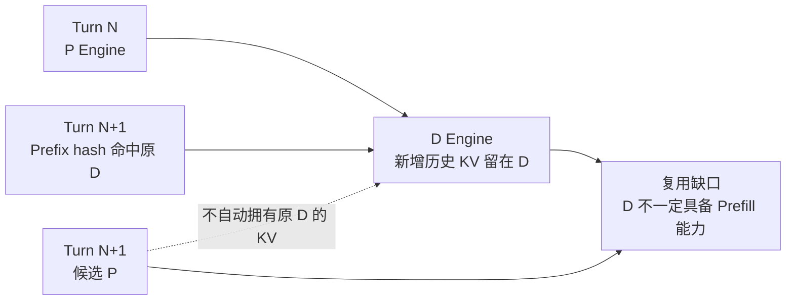
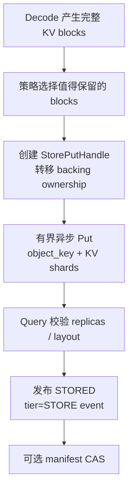

# xLLM Service：集群 KV 内存层与跨请求复用设计

## 1. 文档信息与阶段定位

- 状态：V2.5 主路线设计；依赖 V1 资源协议和 V2 KVIndex
- 日期：2026-08-05
- 依赖：[总体架构](./01_XLLM_SERVICE_ARCHITECTURE_DESIGN.md)、[KV-aware Router](./08_XLLM_SERVICE_CLUSTER_KV_AWARE_ROUTER_DESIGN.md)
- 目标：让 Prefix KV 跨 Engine、内存层和请求存活，并在加载、传输和重算之间做成本选择

本文不只解决多轮对话。适用 workload 包括共享 system prompt、few-shot、RAG 文档前缀、batch、agent/子 agent 分支、工具调用后的多轮追加和其他重复 Prefix。

核心边界：

1. 正常同轮 P→D handoff 继续使用直接传输，Store 不进入基础请求正确性路径。
2. Service 只保存 KV 位置、tier、版本和成本提示，不保存 KV tensor。
3. KV tensor 位于 Engine HBM/DRAM/SSD 或 Mooncake Store，真实可用性由 Engine/Store 查询决定。
4. 请求默认携带能够独立 Prefill 的完整输入；Store/manifest 不是对话文本、token 历史或业务状态的唯一真相。
5. Prefix/session KV 不包含 sampler、RNG、grammar、speculative、输出 cursor 或 Decode checkpoint，不能用于首 token 后的 Decode 迁移。
6. KV 层故障最多降低命中和性能，不能降低普通请求成功率或 Service readiness。

## 2. 为什么 V2 KVIndex 还不够

KVIndex 只回答“某段 Prefix 可能在哪里”，不负责把 KV 移到执行位置。在 P/D 分离场景中，上一轮新增 token 的 KV 主要位于 D，而下一轮 Prefill 默认在 P：



因此“索引找到 D”不等于“下一轮 P 可以复用”。必须至少具备下面一种数据路径：

- 原 D 支持 append/local Prefill；
- D→P 对称直传；
- D 将生成 KV 写穿共享层，兼容 P 从 Store 恢复；
- 放弃复用并完整重算。

V2.5 的命名交付项是 **D 侧生成 KV 写穿共享层**。没有它时，轮次间隔超过本地 HBM 存活期或原 D 不支持 Prefill 的 agentic workload 会结构性退化为完整重算。

是否优先建设 Store 还取决于 P 本地 Prefix 的生存上界。V2-K0 必须先按 profile 采集 P 总/活跃/保留 block、eviction reason、Prefix residence time 与复用间隔；若目标 Prefix 已接近占满 P 可保留池，单纯 KV-aware 选点无法制造命中，扩大 P KV、D→P 或 Store 才是有效路径。GLM-5.2 当前证据见 [10 §6.3](./10_XLLM_SERVICE_GLM52_ONLINE_BOTTLENECK_ANALYSIS.md)，具体 block 数不外推到其他模型。

## 3. Mooncake Store 数据模型

### 3.1 Put-once KV 对象

KV block 依赖全部前序上下文，使用链式前缀哈希。**该哈希的唯一定义在 [08 §4](./08_XLLM_SERVICE_CLUSTER_KV_AWARE_ROUTER_DESIGN.md)，本文不重复定义也不增删前像输入**：`namespace` 为整请求常量，`block_extra[i]` 逐 block 携带多模态摘要，`positions` 不参与。Store 对象键直接复用 Router 与 Engine 计算出的同一个 `h[n]`：

```text
h[n]        = 见 08 §4（全系统同一前像）
object_key  = namespace / storage_kv_layout_digest
              / h[n] / cache_group / layer / shard
```

`storage_kv_layout_digest`（含存储侧 dtype、量化、分片布局，以及影响字节解释的 Provider/Runtime/Connector serialization 版本）**绑定在对象键路径上，不进入 `h[n]` 的前像**。这样做的原因是两者的作用域不同：`h[n]` 回答“这是哪一段 Prefix 内容”，需要在 Router、Engine 本地 cache、KV 事件和 Store 之间全局一致；`storage_kv_layout_digest` 回答“这份字节以什么布局落盘”，只对 Store 对象有意义。若把它折进哈希，Store 发布的 `STORED` 事件所携带的 hash 将与 Router 自行计算的 `h[n]` 不相等，两者落入不同键空间，KVIndex 会静默地永远 miss。

它与 11 的执行侧 `kv_layout_digest` 不是同一摘要：后者用于 P/D 传输与 topology transform 兼容，前者描述实际落盘字节及 `store_serialization_version`。只有落盘布局完全由执行布局决定时，Provider 才可显式声明 `storage_kv_layout_digest = H(kv_layout_digest || store_serialization_version)`；不得隐含相等或可推导，两者都不进入 `h[n]`。

同一 object key 的内容不可覆盖；不同 layout 的同一段 Prefix 是不同对象，不跨 layout 复用。P/D 只有命中包含 Provider/profile 与 Connector 版本的显式 storage-layout 兼容矩阵时才能写入或恢复，不做未验证的在线任意布局转换。重复 Put 返回 `OBJECT_ALREADY_EXISTS` 并按幂等成功处理。对象必须支持 Remove，供 TTL、策略淘汰和孤儿 GC 使用。

跨租户复用默认关闭。只有显式共享策略授权、内容与隐私审查通过且命名空间使用共享 isolation domain 时才允许；否则 tenant salt 不同的对象永不互认。

### 3.2 写穿策略

D 不同步阻塞每个 Decode step 写 Store。Engine 按完成 block 或轮次边界产生有界异步 write-back/write-through 任务：



策略至少考虑 Prefix 复用概率、对象大小、Store/网络负载、业务 TTL、租户预算、重算成本，以及本地 snapshot copy 的 bytes/time 上界、staging headroom、内存带宽余量和对共驻 Decode TPOT 的影响。对 `COPY_ON_PUT` 先执行不产生 handle 的软成本评估和 D 本地原子干扰准入：

```text
copy_time_ub = object_bytes / measured_copy_bw_lb(profile, DInterferenceSnapshot)

admit Store copy only if
  snapshot_free_bytes >= object_bytes
  store_copy_tasks_inflight + 1 <= max_store_copy_concurrency
  store_copy_bytes_inflight + object_bytes <= max_store_copy_bytes_inflight
  store_copy_bw_ub(snapshot + candidate_copy) <= max_store_copy_bytes_per_s
  PredictTpot(snapshot + candidate_copy) <= d_decode_tpot_guard(snapshot)
  candidate_copy_tpot_delta_ub <= tpot_headroom_now
  store_reserved_tpot + candidate_copy_tpot_delta_ub
    <= store_copy_tpot_share * optional_interference_budget_ub
```

`measured_copy_bw_lb` 必须在目标 profile 上按 copy 方向、对象大小和 Decode 并发分桶实测，不得用理论带宽。写队列满、原子干扰准入失败、Store 超时或副本不足时丢弃本次 Store credit，不反压 Decode；不得在 KV 尚不可安全读取时发布 `STORED`。准入成功时，budget/staging 预留与 `StorePutHandle(state=SNAPSHOTTING)` 必须在同一本地临界区安装；handle 创建失败则原子回滚。copy 终态时精确一次释放 copy bandwidth/inflight 预算，snapshot buffer 占用则继续跟随 handle 到 Put/Query 终态。

Store connector 与 09 的 `LOCAL_PREFILL_DECODE` 必须在 D 上共用同一个 `DInterferenceBudget`，至少包含 `local_prefill_tokens_inflight`、`store_copy_bytes_inflight`、`store_copy_bw_recent`、`store_rdma_read_bw_recent`、`memory_bw_headroom`、`store_reserved_tpot`、`local_prefill_reserved_tpot` 和预测/实测 TPOT residual。`d_decode_tpot_guard(snapshot)` 是两条路径唯一的绝对上界，由当前共驻 Decode 中最严格的 TPOT/SLO 与 profile 默认 guard 派生；不再保留独立 `store_copy_tpot_guard/configured_tpot_guard`。`tpot_headroom_now`、candidate marginal delta 和 `optional_interference_budget_ub` 的定义以 09 §4 为准。Service 的成本模型只是软选择；D scheduler 和 Store connector 在同一本地临界区内扣减 budget，避免两套独立上限同时认为自己有余量。竞争时优先保证已准入 Decode：新 Store copy 放弃 credit，新本地 Prefill 候选回退 `REMOTE_PD`。`PIN_ON_PUT` 虽然没有 snapshot copy，也必须按 pinned bytes、预计 Store/RDMA 读带宽和同一绝对 TPOT guard/Store share 扣减预算，不能成为绕过干扰准入的零拷贝例外。`store_copy_tpot_share <= local_prefill_tpot_share <= 1`；share 只是分类上限，最终仍以 `PredictTpot(snapshot + candidate) <= d_decode_tpot_guard(snapshot)` 为硬门禁。非线性交互作为当前快照下的 marginal delta 计入后到候选，不能把各类离线常量简单相加。

“丢弃 Store credit”只表示放弃路由收益，不能用于证明 Put 或 DMA 已经终止。每个已开始的写入必须由 Engine 持有显式句柄：

```text
StorePutHandle = {
  put_id, object_key, mode,
  source_buffer_generation,
  state: SNAPSHOTTING | PUTTING | VERIFYING
       | COMMITTED | CANCELLED | FAILED | QUARANTINED,
  backing_ref, deadline
}
```

V2.5-S1 支持两种 backing-memory 模式，但首个生产版本默认 `COPY_ON_PUT`：

1. `COPY_ON_PUT`：先把 KV 复制到有界、已注册的 snapshot/staging pool；本地 copy 明确完成后，StorePutHandle 的 backing ownership 转移到 snapshot buffer，原活跃 KV block 才可以按请求释放。Store timeout 只影响 snapshot buffer。
2. `PIN_ON_PUT`：零拷贝优化；创建 handle 时对活跃 KV block 增加 read pin/refcount，直到 Put/Query 明确终态才减去。cancel 结果不明时复用 transfer 的 `cancel -> poll -> drain -> quarantine/retire generation` 阶梯，不能释放或复用被读取的 block。

队列满且尚未创建 handle 时可以直接放弃写入；handle 一旦创建，无论 credit 是否保留，都必须进入 terminal 或 quarantine。snapshot pool、pin bytes、handle 数量和 deadline 全部有硬上限；`COPY_ON_PUT` 额外固定 `max_store_copy_bytes_inflight`、`max_store_copy_bytes_per_s`、`max_store_copy_concurrency` 和 `store_copy_tpot_share`。达到任一上限时停止创建新 Put，不得挤占 Decode 的必要资源。`PIN_ON_PUT` 额外固定 `max_store_pin_bytes`、`max_store_rdma_read_bytes_per_s` 和同一 Store TPOT share。

普通共享 Prefix 对象按内容寻址即可，不要求 session manifest。只有需要“某个会话版本由哪些有序对象组成”时才创建 manifest。

### 3.3 Session manifest

Mooncake Store 保存大 KV 对象；可选 session manifest 和 writer lease 保存到强一致元数据服务：

```text
session_id, tenant,
context_version, expected_context_version,
prompt_fingerprint, token_count,
ordered_object_keys,
storage_kv_layout_digest,
writer_id, writer_fence, expire_at
```

manifest 更新使用 CAS。Mooncake Store 对象 lease、session writer lease 和业务 TTL 分别管理。孤儿 KV 使用带最小对象年龄的两阶段 mark/sweep：只有对象早于 `orphan_gc_grace`，且连续两轮 manifest 快照均未引用时才删除，避免 Put 已完成但 manifest CAS 尚未提交时被误删。

## 4. 两种会话语义必须分开

### 4.1 默认 full-history/best-effort 模式

客户端每轮携带完整历史。`session_id`、manifest version 和 prompt fingerprint 只用于提高 KV 命中，不能改变请求语义：

- version/fingerprint 匹配且 KV 可用：尝试复用；
- version/fingerprint 不匹配：视为 cache miss/历史分叉，按请求携带历史执行；
- KV 缺失、layout 不兼容或 Store 不可用：完整 Prefill；
- 不持有跨请求 writer lock，不以 409 拒绝一个本可独立执行的请求。

这是 OpenAI 兼容、无服务端会话依赖的默认模式。

### 4.2 显式 strict-session 模式

只有产品显式提供服务端 session API，并承诺单 writer/版本一致性时，才使用：

```text
session_id + expected_context_version + prompt_fingerprint
writer lease + writer_fence + manifest CAS
```

版本不匹配返回稳定冲突，禁止覆盖。strict-session 是独立 API 契约，不得把它的冲突语义施加到默认 full-history 请求，也不能用 manifest 代替上层业务会话存储。

## 5. 跨请求 KV 复用流程

请求仍携带完整输入并计算相同 chained Prefix hash。路由按成本采用以下降级顺序：

1. 候选 P 已有真实本地 Prefix：直接在该 P Prefill。
2. 原 D 健康且已验证支持 append/local Prefill：在原 D 追加，不改变其注册角色。
3. 兼容 D/P 支持对称传输：原 D 将 KV 直传新 P。
4. Store 中存在完整、兼容且收益为正的 Prefix：恢复到兼容 P。
5. 以上均不满足：使用请求携带的完整输入重新 Prefill。

第 2 条是逐请求执行模式选择，不是把 Engine 的注册角色从 DECODE 改成 PREFILL；是否允许取决于 profile capability、chunked prefill、混批隔离和实测 SLO。第 3 条 D→P 直传必须作为独立 capability 加入兼容矩阵，不能默认复用 P→D 协议。

Router 将每条路径统一换算为时间和资源成本：

```text
reuse_cost = lookup_queue + load_or_transfer + admission + risk
recompute_cost = p_queue + prefill_compute + p_to_d_transfer

choose reuse only if
  recompute_cost_lb - reuse_cost_ub > kv_reuse_margin
```

不能以“Store 中存在对象”作为必选条件；网络拥塞、低层加载排队或布局转换代价高时应选择重算。

## 6. 高可用、fencing 与恢复

- 固定 Mooncake fork、commit、协议和编译配置。
- Mooncake Master 启用 HA 与 OpLog，HA backend 使用 etcd；同时固定 snapshot、restore 和灾难恢复流程。`enable_oplog` 属于 Mooncake Master，不是 etcd 自身能力。
- Put 后调用 `Client::Query(object_key)` 校验实际副本和 layout；未达到最小副本时不发布 Store KV credit，也不得提交 strict-session manifest。
- Prefix/session KV 可按 `coordination_domain` 放置副本；副本只提高后续请求的 KV 命中与数据可用性，不提高在飞 Decode 的恢复等级。
- Engine 重启使用新 incarnation；旧 HBM/DRAM/SSD location 立即失去路由 credit。已完成的 Store 对象仍按 object lease 有效，不继承旧 Engine ownership。
- strict-session writer 使用 fencing token；失去 writer lease 的旧进程不能提交新 manifest version。普通 content-addressed Put 依靠 put-once 幂等。
- 请求完成、cancel、Engine drain 或 Store timeout 时，`ReleaseRequestResources` 只能释放请求 ownership；StorePutHandle backing 仍由 snapshot ownership 或 live-block read pin 持有，直到 terminal/quarantine。Engine 进程退出前必须 drain 或 retire 所有 StorePutHandle，不能只删除 handle map。

## 7. 分阶段交付与门禁

V2.5 与 V3 Placement 可以并行、独立上线。V2.5 不依赖自动扩缩容；V3 也必须在 Store 不存在或故障时按完整 cache-loss 成本工作。只有对象已完成 Put、Query 验证和副本门禁后，Placement 才能把该 Prefix 视为可在缩容后恢复，降低 scale-down 的 cache loss；计划写入、in-flight Put 或软 KVIndex 命中都不能抵扣。

| 阶段 | 交付 | 默认行为 |
| --- | --- | --- |
| V2.5-S0 | Store connector、对象 contract、shadow Put/Query、指标与 GC 演练 | 不影响路由 |
| V2.5-S1 | D 完成 block/轮次 KV 写穿，Store event 接入 KVIndex | 只对 allowlist workload 写入 |
| V2.5-S2 | Store→P 恢复与成本模型，agentic/shared-prefix bucket 灰度 | 收益不足自动重算 |
| V2.5-S3 | D→P 对称直传、复制/预取/淘汰策略 | 按 capability 和 bucket 开放 |
| 可选 | strict-session API 与 manifest CAS | 不改变默认 full-history 语义 |

上线必须同时满足：

- Store 完全不可用时，普通请求成功率、V1/V2 readiness 和直接 P→D handoff 不变；
- agentic bucket 明确报告轮次数、轮次间隔、每轮新增 token 比例、Store 命中、加载时间、重算比例、TTFT/TPOT 和 SLO goodput；
- 使用同一 Prefix trace 对比现网 P block 配额、扩大 P KV 和 Store restore；只有 Store 相对最优可行本地方案的净收益置信下界为正，才进入目标 bucket；
- 相对完整重算，目标 bucket 的 SLO goodput/成本收益置信下界为正；
- 写队列、对象数、manifest、GC 和 Store 空间全部有界，无未授权跨租户命中；
- `COPY_ON_PUT` 本地 copy、`PIN_ON_PUT` read pin、Store Put/Query 的每个故障点均做请求完成/cancel/Engine drain 并发注入；不存在被 Put 读取时已经复用的 block，snapshot/pin/handle/quarantine bytes 均有界且最终收敛；
- 在目标 D profile 上实测 snapshot copy 带宽/时延分布；`max_store_copy_bytes_inflight/max_store_copy_bytes_per_s/max_store_copy_concurrency` 和 `d_decode_tpot_guard/store_copy_tpot_share/local_prefill_tpot_share` 都能在 burst 下限制新 Put，共驻 Decode p99 TPOT 与 SLO goodput 不越界；
- `PIN_ON_PUT` 的 pin bytes、Store/RDMA 读带宽和 TPOT 交互同样通过分桶实测与硬上限故障注入，零拷贝模式不得绕过 `DInterferenceBudget`；
- V2-L1 本地 Prefill 与 V2.5-S1 Store 写穿必须做四组同负载对照：`off/off`、`local-only`、`store-only`、`both-on`。报告交互项而不假设两者线性可加；`both-on` 的 TTFT/TPOT/SLO goodput、memory bandwidth 和 Decode opportunity cost 全部通过才可同时开放。若不通过，必须按 bucket 互斥或降低两者共享预算；后上线的能力也必须重新资格化已上线能力，不能只用新的混合基线。
- 四组门禁分别交换 Store/local Prefill 的到达顺序，并覆盖“各自 share 未越界但绝对 TPOT guard 越界”、guard 因更严格 Decode 加入而收紧、无共驻 Decode 使用 profile 默认 guard 三种情况；绝对 guard 失败必须拒绝新 optional work。
- Engine/Store/Master 重启、重复 Put、CAS 冲突和 orphan GC 故障注入不误删已提交对象，不让旧 writer 覆盖新版本；
- Store restore 的 layout、dtype、cache semantics 和 shard 映射 100% 通过兼容测试；
- 首 token 后 D 故障仍明确中断，不因 Store 上线宣称 Decode 可恢复。
