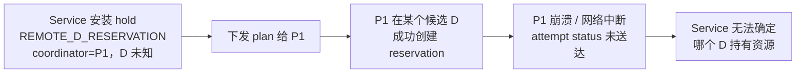

# xLLM Service 设计评审日志

## 1. 文档定位与迭代规则

本文是 01/02 设计文档的常设评审记录，与 [设计决策记录](./06_XLLM_SERVICE_DECISION_LOG.md) 同级：06 记录"为什么这样定"，本文记录"哪里还不对、改了没有"。它不是评审草稿，不随单次评审作废。

迭代规则：

1. **每轮评审追加一章**（第 5 章起），不修改历史章节的结论。历史结论即使后来被推翻也保留，并在原处标注推翻依据——被推翻的判断本身是重要信息。
2. **问题 ID 全局单调递增**（`F01`、`F02`…），一经分配不复用、不重编号。
3. 同一问题在后续轮次被复查时，**更新第 4 章状态表并在该轮章节写"复查"条目**，不分配新 ID。
4. 状态取值：`OPEN`（未处理）、`PARTIAL`（部分处理，仍有残留）、`CLOSED`（已在文档中解决）、`WONTFIX`（确认不处理，须写明理由）。
5. `CLOSED` 必须给出关闭依据的**文档位置**，便于后续回归。
6. 第 3 章是行动项视图，只列 `OPEN/PARTIAL`；第 4 章是全量索引。

每轮章节固定包含：评审对象版本、结论摘要、新增问题、复查结论。

## 2. 已确认的代码事实基线

以下事实经代码核对确认，后续评审可直接引用，无需重复验证。基线 commit：xllm-service `322bcda03793`，xLLM `8164a701bab7`，vLLM-Ascend `ba58907c6d1c`，Mooncake `129a9db9579c`。

**PD 输出路径**

| 事实 | 出处 |
| --- | --- |
| PD 模式下 Decode 直接把 token 发给 xllm-service，不经 Prefill 转发，且这是有意优化 | `xllm/proto/xservice.proto:113-114` |
| Prefill 只上报首 token 并置 `finished_on_prefill_instance=true` | `xllm/core/scheduler/async_response_processor.cpp:152-156` |
| `disagg_pd.proto:219` 的注释 "Stream response token to prefill instance from decode" **与实现不符，是过时注释** | `xllm/proto/disagg_pd.proto:219` |
| PD 模式强制开启 service routing | `xllm/core/distributed_runtime/master.cpp:366-368` |
| `generations()` 逐个 `brpc::Join` 阻塞等待，且 `target_xservice_addr` 为空时回退 master | `xllm/core/runtime/xservice_client.cpp:474-631`、`500-503` |
| P 的首事件在 `step()` 内经 `process_stream_requests` 发出，**早于** `prefill_send_first_generation()` | `xllm/core/scheduler/disagg_pd_scheduler.cpp:288-296` |

**P/D 资源与选择时机**

| 事实 | 出处 |
| --- | --- |
| Service 在下发前就写好 `decode_address`，D 由 Service 选定 | `disagg_pd_scheduler.cpp:336-351` |
| P 同步调用 `AddNewRequests`，在 prefill 计算之前 | `disagg_pd_scheduler.cpp:497-500` |
| D 在 RPC 处理线程内同步 `try_allocate` 分配 KV 块 | `disagg_pd_service_impl.cpp:159-168`、`disagg_pd_scheduler.cpp:1047-1056` |
| D 已按 `request_id` 本地去重（有实现，无 outcome 记录） | `disagg_pd_scheduler.cpp:832-838` |
| **缺陷**：`received_request_map_` 条目无任何超时，P 在 `AddNewRequests` 与 `FirstGeneration` 之间失效则 KV 块永久泄漏 | `disagg_pd_scheduler.cpp:839` |
| **缺陷**：`unlink_instance` 只 erase map，不调用 `deallocate` | `disagg_pd_scheduler.cpp:1132-1143` |
| P 在 `FirstGeneration` 完成后才释放本地 KV | `disagg_pd_scheduler.cpp:795-818` |

**传输能力**

| 事实 | 出处 |
| --- | --- |
| 逐层 PUSH 与 prefill 计算重叠已实现（per-layer synchronizer） | `llm_worker_impl.cpp:253-276`、`mooncake_kv_cache_transfer.cpp:667-687` |
| PULL 的数据搬运在 `decode_recv_first_generation` 内同步执行，无 prefill 重叠 | `disagg_pd_scheduler.cpp:978-1027` |
| 默认传输模式为 PUSH；MLU 强制 PUSH；DCU 允许 PUSH/PULL | `core/runtime/options.h:176`、`disagg_pd_config.h:71`、`disagg_pd_config.cpp:143-147`、`181-186` |
| Mooncake Tent 逐 task cancel 是 best-effort，已投递的设备工作仍可能完成，必须轮询到终态 | `Mooncake/mooncake-transfer-engine/tent/include/tent/transfer_engine.h:316-341` |
| `SendPullSignal` 仅 PDOOC 使用，标准 PD 路径为 `LOG(FATAL)` | `distributed_runtime/disagg_pd_service.cpp:57-62`、`pd_ooc_scheduler.cpp:1327-1379` |

**注册与状态上报**

| 事实 | 出处 |
| --- | --- |
| Engine 经 etcd 带 lease 注册；`RegisterInstance` RPC 在 proto 中存在但引擎侧无调用方 | `xservice_client.cpp:246-287` |
| Engine heartbeat 只发往 etcd 选出的 master xservice | `xservice_client.cpp:116-149`、`342-360` |
| heartbeat 的 `cache_event` 字段从未填充，prefix cache 未上报控制面 | `xservice_client.cpp:351-404` |

**业界对照（用于避免重复论证）**

| 事实 | 出处 |
| --- | --- |
| SGLang router 持有客户端连接，decode 的字节流经 router 回客户端 | `sgl-model-gateway/src/routers/http/pd_router.rs:850-873` |
| SGLang router 先选定 (prefill, decode) 对再并行下发，decode 预分配 KV 后把页索引发给 prefill | `pd_router.rs:972-1050`、`mooncake/conn.py:2101-2121` |
| SGLang / Dynamo / llm-d / AIBrix 均不提供"控制面崩溃后在飞请求跨副本续传" | 各自架构文档 |

### 2.1 xLLM Service 控制面现状

第 5 轮补入。仓库 `xllm-service`（与 `xllm` 同级），基线 commit `322bcda`，`xllm_service/` 约 14000 行。**本节推翻了前四轮的一项基础假设**：01/02 把"当前是固定 P/D 配对"作为待解决问题，实际现网已是逐请求动态选择。

**已实现、设计文档应视为既有资产而非新建项**

| 事实 | 出处 |
| --- | --- |
| 在飞请求状态就是单进程内存 map，键为 `service_request_id`，**无任何逐请求 etcd 写** | `scheduler/scheduler.h:126-128`；全仓无逐请求 etcd 写 |
| 多个 xllm-service 副本可同时对外服务；HTTP 启动不受 master 角色限制 | `master.cpp:103-122` |
| 逐请求动态选择 P/D，通过 `LoadBalancePolicy::select_instances_pair` 接口 | `scheduler/scheduler.cpp:174-183` |
| 已有三种策略：`RoundRobin`（默认）、`CacheAwareRouting`、`SloAwarePolicy` | `scheduler.cpp:110-117`；`common/global_gflags.cpp:91-93` 默认 `"RR"` |
| `SloAwarePolicy` 已按 `TimePredictor` 预测 TTFT/TPOT 并对照 `FLAGS_target_ttft/target_tpot` 选点，可 offload prefill 到 decode 实例 | `instance_mgr.cpp:915-1030`；`common/time_predictor.cpp:77-92` |
| `CacheAwareRouting` 已实现 prefix overlap 打分（滚动 XXH3）加负载的代价函数 | `loadbalance_policy/cache_aware_routing.cpp:22-56`、`73-78`；`global_kvcache_mgr.cpp:73-130` |
| 逐请求绑定 Engine `incarnation_id` 已实现 | `instance_mgr.cpp:408-446` |
| Engine 实例状态机已存在：`ACTIVE / LEASE_LOST / SUSPECT`，含删除探活、宽限期和 reconcile 线程 | `common/types.h:85-88`；`instance_mgr.cpp:510-548`、`656-670`、`729-790` |
| Engine 失效时清理其在飞请求已实现 | `scheduler.h:72-74`；`instance_mgr.cpp:1218-1270` |
| 流式 SSE 由 `StreamCallData` + brpc `ProgressiveAttachment` 持有客户端连接 | `common/call_data.h:88-96`、`161-177` |
| master 选举为 etcd lease + CAS，TTL 3 秒；非 master watch 主键并在事件时抢占 | `scheduler.cpp:98-128`、`254-270` |
| master 每 3 秒把 load metrics 与 KV 索引**写入 etcd**，非 master 通过 watch etcd 获取 | `scheduler.cpp:199-206`；`instance_mgr.cpp:136-142`；`global_kvcache_mgr.cpp:39-45`、`227-246` |

**已确认的缺陷与半成品**

| 事实 | 出处 |
| --- | --- |
| **`cache_event` 在 xLLM 引擎侧从未被填充**：全仓仅有 proto 定义，无任何 C++ 写入点。服务侧却消费它并据此驱动 CAR 策略，故 CAR 的 `overlap_scores` 恒为 0，代价函数退化为纯负载 | 引擎侧全仓 grep 命中仅 `xllm/proto/xservice.proto:56-57`、`92`；服务侧消费点 `scheduler.cpp:240-251` |
| CAR 的 cache/load 归一化使用整数相除，归一化项会塌缩为 0/1 | `loadbalance_policy/cache_aware_routing.cpp:73-78` |
| **服务侧无任何逐请求超时或看门狗**：全仓只有服务器 idle timeout、RPC timeout、实例探活 timeout | `master.cpp:212-240`；`scheduler.cpp`/`request.h` 无 request deadline |
| `handle_generation` 遇到未知 `service_request_id` 只打 ERROR 并返回 false，不通知客户端、不清理 | `scheduler.cpp:626-646` |
| 角色翻转直接修改各副本本地 `current_type`，无 Engine 侧协调、不换 incarnation，仅保证"另一角色至少剩一个" | `instance_mgr.cpp:1033-1073` |
| 输出顺序依赖线程亲和（128 线程池 + request→thread 映射），而非序列号 | `scheduler.h:130-137` |
| `service_request_id` 由 `method + thread_id + short_uuid` 拼成，非 UUIDv7 | `http_service/service.cpp:48-54` |
| `RegisterInstance` RPC 在两侧 proto 均有声明，两侧均无实现；注册实际走 etcd | `xllm_service/proto/xllm_rpc_service.proto`；服务侧无 override |
| 副本 HTTP 服务受 `has_available_instances()` 门控，无可见实例时不启动/停止 HTTP | `master.cpp:103-122`；`scheduler.cpp:731-733` |

**范围事实**

| 事实 | 出处 |
| --- | --- |
| xllm-service 同时纳管 vLLM 实例：Python sidecar 负责 etcd 注册、元信息、指标和健康检查 | `vllm_sidecar/{etcd_registry,meta,metrics,health}.py` |
| HTTP 层有独立的 vLLM 流式中继路径与 `vllm_http_timeout_ms` | `http_service/service.cpp:226-233`；`master.cpp:240` |
| 心跳有两条路径：sidecar HTTP `/v1/internal/heartbeat` 与 RPC `Heartbeat` | `http_service/service.cpp:856-860`；`rpc_service/service.cpp:108-114` |

### 2.2 vLLM-Ascend 与当前 vLLM bridge 事实

第 26 轮补入。vLLM-Ascend 是上游 vLLM 的硬件插件，不是另一套 xLLM Engine RPC。

| 事实 | 出处 |
| --- | --- |
| vLLM-Ascend 通过 `vllm.platform_plugins` 注册 `NPUPlatform`，KV 能力通过上游 `KVConnectorFactory` 插件接入 | `vllm-ascend/setup.py:544`；`vllm_ascend/distributed/kv_transfer/__init__.py` |
| vLLM-Ascend PULL P/D 由外部 Proxy 先请求 P，再把返回的 `kv_transfer_params` 交给 D；D 进入 `WAITING_FOR_REMOTE_KVS` 并预分配 KV | `docs/source/developer_guide/Design_Documents/disaggregated_prefill.md:42-45` |
| layerwise PUSH 先选 D/metaserver，再选 P；绑定顺序与 xLLM 当前 P→D RPC 不同 | 同文档 `:50-52` |
| Ascend worker 深层 `check_health()` 调用 `npu-smi`，但异常路径只记录 warning/error，不能单独作为 fail-closed READY 证明 | `vllm_ascend/worker/worker.py:1096-1118` |
| 当前 xllm-service Scheduler 用进程级 `default_backend_type` 决定 tokenize/relay，多处数据面直接判断 `backend_type == "vllm"` | `scheduler/scheduler.cpp:45,137-138`；`http_service/service.cpp:459,531,656` |
| sidecar 将 vLLM 指标压缩成 waiting、KV ratio 和 interval average；字段名仍为 `recent_max_ttft/recent_max_tbt` | `vllm_sidecar/metrics.py:46,106-110` |
| 当前 vLLM 已提供 running、waiting-by-reason、KV usage 等带 engine/DP 语义的指标，但 sidecar 没有保留这些标签与维度 | `vllm/v1/metrics/loggers.py:494-562` |
| 第 27 轮补入：etcd 键删除后探活成功即置 `LEASE_LOST`，该状态**仍可被选中**，由心跳续期，静默满 `lease_lost_heartbeat_timeout_ms=3000` 才降级 `SUSPECT` | `instance_mgr.cpp:63-66,656-664,745-753`；`global_gflags.cpp:109-112` |
| 第 27 轮补入：`parse_text_output` 对非 OK 健康状态确实抛 `RuntimeError`，但被 `check_health()` 自身的 catch-all 吞掉并无条件返回 None，该接口无法向调用方报告失败 | `vllm_ascend/worker/worker.py:1096-1129` |
| 第 27 轮补入：Mooncake Connector 强制 `prefill_tp_size >= decode_tp_size`；混合/Mamba 路径另断言 `remote_tp_size % tp_size == 0` | `vllm_ascend/distributed/kv_transfer/kv_p2p/mooncake_connector.py:2004-2007,1124` |

## 3. 未关闭的行动项

第 19 轮 F60–F63 的问题判断成立，第 20 轮修订方案仍残留三处证明冲突；第 21 轮已按 §25 同步到 01/02/05/06/09 并关闭。参数数值、兼容矩阵和性能门禁仍需在各阶段压测后固定，但它们不是当前协议歧义。

第 22 轮 V1 开工就绪度复核新增三项，见 §26；第 24 轮对 10 号线上证据的原始数据复核新增五项，见 §28。经第 25 轮设计响应，当前仍未关闭的行动项如下：

| ID | 级别 | 行动项 |
| --- | --- | --- |
| F64 | 高，正确性 | `xservice_client.cpp` 的 `reconcile_registration` 必须用新 incarnation 重注册或进入 FENCED；现网缺陷，不依赖 V1，建议单独提交 |
| F65 | 高，可用性 | 引入 `LinkState(P,D)` 与 pair readiness，消除注册路径 gather/insert 竞态与 all-or-nothing 回滚；候选硬过滤检查 pair READY |
| F66 | 中，工程 | ProtocolContract 须含 descriptor 兼容性 CI、双向 golden wire test 与两侧 `reserved` 段，并覆盖 F60 派生的 wire 面 |
| F69 | 中，证据链 | D 每次 Admission 拒绝须产出结构化事件（现网约 91% 临时拒绝无记录）；P/D 对同一实例的标识须统一 |
| F70 | 高，容量 | Service 下发客户端 deadline，Engine 对已过期请求有界中止并释放 KV；该中止走正常终态而非故障收敛，并进入 V1 上线门禁 |
| F72 | 高，架构 | 删除 Scheduler/HTTP 的全局 backend 分支，交付 Provider Contract、Adapter registry、CanonicalRequest 与 ExecutionPlan |
| F73 | 高，正确性 | Registry 增加不可变 ProviderDescriptor/Capability/Profile；缺失或未验证能力必须 fail closed |
| F74 | 高，容量 | 修复 vLLM sidecar 状态语义：保留 DP/rank labels，KV ratio 不求和，histogram 合并后再计算分位数，缺失值为 UNKNOWN |
| F75 | 高，可用性 | vLLM-Ascend Agent 必须成为唯一注册 ingress，补齐 deadline/cancel/ownership self-fencing；raw endpoint 不能旁路 |
| F78 | 中高，正确性 | 实现 `MEMBERSHIP_LOST` 不可调度、删除 heartbeat 恢复旧成员，并与 F64 的新 incarnation 重注册同批交付 |
| F79 | 中高，可用性 | 实现 Agent/vLLM 同命部署与 `agent_fate_bound`；通过 Agent-only `SIGKILL` 和原始端口隔离门禁 |
| F83 | 中高，容量 | 实现统一 `ExecutionHoldCleanup`；`AGGREGATED` Submit 结果不明时在 Query/cancel/fence 收敛前不得并发生成替代 attempt |
| F84 | 中高，可用性 | vLLM-Ascend 上游 `check_health()` 吞掉非 OK 异常；Agent 独立深度探活或上游修复前不得发布 `DEEP_HEALTH` |

第 25 轮设计响应见 §29：F67/F68/F71 已关闭；F69/F70 与 F64–F66 仍需代码实现。第 26 轮 vLLM-Ascend 代码评审见 §30：F76/F77 已由能力门禁和 fail-closed 边界关闭，F72–F75 是双 Provider V1 的新增实现项。第 27 轮复核见 §31，设计响应见 §32：F80–F82 已在 Provider Contract 冻结前关闭；F78/F79/F83 的契约已补齐但代码与故障门禁仍开放；深度健康依赖拆为 F84。G-2/G-1/G0 可并行开始。

## 4. 全量问题状态索引

| ID | 轮次 | 状态 | 摘要 | 关闭依据 |
| --- | --- | --- | --- | --- |
| F01 | 1 | CLOSED | 首 token 先发 Service 再发 `FirstGeneration`，窗口内失败不可恢复 | 02 §5.2 步骤 7-8、§3.2 不变量 6、§14.2 条目 3；`first_generation_ack_ub` 进入 `ttft_ub` |
| F02 | 1 | CLOSED | `generations()` 回退 master 是静默错误路由 | 02 §7、§12.1、§14.6 明确 fail closed |
| F03 | 1 | CLOSED | 单一 reservation TTL 导致 D HBM 放大 k 倍 | 02 §6.2 两级 TTL + `BeginTransfer`；不变量 8 限制未证明预留数（引出 F17、F18） |
| F04 | 1 | CLOSED | 客户端断连的取消传播路径未定义 | 02 §7、§9 故障矩阵、§12.1、§13.3、§14.10 |
| F05 | 1 | CLOSED | D 候选列表跨 P 队列等待后陈旧 | 02 §4.4 `plan_age_at_admission_ms`、M0 规则、`plan_failure_after_queue_wait_rate` |
| F06 | 1 | CLOSED | `SLO_UNSATISFIABLE` 快速失败是用户可见行为变更 | 02 §4.3 STRICT/BEST_EFFORT 分档（引出 F20） |
| F07 | 1 | CLOSED | tombstone 容量 fail-closed 有正反馈风险 | 02 §6.3 safety_factor + 含重试的创建率 + 触发即 UNHEALTHY |
| F08 | 1 | CLOSED | Service drain 窗口 = 副本数 × max deadline | 02 §12.3 `max_concurrent_service_draining` + 发布时长公式 |
| F09 | 1 | CLOSED | 固定配对双路径无退役条件 | 02 §4.4 共用 allocator + 逐 bucket 退役条件 |
| F10 | 2 | CLOSED | 分位数用于速率公式，`burst_factor` 未使用 | 01 §7.1、02 §8.2：容量速率公式使用 bucket 均值，`lambda[b]` 含 burst；分位数只用于单请求风险和 trace |
| F11 | 2 | CLOSED | Decode 用单标量容量，无法覆盖混合长度负载 | 02 §8.2 改为 `decode_capacity_tokens_per_s[b]` 逐 bucket |
| F12 | 2 | CLOSED | prefill 负载漏 prefix 命中率；动态池降低有效命中率 | 02 §8.2、§12.2：profile/trace 显式命中假设，历史 trace 按动态路由重放，并门禁命中率变化 |
| F13 | 2 | CLOSED | `min_ready=2`、`target_util`、故障承诺三者未绑定 | 02 §8.2：给出 `target_util <= (N-f)/N` 及降级承诺规则 |
| F14 | 2 | CLOSED | DRAINING 由谁写、Engine 是否本地拒新预留 | 02 §8.2、§10：部署系统调用 `SetLifecycleState`，Engine 本地先拒绝再发布状态 |
| F15 | 2 | CLOSED | `DRAINING -> READY` 缺不可逆边界 | 01 §7.1/§7.4、02 §8.2：仅在 drain 未 commit 且未卸载时可恢复 |
| F16 | 2 | CLOSED | 未声明 `max_new_tokens` 时的策略 | 02 §4.3、§13：使用 API 已发布的有界默认；无有界默认则不进动态池 |
| F17 | 3 | CLOSED | `BeginTransfer` → `RECEIVING` 转换侧未定义 | 02 §6.2、§10：D 同一临界区先切 RECEIVING/长 TTL，再发送 ACK |
| F18 | 3 | CLOSED | 不可达 D 无法证明终态，阻塞完整 TTL | 02 §3.2/§4.4/§6.2、06 D25：self-fencing、部署终止或 Query/TTL 证明逻辑终态；DMA 终态独立收敛 |
| F19 | 3 | CLOSED | PULL 模式 ACK 门把 KV 传输计入 TTFT | 02 §1、§12.2：首个生产动态池仅开放可靠逐层 PUSH；PULL 需独立门禁 |
| F20 | 3 | CLOSED | `BEST_EFFORT` 准入与硬过滤跨文档矛盾 | 01 §5.2、02 §4.3：仅 STRICT 按 SLO 硬过滤，BEST_EFFORT 按硬容量准入并打标 |
| F21 | 3 | CLOSED | P 首事件重试阈值与 gap timeout 无序关系 | 02 §7、§13：固定 timer 不等式并要求放弃时主动上报 attempt status |
| F22 | 3 | CLOSED | 非流式重试窗口无上界 | 02 §5.1/§5.3、§12.2、§13：设备浪费预算作为确定性重试条件与门禁 |
| F23 | 3 | CLOSED | D 缺按压力的动态 TTL 拒绝 | 02 §6.2：`ttl_limit` 按本地 headroom/held-KV/transfer 压力收紧 |
| F24 | 3 | CLOSED | `PULLING` 状态未声明 | 02 §6.2：PUSH/PULL 两套状态分支均显式列出 |
| F25 | 3 | CLOSED | 两个 xservice 地址字段混用 | 02 §7：明确 request source 到 output target 的字段映射和非空约束 |
| F26 | 3 | CLOSED | 不变量 8 措辞误导 | 02 §3.2：限定为 outcome 不明 reservation，并说明临时 Decode 重叠语义 |
| F27 | 3 | CLOSED | `d_admission_ub` 定义不可先验计算 | 02 §4.3：改为候选上限乘以单次 RPC/本地准入上界 |
| F28 | 3 | CLOSED | §12.1 "或"无判据 | 02 §5.3、§7、§12.1：按 emitted/retry/device/deadline 条件确定重试或失败 |
| F29 | 3 | CLOSED | 不变量被列为可配置项 | 02 §13：移出可调项并声明为协议常量 1 |
| F30 | 3 | CLOSED | `QueryRequest` 返回首事件（优化建议） | 02 §7、§10、§12.1：D 有界保留并返回 FirstGeneration 首事件 |
| F31 | 6 | CLOSED | 收益门禁对照组误写固定 1P1D，现网默认 RR 已在全池逐请求选点 | 01 §2/§7.1/§9、02 §4.1/§11/§12.2：增量改为候选多选和延迟绑定，主对照为现网 RR |
| F32 | 6 | CLOSED | 引擎侧未填充 `cache_event`，CAR prefix 打分空转且归一化有整数除法 | 02 §4.3/§12.2/§14.1：V1 禁用 CAR cache 主评分、用 output usage 测命中；真实事件留 V2 |
| F33 | 6 | CLOSED | 现网无逐请求计时设施，输出缺失可导致连接悬挂与 `requests_` 泄漏 | 02 §7/§11 G2/§12.1/§14.1：RequestWatchdog 完成终态、cancel 和 erase |
| F34 | 6 | CLOSED | 运行时角色翻转不换 incarnation 且跨副本分叉 | 01 §6、06 D14、02 §11 G3/§14.1：V1 动态池关闭 MIX 翻转 |
| F35 | 6 | CLOSED | 现网 etcd@3s 与强制 State Stream 方案冲突 | 01 §3.2/§4.2、06 D13、02 §8.1/G3：V1 必须交付内置 State Stream；etcd 只保留 Registry/lease |
| F36 | 6 | CLOSED | HTTP 服务受可见实例门控，冷启动遇 etcd 不可达无法开服 | 01 §6、02 §9/§12.3：热缓存继续服务，冷启动 NOT_READY，并保护最后热副本 |
| F37 | 6 | CLOSED | 现网纳管 vLLM sidecar/HTTP relay，设计未声明范围 | 01 §2、02 §1/§14.1、11：范围已声明；原“只保留 relay”方案由 §30 扩展为 Provider 接入，新增实现缺口由 F72–F77 跟踪 |
| F38 | 6 | CLOSED | `request_uid` 与现网 `service_request_id` 关系未定义，有并存双 ID 风险 | 02 §3.1、§14.1：升级同一 wire 字段的生成规则，不新增第二个执行 ID |
| F39 | 6 | CLOSED | `output_event_seq` 与现网线程亲和定序关系未说明 | 02 §7/§14.1：seq 是跨发送方真源，RequestContext 重排后再投递亲和线程 |
| F40 | 6 | CLOSED | `RegisterInstance` RPC 两侧声明、两侧无实现，注册实走 etcd | 02 §10/§14.1：etcd 为唯一注册路径，删除死 RPC/client |
| F41 | 8 | CLOSED | 现网无 master 降级路径（`is_master_service_` 只被置 true），老 master 可继续发送旧状态 | 01 §4.2、02 §8.1/G3/§14.1、06 D15：丢失 lease 必须降级并停发；事件按 Registry 当前 `master_incarnation` fencing |
| F42 | 8 | CLOSED | RR fallback 不检查状态新鲜度；`ACTIVE` 心跳陈旧不会停止新分配，lease 存活的假死 Engine 可成为黑洞 | 01 §4.2/§6、02 §3.2/§4.4/§8.1/§12.3/§14.1：所有路径共用 `IsSchedulable`；单点陈旧停止新分配但不改变成员身份 |
| F43 | 10 | CLOSED | `IsSchedulable` 把控制面失明误判为全体 Engine 故障，并可能沿 SUSPECT→deregister 放大为集群重建 | 01 §3.2/§4.2/§6、02 §3.2/§8.1/§9/§12.3/§14.1、06 D16：观测降级与成员身份分离，软状态不得触发破坏性删除 |
| F44 | 10 | CLOSED | State Stream 推送寻址与接收端缺代码映射 | 02 §8.1/§10/§11 G3/§12.3/§14.1：复用现有 `service_name=ip:rpc_port`，补接收 RPC、FULL-then-READY 和滚动启用顺序 |
| F45 | 10 | CLOSED | Service 注册前缀包含 master 选举键，成员枚举可能把选举记录当成员 | 01 §4.2、02 §8.1/§14.1/§14.2、06 D17：保留兼容 key，按完整 key 排除 master 并按地址去重 |
| F46 | 12 | CLOSED | "宽限耗尽后停止新准入"未按成员身份是否已知分档，与 D16 的信号分离原则不一致；etcd 健康而仅 master 失效时会造成全集群停止准入 | 01 §4.2/§6、02 §8.1/§9/§12.3、06 D16：拆分 STATE_BLIND/REGISTRY_BLIND；状态失明宽限后使用近期直接证据，Registry 失明短宽限后停准入 |
| F47 | 12 | CLOSED | 只定义了冷启动方向的就绪；停止新准入的热副本仍留在 LB READY，部分失联时成为稳定黑洞。就绪暴露机制也未映射 | 01 §4.2、02 §8.1/§10/§14.1、06 D18：独立 readiness，listener 保持运行，NOT_READY 稳定拒绝新请求并完成在飞请求 |
| F48 | 12 | CLOSED | 进入降级只看主键缺失/切换，不附新鲜度判据；计划内 master 发布会周期性造成全集群降级窗口 | 01 §4.2/§6、02 §8.1/§12.3、06 D18：master key 变化本身不触发降级，只按实际 Registry 可见性和状态新鲜度切换 |
| F49 | 12 | CLOSED | `control_plane_blind_ratio` 与 `control_plane_recovery_ratio` 缺迟滞不等式，阈值附近会抖动 | 02 §8.1/§13、06 D18：改为同量纲 enter/exit ratio，要求 exit < enter，并增加 enter/exit hold 与 readiness recovery hold |
| F50 | 15 | CLOSED | D 异步写穿 Store 期间，被 in-flight Put 读取的 KV block 缺释放/隔离规则，重现不变量 4 的内存安全问题 | 02 §6.5 定义通用 backing-memory 不变量；05 §3.2/§6/§7 默认 COPY_ON_PUT，可选 PIN_ON_PUT 须持有 read pin 至终态；06 D28 记录决策 |
| F51 | 15 | CLOSED | 05 与 08 的 chained block hash 前像不一致；`mm_digest` 由 per-block 改入 namespace，破坏多模态共享前缀复用 | 08 §4 定为唯一前像定义并恢复逐 block `block_extra[i]`；05 §3.1 改为引用且把 `storage_kv_layout_digest` 移到对象键路径；01 §3.5 同步；06 D27 记录该契约 |
| F52 | 15 | CLOSED | 逐请求本地 Prefill 缺协议归属文档，混批 TPOT 外部性未进成本模型 | 09 §2–§4/§9 定义三种模式、共用账本和共驻 TPOT/SLO 外部性；08 §6–§7 接入统一候选/成本模型；06 D29 记录决策 |
| F53 | 15 | CLOSED | V2 有界队列扩大 Service 崩溃失败面并改变 drain 语义，代价未记入 D21 | 09 §5–§7/§9 定义有界状态机、`QUEUED + DISPATCHED` 崩溃预算和两种 drain policy；02 §12.3 分开 V1/V2 口径；06 D30 记录决策 |
| F54 | 15 | CLOSED | V2.5 与 V3 的并行/依赖关系未声明 | README 阶段说明、01 §7、05 §7 和 06 D31 明确可并行/独立上线；V3 在 Store 不可用时保守计入 cache loss |
| F55 | 15 | CLOSED | 第 14 轮推翻 F18 原关闭依据，但 §7.2 原文未按第 1 章规则 1 就地标注 | 07 §7.2：F18 段落后增加"[第 14 轮推翻]"引用块，指向 06 D25 与 02 §3.2 不变量 10 |
| F56 | 17 | CLOSED | 本地 submission 未纳入 `max_unresolved_reservations_per_request=1`，跨模式重试可双份持有 D 资源 | 02 §3.2/§4.4/§5.3/§13 统一 `max_unresolved_decode_holds_per_request=1`；09 §2.1/§3.3/§9 覆盖跨模式 Query/cancel 闸门；06 D32 明确不误伤 P submission |
| F57 | 17 | CLOSED | 09 队列与 saturation detector 未定义观测失明行为，满队列副本仍留 LB READY | 02 §8.1 明确 V2 复用观测模式；09 §5.1–§5.3/§9 定义 `AVAILABLE/SATURATED/UNKNOWN`、有界 blind probe、queue 退回和 readiness；06 D34 |
| F58 | 17 | CLOSED | 不变量 6 例外清单未覆盖 `LOCAL_PREFILL_DECODE` | 01 请求流程、02 §3.2/G1 与 09 §2/§3.2–§3.3/§9 定义三种 mode-specific `GenerationCommit`；远程路径仍必须 FirstGeneration ACK；06 D33 |
| F59 | 17 | CLOSED | `COPY_ON_PUT` 本地拷贝代价未进写穿策略；V2-L1 与 V2.5-S1 无 D 侧联合门禁 | 01 §7.2、05 §3.2/§7、08 §7 与 09 §3.2/§4/§9 共用 `DInterferenceBudget` 并固定四组联合门禁；06 D35 |
| F60 | 19 | CLOSED | P 回填 `d_incarnation` 前失效时，Service 侧 `unresolved_decode_hold` 无有界收敛路径，请求被永久阻塞重试 | 01 §5.1/§6、02 §3.2/§5.1–§6.3/§9–§14、09 §2.1/§9–§10、06 D32/D36：候选集 hold、否定 fence、本地硬 duration 与 dispatch 前预留容量的有界 cleanup |
| F61 | 19 | CLOSED | detector `UNKNOWN` 时 `QUEUE_DEADLINE_UNSATISFIABLE` 的 dispatch 时间估计无定义 | 09 §5.1/§5.3/§9、06 D34：按 band/tenant work-ahead 和衰减至 0 的 probe-rate 置信下界，readiness 不旁路 |
| F62 | 19 | CLOSED | Store copy 与本地 Prefill 对 D decode TPOT 使用两个独立 guard，无序关系 | 05 §3.2/§7、09 §4/§9–§10、06 D35：单一绝对 guard、当前快照 marginal delta、分类 share 与原子总账 |
| F63 | 19 | CLOSED | 02 §5.2 换 D 重传的表述未按 `PROVEN_PRECOMMIT` 限定 | 02 §5.2：明确拒绝或 terminal 后才换 D；precommit 先 cancel，传输另受不变量 4/§6.4 约束 |
| F64 | 22 | OPEN | `reconcile_registration` 在租约过期后以原 incarnation 复活，击穿全部 incarnation fencing（现网缺陷，不依赖 V1） | — |
| F65 | 22 | OPEN | 注册路径 gather/insert 竞态产生两侧均无 link 的 P-D pair，且无 link 对账循环 | — |
| F66 | 22 | OPEN | 跨仓 proto 契约靠纪律维持，缺 descriptor 兼容性 CI、golden wire test 与 `reserved` 段 | — |
| F67 | 24 | CLOSED | 10 声明的代码基线 `8164a701` 不含产生该批日志的五条关键日志分支，§4.3 的机制归因基于错误的代码快照 | §29.1 |
| F68 | 24 | CLOSED | 永久/临时 Admission 分流在现网 Engine 已生效（重试集与永久拒绝集交集为 0），D38 落点须由 Engine 改为 Service 前置校验 | §29.2 |
| F69 | 24 | OPEN | D 侧临时 Admission 拒绝约 91% 无记录且非归档缺失；P/D 对同一实例标识不一致 | — |
| F70 | 24 | OPEN | 7.60% 请求越过网关 300s 硬超时后 Engine 仍继续解码（p99 1,028s、最长 4,891s），无 deadline 传播与中止路径 | — |
| F71 | 24 | CLOSED | P 侧 KV 仅 448–542 block / 57K–69K token，10 未记录；该值可收敛 Prefix 零命中主因并影响 KV-aware Router 收益上界 | §29.5 |
| F72 | 26 | OPEN | 全局 `default_backend_type` 和散落的 vLLM 分支不能支持同一 Service 混合 Provider | §30.2；02 G-2 待实现 |
| F73 | 26 | OPEN | 当前 InstanceMetaInfo 缺少 Provider/Runtime 版本、renderer、拓扑、KV/Connector、scheduler 和 capability | §30.3；02 G-2/G3 待实现 |
| F74 | 26 | OPEN | sidecar 无标签聚合会错误求和 KV ratio，并把 interval average 写入 recent_max 字段 | §30.4；02 G0/G3 待实现 |
| F75 | 26 | OPEN | sidecar lease 与 `/health` 不能证明 vLLM-Ascend ingress、设备和旧 incarnation 已 self-fence | §30.5；02 G2/G3 待实现 |
| F76 | 26 | CLOSED | vLLM-Ascend P/D 与 xLLM P/D 绑定/提交语义不同，不能假设协议等价 | 01 §2/§7；02 §1/§5.5；11 §4/§8：首版只开放聚合模式 |
| F77 | 26 | CLOSED | 相同 Mooncake 名称不足以证明跨 Provider KV/P-D 兼容 | 06 D47；11 §6/§10：跨 Provider P/D fail closed 与负向门禁 |
| F78 | 27 | OPEN | `is_instance_schedulable` 允许 `LEASE_LOST` 继续被选中，租约过期后仍产生新派单；与 F64 叠加后 incarnation 全程不变，fencing 一次都不触发 | §31.1 |
| F79 | 27 | OPEN | 全部 fencing 论证假设 Agent 存活；Agent 单独崩溃时 vLLM 仍在运行且无人可关 ingress 或 abort 在飞请求 | §31.2 |
| F80 | 27 | CLOSED | 已增加 mode/capability 机械矩阵，未知项 fail closed，`EPD` 在屏障定义前不可注册 | 11 §4.3；06 D50；§32 |
| F81 | 27 | CLOSED | 已统一执行侧 `kv_layout_digest` 与 Store 侧 `storage_kv_layout_digest` 的作用域、推导和 hash 边界 | 05 §3.1；06 D51；08 §4；11 §3.2；§32 |
| F82 | 27 | CLOSED | Descriptor/ExecutionPlan 已显式表达 `SINGLE/P_FIRST/D_FIRST` 和有序角色；V1 可往返但拒绝 D-first profile | 02 §4.1；06 D52；11 §3.2/§4.2；§32 |
| F83 | 27 | OPEN | 已把 hold 推广为模式无关的执行资源持有并补齐聚合未知提交收敛；待 Agent/Service 实现与 1 万次故障门禁 | 02 §3.2/§5.1/§5.5/§12；06 D32；09 §2.1；§32 |
| F84 | 27 | OPEN | 上游 `check_health()` 无法向调用方报告深层失败；待 Agent 独立验证 `npu-smi` 或上游修复及门禁 | 02 §14.3；06 D48；11 §2.1/§7.2；§32 |

## 5. 第 1 轮：V1 规格的容错与执行流程

**评审对象**：`01` 289 行 / `02` 416 行（commit `1bb077bce` 前的等价内容）。

**背景**：本轮之前，设计文档为单文件 1608 行，且连续多轮出现"修一处引出三处"的不收敛状态。本轮先做了一次归因，再据此提出简化建议（该建议文档未进入本目录）。

### 5.1 归因结论与一处自我推翻

前序评审曾判断复杂度来自三个决定：Service 位于 token 输出路径、Prefill 前预留 D、多副本可接管同一请求。**代码与业界核对推翻了前两条**：

- Service 在输出路径上是 xLLM 现网实现，且是有意优化（第 2 章事实基线）；SGLang 生产 router 形状相同。
- Prefill 前选定并预留 D 也是现网实现，SGLang router 同样先选 (P,D) 再并行下发。

保留该推翻记录，避免后续评审重新论证这两条。

真实来源只有一条，且从未被显式决策：**"单 Service 副本崩溃时在飞请求（含已流式输出的）必须能被另一副本接管"**。业界四个系统一致不提供该保证。这一条派生出 Coordination Store、Journal、replay、parser checkpoint、fence、ticket、Commit CAS 及其全部预算项与故障格子。

对应的交易是：该目标的九成价值可由两个零协议手段取得——计划内 drain（覆盖绝大多数重启事件）、首 token 前进程内重试（覆盖 TTFT 阶段的 P/D 故障）。未覆盖的只剩"非计划崩溃且已输出"这一格。

### 5.2 新增问题 F01–F09

**F01（高，正确性）首 token 定序缺失。** 规格把"P 上报首 token"与"P 调 `FirstGeneration`"并列未定序，而不变量规定首 token 可见后不许换 attempt。现有代码顺序恰好是错的（事实基线 `disagg_pd_scheduler.cpp:288-296`）。最可能的触发原因是 reservation TTL 过期：TTL 由 `prefill_ub` 估算，实际 prefill 超出估算时 TTL 正好在 prefill 结束时到期，而客户端已看到一个 token。估算误差与负载正相关，故在最需要可靠性时失效率最高。

建议：P 先取得 `FirstGeneration` ACK 再上报首 token，代价是一次域内 RPC。附带收益是此时 P 的源 KV 未释放、首 token 未暴露，`FirstGeneration` 失败可改投下一候选 D。

判断记录：旧设计的分布式 Commit 确实过度，但它顺带提供了"handoff 未保证前不暴露输出"这一必要性质。简化时应以最便宜的形式保留该性质（本地 ACK），而非恢复 CAS。

**F02（高）`generations()` 回退 master。** 新架构下 master 只聚合软状态、不持有 RequestContext，回退等于静默错误路由。须 fail closed。

**F03（高，容量）单一 reservation TTL。** TTL 按覆盖完整 prefill 定（秒级），而 P 可在一个 plan 内顺序尝试 k 个 D、timeout 的 D 资源保持隔离，最坏一个请求占住 k 份完整 prompt KV。建议恢复两级本地超时（`RESERVED` 短 / `RECEIVING` 长），并指出实现障碍：PUSH 下 D 是 RDMA 被动目标，未必能观测字节到达，需借助 Mooncake 通知原语（`getNotifies`/`sendNotifyByID`/`tent_submit_notif`）或一次显式 P→D 通知。

**F04（高）客户端断连未定义传播路径。** 频率最高的一类"故障"，无及时取消会持续消耗 Decode 容量。

**F05（中）候选列表陈旧。** "`AddNewRequests` 推迟到即将 admit" 与 "P 不重新评分" 叠加，使候选在整个 P 队列等待后才使用；失败代价是双倍队列等待。

**F06（中，产品决策）`SLO_UNSATISFIABLE` 快速失败。** V1 无 Service 侧排队，过载从"变慢"改为"返 5xx"，需产品决策与灰度护栏。

**F07（中）tombstone 容量正反馈。** 按 attempt QPS 定容，而 attempt 数随失败率放大，耗尽后 fail closed 又触发更多重试。

**F08（中，运维）drain 窗口。** "等在飞归零" × "最多一个副本 DRAINING" × "max request deadline" 相乘，10 副本 5 分钟 deadline 即 50 分钟发布窗口，运维必然强杀。

**F09（低，运维）固定配对双路径无退役条件。**

## 6. 第 2 轮：容量规划与扩缩容

**评审对象**：`01` 323 行 / `02` 477 行（新增初始容量、V1 人工扩缩容、V3 autoscale 优化）。

**说明**：本轮开始文档已移入 `docs/design/xllm_service/` 并重新编号。经逐字节比对，第 1 轮所评审的顶层副本与本目录提交版本内容一致，第 1 轮结论有效。本轮新增内容与第 1 轮问题无关，F01–F09 在本轮均未处理。

### 6.1 新增问题 F10–F16

**F10（中）分位数用于速率公式。** 负载是速率量，聚合应用均值；`λ[b] × Q_p(prompt)` 等于假设桶内每个请求都是 p90 长度，且与 `target_util` 重复计提，重复倍数随分布尾重变化。同时 `BootstrapEnvelope` 定义了 `burst_factor` 却未在公式中使用，而突发是唯一应显式放大的因素。

**F11（中）Decode 单标量容量。** `seed_D` 用单个 `decode_capacity_tokens_per_s`。该式与 Little's law 等价的前提是并发序列数 B 为常数，而 B 由每序列 KV 占用决定、强依赖 prompt 长度。32k prompt / 100 输出与 100 prompt / 100 输出的 decode 吞吐需求相近但 KV 占用差两个数量级，故单标量在混合长度负载下严重低估 D。

**F12（中）prefill 负载漏 prefix 命中率。** 应乘 `(1 - hit_rate)`。更重要的是反向风险：有效命中率取决于路由质量，而 V1 的 prefix 只做同分 tie-break，**从固定配对迁到动态池会降低命中率、抬高 prefill 负载**。容量规划必须用动态池下的实测命中率，并把命中率变化列入门禁——否则会出现"上动态池后 TTFT 变差"而根因在容量不在算法。

**F13（中）故障承诺的算术未写明。** 约束应为 `target_util ≤ (N - failure_tolerance) / N`；`min_ready=2` 且要求单点故障零降级意味着 `target_util ≤ 50%`。不写明会导致有人配 `min_ready=2` + `target_util=0.8` 并相信承诺成立。

**F14（中）DRAINING 由谁写未定义。** V1 明确没有 Engine manager，不能假设存在归属者去调用该 RPC。

**F15（低）`DRAINING -> READY` 缺不可逆边界。** 需限定为仅在任何不可逆拆卸动作之前可取消，否则会出现"状态显示 READY 但内部已部分拆解"的实例。

**F16（低）未声明 `max_new_tokens` 时的策略缺失。** 大量 OpenAI 兼容客户端不设该字段，此时 cap 退化为模型最大上下文，`completion_ub` 实际无界，所有长请求都会被判 SLO 不可满足，正好触发 F06 的行为变更。

### 6.2 正向建议

`target_util` 应作为 V1 交付物而非仅配置项。动态池的价值就是吸收 P/D 失衡，故"动态池能达到的 `target_util` 相对固定配对高多少"是最直接的经济收益指标，建议与失衡收益目标配对进入门禁。

## 7. 第 3 轮：定序修复后的复查与表述精度

**评审对象**：`01` 331 行 / `02` 543 行 / `06` 51 行。

**结论摘要**：F01–F09 全部关闭，F11 关闭，F10/F16 部分处理。文档质量显著提升，剩余问题有限且互不耦合。新增 4 个会导致缺陷的问题、3 条需补规则、6 项表述精度问题、1 项优化建议。

### 7.1 复查结论

| ID | 结论 | 说明 |
| --- | --- | --- |
| F01 | CLOSED | 定序改为"先 ACK 再暴露首 token"，`first_generation_ack_ub` 进入 `ttft_ub`，代码映射同时覆盖流式与非流式两条首事件路径。ACK 结果不明时先 Query 的规则也已补齐。**但在 PULL 模式下引出 F19。** |
| F02 | CLOSED | §7 明确 `target_xservice_addr` 必填、为空 fail closed，§14.6 要求删除回退逻辑。**字段命名引出 F25。** |
| F03 | CLOSED | 两级 TTL + 幂等 `BeginTransfer` 落地，且正确地把短 TTL 限定在"可靠逐层 PUSH"、豁免 PULL。**转换语义引出 F17，不变量 8 引出 F18、F26。** |
| F04 | CLOSED | 取消传播、故障矩阵、门禁、配置项、代码映射五处齐备。 |
| F05 | CLOSED | 采纳"保持 P 不打分 + Service 侧代偿"的方案，并补了两个指标。 |
| F06 | CLOSED | 采用 STRICT/BEST_EFFORT 分档，比单纯快速失败更好。**但与 01 的硬过滤描述冲突，见 F20。** |
| F07 | CLOSED | 改按含重试的 reservation 创建率定容，并明确它是内存安全阀而非流控：触发即 UNHEALTHY 摘流，切断正反馈。 |
| F08 | CLOSED | `max_concurrent_service_draining` 不再固定为 1，并要求显式计算发布时长。 |
| F09 | CLOSED | 明确共用同一 allocator 与账本，且给出逐 bucket 退役条件。 |
| F10 | PARTIAL | 结构改为逐 bucket 除法（优于原建议的单标量），`lambda[b]` 声明含峰值与 burst。残留见 7.4。 |
| F11 | CLOSED | 改为 `prefill_capacity_tokens_per_s[b]` / `decode_capacity_tokens_per_s[b]`。 |
| F12–F15 | OPEN | 本轮未处理。F14 分析加深，见 7.3。 |
| F16 | PARTIAL | `max_new_tokens_policy` 已入 BootstrapEnvelope，缺省行为仍未定义。 |

### 7.2 新增问题：会导致缺陷（F17–F20）

**F17（高，内存安全）`BeginTransfer` → `RECEIVING` 的转换侧未定义。**

§6.2 写作 `RESERVED -- BeginTransfer ACK --> RECEIVING`，并据此断言"仍处于 RESERVED 且短 TTL 到期时没有在飞 DMA"。但 ACK 是双侧事件，规格未说 D 在**发出** ACK 时转换，还是确认 P 收到后转换。若实现为后者（或实现为"观测到字节到达才转"），则存在窗口：D 发 ACK 但自认仍在 RESERVED → P 收到 ACK 后开始 DMA → 短 TTL 到期 → D 按"无在飞 DMA"直接释放并复用 → P 正在写入。这正是不变量 4 要防的情形。

修法：写明 **D 在发送 ACK 之前（同一临界区内）转入 `RECEIVING` 并切换长 TTL**。ACK 丢失只导致 P 重试幂等 `BeginTransfer`，不影响安全。

**F18（高，可用性）不可达 D 的 reservation 无法证明终态。**

不变量 8 与 §4.4 要求 timeout 结果不明时"在终态或 TTL 到期前停止创建新 reservation"，缓解手段是 `QueryRequest`。但触发 timeout 最常见的原因正是 D 崩溃或网络不通，此时 Query 同样超时。结果是请求既不能证明终态也不能换 D，只能等长 TTL（秒级）。F03 修好了 HBM 放大，却换来延迟放大：**一次 D 崩溃从"换 D 重试"退化为"卡数秒后失败"。**

缺失的是一条逃生规则：**incarnation 死亡即等于终态证明**。D 进程消失（etcd lease 失效或 `incarnation_id` 变更）意味着其 KV、credit、transfer handle 随进程一起消失，无任何东西需要隔离。建议补：

> 当 Registry 显示目标 D 的 `incarnation_id` 已失效或 lease 已过期时，该 incarnation 上所有 reservation 视为已终结，请求可立即在其他 D 创建预留。

真正需要等 TTL 的只有"D 存活但结果不明"一种情形。

> **[第 14 轮推翻]** 上面"incarnation 死亡即等于终态证明"和"其 KV、credit、transfer handle 随进程一起消失，无任何东西需要隔离"两句是错的，不得作为实现依据。lease 过期只证明该 incarnation 失去**成员身份**，不证明操作系统进程、DMA 或设备工作已物理停止；Engine 与 etcd 分区但与 P/D 数据面仍连通时，旧进程可能仍在读写 transfer buffer，直接复用内存会违反不变量 4。现行规则见 06 D25 与 02 §3.2 不变量 10、§4.4、§6.2：lease 失效先做成员 fencing，逻辑终态需 self-fencing、部署终止确认或 Query/TTL 证明，已启动的 DMA 始终按 cancel/drain/quarantine 独立收敛。本条保留原文以记录该判断的演变。

**F19（高，需决策）PULL 模式下 ACK 门把整个 KV 传输计入客户端可见 TTFT。**

§4.3 指出 PULL 的搬运在 `FirstGeneration` RPC 内执行，§6.2 确认 PULL 在该 RPC 内走 `PULLING -> READY -> DECODING`。叠加 F01 的定序修复后，**PULL 下客户端要等完整 KV 拉取结束才能看到首 token**。改造前首 token 在传输之前返回，所以这不是新增开销，而是顺序反转带来的实质 TTFT 回退，长 prompt 下量级为数百毫秒。§12.2 的"p99 TTFT 回退不超过 5%"在 PULL 平台上不可达。

影响面有限：xLLM 默认 PUSH，MLU 强制 PUSH，仅 DCU 允许 PULL（见事实基线）。两条路径择一并写入文档：

1. 声明 5% TTFT 门禁**只适用于 PUSH + 逐层重叠**，PULL 单独定门禁并接受回退（推荐，正确性优先）；
2. 为 PULL 拆分 ACK 语义——D 校验通过并锁定不可失败 slot 后立即 ACK，拉取在 ACK 后执行、失败走独立通道。但这会削弱"ACK 即保证会 Decode"，而该性质正是引入定序的理由。

**F20（高，跨文档矛盾）`BEST_EFFORT` 准入与硬过滤冲突。**

02 §4.3 规定默认 `BEST_EFFORT` 在 Engine 硬容量允许时可继续准入并标记 `slo_at_risk=true`；01 §5.2 仍写"仅保留三个上界满足请求剩余 SLO 的候选"。两份文档对同一动作给出相反规则，且 `BEST_EFFORT` 是默认档、覆盖绝大多数流量。

统一为：SLO 上界对 `BEST_EFFORT` **只用于排序与打标，不作过滤**；仅 `STRICT` 作硬过滤。同时补 `BEST_EFFORT` 且 Engine 硬容量亦耗尽时的返回码——`SLO_UNSATISFIABLE` 已被 §4.4 明确排除为 D 的资源拒绝原因，此处需要一个容量类错误。

### 7.3 新增问题：需补规则（F21–F23、F14 加深）

**F21（中）P 首事件重试阈值与 Service gap timeout 无序关系。** §7 让 P 对首事件"有界重试，连续不可达超阈值后终止请求并 cancel 已知 D"，Service 侧另有 `output_gap_timeout_ms` 在等 seq=0。两个计时器管同一故障却互不知情：P 阈值大于 gap timeout 时 Service 先失败重试、P 的迟到 seq=0 被丢弃；小于时 P 已 cancel D 而 Service 仍白等一个 gap timeout。建议写死 `p_first_event_retry_ub + margin <= output_gap_timeout_ms`，并要求 P 放弃投递时通过 attempt status 主动通知。

**F22（中）非流式请求可重试窗口无上界。** 不变量 6 把可重试性绑定在"向客户端暴露首 token"。非流式在终态前不暴露任何内容，故 `first_token_visible` 恒为 false——按 §5.3 字面规则，已生成 500 token 的非流式请求在 D 崩溃后仍会从头重算。语义上可取（客户端最终能拿到答案），但设备成本翻倍且未进浪费预算。需显式策略，例如"已消耗 decode 时间超过预测的 X% 后不再重试"，并把该重算计入浪费 device time 门禁。

**F23（中）D 缺按压力的动态 TTL 拒绝。** `requested_ttl_ms` 由 P 计算，D 只对照全局常量 `max_reservation_ttl`。标定偏差或实现缺陷会让 P 每次满额申请，把 D 的 KV 长期钉住而 D 无防御手段。既然 D9 规定 Engine 本地准入是容量唯一事实，TTL 也应纳入：**D 在自身 KV headroom 偏低时拒绝长 TTL 申请**，复用已有的 `RESERVATION_TTL_UNSUPPORTED`。

**F14 加深（中）DRAINING 的写入方与 Engine 本地行为。** §8.2 说"先写 DRAINING 并停止新准入"，未说写在哪、谁写、Engine 如何得知。若 DRAINING 仅是 Registry 上供 Service 过滤候选的字段，则持有旧候选列表的 P 仍会向该 D 发 `AddNewRequests`，新预留不断产生，**drain 永不收敛**。须明确两点：DRAINING 由部署系统写入 Registry（V1 无 Engine manager）；且 **Engine 本地必须进入 draining 并拒绝新 reservation**，返回稳定 reason。

### 7.4 新增问题：表述精度（F24–F29）与容量残留

| ID | 位置 | 问题 | 修法 |
| --- | --- | --- | --- |
| F24 | 02 §6.2 | `PULLING` 出现在正文但未在状态机图声明；PULL 下 `RECEIVING` 永不进入，实际是两套状态机 | 把 PULL 分支画入图中，或复用 `RECEIVING` |
| F25 | 02 §7 | `source_xservice_addr`（请求侧）与 `target_xservice_addr`（输出侧）混用，读者会以为是同一字段 | 写明 `DisaggRequest.source_xservice_addr` 必填，它填充 `RequestOutput.target_xservice_addr`，后者为空则 fail closed |
| F26 | 02 §3.2 | 不变量 8 措辞会被读成"最多一个 D 在 Decode"；实际允许一个 DECODING 的 D（已证明）加一个新 attempt 的 D | 补：该不变量只约束未证明预留以保内存安全；并发 Decode 由 cancel + `attempt_seq` 过滤兜底，属浪费不属错误 |
| F27 | 02 §4.3 | `d_admission_ub` 定义为"一个 RequestPlan 内**实际发生的**有界 D 准入尝试"，先验上界不能用事后实际值定义 | 改为 `max_d_candidates_per_plan × per_attempt_ub`，实际次数单独打点 |
| F28 | 02 §12.1 | "缺口超时后有界失败**或**在首 token 未可见时重试"，"或"无判据 | 改为确定性规则：`first_token_visible == false` 且 retry budget 未尽则重试，否则失败；并补上必须 cancel 已在 DECODING 的旧 D |
| F29 | 02 §13.4 | `max_unresolved_reservations_per_request=1` 是不变量 8，却列为可配置项，会诱使有人改成 2 | 移出配置清单，声明为常量 |

**F10 残留。** `seed_D` 仍用 `output_tokens_quantile[b]`。数学结构已正确（逐 bucket 求实例数再相加），且 prompt 长度分桶窄、桶内分位数≈均值，故 `seed_P` 影响很小。但**输出长度在同一 prompt 桶内离散度很大**，`seed_D` 会被系统性放大，且放大倍数取决于选 p90 还是 p99——容量估计不应有此性质。建议 `seed_D` 用桶内均值，尾部风险交给 trace 重放。

**F12 保持 OPEN，并补充一处新风险。** `prefill_capacity_tokens_per_s[b]` 来自合成网格压测（近 0% 命中），需求侧也是完整 prompt tokens，两边一致、偏保守，不危险。危险在于 §8.2 同时允许"历史真实 trace 重放"——真实 trace 自带高命中率，而动态选 P 会降低有效命中率，两者混用会得出偏乐观的 P 数量。建议 CapacityProfile 与重放都显式声明命中率假设，并把动态池上线前后的 `prefix_hit_rate` 变化列入 §12.2 门禁。

### 7.5 优化建议 F30

P 在 D ACK 之后死亡、seq=0 从未到达 Service 的场景（§12.1 已覆盖），当前处理是缺口超时后从头重算完整 prefill。但首 token 已随 `FirstGeneration` 交给 D、D 手上有。让 `QueryRequest` 顺带返回首事件，Service 即可补齐 seq=0 并继续消费 D 的输出，省去一次完整 prefill。`QueryRequest` 已在 §10 改造清单内，增量很小。

### 7.6 本轮判断

F17–F20 中，F17 是内存安全（一句话修）、F18 是可用性回退（一条逃生规则）、F20 是跨文档矛盾（改一句话），成本都很低。**只有 F19 需要真正决策**：PULL 平台接受 TTFT 回退并单独定门禁，或削弱 ACK 语义。建议前者，并在文档中记为显式取舍。

修完 F17–F20 后，规格可冻结进 G1 编码。剩余问题多为参数标定与压测反馈才能收敛的内容，继续在文档层面推演的边际收益已很低。

## 8. 第 4 轮：术语收敛与 F10–F30 关闭

**评审对象**：本目录 01–07 与 90，xLLM `8164a701bab7`，Mooncake `129a9db9579c`。

**结论摘要**：没有新增协议机制。01/02 统一了 `Engine instance/profile/domain/request_uid/无持久请求状态` 等术语，明确“V1 同构”是角色内同构，P/D profile 可以不同但必须命中兼容矩阵。F10、F12–F30 已按第 4 章依据关闭；当前剩余工作是实现、参数标定和门禁实测，不再通过增加分布式请求协议解决。

### 8.1 关键决策

1. 首个生产动态池只开放可靠逐层 PUSH；PULL 保留协议与固定配对能力，需独立 TTFT/SLO 门禁后再开放。
2. D 在发送 `BeginTransfer` ACK 前原子进入 RECEIVING 并切换长 TTL；incarnation 死亡是旧 reservation 的终态证据。
3. `STRICT` 才按 SLO 硬过滤，`BEST_EFFORT` 只按硬容量过滤并打 `slo_at_risk`。
4. 非流式重试受 device-time 浪费预算约束；D 的 `QueryRequest` 返回有界首事件以修复 ACK 后 P 失效窗口。
5. 容量速率公式使用长度均值，尾部由单请求 credit 与 trace 重放承担；prefix 命中假设必须随路由策略重放。
6. DRAINING 由部署系统触发 Engine 本地状态，不是只写 Registry 标签；卸载开始后不可恢复原 incarnation。

### 8.2 文档一致性处理

- 03 的实施步骤改为 `MP0–MP5`，避免与 Service `V1–V5` 和选择算法 `M0–M2` 混淆；P/D 角色单实例 profile 前置到 MP1。
- 04 明确为指定旧 commit 的能力快照，并区分旧代码事实与本项目 xLLM Service 目标。
- 05 明确请求始终携带完整会话历史，版本冲突不得静默回退，Mooncake HA/OpLog 与 orphan GC 语义补齐。
- 03/90 的 Mermaid 改为纯文本图，避免当前文档渲染器显示损坏占位图。

## 9. 第 5 轮：纳入 xllm-service 真实实现基线

**评审对象**：本目录 01–07 与 90，xllm-service `322bcda03793`，xLLM `8164a701bab7`，Mooncake `129a9db9579c`。

**结论摘要**：V1 不需要另造调度控制面。现有 xllm-service 已具备全量实例视图、请求接入、三种选择策略和输出回调；V1 应直接扩展 `Scheduler/InstanceMgr/LoadBalancePolicy`。新增工作集中在延迟绑定 D、Engine 原子准入、细粒度状态、稳定错误、TTL/取消和首 token 前有界重试。

### 9.1 本轮关闭项

1. 明确 xLLM Service 是现有 `xllm-service` 的目标形态，不是与其并列的新服务；Gateway 可由其 HTTP 接入层承担。
2. 将“固定配对 fallback”改为“现有单对 fallback”。当前代码虽可动态选 pair，但仍在到达时锁定单个 D；静态固定配对只是其中一种配置。
3. State Stream 定义为 `Scheduler/InstanceMgr` 内置模块，只替代当前 master 经 etcd 扇出的高频粗粒度负载；Registry/lease 继续使用 etcd。**第 11 章曾将其收窄为门禁触发项；第 13 章根据最终 V1 目标重新确定为首版必交付能力。**
4. 复用现有 `service_request_id` wire 字段承载 `request_uid`，避免维护两个含义重叠的执行 ID。
5. 当前 CAR 的整数归一化必须修复；在 Engine cache event 真正打通前，prefix 只做一致性哈希 tie-break，不影响硬过滤和主评分。

### 9.2 对编码范围的影响

G1–G4 均有明确落点：控制面改 `xllm-service`，资源协议与传输改 xLLM Engine。普通 Service 不需要知道其他 Service 的请求或负载，也不需要 Request Coordination Store。现有 MIX 逻辑角色切换不进入 V1 动态池；自动 P/D 放置和角色调整留到 V3 慢环。

## 10. 第 6 轮：独立读码复核第 5 轮结论

**评审对象**：本目录 01–07 与 90，独立读取 `xllm-service` commit `322bcda`（与 `xllm` 同级）复核第 9 章的五条关闭项。前八轮只能看到引擎侧的 `XServiceClient` 客户端桩，控制面被当作待建系统；控制面本体的事实基线见 2.1 节。

**结论摘要**：第 9 章五条关闭项经逐条读码复核**全部成立**，其中"CAR 整数归一化"一条比本轮独立发现的版本更完整。V1 的架构方向和落点都是对的，且工作量比前几轮文档暗示的小得多——无持久请求状态、多副本并行服务、逐请求动态选 P/D、逐请求 incarnation 绑定、Engine 状态机与失效清理、SSE 连接持有这六项已经在跑。本轮新开 F31–F40：F34、F35、F38 已由第 9 章决策关闭；F31、F32、F33 的方向已定但有明确残留，且 F31 的残留落在 V1 的 go/no-go 门禁上；F36、F37、F39、F40 为新开。

### 10.1 复核第 9 章关闭项

| 第 9 章结论 | 复核依据 | 结论 |
| --- | --- | --- |
| 1. xLLM Service 是现有 `xllm-service` 的目标形态，非并列新服务 | §14.1 逐行对齐 `Scheduler::schedule`、`InstanceMgr`、`InstanceMetaInfo`、`requests_`、`clear_requests_on_failed_instance` 等真实符号 | 成立 |
| 2. "固定配对 fallback"改为"现有单对 fallback" | `scheduler.cpp:174-183` 每请求调用 `select_instances_pair`；`instance_mgr.cpp:215-253` 默认 RR 在全池选 P 和 D | 成立，且比本轮的 F31 表述更准确：真正的增量是把"到达时锁定单个 D"改为延迟绑定，不是"动态选择"本身。01 §2 目标 1 与 01 §2.1 术语表已相应改写。残留见 F31 |
| 3. State Stream 为 `Scheduler/InstanceMgr` 内置模块，Registry/lease 仍用 etcd | 02 §10、§14.1、§14.2 第 7 条三处一致；对照现网 `scheduler.cpp:199-206` 的 3 秒 etcd 扇出 | 当轮成立；第 11 章进一步把 State Stream 推迟为门禁触发项 |
| 4. 复用 `service_request_id` 承载 `request_uid` | 02 §3.1 与 §14.1 明确为"升级同一 wire 字段的生成规则"，不新增第二个执行 ID | 成立，关闭 F38 |
| 5. CAR 整数归一化必须修复；cache event 打通前 prefix 只作 tie-break | 独立确认引擎侧全仓搜索 `cache_event/stored_cache/removed_cache` 仅命中 `xllm/proto/xservice.proto:56-57`、`92`，**无任何 C++ 写入点**；服务侧消费点在 `scheduler.cpp:240-251` | 成立。此条比本轮的 F32 更完整——本轮只发现 cache event 未打通，第 9 章还发现了代价函数的整数除法。残留见 F32 |

另外确认第 9 章"V1 不对 MIX 实例执行 `flip_prefill_to_decode/flip_decode_to_prefill`"（§14.1）是必要的：这两个函数（`instance_mgr.cpp:1033-1073`）直接改写**本副本内存**中的 `current_type`，不通知 Engine、不换 incarnation，唯一约束是"另一角色至少剩一个"。由于每个副本有独立的 `instances_` map 且翻转由各自本地视图触发，副本 A 可能认为某实例是 PREFILL 而副本 B 认为是 DECODE，副本数越多分叉越严重。V1 禁用是正确选择，F34 关闭。

### 10.2 方向已定但有残留（F31–F33）

**F31（PARTIAL，影响 go/no-go）收益门禁的对照组仍是错的。** 01 §2.1 术语表已精确区分"现有单对路径"（可用 RR/CAR/SLO-aware）与"静态固定配对"（仅是前者的一种配置），01 §4.2 对现状的描述也已准确。但 02 §12.2 的性能门禁仍写"相对**当前固定 1P1D**，p99 server TTFT 回退不超过 5%，p99 TPOT 回退不超过 3%"，同一文档内与新术语自相矛盾。这不是措辞问题：默认 `RR` 早已在全池逐请求选点，用"固定 1P1D"做对照会把 RR 已经拿到的收益记到 V1 账上，压测结论无法支撑上线决策。同节"M1/M2 …… 优于**当前版本**"也未指明基线策略。

建议：门禁对照组统一改为"现有单对路径 + 明确指定的策略与配置"，并要求压测报告同时给出 RR 与 CAR/SLO-aware 两条基线；失衡收益必须相对 RR 基线陈述。

**F32（PARTIAL）打通 cache event 的前置任务无归属。** §14.1 已正确要求"cache event 打通前不得把 CAR 命中分数用于硬过滤或主评分"，但 §14.2 的十条引擎侧改造中没有"引擎侧填充 `cache_event`"，M2 也没有把它列为前置条件。后果是：02 §8.2 的 prefill 负载公式依赖 profile/trace 的命中率假设，而现网既无全局命中视图、也无法按命中路由，"动态池会降低有效命中率"这一风险缺少测量手段，M2 将无法验收。

建议：在 §14.2 增加引擎侧上报 `cache_event` 一条并指定归属阶段，同时在 §12 增加"全局命中率可观测且与引擎侧自测一致"作为开放 M2 的前置门禁。

**F33（PARTIAL）Service 侧逐请求看门狗在代码映射中缺位。** 设计侧规则是齐备的：`output_gap_timeout_ms`、`request_deadline`、有界重排缓冲、取消传播、确定性重试判据都已写清（02 §7、§5.3、§12.1）。问题在实现落点：现网**全仓没有任何逐请求计时设施**，只有 HTTP/RPC server idle timeout 与实例探活 timeout（`master.cpp:212-240`）；`Request` 结构与 `Scheduler` 都没有 deadline 字段或扫描线程。配合 `handle_generation` 对未知 `service_request_id` 的处理——打一行 ERROR、返回 false，既不通知客户端也不清理（`scheduler.cpp:626-646`）——任何输出丢失或误投都会让该 HTTP 连接悬挂到 server idle timeout，`requests_` 条目一并泄漏。

§14.1 目前只覆盖了"断连主动 cancel + 本地 TTL 兜底"，未列出这两项。建议补两条：其一，Service 侧新增逐请求 deadline 与 output gap 扫描，超时后必须向客户端发终态、cancel 已在 DECODING 的 D、从 `requests_` 摘除；其二，`handle_generation` 未知 id 从静默丢弃改为按 §7 的 fail-closed 处理并打点，不得只记日志。

### 10.3 新开问题（F36、F37、F39、F40）

| ID | 位置 | 问题 | 建议 |
| --- | --- | --- | --- |
| F36 | 01 §7、02 §12.3 | 副本 HTTP 服务由 `has_available_instances()` 门控（`master.cpp:103-122`、`scheduler.cpp:731-733`）：无可见实例时不启动或停止 HTTP。冷启动时若 etcd 不可达导致实例缓存为空，该副本永不开 HTTP，与 01 §6、02 §9 "etcd/master 暂时不可用时使用有界缓存继续路由"的承诺矛盾 | 区分"冷启动无缓存"与"热缓存 + etcd 暂时不可达"：后者必须继续服务，不得因 watch 断开而停 HTTP；并约定 etcd 中断窗口内副本重启的行为（拒绝启动并保留旧副本，或带缓存快照启动） |
| F37 | 01 §1 范围、02 §12/§13 | 现网 xllm-service 同时纳管 vLLM 实例（`vllm_sidecar/` 负责 etcd 注册、元信息、指标、健康检查；HTTP 层有独立 vLLM 流式中继与 `vllm_http_timeout_ms`），01/02 全文零次提及。`InstanceMetaInfo` 已有 `backend` 字段，能力硬过滤大概率会自然排除它们，但从未显式声明 | 显式声明 vLLM backend 实例不进入动态 P/D 池（不支持 `BeginTransfer`、两级 TTL、逐层 PUSH），沿用现有路径；并把"不破坏 vLLM 服务"列入 V1 回归门禁 |
| F39 | 02 §7、§14.1 | 现网靠线程亲和保证顺序（128 线程池 + request→thread 映射，`scheduler.h:130-137`），这只在单发送方内成立，而 P 与 D 是两个发送方——正好印证 `output_event_seq` 的必要性。二者实际可以组合（同一请求的事件仍派发到同一线程，重排缓冲随 `RequestContext`），但文档未写明关系 | 在 §14.1 写明 seq 是跨发送方的定序真源、线程亲和降级为串行化手段，并指明有界重排缓冲挂在 `RequestContext` 上 |
| F40 | 02 §10 | `RegisterInstance` RPC 在两侧 proto 均有声明、两侧均无实现，注册实际走 etcd lease；§10 "Engine Register/Heartbeat 改造"未澄清 | 声明注册保持 etcd 为唯一路径并删除该死 RPC，避免实现者误以为存在 RPC 注册通道 |

### 10.4 本轮判断

V1 可以开始写代码。唯一建议在开工前处理的是 F31 的门禁对照组——它决定压测结论能否用于上线决策，改动只在 02 §12.2 几行。F33 的两条代码映射和 F37 的范围声明建议在 G0 前补齐，它们不改协议但会影响验收范围。F32 决定 M2 是否有测量基础，可并行推进，不阻塞 V1。F36、F39、F40 是收尾项。

## 11. 第 7 轮：关闭 xllm-service 对照残留

**评审对象**：01/02/06 修订稿与 xllm-service `322bcda03793`。

**结论摘要**：F31–F40 全部关闭，未新增请求协议。V1 的真实增量已经落到现有代码结构：延迟 D 绑定、候选多选、Engine 硬准入、资源 TTL、输出定序、逐请求 watchdog 和取消传播。

关键收敛如下：

1. 主收益对照改为现网默认 RR；固定 1P1D 只诊断协议税。
2. V1-M0 复用现有 etcd@3s snapshot；M1/M2 仅在陈旧度或 etcd 成本门禁不达标时启用内置 State Stream。**该当轮结论已被第 13 章推翻：V1 的目标是改变现状，State Stream 为首版必交付能力。**
3. V1 禁止 CAR cache 分数进入主评分，以输出 usage 测实际命中；全局 cache event 进入 V2，不阻塞首版。
4. `RequestWatchdog` 成为 G2 独立工作项；`output_event_seq` 是跨 P/D 定序真源，现有线程亲和只保留为执行优化。
5. 动态池关闭 MIX 角色翻转；vLLM 保留现有 relay，不进入动态 P/D；Engine 注册以 etcd 为唯一通道。
6. etcd 故障时只承诺热缓存副本在 hard TTL 内继续服务；冷启动或空缓存副本保持 NOT_READY，发布系统保护最后热副本。

## 12. 第 8 轮：复核 F31–F40 关闭情况并审查新增文本

**评审对象**：01/02 的 12:33 修订稿，独立读码复核，xllm-service `322bcda`。

**结论摘要**：第 11 章声明的 F31–F40 关闭全部经代码复核成立，其中两处的处理比第 10 章的原始建议更好：F32 改用输出 `usage.num_cached_tokens / num_prompt_tokens` 直接测命中率，绕开了"必须先打通引擎侧 cache event"的前置依赖；F33 的 `RequestWatchdog` 除了三件事还记得摘除输出线程映射。但第 8 节新引入的状态分发文本带来两个新问题，都出在**切主**这条路径上：现网没有 master 降级路径，`master_incarnation/snapshot_seq` 单独不足以防止双写；状态陈旧的兜底出口指向了一条没有陈旧度保护的路径。

### 12.1 复核第 11 章关闭项

| 关闭项 | 复核依据 | 结论 |
| --- | --- | --- |
| 收益对照改现网默认 RR | 02 §4.1、§11 G0、§12.2 三处一致，且明确"固定 1P1D 只用于拆分协议税，不作为收益对照组" | 成立，F31 关闭 |
| V1-M0 复用 etcd@3s snapshot | 01 §4.1、§4.2 与 02 §8.1 一致，均限定"只扩展快照字段、不提高写频率"，升级条件绑定实测门禁 | 当轮成立；第 13 章根据最终 V1 目标推翻，改为 V1 必须交付内置 State Stream |
| CAR cache 分数不进主评分，以输出 usage 测命中 | 02 §5.2、§12.2、§14.1 | 成立，F32 关闭。用输出 usage 测量优于第 10 章建议的"先补引擎侧 cache event"，前者无前置依赖 |
| `RequestWatchdog` 与 `output_event_seq` | 02 §7 定义 timer wheel、三件原子动作（含摘除输出线程映射）、`Generations` 未知/已终止 per-item reject；§12.1 增加未知输出注入门禁 | 成立，F33、F39 关闭 |
| 关闭 MIX 翻转、vLLM 不进动态池、etcd 唯一注册 | 02 §2、§10、§12.3、§14.1 | 成立，F34、F37、F40 关闭 |
| etcd 故障只承诺热缓存副本 | 01 §6 故障矩阵已区分热缓存与冷启动，并约束发布系统不得关闭最后一个热副本 | 成立，F36 关闭 |

补一条 F34 的理由，便于后续回归时不被重新打开：禁用翻转不只是"收益未证明"。`flip_prefill_to_decode/flip_decode_to_prefill`（`instance_mgr.cpp:1033-1073`）改写的是**本副本内存**中的 `current_type`，每个副本有独立的 `instances_` map 且翻转由各自本地视图触发，因此副本越多、对同一 Engine 角色的判断分叉越严重。多副本正是 V1 的方向，所以这不是可以延后的优化取舍。

### 12.2 新增问题（F41、F42）

**F41（高，状态正确性）现网没有 master 降级路径，`master_incarnation/snapshot_seq` 单独不足。** 02 §8.1 新增 `master_incarnation, snapshot_seq`，并规定"Service 只接受 Registry 当前 master 的单调 `snapshot_seq`，切主后新 master 先覆盖全量快照"。方向正确，但现网**没有任何地方把 `is_master_service_` 置回 false**：`scheduler.cpp:99`、`263` 与 `instance_mgr.cpp:394`、`global_kvcache_mgr.cpp:250` 全部只置 true。因此 master 一旦当选，`heartbeat_thread_`（每 3 秒 `upload_kvcache` + `upload_load_metrics`）就永久运行。

后果：老 master 因 GC 停顿、网络抖动或 etcd 分区丢掉 lease 后，新 master 经 `handle_master_service_watch` 抢到主键开始写快照，而老 master 仍在向**同一批 etcd key** 写自己的快照。`master_incarnation` 只能让读者识别并丢弃老 master 的快照，但 etcd 键是后写覆盖，新 master 的快照会被老 master 反复覆盖，读者只能不断丢弃，实际效果是状态新鲜度持续劣化直到老进程重启。这与 02 §8.1"master 失效只影响状态新鲜度"的乐观结论相反——它不是一次性抖动，而是一个不会自愈的稳定态。

建议：把"丢失 lease 即降级"写成显式要求——`KeepAlive` 失败或主键被他人持有时置 `is_master_service_=false` 并停止上传线程；再补一条不变量"同一时刻至多一个副本写状态快照"，并把它列入 §14.1 代码映射。`master_incarnation` 保留为读侧兜底，但不能作为唯一防线。

**F42（中，可用性）状态陈旧的兜底出口指向一条没有陈旧度保护的路径。** 02 §8.1 规定超过 hard TTL 后"停止动态池准入或回现有单对路径"。但现有单对路径的默认策略 `RoundRobin` 只跳过 `SUSPECT` 实例（`instance_mgr.cpp:215-253`），**不检查状态新鲜度**。于是在"因为状态太旧所以退回"的场景里，退回目标恰好没有任何陈旧度保护。

更具体的黑洞场景：`reconcile_instance_states` 只对 `LEASE_LOST` 实例做心跳超时降级（`instance_mgr.cpp:747-756` 显式 `if (runtime_state != LEASE_LOST) continue;`）。若某 Engine 的推理循环卡死但 etcd keepalive 线程与 lease 仍存活，它会永久停留在 `ACTIVE` 且可调度，负载指标任意陈旧。动态池会因 hard TTL 拒绝它，随后退回单对路径，而单对路径照常把请求轮到它身上。

建议：明确 hard TTL 的兜底必须同样过滤陈旧实例，即单对 fallback 至少复用同一 `state_age` 硬门限；并补一条"ACTIVE 实例心跳陈旧超过阈值即降级"的规则，不要只依赖 etcd DELETE 触发的 `LEASE_LOST → SUSPECT` 链路——lease 存活而进程假死是真实故障模式。

### 12.3 本轮判断

F31–F40 的关闭是实的，V1 可以开工。F41 建议在 G3（多副本视图）前处理，它决定多副本状态分发是否有稳定态故障；改动小，是一个降级回调加一条不变量。F42 建议与 G0 的故障注入一起做，因为"假死但 lease 存活"需要专门的注入用例才能验收。两项都不改请求协议。

## 13. 第 9 轮：按最终 V1 目标关闭 F41/F42

**评审对象**：01/02/06 修订稿与用户确认的阶段目标。

**结论摘要**：V1 不能以复用 etcd@3s 状态快照为上线目标。首版必须直接改变现状，交付 xllm-service 内置 State Stream、统一可调度判定和动态 P/D 池化；只复用成熟的 Engine heartbeat、Registry/lease 与 PD 数据通路。该决定推翻第 11、12 章关于“门禁不达标后再迁移 State Stream”的当轮结论，并同时关闭 F41、F42。

### 13.1 V1 状态面最终方案

1. Engine heartbeat 仍发送给当前 master；master 通过 `Scheduler/InstanceMgr` 内置 State Stream 向所有 READY Service 推送带版本的增量状态，并周期发送全量快照。
2. etcd 只保存低频 Registry、Engine/Service lease 和当前 `master_incarnation`，不承载高频负载快照。
3. master 的 keepalive 失败、主键被其他 incarnation 持有或 Registry 不可确认自身所有权时，必须立即降级并停止发送；接收端只接受 Registry 当前 `master_incarnation` 且 `snapshot_seq` 单调的事件。由此关闭 F41。
4. RR、CAR、SLO-aware、动态池和现有单对 fallback 全部先调用同一个 `IsSchedulable`：Registry lease 有效、生命周期为 READY、Engine heartbeat age 与 state age 都不超过 hard TTL。`ACTIVE/READY` 但 heartbeat 陈旧的 Engine 必须转为 `SUSPECT`，不能因 lease 仍存活继续接单。由此关闭 F42。
5. 慢订阅者只保留最新状态并等待下一次全量快照，不能反压 master 或形成无界队列。

**第 15 章调整了第 4 条的实现语义：心跳陈旧只停止新请求分配，不再直接进入可破坏成员身份的 `SUSPECT -> deregister`。**

### 13.2 验收边界

- 注入老 master 网络分区后恢复，验证其不能继续影响新 master 的状态视图。
- 注入“Engine 推理/heartbeat 停止但 Registry lease 仍存活”，验证所有选择路径都不再选中该实例。
- 在 2 倍峰值下验证 State Stream 的 p99 状态年龄、带宽、队列上界与切主恢复时间；未达门禁不得把 V1 动态池置为生产默认。

本轮没有新增请求协议。F41、F42 均关闭，V1 可以按 G0–G5 进入实现。

## 14. 第 10 轮：审查 State Stream 反转与 `IsSchedulable` 的连带影响

**评审对象**：01/02（12:50 修订稿）、06 与 xllm-service `322bcda`。

**结论摘要**：第 13 章的反转（V1 直接交付内置 State Stream）在 01 §3.2/§4.1/§4.2、02 §8.1/§10/§11 G3/§14.1 和 06 D13/D15 之间是一致的，没有留下"V1-M0 复用 etcd@3s"的残留，`PushEngineState` 的单在途、latest-map 合并、FULL 恢复、incarnation fencing 也已写清。但关闭 F42 时引入的统一 `IsSchedulable` 与"heartbeat 只发往 master"这一既有前提叠加后，产生了一个新的高危故障放大路径：**一次切主会被误判为全体 Engine 同时故障**。另有两处 State Stream 的配套改动在代码映射中缺位。

### 14.1 新增问题（F43–F45）

**F43（高，可用性）`IsSchedulable` 把"控制面失明"误判为"全体 Engine 故障"，一次切主可放大为集群级不可用。** 三个前提叠加：

1. Engine heartbeat **只发往当前 master**（01 §4.2、§4.2 第 1 条保留该接入方式）。
2. `IsSchedulable` 要求 `engine_heartbeat_age <= engine_heartbeat_hard_ttl` **且** `state_age <= state_hard_ttl`，且所有策略与单对 fallback 共用（02 §8.1），01 §4.2 第 7 条进一步规定"任何一项陈旧都剔除，不能回退到不检查新鲜度的 RR"。
3. `registry_outage_grace` 被要求**不得大于** hard TTL（02 §12.1），因此没有逃生出口。

于是 master 空窗一旦超过 hard TTL，每个副本上**每个** Engine 的 heartbeat age 同时越界，全部 Engine 落出候选集，所有路径拒绝所有请求。这与 01 §3.2 自己的原则"软状态陈旧最多导致选点变差或一次准入失败"直接矛盾——此处陈旧导致的是全量拒绝。

更严重的是现网代码会继续升级：`reconcile_instance_states` 对 SUSPECT 实例只按时间判断，`now_ms - enter_ts_ms >= suspect_interval_ms` 即**无条件** `deregister_instance`（`instance_mgr.cpp:763-789`），不复查探活；而 `deregister_instance` 会解除 P↔D link 并清空在飞请求（`instance_mgr.cpp:1218-1270`）。完整放大链条是：切主空窗 → 全体 Engine 进入 SUSPECT → 超过 suspect 窗口 → **全体 Engine 被摘除、P/D 连接被拆、在飞请求被清空** → 恢复需要逐 Engine 重新注册、重新 `LinkInstance` 并通过探活。几秒的控制面抖动被放大成一次集群重建。

设计还缺三条必要约束：其一，新当选的 master **没有任何 heartbeat 历史**，若 `heartbeat_age` 以未初始化的 `latest_timestamp` 计算则晋升瞬间即全体越界；其二，未约定 Engine 发现新 master 并重定向 heartbeat 的时间上界；其三，未给出 `engine_heartbeat_hard_ttl` 与切主时长的不等式——而 F42 的目的（快速发现假死 Engine）恰恰要求把该 TTL 压小，两个目标直接冲突。

建议按"单点故障与全局失明分流"处理，这也是 k8s node controller 按 zone 抑制驱逐、Envoy panic threshold 的通行做法：

- 增加全局失明判据：陈旧 Engine 占比超过 `panic_threshold`（例如 50%）时，判定为观测能力丢失而非 Engine 故障，改用最后已知良好状态继续路由并加 guard，同时抑制 SUSPECT 迁移与 SUSPECT→deregister 升级，只打降级标记和告警；占比低于阈值时才按单 Engine 故障处理，F42 的语义保持不变。
- 明确新 master 的 `heartbeat_age` 基线取自身晋升时刻，并给 `>= 2 × heartbeat_interval` 的宽限。
- 约定 `engine_heartbeat_hard_ttl >= master_failover_ub + 2 × heartbeat_interval`，把 `master_failover_ub`（含 Engine 重定向）列为实测项与门禁。
- §12 增加故障注入：kill master 后验证集群准入不中断、无 Engine 被摘除、P↔D link 不被拆除。

**F44（中）State Stream 的推送寻址与接收端在代码映射中缺位。** 02 §8.1 要求"master 从带 lease 的 Service Registry 获取接收地址"，但现网 Service 自注册写入的 value 只有 `options_.service_name()`，**不含任何地址**（`scheduler.cpp:209-216`）；§14.1 的十二行改造中没有一行覆盖"扩展 Service 自注册 value 以携带 `PushEngineState` 接收地址与 `master_incarnation` 可见性"。同时 `PushEngineState` 是 Service 侧新增的**被动接收 RPC**，§10 列了该 RPC，§14.1 未映射到 `rpc_service` 的实现点。

还需补两条约束：value schema 变更必须向后兼容或带版本，否则滚动升级期间新 master 无法解析老副本写入的纯名字；以及副本必须在能接收并应用一次 FULL 之后才置 READY 接流量，与 01 §6 的冷启动 NOT_READY 规则对齐。

**F45（中）Service 注册前缀与 master 选举键共用同一前缀，新的地址枚举会撞上选举键。** 现网 `ETCD_MASTER_SERVICE_KEY = "XLLM:SERVICE:MASTER"` 落在 `ETCD_XSERVICE_KEY_PREFIX = "XLLM:SERVICE:"` 之内（`common/types.h:33-35`），而 Service 自注册键就是该前缀加 `service_name`（`scheduler.cpp:211`），且 `scheduler.cpp:96` 正是 watch 这个前缀。因此 02 §8.1 新要求的"枚举 Service Registry 取推送地址"会把选举键一并枚举进来（其 value 是一个服务名而非地址），且名为 `MASTER` 的副本会与选举键直接冲突。

建议把成员注册与选举键分到不同前缀（例如 `XLLM:SERVICE:MEMBER:` 与 `XLLM:ELECTION:MASTER`），或在枚举时显式排除选举键；键布局调整需在 §14.1 注明滚动升级顺序。

### 14.2 本轮判断

State Stream 反转本身是干净的，跨四个文档一致。F43 建议在 G3 之前解决且不能只当作参数标定问题——它是判据缺失，不是阈值没调好；在补上全局失明分流之前，把 F42 的"心跳陈旧即 SUSPECT"规则直接实现会让集群比现状更脆弱，因为现状虽然不降级假死 Engine，但也不会因切主摘除全部 Engine。F44、F45 是 G3 的实现前置项，改动都很小，但不补齐会在联调时才暴露。三项均不改请求协议。

## 15. 第 11 轮：关闭 F43–F45，冻结 G3 状态面

**评审对象**：01/02/06 修订稿与 xllm-service/xLLM 现有注册、心跳和 `deregister_instance` 路径。

**结论摘要**：F43 成立且是 V1 阻塞项；F44、F45 的缺口成立，但原评审对现有地址与服务名的判断需要修正。最终方案不新增服务、不修改 member value schema、不迁移 etcd key，只补观测降级、接收 RPC、就绪门和安全枚举。

### 15.1 F43：路由健康与成员身份分离

- Registry lease/incarnation 是成员身份，State Stream freshness 只决定新请求路由。
- 单个 Engine 陈旧时停止新分配并探活；不能仅凭软状态调用 `deregister_instance`。
- master 切换或 State Stream 整体失联进入 `OBSERVATION_DEGRADED`：宽限内使用最后良好状态并扩大 guard，超时停止新准入；全程禁止批量 unlink、deregister 或清理在飞请求。
- 宽限覆盖选举、Engine 重定向、两个 heartbeat 周期和 FULL 发布；kill master 故障注入验证无集群重建。

由此关闭 F43，并将 F42 的“心跳陈旧即 SUSPECT”收敛为“正常观测下停止向单个陈旧 Engine 分配新请求”。

### 15.2 F44/F45：复用现有地址和 key

代码确认 `Master` 将 `service_name` 固定生成为 `local_ip:rpc_port`，因此 Registry value 已是 `PushEngineState` 可达地址；不得改成 JSON，否则会破坏现有 xLLM Engine 对纯 `ip:port` value 的解析。

G3 增加 `PushEngineState` 服务端、FULL-then-READY 和滚动启用顺序。成员枚举在去除前缀前排除完整 `XLLM:SERVICE:MASTER`，再校验并按地址去重；不迁移 V1 key 布局。xLLM 的成员 watch 同步修正过滤顺序并记录 master 重定向时延。

F44、F45 关闭。三项均不改请求协议，G3 可以按 02 第 11 节进入实现。

## 16. 第 12 轮：审查 `OBSERVATION_DEGRADED` 的准入与就绪边界

**评审对象**：01/02/06（13:28 修订稿）与 xllm-service `322bcda`。

**先确认一处对本日志的修正成立**：第 15 章指出第 14 章 F44 的前提有误。经代码复核，`service_name` 由 `get_local_ip() + ":" + rpc_server_port` 生成（`master.cpp:227-228`），Registry value 本身就是 `PushEngineState` 可达地址，因此"value 只有名字无地址"的判断不成立，不改 value schema 是正确选择。F45 同理：选举键的 value 也是一个 `ip:port`，所以真实风险不是"解析失败"而是"master 把自己重复枚举一次"，第 15 章的"排除完整 key 再按地址去重"比原建议更准确。

**结论摘要**：F43 的修复方向和落点都对——两模式状态机、`control_plane_blind_ratio`、宽限覆盖公式、"软状态不得触发成员删除"、跨节点时钟处理（§8.1 `age_ms_at_publish + receiver_elapsed_ms`）以及滚动启用顺序，01/02/06 四处一致。但新引入的"宽限耗尽后停止新准入"这条规则，其触发条件没有沿用 D16 自己确立的"成员身份与路由健康分离"，由此产生两个可用性缺口；另有两处规则边界需要收紧。

### 16.1 新增问题（F46–F49）

**F46（高，可用性）"停止新准入"未按成员身份是否已知分档，与 D16 的分离原则不一致。** D16 明确区分了两个信号：Registry lease/incarnation 是成员身份依据，State Stream freshness 是路由依据。这个分离被正确用于**破坏性动作**（§8.1 第 4 条：软状态超时不得删除成员），但**没有**被用于准入决策：§8.1 第 2 条把"master key 缺失/切换"与"State Stream 断开"合并为同一个 `OBSERVATION_DEGRADED`，走同一个宽限，宽限耗尽后一律"停止新准入"。

两种失效的剩余信息量并不相同：

- **etcd 健康、仅 master 失效**：Engine 的 Registry lease 仍在续约，成员身份**已知良好**，丢失的只是负载新鲜度。此时按最后良好状态加大 guard 继续路由，最坏后果是选点变差和一次 Engine 侧准入拒绝——而这恰恰是 01 §3.1「Engine 本地 allocator 是唯一事实」和 §3.2「软状态陈旧最多导致选点变差或一次准入失败」已经承诺可以承受的代价，且设计已备好稳定 reason、负缓存和有界重选来兜底。
- **etcd 不可用**：成员身份**未知**，缓存里的 Engine 可能已经死亡且无法证伪，此时有界宽限后停止准入是正确的。

按现规则，前一种情况会在宽限（约等于选举 + 重定向 + 两个心跳 + FULL，量级为十几秒到几十秒）耗尽后造成**全集群停止准入**，而此时每个 Engine 都健康、可达、成员身份确凿。考虑到 master 是单点且选举依赖 etcd watch，"etcd 健康但迟迟选不出 master"（CAS 竞争、进程反复重启、主键被长 lease 卡住）并非罕见故障。

建议把准入规则也按信号分档：Registry 可读且 lease 有效时，`OBSERVATION_DEGRADED` 不设"停止准入"的硬上界，改为持续 fail-static——用最后良好状态 + 更保守的容量上界继续服务，并强制告警和降级标记；只有 Registry 本身不可读（成员身份无法确认）才沿用现有的有界宽限后停止准入。相应地把宽限拆成 `state_blind_grace`（仅状态失明，可长）与 `registry_blind_grace`（成员失明，需短）两个参数。

**F47（高，可用性）停止准入的热副本仍留在 LB READY，成为黑洞。** §8.1 只定义了冷启动方向的就绪：必须应用当前 master 的 FULL、置 `state_ready=true` 后才进入 LB READY（§8.1、§12.3、§14.1）。反方向缺规则——§8.1 明确写"已运行的热 Service 在 master 切换时保持 READY"，但没有说**宽限耗尽、该副本已停止新准入之后是否应退出 READY**。

后果在部分失联时最明显：某个 Service 副本与 master 网络分区（etcd 与 Engine 均正常），它的陈旧比例达到 100% 进入降级，宽限耗尽后拒绝一切新请求，但它对 LB 仍是 READY，于是约 1/N 的流量被稳定路由到一个必然失败的副本上，而集群其余部分完全健康。这与冷启动侧已经做对的规则是同一个问题的镜像。

同时，"进入/退出 LB READY"的**暴露机制**在代码映射中缺位：§14.1 只映射了 `PushEngineState` 接收端与 `state_ready` 置位（第 644 行），没有说 READY 如何被 LB 观察到。现网的可服务性是靠 `manage_http_server_lifecycle` 按 `has_available_instances()` 启停 HTTP listener 实现的（`master.cpp:103-122`），用启停监听端口表达就绪会抖动连接，也无法表达"仍在服务在飞请求但不接新请求"这一 drain 语义——而后者正是本条所需。

建议：补一条对称规则，任何导致该副本停止新准入的状态（宽限耗尽、`state_ready=false`）必须同时置该副本为 LB NOT_READY，并在 §14.1 增加一行，用独立就绪端点替代按 `has_available_instances()` 启停 listener，使就绪、drain 与在飞请求处理三者可以分别表达。

**F48（中）计划内切主也会触发全集群降级。** §8.1 第 2 条把"master key 缺失/切换"直接作为进入 `OBSERVATION_DEGRADED` 的条件，不附带任何新鲜度判据。而 01 §6 与 02 §9 规定计划发布时"若为 master，先释放软状态聚合 lease"——这恰恰会造成一次主键变更。于是每一次 master 副本的常规发布都会让所有 Service 进入降级窗口、扩大 guard、降低准入质量，属于把计划内运维变成周期性降级。

建议区分优雅交接与非计划丢失：优雅交接时老 master 先发布一次最终 FULL 并标记 handover、新 master 预先当选，Service 只有在新鲜度**实际**跌破 `control_plane_blind_ratio` 时才进入降级；只有非计划丢失才按主键消失立即降级。

**F49（低）两个比例阈值缺迟滞不等式。** 进入降级用 `control_plane_blind_ratio`（陈旧占比达到即进入），退出用 `control_plane_recovery_ratio`（心跳覆盖率达到即退出），两者都在 §13 配置清单中，但文档从未规定二者的序关系。若配成互补值（例如均为 0.5），系统会在覆盖率恰好处于阈值附近时在两个模式间抖动，而每次进出降级都会改变 guard 与准入行为。本文档在别处对这类耦合参数都给了显式不等式（如 `p_first_event_retry_ub + dispatch_margin <= output_gap_timeout_ms`、`target_util <= (N-f)/N`），此处应保持一致。

建议写明 `control_plane_recovery_ratio > 1 - control_plane_blind_ratio` 并给出最小间隔，同时补一个最短驻留时间，避免边界抖动。

### 16.2 本轮判断

第 15 章的方案主体是对的，F46–F49 都不推翻它，只收紧边界。F46 与 F47 建议在 G3 前一起处理：它们是同一个问题的两侧——F46 决定副本在失明时还能不能服务，F47 决定它不能服务时会不会继续吸流量，只修一侧都不足以避免可用性缺口。F48、F49 是规则精度项，可与 G3 的故障注入用例一起补。四项均不改请求协议。

## 17. 第 13 轮：关闭 F46–F49，并补齐集群级 KV-aware Router

**评审对象**：第 16 章意见、01/02/06 修订稿、xllm-service `322bcda` 的 HTTP lifecycle/CAR/GlobalKVCacheMgr，以及 xLLM `8164a701` 的 Prefix 与 D `remote_shared_num` 路径。

**结论摘要**：F46–F49 均成立，但不原样采用“状态失明时无限使用旧快照”或“计划切主预选 successor”的修法。最终只增加观测原因分档、近期直接成功证据和独立 readiness，不新增部署服务、请求协议或 master 交接协议。集群级 KV-aware Router 作为 V2 的选择算法增量单独成文，V1 只准备 hash/观测，避免反向扩大首版范围。

### 17.1 F46/F47：成员可见性、状态新鲜度和 readiness 分离

- `OBSERVATION_STATE_BLIND` 表示 Registry 成员仍可信、负载状态陈旧。`state_blind_grace` 内使用最后良好状态；之后仅对最近 admission/Query/探活成功的 Engine 保留候选。这样既不会因 master 长时间异常让全集群无条件停服，也不会无限向“lease 活、推理循环死”的 Engine 路由。
- `OBSERVATION_REGISTRY_BLIND` 表示成员身份无法确认，只允许较短 `registry_blind_grace`，超时停止准入。
- `accepting_new_requests` 通过独立 readiness 暴露。NOT_READY/DRAINING 不关闭 listener；在飞请求继续，竞争窗口内的新请求稳定返回 `SERVICE_NOT_READY`。

由此关闭 F46、F47。实现只扩展 State Stream/InstanceMgr 的健康状态和 `master.cpp` 的 listener/readiness 边界。

### 17.2 F48/F49：只按实际新鲜度切换并使用同量纲迟滞

- master key 缺失或变化本身不触发降级。Service 保留最后合法快照；计划与非计划切主都只在 Registry 可见性或状态新鲜度实际越界时改变模式。
- 不引入最终 FULL handover、预选 master 或新交接协议；普通选举及时恢复时不会改变 guard/readiness。
- 进入/退出统一使用 stale ratio：`state_blind_exit_ratio < state_blind_enter_ratio`，分别持续 enter/exit hold 后生效；readiness 恢复另有最短 hold。

由此关闭 F48、F49。

### 17.3 集群级 KV-aware Router

新增 [08_XLLM_SERVICE_CLUSTER_KV_AWARE_ROUTER_DESIGN.md](./08_XLLM_SERVICE_CLUSTER_KV_AWARE_ROUTER_DESIGN.md)，确定以下边界：

1. 复用现有 `GlobalKVCacheMgr`、State Stream 和 `SelectCandidates`，不部署独立 Router，不经 etcd 扇出 block 事件。
2. Engine 以 incarnation/epoch/sequence 发布 store/remove/clear；缺口或 TTL 过期时该 Engine KV credit 归零，普通负载路由继续。
3. P 命中抵扣 Prefill 计算，D 命中抵扣目标 KV 与传输；真实 `num_cached_tokens/remote_shared_num` 仍由 Engine 决定。
4. shortlist 取 least-load 与 top-prefix 的并集，KV 作为 token/byte 抵扣进入 TTFT/完成时间模型，不保留“cache 权重减 load 权重”的孤立分数。
5. V2-K0 shadow、K1 HBM P/D、K2 多层与多模型是 V2 内部开发门，不增加总体阶段数；索引异常永远回退 M0/M1。

该设计关闭当前 CAR 信号空转的规划缺口，但不把 KV-aware 计入 V1 上线阻塞项。

## 18. 第 14 轮：吸收业界评估并刷新最终目标、阶段和边界

**评审对象**：[外部架构评估](./opus5_xllm_review.md)、01/02/05/06/08，以及关于 Service 状态、KV 归属和 Engine 故障恢复的边界复查。

**结论摘要**：V1 的资源安全、观测失明和无持久请求状态边界保持不变，可以开工；原 V1–V5 阶梯只沿拓扑扩展，不能完整表达未来目标。权威文档改为请求调度、执行拓扑和 KV 内存层三轴演进，并把 V2.5 集群 KV 内存层列入主路线。

### 18.1 已吸收的架构结论

1. 01/README 明确 xLLM Service 本身就是推理控制面，并新增完整状态归属表：Service 持有请求期状态和软索引，Registry 持有成员身份，Engine 持有 allocator/KV/Decode/transfer，Store 持有共享 KV，上层持有对话、业务幂等和工具状态。
2. 05 从“编号外独立扩展”升级为 V2.5 主路线；新增 D 生成 KV 写穿共享层这一命名交付项，并明确 KVIndex 只能定位、不能解决 P/D 跨轮 D→P 数据移动。
3. 默认 full-history/best-effort 与 strict-session 分开：前者 version/fingerprint 不匹配按 cache miss 重算，后者才使用单 writer、fence、CAS 和冲突错误。
4. V2 引入有界、work-conserving 的 Service flow control，作为 priority/租户公平的承载点；V1 仍以稳定拒绝控制范围，M2 不再用“Service 排队”暗示未交付能力。
5. “改变 Engine 注册角色”和“逐请求决定是否本地 Prefill”分开。前者仍由 V3 drain + new incarnation；后者在 capability 和 SLO 门禁通过后进入 V2 快环。
6. agentic workload bucket 加入 01/05/08 的性能门禁；G0 增加同 domain 内 P/D pair KV 传输带宽和尾延迟离散度实测。
7. 06 新增 D20–D24，记录逐层 PUSH 下的 D 绑定三角、V1/V2 排队取舍、跨 Service pending 不同步和暂不采用 GIE 作为内部协议的代价与复议条件。

### 18.2 Engine 故障语义修正

原 F18 的关闭文字把“etcd lease 过期”等同于“Engine 进程和资源已经物理消失”，在网络分区场景下不严谨。本轮保留 incarnation fencing 的方向，但增加 D25：

- lease 过期先证明成员身份失效，旧 incarnation 立即退出候选并使 KV location 失效；
- Engine 必须在 lease ownership 丢失时 self-fence，停止 admission/output/new transfer；
- 逻辑 reservation 只有在 self-fencing、部署终止或 Query/TTL 提供终态证明后收敛；
- 已启动 DMA 的终态仍按 cancel、drain、quarantine 处理，不能用 lease 替代。

因此 F18 继续 CLOSED，但关闭依据由“假设进程消失”改为可测试的 fencing/终态协议。

### 18.3 没有反向扩大 V1 的内容

- V2.5 Store 不替代同轮 P→D 直传，也不提高首 token 后 Decode 恢复等级。
- V2 有界队列不进入 V1 首个生产门，若 V1 过载拒绝率提前越界只能独立评审 V1.x。
- 不引入请求 Coordination Store、跨 Service 流接管、durable output replay 或分布式 Commit。
- 跨 Service active-block/pending 同步、GIE adapter 和 Decode checkpoint 都保留明确复议条件，不作为当前实现前置依赖。

## 19. 第 15 轮：复核第 14 轮刷新引入的新内容

**评审对象**：第 14 轮刷新后的 README、01、02、05、06、08（commit `411ccb2bbb33`），重点是新增的三轴演进、V2.5 KV 内存层、V2 有界流控、D20–D26 和 self-fencing。

**结论摘要**：第 14 轮方向正确，V1 的资源安全、观测失明和无持久请求状态边界未被反向扩大，G0–G4/M0 可以按 02 开工。新增内容自身引入 5 个问题（F50–F54），其中 F51 落在 V1 的"固定 hash contract"交付项上，必须在 V1 冻结前解决；其余属于 V2/V2.5 设计期。第 14 轮自查发现的 D25 self-fencing 修正被确认为对 F18 的实质改进，不是文字调整。

### 19.1 复查：第 14 轮的自查结论成立

- **D25 成立且必要。** 原 F18 关闭依据把"lease 过期"等同于"进程与资源已物理消失"。在 Engine 与 etcd 分区而与 P/D 数据面仍连通时该等价不成立，直接复用内存会违反不变量 4。新规则（成员 fencing / 本地不可逆 `FENCED` / 逻辑终态三选一证明 / DMA 独立收敛）配套了 02 §12.1 的分区故障注入、§13.11 参数和 §14.2 第 12 条代码落点，闭环完整。本轮按第 1 章规则 1 补 §7.2 的就地标注（F55）。
- **05 §4 拆分默认 full-history 与 strict-session 修复了一个产品级缺陷。** 旧 05 §3 第 5 条要求 version/fingerprint 不匹配"必须返回冲突"，会让一个自带完整历史、本可独立执行的无状态兼容请求因纯性能提示陈旧而失败。降级为 cache miss 是正确的。
- **05 的适用范围扩展是改进。** 从"多轮对话"扩到共享 system prompt、few-shot、RAG 前缀、batch 和 agent 分支，与实际收益分布一致；跨请求 Prefix 复用的主要收益不在多轮。
- **01 §3.5 状态归属表和 quota authority 约束是本轮新增的有效边界。** "严格全局配额不能假装由各 Service 独立计数得到"与 01 §7.2"V2 基线只提供副本内公平"是一致且诚实的表述。

### 19.2 新增问题：会导致缺陷（F50、F51）

**F50（高，内存安全）D 异步写穿 Store 期间，被 Put 读取的 KV block 缺释放规则。**

05 §3.2 定义写穿为 `completed KV blocks -> bounded async Put -> Query -> publish STORED`，并规定"写队列满、Store 超时或副本不足时丢弃本次 Store credit，不反压 Decode"。丢弃 credit 只是放弃这次复用收益，**不证明该次 Put 的 RDMA 读已经终止**。与此同时 02 §6.5 的 `ReleaseRequestResources` 在请求各类退出路径上释放"KV blocks、recurrent slot、decode credit、transfer handles、request/instance 索引、输出队列"，清单中没有 Store put handle。于是存在窗口：请求结束 → D 释放并复用这些 block →in-flight Put 仍在从中读取。

这与 D25 刚刚在 P→D 路径上修正的是同一类问题，只是搬到了 D→Store 路径；05 §6 覆盖了 Store HA、writer fencing 和 object lease，没有覆盖这条。两条修法择一并写入 02 §6.5：

1. 把 in-flight Store put 纳入释放前必须收敛的对象，复用 02 §6.4 既有的 cancel → 轮询终态 → drain → quarantine 阶梯；
2. 要求写穿从独立 snapshot buffer 而非活跃 KV block 读取，代价是一次本地拷贝，换取释放路径与 Store 完全解耦。

无论选哪条，"丢弃 Store credit"都必须与"证明 DMA 终态"在文本上分开，避免重演第 14 轮修正的那个混淆。

**F51（中高，契约）05 与 08 的 chained block hash 前像不一致，且 `mm_digest` 的位置改错了方向。**

两份文档对同一条 hash 链给出不同前像：

```text
08 §4：h[i]           = H(namespace, h[i-1], block_tokens[i])
05 §3.1：prefix_hash[n] = H(namespace_digest, prefix_hash[n-1], block_tokens[n], positions[n])
```

08 §4 明确要求"Router 和 Engine 必须对同一请求得到相同的连续 block hash"，而 05 §3.2 又要求 Store 写穿完成后 `publish STORED tier=STORE event`——该事件进入的正是 08 的 KVIndex。前像不同意味着两者处于不同键空间，Store 事件携带的 hash 与 Router 自行计算的 hash 不相等，V2.5-S1 会静默地永远 miss。必须二选一并在两份文档写同一个 canonical 前像（链式哈希中 `positions[n]` 由链深度隐含，倾向按 08 去掉）。

更重要的是第 14 轮把 `mm_digest` 从 per-block 移入 `namespace_digest`：

```text
旧 05：prefix_hash[n] = H(..., block_tokens[n], mm_digest[n], positions[n])
新 05：namespace_digest = H(..., multimodal_digest, ...)，逐 block 不再含 mm
```

`namespace_digest` 是整请求常量，因此任意两个多模态内容不同的请求会落入完全不同的命名空间，**连它们共享的纯文本 system prompt 前缀也不再互认**。旧构造是正确的：block *i* 的哈希只依赖到 block *i* 为止的多模态内容，公共前缀天然共享，在分叉点之后自然分开。这次改动看起来是为了与 08 §4 的 namespace 列表对齐，但对齐方向反了——应让 08 采用 per-block mm digest，而不是让 05 放弃它。

08 §11 把"固定 hash contract"列为 **V1** 交付项，因此本条必须在 V1 冻结 hash 前解决；否则 V2 的 KVIndex 与 V2.5 的 Store 对象键都会长在错误的契约上，事后迁移需要整体作废已落盘对象。**本条已在本轮直接修复并 CLOSED，见 §19.5。**

### 19.3 新增问题：需补规则（F52、F53、F54）

**F52（中）逐请求本地 Prefill 缺协议归属，且混批外部性未进成本模型。**

D22、01 §7.2 和 05 §5 第 2 条把"是否本地 Prefill"定位为 V2 快环候选规则，方向正确，但两点未落地。

其一，协议归属。走本地 chunked prefill 时没有远程 P，因此没有 `AddNewRequests`、没有 `BeginTransfer`、没有两级 TTL、没有 FirstGeneration ACK，不变量 6 整条不适用。这比 P/D 路径简单，但它是继动态池、单对 fallback 之后的**第三条执行路径**，而 02 §4.4 目前只约束前两条共用同一 allocator、reservation/TTL、状态缓存和容量指标，并禁止第二套资源账本。第三条路径是否同样并入该账本、`IsSchedulable` 与能力过滤如何处理"要求 DECODE 角色实例执行 prefill"，目前只存在于 06 的决策条目里，没有规格归属。应在 02 或独立 V2 文档中给它一节。

其二，成本模型。在 D 上做本地 prefill 会占用该实例 decode batch 内的算力，直接抬高**同实例其他请求**的 TPOT。D22 提到"混批隔离"算是承认了该效应，但 08 §7 的成本模型只计算本请求的 `ttft_ub`/`tpot_ub`，没有"本决定对共驻请求 TPOT 的外部性"项。业界采用该优化的前提是短 prefill 或高命中 prefill 便宜到可以搭车，这个阈值应当进入模型，而不是只作为门禁开关存在。

**F53（中）V2 有界队列扩大 Service 崩溃失败面并改变 drain 语义。**

D21 与 01 §7.2 把队列限定为"只保存尚未提交 Engine 的 `RequestContext`，不持久化、不跨 Service 同步"，与 D3 一致，无异议。但两条既有承诺的含义被改变而未同步：

- 02 §12.3 的"单 Service kill -9 的失败数不超过该副本在飞数"。引入队列后"在飞数"包含大量尚未下发的排队请求，饱和副本可能持有数百个，kill -9 时全部失败；而无队列时它们会被快速拒绝、客户端重试到其他副本。**队列把过载期的崩溃损失放大了**，这与队列本身"减少可见拒绝"的收益方向相反，需要一并权衡。
- 同节的发布时长公式 `ceil(replica_count / max_concurrent_service_draining) × drain_deadline`。drain 现在还须排空队列，`drain_deadline` 的取值依据变了。

D21 已经记录了"过载时增加可见拒绝"和"不能完整表达租户公平"两条代价，建议补记以上两条，并在 V2 队列上限参数与 `drain_deadline` 之间写出约束关系。

**F54（低）V2.5 与 V3 的并行/依赖关系未声明。**

README 已声明"阶段编号表示可独立验收的生产能力，不表示三条轴只能串行开发"，但 V2.5 < V3 的编号仍会被读成前置依赖。V2.5 含四个子门、一个外部依赖（Mooncake Master HA/OpLog）、对象 GC、跨租户隔离审查和 storage layout 兼容矩阵，工作量不小；V3 的放置与扩缩容运维价值可能更靠前。建议明写两者可并行、互不阻塞。

同时值得写出一条正向依赖：共享 KV 层会**降低** V3 缩容的代价——实例下线不再连同销毁其 cache 价值，autoscaler 的目标函数因此简化。若该判断成立，它比编号本身更能说明为什么 V2.5 值得排在前面。

### 19.4 复查：未发现反向扩大 V1 的内容

逐条核对第 14 轮新增文本对 V1 范围的影响，结论与 §18.3 一致：

- 02 §1 的 V1 排除清单新增"策略感知 Service 侧队列"和"精确全局 KV 索引"，是收窄不是放宽；
- 新增的 V1 义务只有 Engine self-fencing（02 §3.2 不变量 10、§14.2 第 12 条）和 G0 增测同 domain 内 P/D pair 带宽离散度，两者都是既有工作项的补充，不引入新组件；
- D21 关于"拒绝率越界时最小 BEST_EFFORT 队列作为 V1.x 独立评审"的表述带明确门禁与评审要求，不构成 V1 隐含范围；
- 02 §12.2 新增的峰值/burst 拒绝率报告项是门禁增强，不改协议。

### 19.5 F51 的修复（本轮已应用）

因为 F51 压在 V1 的"固定 hash contract"交付项上，本轮直接改文档而不是留待下轮。改动遵循一个原则：**内容标识与存储形态分离**。

1. **08 §4 成为全系统唯一定义。** 段首声明 Router、Engine 本地 Prefix cache、KV 事件和 V2.5 Store 对象必须使用完全相同的前像，任何一方新增哈希输入都必须先改本节。
2. **恢复逐 block 的多模态输入。** 前像改为 `h[i] = H(namespace, h[i-1], block_tokens[i], block_extra[i])`，其中 `block_extra[i] = mm_digest[i]`，覆盖与 block *i* 重叠的多模态项内容摘要及其块内 token 区间；`multimodal content digest` 从 `namespace` 移除。同时把"无可验证多模态摘要即关闭整请求 KV credit"细化为**只从第一个受影响 block 起关闭**，因为链式哈希保证前缀部分的取值与后续内容无关。
3. **`positions` 从前像移除。** 链式结构已使 `h[i]` 唯一确定 block 序号，重复引入位置只增加两侧实现不一致的机会。
4. **`storage_kv_layout_digest` 移到 Store 对象键路径。** 05 §3.1 不再自行定义哈希，改为引用 08 §4 并复用同一个 `h[n]`；对象键变为 `namespace / storage_kv_layout_digest / h[n] / cache_group / layer / shard`。layout 隔离由键路径同样保证——不同 layout 的同一段 Prefix 仍是不同对象、不跨 layout 复用——但 Store 发布的 `STORED` 事件所携带的 hash 与 Router 计算的 `h[n]` 现在相等，两者不再落入不同键空间。
5. **01 §3.5 同步**，并把 hash 的定义位置指向 08 §4；**06 新增 D27** 记录该契约与两条易反复的具体规则，代价是新增任何影响 KV 内容的因素都必须改 08 §4 并 bump `hash_version`，不能就地在某一侧扩展。

该修复不改变任何 RPC、资源协议或阶段范围，只统一契约，因此不影响 §19.4 的结论。

## 20. 第 16 轮：关闭 F50–F54 并固定 V2/V2.5 边界

**评审对象**：第 15 轮的 F50–F54，以及新增的 09 V2 有界流控与执行模式专项规格。

**结论摘要**：F50–F54 全部关闭，未引入请求持久化、跨 Service 接管、Decode checkpoint 或新的 V1 前置依赖。V1 仍可按 G0–G4/M0 开工；V2 的排队和本地 Prefill、V2.5 的共享 KV 与 V3 Placement 分别按自身门禁交付。

### 20.1 F50：Store Put backing ownership

05 §3.2 将写穿变成显式 `StorePutHandle`，默认 `COPY_ON_PUT`：先复制到有界 snapshot/staging pool，本地 copy 完成后才允许请求释放原 KV block。可选 `PIN_ON_PUT` 只能在持有 live-block read pin 到 Put/Query 终态时开放；结果不明按 cancel、poll、drain、quarantine 收敛。丢弃 Store credit 只放弃路由收益，不能释放 backing memory。02 §6.5 保留跨 connector 通用的 backing-memory 不变量，06 D28 记录决策。

### 20.2 F51：唯一 block hash 契约

08 §4 是 Router、Engine Prefix cache、KV 事件和 Store 对象的唯一哈希前像；`mm_digest[i]` 逐 block 参与，`positions` 在 V1 仅允许由链深度推导的标准连续位置，`storage_kv_layout_digest` 只进 Store 对象键。未来支持非标准 position semantics 必须加入规范化 `position_digest[i]` 并 bump `hash_version`，不得单方扩展。01 §3.5、05 §3.1 与 06 D27 已同步。

### 20.3 F52：本地 Prefill 的协议归属和外部性

09 将执行收敛为 `REMOTE_PD`、`LOCAL_PREFILL_DECODE`和 `PREFILL_ONLY`三种显式模式，共用 request/attempt/incarnation、`IsSchedulable`、allocator、取消、tombstone 和输出序号。本地模式不伪造远程 reservation/FirstGeneration，但 D 必须在同一账本中原子准入 mixed Prefill+Decode。08 §6–§7 的模式比较显式计入共驻 Decode 的 TPOT/SLO 外部性和容量机会成本，06 D29 记录边界。

### 20.4 F53：队列崩溃预算和 drain

09 把 Service 请求状态限定为 `RECEIVED -> QUEUED -> DISPATCHED -> TERMINAL`，队列仍不持久、不跨副本同步。`max_queued_requests + max_dispatched_request_contexts` 必须不超过单 Service 崩溃失败预算，并同时受 token、byte、tenant 和内存上限限制。计划 drain 固定选择 `COMPLETE_QUEUED` 或 `RETRY_UNDISPATCHED`，前者的 `drain_deadline` 覆盖最大排队等待和已提交请求剩余时限。02 §12.3 明确 V1 无队列口径不透传到 V2，06 D30 记录代价。

### 20.5 F54：V2.5 与 V3 不构成全序依赖

README、01 §7、05 §7 和 06 D31 统一为：V2.5 共享 KV 与 V3 Placement 可并行、独立上线。V3 在共享层不可用时保守计入全量 `cache_loss_cost`；只有 Put/Query 已提交且副本门禁达标的 Store 对象才能抵扣。V2.5 可以改善缩容质量，但不是 load/warmup/drain/autoscale 的可用性前置。

本轮关闭的是协议歧义和安全边界。各子阶段仍必须通过 05、08、09 已列的容量、故障注入、SLO 和成本收益门禁，才能从 shadow 进入生产。

## 21. 第 17 轮：复核 09 与 V1 既有不变量的衔接

**评审对象**：新增的 09 V2 有界流控与执行模式规格，以及它与 02 §3.2 不变量集、02 §8.1 观测失明分档和 05 §3.2 写穿策略的衔接。

**结论摘要**：第 16 轮对 F50–F54 的关闭成立，09 的执行模式抽象和成本模型质量高。但 09 是在 02 之外新增的一份规格，而 02 §3.2 的不变量集、§8.1 的降级分档和 §12.3 的口径都是按"只有 REMOTE_PD 一种执行模式、Service 无队列"写的。第 16 轮只同步了 §12.3 一处，其余衔接点存在缺口，新增 F56–F59。四条都在 V2 范围，V1 的 G0–G4/M0 不受影响。

### 21.1 复查：第 16 轮的关闭成立，且修正了第 15 轮的一处不精确

- **F50 的修法比第 15 轮建议的更完整。** 第 15 轮给了 handle 与 snapshot 两个互斥选项；05 §3.2 把两者都定义为显式模式（`COPY_ON_PUT` 默认、`PIN_ON_PUT` 可选），并加上"handle 一旦创建就不能因 credit 丢弃而 erase"这条关键规则——第 15 轮的表述里没有这一条，而它正是"丢弃 credit"与"证明终态"之间那道墙。
- **F51 的 `positions` 处理被修正。** 第 15 轮 §19.5 第 3 条写"链式结构已使 `h[i]` 唯一确定 block 序号"，这个断言只在标准连续 position 下成立。08 §4 现在显式限定该前提，并要求显式 position IDs、非连续 position、多轴 position（如多模态 M-RoPE）等模式关闭受影响 Prefix 的全局 credit，未来支持需引入规范化 `position_digest[i]` 并 bump `hash_version`。这是对第 15 轮结论的必要收紧，按第 1 章规则 1 在此记录，§19.5 原文保留。
- **F53 的 drain 不等式成立。** `drain_deadline >= max_queue_wait_ms +max_dispatched_remaining_deadline_ms + drain_guard_ms` 的两项在最坏情况下确实串行：停止入队后所有排队请求在 `max_queue_wait_ms` 内被 dispatch 或超时淘汰，最后一个被 dispatch 的请求再需要其完整剩余时限。

### 21.2 新增问题：会导致缺陷（F56）

**F56（高，资源安全）本地 submission 未纳入未证明资源的唯一性约束。**

02 §3.2 不变量 8 与 §13 第 4 条把 `max_unresolved_reservations_per_request=1` 定为 **不可配置的协议常量**，但两处都以"D reservation"表述。09 §3.2 明确本地模式 "不创建远程 D reservation、`BeginTransfer` 或 `FirstGeneration` handoff 状态"，于是本地 submission 在字面上不属于该常量的约束对象。

问题在于本地 submission 持有的资源与 reservation 等价。09 §3.2 的原子扣减清单是 prompt KV growth 上界、decode KV/credit、recurrent slot、prefill/decode token budget、mixed-batch interference guard 和 tombstone slot——这与 §6.2 的 `AddNewRequests` 扣减集合基本重合。因此存在如下序列：


02 §5.3 对远程路径写死了这条闸门："无法证明的旧资源继续隔离到 TTL/传输终态，同一请求在它收敛前不能向另一个 D 创建 reservation"。09 §3.3 只写了"RPC timeout 先按同 key Query/cancel"，没有对应的阻断规则，也没有说明跨模式切换（本地 →远程、远程 → 本地）是否受同一常量约束。在没有 transfer 参与的本地模式下，后果不是 DMA 安全问题而是资源放大：过载重试期间每个请求可能在多个 D 上同时钉住 KV 和 credit，正是 F03 当初要消除的那类放大。

修法：把不变量 8 与 `max_unresolved_reservations_per_request=1` 的表述从"D reservation"改为"**任一 Engine 上未证明终态的资源持有**"，显式覆盖远程 reservation 和本地 submission 两种形态，并在 09 §3.3 补上与 02 §5.3 对齐的阻断规则，包含跨模式切换。

### 21.3 新增问题：需补规则（F57、F58、F59）

**F57（中高）队列与 saturation detector 未定义观测失明行为。**

09 §5.2 的 saturation detector 读取"兼容 P/D/local-D 的 queue、KV、credit 和近期 admission conflict"，这些全部来自 State Stream 软状态缓存。02 §8.1 定义了 `OBSERVATION_STATE_BLIND` 与 `REGISTRY_BLIND` 两档降级，但 09 全文没有出现这两个状态，detector 在软状态陈旧或缺失时的取值未定义。两个方向都不可接受：

- fail-closed（视为饱和）：dispatch 停摆，请求堆在队列里直到 deadline 集体失败。这比 V1 更差——V1 在 `STATE_BLIND` 下仍可路由到有近期直接成功证据的 Engine。
- fail-open（视为不饱和）：detector 失效，退回无饱和门控的行为，而队列仍在积压。

与之叠加的是 09 §5.1 的"队列满不能改变 Service readiness"。该规则本身的动机正确（避免负载尖峰导致所有副本同步摘流，即 F48 的教训），但与观测失明组合后会产生 F47 描述过的黑洞：一个既看不到集群状态、队列又已满的副本仍留在 LB READY 上持续收流。F47 当初的结论是热副本必须能退出 READY，09 需要给出队列版本的等价规则，例如以"队列满 + 观测失明 + 无近期直接成功证据"三者同时成立作为退出条件，而不是只用队列深度单一信号。

**F58（中）不变量 6 的例外清单未覆盖 `LOCAL_PREFILL_DECODE`。**

02 §3.2 不变量 6 现为"除 `PREFILL_ONLY` 外，FirstGeneration 获得 D ACK 前，P 不得向 Service 上报首 token"。在本地模式下没有 P 也没有 FirstGeneration，该表述对新模式是空约束——不是安全漏洞（09 §3.2 要求 D 在发出 seq=0 之前已原子准入 Prefill+Decode 全部资源，安全性由构造保证），但不变量集不再覆盖全部执行路径，而 09 §2 声称三种模式"共用……输出序号和错误码框架"。

建议把不变量 6 改成资源级表述，例如"承载后续 Decode 的资源被本地原子准入授予之前，任何 Engine 不得向 Service 交付 `output_event_seq=0`"，再把三种模式作为其实例：`REMOTE_PD` 以 FirstGeneration ACK 为准，`LOCAL_PREFILL_DECODE` 以本地 mixed admission 为准，`PREFILL_ONLY` 不适用。这样新增执行模式时不必每次改例外清单。

**F59（低）`COPY_ON_PUT` 的本地代价未进写穿策略，且与本地 Prefill 无联合门禁。**

05 §3.2 的写穿策略输入是"Prefix 复用概率、对象大小、Store/网络负载、业务 TTL、租户预算和重算成本"。`COPY_ON_PUT` 成为默认之后，每次写穿都多一次本地拷贝，占用 D 的内存带宽和 staging 容量，而这正发生在 D 正在 Decode 的时刻。D28 对 snapshot pool 容量设了硬上限，但带宽代价没有进入策略输入，与"写穿不得反压 Decode"的目标直接相关。

同源的第二点：V2-L1 的本地 Prefill 与 V2.5-S1 的写穿都新增 D 侧负载，但门禁分别写在 09 §9 和 05 §7。09 §4 的 `co_resident_tpot_penalty_ub` 只建模本地 Prefill 对共驻 Decode 的影响，不含并发写穿的开销。两项若先后上线，第二项的实测基线会包含第一项的影响；建议在后上线者的门禁中显式要求以"另一项已开启"为基线复测。

## 22. 第 18 轮：关闭 F56–F59 并统一跨阶段不变量

**评审对象**：第 17 轮 F56–F59，以及 01/02/05/08/09 中对请求、队列和 D 侧资源边界的修订。

**结论摘要**：F56–F59 全部关闭。本轮没有将 V2 执行模式、Service 队列或 Store connector 加入 V1 交付范围；它把 V1 已有的资源唯一性、首 token 安全和观测降级不变量扩展到新模式，并为 V2-L1/V2-Q1/V2.5-S1 固定了开发前门禁。

### 22.1 对第 17 轮建议的两处收紧

第 17 轮指出的缺口成立，但两个示例修法需要更精确：

1. F56 不改成“任一 Engine 上未证明终态的资源持有”。这会把普通 P submission 也纳入，误伤 V1 允许的 P 侧有界重试。现行常量只限定 **Decode KV/credit/slot 资源持有**，覆盖远程 D reservation 和本地 D submission。
2. F58 不只改成“Decode 资源已原子准入就能发 seq=0”。对 `REMOTE_PD`，reservation 成功时 transfer/handoff 尚未完成，该表述会弱化 FirstGeneration 屏障。现改为每种 mode 独立定义、但共享同一不变量名称的 `GenerationCommit`。

### 22.2 F56：统一 DecodeResourceHold

02 §3.2 不变量 8 和 §13 的协议常量改为 `max_unresolved_decode_holds_per_request=1`。09 §2.1 定义 `REMOTE_D_RESERVATION | LOCAL_DECODE_SUBMISSION`，09 §3.3 规定在 outcome 不明时只能对同 key Query/cancel，不得增加 attempt、改投另一 D 或跨模式切换。Service 在发送远程 P plan/本地 D submission 前先以 CAS 安装 hold；远程路径由 P attempt status 回填实际 D，且只有匹配 attempt/incarnation 的终态才能清除。

Query 证明已 `GenerationCommit/DECODING` 后，执行不再属于 outcome 不明；若必须放弃，先 cancel，且与新 attempt 的短暂重叠计入既有 retry/device-time 浪费预算。这保留 V1 已允许的有界已证明执行重叠，但消除 outcome 不明时的多 D 资源放大。FirstGeneration 前已明确创建的远程 reservation 属于 `PROVEN_PRECOMMIT`，改投前必须 cancel 并证明 terminal，不适用已 commit 执行的重叠例外。06 D32 记录该边界。

### 22.3 F58：mode-specific GenerationCommit

02 §3.2 不变量 6 改为“任何模式在自身 `GenerationCommit` 前都不得交付 seq=0”。三种证明分别是：

- `REMOTE_PD`：P 获得 FirstGeneration ACK，D 已进入 `DECODING/DONE`；
- `LOCAL_PREFILL_DECODE`：D 在同一临界区扣减完整 mixed 资源、安装幂等键/tombstone slot 并转入 `LOCAL_GENERATION_COMMITTED`；
- `PREFILL_ONLY`：P 原子准入已确认无后续 D 的完整执行。

屏障状态必须幂等；通过可不明 RPC 时必须可 Query 证明。`PREFILL_ONLY` 不强造 D Query，但 P 的同 key submission 必须幂等。09 §9 增加 ACK 丢失、seq=0 抢跑、Query/cancel 和重启故障注入，06 D33 记录决策。

### 22.4 F57：三态饱和证据与唯一 readiness

09 §5.2 将 detector 输出定为 `AVAILABLE | SATURATED | UNKNOWN`；陈旧或缺失状态不能被强制当成饱和或可用。09 §5.3 不建新降级状态，完整复用 02 §8.1：

- `STATE_BLIND` 宽限内用最后良好状态和扩大 guard，宽限后只对有近期直接证据的候选做有界 probe；
- `REGISTRY_BLIND` 宽限耗尽后停止新入队/dispatch 并退出 LB READY；
- 队列满单独出现时仍保持 READY 并快速容量拒绝。因此第 17 轮称其必然为“黑洞”过重，但观测失明未映射 readiness 的缺口是真实的。

观测边界要求退出 READY 时，已 dispatch 请求继续，未 dispatch 队列请求返回 `SERVICE_OBSERVATION_UNAVAILABLE_RETRYABLE`，listener 继续服务健康检查。probe 计入 `DISPATCHED`、崩溃暴露和租户预算。06 D34 记录决策。

### 22.5 F59：DInterferenceBudget 与四组联合门禁

05 §3.2 将 `COPY_ON_PUT` 的 bytes/time 上界、实测 copy bandwidth 下界、staging headroom、内存带宽和预测 Decode TPOT 影响加入写穿策略，并固定 copy bytes/bandwidth/concurrency/TPOT guard。Store connector 与 local Prefill scheduler 在 D 本地共用同一原子 `DInterferenceBudget`：竞争时优先已准入 Decode，新 Store Put 放弃 credit，新本地 Prefill 回退远程路径。08/09 的成本模型以包含后台 copy 的同一份干扰快照为基线，不假设两者线性可加。

05 §7 和 09 §9 同时要求 `off/off`、`local-only`、`store-only`、`both-on` 四组同负载对照；`both-on` 未通过时，两能力在同一 bucket 互斥或共同降额，后上线能力必须重新资格化已上线能力。06 D35 记录决策。

本轮关闭后仍不声称 V2/V2.5 已可直接上线；它们必须分别通过 09 的 Q/L 子阶段和 05 的 S0–S3 门禁。V1 G0–G4/M0 的开工结论不变。

## 23. 第 19 轮：复核 `unresolved_decode_hold` 与既有故障路径的衔接

**评审对象**：第 18 轮为关闭 F56–F59 引入的 `unresolved_decode_hold`、`GenerationCommit`、三态 saturation detector 和 `DInterferenceBudget`，重点是它们与 02 §5.2/§5.3/§9 既有故障路径、09 §5.1 队列准入的衔接。

**结论摘要**：四项抽象本身正确，F56–F59 的关闭成立。但把不变量 8 的执行点从 P 本地上移到 Service 的 `RequestContext` 之后，"谁能证明终态"这个问题的答案发生了变化，而故障矩阵没有同步。新增 F60–F63，其中 F60 是 V1 范围的活性缺陷。

### 23.1 复查：第 18 轮的关闭成立

- **F56 的修法比第 17 轮的建议更完整。** 第 17 轮只要求把不变量 8 的表述从 "D reservation"改为覆盖两种形态；第 18 轮额外引入 `PROVEN_PRECOMMIT` 区分 "已证明创建但未 commit"与"outcome 不明"，并明确前者不适用"先 cancel 后有界重叠"的例外。这个区分第 17 轮没有提出，它排除了一类真实的误用。
- **D32 特意不把普通 P submission 计入常量**，理由（避免破坏 V1 已允许的 P 侧有界重试）成立：P submission 不持有 Decode KV/credit/slot，纳入约束只会削弱重试能力而不增加任何安全性。
- **D34 的三态 detector 是对 F57 的正确回答。** 关键在于拒绝把 `UNKNOWN` 折算成 `SATURATED` 或 `AVAILABLE`，并为失明期给出有界 probe 而不是二选一。09 §5.3 把 probe 计入 `DISPATCHED` 和崩溃暴露，与 §6 的预算公式自洽。
- **D35 的共享 `DInterferenceBudget` 解决了双超卖。** 两处准入都以 `snapshot + candidate` 为输入且在同一本地临界区扣减，因此不存在两个控制器各自认为有余量的经典问题；四组同负载对照也覆盖了非线性交互。

### 23.2 新增问题：会导致缺陷（F60）

**F60（高，活性，V1 范围）P 在回填 `d_incarnation` 前失效时，hold 无有界收敛路径。**

第 18 轮把 hold 的安装时机提前到"发送 P plan 之前"（02 §5.2 步骤 3），并规定清除条件为"只有匹配 `request_uid + attempt_seq + incarnation` 的终态才能清除 hold"（09 §2.1）。远程路径初始只记录 P coordinator，`d_incarnation` 由 P 的 attempt status 回填。于是存在如下常规故障序列：



此时两条既有规则同时生效并互相矛盾：

- 02 §9 与 01 §6 的故障矩阵要求"P 首 token 前失效 → 当前 Service cancel 并在剩余 SLO 内重选"；
- 02 §5.3 与 09 §2.1 要求"在旧 Decode 资源持有收敛前不能向另一个 D 创建 reservation 或 local submission"，而收敛需要一个带 incarnation 的终态证明。

`d_incarnation` 永远不会被回填，因此不可能出现匹配的终态，hold 永久停留在 `OUTCOME_UNKNOWN`，请求既不能证明终态也不能重试，只能等 request deadline 失败。这把一次普通的 P 故障从"换 P/D 重试"退化为"必定失败"——与第 3 轮 F18 的形状相同，只是位置从 D 侧上移到了 Service 侧。

该缺陷在 V2 失明期会被系统性放大：09 §5.3 第 3 条的 probe 式 dispatch 恰好在 RPC 失败概率最高时提交请求，每次 probe 超时都制造一个卡死的 hold。

修法有两条，建议都写入，前者是快路径、后者是兜底：

1. **按候选集收敛。** Service 持有该 attempt 的 `ordered_d_candidates`，规模由 `max_d_candidates_per_plan` 有界。P 失联且 `d_incarnation` 未回填时，Service 对整个候选集发送幂等 `Cancel(request_uid, attempt_seq)` 并 Query 终态。D 侧的 tombstone 和幂等键保证对从未预留过的候选发 cancel 是安全空操作，这一点第 6.3 节已经具备。全部候选返回终态即可清除 hold。
2. **全局时间兜底。** 候选集不可达时，hold 在 `max_reservation_ttl + max_transfer_drain + guard` 之后自动转 `TERMINAL`。依据是 D 的本地 monotonic TTL 保证资源必然释放，该上界是已发布的协议常量而非猜测。

同时应修正 09 §2.1 的清除条件表述：`d_incarnation` 未知时，"匹配 incarnation 的终态"不可达，清除条件必须显式接受上述两种证明。

### 23.3 新增问题：需补规则（F61、F62、F63）

**F61（中）detector `UNKNOWN` 时队列准入的时间估计无定义。**

09 §5.1 用两个信号做入队前准入：容量上限触发 `QUEUE_CAPACITY_EXHAUSTED`，"请求 deadline 早于预计最早 dispatch"触发 `QUEUE_DEADLINE_UNSATISFIABLE`。第二条是过载期避免"入队后集体超时"的关键闸门，它依赖一个 dispatch 时间估计。

§5.3 仔细定义了 detector 的三态，却没有定义 `UNKNOWN` 下该估计取什么值。两个方向都有问题：乐观估计会把请求放进一个当前只能以 `blind_dispatch_probe_concurrency` 速率排空的队列，正是该闸门要防的情形；悲观估计会在控制面短暂失明时拒绝全部新请求，与"失明期仍应服务有直接成功证据的候选"矛盾。

建议：`UNKNOWN` 下的 dispatch 速率估计只使用近期实测的 **probe 成功速率**，而不是陈旧的 queue/KV 数值；实测样本不足时使用已发布的保守下界。这样闸门的输入与 §5.3 的证据规则一致，不引入第二套判据。

**F62（中低）Store copy 与本地 Prefill 对 D decode TPOT 使用两个独立 guard。**

05 §3.2 的 copy 准入条件是 `predicted_decode_tpot_ub(snapshot + candidate_copy) <= store_copy_tpot_guard`；09 §4 的本地 Prefill 条件是 `predicted_co_resident_tpot_ub <= configured_tpot_guard`。两者约束的是同一个物理量（该 D 上共驻 Decode 的 TPOT），却是两个独立配置项。

共享 `DInterferenceBudget` 已经消除了容量超卖——两处都以含对方在飞负载的 snapshot 为输入。但阈值本身没有序关系：若 `store_copy_tpot_guard > configured_tpot_guard`，则先到的 Store copy 可以把 TPOT 抬到本地 Prefill 已不允许的水平，实际生效的限额取决于到达顺序。这与 D35 声明的优先级（"竞争时优先保证已准入 Decode：新 Store copy 放弃 credit，新本地 Prefill 候选回退 `REMOTE_PD`"）方向一致但强度不足——该优先级说的是竞争时谁让路，没有约束两个阈值的相对大小。

建议固定 `store_copy_tpot_guard <= configured_tpot_guard`，即后台写穿必须比前台本地 Prefill 更早让路，并把该不等式写进 05 §7 或 09 §9 的配置门禁，与 `state_blind_exit_ratio < state_blind_enter_ratio` 同样处理。

**F63（低）换 D 重传的表述未按 `PROVEN_PRECOMMIT` 限定。**

02 §5.2 末段写"确定失败且 `first_token_emitted=false` 时，P 保留源 KV，可在剩余预算内对下一候选重新 Reserve 并完整传输"。第 18 轮之后，若旧 D 上的 reservation 处于 `PROVEN_PRECOMMIT`，09 §2.1 要求"改投其他 D 仍须先 cancel 并证明 terminal"。两句话字面上冲突。

实质安全性是有保障的：传输已启动时不变量 4 和 §6.4 会阻止源内存复用，因此 P 事实上无法在旧传输终态未证明前重传。但读者只看 §5.2 会得到相反印象，建议在该句后补一个指向 `PROVEN_PRECOMMIT` 规则和不变量 4 的限定条件，不改变行为。

### 23.4 修复建议（供设计侧采纳）

本节给出 F60–F63 的完整修法与落点。按 README 的效力规则，这些内容同步到 01/02/05/06/09 后才构成实现要求；在此之前 F60–F63 保持 OPEN，只改本评审日志不构成关闭。

> **[第 20 轮修订]** 本节经设计侧复核后修订。变更点：F60 规则 5 **整条推翻重写**（原规则会重新引入双份 D 资源持有）、规则 3 的时间公式补全并增加 admission horizon 前提、规则 7 改为 STRICT/BEST_EFFORT 分叉；F61 删除 `blind_dispatch_rate_floor` 改用衰减至 0 的置信下界；F62 补全 headroom 与总账定义；F63 维持原议。各处修订均保留原文并标注，以记录判断的演变。

#### F60 修复：把 hold 的作用域从"单个 incarnation"改为"该 attempt 的候选集"

**根因不是漏了一条清除规则，而是清除条件要求了故障本身会摧毁的信息。** 当前设计把两件不同的东西压进了同一个字段：

| | 内容 | 何时可知 |
| --- | --- | --- |
| 安全义务 | "本请求可能在某处持有未证明的 Decode 资源，不得再创建" | 必须在发 RPC **之前**成立 |
| 证明句柄 | "具体是哪个 D，去 Query/cancel 它" | 只能在收到响应**之后**得到 |

要求用后者解除前者，在"响应永远不会到达"这一恰恰是设计动机的故障下必然不可满足。因此修法不是补一条超时，而是让 hold 的作用域从一开始就是**可知的**。

**核心观察：可能持有资源的 D 集合在 plan 生成时就已知且有界。** 02 §4.4 已经规定 "P 在同一 RequestPlan 内最多尝试 `max_d_candidates_per_plan` 个 D"，因此 `ordered_d_candidates` 就是该 attempt 所有可能持有者的超集。Service 即使不知道实际持有者，也知道这个超集。

**规则 1：hold 携带候选集，收到 attempt status 后收窄。**

```text
DecodeResourceHold = {
  kind, request_uid, attempt_seq,
  coordinator_incarnation,
  potential_holders: [d_incarnation],   // plan 的候选集，安装时即确定，有界
  confirmed_holder: d_incarnation?,     // attempt status 回填后收窄为单值
  proof
}
```

`LOCAL_PREFILL_DECODE` 的 `potential_holders` 就是被提交的那一个本地 D，天然是单元素集，无需特例。

**规则 2：三条解除路径，覆盖全部故障组合。**

1. **已收窄**：与现行一致，对 `confirmed_holder` 做 Query/cancel 直至终态。
2. **未收窄**（P 在回填前失联）：对 `potential_holders` 全集发送幂等 `Cancel(request_uid, attempt_seq)` 与 `QueryRequest`。每个候选必须返回已有 terminal、Cancel ACK 已安装否定 fence，或有 self-fencing/进程终止证明才可解除；Query `ABSENT` 只触发后续 Cancel，不能清除 hold。扇出规模由 `max_d_candidates_per_plan` 有界，且只在 P 失联时触发。
3. **部分候选不可达**：落到规则 3 的时间兜底。

**规则 3：时间兜底取自已发布协议常量，不新增可调旋钮。**

> **[第 20 轮修订]** 原公式漏掉了投递与顺序尝试候选的时间，且未说明时间为何能构成终态证明。以下为修订版。

```text
hold_auto_terminal_after =
    p_submission_rpc_lifetime_ub // Service -> P 投递的硬 lifetime
  + p_max_queue_wait          // 02 §6.1，P 可能在排队末尾才 admit
  + d_admission_ub            // 02 §4.3，顺序尝试候选，最后一个才建 reservation
  + add_new_requests_rpc_lifetime_ub // transport/server/handler 硬 lifetime
  + max_reservation_ttl       // 02 §6.2，D 本地 monotonic TTL 的上界
  + ttl_scan_jitter           // TTL 扫描周期，到期与实际释放之间的滞后
  + cleanup_guard
```

从 hold 安装时刻起算。前四项覆盖 reservation 最晚创建时刻，后两项覆盖创建后的逻辑释放。所有量都是各组件执行的本地 monotonic duration，不传递 Service/P 生成的跨机绝对 deadline；这保持 02 §6.2/D5 的既有边界。

**时间只有在这些 lifetime 是硬协议上限时才构成证明。** P submission TTL 到期后不得再发旧 attempt；AddNewRequests 的 caller、transport server queue 和 handler 都必须在 `add_new_requests_rpc_lifetime_ub` 后 fail closed。若平台只能提供软延迟预测或不能阻止超期 handler，禁用时间解除路径，只能等待 cancel fence、terminal、self-fencing 或进程终止，并让当前请求明确失败。等待不能替代正确性原语。

**规则 4：不等待 quarantine。** §6.4 的 quarantine 阶梯最坏可能以重启 worker 收场，时间无上界。若把它计入 hold 解除条件，F60 会以另一种形式复现。正确的边界是：TTL 到期后旧 D 要么已释放、要么已进入 quarantine，后者是 D 本地已计量、已告警的异常路径，其内存占用由 D 自己的容量核算承担，不再阻塞 Service 侧重试。为保持可见性，按时间兜底解除的次数必须单独打点并设门禁，越界说明候选集扇出或 Engine 可达性有系统性问题。

**规则 5（关键）：Query 未知 key 无副作用，Cancel 未知 key 必须留下否定 fence。**

> **[第 20 轮推翻]** 本条原文为"对未知 key 的 Cancel/Query 必须返回 `ABSENT` 且不分配 tombstone slot"，**该规则不安全，不得实现**。反例：扇出 `Cancel(旧 attempt)` 先到 D_k 得到无副作用 `ABSENT`，Service 据此解除 hold 并创建新 attempt；此时未死只是慢的 P 把延迟的 `AddNewRequests(旧 attempt)` 送到 D_k，D_k 无任何记录，照常创建 reservation——新旧 attempt 再次同时持有 D 资源，正是 F56 要消除的状态。不留痕的取消无法阻止后续创建。以下为修订版。

区分两个动词，它们的证明力本来就不同：

| 操作 | 未知 key 行为 | 证明力 |
| --- | --- | --- |
| `QueryRequest` | 无副作用，返回 `ABSENT` | **不构成**安全终态证明，只是一次观测 |
| `Cancel` | 安装 `CANCELLED_BEFORE_CREATE` 否定 fence | 构成终态证明 |

fence 生效后，迟到的 `AddNewRequests(request_uid, attempt_seq)` 必须返回稳定 `CANCELLED` 且不创建 reservation。只有 Cancel 能解除 hold；Query 只用于在 Cancel 之前/之外收集信息，单独的 `ABSENT` 不能触发解除。

**fence TTL 使用 D 自己的 monotonic clock，并覆盖旧 plan 的全部剩余寿命。** 不要求 Service/P 与 D 比较绝对时间：

```text
negative_fence_ttl >=
    p_submission_rpc_lifetime_ub
  + p_max_queue_wait
  + d_admission_ub
  + add_new_requests_rpc_lifetime_ub
  + fence_guard
```

从 Cancel 到达 D 起使用完整上界虽保守，但消除了跨机时钟依赖。fence 到期前阻止迟到创建；到期后仍能到达 handler 的旧 AddNewRequests 说明 RPC hard lifetime 契约失效，此时平台不得启用时间证明。

**容量必须单独核算，不能沿用 §6.3 的 tombstone 公式。** 原公式 `safety_factor * (peak_concurrent_active_attempts + peak_reservation_create_rate_including_retries * tombstone_ttl_seconds)` 只计入成功的 reservation 创建。否定 fence 由 P 失效驱动，来源不同：

```text
negative_fence_capacity =
  safety_factor
  * peak_negative_fence_create_rate[D, bucket]
  * negative_fence_ttl                // 单条 fence 的最长存活

peak_negative_fence_create_rate[D, bucket] <=
  peak_p_failure_recovery_rate[pool, bucket]
  * max_d_candidates_per_plan
```

否定 fence 与 tombstone 使用**独立的容量池**。这一点不能省：若共用一池，一次 P 故障风暴产生的 fence 会挤占 tombstone 配额，触发 §6.3 的 `TOMBSTONE_CAPACITY` 从而把一批健康 D 标记为 UNHEALTHY——那是比 F60 更严重的级联。原规则 5 想规避的正是这个后果，但手段错了：正确手段是分池 + 独立核算，而不是取消 fence。fence 条目只需 `(request_uid, attempt_seq, deadline)`，远小于 reservation 记录，分池代价可接受。

池满时必须返回稳定 `NEGATIVE_FENCE_CAPACITY`，不得 ACK 一个未安装的 fence；Service 继续持有 hold。D 进入 `RECOVERY_FENCE_PRESSURE` 并停止新的 Decode admission，但不 deregister、不 unlink、不清理在飞请求；降到固定 low watermark 后恢复。容量公式按单 D、故障 burst 与 workload bucket 校准，不能只用集群平均值。

**备选方案 `ReserveIntent` 的代价被低估了。** gpt56 提出的备选是 P 在向选定 D 发起 reservation 前先 `P -> Service ReserveIntent -> ACK`，称其"增加一次常规路径 RPC"。按 02 §4.4，P 是**顺序**尝试候选的（D1 拒 -> D2 拒 -> D3 成），若 intent 要真正收窄到 "实际那一个 D"，就必须每个候选一次 ACK 往返，常规路径最坏增加 `max_d_candidates_per_plan` 次同步往返，且全部落在 TTFT 关键路径上；若改为一次性声明整个候选集，那它携带的信息与 Service 自己生成的 plan 完全相同，退化成本方案而并不消除未知 holder。所以这不是"一次 RPC"与"扇出状态"之间的等价交换。

**若要降低清理成本，可以把 intent 降级为异步提示，但不能收窄安全集合。** P 在尝试候选前 fire-and-forget 发送 `ReserveIntent(d_incarnation)`；Service 只更新 `likely_holder` 并优先清理它。提示可能丢失、重复或乱序：收到 D1 不能证明 P 后来没有转向 D2，所以 `potential_holders` 必须保留全集。只有成功 reservation 的可靠 attempt status 或同步 ACK 协议才能写 `confirmed_holder`。

**规则 6：迟到响应的 fencing 语义保持不变。** 匹配条件从"匹配 incarnation"改为 "匹配 `request_uid + attempt_seq` 且 incarnation 属于该 attempt 的 `potential_holders`"，旧 attempt 的响应仍不能清除新 attempt 的 hold。

**规则 7（V2）：请求存活期与 hold 收敛期解耦。**

> **[第 20 轮修订]** 原文要求 probe 只选择"剩余 deadline 大于 `hold_auto_terminal_after`" 的请求，过严：`hold_auto_terminal_after` 是资源回收上界，短 SLO 请求几乎永远不满足，失明期将无任何 probe 可发，直接证据来源枯竭。原文把两件事混为一谈——请求能否被服务，与资源能否被清理。请求可以先失败，清理必须继续。

按请求的 SLO 类别区分：

| 类别 | probe 准入 | outcome unknown 后 |
| --- | --- | --- |
| `STRICT` | 剩余 SLO 不足以覆盖 probe 与执行上界时稳定拒绝 | 不应发生 |
| `BEST_EFFORT` | 允许有界 probe，不要求覆盖资源回收上界 | 终止当前请求并向客户端返回稳定错误；cleanup 与 fence 继续推进；**禁止直接创建新 attempt** |

最后一条是关键：新 attempt 只能在 hold 按规则 1/2/3 解除后创建，请求提前终止不构成解除条件。否则就用"请求已失败"绕开了 F56 的不变量。

由此产生一个必须写清的生命周期推论：**hold 的清理任务会活过 RequestContext**。Service 需要在请求终止后保留一条有界的 per-attempt 清理记录（`request_uid`、`attempt_seq`、`potential_holders`、`likely_holder?`、本地 `cleanup_deadline`），直至 hold 收敛。它不是请求状态、不用于恢复请求、也不参与重试，因此不与 D3"Service 不持久化请求恢复状态"冲突；但它确实是一份存活期超出请求的内存占用，必须计入容量核算并设上限，超限时按背压处理而不是静默丢弃（丢弃等于放弃 fencing）。

**落点**：02 §5.2 步骤 3、§5.3、§6.3（规则 5：Query/Cancel 语义分叉、否定 fence 及其独立容量池）、§4.3（`AddNewRequests` 执行硬 RPC lifetime、`EXPIRED/CANCELLED/NEGATIVE_FENCE_CAPACITY` 稳定返回）、§9 故障矩阵新增"P 在回填前失效"一行、§13 参数清单（`hold_auto_terminal_after` 各项构成、`negative_fence_capacity`、按时间兜底解除的打点门禁）；09 §2.1（`DecodeResourceHold` 结构与三条解除路径、超出请求生命期的清理记录及其容量）、§5.3（规则 7 的 STRICT/BEST_EFFORT 分叉）、§9 门禁增加"P 在创建 reservation 后、回填前失效"与"Cancel 先于 AddNewRequests 到达" 两个故障注入；01 §6 故障矩阵同步。06 追加一条决策，记录"hold 作用域是候选集而非单个 incarnation"、"取消必须留痕"及其代价（P 失联时一次有界扇出加一份否定 fence 池）。

**不要做的事**：不要为此把 hold 扩成"任意 Engine 资源只能一份"（会破坏 D32 刻意保留的 P 侧有界重试）；不要让扇出无界或对全池广播；不要把 quarantine 纳入解除条件。

#### F61 修复：把 dispatch 时间估计按观测模式定义，并固定误差方向

不要只给 `UNKNOWN` 补一个默认值，而是把 `earliest_dispatch_estimate` 定义成随观测模式取值的函数，并规定它必须是**时间上界**（等价于速率下界），使估计误差只会导致快速拒绝，不会导致把请求放进排不空的队列：

| 观测模式 | detector | 估计依据 |
| --- | --- | --- |
| 正常 | `AVAILABLE/SATURATED` | state hard TTL 内的 queue/KV/credit 与实测 dispatch 速率 |
| `STATE_BLIND` 宽限内 | `AVAILABLE/SATURATED/UNKNOWN` | 最后良好状态 + 扩大 guard |
| `STATE_BLIND` 宽限后、`REGISTRY_BLIND` 宽限内 | `UNKNOWN` | **仅**使用滑动窗口内实测的 probe 准入成功速率的置信下界，见下 |

关键点是失明期不引入第二套判据：估计的输入与 §5.3 的直接证据规则同源，都是 "最近真实成功过的准入"，而不是陈旧的 queue/KV 数值。

> **[第 20 轮修订]** 原文在样本不足时回落到"已发布保守下界 `blind_dispatch_rate_floor`"，这是错的：控制面失明且无近期成功样本时，任何正数都不是有依据的容量下界，配一个非零 floor 等于凭空声明吞吐。无样本时唯一可靠的速率下界是 0。

```text
earliest_dispatch_time_ub =
    scheduler_work_ahead_ub(priority_band, tenant) / fresh_dispatch_rate_lb
  + probe_round_ub
```

- `fresh_dispatch_rate_lb` 是 probe 准入成功率的**单侧置信下界**，并随样本老化衰减；样本不足或全部过期时取 **0**，不设人为 floor。
- 取 0 时 `earliest_dispatch_time_ub` 为无穷，普通入队全部停止。若当前观测模式仍有 `IsBlindProbeEligible` 候选，仅允许 `BEST_EFFORT` 请求占用有界 immediate-probe slot；STATE_BLIND 宽限后要求近期直接证据，REGISTRY_BLIND 宽限内仍可使用符合 §5.3 的缓存成员。没有 eligible 候选时按 02 §8.1 退出 READY，恢复只能来自轻量健康探测，不能让用户请求 probe 绕过 readiness。
- 分子必须是**该请求所在优先级 band 与 tenant flow 前方的工作量**，不能用全池平均速率除全池积压：高优先级请求不应为低优先级积压买单，反之亦然。

这一改动同时消除了 F61 原本的对称风险：估计仍是时间上界（速率下界），误差方向只会导致快速拒绝，不会把请求放进排不空的队列。

**落点**：09 §5.1（估计定义、上界方向、按 band/tenant 分解）、§5.3（`UNKNOWN` 分支与 rate 为 0 时的 immediate-probe slot）、§9 门禁增加"失明期入队准入不产生队列集体 deadline"与"rate 归零后仍存在恢复路径"、参数清单增加置信水平、滑窗长度与样本老化半衰期（**删除** `blind_dispatch_rate_floor`）。

#### F62 修复：一个物理量只留一个 guard，两者作为其份额

当前 `store_copy_tpot_guard` 与 `configured_tpot_guard` 是两个可独立调节的旋钮，约束同一个物理量。即使共享 `DInterferenceBudget` 已消除容量超卖，阈值本身仍会漂移，且实际生效限额取决于到达顺序。彻底修法是改成单一预算加份额：

> **[第 20 轮修订]** 只定义单一 guard 加两个份额仍不完整：份额的基数是什么、多类占用如何汇总为一笔总账，原文都没写，实现时会各自解释。以下补全。

```text
d_decode_tpot_guard(snapshot)    // 当前 Decode 最严格 SLO 与 profile 默认值的 min

current_tpot_ub = PredictTpot(current_snapshot)
tpot_headroom_now = max(0, d_decode_tpot_guard - current_tpot_ub)

candidate_tpot_delta_ub = max(
  0,
  PredictTpot(current_snapshot + candidate) - current_tpot_ub)

optional_interference_budget_ub =
    store_reserved_tpot
  + local_prefill_reserved_tpot
  + tpot_headroom_now

store_copy_tpot_share <= local_prefill_tpot_share <= 1

最终硬约束：
  PredictTpot(snapshot + candidate) <= d_decode_tpot_guard(snapshot)
  class_reserved_tpot + candidate_tpot_delta_ub
    <= class_share * optional_interference_budget_ub
```

三点缺一不可：

1. **guard 随快照派生**。全局固定值在严格 SLO 请求与宽松请求共驻时必然选错一端：取宽则违约，取严则长期欠用。以共驻集合中最严者派生，是唯一不需要预知混部结构的取法；没有运行 Decode 时使用 profile/bucket 默认 guard。headroom 取 `max(0, ...)`。guard 收紧时不强杀已准入工作，但绝对预测恢复前停止新 optional admission。
2. **份额是分类上限，绝对预测是最终硬约束**。原来的 `store_used + local_used + candidate <= headroom` 暗含线性可加，与 D35 要求保留 Store×local 非线性交互冲突。修订后每次基于当前快照重算 marginal delta，并始终检查 candidate 后的绝对 TPOT；cross-term 计入后到类别，share 只决定分类上限。
3. **同一笔原子预算**。`COPY_ON_PUT`、`PIN_ON_PUT` 与 local Prefill 在同一个 `DInterferenceBudget` 中扣减，扣减与准入判定必须原子完成，否则并发准入会各自基于扣减前的 headroom 通过。

`store_copy_tpot_share <= local_prefill_tpot_share` 使 D35 声明的优先级（竞争时后台先让路）从"竞争发生时的处置"上升为"准入阈值本身的序关系"，与既有的 `state_blind_exit_ratio < state_blind_enter_ratio` 是同一种写法。两个份额与该不等式一并进入上线前固定配置清单，不允许各自独立调参。

**落点**：05 §3.2（copy 准入改用份额且在原子预算中扣减）、05 §7 与 09 §9（配置门禁写入不等式，并增加"份额满足但绝对 guard 越界必须被拒"、两种到达顺序和 guard 收紧用例）、09 §4（本地 Prefill 同上）、09 §2（`DInterferenceBudget` 明确为原子扣减）、06 D35 补记序关系、marginal delta 与 guard 的快照派生方式。

#### F63 修复：补限定条件，不改行为

在 02 §5.2"确定失败且 `first_token_emitted=false` 时，P 保留源 KV，可在剩余预算内对下一候选重新 Reserve 并完整传输"之后补一句：该路径要求旧 D 上的 reservation 已证明 terminal；处于 `PROVEN_PRECOMMIT` 时须先 cancel 并证明终态，已启动传输另受不变量 4 与 §6.4 约束。行为不变，只消除与 09 §2.1 的字面冲突。

## 24. 第 20 轮：设计侧复核修复方案，规则 5 被推翻

设计侧复核 §23.4 后确认 F60–F63 全部成立、F60 为 V1 blocker，但指出修复方案不能原样采纳。已按复核意见就地修订 §23.4，本节记录判断的分歧与收敛。

### 24.1 被推翻的一条：不留痕的取消

§23.4 F60 规则 5 原主张"未知 key 的 Cancel/Query 一律无副作用返回 `ABSENT`"，动机是避免扇出 cancel 撑爆 §6.3 的 tombstone 池、把健康 D 打成 UNHEALTHY。动机成立，手段错误：取消若不留痕，就无法阻止一个迟到的 `AddNewRequests` 在同一个 key 上创建 reservation，新旧 attempt 会再次同时持有 D 资源，恰好重开 F56。修订后的做法是保留 fence、把容量问题用**独立池加独立公式**解决，而不是取消 fence。

这里的一般教训值得记下：**容量顾虑不能通过弱化正确性原语来解决**。分布式删除必须留痕才能与后续创建定序，这是既有结论；本轮先押在"省掉痕迹"上，是把容量核算的困难转嫁给了安全性。

### 24.2 复核意见中被进一步收紧的部分

- **时间兜底**：复核补齐了 `p_submission_rpc_ub`、`d_admission_ub`、`ttl_scan_jitter` 三项，并指出时间只有在 D 会拒绝超期 `AddNewRequests` 时才构成终态证明——后者是原方案缺失的前提，没有它，等待只是把冲突窗口后移。本轮进一步要求 **fence TTL 与 admission horizon 取同一个时钟**，否则会留下"fence 已过期、陈旧请求仍在 horizon 内" 的缝隙。
- **probe 准入**：原规则把"请求能否被服务"与"资源能否被清理"混为一谈，导致短 SLO 请求永远无法 probe。修订为按 SLO 类别分叉，并明确请求提前终止不构成 hold 解除条件；由此产生的"清理记录活过 RequestContext"是必须显式承认并核算的新生命周期。
- **`ReserveIntent` 备选**：复核称其代价为"增加一次常规路径 RPC"，此处低估。P 顺序尝试候选，逐候选 ACK 最坏是 `max_d_candidates_per_plan` 次同步往返且全在 TTFT 关键路径；一次性声明整个候选集则退化成候选集方案本身。建议采用异步提示形式（不等 ACK、以候选集为安全回退），只收窄常见情形的扇出宽度，不承担同步往返。
- **F61**：非零 `blind_dispatch_rate_floor` 被否，理由成立——失明且无近期成功样本时，任何正数都是凭空声明的吞吐。改用衰减至 0 的置信下界，并按优先级 band 与 tenant flow 分解，rate 归零时仅留有界 immediate-probe slot 作为恢复路径。
- **F62**：仅"单 guard 加两份额"不足以定账。补齐三点：guard 由共驻集合中最严 SLO 派生而非全局常量、份额只是分类上限而 `tpot_headroom` 是最终硬约束、扣减与准入在同一 `DInterferenceBudget` 中原子完成。

### 24.3 状态

F60–F63 仍为 OPEN。修订后的方案需同步落到 01、02、05、06、09 后，方可另起一轮关闭。

## 25. 第 21 轮（设计侧）：关闭 F60–F63，并消除修订方案的剩余证明冲突

**评审对象**：第 20 轮修订后的 §23.4，以及 01/02/05/06/09 的权威落文。

**结论摘要**：F60–F63 全部关闭。第 20 轮已经推翻“不留痕 Cancel”，但修订方案仍有三处不能直接实现：规则 2 仍允许 Query `ABSENT` 清除 hold；绝对 `admission_horizon_deadline` 与 02/D5 的“无跨机 deadline”冲突；异步 ReserveIntent 在丢失/乱序下不能收窄安全集合。本轮在落入权威文档时一并修正。

### 25.1 F60：候选集证明、否定 fence 与本地时间边界

01 §5.1/§6、02 §3.2/§5.1–§6.3/§9–§14、09 §2.1/§9–§10 和 06 D32/D36 统一规定：

- hold 安装时固定 plan 的 `potential_holders`；成功 reservation status 才能设置 `confirmed_holder`，异步 intent 只写 `likely_holder`、不能删除安全候选；
- Query 未知 key 的 `ABSENT` 不构成证明；未知 Cancel 在 D 原子安装 `CANCELLED_BEFORE_CREATE` 后才 ACK，迟到 AddNewRequests 稳定拒绝；
- negative fence 使用独立容量池；池满返回 `NEGATIVE_FENCE_CAPACITY`，D 进入 `RECOVERY_FENCE_PRESSURE` 并停止新 Decode admission，但不做破坏性删除；容量 burst 按受影响 attempt/s 而不是 P 进程故障事件/s 核算；
- Service/D 只使用各自本地 monotonic duration。时间证明包含 P submission、P queue、D admission、AddNewRequests RPC hard lifetime、reservation TTL 和扫描 jitter；平台不能执行 RPC hard lifetime 时禁用时间证明，不引入跨机绝对 deadline；
- 请求可以先失败，`DecodeHoldCleanup` 继续到资源证明收敛；cleanup 不保存请求内容、不参与重试、不跨 Service 恢复。每个 hold 在 dispatch 前预留 cleanup capacity token，请求结束时转移同一 token，避免事后申请失败；容量不足时不 dispatch。

故障门禁覆盖 P 在 reservation 后/回填前失联、Cancel 先于 Add、Query `ABSENT`、异步 intent 丢失乱序、部分候选不可达、fence 池满和 cleanup 活过 RequestContext。F60 关闭。

### 25.2 F61：UNKNOWN 使用衰减速率下界且不旁路 readiness

09 §5.1/§5.3/§9 与 06 D34 将 `earliest_dispatch_time_ub` 定义为按 priority band、tenant flow 的前方工作量除以 probe 成功率单侧置信下界，再加 probe round 上界。样本衰减后 rate 归零，不配置非零 floor。只有当前 observation mode 允许的候选才能做有界 BEST_EFFORT immediate probe：`STATE_BLIND` 需要近期直接证据，`REGISTRY_BLIND` 仅能在 blind grace 内使用缓存成员；已有队列按原调度顺序优先，STRICT 稳定拒绝。没有合格候选时退出 READY，恢复依靠健康探测，用户请求不能旁路 02 §8.1。F61 关闭。

### 25.3 F62/F63：单一绝对 TPOT guard 与换 D 终态条件

05 §3.2/§7、09 §4/§9–§10 和 06 D35 删除两个独立 TPOT guard。D 在当前原子快照上计算唯一 `d_decode_tpot_guard`、非负 headroom 和 candidate marginal delta；Store/local share 只作分类上限，candidate 后的绝对 TPOT 预测始终是最终门禁。COPY、PIN 和 local Prefill 共用总账，四组门禁交换到达顺序并覆盖 guard 收紧/无 Decode 默认值。F62 关闭。

02 §5.2 明确只有旧候选未创建 reservation 的确定拒绝，或旧 reservation 已 terminal 时才能换 D；`PROVEN_PRECOMMIT` 先 cancel，传输另受不变量 4/§6.4 约束。F63 关闭。

本轮不增加跨副本请求恢复、分布式事务或跨机 deadline。V1 G0–G4/M0 在 F60 关闭后恢复“可以开工”的结论；V2-Q1/V2-L1/V2.5-S1 仍须分别通过自身门禁。

### 25.4 对第 20 轮方案的三处修正（本文作者确认成立）

§25 对 §23.4 修订版的三处否决，作者复核后确认全部成立，记录于此以免后续重新论证：

1. **规则 2 与修订后的规则 5 自相矛盾。** 规则 2 原文"全部返回终态或 `ABSENT` 即解除 hold"未随第 20 轮改动同步——既然已认定 Query 的 `ABSENT` 不构成证明，规则 2 就不能再用它清除 hold。这是第 20 轮修订自身遗留的内部不一致。
2. **绝对 `admission_horizon_deadline` 与 D5 冲突。** 作者提出的"fence TTL 与 admission horizon 同一时钟"方向正确，但实现形式取成了跨机绝对 deadline，直接违反 02/D5 的 "不引入跨机 deadline"。改为各自本地 monotonic duration 加 RPC hard lifetime，在保住同一时钟性质的同时不引入时钟同步依赖；平台无法执行 RPC hard lifetime 时禁用时间证明，这一降级出口是原方案没有的。
3. **异步 ReserveIntent 不能收窄安全集合。** 作者提议"Service 收到 intent 就把 `potential_holders` 收窄到该项"，在 intent 丢失或乱序时不成立：一个陈旧 intent 会把安全集合缩到错误的单点。正确形式是 intent 只写 `likely_holder` 用于优化扇出顺序，永不删除候选。这保住了"不加同步往返"的初衷，同时不削弱安全性。

## 26. 第 22 轮：V1 开工就绪度复核，四个 P0 全部成立

**评审对象**：设计侧在 vLLM docs `81561bceefa7` 上给出的 Conditional Go 判断与四个开工前 P0。核对代码基线：xllm-service `322bcda03793`、xLLM `8164a701bab7`。

**结论**：四个 P0 逐条核对代码后**全部成立**，Conditional Go 的分级也成立。其中 P0-2、P0-4 的严重程度高于原描述，各自派生出一个独立缺陷（F64、F65）；P0-1 的风险陈述需要收紧才不会被当作无害漂移搁置（F66）。新增问题 F64–F66，均 OPEN。

### 26.1 一处已失效的判断（作者自查）

本轮初稿曾提出"G-1 协议冻结不能早于 F60 关闭"作为排序冲突。复核 §25 后确认该前提已不存在：F60 的 wire 面修复（否定 fence、`negative_fence_ttl` 与独立容量池、`EXPIRED`/`CANCELLED` 稳定返回、异步 `ReserveIntent`）已全部落入 02 与 09，F60 已关闭，G-1 无遗留设计依赖。该条不成立，不予登记。

保留一条弱化后的要求：G-1 的 ProtocolContract 必须把 F60 派生的这批字段与错误码一并纳入冻结范围，它们目前只存在于设计文档、尚未进入任一 `.proto`。

### 26.2 F64（高，正确性，现网缺陷）：Engine 以原 incarnation 复活

设计侧 P0-2 对规格过激的判断成立：`02` §8.1 规定 keepalive 失败或 ownership 不可确认即进入不可逆 `FENCED`，而 etcd 的 lease 语义是 TTL 到期才失效，单次 keepalive 失败不等于失去租约。全池 Engine 因一次 etcd 抖动同时 FENCED 并重新加载模型，等于把 Registry 的可用性问题放大成整个推理集群的重启。`OWNED -> OWNERSHIP_UNCERTAIN -> FENCED` 的三态方案方向正确。

补一条决定该软化能否成立的约束，原方案表述过松：**`OWNERSHIP_UNCERTAIN` 的本地 monotonic deadline 必须严格早于任何外部观察方可能判定 lease 过期的最早时刻**，即 `最近一次确认续约的本地时刻 + lease TTL - 时钟漂移余量`。只有这样才能保证 UNCERTAIN 窗口内不存在已经宣告它死亡的第三方，在飞 DMA 继续执行才不违反不变量 4。deadline 取松，整个软化的安全性论证即不成立。发现同名新 incarnation 或键已被覆盖属于**已证明**被接管，必须直接进入不可逆 `FENCED`，不经过 UNCERTAIN。

实现侧的问题不是"另一个极端"，而是一个独立的现网正确性缺陷，登记为 **F64**：`xllm/core/runtime/xservice_client.cpp` 的 `reconcile_registration()` 在发现注册键从 etcd 消失后，直接用保存的 `registration_value_` 重新注册，而该 value 携带的正是**原 `incarnation_id`**。键消失意味着租约已过期，Service 可能已判定该实例死亡并释放了它持有的 hold 与 reservation；此时同一 incarnation 复活为 READY，所有以 incarnation 为键的 fencing（D25 自 fencing、迟到响应过滤、§6.3 tombstone 匹配、§25.1 的候选集证明）同时失效。

修法：reconcile 发现键消失时必须生成**新的 incarnation** 重新注册，或直接进入 FENCED 交由部署系统拉起，绝不能复用原 incarnation。该修复不依赖 V1，建议单独提交。

### 26.3 F65（高，可用性）：注册竞态静默产生无 link 的 P-D pair

设计侧 P0-4 描述的全连接与 all-or-nothing 均核对属实：`instance_mgr.cpp` 的 `gather_link_operations` 使新 P 连全部 D、新 D 连全部 P，MIX 更对全体实例展开；`run_link_operations` 串行执行，任何一个 `call_link_instance` 失败即回滚已建立的全部 link 并使新实例注册失败。因此一个坏 peer 可以阻止健康实例扩容。

补一个原描述未覆盖、成因独立的缺陷，登记为 **F65**：注册路径存在 TOCTOU。`gather_link_operations` 在 `cluster_mutex_` 内计算 link 集合，`run_link_operations` 在**锁外**执行，之后才重新加锁把实例插入 `instances_` 与索引。若一个 peer 在这个窗口内并发注册，它不在本次 gather 的快照中；而本实例此时尚未进入索引，因而也不在对方 gather 的快照中——**两侧都不会建立这条 link**。

全仓库没有任何 link 对账循环（`gather_link_operations`、`run_link_operations`、`call_link_instance` 的全部调用点均在注册路径内），这条断链会一直保持到某一侧重新注册，且在实际发起传输之前完全不可见。

这是支持 `LinkState(P,D)` 与 pair readiness 的独立论据：不引入显式 pair 状态，该缺陷连检测手段都不存在。候选硬过滤必须检查 pair READY，而不是只检查两端 Engine READY。

### 26.4 F66（中，工程）：协议契约需要机械检查而非文档

设计侧 P0-1 成立，但风险陈述需要收紧，否则会被当作无害的新增式漂移而搁置。

实际核对结果与原描述略有出入：两个仓库的 `DisaggStreamGeneration` 与 `DisaggStreamGenerations` **当前逐字段完全相同**。真正漂移的是另外两处—— `InstanceMetaInfo.backend_type = 14` 只存在于 xllm-service 侧，`HeartbeatRequest.xtensor_info = 5` 只存在于 xLLM 侧。两者都是纯新增，protobuf 忽略未知字段，所以今天没有任何症状。

**这恰恰是它危险的原因**：阻止字段号冲突的目前是纪律而不是机制。没有任何东西阻止 xllm-service 日后把 `HeartbeatRequest` 的字段 5 分配给另一种类型，届时两侧对同一 tag 解析出不同语义，protobuf 不会报错，只会静默产生错误值。V1 在两侧同时加入 `attempt_seq`、`output_event_seq`、`incarnation`、TTL、`outcome`，以及 F60 派生的 `EXPIRED`/`CANCELLED`/否定 fence 语义后，字段分配面显著扩大。

因此 P0-1 的交付物不能只是一份 ProtocolContract 文档，必须包含机械检查：单一 proto 来源；无法共仓时至少要有 descriptor compatibility CI、双向 golden wire test，以及在两侧同时写入 `reserved` 段声明已被对方占用的字段号。文档挡不住字段号复用。

### 26.5 测试底座的定级偏低

设计侧把测试列为 P1（生产前）、把 fake clock/allocator/transfer 放在 G0，位置正确但定级偏低。TTL、tombstone、Cancel/Query、self-fence、否定 fence 全部是时序语义，在真实硬件上无法稳定复现；确定性协议测试是 G1a 的**前置**，不是"生产前"补齐项。

现状印证：`xllm-service/tests/` 下 16 个测试文件中，chat template 4 个、HTTP/Anthropic 适配 4 个，其余为 tokenizer、解析与类型测试；`scheduler/` 目录下唯一的测试是 `xllm_chat_parse_bridge_test.cpp`（解析桥接）。控制面本身——调度、实例管理、路由、故障处理——零测试覆盖。设计侧 P0-3 指出的 `clear_requests_on_failed_instance` 在持有 `request_mutex_` 时调用客户端 `output_callback`（`scheduler.cpp`）属实，且它是在**循环内**对全部受影响请求逐个回调，一次实例故障会在整个回调期间独占全局请求表锁。这类缺陷只有行为测试能拦住。

### 26.6 请求迁移：事实修正成立，但归类需要澄清

设计侧指出 `opus5_xllm_review.md` 对请求迁移的判断已过时，事实层面成立：Dynamo 主干已提供 worker 级 token replay 迁移并进入正式 user guide（`--migration-limit` 默认 0，`--migration-max-seq-len` 限制状态缓存规模，不支持 `n > 1`）。其结构含义正确且重要—— **token replay 不依赖 Decode KV checkpoint**，因此"首 token 后透明恢复"与"Decode checkpoint"之间不存在依赖，R0/R1/R2/R3 分轴成立。已据此新增 opus5 §4.1。

但归类必须澄清，否则会引出错误推论：设计侧转述的"业界都不支持在飞请求迁移"这句判断，在 opus5 中并不以该形式存在；实际存在的判断（§3.1）是"**控制面副本**崩溃时在飞流式请求被**另一副本**接管"。Dynamo 的迁移是引擎 worker 失败、Frontend 存活时由 Frontend 重放；Frontend 自身崩溃，请求同样丢失。**因此它不构成对 §3.1 的反例，07 §5.1 的简化依然成立。**

这一点必须写清：一旦两者被合并成"业界现在支持在飞请求迁移了"，就会被用来论证恢复 Coordination Store、Journal、跨副本 fence 那一整套已删除的机器，而 §5.1 的那次删除是本目录迄今最有价值的简化。opus5 §4.1 已就地加入该区分。

补一条定价关系：R1 的代价是对 prompt 加已生成 token 做一次完整重新 Prefill，而这正是 V2.5 共享前缀 Store 能摊薄的开销。R1 应排在 V2.5 之后评估，按裸重算成本独立定价会得到偏悲观的结论。

### 26.7 结论与状态

同意 Conditional Go。G0 基线测量与确定性测试底座可立即启动，不依赖任何 P0。G-1 协议冻结无遗留设计依赖，可与 G0 并行，但交付物须含机械检查（F66）并覆盖 F60 派生的 wire 面。G1–G4 须在四个 P0 与 F64–F66 关闭后才能多人并行。

F64 不依赖 V1，应作为现网缺陷单独修复。

| 问题 | 级别 | 状态 | 摘要 |
| --- | --- | --- | --- |
| F64 | 高，正确性 | OPEN | `reconcile_registration` 在租约过期后以原 incarnation 复活，击穿全部 incarnation fencing（现网缺陷） |
| F65 | 高，可用性 | OPEN | 注册路径 gather/insert 竞态产生两侧均无 link 的 P-D pair，且无 link 对账循环 |
| F66 | 中，工程 | OPEN | 跨仓 proto 契约靠纪律维持，缺 descriptor 兼容性 CI、golden wire test 与 `reserved` 段 |

## 27. 第 23 轮（设计侧）：把 GLM-5.2 线上证据转化为 V1/V2 约束

**证据来源**：[10 线上瓶颈分析](./10_XLLM_SERVICE_GLM52_ONLINE_BOTTLENECK_ANALYSIS.md)。本轮不把单次事故数据写成跨模型常量，只吸收已经由大样本或 Engine 日志直接证明的机制缺口：跨组件 ID/计时不闭环、永久 KV 不可行与临时不足混淆、单请求 budget 失败可能级联、普通 Decode 存在负载拐点、Prefix 指标无法区分零命中与缺失。

权威文档已做以下收敛：

- 01/06 D37–D39：观测身份与执行身份分离；永久/临时 Admission 分流；基础 Decode guard 保护已准入请求。

> **[第 24 轮修正]** 上行“永久/临时 Admission 分流”的方向成立，但落点判断有误，不得按 Engine 侧待建能力排期。原始日志显示现网 Engine 已经完成该分流：325 个重试请求与 1,447 个 D 侧永久拒绝请求**交集为 0**，永久拒绝一次到位、零重试。需要新建的是 Service 在下发前按真实 D layout 与 per-rank block 做永久可行性预判，使此类请求根本不进入 D。详见 §28.3（F68）。同时，本节据以收敛的 10 §4.3 机制描述来自与现网不符的代码快照，见 §28.2（F67）。
- 02：G0 先完成事件和计时闭环；`AdmissionResult` 返回三态及 per-rank 证据；跨请求 AddNewRequests 有界异步、同请求仍顺序；State Stream 增加 dispatch/Admission/Decode headroom；上线门禁覆盖失败样本、阶段 budget 和单请求隔离。
- 03：Goodput 以全部 eligible offered requests 为输入，显式纳入失败；Decode surface 增加 active sequences、KV bytes 和 effective bandwidth；线上数据只作同 profile 校准。
- 08：Prefix metric state 区分 `MISSING` 与 `VALID_ZERO`，固定共享前缀 A/B 未闭环前不启用主评分。
- 09：基础 Decode guard 留在 V1，V2 只增加本地 Prefill/Store 的可选干扰预算；saturation 缺证据时输出 `UNKNOWN`。

本轮没有把策略队列、自动扩缩容或 Prefix 主评分提前塞入 V1：V1 过载仍稳定快速拒绝，V2 才有有界队列，V3 才自动 Placement。F64–F66 仍为 OPEN，本轮文档完善不构成其代码关闭依据。

## 28. 第 24 轮：对 10 号线上证据的原始数据复核

**评审对象**：[10 线上瓶颈分析](./10_XLLM_SERVICE_GLM52_ONLINE_BOTTLENECK_ANALYSIS.md) 的全部量化结论。三份原始数据独立重算：网关 `online_logs/glm52_export.csv`（641MB）、Engine summary `online_logs/xllm_engine`、完整实例日志 `online_logs/engine.log.tar.gz`（24 文件 / 1,538,161 行）；代码对照 xLLM `8164a701bab7`。

**结论摘要**：10 的数据质量显著高于一般线上分析文档，绝大部分数字可逐位复现，七条核心结论我均独立验证成立。但存在一处高危问题——**10 引用的"代码证据"指向的不是产生这批日志的二进制版本**，并由此导致一条已被 §27 吸收的结论归因错误。另有一个可直接证伪的解释、一组口径问题，以及两个数据里已存在而 10 未挖出的结论，其中一个是 §27 完全没有覆盖的容量泄漏。新增 F67–F71，均 OPEN。

### 28.1 可精确复现的部分

先记录复现范围，它决定后续批评的分量。以下均为独立重算后与 10 逐位一致：

- **网关**：2,273,519 条记录；七个 HTTP 码分布一个不差（200=1,017,088 / 空=758,386 / 503=473,841 / 500=16,051 / 504=6,565 / 404=1,301 / 502=287）；`flow_limit_result=1` 为 749,470；"另有 8,916 个 HTTP 为空但非流控"精确成立；跨度 4.7360 天。
- **Engine summary**：229,346 行、114,316 去重请求、113,433 个 P/D 完整对、883 个单侧、0 条错误行、18 个 ID 前缀、14.167 小时。§9.3 的 TPOT 表**小数点后两位完全一致**（重建 29.12/39.97ms，原日志正值 28.90/39.70ms），`TPOT=0` 计数 9,348 精确命中。§6.2 的窗口占比 72.4%/22.2%/2.13%/2.11% 全部一致。
- **完整实例日志**：24 文件 / 1,538,161 行、1,496,209 条成功 summary、750,740 去重请求、744,349 双行 / 560 三行。§6.3 五类失败原因（1,709 / 425 / 16 / 15 / 4）一个不差。重试 2,414 条 / 325 请求、每请求重试次数 4/21/31、超长 Prompt 最小 203,529 与 p50 243,972、D 的 KV 21.10–25.28GB 与 1,591–1,906 block、11/12 个 P 开启 Prefix Cache、P/D 的 chunked prefill 与 batch token 配置、§5.3 高低负载对照（低流量 TPOT p50 20.5–21.7ms vs 高流量 40.2–44.6ms）、§6.3 budget 失败的 348/397 分档，全部复现。

两处方法学基础亦已验证：`request_id` 前缀确为 `hash(InstanceName)` 且由接收 HTTP 的 P 生成（`request_params.cpp`），"来源 P 实例"的解读成立；`RequestBase` 的 `created_time_(absl::Now())` 为各实例本地取值，因此 §9.2 "P 的 ttft 从 P 创建起算、D 的 total_latency 从 D 创建起算，两者不可相减"成立，五阶段重建在方法学上站得住。`request.cpp:81-94` 的 TPOT 公式与 guard 条件与 10 的描述一致。

### 28.2 F67（中高，证据链）：代码基线与产生日志的二进制不是同一版本

10 §1 声明基线 `8164a701`，§4.3 据此列出五条"代码证据"并推导出"四个放大器"。但支撑该分析的日志字符串在该 commit 中**一条都不存在**：`Decode cannot fit request prompt at any load`、`Decode try_allocate failed temporarily`、`Decode rejected an oversized prompt`、`Decode AddNew non-200 ... max_retries=32, interval_ms=1000`、`Request prompt exceeds decode KV cache capacity`。

10 §4.3 引用的 `disagg_pd_service_impl.cpp:146-168`，在 `8164a701` 中实际是 `if (!scheduler_->try_allocate(sequence)) { // FIXME: set status code; resp->set_status_code(404); }`——一个裸 404 加一句 FIXME，既无日志，也无永久/临时区分。而线上日志明确存在两条分支：`:163` 永久不可容纳 1,447 条、`:168` 临时失败 28 条。**线上运行的是比声明基线更新的版本。** §9.2 引用的 `request.cpp:81-94` 是唯一对得上的一处。

这不是引用格式问题。§27 把 10 的机制结论直接转成了 01/02/06 的设计约束，而这些机制描述来自一个与现网不符的代码快照。要求：10 必须补记产生日志的实际 build 标识；凡以行号形式出现的"代码证据"，须标注其所属版本，或改为引用日志事实本身。

### 28.3 F68（中高，归因）：永久/临时分流在现网已经生效，D38 的落点需要改

10 §14.2 要求"Admission 先做永久可行性判断，立即失败，不进入 retry"，其隐含前提是当前永久不可容纳的请求会走 32 次重试。数据否定该前提：

**325 个重试请求与 1,447 个 D 侧永久拒绝请求的交集为 0。** 永久拒绝一次到位、零重试；而重试请求的 prompt 最小 82,775、p50 204,096、最大 243,737，全部贴着 203,648–243,968 的单 rank 容量边界，属于真正的临时不足。现网 Engine 已经做了这个区分。

对设计的影响：§27 据此收敛出的 D38"永久/临时 Admission 分流"方向仍然成立，但**落点必须从 Engine 移到 Service**——需要新增的是 Service 在下发前按真实 D layout 与 per-rank block 做永久可行性预判，使请求根本不进入 D；而不是在 Engine 侧补一个已经存在的能力。02 的 `AdmissionResult` 三态设计不受影响，但其动机段落若仍写成"Engine 当前混淆两者"，会把已完成的工作重新排进 G1。

### 28.4 F69（中，证据链）：D 侧证据缺失的解释可直接证伪，实际缺口更严重

10 §4.3 称 D 侧只有 28 条 `try_allocate failed temporarily`，少于 P 侧 325 个重试请求，"说明部分目标 D 未包含在压缩包或 D 侧日志有限流"。逐条核对后，前一半解释不成立：

- 重试日志中出现的 6 个目标地址**全部**能在压缩包中定位，且各自日志窗口完整覆盖对应的重试时刻（1,235 个重试事件逐条落在窗口内）。
- 其中最大目标 `6.232.243.46:8010` 对应的就是文件 `6.232.243.4.run-0.log`：该文件的 12 条 `temporarily` 与 P 侧对该目标的**首次**重试在亚毫秒级一一配对（如 `15:49:00.262377` 对 `15:49:00.263118`）。

即：325 个重试请求全部打在已归档且时间覆盖的 D 上，仅 28 个（8.6%）留下 D 侧记录。这是**纯粹的 D 侧观测丢失，不是归档缺失**——约 91% 的临时 Admission 拒绝在 D 侧没有任何痕迹。修正后的结论比原文更有力地支撑 §12 与 02 的 `AdmissionResult` 证据要求：D 必须为每次拒绝产出结构化事件，而非依赖分支内的自由文本日志。

同一处还暴露一个身份缺陷，可直接作为 F65 与 §27 中 D37"观测身份与执行身份分离"的现网佐证：P 记录的 `selected_instance=6.232.243.46:8010`，而该 D 自身的主机名与日志文件名是 `6.232.243.4`。两侧对同一实例的标识不一致，且没有任何机制能发现这一点。

### 28.5 一组口径问题（不单独登记，需在 10 内就地修正）

以下四条不改变任何设计结论，但按 10 自己在 §13 立下的标准应当收紧：

1. **§2.1 恒等式声明过宽**。"`elapsed_time = response_time + inner_time` 在全部 2,273,519 条记录上严格成立"——实际可检验的仅 1,515,726 条（66.7%），在其上确实零反例；其余 757,793 条（绝大多数为流控拒绝，另含 187 条 HTTP 200）三字段缺失，无法检验。
2. **§6.1 "长期依赖大规模入口拒绝"不成立**。按天拆开，流控是两天的事件而非常态：08-01 流控 41.6%、08-02 48.7%，而 08-03/04/05 分别只有 2.0%/3.2%/2.5%；**97.8% 的流控集中在 08-01 与 08-02**，这两天又占全部记录的 71.5%。聚合出的 44.7%/66.7% 基本由这两天定义。这正是 §13 自列为禁止的错误类型。
3. **§6.2 的错误耗时表用的是全量口径，却挂在"Engine 同时间窗"标题下**。该表（503 7ms/38ms、500 65.65s/165.31s、504 300.008s/300.048s）我在**全量 4.736 天**上精确复现；窗口内实际更差：503 p95=126ms、500 p50/p95=77.3s/200.1s。另有一条 10 未写明但关键的事实：该窗口内成功请求 E2E 为 p50 8.99s / p95 **131.2s**，而全量仅 5.28s/33.8s——§4/§5 均锚定在这个显著劣化的窗口上，必须写明。
4. **§6.2 事故带 64%–86% 换了分母**。10 别处一律"排除流控后"计算，但 86% 峰值（15:20）只有把流控请求计入错误才出现。按非流控分母，14:20–15:55 区间为 62.2%–80.3%。

### 28.6 F70（高，容量）：请求越过网关 deadline 后 Engine 仍继续计算

这是 10 与 §27 都未覆盖的一条，且机制明确、代价可量化。

113,433 个 P/D 对中，**7.60%（8,626 个）的 D `total_latency` 超过 300 秒**，而网关 504 是硬性 300 秒上游超时。这些请求不可能产生成功的网关记录，因此必然被 10 的"高置信关联"排除。直接后果有两层：

- **统计层**：关联子集对 Decode 尾部有系统性截尾。全量 Decode 阶段 p95=**584.62s**，而 §4.1 表（关联子集）只有 115.52s，相差约 5 倍。§2.5 仅泛泛提及 survivor bias，未量化这一针对 Decode 的截尾；§4.1 的阶段表在无此注记的情况下被 §27 用作阶段 budget 的依据。
- **机制层，也是真正的问题**：客户端在 300 秒已经放弃，Engine 仍继续解码，p99 达 1,028 秒、最长 **4,891 秒（81 分钟）**。当前没有 deadline 传播，也没有据此中止的路径。这部分算力全部消耗在无人等待的请求上，并直接加剧 10 §8 测到的 Decode 并发衰减——即它同时是容量泄漏和 §8 现象的一个成因。

§12.2 的事件模型已列出 `gateway_received.deadline`，但 §14 的优化优先级中**没有任何一条使用它**，§27 的吸收清单同样未涉及。要求：Service 必须把客户端 deadline 下发至 Engine，Engine 在 Decode 步循环中对已过期请求执行有界中止并释放 KV；该中止属于正常终态，须与 §25.1 的 cleanup/fence 路径区分，不得走故障收敛。上线门禁增加"超 deadline 请求的资源释放时延"与"过期后继续解码的 token 数"两项。

### 28.7 F71（中，证据缺口）：P 侧 KV 容量未记录，Prefix Cache 四假设本可收敛

10 §6.3 的 KV 表只有 D 行。实测 P 侧为 **5.94–7.20GB、448–542 个 block、57,344–69,376 token/rank**，约为 D 的三分之一；该数字在 10 全文未出现。

这直接影响 §10 的结论形态。§10 列了四个假设并称"无法区分"，但完整日志的 prompt p95=47.0K、p99=131.6K，而**一个 64K 的 prompt 就要占掉 P 单 rank 约 540 个 block 中的 500 个**。在这种配比下，跨请求前缀几乎不可能存活到下一个请求。因此假设 3（"淘汰策略导致有效容量接近 0"）不是四选一中并列的一项，而是可用现有数据量化支持的主要解释。

对设计的影响：§27 据 §10 收敛出的"08 中 Prefix metric 区分 `MISSING` 与 `VALID_ZERO`"仍然必要，但还应补一条——**KV-aware Router 的收益评估必须以 P 侧可用 block 数为输入**。若 P 的 KV 池只能容纳约一个长请求的前缀，则在扩大 P 侧 KV 或引入 V2.5 分层 Store 之前，集群级前缀路由的可实现收益上界很低。这会改变 V2/V2.5 的排序论证，应在 08 §11 与 05 中记一笔。

### 28.8 可加强的结论与内部不一致

**核心结论 4 被低估，可以定性而非"可能"**：425 条 `No enough budget` 中 **423 条（99.5%）落在同毫秒簇内**，仅 2 条孤立；全部 425 条只对应 **25 个秒级事件**，最大单簇 35 个请求同时失败；全部发生在 DECODE 实例（`max_tokens_per_batch=512`、`max_seqs_per_batch=300`）。且 prompt 最小值为 **71 个 token**、4 个请求不足 512，而错误文案写的是 `Request prompt is too long`——文案本身即误归因。10 §3 的"说明超长请求或 batch budget 处理会牵连正常短请求"可直接改为已证实的批量失败，02 的"单请求隔离"门禁据此可写成硬指标（任一秒内因 budget 失败的请求数 > 1 即判失败）。

内部不一致，均属表述层：

- §2.4 写"6 对高流量完整 P/D 实例"，§5.3 表头写"4 对高流量实例"。重建显示高流量为 6–7 对，其中 `6.232.177.205`/`6.232.243.4` 属 25.2GB 布局且 TPOT 最差（46.5/47.4ms）。为 TP2/DP16 可比性排除它们是正确的，但需写明排除动作与依据。
- §4.1 称"可得到五阶段"，表中仅四行。
- 重试窗口 10 记为 4.03/21.28/31.20s，按首末重试日志计算为 3.03/20.29/30.39s，恰好各差一个重试间隔；10 的定义（自原始 attempt 起算）更合理，但须写明。
- 重试请求结局 10 记为 294/29/2，按"是否出现在成功 summary"划分为 310/15/0；§2.2 的单侧 6,096 / 完整 744,644 按同法为 5,831 / 744,909。两组均正确划分总数，但判定规则未说明。

### 28.9 结论与状态

10 的七条核心结论——瓶颈随负载与实例组切换、D 有效 KV 远小于单 Die、KV 硬边界与临时重试已证实、存在调度级级联失败、高负载下 TTFT 与 TPOT 同时恶化、TPOT 计时语义有错、Prefix Cache 不闭环——我均独立验证成立，§27 基于它们做出的设计收敛不需要回退。

需要处理的是三类：F67/F68/F69 属归因错误，其中 F68 会直接影响 G1 的工作排期；§28.5 的四条属口径，按 10 自身标准就地收紧即可；F70/F71 是漏掉的结论，其中 F70 是 §27 完全未覆盖的独立容量泄漏，应进入 V1 门禁而非留待 V2。

| 问题 | 级别 | 状态 | 摘要 |
| --- | --- | --- | --- |
| F67 | 中高，证据链 | OPEN | 10 声明的代码基线 `8164a701` 不含产生该批日志的五条关键日志分支，§4.3 的机制归因基于错误快照 |
| F68 | 中高，归因 | OPEN | 永久/临时 Admission 分流在现网 Engine 已生效（重试集与永久拒绝集交集为 0），D38 的落点须从 Engine 改为 Service 前置校验 |
| F69 | 中，证据链 | OPEN | D 侧临时拒绝约 91% 无记录，且非归档缺失；同时暴露 P/D 对同一实例标识不一致 |
| F70 | 高，容量 | OPEN | 7.60% 的请求超过网关 300s 硬超时后 Engine 仍继续解码（p99 1,028s、最长 4,891s），无 deadline 传播与中止路径 |
| F71 | 中，证据缺口 | OPEN | P 侧 KV 仅 448–542 block / 57K–69K token，10 全文未记录；该值使 Prefix 零命中的主因可收敛，并影响 KV-aware Router 的收益上界 |

## 29. 第 25 轮（设计侧）：吸收原始数据复核并补齐 V1 deadline/pair 契约

**评审对象**：§28 的 F67–F71、§26 尚未落入权威文档的 F64–F66，以及 01/02/03/05/06/08/10 的修订。

**结论**：接受 F67–F71 的事实判断；F67/F68/F71 在本轮完成证据或设计修正并关闭，F69/F70 因现网实现仍缺失而保持 OPEN。F64–F66 的设计落点已明确，但同样不能以文档代替代码关闭。

### 29.1 F67：关闭错误代码归因

10 已把 `8164a701` 标为“通用语义与旧路径核验基线”，明确产生日志的 build 未知；§4.3 删除五处线上行号归因，只保留可由原始日志复现的重试、永久/临时分流、D 侧事件缺失和身份不一致。§28.5 的恒等式样本、按天流控、同窗错误时延、事故带分母、实例选择和重试窗口口径已就地收紧。F67 关闭。

### 29.2 F68：关闭重复建设风险

02 §4.4/§11/§14.2 与 06 D38 统一为：Engine 复用现网已有永久/临时判断，V1 只将其结构化暴露并补 per-rank 证据、原子回滚与 Decode guard；Service 新增 RPC 前的永久可行性预判。由于声明的 `8164a701` 开发基线缺少线上分支，实现前须取得实际 build 或移植既有语义，但 G1 不再重新设计另一套分流。F68 关闭。

### 29.3 F69：设计已吸收，实现保持 OPEN

02 §8.3/§12 与 06 D37 要求所有组件使用 Registry incarnation，且每个 Admission attempt 恰好一个结构化终态；10 删除“归档可能缺失”的错误解释。现网约 91% 临时拒绝仍未形成 D 侧事件，故 F69 只有在 G0 实现和覆盖率门禁通过后才能关闭。

### 29.4 F70：V1 增加本地 deadline，代码仍 OPEN

01/02/03/06/10 统一规定：跨进程只传剩余 duration，P/D 接收后转换为本地 monotonic deadline；P 在排队/Prefill chunk、D 在 admission/Decode 调度边界检查，到期进入 `DEADLINE_EXCEEDED` 正常终态并走统一释放。Service Watchdog/Cancel 是快速路径，不是唯一停止条件。门禁丢弃 Cancel，要求本地 scheduler 观察 deadline 后不再调度请求，并限制在途 step 的迟到 token、停止时延和释放时延。该协议不引入跨机绝对 deadline，也不把正常超时混入 F60 cleanup。F70 在代码与故障注入完成前保持 OPEN。

### 29.5 F71：增加 P Prefix 生存上界

10 §6.3/§10 已补 P 侧 5.94–7.20GB、448–542 block、57,344–69,376 token/rank，并把容量/淘汰提升为零命中的主要解释。08 在 KV 收益前增加基于 P block 账本、Prefix 大小、residence time 和 reuse gap 的 `survival_credit`；K1 在收益上界不足时不得靠增大 cache weight 上线。05 要求用同一 trace 比较现网 P 配额、扩大 P KV 与 Store restore。F71 关闭。

### 29.6 F64–F66 的权威落点与 budget 门禁

- F64：01/02/06 固化 `OWNED -> OWNERSHIP_UNCERTAIN -> FENCED`，UNCERTAIN deadline 早于外部最早 lease 失效；键消失/被覆盖后禁止旧 incarnation 复活。代码缺陷仍 OPEN。
- F65：01/02/06 增加以 P/D incarnation 为键的 LinkState、周期 reconciler 和 pair READY 硬过滤；单 pair 失败不再 all-or-nothing。实现仍 OPEN。
- F66：02 G-1 要求单一 proto，或 descriptor CI、双向 golden wire test 与两侧 reserved tag；实现仍 OPEN。

§28.8 的批量失败事实成立，但“任一秒 budget 失败请求数 >1 即判失败”不作为生产硬门禁：多个独立合法拒绝可能同秒出现。02 保留更强且无误判的确定性测试——向本来可全部准入的正常 batch 注入一个超预算请求，只允许该请求失败，其他请求的预算和执行不受影响；生产同毫秒簇只作为告警与回归触发器。

### 29.7 状态

| 问题 | 状态 | 进入阶段 |
| --- | --- | --- |
| F67 | CLOSED | 10 证据文档 |
| F68 | CLOSED | G1 排期修正 |
| F69 | OPEN | G0 事件闭环 |
| F70 | OPEN | G2 deadline 与资源释放；V1 上线门禁 |
| F71 | CLOSED | V2-K0/K1、V2.5 收益门禁 |
| F64/F65/F66 | OPEN | 现网修复、G3、G-1 |

G-1 与 G0 可以立即开发；F64–F66、F69/F70 必须按上述阶段完成并通过门禁，文档修订本身不构成代码关闭依据。

## 30. 第 26 轮（设计侧）：vLLM-Ascend 代码核对与多引擎边界

**评审对象**：vLLM-Ascend `ba58907c6d1c`、xllm-service 当前 vLLM sidecar/relay，以及 01/02/03/05/06/08/09/11 的多引擎修订。

**结论**：xLLM Service 可以进入双 Provider V1 开发，但不能把“已有 vLLM relay”解释为“已经支持统一多引擎调度”。公共控制面必须先交付 Provider Contract 和能力门禁；xLLM Native 与 vLLM-Ascend 首版模式允许不对称。新增 F72–F75 为代码实现项；协议差异和跨 Provider KV 边界已在设计中收敛，F76/F77 关闭。

### 30.1 运行时边界

vLLM-Ascend 复用上游 vLLM 的 API Server、EngineCore、Scheduler 和 KV Connector，只注册 NPU Platform、worker、模型、loader 与 Connector 插件。xLLM Native 则以 brpc/protobuf 暴露 `AddNewRequests/FirstGeneration/Generations/LinkInstance`。这证明公共层应统一 `Describe/State/Submit/Cancel/Plan/Fence` 语义，而不是强迫两者共用一套 Engine RPC。

11 已据此定义 `XllmNativeAdapter` 和 `VllmAscendAdapter/Agent`。01/02 把请求选择对象从固定 P/D 改成能力化 `ExecutionPlan`，06 D44 固定“统一语义、不统一 wire”。

### 30.2 F72：全局 backend 分支无法形成混合 Provider 池

当前 `Scheduler` 在选实例前就依据进程级 `default_backend_type` 决定是否 tokenize；HTTP 服务和 `InstanceMgr` 又散落多个 `backend_type == "vllm"` 分支。因此一个 Service 进程不能对同一 CanonicalRequest 先比较 xLLM 与 vLLM-Ascend，再按选中 Provider 生成正确请求表示。

02 G-2 要求引入 CanonicalRequest、RequestCodec、Adapter registry 和 `SelectPlans`，把 backend 分支封装进 Adapter。文档方案已确定，但代码未实现，F72 保持 OPEN。

### 30.3 F73：当前注册身份不足以证明兼容

现有 `InstanceMetaInfo` 只有类型、地址、DP/KV split、incarnation、backend 和少量 profiling 数据；同一个 `backend_type=vllm` 可能对应不同 vLLM/vLLM-Ascend/CANN/driver、SOC、模型 revision、tokenizer/template、量化、TP/DP、scheduler 与 Connector。把这些实例视为同一 pool 会同时污染 API 正确性、KV 兼容和 CapacityProfile。

01/02/11 已定义 incarnation 不可变 ProviderDescriptor 与 capability/profile digest；03 要求性能数据按 Provider/version/profile/mode 隔离。Registry schema、conformance 和 migration 尚未实现，F73 保持 OPEN。

### 30.4 F74：vLLM 指标不能按名称无标签求和

当前 sidecar parser 丢弃 label 后对同名样本求和。waiting 总量可以按定义求和，但每个 DP 的 `kv_cache_usage_perc` 是比例，求和会超过 1；TP rank 的可执行余量由最小 headroom 决定，不能平均。TTFT/TPOT 的 interval average 也不能写入 `recent_max_*` 后参与硬过滤或预测。

02 §8.1、03 §6.4、06 D49 和 11 §5 已固定聚合规则：保留 per-DP/rank/cache-group，ratio 不求和，histogram 合并 bucket delta，缺失为 UNKNOWN。代码与回归测试未完成，F74 保持 OPEN。

### 30.5 F75：sidecar liveness 不等于 Engine self-fencing

当前 sidecar 持有 etcd lease并请求 vLLM `/health`，但注册地址仍可指向原始 vLLM 服务；sidecar 丢 lease 后无法阻止该端口继续接单。vLLM `/health` 可发现 EngineDeadError，Ascend worker 也会调用 `npu-smi`，但其异常处理并非统一 fail closed，因此还不能证明所有 NPU rank 深层 READY。

目标 Provider Agent 必须成为唯一入口，代理 SSE、deadline/cancel、状态与稳定错误；ownership 丢失时先关 ingress，再 drain/cancel 或终止受控 vLLM 进程。网络策略必须禁止旁路 raw 端口。02 G2/G3 与 11 §7 已定义门禁，代码未实现，F75 保持 OPEN。

### 30.6 F76/F77：P/D 能力按模式开放，跨 Provider 默认关闭

vLLM-Ascend PULL 是 P 完成后返回 `kv_transfer_params`、D 预分配并拉取；layerwise PUSH 则先选择 D/metaserver 再选择 P。两者的绑定顺序和提交屏障均不同于 xLLM Native 当前逐层 PUSH，且 vLLM 公共接口没有直接暴露 xLLM V1 所需的 reservation/query/fence 等价协议。

因此首版采用明确的不对称范围：xLLM Native 开放严格 `REMOTE_PD + LAYERWISE_PUSH`，vLLM-Ascend 开放严格 `AGGREGATED`。后者远程 P/D 必须在 Adapter 单独补齐资源与故障语义后再门禁开放，F76 关闭。

Mooncake metadata 还包含 engine、layer/group map、block size、cache 地址/stride/length 与握手信息；Connector 同名并不证明 wire/layout/TP transform 兼容。11 §6 与 06 D47 将跨 Provider P/D 默认设为 fail closed，并要求负向测试，F77 关闭。

### 30.7 开发判断

双 Provider V1 的设计边界已足够清晰，可以启动 G-2、G-1 和 G0：

- G-2 先落 Provider Contract/Adapter，不等待 xLLM 资源协议；
- G-1/G1/G2 继续补齐 xLLM Native 严格 P/D；
- vLLM-Ascend Agent 在 G-2 后并行实现聚合模式，远程 P/D 不阻塞首版；
- G3/G4 只有在 F72–F75、既有 F64–F66/F69/F70 的代码门禁通过后才能把双 Provider 作为生产默认。

| 问题 | 状态 | 进入阶段 |
| --- | --- | --- |
| F72 | OPEN | G-2 Adapter/RequestCodec/ExecutionPlan |
| F73 | OPEN | G-2 Descriptor、G3 Registry/Capability |
| F74 | OPEN | G0 指标基线、G3 State Stream |
| F75 | OPEN | G2 Agent deadline/cancel、G3 fencing/health |
| F76 | CLOSED | vLLM-Ascend V1 只开放 AGGREGATED |
| F77 | CLOSED | 跨 Provider P/D fail closed 与负向门禁 |

## 31. 第 27 轮：11 号多引擎设计的独立复核

**评审对象**：11 全文、02/06/09 的多引擎修订，对照 xllm-service `322bcda03793` 与 vLLM-Ascend `ba58907c6d1c` 源码。

**证据结论先行**：11 §2.2 声称的七条 xllm-service 代码事实逐条复核，六条完全属实、一条（sidecar lease 不 fencing）属实但可补充一处缓解；11 §2.1 与 §6 引用的全部 vLLM-Ascend 事实——插件注册入口、Connector 工厂、PULL 与 layerwise PUSH 的绑定顺序、`check_health` 行为、`P_TP >= D_TP` 与整除约束——全部与源码一致，基线 commit 亦匹配。这与 §28 F67 记录的"引用了不产生该日志的代码版本"形成对比，证据纪律已经收紧，本轮不再出现基线错配。

**跨文档衔接结论**：09 §1 已显式声明 `AGGREGATED` 由 11 定义、本文"三种模式"专指 xLLM Native 子集；02 §3.2 不变量 6 已把 `AGGREGATED` 的提交屏障纳入同一条跨阶段不变量；02 §14.1 的代码映射表同步了 backend 分支与 sidecar 两行。模式词汇未出现分叉。

**总判断**：方向正确，可按 §30.7 启动 G-2。新增六项缺口：F78/F79 是安全性问题，F80–F82 必须在 G-2 冻结 Provider Contract 之前定死，否则后续开放 vLLM-Ascend 远程 P/D 时会被迫修改 11 §9 承诺"不修改"的公共调度接口；F83 在起草修复建议时发现，见 §31.8。可直接落条的修复建议集中在 §31.9，按目标文档与章节给出，采纳后 07 侧只需在关闭轮次引用。

### 31.1 F78：Service 侧在成员证明失效后继续派单

11 §7 把 fencing 责任完整地放在 Provider 侧，但 Service 自身有一条方向相反的路径：

```
// instance_mgr.cpp:63-66
bool is_instance_schedulable(const InstanceMetaInfo& info) {
  // LEASE_LOST instances can still be reused while heartbeats continue.
  return info.runtime_state != InstanceRuntimeState::SUSPECT;
}
```

etcd 键被删除（租约已过期）后，Service 对注册地址探活成功即置 `LEASE_LOST` 并**继续参与选择**（`instance_mgr.cpp:656-664`）；该状态由心跳续期，只有静默超过 `lease_lost_heartbeat_timeout_ms=3000` 才降级为 `SUSPECT`。而 02 §6.2 要求"Registry 证明 D lease 过期或 incarnation 变化后，调用方必须立即停止向旧 incarnation 发送新动作"，02 §4.4 同样规定旧 incarnation 立即失去成员资格、不能再接受新工作。设计与代码在此处直接相反。

两点使其比单纯的实现滞后更严重：

1. **与 F64 叠加成闭环。** 租约过期 → Service 进入 `LEASE_LOST` 继续派单 → Engine 的 `reconcile_registration` 以**原 incarnation** 重新注册 → 恢复 `ACTIVE`。全过程 incarnation 未变，所有以 incarnation 为键的 fencing 一次都不会触发。F64 与 F78 应作为同一现网缺陷的两端一并修复，单独修任何一端都不足以恢复 fencing。
2. **维持宽限的证据不是 ownership 证明。** 续期依赖对注册地址的 `/health` 探活与心跳；两者都只证明某个进程在应答，不证明它仍持有成员资格。这正是 §26.2 对 `OWNERSHIP_UNCERTAIN` 施加"本地 deadline 必须严格早于任何外部观察方判定 lease 过期的最早时刻"约束时要排除的情形——`LEASE_LOST` 恰好在该时刻之后才开始。

02 §14.1 的映射表目前只把 `ACTIVE/LEASE_LOST/SUSPECT` 记为"状态词汇不足，待 Descriptor 替换"，没有指出这是语义冲突。

**修复方向**：宽限期语义收窄为"只收敛在飞请求，不产生新工作"。租约过期或 incarnation 变化后，`SelectPlans` 必须立即排除该实例；已派发请求按 02 §4.4/§6.2 的既有规则各自收敛。11 §10 需增加一条 Service 侧门禁，与 Provider 侧 fencing 门禁配对，否则 fencing 链条在控制面一端断开。

### 31.2 F79：Agent 与受控 vLLM 不同命，`SELF_FENCING` 不可满足

11 §7.2、02 §5.5 条目 5、02 §9 故障矩阵与 06 D 的相关条目，其 fencing 描述**全部以 Agent 存活为前提**（"ownership 丢失时关闭本地 ingress，并取消、drain 或终止受控 vLLM 进程"）。但 Agent 与 vLLM 是两个进程，最常见的失效模式不是这个，而是 **Agent 单独崩溃、vLLM 仍在运行**——这正是容器编排系统重启 sidecar 的默认行为。此时：

- 没有任何组件能关闭 ingress 或 abort 在飞请求；
- vLLM 继续为无人消费的请求占用 KV 与算力，与 F70 同构，但成因在架构而非 deadline 缺失；
- 新 Agent incarnation 起来后不掌握旧在飞请求，无法履行 11 §3.1 的 `Cancel/QueryAttempt` 语义。

02 §9 写的"部署系统替换受控 vLLM 进程"把**拓扑约束当成了既定事实**：只有当 Agent 与 vLLM 属于同一重启单元时它才成立，而没有任何一处把这一点写成部署前置。11 §7.1 条目 5 的"Agent/Engine 崩溃后由部署系统拉起新 incarnation"同样没有界定 vLLM 是否包含在内。

这与 xLLM Native 有本质区别：Native 的 self-fencing 位于持有资源的进程内部，进程死亡即资源死亡；Agent 模式下 fencing 权威与资源持有者被拆成两个失效域。

**修复方向**：把"Agent 与受控 vLLM 属于同一重启单元、Agent-only 重启不可能，或 Agent 消失时 vLLM 必须强制终止/拒绝接单"写成发布 `SELF_FENCING` 的**部署前置**，并配负向测试：只杀 Agent 进程，验证 vLLM 无法继续接受新请求且在飞请求被有界中止。不能证明该前置的部署只能作为 BEST_EFFORT，与 11 §7.2 末段对旁路流量的处理一致。

### 31.3 F80：缺 mode → 必需能力矩阵

11 §3.3 列出 16 项能力，§4.2 列出 4 种 mode，§10 的门禁写"能力不足…fail closed"，但**没有任何一处给出 mode 到必需能力的映射**。唯一接近的是 02 §5.5 条目 1（vLLM 聚合流程校验 `AGGREGATED`、`ENGINE_LOCAL_DEADLINE`、`SELF_FENCING`），那是一个实例而非规则。Compatibility Resolver 需要的是可判定谓词，否则"能力不足"在实现时只能靠各处散落的 if 判断，恰好是 F72 要消除的形态。

同一问题的一个具体表现是 `EPD`：它出现在 §4.2 的选择器契约表中，但 `binding_stage` 与提交屏障两栏都写"Provider 定义"。在一份要求"能力是可测试的行为，不是产品名"、且 02 §3.2 不变量 6 逐模式固定首 token 屏障的体系里，屏障未定义的 mode 不应出现在契约表内。

**修复方向**：在 11 §4.2 后补一张 `mode × 必需能力` 矩阵，至少覆盖 `AGGREGATED`、`REMOTE_PD+LAYERWISE_PUSH`、`REMOTE_PD+PULL` 三行，并明确每种 mode 对 `NATIVE_RESERVATION`/`ATTEMPT_QUERY`/`CANCEL_FENCE`/`ENGINE_LOCAL_DEADLINE`/`SELF_FENCING` 的要求是必需、可选还是不适用；`AGGREGATED` 需额外说明 02 §6.2 的 hold 机制在该模式下为何空转（无 D reservation），而 §5.3 的未知结果收敛仍必须由 `ATTEMPT_QUERY` + `CANCEL_FENCE` 承担。`EPD` 在屏障定义前移出该表或标注为不可注册。

### 31.4 F81：`layout_digest` 命名与作用域未收敛，F51 形态有复发风险

同一概念域目前有四种写法：11 §3.2 的 `kv.layout_digest`、11 §6 兼容键中的 `kv_layout_digest`、02 §3.2 不变量 5 的 `kv_layout`，以及 05 §3.1 与 06 D27 的 `storage_kv_layout_digest`。

按上下文推断，前三者描述 P/D 传输与执行侧的 KV 布局兼容，后者描述 Store 落盘字节布局并**绑定在对象键路径上、不进入 `h[n]` 前像**；两者作用域确实不同。但没有任何一处声明这个关系。F51 的成因正是 05 与 08 各自定义摘要导致 Store 事件与 Router 计算的 hash 落入不同键空间、KVIndex 静默永远 miss；D27 为收敛该契约付出的代价是"任何影响 KV 内容的因素都必须改 08 §4 并同步 bump `hash_version`，不能就地在某一侧扩展"。同一形态不应在 Descriptor 上再出现一次。

**修复方向**：在 11 §3.2 明确 `kv.layout_digest` 的前像范围、与 `storage_kv_layout_digest` 的关系（是否为其真子集、能否互相推导），并统一 11 §6 与 02 §3.2 不变量 5 的拼写。若两者实为同一摘要的不同投影，应在 06 追加一条决策，与 D27 并列。

### 31.5 F82：`ExecutionPlan` 的绑定顺序不由 `(mode, transfer_mode)` 决定

11 §4.2 的表把 `REMOTE_PD + LAYERWISE_PUSH` 一行固定为"Engine 选择 = P + 有序 D 候选"、`binding_stage = BEFORE_PREFILL`。这对 xLLM Native 正确，对 vLLM-Ascend 的 layerwise PUSH 恰好相反：按其设计文档，Proxy **先 `select_decoder`**，D 预分配 KV 后经 metaserver 触发 `select_prefiller`，P 再逐层推送。同一个 `transfer_mode`，选择顺序相反。

§2.2 与 §30.6 已正确记录该差异，02 §4.1 也用"xLLM"限定了对应表述，唯独 11 §4.2 这张 provider-neutral 的表没有。因此该表当前是按错误的维度键控：**绑定顺序由 Provider 决定，不由 `(mode, transfer_mode)` 决定。**

虽然 V1 不开放 vLLM-Ascend 远程 P/D，但 §4.2 是公共选择器与 Adapter 之间的契约，而 11 §9 第 6 步明确承诺后续接入 PULL/layerwise PUSH 时"不修改公共调度接口"。schema 若现在无法表达 D-first，该承诺在实现时必然失效。

**修复方向**：把 `provider_id` 纳入 §4.2 表的键，或在 `ExecutionPlan` 中把 `selected_engines[]` 与 `binding_stage` 的语义改为由 Descriptor 声明的 `selection_order`（`P_FIRST` / `D_FIRST` / `SINGLE`）驱动。V1 仍只开放 xLLM 的 `P_FIRST`，但 schema 与 conformance 用例现在就应覆盖 `D_FIRST`。

### 31.6 表述修正：`DEEP_HEALTH` 是不可满足，而非未证明

02 §14.3 条目 4 与 11 §2.1 表述为 `check_health()` "仅记录部分 `npu-smi` 错误"、"发生错误时仅记录日志，不足以单独证明设备 READY"。实际情况更强：

```
# vllm_ascend/worker/worker.py:1122-1129
def parse_text_output(output) -> None:
    for line in lines:
        if "Health" in line:
            if line.split(":")[-1].strip() != "OK":
                raise RuntimeError("NPU card health status is not OK")
```

检测路径是有效的——`npu-smi` 返回 0 时 `parse_text_output` 确实会对非 OK 状态抛出异常。但该异常被 `check_health()` 自身的 `except Exception as e: logger.error(...)` 捕获，函数随后无条件 `return None`（`worker.py:1096-1119`）。因此这不是"部分记录、需要加固"，而是一条**死路**：不健康的 NPU 被检出、转成异常、再丢进一行日志，`check_health()` 永远无法向调用方报告失败。

结论应修正为：`DEEP_HEALTH` 在上游 `check_health()` 修复前**不可满足**，Agent 无法通过任何本地适配从该接口获得深层健康信号，只能自行调用 `npu-smi` 或等待上游改造。这不改变现有 fail-closed 结论（两文档都已禁止发布 `DEEP_HEALTH=true`），但改变 F75 的排期性质：deep-health 不是 Agent 侧的实现工作量，而是一个外部依赖项，应从 F75 中拆出单独跟踪。

### 31.7 开发判断

| 问题 | 状态 | 进入阶段 |
| --- | --- | --- |
| F78 | OPEN | 现网修复，与 F64 同批；G3 前完成 |
| F79 | OPEN | G-2 部署前置定义、G2 Agent 负向测试 |
| F80 | OPEN | G-2 冻结 Provider Contract 前 |
| F81 | OPEN | G-2 冻结 Descriptor 前 |
| F82 | OPEN | G-2 冻结 ExecutionPlan 前 |
| F83 | OPEN | G-2 定义闸门、G4 vLLM-Ascend 灰度前 |

F80–F82 都是契约冻结前的定义工作，不阻塞 G-1/G0，但必须先于 G-2 的 schema 冻结完成。F78 与 F64 是同一现网 fencing 缺陷的两端，建议合并为一个修复提交。F79 是部署形态约束，应在 vLLM-Ascend Agent 开工前确定，否则 Agent 实现完成后可能发现 `SELF_FENCING` 在目标编排环境下无法成立。

### 31.8 F83：`AGGREGATED` 的未知结果重试缺容量侧闸门

本条在起草 §31.9 修复建议、逐模式核对 02 不变量适用范围时发现，补记于此。

02 §5.5 末段写明"vLLM-Ascend 聚合请求没有远程 Decode hold，不进入 `DecodeHoldCleanup`；它仍受 RequestWatchdog、attempt fencing、deadline、输出排序和 Provider 本地容量保护约束"。该豁免对**输出正确性**成立：没有独立的 D reservation，attempt fencing 足以保证只有一个 attempt 的输出被接受，02 §3.2 不变量 6 也已为 `AGGREGATED` 定义了各自的提交屏障。

但豁免对**容量**不成立。考虑：Service 向 Agent A 提交，RPC 以结果不明超时；Agent A 可能已原子接受、vLLM 正在生成。按 02 §5.3，`first_token_emitted=false` 且预算允许时可以创建新 attempt 投向 Agent B。§5.3 那条"同一请求在它收敛前不能向另一个 D 创建 reservation 或 local submission"的闸门，其约束对象明确是 Decode 资源持有，而 §5.5 恰好声明聚合请求没有这种持有——因此**闸门不生效**，两个聚合 Engine 会并发执行同一请求的完整 Prefill+Decode。

这比 F56 当初防的情况更重：F56 防的是双份 D reservation，这里是双份**完整生成**。现有的两道约束都不足以替代闸门：

- `max_nonstream_retry_wasted_device_ms`（§5.3）是事后计入被丢弃 attempt device time 的预算，用于判定"还能不能再重试"，不阻止当前这一份并发浪费；
- Agent 本地 deadline（§5.5 条目 4）确实给出上界，但那个上界是整个请求的 deadline。按 §28 F70 的现网数据，网关硬超时就是 300s，而 Engine 实际可跑到数千秒——用请求 deadline 兜底等于允许一份重复生成占用 D 侧 KV 与 slot 长达分钟级。

所需能力其实已经具备：11 §7.1 条目 4 要求 STRICT Provider 的 `QueryAttempt` 能区分运行中、终态、未知与不支持，`CANCEL_FENCE` 也在能力集合内。缺的只是把它们接进重试闸门。**根因是不变量按"资源形态"（Decode hold）而非按"能力"索引**，因此一个没有该资源形态但同样会占容量的模式就整体漏出——这与 F80 是同一个结构性问题的两个表现。

### 31.9 修复建议（F78–F83）

以下按可直接落条的粒度给出，标注目标文档与章节。若采纳，07 侧只需在关闭轮次引用，不必重述。

#### F78 建议

1. **02 §14.1 与实现**：`LEASE_LOST` 更名为 `MEMBERSHIP_LOST`，`is_instance_schedulable` 对该状态返回 false。宽限期语义收窄为"仅用于收敛在飞请求"：不再产生新 `ExecutionPlan`，已派发请求按 02 §4.4/§6.2 既有规则各自收敛，输出仍按 incarnation/attempt fencing 过滤，传输按 cancel/drain/quarantine 独立收敛。
2. **删除心跳驱动的恢复路径**（`instance_mgr.cpp:467-475` 的 `SUSPECT → LEASE_LOST`）。心跳只证明某进程在应答，不是成员资格证明。恢复必须走重新注册，且必须携带新 incarnation——这一条与 F64 的 Engine 侧修复配对，两者缺一则 fencing 链条仍然断开。
3. **成员丧失的判定来源必须收紧**：只能来自权威的 etcd DELETE/revoke 事件，且记录观测 revision；**不得**从 watch 断连、重新 list 的歧义或探活失败推断。Service 失去 Registry 可见性时走 02 §12.3 的 REGISTRY_BLIND 降级——冻结视图、不驱逐——这是与本条正交的另一条已设计路径。
4. **11 §10 增加一条 Service 侧门禁**，与 Provider 侧 fencing 门禁配对："成员证明失效或 incarnation 变化后，选择器在下一个决策周期内不得再产生指向该 incarnation 的计划。"
5. **可用性论证（供采纳时引用）**：按 §26.2 对 `OWNERSHIP_UNCERTAIN` 的排序约束，符合契约的 Engine 在任何外部观察方可能判定 lease 过期之前就已 self-fence。因此 Service 观测到 DELETE 时，对端要么已 FENCED、要么不符合契约，继续派单只会换来拒绝。**移除 `LEASE_LOST` 的可调度性不损失真实容量。**
6. **已考虑并否决的替代方案**：池级熔断（同一窗口内成员丧失比例超阈值时不应用删除、冻结视图）。否决理由是它在两种情形下都无益——大规模租约失效若为真，各 Engine 均已 self-fence，冻结视图等于持续向已 fence 的旧 incarnation 派单；若为 etcd 侧异常，Engine 的 keepalive 同样会失败并以**新** incarnation 重注册，冻结旧视图反而阻碍恢复。
7. **门禁**：单实例故障注入——令一个实例租约过期而其进程继续服务，断言零条新计划指向它、在飞请求正常收敛；批量注入——全池租约同时失效，断言进入 REGISTRY_BLIND 或快速以新 incarnation 重建，且任一时刻都没有指向已失效 incarnation 的新计划。

#### F79 建议

1. **11 §7.2 与 02 §14.3 增加发布 `SELF_FENCING` 的部署前置**：Agent 与受控 vLLM 必须属于同一失效域，二选一——(a) Agent 为父进程、vLLM 为其子进程，Agent 退出时按进程组终止（如 `PR_SET_PDEATHSIG` + 进程组 kill）；(b) 二者位于同一重启单元，Agent 退出即触发整单元重启。第三种形态 (c) vLLM 持有 Agent 签发的租约、租约过期即拒绝准入，需要上游支持，当前不可用，不列入 V1。
2. **明确该前置与已有端口限制的关系**：02 §14.3 条目 2 的"原始 vLLM API 端口只允许 Agent/本机访问"解决的是**旁路流量**，本条解决的是 **fencing 权威消失**。两者都满足才构成 `SELF_FENCING` 的完整证明，任一缺失只能进 BEST_EFFORT。
3. **定义 `agent_fate_bound`**：从 Agent 进程消失到受控 vLLM 停止接单并中止在飞请求的硬上界。按 §26.2 的排序纪律，该上界必须严格小于 Service 对同一请求可能创建新 attempt 的最早时刻，否则新旧 attempt 会并发占用容量。
4. **门禁负向测试**：仅 `SIGKILL` Agent 进程（不动 vLLM），断言 `agent_fate_bound` 内原始端口停止接单、在飞请求被中止且 KV 释放、旧 incarnation 的输出不再到达任何 Service 副本。该用例不通过即不得发布 `SELF_FENCING`。

#### F80 建议

1. **11 §4.2 后新增 `mode × capability` 矩阵**，对全部能力逐项标注 `必需 / 可选 / 不适用`。Resolver 的判定谓词固定为 `required ⊆ published`；出现未分类能力或未知能力名一律 fail closed；任何能力未分类的 mode 不可注册。
2. **矩阵中三条与安全直接相关、建议固定的行**：
   - `ATTEMPT_QUERY`、`CANCEL_FENCE`、`ENGINE_LOCAL_DEADLINE`、`SELF_FENCING`、`DRAIN` 对**所有** STRICT 池模式必需。理由：02 §5.3 的未知结果收敛与 F70 的 deadline 中止都与执行模式无关。
   - `NATIVE_RESERVATION` 仅 `REMOTE_PD` 的两种 transfer mode 必需，`AGGREGATED` 标注为不适用。
   - `PER_DP_STATE`、`DEEP_HEALTH`、`PREFIX_EVENTS`、`EXTERNAL_KV_STORE`、`KV_OFFLOAD` 为可选；缺失时对应状态字段按 11 §5.1 记 `UNKNOWN` 并退出硬过滤与预测，不得以 0 参与计算。
3. **同时标注不变量的适用范围**：矩阵每行附注该模式下 02 §6.2 hold 机制、09 §2.2 `max_unresolved_decode_holds_per_request` 的适用性。`AGGREGATED` 行必须显式指向 F83 的等价闸门，而不是只写"不适用"。
4. **`EPD` 从 §4.2 移出**，或标注 `not_registrable`，直至其 `binding_stage` 与提交屏障被定义并纳入 02 §3.2 不变量 6。当前"Provider 定义"的写法使该行无法参与谓词判定。

#### F81 建议

1. **11 §3.2 明确两个摘要的作用域**：`kv_layout_digest` 覆盖执行侧布局（`cache_dtype`、`block_size`、`cache_groups`、head/shard 划分、Connector wire 版本），用于 P/D 传输与 topology transform 兼容判定；05 §3.1 的 `storage_kv_layout_digest` 覆盖落盘字节布局并额外含 Store 序列化版本，绑定对象键路径。二者作用域不同，**都不进入 08 §4 的 `h[n]` 前像**。
2. **若某 Provider 的落盘布局完全由执行侧布局决定**，允许声明推导关系 `storage_kv_layout_digest = H(kv_layout_digest || store_serialization_version)`，但必须在 Descriptor 中显式声明，不得隐含相等或隐含可推导。
3. **统一拼写**为 `kv_layout_digest`，同步 11 §3.2、11 §6 兼容键与 02 §3.2 不变量 5 当前的 `kv_layout`。
4. **06 追加一条决策与 D27 并列**，记录"两个摘要、两个作用域、都不进哈希前像"，以及任一方扩展都要 bump 自身 version 而不能就地扩展的代价。
5. **门禁沿用 F51 的回归形态**：两个 Descriptor 仅 `kv_layout_digest` 不同时，P/D 兼容判定必须拒绝；仅 `storage_kv_layout_digest` 不同时，Store 对象键必须不同而 Router 计算的 `h[n]` 必须相等。

#### F82 建议

1. **ProviderDescriptor 的 `serving.execution_modes[]` 由字符串改为结构**，每项含 `mode`、`transfer_mode`、`selection_order ∈ {SINGLE, P_FIRST, D_FIRST}` 与 `binding_stage`。绑定顺序与屏障阶段由 Descriptor 声明，不由公共选择器按 `(mode, transfer_mode)` 硬编码。
2. **11 §4.2 的表改为按 `(provider_id, mode, transfer_mode)` 键控**，并补上 vLLM-Ascend layerwise PUSH 的 `D_FIRST` 行，与 xLLM Native 的 `P_FIRST` 行并列，即使前者在 V1 处于关闭状态。
3. **`ExecutionPlan.selected_engines[]` 改为带角色的有序列表** `[{role, engine_uid, order_index}]`。`D_FIRST` 计划的首元素是 D，P 由 Provider 侧 metaserver 选定；Service 记 `p_selection_delegated=true`，并要求 Adapter 在 attempt status 中回填实际 P，否则可观测性与 CapacityProfile 归因会断链。
4. **记录该模式的能力损失**：`D_FIRST` 下 Service 无法对 P 做 KV-aware 选择（08 的 P 侧评分失效）。开放该模式时要么接受这一损失并在文档标注，要么要求 Adapter 暴露 metaserver 选择接口。这一点应在开放前决策，不宜留到实现期。
5. **V1 仍只开放 `P_FIRST`**，但 G-2 的 conformance 用例现在就要覆盖 `D_FIRST` 的 schema 往返与拒绝路径，以兑现 11 §9 第 6 步"不修改公共调度接口"的承诺。

#### F83 建议

1. **02 §5.5 末段补齐容量侧闸门**，与 §5.3 对 `REMOTE_PD` 的要求同构，只是被证明的对象从"D reservation"换成"aggregated execution attempt"：Submit 结果不明时，必须先对同 `(request_uid, attempt_seq)` 发 `QueryAttempt`/`Cancel`，取得终态、fence ACK、incarnation self-fence/进程终止，或本地硬 duration 上界之一，才能创建新 attempt。与 F60 的既有结论一致，**`QueryAttempt` 对未知 key 返回 `ABSENT` 单独不构成证明**；未知 key 的 `Cancel` 必须在 Agent 侧原子安装等价的 `CANCELLED_BEFORE_CREATE` fence 后才 ACK，迟到的代理请求返回稳定 `CANCELLED`。
2. **09 §2.2 的常量推广为模式无关**：`max_unresolved_decode_holds_per_request=1` 改述为"每请求至多一个结果不明的**执行资源持有**"，聚合模式的持有对象为整个 aggregated execution attempt。这样约束按能力而非按资源形态索引，与 F80 建议 3 呼应。
3. **时间兜底复用 §5.3 的结构**，但项目替换为聚合路径的实际组成：`agent_submission_rpc_lifetime_ub + agent_admission_ub + vllm_abort_ub + fence_scan_jitter + cleanup_guard`。平台不能证明这些硬上限时，不得用时间解除，只能等 fence/terminal 或让当前请求明确失败——与 §5.3 末段同一处理。
4. **明确不要求 Agent 持久化**：Agent 崩溃时按 F79 的同命约束，受控 vLLM 一并终止，持有随之消失，无需跨 incarnation 追踪。这条依赖 F79 成立，两者应一并采纳；若 F79 不采纳，则本条的收敛证明缺一个来源。
5. **门禁**：注入 Submit 超时且上游实际已接受的场景，断言无并发双份生成、被放弃 attempt 的 device time 计入 `retry_wasted_device_ms`；1 万次重复后聚合 Provider 无 slot/KV 泄漏。

## 32. 第 27 轮设计响应：成员 fencing、Provider Contract 与聚合 hold 收敛

### 32.1 核验结论

第 27 轮问题均成立，但 §31.6 的深度健康问题不能继续挂在 F75，也不能与聚合 hold 的 F83 共用编号，因此拆为 F84。代码事实如下：

- xllm-service `is_instance_schedulable()` 只排除 `SUSPECT`，明确允许 `LEASE_LOST`；DELETE 后探活成功会进入该状态，heartbeat 还可把 `SUSPECT` 拉回 `LEASE_LOST`。F78 与 F64 必须作为 Service/Engine 两端同一 fencing 闭环修复。
- 当前 vLLM sidecar 与 vLLM 是独立进程，没有父子死亡传播或同一重启单元契约。Agent-only 崩溃时资源持有者仍可继续接单，F79 成立。
- vLLM-Ascend `parse_text_output()` 对非 OK 抛异常，但 `check_health()` catch-all 后无条件返回 `None`。该上游接口当前不能发布 `DEEP_HEALTH`，F84 成立；Agent 仍可选择独立调用并验证 `npu-smi`，所以这是“上游接口不可用或 Agent 另建探针”的交付项，不等于只能等待上游。

### 32.2 修复结果

| 问题 | 设计修复 | 状态 |
| --- | --- | --- |
| F78 | 01 §3.6、02 §4.4/§6.2/§14.1、11 §7/§10 与 06 D53 统一：只有权威 DELETE/revoke 或 incarnation 变化产生 `MEMBERSHIP_LOST`，下一次选择立即排除；heartbeat/探活不能恢复，Registry 可见性歧义走 `REGISTRY_BLIND` | 契约完成；代码与 F64 同批，OPEN |
| F79 | 01 §3.6、02 §5.5/§9/§12/§14.3、11 §7.2/§10 与 06 D48 增加端口隔离、Agent/vLLM 同命部署、`agent_fate_bound` 和 Agent-only `SIGKILL` 门禁 | 契约完成；Agent/部署实现 OPEN |
| F80 | 11 §4.3 固定 `required ⊆ published` 的 mode/capability 矩阵；未知项 fail closed，`EPD` 在屏障定义前不可注册；06 D50 固化 | CLOSED |
| F81 | 11 §3.2、05 §3.1、08 §4 与 06 D51 统一两个摘要：执行/传输使用 `kv_layout_digest`，Store 字节使用 `storage_kv_layout_digest`，二者均不进 block hash | CLOSED |
| F82 | Descriptor 增加结构化 `selection_order/binding_stage`，ExecutionPlan 使用有序角色；11 §4.2 同时表达 xLLM `P_FIRST` 与 vLLM-Ascend `D_FIRST`，02 §4.1 与 06 D52 同步 | CLOSED |
| F83 | 02 §3.2/§5.1/§5.5、09 §2.1 与 06 D32 将 Decode hold 推广为 `ExecutionResourceHold`；聚合 Submit outcome 不明时 Query/cancel/fence 收敛前不得重试，`ABSENT` 不是证明，并定义聚合硬时间上界 | 契约完成；Service/Agent 实现与 1 万次故障门禁 OPEN |
| F84 | 02 §14.3、11 §2.1/§7.2 与 06 D48 明确上游接口当前不可满足；Agent 独立探针或上游修复前不得发布 `DEEP_HEALTH` | 外部依赖或 Agent 实现 OPEN |

### 32.3 开发判断

F80–F82 的 schema/语义已经冻结，G-2 可以按 11 开始实现，不需要等 F78/F79 代码修复。进入生产 STRICT 池仍受以下门禁约束：F64/F78 共同关闭成员复活链；F79 证明 Agent/vLLM 同命；F83 关闭聚合未知提交的容量重叠；F84 为要求深度健康的 vLLM-Ascend profile 提供可验证信号。F72–F75 仍是双 Provider V1 的实现主线，不能因本轮文档闭环而视为已交付。

## 33. V2 首发口径与代码开发规范

### 33.1 产品版本决策

首个产品版本直接按完整 V2 设计开发和交付，不设置独立 V1 版本。既有 02、
本日志和决策记录中的 V1 术语保留为历史追踪标签，但对应范围统一重分类为
V2-B0 内部基础门；它不能独立上线，也不能作为精简版 V2 宣称完成。

V2 交付范围是 V2-B0 基础协议、11 的 Provider Contract、08 的 V2 精确 HBM
KV-aware，以及 09 的有界流控、优先级/租户公平和逐请求执行模式的并集。
V2.5 Store 和 V3 Placement 的边界不变。本轮只改变交付组合与完成度口径，
不降低既有协议、故障和资源安全门禁。

### 33.2 开发门禁

新增 00 作为强制代码开发与交付规范：两仓严格使用 xLLM custom code style 和
`.clang-format`；除硬件专属部分外，所有逻辑必须由 CPU/Torch CPU 测试覆盖；
每个功能维护支持矩阵、需求到测试追踪、已知缺口和 CPU/NPU 状态；协议、
状态机和资源账本只保留一个权威实现。根目录 `AGENTS.md` 只作为规范入口，
不复制另一套规则。

06 D54/D55 记录本轮决定。README、01、02、09、11 已同步版本和文档效力；
后续开发进度只使用 `V2-B*`、`V2-K*`、`V2-L*` 等内部能力门，不再创建 V1
产品里程碑。
