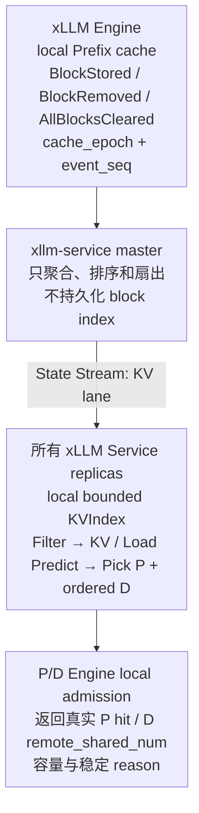
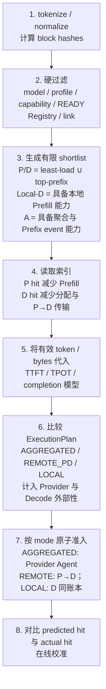

# xLLM Service 集群级 KV-aware Router 设计

## 1. 结论与范围

集群级 KV-aware Router 是 xLLM Service 的选择算法增量，不是新的部署服务。它复用 `Scheduler`、`InstanceMgr`、`GlobalKVCacheMgr`、State Stream 和统一接口：

```text
SelectCandidates(SchedulingContext, ClusterSnapshot) -> [Candidate]
```

目标是在满足 SLO 和 Engine 硬容量约束的前提下，优先选择能复用请求 Prefix 的 P/D，减少 Prefill 计算、D 侧 KV 分配和 P→D 传输，同时避免把热点持续压到 cache-rich Engine。

核心边界：

1. KV 索引是可丢失的软路由提示，不承担正确性、资源所有权或准入。
2. Engine 本地 Prefix 查询、allocator 和 reservation 是最终事实；索引错误最多造成一次 miss、拒绝或选点次优。
3. V1 只交付 hash tie-break、真实命中观测和负载模型；V2 才让精确 KV 事件进入主评分。
4. 索引异常时自动回退负载路由，不能拒绝原本可以执行的请求。
5. Mooncake Store 是 V2.5 KV 内存层，不是 Router 正确性依赖，也不替代正常 P→D 直传。
6. KVIndex 只定位 KV，不负责移动 KV。尤其在跨请求场景中，索引命中 D 不代表下一个 P 已经拥有历史 KV；必须由本地/append Prefill、D→P、Store restore 或重算闭环。

## 2. 当前能力与缺口

现有代码已经具备可复用骨架：

- xllm-service 的 `CacheAwareRouting` 会计算 chained block hash，并通过 `GlobalKVCacheMgr` 查询 HBM/DRAM/SSD 位置；
- xLLM P 可复用本地 Prefix，输出中已有 `num_cached_tokens`；
- D 在 `AddNewRequests` 时返回 `remote_shared_num`，P 从该位置继续 PUSH，可跳过 D 已有的共享 Prefix；
- `KvCacheEvent` 已定义 stored/offload/removed 字段。

当前不能生产启用：

- xLLM heartbeat 没有填充 `cache_event`，全局索引没有真实输入；
- KV 索引经 etcd 扇出，高频 block 事件不适合该路径；
- CAR 的整数归一化会让 overlap/load 分数塌缩；
- 评分在请求到达时直接选定单个 P/D，没有结合延迟 D 绑定、SLO 上界和 Engine 原子准入；
- 没有 event sequence、epoch、gap recovery、TTL 和有界内存规则。

因此不保留现有 CAR 行为作为最终方案，只复用代码入口与数据结构。

## 3. 总体结构



State Stream 增加独立 KV lane，但仍是同一个内置模块。负载 FULL/DELTA 与 KV event 使用独立队列和额度，KV 洪峰不能阻塞 EngineState；KV lane 故障只关闭 KV credit。

V2 单 domain 内，每个 Service 复制该 domain 的有界精确索引。V4 跨 domain 时先按 domain 容量和 Prefix 热度摘要选择 domain，只在目标 domain 查询 block 级索引，避免把全集群所有 block 复制到每个副本。

## 4. Hash 与命名空间契约

本节是**全系统唯一的 chained block hash 定义**。Router、Engine 本地 Prefix cache、KV 事件和 [V2.5 共享层](./05_XLLM_PD_STORE_SESSION_DESIGN.md)的 Store 对象必须使用完全相同的前像，否则同一段 Prefix 在不同子系统落入不同键空间，索引会静默永远 miss。任何一方新增哈希输入都必须先改本节。

Router 和 Engine 必须对同一请求得到相同的连续 block hash。请求 tokenize/normalize 一次后按 Engine block size 分块，使用 chained hash：

```text
h[0] = H(namespace, block_tokens[0], block_extra[0])
h[i] = H(namespace, h[i-1], block_tokens[i], block_extra[i])
```

`namespace` 是整请求常量，至少包含：

```text
model_revision
tokenizer_digest + chat_template_digest
block_size + hash_version
cache_semantics_digest（attention/cache group、KV schema、cache dtype/量化，以及会改变 KV 数值语义的 Provider/Runtime 实现）
adapter/LoRA identity
tenant cache_salt / isolation domain
```

`block_extra[i]` 是**逐 block** 的附加输入，覆盖不能由 `block_tokens[i]` 表达、又会改变该 block KV 内容的因素。当前只有多模态：

```text
block_extra[i] = mm_digest[i]
mm_digest[i] = 与 block i 重叠的多模态项的内容摘要 + 块内 token 区间（有序）
               无多模态项时为空
```

多模态摘要必须逐 block 参与哈希，**不能提升到 `namespace`**。放进 `namespace` 会使任意两个多模态内容不同的请求落入完全不同的命名空间，连它们共享的纯文本 system prompt 前缀也无法互认，而这类共享前缀正是 Prefix 复用的主要收益来源。逐 block 形式下，公共前缀天然共享，在第一个多模态分叉点之后自然分开，这也是链式哈希本身的性质。

`cache_semantics_digest` 只描述会改变 KV 内容或可复用语义的因素。Provider ID 本身不强制进入 namespace；只有 Runtime/插件/attention 实现差异会改变 KV 数值语义时才进入 digest，避免无谓切断已经验证可复用的 Prefix。它不包含 TP/DP/CP/EP 数量、rank、设备地址等物理放置，也不包含 11 的执行侧 `kv_layout_digest` 或 05 的 `storage_kv_layout_digest`；前者由 P/D 兼容矩阵检查，后者只绑定 Store 对象键。不能用 hash 相同替代布局兼容。不同 namespace 的 block 永不互认。

`positions` 不进入前像：V1 hash contract 只对从零开始、由链深度唯一推导的标准连续 position 开放全局 KV credit，链式结构已经使 `h[i]` 唯一确定 block 序号。显式 position IDs、非连续 position、多轴 position 或其他不能从 parent chain 唯一推导的模式必须关闭受影响 Prefix 的全局 credit；未来若要支持，需在全系统一起加入规范化的 `position_digest[i]` 并 bump `hash_version`，不能由单侧临时扩展。

缺少可验证输入时按作用域关闭 KV credit，请求仍正常执行：动态 adapter 身份或租户 salt 不可验证时关闭整请求的 credit；某个多模态项无可验证摘要时，**只从第一个受影响 block 起**关闭，其之前的 block 不受影响——链式哈希保证前缀部分的取值与后续内容无关。

事件只携带固定长度 hash 和元数据，不携带 prompt token 或原文。多租户默认使用隔离 salt；跨租户复用必须由显式策略授权。

## 5. 事件与索引协议

### 5.1 事件

```text
KVEvent = {
  provider_id, engine_incarnation,
  model_revision, profile_digest,
  cache_epoch, event_seq,
  STORED | REMOVED | CLEARED,
  block_hash, parent_hash,
  cache_group, tier, event_reason,
  event_age_ms_at_publish
}
```

- `STORED` 只能在 block 已可安全查询后发布；
- `REMOVED` 在 block 不再可复用时发布；
- `CLEARED` 递增 `cache_epoch` 并清除该 incarnation 的全部位置；
- `event_seq` 在一个 `engine_incarnation + cache_epoch` 内单调递增；
- Engine 重启必须使用新 incarnation，旧位置立即失效。

Engine 到 master、master 到 Service 都允许批量和压缩；同一 Engine 的事件必须保持顺序，不同 Engine 之间无需全局顺序。

Engine 使用异步 `PushKVEvents(KVEventBatch)` 向 Registry 当前 master 上报，单 Engine 最多一个在途 batch，后续事件进入有界 ring。ring 溢出时发送 gap 标记并触发 snapshot，不能把 KV 事件塞进 heartbeat 阻塞健康状态。`event_age_ms_at_publish` 与 EngineState 使用相同语义：接收方以本地 monotonic elapsed 累加，不比较跨节点绝对时间。

### 5.2 本地索引

```text
block_hash -> [Location]

Location = {
  provider_id, profile_digest, engine_incarnation,
  cache_epoch, cache_group, tier,
  last_event_seq, last_confirmed_age, confidence
}
```

查询只计算从第一个完整 block 开始的最长连续 Prefix。单个后续 block 命中但父 hash 不连续时不计入收益。

索引按 `max_kv_index_bytes` 和 `max_locations_per_block` 有界。达到上限时先删除已失效 incarnation 和过 TTL 位置；仍超限则关闭该 ModelPool 的 `kv_routing_enabled`、清空其索引并回退 load-only，直到完整 snapshot 能在低水位以下重建。不能用被截断的索引继续宣称精确，也不能把索引结果用于硬过滤。

上线前按目标 domain 的 Engine cache 上界计算每个 Service 的容量：

```text
index_bytes_ub =
  unique_block_hashes * hash_entry_bytes
  + block_locations * location_entry_bytes

kv_event_qps_ub = stored_blocks_per_s + removed_blocks_per_s
```

`max_kv_index_bytes` 必须覆盖估算值和安全余量；覆盖不了的 domain 保持 load-only，不能依赖运行时频繁淘汰索引维持“精确”名义。

### 5.3 丢失与恢复

Service 发现 event sequence 缺口、epoch 跳变或位置超过 `kv_event_ttl` 时：

1. 立即把该 Engine 的 KV index 标记为 UNKNOWN；
2. 普通负载路由继续，KV credit 置零；
3. 按抖动和 `snapshot_recovery_max_concurrency` 从 Engine 分页获取 `GetKVCacheSnapshot(cache_epoch, cursor)`；首个 page 固定 `snapshot_id/cache_epoch/base_event_seq`，后续 page 必须属于同一逻辑快照；
4. Service 在有界 ring 中暂存 `event_seq > base_event_seq` 的增量，完整应用 snapshot 后按序回放；epoch 变化、snapshot 失效或 ring 溢出时丢弃本轮并重新开始；
5. snapshot 与增量连续后才恢复该 Engine 的 KV credit；
6. 恢复超时只告警并保持 load-only，不影响 Service readiness。

master 切换后，新 master 不需要恢复旧 master 的内存。它从各 Engine 当前 epoch/sequence 重建 KV lane；所有 Service 在完成每个 Engine 的 gap recovery 前对其使用零 KV credit。

## 6. KV-aware 候选与执行模式选择



shortlist 的并集很重要：只看 Prefix 会制造热点，只看最低负载会丢失复用。`Kp/Kd`、聚合 Provider 和本地 D 候选数都有固定上限，避免对大池执行无界穷举。Provider-neutral mode 与 Adapter 见 [多引擎 Provider 设计](./11_XLLM_SERVICE_MULTI_ENGINE_PROVIDER_DESIGN.md)；xLLM 本地/远程模式、原子准入和重试协议见 [V2 有界流控与执行模式](./09_XLLM_SERVICE_V2_FLOW_CONTROL_AND_EXECUTION_MODES_DESIGN.md)。

## 7. 统一成本模型

对候选 P/D，先计算可复用 Prefix 的收益下界：

```text
required_prefix_blocks = ceil(prefix_tokens / block_size)
retainable_prefix_blocks_lb = p_kv_blocks_total - active - held - reserve
survival_credit = min(1, max(0, retainable_prefix_blocks_lb) / required_prefix_blocks)
  * Pr(prefix_residence_time >= predicted_reuse_gap)

p_reusable_tokens_lb = P 连续命中 tokens
  × survival_credit × tier_credit × confidence
d_reusable_tokens_lb = D 连续命中 tokens × tier_credit × confidence

effective_prefill_tokens =
  prompt_tokens - p_reusable_tokens_lb

effective_transfer_bytes =
  KVBytes(prompt_tokens - d_reusable_tokens_lb)

incremental_d_kv_bytes =
  KVBytes(prompt_tokens - d_reusable_tokens_lb)
  + decode_credit_bytes
```

`tier_credit` 不能把不同介质视为等价：HBM 接近 1；DRAM/SSD/Store 必须减去加载、网络和排队成本。V2 首个生产 bucket 只启用 HBM credit；低层 cache 先在 V2 shadow 观测，实际加载和路由 credit 在 V2.5 独立门禁后开放。

`survival_credit` 是 P Prefix 收益的可行性上界，不是另一个人工权重。它由 P 实际 block 账本、eviction 事件、Prefix 大小和复用间隔校准；一个 Prefix 已接近占满 P 可保留池时，即使 hash 完全相同也不能假设下次仍命中。GLM-5.2 线上样本中 P 每 rank 仅 448–542 block、64K Prefix 约需 512 block，说明扩大 P KV 或 V2.5 Store 可能比 Router 调权更先产生收益；该数字只作当前 profile 证据，不是跨模型常量，见 [10 §6.3](./10_XLLM_SERVICE_GLM52_ONLINE_BOTTLENECK_ANALYSIS.md)。

将以上输入代入 01/02 已定义的模型：

```text
ttft_ub(P,D) =
  p_queue_ub
  + PredictPrefill(P, effective_prefill_tokens)
  + d_admission_ub(D, incremental_d_kv_bytes)
  + PredictTransfer(P,D, effective_transfer_bytes)
  + first_generation_ack_ub
  + first_token_return_ub

completion_ub =
  ttft_ub + output_tokens_quantile * tpot_ub(D)
```

上式定义 `REMOTE_PD` 的路径成本。`LOCAL_PREFILL_DECODE` 复用本节的 `effective_prefill_tokens`，但必须另外加上它对共驻 Decode 请求的 TPOT/SLO 外部性和 Decode 容量机会成本，不得只比较当前请求的 TTFT。`AGGREGATED` 使用目标 Provider 自己的 Prefix observation、queue/admission 与整请求 CapacityProfile，不套用 P→D transfer 公式。完整 xLLM 公式和门禁见 [09 §4](./09_XLLM_SERVICE_V2_FLOW_CONTROL_AND_EXECUTION_MODES_DESIGN.md)。成本预测必须以 D 当前干扰快照为基线，其中包含 V2.5 Store snapshot copy/write-back 的 bytes、带宽和并发；不得把后台 copy 隐藏进 residual 后再假设它与本地 Prefill 线性可加。最终资源权威是 D 本地共享 `DInterferenceBudget`，见 05 §3.2 和 09 §4。

KV 不是独立加权分数，而是 Prefill token、D KV 和 transfer bytes 的抵扣项。这样负载、SLO 和 Prefix 使用同一单位，避免手工拼接无法解释的 `cache_weight - load_weight`。

只有 `kv_saved_latency_lb > kv_routing_margin` 才启用 KV 偏好；否则按 M0/M1 选择。Engine 很忙时，排队上界自然抵消 Prefix 收益，不需要“命中最多者必胜”的特殊规则。

## 8. P 与 D 的命中语义

P 和 D 的 Prefix 命中作用不同，必须分别建模：

| 位置 | 收益 | 最终事实 |
| --- | --- | --- |
| P Prefix | 少做 Prefill forward | P scheduler admission 时真实 `num_cached_tokens` |
| D Prefix | 少分配目标 prompt KV、少传 P→D blocks | D `AddNewRequests` 返回的真实 `remote_shared_num` |
| Mooncake/低层 Store | 可能减少 Prefill，但增加 lookup/load | Connector 实际 lookup/load 结果 |

Service 的预测不得直接写入传输 cursor。P 只使用 D RPC 返回的 `remote_shared_num`，D allocator 只使用本地真实 Prefix。预测 hit 在排队期间被淘汰时，请求仍可按零命中执行；容量不足则返回稳定 reason，由现有 D candidate/reassign 逻辑处理。

执行结果必须区分“没有命中”和“指标不可用”，不能把缺失统一写成 0：

```text
prefix_metric_state = DISABLED | MISSING | VALID_ZERO | VALID_NONZERO
prefix_observation = {
  lookup_tokens, hit_tokens, source, tier,
  actual_prefill_tokens, skipped_transfer_bytes, eviction_reason
}
```

V1 用固定共享前缀/无共享前缀 A/B 验证该观测闭环；`MISSING`、P/D 语义不一致或实际 Prefill/传输无法对账时，V2-K1 不得启用 KV 主评分。

共享 system prompt、RAG、batch、多轮和 agentic 请求都不要求 session sticky；完整输入会产生相同 Prefix hash。但在 P/D 分离下，上一轮新增历史通常位于 D，而下一轮 Prefill 默认在 P，KVIndex 只能发现位置，不能凭空完成 D→P 移动。V2 若命中兼容 P 或 D 已有共享 Prefix 可直接获益；否则在 V2.5 交付前退化为重算。V2.5 按 [集群 KV 内存层](./05_XLLM_PD_STORE_SESSION_DESIGN.md)依次选择 D 本地 append、D→P 直传、Store restore 或完整 Prefill。默认 full-history 模式的 cache miss 不返回 session 冲突。

## 9. 多 Service 并发与热点保护

多个 Service 看到相同 KV 快照并同时选择一个 Engine 是允许的，索引不做分布式锁。热点由四层限制：

1. shortlist 同时保留 least-load 候选；
2. 每个 Service 对刚下发、尚未进入下一份 StateBatch 的请求记本地 pending work；
3. 选点在近似同分候选中使用 request hash 随机化；
4. Engine 本地原子 admission 是最终容量闸门，冲突触发负缓存和有界重选。

同一 Prefix 的流量超过单 Engine 容量时，负载项和 Engine admission 必须让请求扩散。

## 10. 故障与降级

| 故障 | 行为 |
| --- | --- |
| KV event 丢失/乱序 | 该 Engine index 置 UNKNOWN，load-only，后台 snapshot 恢复 |
| KV lane 队列满 | 丢弃受影响 Engine 的 index 并请求 snapshot；EngineState lane 不受影响 |
| master 切换 | 负载路由继续；新 master 从 Engine 重建 KV lane |
| Service 重启 | FULL EngineState 就绪即可接流；KV index 未恢复前 load-only |
| Engine 重启/清缓存 | 新 incarnation 或 CLEARED epoch 立即使旧位置失效；成员 fencing 不替代已启动 transfer 的终态/quarantine |
| 索引误报 hit | Engine 返回真实 miss；按零命中执行或稳定拒绝 |
| 索引漏报 hit | 只损失性能，Engine 仍可本地命中 |
| Mooncake Store 不可用 | 低层 credit 置零，普通 HBM/直传路径继续 |

KV index 健康不进入 Service 基础 readiness；它只决定 `kv_routing_enabled`。因此 KV-aware 上线不能引入新的集群可用性依赖。

## 11. 分阶段交付

| 阶段 | KV-aware 增量 | 可上线结果 |
| --- | --- | --- |
| V1 | 固定 hash contract；一致性 hash 仅作 tie-break；打通 Prefix metric state 与执行结果对账 | 动态 P/D 池不依赖全局 KV 索引 |
| V2-K0 | Engine 事件、P block/eviction/residence、KV lane、epoch/sequence、shadow index、snapshot recovery | 只观测，不影响路由 |
| V2-K1 | HBM P/D Prefix + load 联合评分，按 bucket 灰度 | 首个精确 KV-aware 生产版本 |
| V2-K2 | 多模型、优先级、公平性与可观测的低层 shadow credit | 为分层 KV 成本模型准备数据 |
| V2.5-S0/S1 | D 生成 KV 写穿 Store，Store event/对象 contract/GC | 建立跨请求共享层，不影响路由正确性 |
| V2.5-S2/S3 | Store→P、D→P、tier credit、复制/预取/重算决策 | 提高 agentic/共享 Prefix goodput |
| V3 | 把 Prefix 热度、冷启动损失输入 Placement Controller | 扩缩容与 cache locality 联合优化 |
| V4 | domain 热度摘要 + domain 内精确索引 | 跨超节点整请求选择 |
| V5 | link/topology/异构 profile 与跨域 Store 副本成本 | 有限跨域 P/D 和全局多层 KV 联合决策 |

K0、K1、K2 是 V2 内部开发门。共享 Store 数据路径属于 V2.5 主路线，不能因 Router 已经具备 `tier_credit` 就宣称低层 KV 复用已经交付。

## 12. 上线门禁

V2-K1 只有同时满足以下条件才可成为目标 bucket 默认：

- hash contract 对相同请求跨 Service/Engine 100% 一致，salt 隔离测试无跨租户命中；
- 事件重复、乱序、丢失、CLEARED、Engine/master/Service 重启后无旧 incarnation 命中；
- KV lane 达到 2 倍峰值事件率时内存、队列和 CPU 有界，EngineState p99 不回退；
- shadow 阶段 `predicted_hit_tokens` 对 `actual_hit_tokens` 的高估率和误差分位数低于固定门禁；
- 固定共享前缀 A/B 中 `prefix_metric_state`、实际 Prefill tokens 和 skipped transfer bytes 闭环；`MISSING` 不得折算成零命中；
- 对目标 Prefix 长度/复用间隔报告 P `retainable_prefix_blocks_lb`、eviction/residence 和 `survival_credit`；当前 P 配额下收益上界不足时不得靠扩大 cache weight 上线；
- 相对同版本 load-only，目标 Prefix workload 的 p99 TTFT、有效 Prefill tokens 和 SLO goodput 置信下界改善；
- 无 Prefix workload 的 TTFT/TPOT/goodput 不出现不可接受回退；
- cache-rich 热点下单 Engine 冲突率、队列和 TPOT 不越界；
- KV index 完全失效时自动回退，成功率与 load-only 一致；
- Router 决策 p99 CPU 时间和 index 内存低于固定预算。

必须按 workload bucket 报告：Prefix 长度分布、P/D predicted/actual hit、有效 Prefill tokens、transfer bytes、KV lookup/load 时间、准入冲突、TTFT/TPOT 和 SLO goodput。agentic bucket 还必须报告轮次数、轮次间隔、每轮新增 token 比例、跨轮 D→P/Store/recompute 路径占比。只报告 cache hit rate 不足以证明收益。

## 13. 代码改造映射

### 13.1 xLLM Engine

1. 在 block manager 的 store/remove/clear 真源生成带 reason 的 `KVEvent`，不能从请求完成日志反推。
2. 异步 `PushKVEvents` 上报有序事件；增加 `cache_epoch/event_seq`、gap 标记和分页 `GetKVCacheSnapshot`，不得阻塞 heartbeat。
3. 保持 P 的真实 `num_cached_tokens`、D 的 `remote_shared_num` 为执行权威，并输出 metric state、实际 Prefill tokens、跳过传输 bytes 和 eviction reason。
4. snapshot/event 生成不得阻塞 scheduler step；队列溢出时发 gap/epoch 信号，不静默丢失后继续宣称精确。

### 13.2 xllm-service

1. `GlobalKVCacheMgr` 从 etcd watch 改为消费 State Stream KV lane，索引按 incarnation/epoch/TTL 有界。
2. `CacheAwareRouting` 迁移到统一 `SelectCandidates`，删除整数归一化与单一手工 score。
3. `Scheduler` 计算 hash 一次，构造 least-load/top-prefix shortlist 并调用 Engine/Service Prediction。
4. State Stream 为 KV lane 设置独立队列、带宽、FULL/snapshot 恢复和指标。
5. V1 的 M0/M1 永久保留为 timeout、UNKNOWN、OOD 和人工回退路径。

## 14. 业界对齐

- [llm-d Prefix-Cache Aware Routing](https://llm-d.ai/docs/dev/architecture/advanced/kv-management/prefix-cache-aware-routing)：对齐“事件驱动精确索引 + 负载 scorer”，但索引内置于现有 xLLM Service。
- [NVIDIA Dynamo Routing Concepts](https://docs.nvidia.com/dynamo/latest/components/router/routing-concepts)：对齐“KV overlap 抵扣 Prefill 工作，同时计入 active Prefill/Decode load”，不照搬独立 Router 部署。
- [vLLM Prefix Caching](../../../docs/design/prefix_caching.md)：对齐 chained block hash、完整连续 Prefix 和 Engine 本地 cache 事实。

业界方案用于确认边界；权重、TTL、候选数和收益门禁以 xLLM 的 P/D 拓扑及生产 trace 实测为准。
