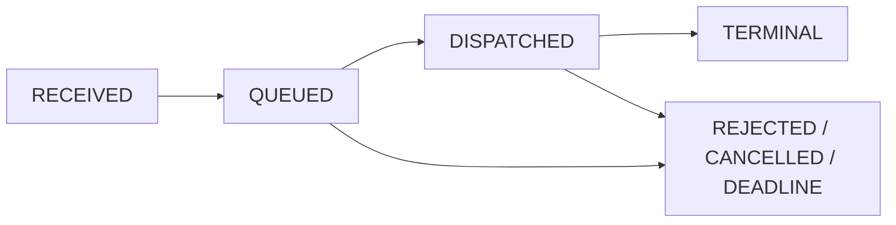
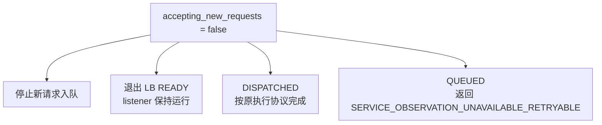

# xLLM Service V2：有界流控与执行模式设计

## 1. 文档定位

- 状态：首个交付版本 V2 的专项设计；与 V2-B0 基础协议一并完成
- 日期：2026-08-05
- 依赖：[V2 开发规范](./00_XLLM_SERVICE_V2_DEVELOPMENT_STANDARD.md)、[总体架构](./01_XLLM_SERVICE_ARCHITECTURE_DESIGN.md)、[V2 基础协议规格](./02_XLLM_SERVICE_V1_IMPLEMENTATION_SPEC.md)、[KV-aware Router](./08_XLLM_SERVICE_CLUSTER_KV_AWARE_ROUTER_DESIGN.md)、[多引擎 Provider 设计](./11_XLLM_SERVICE_MULTI_ENGINE_PROVIDER_DESIGN.md)
- 目标：定义策略感知有界队列，以及 xLLM Native 逐请求选择远程 P/D、本地 Prefill+Decode 或 Prefill-only 的协议、资源账本、成本模型和故障边界

首个产品版本直接交付 V2，不设置独立 V1 版本。02 的基础协议与本文新增的队列和本地 Prefill 必须一起完成；基础协议通过但本文范围未完成时只能标记 V2 开发中。队列和本地 Prefill 都是请求快环能力：它们不持久化请求、不提供跨 Service 接管、不改变 Engine 注册角色，也不取代 Engine 本地硬准入。Provider-neutral `ExecutionPlan` 还包含 V2 基础层的 `AGGREGATED`；该模式由 11 定义，本文以下“三种模式”专指 xLLM Native 子集。

## 2. 统一执行模式

xLLM Native 请求规范化后只生成下面三种互斥计划之一：

```text
ExecutionMode =
  REMOTE_PD
  | LOCAL_PREFILL_DECODE
  | PREFILL_ONLY

ExecutionPlan = {
  request_uid, attempt_seq, mode,
  model_revision, required_capabilities,
  deadline, prediction, reason_codes,
  remote_pd?, local_decode?, prefill_only?
}

remote_pd = {
  selected_p,
  ordered_d_candidates[0:max_d_candidates_per_plan]
}

local_decode = {
  ordered_local_d_candidates[0:max_local_d_candidates_per_plan]
}

prefill_only = {
  selected_p
}
```

| 模式 | 数据路径 | 资源权威 | `GenerationCommit` 屏障 |
| --- | --- | --- | --- |
| `REMOTE_PD` | Service→P，P→D KV transfer，P/D→Service output | P/D 各自 allocator | D `FirstGeneration` ACK 后 P 才能发 seq=0 |
| `LOCAL_PREFILL_DECODE` | Service→D，D 本地 chunked Prefill 后继续 Decode | 同一个 D allocator/scheduler | D 原子授予完整 mixed 资源并安装幂等 submission 后才能发 seq=0 |
| `PREFILL_ONLY` | Service→P→Service | P allocator | P 原子准入已确认无后续 D 的完整执行后才能发 seq=0 |

三种 xLLM 模式共用 `request_uid + attempt_seq + incarnation_id`、`IsSchedulable`、能力过滤、取消、deadline、tombstone、输出序号和错误码框架。禁止为本地 Prefill 建第二套 KV、credit 或 slot 账本。

`GenerationCommit` 是“可以交付 seq=0”的模式化屏障，不等于 Service 已向客户端写出首 token。它必须是 Engine 本地原子、幂等的状态；屏障结果通过可不明的 RPC 时，`REMOTE_PD/LOCAL_PREFILL_DECODE` 必须可由 `QueryRequest` 证明。`PREFILL_ONLY` 由同一 P 在本地原子准入后生成 seq=0，不强造 D Query，但同 key P submission 仍必须幂等。任何模式都不得用“资源大概足够”或 Service 软预测替代屏障。02 §3.2 不变量 6 是跨阶段权威；本文定义 V2 模式的具体屏障。

### 2.1 跨模式执行资源持有

本节是不随版本变化的 Provider-neutral 约束。Service 用同一个 `unresolved_execution_hold` 跟踪可能已被 Provider 接受、但 RPC outcome 仍不明的资源：

```text
ExecutionResourceHold = {
  kind: REMOTE_D_RESERVATION
      | LOCAL_DECODE_SUBMISSION
      | AGGREGATED_EXECUTION,
  request_uid, attempt_seq,
  coordinator_incarnation?,
  potential_holders: [engine_incarnation],
  confirmed_holder?, likely_holder?,
  proof: OUTCOME_UNKNOWN | PROVEN_PRECOMMIT
       | GENERATION_COMMITTED | TERMINAL
}
```

`max_unresolved_execution_holds_per_request=1` 是不可配置的协议常量，并且跨 `AGGREGATED ↔ REMOTE_PD ↔ LOCAL_PREFILL_DECODE` 切换生效。普通 P submission 不占用完整生成或 Decode KV/credit/slot，不计入该常量；约束对象是“可能持续占用执行容量的结果不明 attempt”，不是任意 Engine RPC。

`PROVEN_PRECOMMIT` 表示远程 reservation 已明确创建，但尚未通过 FirstGeneration。它不是 outcome 不明，但若要改投其他 D，仍须先 cancel 并证明 terminal；只有已 `GENERATION_COMMITTED` 的执行才可按 02 §3.2 不变量 8 使用“先 cancel、后有界重叠”例外。

hold 的安装与状态转换必须在同一 `RequestContext` 上串行化/CAS：发送可能创建 D 资源的远程 P plan、本地 D submission 或聚合 Submit **之前**，先从空值转为 `OUTCOME_UNKNOWN`；CAS 失败不发 RPC。远程路径在安装时把 plan 的全部有界 D incarnation 写入 `potential_holders`，P 成功 reservation 的 attempt status 才能写 `confirmed_holder` 并收窄；本地 D 与聚合路径都是被提交执行单元的单元素集。P 在尝试候选前发送的异步 `ReserveIntent` 只能更新 `likely_holder`、优化清理顺序；提示可能丢失/乱序，绝不能删除 `potential_holders`。

P 在回填前失联时，对候选集执行不超过 `max_d_candidates_per_plan` 的有界收敛。每个候选只有 terminal outcome、Cancel ACK 已安装 `CANCELLED_BEFORE_CREATE` fence、self-fencing/进程终止，或 02 §5.3 的全部本地硬 duration 上界证明之一才能收敛；Query 未知 key 的 `ABSENT` 只是一瞬间观测，不能清除 hold。只有匹配 `request_uid + attempt_seq` 且 incarnation 属于该安全候选集的证明可以推进状态，避免旧响应清除新 attempt。

请求可能早于资源证明结束。此时 hold 转入有界 `ExecutionHoldCleanup` 记录继续收敛，不保存 prompt/output/parser 或重试状态；cleanup 表满时在新 dispatch 前背压，不能丢弃旧记录，并返回稳定 `SERVICE_CLEANUP_CAPACITY_RETRYABLE`。为消除“dispatch 后才发现表满”的竞态，Service 必须在安装 hold 前预留 cleanup capacity token；请求结束时转移同一 token，hold 收敛后释放，公式与故障 burst 口径见 02 §5.1。Service 崩溃可以丢失该易失表/token，Provider 本地 fence/TTL 继续回收，因此这仍不是请求恢复或跨副本 ownership。

## 3. `LOCAL_PREFILL_DECODE` 协议

### 3.1 能力与候选过滤

DECODE 注册角色表示该 Engine 的主要容量职责，不禁止其在显式能力下执行本地 Prefill。候选必须同时满足：

```text
role == DECODE
lifecycle == READY
supports_local_chunked_prefill == true
supports_mixed_prefill_decode_accounting == true
model/profile/incarnation compatible
state/heartbeat fresh or allowed direct evidence
local_prefill_bucket allowlisted
```

不满足任一条件时只生成 `REMOTE_PD`。启用本地 Prefill 不修改 Registry role，不调用 MIX 翻转，也不允许普通 Service 各自改变 Engine 身份。

### 3.2 提交与本地原子准入

Service 通过统一请求提交 RPC 向选中的 D 发送 `ExecutionPlan(mode=LOCAL_PREFILL_DECODE)`；wire 层可以复用现有请求入口并增加 mode，不另建绕过 allocator 的直达接口。D 在同一本地锁域检查并扣减：

```text
prompt KV growth upper bound
decode KV/credit
recurrent slot
prefill/decode token budget
shared D interference budget（local Prefill + Store copy/write-back）
tombstone slot
local submission deadline
```

任一检查失败整体回滚并返回稳定 reason：

```text
LOCAL_PREFILL_UNSUPPORTED
LOCAL_PREFILL_INTERFERENCE_LIMIT
NO_LOCAL_KV
NO_DECODE_CREDIT
CAPACITY_CHANGED
STALE_INCARNATION
ENGINE_DRAINING
```

相同不可变参数的 `(request_uid, attempt_seq)` 重试返回已有 submission/outcome，不重复扣资源；参数不一致返回 `ATTEMPT_CONFLICT`。Service 只传剩余 duration，D 转成本地 monotonic deadline，并在本地 Prefill/Decode 调度边界按 02 §3.2 进入 `DEADLINE_EXCEEDED`；submission 另受本地 queue TTL 约束，不创建远程 D reservation、`BeginTransfer` 或 `FirstGeneration` handoff 状态。

D 必须在同一个本地临界区内完成资源扣减、幂等键/tombstone slot 安装和 `LOCAL_ADMITTING -> LOCAL_GENERATION_COMMITTED` 状态转换，然后才允许 scheduler 执行或输出 seq=0。提交 RPC ACK 丢失时，`QueryRequest` 必须返回 `ABSENT | LOCAL_GENERATION_COMMITTED | RUNNING | DONE | TERMINAL_FAILURE`，使 Service 能够证明原子提交结果。

### 3.3 输出、取消和重试

D 从 `output_event_seq=0` 开始直达原 Service，但本地状态必须已达 `LOCAL_GENERATION_COMMITTED`。Service 把 seq=0 成功写入响应流边界后设置 `first_token_emitted=true`；此前 admission、Engine 失效或执行错误可在 retry/device/deadline 预算内增加 `attempt_seq` 并重新选择本地 D 或远程 P/D。

Service 在发送本地 submission 前先安装 `OUTCOME_UNKNOWN` hold。RPC timeout 后只能对同 key Query/cancel；Query 返回 `ABSENT` 时仍须用 Cancel 安装 `CANCELLED_BEFORE_CREATE` fence。得到 terminal/fence ACK、self-fencing、进程终止或 02 §5.3 的硬时间证明前，不得增加 `attempt_seq`、改投另一个 D 或切换到 `REMOTE_PD`。同理，从远程路径切换到本地路径前，也必须通过同一闸门。

Query 证明 `LOCAL_GENERATION_COMMITTED/RUNNING` 时，Service 应继续同一 attempt；若因剩余 deadline/SLO 必须放弃，先发 cancel，只在 retry/device-time 预算允许时才可以进入新 attempt。这是“已证明执行的有界重叠”，与 outcome 不明的多 D 持有不同；前者计入 `retry_wasted_device_ms`，后者被协议常量禁止。旧 attempt 输出由 Service 丢弃；Engine 本地 TTL/tombstone 回收孤儿 submission。首 token 后 D 故障仍中断流，不因为执行在一个 Engine 内就宣称可迁移 Decode。

## 4. 本地与远程 Prefill 成本模型

02 §4.4 的基础 Decode guard 对 `REMOTE_PD` 和 `LOCAL_PREFILL_DECODE` 都生效：普通 Decode admission 已先保护正在运行的 Decode SLO。本节只定义本地 Prefill 与 Store copy 带来的额外干扰预算，不能把基础 guard 留到 V2 才实现。

先使用 V2 KVIndex 和 Engine 实际查询得到：

```text
effective_prefill_tokens =
  prompt_tokens - reusable_prefix_tokens_lb
```

远程路径继续使用 08 §7 的 `remote_pd_ttft_ub`。本地路径必须基于同一份 D 干扰快照计算，不能把 Store 后台写穿隐藏在基线里：

```text
DInterferenceSnapshot = {
  active_decode_sequences,
  decode_kv_bytes,
  base_decode_reserved_tpot,
  running_decode_tokens,
  local_prefill_tokens_inflight,
  store_copy_bytes_inflight,
  store_copy_bw_recent,
  store_rdma_read_bw_recent,
  memory_bw_headroom,
  store_reserved_tpot,
  local_prefill_reserved_tpot,
  observed_tpot_residual
}
```

本地 Prefill 候选的成本为：

```text
local_ttft_ub(D) =
  d_queue_ub
  + PredictMixedPrefill(D, effective_prefill_tokens)
  + first_token_return_ub

co_resident_tpot_penalty_ub(D) =
  PredictTpot(D, snapshot + candidate_local_prefill)
  - PredictTpot(D, snapshot)

co_resident_slo_cost_ub(D) =
  sum_over_running_decode(
    remaining_tokens_ub
    * max(0, co_resident_tpot_penalty_ub - request_tpot_headroom)
    * priority_weight
  )

local_total_cost_ub =
  local_ttft_ub
  + co_resident_slo_cost_ub
  + decode_capacity_opportunity_cost_ub
```

`snapshot` 包含当前 Store copy/write-back 负载，因此上式保留“本地 Prefill × Store copy”的非线性交互，不假设两者代价可简单相加。Store connector 创建新 copy 任务时反向使用同一快照和 budget，见 05 §3.2；Service 预测只是软选择，D 本地原子干扰准入才是资源权威。

D 侧只允许一个由共驻 Decode SLO 派生的绝对 TPOT guard。没有正在运行的 Decode 时使用该 profile/bucket 上线前固定的默认 guard；任何 headroom 都不得为负：

```text
d_decode_tpot_guard(snapshot) =
  min({profile_default_tpot_guard}
      union {tpot_limit(request) for each running_decode})

current_tpot_ub = PredictTpot(snapshot)
tpot_headroom_now = max(0, d_decode_tpot_guard(snapshot) - current_tpot_ub)

candidate_tpot_delta_ub = max(
  0,
  PredictTpot(snapshot + candidate) - current_tpot_ub)

optional_interference_budget_ub =
    store_reserved_tpot
  + local_prefill_reserved_tpot
  + tpot_headroom_now
```

`COPY_ON_PUT`、`PIN_ON_PUT` 与 local Prefill 在同一个本地临界区按当前快照重新预测；最终硬门禁始终是 `PredictTpot(snapshot + candidate) <= d_decode_tpot_guard(snapshot)`。分类 share 只做优先级/配额，不替代该绝对检查：Store share 不大于 local-Prefill share，candidate 的边际量计入到达类别，非线性交互因此由后到候选承担并在四组到达顺序测试中验证。Decode 集合变化使 guard 收紧时不强杀已准入工作，但在绝对预测重新低于 guard 前停止所有新 optional admission；已准入 Decode 的 SLO 优先级始终最高。

只有同时满足以下条件才选择本地 Prefill：

```text
remote_pd_cost_lb - local_total_cost_ub > local_prefill_margin
PredictTpot(snapshot + candidate_local_prefill) <= d_decode_tpot_guard(snapshot)
candidate_tpot_delta_ub <= tpot_headroom_now
local_prefill_reserved_tpot + candidate_tpot_delta_ub
  <= local_prefill_tpot_share * optional_interference_budget_ub
effective_prefill_tokens <= local_prefill_token_cap
```

因此“短 Prefill”或“高 Prefix 命中”可以在 D 搭车，长 Prefill、Decode 已接近 TPOT 上限或 P 池并不拥塞时仍走远程 P。不能只优化当前请求 TTFT 而忽略共驻请求。

实际 mixed Prefill 时长、共驻请求 TPOT 增量、被挤出的 Decode token budget 和模式选择原因必须按 bucket 打点，并用于 Scheduler replay 和在线 residual 校准。

## 5. Service 有界 flow control

### 5.1 状态机与边界



- `QUEUED`：只存在于接入 Service 内存，尚未提交任何 Engine，可重新做选点。
- `DISPATCHED`：已创建 ExecutionPlan 并提交 Engine，按对应执行模式协调。
- Service 崩溃时两类状态都不跨副本恢复；客户端/Gateway 按连接断开或稳定可重试错误执行已验证的首 token 前重试。
- raw prompt/output 默认不进入队列日志；队列内存按规范化请求和 token 上界计量。

每个 Service 和每个 ModelPool 同时设置硬上限：

```text
max_queued_requests
max_dispatched_request_contexts
max_queued_prompt_tokens
max_queued_bytes
max_queue_wait_ms
max_queued_requests_per_tenant
max_queued_tokens_per_tenant
```

任一上限将被突破时，在入队前返回稳定 `QUEUE_CAPACITY_EXHAUSTED`；请求 deadline 早于预计最早 dispatch 时返回 `QUEUE_DEADLINE_UNSATISFIABLE`。**队列满这一个信号单独出现时** 不改变 Service readiness，副本保持 READY 并快速拒绝，避免负载尖峰导致所有副本同步摘流；观测失明仍必须按 §5.3 独立决定 readiness。

“预计最早 dispatch”必须是时间上界，按实际调度顺序而不是全池平均计算：

```text
earliest_dispatch_time_ub =
    scheduler_work_ahead_ub(priority_band, tenant_flow)
      / fresh_dispatch_rate_lb
  + probe_round_ub
```

正常模式使用 state hard TTL 内的状态和实测速率；`STATE_BLIND` 宽限内使用最后良好状态并扩大 guard；之后的 `UNKNOWN` 只使用 probe 成功速率的单侧置信下界。该下界按固定滑窗/置信水平计算并随样本半衰期衰减到 0，不允许配置非零 floor。估计误差只能导致保守快速拒绝，不能把请求放进无法排空的队列。

### 5.2 排序与饱和门控

队列保持 work-conserving，按三层策略出队：

1. priority/SLO band；高 band 先于低 band。
2. band 内 tenant/flow 轮转；V2 基线是副本内公平。
3. flow 内 FCFS、EDF 或显式 SLO deadline。

dispatch 前使用整池 saturation detector 检查兼容 P/D/local-D 的 dispatch backlog、queue age、KV/credit、Decode headroom 和近期 Admission 拒绝。整池饱和时暂停本轮 dispatch，让请求留在仍可重新选点的 Service 队列；有可信容量时立即出队，不人为保留 GPU 空闲。detector 输出必须是 `AVAILABLE | SATURATED | UNKNOWN`，不得把陈旧/缺失状态强制折算成饱和或可用。

严格全局租户配额/公平仍需要 quota authority 或跨副本 aggregate。上游 LB 必须按 tenant/flow 做稳定或足够均匀的分流，并监控副本间 queue/fairness skew；本地队列不能冒充严格全局账本。

### 5.3 观测失明、队列与 readiness

V2 完整复用 02 §8.1 的 `OBSERVATION_STATE_BLIND`/`OBSERVATION_REGISTRY_BLIND` 和 `/readyz`，不建第二套降级状态：

1. **正常观测**：detector 只用 state hard TTL 内的 queue/KV/credit 与近期 admission conflict 判定 `AVAILABLE/SATURATED`。
2. **`OBSERVATION_STATE_BLIND` 宽限内**：只使用最后良好状态且扩大 guard，任何 RPC/探活失败立即剔除对应 Engine。负载数值陈旧时 detector 输出 `UNKNOWN`，不得宣称整池已饱和。
3. **`OBSERVATION_STATE_BLIND` 宽限后**：只保留 `last_direct_success_age <= direct_evidence_ttl` 的兼容 Engine。对这些候选最多以 `blind_dispatch_probe_concurrency` 并发探测式 dispatch，并以 Engine 原子准入为准；一次成功准入只证明该次容量，不刷新陈旧负载值。确定容量拒绝产生有界 candidate backoff，不得将全池永久标记为饱和。
4. **`OBSERVATION_REGISTRY_BLIND`**：只在 `registry_blind_grace` 内使用缓存成员并扩大 guard；此时 detector 输出 `UNKNOWN`，且只允许与第 3 条相同上限的探测式 dispatch。宽限耗尽后禁止新入队和 dispatch，不得因队列尚有空间而继续收流。

`blind_dispatch_probe_concurrency`、`blind_candidate_backoff_ms` 和 probe 的单请求 deadline 都是按 Service/ModelPool 固定的硬上限；probe 一旦提交就计入 `DISPATCHED`、崩溃暴露和租户预算，不得当作免费探测。

`UNKNOWN` 下 `fresh_dispatch_rate_lb=0` 时停止普通入队与普通队列 dispatch。若按当前观测模式仍存在 `IsBlindProbeEligible` 候选，只允许 BEST_EFFORT 请求占用有界 immediate-probe slot：先按既有 band/tenant/flow 顺序选择已排队请求，没有合格排队请求时才允许新到达请求从 `RECEIVED` 直达，不能让新请求越过旧 flow。其中 `STATE_BLIND` 宽限后要求 `last_direct_success_age <= direct_evidence_ttl`，`REGISTRY_BLIND` 宽限内允许符合 §5.3 第 4 条的缓存成员。没有正 dispatch-rate 下界时 STRICT 请求不得使用该恢复槽，稳定返回 `QUEUE_DEADLINE_UNSATISFIABLE`。若当前模式没有任何 eligible 候选，复用 02 §8.1 退出 READY 并稳定退回队列，不能让用户请求 probe 绕过 readiness；恢复只能来自轻量健康探测/成功直接证据。

BEST_EFFORT probe outcome 不明时可以先终止客户端请求，但其 `ExecutionHoldCleanup` 继续推进，hold 未收敛前禁止新 attempt。请求失败不等于资源终态。

当 02 §8.1 的任一条件要求 `accepting_new_requests=false` 时，Service 原子执行：



这些 `QUEUED` 请求尚未提交 Engine，所以不存在输出重复；Gateway/客户端是否重试仍按已发布契约决定。恢复 Registry/FULL、满足候选条件并持续 `readiness_recovery_hold` 后，且副本不处于 DRAINING 时才重新 READY。必须按观测模式记录 detector 三态、probe 准入/拒绝、被退回的排队请求和 readiness 变化，避免把 `UNKNOWN` 隐藏成普通饱和。

若观测失明与计划 drain 同时发生，观测安全边界优先：已 `DISPATCHED` 请求仍继续，但不为满足 `COMPLETE_QUEUED` 而向成员/容量证据不可信的 Engine 提交新工作；未 dispatch 队列请求按本节稳定退回。“计划发布无损”不包含同时发生的控制面失明。

## 6. Service 崩溃预算

有界队列会扩大单 Service 进程崩溃时的失败集合，因此队列容量必须进入错误预算：

```text
service_crash_exposure_ub =
  max_queued_requests
  + max_dispatched_request_contexts

service_crash_exposure_ub <=
  configured_service_crash_request_budget

queued_prompt_bytes_ub + request_context_bytes_ub <=
  configured_service_memory_budget
```

除请求数外，还必须按 tenant、priority、token 和预计 device time 报告崩溃暴露，避免一个长上下文 tenant 占满整个失败预算。02 §12.3 的“单 Service kill -9 失败数不超过该副本在飞数”在 V2 中明确改写为“不超过该副本 `QUEUED + DISPATCHED` 的配置硬上界”；这不是跨副本恢复承诺。

队列收益必须与故障代价共同 A/B：过载可见拒绝下降不足以单独证明上线，需同时报告 kill -9 时的失败请求数、客户端最终重试成功率和租户影响分布。

## 7. Drain 语义

Service 进入 DRAINING 时原子执行：

1. `accepting_new_requests=false`，退出 LB 新请求路由，但 listener 保持运行。
2. 停止新入队；已经 `DISPATCHED` 的请求继续完成。
3. 对 `QUEUED` 请求按固定 `queue_drain_policy` 处理，不能临时混用两种语义。

支持两种显式策略：

| 策略 | 行为 | 对外承诺 |
| --- | --- | --- |
| `COMPLETE_QUEUED` | 继续 dispatch 已排队请求，直到 queue 与 dispatched 都归零 | 默认计划发布；可以声明无损，但 drain 较长 |
| `RETRY_UNDISPATCHED` | 尚未提交 Engine 的请求返回 `SERVICE_DRAINING_RETRYABLE` | 仅当 Gateway/客户端有已验证的首 token 前透明重试契约；不能单独声明无损 |

`COMPLETE_QUEUED` 必须满足：

```text
drain_deadline >=
  max_queue_wait_ms
  + max_dispatched_remaining_deadline_ms
  + drain_guard_ms
```

并把队列上限纳入滚动发布总时长和 surge 容量计算。无法满足时必须降低队列上限、使用 `RETRY_UNDISPATCHED`，或明确接受 deadline 到期失败，不能无限等待。

## 8. 分阶段交付

| 阶段 | 能力 | 默认状态 |
| --- | --- | --- |
| V2-Q0 | saturation/queue shadow 观测，仍直接 dispatch/reject | 不改变请求行为 |
| V2-Q1 | 单 ModelPool 有界 FCFS/EDF 与硬内存/失败预算 | BEST_EFFORT bucket 灰度 |
| V2-Q2 | priority band、tenant flow、公平/配额 aggregate | 按公平误差门禁开放 |
| V2-L0 | 本地 Prefill shadow plan 和 co-resident TPOT 外部性预测 | 不执行本地 Prefill |
| V2-L1 | `LOCAL_PREFILL_DECODE` 执行模式 | 仅 allowlist profile/bucket |

Q/L 两条子线都依赖 V2-B0 的 `IsSchedulable`、RequestContext、Engine 幂等和输出协议，但彼此可以独立 shadow；完整 V2 首发必须同时通过两条子线门禁。M0/REMOTE_PD 永久保留为回退。

## 9. 上线门禁

- 上线前固定 cleanup token/record 数量与字节、negative-fence pool/low watermark、probe-rate 置信水平/滑窗/样本半衰期、immediate-probe concurrency、`store_copy_tpot_share/local_prefill_tpot_share` 和 profile 默认 TPOT guard；禁止配置非零 blind dispatch rate floor。
- 所有 queue request/token/byte/tenant/wait 上限在 2 倍峰值 burst 下保持有界；取消和 deadline 能从任意队列位置及时删除请求。
- 无可用容量时不会把请求提交到单个 Engine 长队列；容量恢复后 work-conserving dispatch，无 GPU 空闲与 Service 非空队列长期并存。
- saturation detector 的输入可由 02 §8.1 的 State Stream 和 Admission 事件闭环验证；缺失 Decode headroom 或拒绝原因时只能输出 `UNKNOWN`，不能猜测安全容量。
- priority/tenant 流量下无饥饿，副本内公平误差、跨副本 skew 和全局 quota 误差低于固定门禁。
- kill -9 的失败数、token/device-time 暴露不超过配置预算；客户端最终重试成功率达标。
- 两种 drain policy 分别故障注入；`COMPLETE_QUEUED` 在 deadline 内清空，`RETRY_UNDISPATCHED` 不产生已输出 token 的重复执行。
- 分别注入 State Stream 陈旧、Registry 不可读、队列半满/全满和直接探测成功/失败；detector 三态、有界 probe、退回 `QUEUED` 请求和 `/readyz` 严格符合 02 §8.1，不出现队列集体 deadline 或失明副本持续收流。
- `UNKNOWN` 下按 priority band/tenant work-ahead 和衰减到 0 的 probe-rate 置信下界计算 dispatch 上界；rate=0 时只有当前 observation mode 的 eligible 候选可承载 BEST_EFFORT immediate probe，且已有队列按原调度顺序优先于新到达请求（STATE_BLIND 需要直接证据，REGISTRY_BLIND 仅限 grace 内缓存成员）；STRICT 稳定拒绝，没有 eligible 候选时退出 READY 并仅靠健康探测恢复。
- 本地 Prefill 与 REMOTE_PD 共用 allocator/指标；10 万次 mode 切换、timeout、cancel 和 Engine 重启后，同一 request_uid 的 `OUTCOME_UNKNOWN` Decode hold 始终不超过 1，且无 KV/credit/slot/tombstone 泄漏。
- 注入 P 在 reservation 成功后、回填 confirmed holder 前失联，覆盖 Cancel 先于迟到 AddNewRequests、Query `ABSENT`、异步 intent 丢失/乱序、negative-fence 池满和 cleanup 活过 RequestContext；并发耗尽 cleanup token 时未取得 token 的请求不 dispatch，已取得 token 的请求终止后总能转成最小记录。安全候选集不被提示收窄，旧 attempt 不在 fence 后重新创建。
- 对三种 xLLM 模式分别注入 seq=0 抢跑和 Engine 重启；远程/本地 Decode 路径另注入提交 ACK 丢失、Query/cancel，`PREFILL_ONLY` 注入同 key P submission/输出重试。任何 seq=0 在各自 `GenerationCommit` 前都不可见，同 key 不重复准入。
- 本地 Prefill bucket 的当前请求 TTFT 收益为正，同时共驻 Decode 的 p99 TPOT、SLO goodput 和 opportunity cost 不越界；模型 OOD/timeout 自动回 REMOTE_PD。
- 按 05 §7 完成 `off/off`、`local-only`、`store-only`、`both-on` 四组联合门禁；本地 Prefill 成本预测输入包含当前 Store copy 带宽/并发，`both-on` 未通过时两项能力不得在同一 bucket 同时开放。四组交换到达顺序并同时验证 share、绝对 `d_decode_tpot_guard`、guard 收紧和无共驻 Decode 的 profile 默认值。
- 不支持本地 Prefill 的 profile、PULL-only 组合、非标准采样/约束能力稳定走原路径。

## 10. 实现映射

### 10.1 xllm-service

1. `RequestContext` 增加 `queue_state/enqueue_time/execution_mode/unresolved_execution_hold`；另设不含请求内容的有界 `ExecutionHoldCleanup` 表与 dispatch 前预留的 capacity token，使 fence 收敛可活过客户端请求；两者仍只在接入副本内存。
2. `SelectCandidates` 返回带 mode 的 `ExecutionPlan`；M0 保留 REMOTE_PD。
3. 增加按 ModelPool 有界的 flow scheduler、三态 saturation detector、blind probe 和 crash-exposure 计量。
4. readiness、listener、queue admission 和 drain policy 分离，但观测模式唯一复用 02 §8.1。
5. 输出路径对三种 xLLM mode 使用相同 attempt/seq 连续性检查和 mode-specific `GenerationCommit` 屏障。

### 10.2 xLLM Engine

1. 请求入口接受 `LOCAL_PREFILL_DECODE` mode 并按 capability fail closed。
2. D scheduler 在同一资源账本原子检查 mixed Prefill+Decode，不创建远程 reservation；与 Store connector 共用 `DInterferenceBudget`。
3. 输出从 seq=0 直达 Service，但只能在 `LOCAL_GENERATION_COMMITTED` 后发送；Query/cancel/tombstone 使用既有 key 并返回可证明提交状态。
4. heartbeat/EngineState 在 02 的基础 Decode guard/headroom 上增加本地 Prefill budget、Store copy bytes/bandwidth、共享干扰预算和实际 TPOT penalty/residual 指标。
5. D 增加独立 negative-fence 池；未知 Cancel 原子安装 `CANCELLED_BEFORE_CREATE`，未知 Query 无副作用，池压进入 `RECOVERY_FENCE_PRESSURE` 并停止新 Decode admission。
