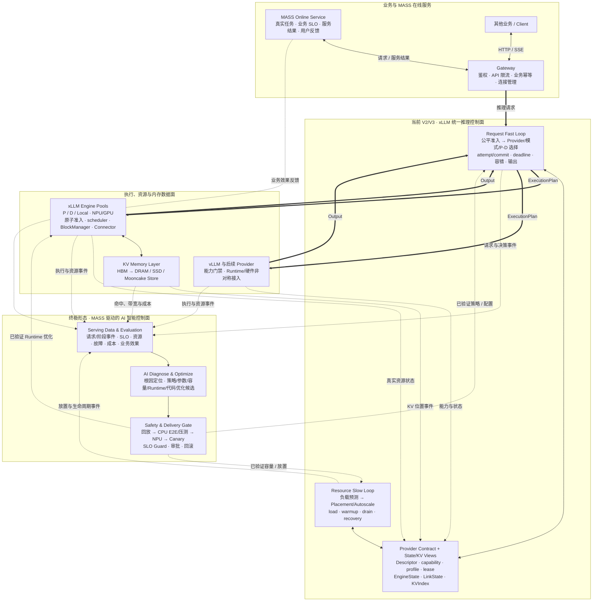

# xLLM 自进化推理系统：现状、总体架构与演进蓝图汇报

更新时间：2026-08-10

汇报口径：V2/V3 代码与 CPU 离线集群门已完成；当前状态为 `CPU_AND_OFFLINE_CLUSTER_VERIFIED / NPU_AND_ONLINE_PENDING`

## 1. 一页结论

历史线上问题不是单个 Decode 算子慢，而是流量跨过容量拐点后，瓶颈会在流控、Prefill、P→D 交接、Decode Admission、KV 和输出之间迁移。仅增加负载均衡规则或提高设备平均利用率，无法稳定解决 503、TTFT/TPOT 长尾、热点倾斜和超时后无效计算。

xLLM 的解法是建设一套统一推理系统：

- **当前已完成：** V2 请求快环与 V3 资源慢环已经进入代码，完成 CPU、Torch CPU、simulated HBM 和离线多进程集群验证；真实 NPU、CANN/HBM/Link 与线上流量验证尚未完成。
- **最终产品形态：** xLLM Service 成为多 Runtime、多硬件、多模型、多 domain 的统一推理控制面；xLLM Engine 与其他 Provider 形成执行和资源数据面；KV Memory Layer 形成跨 HBM、DRAM、SSD 和共享存储的统一内存层。
- **最终优化目标：** 在 TTFT、TPOT、完成时间、容量、公平性、可靠性和成本约束下，最大化真正满足 SLO 的请求量，而不是追求孤立的峰值吞吐或设备利用率。
- **终极目标：** 依托 **MASS 在线服务**持续产生真实服务数据和效果反馈，发现 xLLM Service 与 xLLM Engine 的问题；由 **AI 智能控制面**完成诊断、优化方案生成、验证、灰度、回滚和效果学习，构建持续变强的自进化推理系统。

最终要交付的不是一个“路由器”或一组固定 P/D 服务，而是一个能够感知真实业务、统一控制请求与资源、从线上反馈中持续学习并安全演进的推理基础设施。

## 2. 最终形态与北极星指标

最终系统由五项核心能力组成：

1. **统一请求控制：** 在同一入口完成公平准入、Provider/执行模式选择、P/D 选择、attempt/commit、deadline、容错与输出收敛。
2. **统一资源控制：** Placement/Autoscale 慢环依据负载、模型热度、SLO、KV 热度和成本，调整模型、副本、P/D 角色、并行规格与拓扑放置。
3. **统一执行契约：** Service 只理解 Provider、profile、capability、资源摘要和稳定错误；NPU/GPU、CANN/CUDA、allocator、Connector 和真实 HBM 由 Engine/Provider 负责。
4. **统一 KV 内存层：** HBM、DRAM、SSD、Mooncake/共享 Store 按收益和成本协同，支持 Prefix 复用、恢复与放置，但不把 Service 变成会话或业务状态数据库。
5. **MASS 驱动的自进化闭环：** 真实服务数据驱动 AI 发现问题、提出优化并验证上线，持续改善 Service 调度和 Engine 执行效率。

北极星指标是 **SLO Goodput**：满足 TTFT、TPOT、完成时间和正确性约束的有效请求量。配套约束包括公平性、错误率、资源泄漏、单位请求成本和故障恢复时间；自进化能力还要衡量“发现问题 → 形成方案 → 证明收益 → 安全上线”的周期。

AI 不直接绕过生产安全边界。capability、fencing、原子 admission、资源所有权、deadline 和输出唯一性继续由确定性协议保证；AI 生成的策略、参数或代码必须经过离线回放、CPU 端到端压测、真实 NPU 验证、线上灰度、SLO guard 和可回滚发布后才能生效。

## 3. 总体框架图

下图同时给出当前已落地的 V2/V3 主体与终极 MASS/AI 闭环。实线是请求或控制路径，虚线是状态、观测和学习反馈；AI 闭环是目标架构，不代表当前已经生产交付。



框架边界有四条：Gateway 负责业务信任与连接；xLLM Service 负责请求快环和资源慢环；Engine/Store 持有真实执行、KV 和设备资源；MASS/AI 负责观察、诊断和受控优化，不能成为单次请求正确性的同步依赖。完整静态组件图和原请求流程图见 [总体架构设计](./01_XLLM_SERVICE_ARCHITECTURE_DESIGN.md#4-总体架构组件拓扑与平面边界)。

## 4. 为什么要做：数据事实与业界判断

历史数据用于确定优先级，不是 V2/V3 上线收益证明。完整口径见 [GLM-5.2 线上瓶颈分析](./10_XLLM_SERVICE_GLM52_ONLINE_BOTTLENECK_ANALYSIS.md)。

| 结论 | 关键证据 | 系统要求 |
| --- | --- | --- |
| 容量存在非线性拐点 | 高流量 TTFT p95 8.83–11.22s，低流量 0.832–0.844s；高流量 TPOT p50 约翻倍 | 同时控制队列、Prefill、Decode headroom 和 SLO residual |
| D 与 KV 是关键硬约束 | D KV 可用池 21.10–25.28GB；1,709 个硬 Prompt 容量失败；事件窗 503 占 22.2% | Service 预判，Engine allocator 最终原子准入 |
| 超时后计算浪费严重 | 8,626 个请求超过 300s，最长 4,891s | deadline、cancel、fencing 和资源释放必须下沉到 Engine |
| 旧观测不足以指导优化 | 8.34% 多 token 请求 TPOT=0；Prefix Cache 750,740 个成功请求命中全为 0 | 统一身份、阶段事件、有效性和预测/实际对账 |

llm-d、NVIDIA Dynamo、SGLang Gateway 和 AIBrix 的共同趋势，是把请求决策、执行资源、异步状态/KV 与资源规划拆开，并通过稳定能力契约接入不同 Runtime。xLLM 选择沿用这条主线，同时强化跨 P/D attempt/commit/fencing、Engine 原子准入、逐层 PUSH、结果不明 hold，以及 Native/vLLM 的能力非对称接入。对标细节见 [总体架构设计](./01_XLLM_SERVICE_ARCHITECTURE_DESIGN.md#11-业界推理服务框架与演进方向)。

## 5. 当前已经交付什么

| 能力面 | V2/V3 当前能力 | 证据入口 |
| --- | --- | --- |
| 请求控制快环 | 有界公平准入；Provider/mode/P-D 选择；KV/SLO-aware planning；attempt/commit；deadline；有限重试；单一输出终态 | [V2 当前能力与远端代码索引](./12_XLLM_SERVICE_V2_CURRENT_CAPABILITIES.md) |
| 执行与资源安全 | Native/vLLM Provider 契约；D 原子 admission；结果不明 hold；Query/Cancel；incarnation fencing；真实 BlockManager 适配和 simulated HBM | [Engine 契约实现](http://xingyun.jd.com/codingRoot/xLLM_AI/xllm/tree/service_dev/xllm/core) |
| 资源控制慢环 | leader-fenced desired/command/status；1→3→1 扩缩；load/warmup/drain；response lost、leader kill 和恢复 | [V3 Placement 实现](http://xingyun.jd.com/codingRoot/xLLM_AI/xllm-service/tree/service_dev/xllm_service/placement) |
| Debug 与性能分析 | request/attempt/incarnation 统一身份；阶段事件；bvar；VLOG JSON；cluster snapshot；KV pressure、cleanup、drop 和 residual 观测 | [Observability 实现](http://xingyun.jd.com/codingRoot/xLLM_AI/xllm-service/tree/service_dev/xllm_service/observability) |
| 交付门禁 | 517/517 Service CPU tests、xLLM 当前 1069 个 CPU CTest 全量 PASS；V2/V3 离线多进程 E2E、并发压测与 deadline/断流/过载/进程丢失/扩缩容/Leader failover 故障矩阵 | [离线集群硬门](./implementation/OFFLINE_E2E_GATE_STATUS.md)、[三轮深度审查](./implementation/V2_V3_THREE_ROUND_DEEP_REVIEW_STATUS.md) |

当前结论是：**V2/V3 已证明代码链路、协议不变量和 CPU 离线集群行为，尚未证明真实 NPU 性能、CANN/HBM/Link 行为与线上生产收益。** CPU 不是产品运行目标，simulated HBM 也不替代真实 HBM；它们用于在上 NPU 前尽可能消除控制链和资源生命周期问题。

## 6. 三项关键系统策略

### 6.1 P/D 选择：先保证可执行，再优化 SLO Goodput

```text
公平出队
  → Provider / model / profile / mode / incarnation / link 硬过滤
  → Prefill queue + token cost + Decode headroom + HBM Prefix - transfer cost
  → SLO feasibility / uncertainty / stable tie-break
  → D Engine 原子 admission
  → attempt holder / GenerationCommit
  → 首输出提交后关闭自动重试
```

- KV 命中和低负载只能影响已经公平出队请求的候选排序，不能绕过租户与优先级账本。
- lease、capability、link、KV layout、永久不可行和 allocator 拒绝是硬事实，软分数不能覆盖。
- 尽量晚绑定 D；首输出前只在 deadline、candidate 和 attempt 预算内换点，防止双执行/双输出。
- 新策略先 SHADOW 对账 actual outcome，再按稳定 bucket ENFORCED；CPU 参数不能直接带到 NPU。

### 6.2 容错：把永久失败、临时过载和结果不明严格分开

| 情况 | 系统动作 |
| --- | --- |
| 永久不可行或能力不兼容 | fail closed，不通过降级到未知能力“保流量” |
| 临时无 credit、状态陈旧或链路不可用 | 有界排队/换点；受 deadline 和 attempt budget 约束 |
| Submit/Cancel 结果不明 | 保留资源 hold，Query/Cancel/fence/TTL 证明终态前不创建替代执行 |
| Engine/Agent 失效 | lease + incarnation fencing；旧实例停止新准入和旧输出，资源按本地终态收敛 |
| Service drain/故障 | 先 NOT_READY、停止 admission、有界 drain；不承诺在飞流式请求跨副本续传 |

### 6.3 Debug：从“看日志”升级为全盘解释集群表现

统一关联键贯穿 Gateway、Service、Provider Agent、P/D 和资源事件：

```text
global_request_id / trace_id
  → request_uid → attempt_seq
  → provider / model / profile / mode / domain
  → engine_uid / incarnation / dp-rank / link / prefix
```

常态使用低基数指标和 cluster snapshot 观察 goodput、queue、admission、route、KV pressure、state freshness、cleanup 和 event drop；问题窗口按定向副本开启结构化逐请求事件。性能统一按 `ingress + queue + route + P/prefill + transfer + D/decode + output` 分解，并标注样本有效性、clock domain 和分位数。诊断顺序固定为数据完整性 → 公平/队列 → 路由 → Admission/KV → Engine/Kernel，避免用不完整数据误调参数。详见 [Observability Runbook](./implementation/OBSERVABILITY_RUNBOOK.md)。

## 7. MASS 驱动的自进化闭环

MASS 是终极形态的业务反馈源和演进载体。它既产生真实在线请求，也提供任务完成质量、用户反馈和业务 SLO，使推理系统不只知道“设备是否繁忙”，还知道“服务结果是否真正有效”。

闭环按七步运行：

1. **产生：** MASS 在线服务产生真实负载、结果、SLO 和业务效果反馈。
2. **观测：** Service、Engine、KV、网络和 Placement 以统一身份记录完整阶段、资源和成本。
3. **诊断：** AI 关联请求与集群状态，识别容量拐点、热点、调度偏差、资源泄漏、Engine scheduler/KV/通信瓶颈和数据质量问题。
4. **优化：** 生成调度策略、阈值、容量与放置、Provider profile、Engine 参数或代码候选。
5. **验证：** 历史回放、CPU/Torch CPU、离线分布式高并发、故障注入、NPU 基准和 canary 逐层证明正确性与收益。
6. **发布：** 通过 SLO guard、稳定 bucket、审批和自动回滚受控放量。
7. **学习：** 将新版本的实际收益、副作用和失败样本回灌，形成下一轮训练与优化证据。

优化范围覆盖三层：xLLM Service 的公平、准入、P/D/KV 路由、Placement、容错与观测；xLLM Engine 的 batching、scheduler、KV allocator、通信、并行规格和硬件执行；以及两者之间的 Provider/profile/capacity 契约。AI 智能控制面先以离线分析和 shadow recommendation 运行，成熟后再逐步开放自动调参和受控发布，始终不能越过确定性安全协议。

## 8. 演进路线与阶段门

| 阶段 | 目标 | 硬验收 |
| --- | --- | --- |
| 当前：V2/V3 离线完成 | 请求快环、资源慢环、Provider/Engine 安全契约和全链路观测 | 双仓 CPU contract、Torch CPU、simulated HBM、离线 E2E/高并发/故障矩阵全部通过 |
| 下一步：NPU 与线上验证 | 在真实 xLLM/vLLM-Ascend、CANN/HBM/Link、etcd、多 Service/P/D 上证明正确性和收益 | 阶梯 QPS、capacity knee、TTFT/TPOT/goodput、故障矩阵、24h+ soak、观测开销与回滚 |
| V2.5：KV Memory Layer | HBM→DRAM/SSD/Mooncake Store 的对象提交、恢复、复用和 GC | 位置/实际命中/收益对账、带宽成本、HA、namespace/TTL；不保存 Decode checkpoint |
| V3 生产化 + V4/V5 | 放置/扩缩线上化；整请求跨域；收益可证明的有限跨域 P/D；多硬件扩展 | 故障域、合规、成本、拓扑、兼容矩阵和 Provider conformance 全部门禁 |
| 终极：MASS + AI 自进化 | 真实服务数据驱动 Service/Engine 持续发现问题、优化、验证和发布 | 端到端数据闭环、可解释诊断、可复现收益、NPU canary、SLO guard、审批与一键回滚 |

MASS 数据契约和 AI shadow 分析不需要等所有中间版本结束才开始；它们应与 NPU 线上验证同步建设。自动执行权限则必须按“建议 → 人审发布 → 自动调参 → 受控自治”逐级开放。

## 9. 下一阶段需要推动的事项

1. 建立最小 NPU 单域环境：1P1D、1 aggregated vLLM-Ascend、etcd、2 Service，先跑 correctness/fault matrix，再跑阶梯负载和 24h+ soak。
2. 定义 MASS serving feedback contract：请求/任务身份、服务结果、SLO、用户反馈、隐私与数据保留规则，并与现有 request/attempt/engine 观测身份打通。
3. 建设线上数据回放和统一评估基线，使同一问题可以在历史回放、CPU 离线集群和 NPU canary 中复现并比较。
4. AI 智能控制面先交付“诊断报告 + shadow 建议”，每项优化必须给出证据、适用边界、风险、预期收益、验证结果和回滚条件。
5. 生产发布继续坚持硬门：任何 V2/V3 变更都必须通过单元/契约测试、CPU 全流程高并发、分布式故障矩阵；涉及硬件或性能的变更还必须通过真实 NPU 门。
