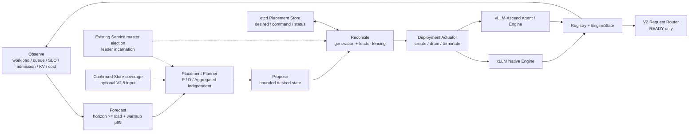
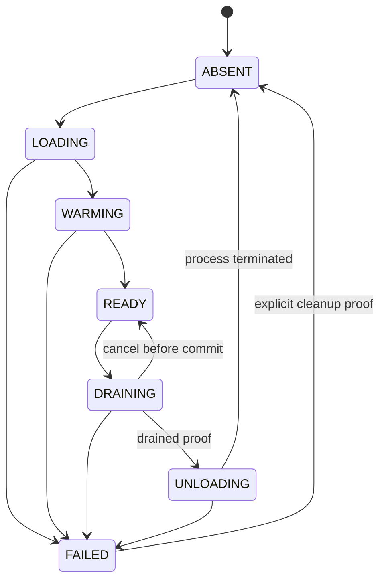

<!-- Copyright 2026 The xLLM Authors. All Rights Reserved.

Licensed under the Apache License, Version 2.0 (the "License");
you may not use this file except in compliance with the License.
You may obtain a copy of the License at

    http://www.apache.org/licenses/LICENSE-2.0

Unless required by applicable law or agreed to in writing, software
distributed under the License is distributed on an "AS IS" BASIS,
WITHOUT WARRANTIES OR CONDITIONS OF ANY KIND, either express or implied.
See the License for the specific language governing permissions and
limitations under the License.
==============================================================================-->

# xLLM Service V3 Placement 与 Autoscale 设计

状态：V3 权威实现规格
版本边界：V2 已收口；V3 首先完成全部可移植控制逻辑，随后进入 NPU/真实集群验证

## 1. 目标与边界

V3 在 V2 请求快环之外增加独立的 Placement 慢控制环。它按秒到分钟维护每个
`model_revision × provider × role × profile` 的 desired count，协调
`load → warmup → ready → drain → unload`，并在 SLO、故障余量、成本和 cache-loss
约束下独立调整 Prefill、Decode 与 Aggregated 副本。

V3 必须满足：

1. 请求 Router 只消费 READY Engine，不在请求关键路径加载模型、切换角色或等待扩容；
2. Service 的选择仍是软建议，Engine allocator/admission 仍是资源真相；
3. Placement 失败、leader 切换或部署系统不可达不能阻塞 V2 请求 Router；
4. 扩缩、换版和角色切换不能破坏在飞请求，旧 incarnation 的输出和状态继续 fencing；
5. P、D、Aggregated 分别按自己的 profile、负载和 SLO 计算，禁止固定比例联动；
6. CPU/fake actuator 证明算法、状态机、并发、幂等和故障收敛；NPU/真实集群证明
   load/warmup、真实 HBM、设备释放、容量收益和生产 SLO。

V3 不包含：

- V2.5 Store 的 Put/Query/GC、Decode checkpoint 或请求恢复；
- V4 跨 domain 整请求溢出和 V5 跨域 P/D；
- 在 Service 中调用 CANN/CUDA、理解 device pointer 或实现硬件 allocator；
- 请求级 Coordination Store、Service 故障后的流续传；
- 任意 Provider/硬件组合。只有通过 Provider conformance 的 profile 才能被放置。

## 2. 总体架构



V3 复用现有 Service master 选举，不建设第二套 leader。Placement 写入必须同时比较
`XLLM:SERVICE:MASTER` 的地址和 `XLLM:STATE:MASTER_INCARNATION`；旧 leader 即使线程
仍存活，也不能提交 desired state 或 lifecycle command。Placement loop 与 State/KV
发布线程隔离，异常只增加 `placement_reconcile_error`，不能改变 Router readiness。

## 3. 领域模型

### 3.1 Pool key

```text
PlacementPoolKey = {
  provider_id,
  model_revision,
  role,             // PREFILL | DECODE | AGGREGATED
  profile_digest
}
```

所有字符串必须非空、长度有界且拒绝 NUL/CR/LF。`role` 与 Provider descriptor 的
execution mode/capability 必须一致。一个 pool 只包含同一不可变 profile；TP/DP/PP/EP、
KV layout、Runtime 与硬件差异通过 profile 表达，Planner 不按芯片名分支。

### 3.2 Capacity profile

```text
PlacementCapacityProfile = {
  pool,
  devices_per_replica,
  instance_cost_per_hour,
  load_warmup_p99_ms,
  prefill_tokens_per_second_under_slo,
  decode_tokens_per_second_under_slo,
  requests_per_second_under_slo,
  target_utilization,
  min_replicas,
  max_replicas,
  failure_headroom_replicas
}
```

Prefill 只使用 prompt-token capacity，Decode 只使用 output-token capacity，Aggregated
使用完整请求 capacity。capacity 必须来自对应 `provider/model/profile/mode` 的固定负载
网格和线上 residual 校准，不能跨池借用。

### 3.3 Observation 与 forecast

```text
PlacementObservation = {
  observed_at,
  observation_window,
  request_rate,
  prompt_tokens_per_request,
  output_tokens_per_request,
  queue_depth,
  admission_reject_rate,
  ttft/tpot quantiles,
  kv_used_ratio,
  ready/loading/warming/draining counts,
  major_bucket_samples,
  out_of_distribution,
  cache_resident_bytes,
  confirmed_store_coverage
}
```

Forecast 输出预测窗口内的保守请求率与长度上界、数据质量和 OOD 标记。预测窗口必须
不短于 `load_warmup_p99_ms`；短于该时长时 Planner 保留 warm spare，不能假设扩容立即
生效。clock domain 使用 Service 本地 monotonic duration；跨节点时间只用于诊断。

`confirmed_store_coverage` 只有 V2.5 对象已完成 Put、Query 验证和副本门时才非零。
in-flight Put、软 KVIndex 或计划写入均按零处理。

## 4. Planner 算法

### 4.1 基础副本需求

```text
prefill_work = request_rate * prompt_tokens_per_request
decode_work = request_rate * output_tokens_per_request

base_P = ceil(prefill_work /
              (prefill_capacity_under_slo * target_utilization))
base_D = ceil(decode_work /
              (decode_capacity_under_slo * target_utilization))
base_A = ceil(request_rate /
              (request_capacity_under_slo * target_utilization))

safe_required = clamp(base + failure_headroom + warm_spare,
                      min_replicas,
                      max_replicas)
```

所有乘法、除法和取整必须检查溢出、NaN、无穷、零 capacity 和非法范围。非法 profile
不产生建议；Planner 保持上一个 desired state 并发出稳定错误。

### 4.2 快速扩容

满足任一条件并持续达到 `scale_up_hold` 时可以扩容：

- forecast 的 `safe_required > current_desired`；
- queue/reject 超过高水位；
- TTFT/TPOT 超 SLO 且样本有效；
- KV/credit headroom 低于发布门。

扩容不要求达到 scale-down 的最小样本量。单轮变化不超过 `max_scale_up_step`，也不能
越过 pool `max_replicas`、全局 device budget 或待处理 lifecycle operation 的安全上限。
同一 pool 的上一个 create 尚未获得明确终态时不重复创建新 operation。

### 4.3 保守缩容

缩容必须同时满足：

1. 完整 `scale_down_stabilization` 窗口持续低于低水位；
2. major bucket 样本量达到门限，且不在 cold-start/OOD；
3. queue、reject、TTFT、TPOT、KV/credit 均未触发高水位；
4. 缩容后 `ready - 1` 仍不低于 `safe_required` 和故障余量；
5. cooldown 到期，且没有结果不明 lifecycle operation；
6. 节省的实例成本严格大于未持久化 cache loss 与重新 warmup 成本。

```text
effective_cache_loss = full_cache_loss * (1 - confirmed_store_coverage)
scale_down_value = instance_saving - effective_cache_loss - warmup_cost
```

Store 不可用时 coverage 固定为零。单轮缩容不超过 `max_scale_down_step`。V3 默认禁止
scale-to-zero；需要外部非请求信号和独立冷启动产品语义后才能另行设计。

### 4.4 稳定性与预算

- scale-up 与 scale-down 使用不同 hold/stabilization/cooldown；扩容快、缩容慢；
- 同一 observation generation 最多生成一次 recommendation；重放必须幂等；
- 多 pool 超过全局 device budget 时，先保留 min/failure headroom，再按稳定的
  SLO risk、priority、pool key 分配扩容额度；不能依赖 unordered iteration；
- Planner 的预测或评分失败必须回退规则算法，不能进入 Engine admission；
- SHADOW 只记录 recommendation；ENFORCED 才写 desired state。二者共用同一算法。

## 5. Desired state 与 leader fencing

### 5.1 etcd key

```text
XLLM:PLACEMENT:DESIRED/<escaped-pool-key>
XLLM:PLACEMENT:COMMAND/<operation-id>
XLLM:PLACEMENT:STATUS/<operation-id>
```

desired state 包含 `schema_version`、`leader_incarnation`、单调 generation、pool key、
desired count、原因、输入 observation generation、创建时间和 config digest。更新通过
CAS 比较上一 generation/revision，并同时比较当前 Service master 地址与 incarnation。

command/status 是有界的幂等 operation ledger。operation id 由
`leader_incarnation + desired_generation + pool + ordinal + action` 确定生成；重试不创建
新 operation。status 的 free-form message 有界，控制流只依赖稳定 code/state。

### 5.2 leader 切换

新 leader 先读取 desired/command/status 全量快照，再开始 reconcile；不得从本地空状态
覆盖集群 desired state。旧 leader 写入因 incarnation compare 失败。新 leader可以重试
非终态 operation，但不能假定 RPC/写入失败等于部署动作未执行。

## 6. 生命周期与 actuator



Actuator 只有四类有副作用操作：

```text
CREATE(pool, operation_id)
BEGIN_DRAIN(engine_uid, expected_incarnation, operation_id)
CANCEL_DRAIN(engine_uid, expected_incarnation, operation_id)
TERMINATE(engine_uid, expected_incarnation, operation_id)
```

CREATE 的 READY 证明来自 Registry descriptor + fresh EngineState，而不是 actuator 自报。
BEGIN_DRAIN 必须先让 Engine 本地拒绝新 admission 并发布 DRAINING，再等待在飞 P queue、
transfer、D reservation/Decode/output 和 cleanup 全部归零。只有 Engine/Agent 返回 drain
terminal proof 后才可提交 UNLOADING。TERMINATE 之后必须观察旧 Registry lease 消失或
部署系统提供精确进程终止证明；同一角色/新模型恢复使用新 incarnation。

取消缩容只允许在 drain commit 之前。撤 lease、卸载权重或释放静态设备资源之后，禁止
用旧 incarnation 回到 READY。超时保持 DRAINING/FAILED 并告警，不能强杀仍可能持有
DMA、KV 或输出的进程。

## 7. Reconcile

每轮按稳定顺序执行：

1. 验证 leader fencing、配置和输入 snapshot；
2. 恢复所有非终态 operation，先 Query status，禁止盲目重发副作用；
3. 对 `actual_usable < desired` 生成有界 CREATE；
4. 对 `actual_usable > desired` 选择安全 victim：非 READY 优先、低 cache value、无活跃
   reservation/transfer、最长稳定窗口；不得按地址随机选择；
5. 驱动 drain → unload → absent，任何结果不明保持 operation；
6. 更新指标、结构化日志和周期 snapshot；
7. 超出时间/操作/字节预算时停止本轮，不影响 Router。

同一 Engine 同时最多一个 lifecycle operation。Pool/全局 operation 表必须有硬容量，
容量满时停止新的 placement 变更但继续收敛已有 operation。

## 8. Provider 与多硬件边界

xLLM Native 与 vLLM-Ascend 必须实现同一个生命周期 conformance：

- capability 明确声明 drain；
- drain 请求绑定 `engine_uid + incarnation + operation_id`；
- 本地先停止新 admission，再等待在飞工作；
- Query 返回稳定状态和有界 pending counters；
- 重复 command 幂等，不同 operation 冲突稳定拒绝；
- restart/role/model 变化生成新 incarnation。

Service 只消费这些标准事实，不调用 CANN/CUDA，不按 NPU/GPU/MLU 分支。模型文件、
容器、进程、设备和拓扑的实际创建/终止由部署 actuator 负责。

## 9. 错误与观测

稳定阶段：`OBSERVE/PREDICT/PROPOSE/PERSIST/CREATE/DRAIN/TERMINATE/CONVERGE`。
每轮至少记录：

```text
leader_incarnation / reconcile_generation / pool_key
observation_generation / current / ready / in_transition / desired
recommendation / reason / bounded risk evidence
operation_id / action / engine_uid / expected_incarnation / terminal state
```

常开低基数指标覆盖：leader、reconcile 成功/失败/耗时、forecast OOD、desired/current、
scale up/down/blocked、operation pending/timeout/conflict、load/warmup/drain duration、
cache-loss 阻塞、budget 阻塞和 Router unaffected。逐 pool/operation 细节进入有界 VLOG
事件，不把 model revision、engine uid 直接作为无界指标 label。

## 10. 开发门与验收

| 门 | 能力 | CPU/集群验收 |
| --- | --- | --- |
| V3-P0 | 领域模型、配置、稳定错误、状态机 | 边界、非法输入、全部允许/禁止迁移 |
| V3-P1 | 独立 P/D/A planner | overflow、OOD、hysteresis、cooldown、failure headroom、cache loss |
| V3-P2 | leader-fenced desired store | CAS、旧 leader、重放、leader 切换、损坏快照 |
| V3-P3 | reconcile 与 fake actuator | create/drain/cancel/terminate、结果不明、容量、并发、幂等 |
| V3-P4 | xLLM/vLLM lifecycle conformance | loopback drain、新 admission 拒绝、pending 收敛、新 incarnation |
| V3-P5 | Service SHADOW/ENFORCED 与观测 | Router 不阻塞、稳定 bucket、回滚、三 serving binary |
| V3-P6 | NPU/真实集群 | load/warmup/drain、故障矩阵、阶梯流量、SLO goodput、24h+ soak |

V3 代码完成口径是 P0-P5 的全部可移植逻辑、跨仓协议和 CPU/loopback 测试通过，并准确
标记 `CPU_VERIFIED / NPU_AND_CLUSTER_PENDING`。只有 P6 在真实线上环境通过后才能标记
`VERIFIED`。

## 11. 线上验证顺序与回滚

1. SHADOW：只计算 desired，验证预测、实际需求、抖动、cache loss 和 device budget；
2. ENFORCED create-only：只允许扩容，不自动缩容；验证 load/warmup/READY 与新流量；
3. 单 pool scale-down：一次一个副本，验证 drain、终止、新 incarnation 和在飞请求；
4. P/D 独立阶梯：短/长 prompt、长 output、KV pressure、突增/突降与 SLO；
5. 故障：leader kill、etcd stall、actuator timeout、Engine kill、drain timeout、状态陈旧；
6. 多模型长稳：24h+，验证预算、公平、路由和 placement 无正反馈振荡。

立即回滚方式是把 Placement mode 切为 SHADOW：停止生成新副作用，继续 Query/收敛已有
operation；必要时将 desired count 固定为人工值。回滚不能删除未知 operation 或强制把
DRAINING 改回 READY。
