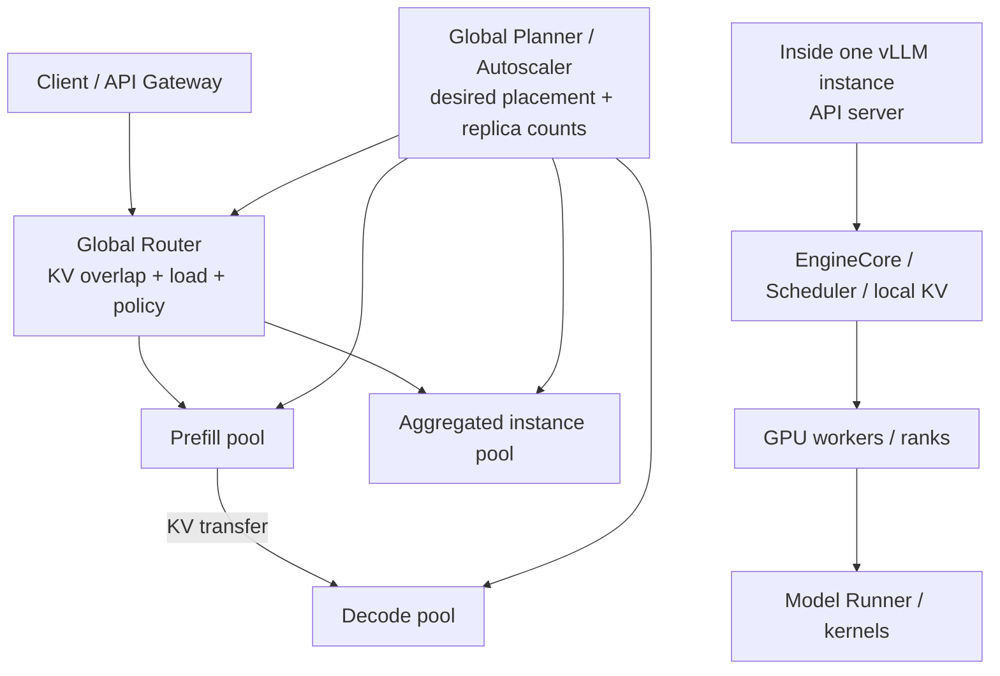
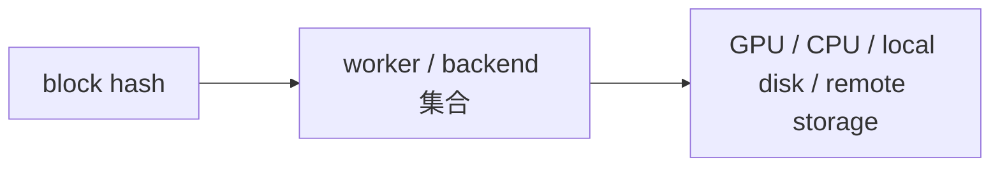
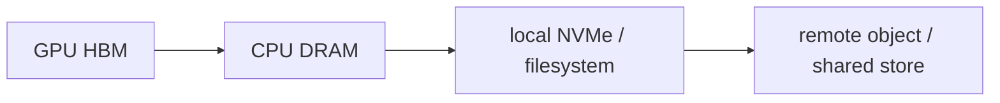
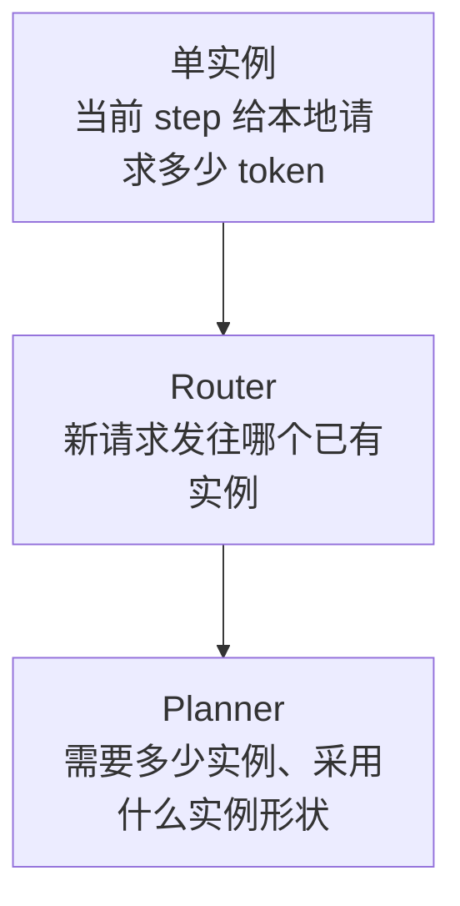
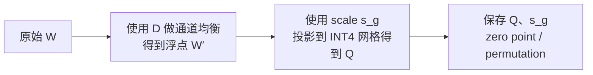
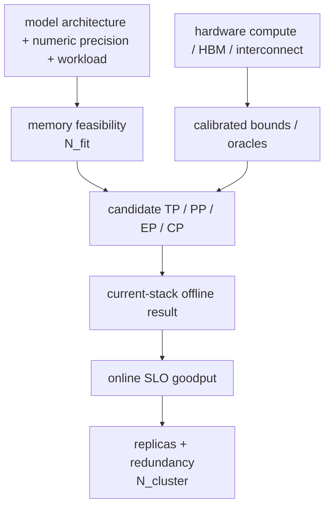
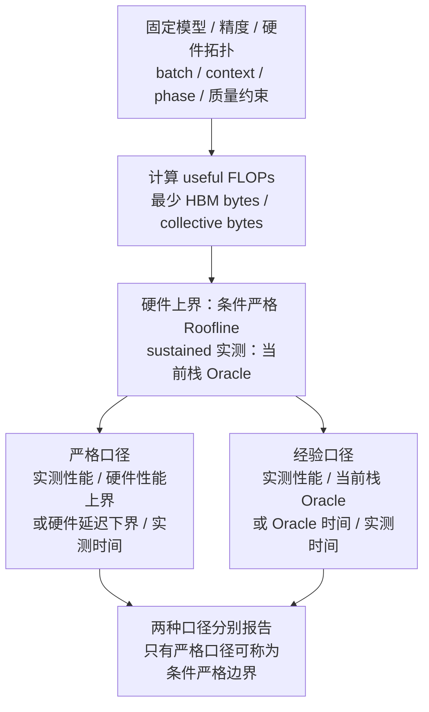

# 大模型推理系统优化技术全景

> 定位：背景资料，不是 xLLM Service 实现协议。
>
> 本文是一份面向推理系统研发的内部技术笔记，基于 vLLM `4689c7dd61548b30216cfe49060ddbce1344f871`（2026-07-30）代码，并结合 NVIDIA Dynamo、AIBrix、llm-d 和相关论文梳理。文中的“已经实现”仅表示在该代码基线或所引用系统中能找到对应实现，不代表所有模型、硬件和功能组合都已达到生产稳定状态。

## 1. 核心结论

大模型在线推理不是一个单独的 CUDA Kernel 问题，而是一个跨层控制问题：

1. **模型和算子层**决定一次 forward 的最低成本，例如量化、FlashAttention、fused MoE、通信融合和 CUDA Graph。
2. **单实例执行层**决定如何把请求组合成高效的 GPU 工作，例如 continuous batching、chunked prefill、PagedAttention、prefix caching 和投机解码。
3. **实例级部署层**决定一个模型副本使用多少 GPU、采用 TP/PP/DP/EP/CP 中的哪些并行策略。
4. **集群控制层**决定请求去哪个副本、需要多少 Prefill/Decode 副本、KV 放在哪里，以及如何在 TTFT、ITL、吞吐、显存和成本之间权衡。

vLLM 当前主要覆盖第 1～3 层，并向第 4 层暴露 Connector、KV Cache Events、指标和外部负载均衡接口。Dynamo、AIBrix、llm-d 等系统在 vLLM 之上补充集群级 Router、Planner、Kubernetes 编排和全局 KV 索引。



## 2. 先统一术语

### 2.1 请求的两个阶段

Transformer 自回归生成可以粗略拆成：

- **Prefill**：一次处理 prompt 中的大量 token，生成首轮 KV Cache。矩阵通常较大，更偏计算密集，主要影响 TTFT（Time To First Token）。
- **Decode**：每轮通常为每个请求生成一个新 token，同时读取不断增长的 KV Cache。小 batch 下更偏显存带宽和调度延迟敏感，主要影响 ITL/TPOT（Inter-Token Latency / Time Per Output Token）。

这两个阶段的最佳 batch、并行策略、Kernel 和 SLO 不同，是 chunked prefill、P/D 分离和投机解码存在的根本原因。

### 2.2 instance、replica、worker 和 rank

这些词在不同系统里经常指代不同对象。

| 术语 | 本文中的含义 |
| --- | --- |
| vLLM service instance / replica | 一次 `vllm serve` 启动形成的可调度服务副本；它可能跨多张 GPU、多个进程甚至多个节点 |
| EngineCore | 每个 DP rank 对应的核心引擎进程，运行 Scheduler、管理请求和本地 KV |
| vLLM GPU worker | 通常一个进程控制一张 GPU，加载模型分片并执行 forward |
| rank | 某个并行通信组中的进程编号，例如 TP rank、PP rank 或 DP rank |
| Router worker / backend | Router 可选择的后端服务端点，通常对应一个 vLLM replica，而不是 replica 内部的一张 GPU |
| P replica | 只负责 Prefill 的 vLLM 服务实例 |
| D replica | 只负责 Decode 的 vLLM 服务实例 |
| aggregated replica | 同一个实例同时执行 Prefill 和 Decode |

当前 vLLM V1 的进程结构见 [Architecture Overview](../../../docs/design/arch_overview.md)：一个 DP rank 有一个 EngineCore；每个 EngineCore 下的 GPU worker 数通常是 `TP × PP`。因此：

```text
单个 vLLM 服务并不等于单进程或单 GPU
单个 Router worker 也不等于 vLLM 内部 GPU worker
```

### 2.3 P/D 配比到底属于谁

在 P/D 分离部署中，一个 P replica 和一个 D replica 是两次独立的 vLLM 启动。每个 replica 都可以选择自己的并行策略，例如：

```text
P replica: TP=8, PP=1, PCP=2
D replica: TP=4, PP=2, DCP=2
```

但单个 P replica 不会在内部再决定“自己包含几个 P、几个 D”。系统中的 `3P:8D` 表示启动 3 个 Prefill 服务实例和 8 个 Decode 服务实例。这个数量、请求到哪个 P/D、KV 如何传输以及何时扩缩容，属于全局 Router/Planner 的职责。

vLLM 的 P/D 分离实现和 Connector 抽象见 [Disaggregated Prefilling](../../../docs/features/disagg_prefill.md)。当前文档仍将该能力标记为 experimental。

## 3. 单个 vLLM 实例内部做什么

### 3.1 Scheduler 不是简单的“Prefill 队列 + Decode 队列”

当前 V1 Scheduler 使用统一的 token 进度模型。每个请求维护：

```text
num_computed_tokens
num_tokens_with_spec =
    prompt tokens + output tokens + speculative tokens
```

每一步的目标，是在全局 token budget 和 KV block 约束下，让选中请求的 `num_computed_tokens` 追上 `num_tokens_with_spec`。这个统一表示同时覆盖：

- 普通 Prefill；
- chunked prefill；
- Decode；
- prefix cache 命中；
- 投机 token 的验证；
- 多模态 encoder 输入；
- 将来的 jump decoding。

实现入口见 [V1 Scheduler](../../../vllm/v1/core/sched/scheduler.py)。

### 3.2 Continuous batching

Continuous batching 的关键不是“凑齐一个静态 batch 再运行”，而是每个 engine step 都允许请求加入、结束、抢占或恢复。相邻 step 的 batch 大部分请求相同，只有少数行发生变化。

它提高 GPU 利用率，但也引入三个控制变量：

- `max_num_seqs`：一个 DP rank 内允许并发运行的请求数；
- `max_num_batched_tokens` / scheduled token budget：一步允许计算的 token 数；
- KV Cache 可用 block 数：决定这些请求是否能继续驻留。

增加 batch 并不总是更好。它通常提高吞吐，却可能增加排队、ITL、KV 压力，并把投机验证的有效 batch 放大到 `batch_size × (K + 1)`。

### 3.3 Chunked prefill

长 prompt 如果一次性 Prefill，会长时间占用计算资源并阻塞 Decode。Chunked prefill 把长 Prefill 切成多个 token chunk，与 Decode 请求放入同一步执行。

当前 vLLM V1 在支持时默认启用 chunked prefill。实现粒度上，Scheduler 先调度 `running` 队列，其中既有 Decode，也可能有尚未完成的 chunked prefill；剩余 token budget 再用于 `waiting` 队列中的新请求。因此“优先 Decode”只是对常见稳态的近似说法。调节原则见 [Optimization and Tuning](../../../docs/configuration/optimization.md)：

- 较小的 token budget 通常更有利于 ITL；
- 较大的 token budget 通常更有利于 TTFT 和总体吞吐；
- 需要结合真实 ISL/OSL 分布，而不是只压测固定长度。

### 3.4 KV 不足、抢占和重算

当运行请求无法分配新 KV block 时，Scheduler 可以抢占低优先级请求，释放 KV，再把请求放回 waiting queue。V1 默认更倾向于 recompute，而不是把完整 KV swap 到 CPU，因为重算在当前架构下通常更简单、开销更可控。

频繁抢占意味着配置已经过载。常见改进方向是：

- 增加可用于 KV 的显存或 GPU 数；
- 降低 `max_num_seqs` / `max_num_batched_tokens`；
- 使用 prefix caching 减少重算；
- 使用 FP8/INT4 等 KV 量化；
- 将冷 KV offload 到 CPU、磁盘或远端层；
- 在集群层提前做 admission control 和负载路由。

## 4. KV Cache：block、hash、复用和淘汰

### 4.1 这里的 block 是 KV block 吗

是，但要区分逻辑身份和物理存储：

- **逻辑 block**：一段连续 token 对应的 KV 内容，用 chained block hash 标识；
- **物理 block**：某个 vLLM 实例的 HBM block pool 中的一块空间，用本地 `block_id` 标识；
- **Router 计费 block**：Router 用来估算 Prefill/Decode 工作量的单位，通常与后端配置的 hash block size 对齐，但它不是 GPU 指针。

同一个逻辑 block 在不同 worker、GPU、CPU、磁盘上可以有多个副本；它们的本地 `block_id` 无需相同。

### 4.2 chained block hash

vLLM 对每个完整 block 计算：

```text
block_hash_i = H(
    parent_block_hash,
    token_ids_in_block,
    extra_keys
)
```

`extra_keys` 可以包含 LoRA、multi-modal input hash、prompt embedding hash 和 `cache_salt`。因此 hash 不只是当前 block token 的 hash，而是“从序列开头到当前 block”的链式内容身份。

这样做有两个重要性质：

1. 相同 token block 出现在不同前缀后面时不会被错误复用；
2. Router 必须从第一个 block 开始查找**最长连续命中前缀**。中间一旦缺失，后面的 block 即使 token 碰巧相同，也缺少正确的前置状态，不能直接跳过计算。

vLLM 的详细实现见 [Prefix Caching Design](../../../docs/design/prefix_caching.md)。

Prefix caching 只跳过已命中 prompt 的 Prefill 计算，不会直接降低后续新输出 token 的 Decode 成本。长文档多轮问答通常收益明显；长输出、低 prefix 重复率的 workload 收益有限。

### 4.3 本地索引和淘汰

单个 vLLM 实例的 KV manager 维护：

- 预分配的 block pool；
- free block 双向链表；
- `block_hash -> block_ids`；
- `request_id -> allocated blocks`；
- 引用计数。

请求命中 cached block 后会增加引用计数，并把 block 从 free queue 中移出，防止仍在使用时被淘汰。请求完成后，引用计数归零的 block 回到 free queue。当需要复用 free queue 头部的 cached block 时，执行近似 LRU 淘汰：

1. 从 free queue 头部取出 block；
2. 从 hash 索引移除对应 `block_id`；
3. 清除 block hash；
4. 把物理空间分配给新内容。

这是**实例内部**的容量管理，不知道其他实例是否有相同 KV，也不会决定集群中哪个请求应该发到哪个实例。

### 4.4 KV Events 是状态事实，不是全局调度

vLLM 可以发布：

- `BlockStored`；
- `BlockRemoved`；
- `AllBlocksCleared`。

事件中可以包含 block hash、parent hash、token IDs、block size、LoRA、`group_idx`、存储介质和 locality。代码见 [KV Cache Events](../../../vllm/distributed/kv_events.py) 和 [KV Events Config](../../../vllm/config/kv_events.py)。

外部 Router 消费这些事件后，才能构建类似下面的全局索引：



事件流必须处理丢包、重复、乱序、worker 重启和 replay。Router 不能把“曾经收到 Stored”永久当成真实状态；需要 generation、TTL、重放或 worker 快照进行校正。

### 4.5 多层 KV 和 Connector

Connector 负责 KV 的查找、加载、保存和 P/D 传输。当前代码包含 NIXL、LMCache、Mooncake、Offloading、FlexKV、HF3FS、MultiConnector 等路径，统一接口见 [KVConnectorBase V1](../../../vllm/distributed/kv_transfer/kv_connector/v1/base.py)。

典型层级是：



层级越低，容量越大，但命中收益越低。Router 不应把 CPU/磁盘命中按 GPU 命中等价计分，而应扣除加载、网络和排队成本。

## 5. 集群级 KV-aware Router

### 5.1 为什么 round-robin 不够

假设 8 个相同 vLLM replica 都启用了 prefix caching。一个多轮会话的历史 KV 只在 replica 3 上，如果下一轮被 round-robin 发到 replica 5，本地 APC 完全无法命中，整个 prompt 仍需重算。

只按 KV overlap 路由也不够。如果所有共享 system prompt 的请求都发到一个 cache-rich worker，它会被打爆，ITL 和排队 TTFT 反而恶化。因此生产 Router 需要同时考虑：

- 可复用 prefix；
- 已分配的 Prefill 工作；
- 活跃 Decode 的 KV 和带宽压力；
- 新请求预期增加的 Prefill/Decode 工作；
- 存储层级和 KV 加载代价；
- worker 健康、队列上限、租户和优先级。

### 5.2 Router 中的 worker 到底是什么

在 Dynamo/llm-d/AIBrix 的 Router 语境中，worker 通常是一个已注册的推理后端端点，例如一个 vLLM pod/replica。它内部可能包含 TP=8 的 8 个 GPU worker 进程。Router 选择的是服务端点，不会逐个选择内部 TP rank。

### 5.3 请求如何匹配 worker

Router 必须与后端使用兼容的：

- tokenizer；
- chat template 和特殊 token 处理；
- block/hash 粒度；
- hash 序列化算法；
- LoRA、多模态和 cache salt 元数据。

新请求到达后，Router 对 prompt token 分块并计算 chained block hashes，然后查询每个候选 worker 能连续命中多少个 block。llm-d 的 precise prefix cache 方案就是消费 vLLM KV events，维护精确 per-pod 索引，再结合负载 scorer。

### 5.4 Dynamo 的 overlap + load 成本模型

Dynamo 当前文档给出的核心成本形式为：

```text
raw_prefill_blocks =
    active_prefill_blocks + incoming_prompt_blocks

adjusted_prefill_blocks =
    max(raw_prefill_blocks - overlap_credit_blocks, 0)

decode_blocks =
    active_decode_blocks + incoming_active_blocks

cost =
    prefill_load_scale * adjusted_prefill_blocks + decode_blocks
```

最低成本的 eligible worker 获胜。各变量含义如下。

#### `incoming_prompt_blocks`

新请求 prompt 的 block 数，代表“不考虑任何缓存时”的 Prefill 工作规模。它是成本单位，不是已经分配的 GPU block ID。

#### `overlap_credit_blocks`

候选 worker 已有 KV 对新请求 Prefill 的抵扣。它可以组合：

- device-local GPU 命中；
- host/CPU 命中；
- disk 命中；
- shared/remote cache 命中。

不同层使用不同 credit。GPU resident block 接近完整抵扣，CPU/磁盘 block 需要扣除加载成本。credit 还可以在 worker 已很忙时衰减，避免 cache-rich worker 永远胜出。

#### `active_prefill_blocks`

已经路由到该 worker、但 Prefill 尚未完成的 prompt 工作。Router 必须在请求真正结束 Prefill或超时后回收这部分估算，否则会产生幽灵负载。

#### `active_decode_blocks`

当前活跃 Decode 请求持有的 KV/上下文工作量。它同时近似：

- HBM 占用；
- Decode attention 每步读取量；
- 内存带宽压力；
- 未来一段时间的并发压力。

只有 active request count 不足以描述 Decode 负载：8 个 2K context 与 8 个 100K context 的成本显然不同。

#### `prefill_load_scale`

把 Prefill block 成本映射到 Decode block 成本的标定系数。它不是模型量化 scale，而是 Router cost model 参数。不同模型、GPU、P/D 拓扑和 Kernel 下，Prefill 与 Decode 的相对成本不同，需要通过 profiling 或在线反馈标定。

Dynamo 的最新定义见 [Routing Concepts](https://docs.nvidia.com/dynamo/latest/components/router/routing-concepts) 和 [Configuration and Tuning](https://docs.nvidia.com/dynamo/components/router/configuration-and-tuning)。

### 5.5 三种系统的定位

| 系统 | 与 vLLM 的典型组合方式 | 重点能力 |
| --- | --- | --- |
| NVIDIA Dynamo | vLLM 作为 backend worker | KV overlap + load routing、P/D 编排、KV 多层、Planner |
| AIBrix | vLLM pod + Envoy/Kubernetes 控制面 | 可插拔路由、prefix-cache/Preble、SLO、公平性、autoscaling、KV orchestration |
| llm-d | vLLM + Kubernetes Gateway API Inference Extension | precise per-pod prefix cache、load scorer、P/D、tiered KV、SLO-aware routing |

参考：

- [Dynamo KV Router](https://docs.nvidia.com/dynamo/latest/user-guides/kv-cache-aware-routing)
- [AIBrix Router](https://aibrix.readthedocs.io/latest/designs/aibrix-router.html)
- [llm-d Precise Prefix Cache Aware Routing](https://llm-d.ai/docs/dev/architecture/advanced/kv-management/prefix-cache-aware-routing)

## 6. P/D 分离与集群 Planner

### 6.1 P/D 分离解决什么

Aggregated 实例中，Prefill 和 Decode 共享 GPU。大 Prefill 可能干扰正在进行的 Decode，造成 tail ITL 抖动。P/D 分离把两类工作放到独立池中，使系统能够：

- 分别为 TTFT 和 ITL 选择并行策略与 batch；
- 隔离 Prefill 对 Decode 的干扰；
- 独立扩缩 P/D 副本；
- 在不同硬件上部署 P/D；
- 对长 prompt、短 prompt 和长 Decode 建立专用 pool。

代价是：

- Prefill 产生的 KV 必须传到 D；
- 增加网络流量、同步、失败恢复和状态一致性；
- 需要全局选择 P 和 D；
- 小规模或短 prompt 下，传输成本可能大于隔离收益。

vLLM 文档强调 P/D 分离本身主要用于分别调节 TTFT/ITL 和控制 tail ITL，不应默认理解成“无条件提高吞吐”。系统级 goodput 是否改善取决于阶段干扰、资源形状、网络和 workload。

### 6.2 副本数量为什么必须由全局决定

单个 vLLM instance 只看得到自己的：

- waiting/running queue；
- KV 使用率；
- scheduled tokens；
- Prefix Cache 命中；
- forward latency；
- Connector 状态。

它看不到整个入口流量、其他实例负载、GPU 预算和扩容耗时。因此：



### 6.3 Dynamo 的长短周期 Planner

Dynamo 当前 Planner 使用两个不同控制周期：

1. **慢周期 throughput-based loop**

    - 观察请求数、ISL、OSL、KV hit rate、投机接受长度；
    - 使用 Constant、ARIMA、Kalman 或 Prophet 等方式预测流量；
    - 结合离线 profiling、AI Configurator 或在线性能模型估算容量；
    - 计算 Prefill/Decode replica 下界；
    - 为持续负载提前扩容，避免对瞬时噪声过度反应。

2. **快周期 load-based loop**

    - 消费实时 ForwardPassMetrics、queue 和 worker 状态；
    - 在线回归 Prefill/Decode 工作量到 wall time；
    - 根据估算 TTFT/ITL 对副本数做更快的 `+1/-1` 调整；
    - 当两个 loop 同时启用时，只能在慢周期给出的容量下界之上调节。

这比普通 CPU/GPU utilization HPA 更适合 LLM，因为同样的 QPS 可以对应完全不同的 ISL、OSL、KV hit rate 和投机接受长度。

最新设计见 [Dynamo Planner Design](https://docs.nvidia.com/dynamo/design-docs/component-design/planner-design) 和 [Dynamo Planner Guide](https://docs.nvidia.com/dynamo/components/planner/planner-guide)。

### 6.4 Planner 还需要处理的工程问题

- 冷启动和模型权重加载可能远慢于控制周期；
- scale-down 前必须 drain 或迁移活跃请求；
- 新 D replica 没有历史 KV，短期内不应与 cache-warm replica 等价；
- 平均 ISL/OSL 无法准确描述双峰或重尾流量；
- 扩容期间 Router 必须区分 desired、starting、ready、draining；
- P/D 扩缩应考虑 KV transfer 带宽，而不只看计算；
- 多租户需要配额、公平性和 cache isolation；
- 预测错误时需要 hysteresis、cooldown 和最小副本下界，避免震荡。

## 7. 并行与执行优化

### 7.1 并行策略解决不同问题

| 并行方式 | 主要作用 | 主要代价 |
| --- | --- | --- |
| TP | 把单层权重和矩阵计算切到多 GPU | 高频 all-reduce/all-gather，对互联敏感 |
| PP | 按层切模型，支持跨节点和不均匀切分 | pipeline bubble、调度复杂度 |
| DP | 复制模型，处理独立 batch，扩吞吐 | 多份权重和独立 KV；需要全局负载均衡 |
| EP | MoE expert 分散到不同 rank | all-to-all、expert 负载不均 |
| CP/DCP/PCP | 沿 context/token 维度切 attention | 通信、边界和 backend 兼容性 |

“更多 GPU”不等于“单请求更快”。如果模型能放入单 GPU，TP 通信可能使小 batch Decode 更慢。选择策略时必须结合：

- 模型是否能放入显存；
- 节点内 NVLink/PCIe 和节点间 IB/RoCE；
- Prefill/Decode 哪个阶段是瓶颈；
- batch、context 和 MoE expert 分布；
- KV 容量而不只是权重容量。

当前支持和建议见 [Parallelism and Scaling](../../../docs/serving/parallelism_scaling.md) 与 [Data Parallel Deployment](../../../docs/serving/data_parallel_deployment.md)。

### 7.2 Kernel、编译与 CUDA Graph

推理执行路径常见优化包括：

- FlashAttention/FlashInfer/Triton/CUTLASS 等 IO-aware attention 与 GEMM；
- fused RMSNorm、RoPE、activation、quant、MoE routing/permutation；
- fused collective，把通信与矩阵计算或 epilogue 重叠；
- `torch.compile` 和 shape-specialized Kernel；
- CUDA Graph 减少每 step 的 CPU launch 开销；
- Kernel autotuning 和按 GPU 架构、dtype、shape 选择 backend；
- quant/dequant 与 GEMM/attention 融合，避免中间张量物化。

这些优化有共同限制：动态 batch、不同 K、不同 context 和多模态输入会产生大量 shape。Graph bucket 太多会增加 capture 时间和显存；bucket 太少又需要 padding，浪费算力。因此 Scheduler、投机 controller 和 CUDA Graph 不能独立设计。

### 7.3 长上下文优化

长上下文的主要成本不是只有 KV 容量，还包括每个 Decode token 读取和计算 attention 的成本。优化可以分为四类：

1. **模型原生结构**

    - MQA/GQA 减少 KV head 数；
    - MLA 把 KV 压缩到 latent 表示；
    - sliding-window/local attention 限制部分层的可见窗口；
    - recurrent/SSM hybrid 用固定或更紧凑的状态替代部分全量 KV。

这些能力通常需要模型训练时支持，推理框架不能无损地把任意 MHA checkpoint 自动改成 GQA/MLA。

2. **精确但增加系统复杂度**

    - context parallel 把长序列/KV 分布到多 GPU；
    - KV offload/tiering 扩大工作集；
    - prefix caching 避免重复 Prefill；
    - P/D 分离和高速 KV transfer 隔离长 Prefill。

3. **降低精度或改变选择**

    - FP8/INT4/INT2 KV；
    - sparse attention、top-k page/block selection；
    - token dropping、KV merge/compression。

这类方案可能改变 attention score 或被选择的历史 token，必须做长上下文 retrieval、reasoning、代码复制和工具参数准确率评测。

4. **请求级策略**

    - 按 ISL/context class 路由到专用 pool；
    - 对极长 prompt 做 chunked prefill 和 admission control；
    - 根据剩余 KV 容量限制并发，而不只限制请求数；
    - 预测 OSL，避免接收后才发现 Decode KV 无法持续增长。

### 7.4 MoE 特有优化

MoE 每个 token 只激活少量 expert，降低理论计算量，但推理瓶颈经常转移到：

- router/top-k；
- token permutation/unpermutation；
- grouped GEMM；
- EP all-to-all；
- expert 负载倾斜；
- 跨节点 expert 权重和通信。

常见优化包括 fused router、quantized grouped GEMM、通信计算重叠、expert parallel、expert placement/load balancing，以及为热点 expert 建冗余副本。DP+EP 下，不同 DP rank 的 forward 可能需要同步 collective；这也是动态 K、异步调度和空 batch forward 不能只做本地决定的原因。

未来的集群 Router 还可以考虑 expert locality：如果请求或共享 prefix 对 expert 选择具有稳定性，可以把负载、KV locality 和 expert locality 联合建模。但该方向必须防止把热点请求集中到同一组 expert-rich worker。

### 7.5 启动、模型加载与 CPU 路径

扩容速度还取决于非 forward 路径：

- checkpoint 从对象存储到本地盘/CPU/HBM 的加载；
- tensor parallel 分片、量化和 Kernel-specific repack；
- `torch.compile`、Kernel autotune 和 CUDA Graph capture；
- tokenizer、chat template、多模态预处理和 detokenization；
- API server 与 EngineCore 的 IPC；
- NUMA、pinned memory 和 CPU thread 配置。

如果一个新 replica 需要数分钟才能 ready，Planner 即使预测完全正确也可能来不及扩容。生产系统通常需要权重预热池、镜像/本地缓存、编译产物缓存、分阶段 readiness，以及“模型已加载但 KV 仍是 cold”的状态。

## 8. MRV1 与 MRV2

### 8.1 MRV1 是什么

这里的 MRV1 指 vLLM V1 架构中原有的 GPU Model Runner 路径，不是早期 vLLM V0 Engine。它负责：

- 根据 SchedulerOutput 更新 persistent batch；
- 准备 input IDs、positions、block table 和 sampling metadata；
- 执行模型 forward；
- 运行 sampler 和 logits processor；
- 管理 CUDA Graph、KV 写入和输出。

MRV1 已经使用 persistent batch，问题不是“完全没有持久状态”，而是持久状态与每一步输入 tensor 的布局耦合过紧。请求加入、结束或重排时，容易触发大 tensor 重排，并需要额外 `CachedRequestState` 和 async barrier。

### 8.2 MRV2 的目标

MRV2 从 async-first 重新设计执行路径，重点消除 CPU 开销、tensor 重排和同步点。设计见 [Model Runner V2](../../../docs/design/model_runner_v2.md)。

#### 永久 request row

MRV2 预分配最多 `max_num_reqs` 行。一个请求在活跃期间绑定固定 row，结束或抢占后释放；恢复视为重新加入。每一步根据 attention backend 需要的顺序，由 GPU gather 出真正输入。

收益是：

- persistent state 不需要跟随 batch 顺序搬家；
- 请求插入/删除成为 row 元数据变化；
- 去掉冗余 `CachedRequestState`；
- CPU 只提交增量状态。

#### Scheduler/worker 准备 N+1，GPU 执行 N

MRV2 假设核心执行循环是一条无 CPU 同步点的 CUDA stream。CPU 在 GPU 执行 step N 时准备 step N+1。任何显式 synchronize 或隐式 pageable H2D copy 都会破坏重叠。

#### StagedWriteTensor

对 block table 等大 tensor：

1. 完整基础 tensor 常驻 GPU；
2. CPU 只记录 ragged diff；
3. diff 被打包成连续 staging buffer；
4. 一次 H2D 复制；
5. 一个 GPU kernel 应用所有 diff。

它与“每步复制整张 block table”相比显著降低 CPU 和 PCIe 开销。

#### GPU-native metadata

`input_ids`、`positions`、`seq_lens` 等元数据由 Triton Kernel 在 GPU 上生成，使 GPU 可以直接消费前一步产生、CPU 尚未知晓的结果，对 async scheduling 和投机解码尤其重要。当前主路径中的 `query_start_loc` 是例外：CPU 使用 `np.cumsum` 计算后再异步 H2D，并不是由 Triton 在 GPU 上生成。这里应以 [GPU Model Runner 实现](../../../vllm/v1/worker/gpu/model_runner.py) 为准；设计文档中的概括比当前实现更超前。

#### UVA

对 `prefill_token_ids` 等大而低频的数据，部分路径使用 UVA 让 GPU 直接访问 CPU resident memory，避免把整份数据复制到 GPU。UVA 不是“CPU 内存与 HBM 同速”，它适合访问量和局部性可控、复制收益不足的场景。

#### Triton sampler

MRV2 的 sampler 重点包括：

- Gumbel-max sampling，避免完整 softmax materialization；
- stateless in-kernel RNG；
- 先找 top-k logits，再只对候选计算 logprobs；
- 长 prompt logprob 细粒度分块，降低峰值显存；
- `idx_mapping` 把 logits 映射到 request sampling state，避免状态展开。

#### 显式 CUDA Graph 管理

MRV2 使用独立的 `CudaGraphManager` 管理完整图的 capture 和 launch。它也为 “把多次 draft forward 捕获进一张 CUDA Graph”提供更清晰的扩展点。

### 8.3 当前状态判断

MRV2 是“下一代执行路径已经落地”，但不能表述为已全面替代 MRV1：

- 设计文档明确写有 not feature-complete、not rigorously tested；
- [GPU Model Runner README](../../../vllm/v1/worker/gpu/README.md) 仍标记 Experimental；
- 不同 attention backend、模型、多模态、LoRA、KV sharing 和投机组合仍有 feature matrix。

未来重点不是再增加一套平行 hack，而是补齐 feature parity、建立组合测试和性能回归门禁，并让新功能优先基于 MRV2 的持久状态、异步和模块化边界设计。

## 9. 量化

### 9.1 量化到底在优化什么

量化可以同时减少：

- 模型权重显存；
- 权重读取带宽；
- activation/KV Cache 容量；
- 通信流量；
- 某些硬件上的矩阵计算成本。

但它会增加：

- scale/zero-point 元数据；
- quant/dequant 或格式转换；
- Kernel 和硬件约束；
- 数值误差和评测成本。

因此“位宽更低”不等于“服务一定更快”。如果 Kernel 不支持原生低精度计算，每次先反量化再做 BF16 GEMM，小 batch、短序列或 CPU launch 开销下可能没有收益。

### 9.2 两组容易混淆的分类

#### PTQ、QAT 与训练时机

- **PTQ（Post-Training Quantization）**：训练完成后量化。可以只是 RTN，也可以用 calibration data 做 AWQ/GPTQ/SmoothQuant。
- **QAT（Quantization-Aware Training）**：训练/微调时模拟量化误差，让参数适应低精度。

#### 静态、动态与运行时机

“静态/动态”最好明确是在说 weight 还是 activation：

| 对象 | 静态 | 动态 |
| --- | --- | --- |
| Weight | scale 和整数权重在离线或加载时确定，推理期间不随请求改变 | 实际部署中很少按请求重量化固定权重 |
| Activation | calibration 后固定 scale | 每个 token/batch/block 在线计算 scale |
| KV Cache | checkpoint/calibration 提供固定 per-tensor/per-head scale | 写入 KV 时按 token/head/block 计算 scale |

vLLM 的 **Online Quantization** 是“加载 BF16/FP16 checkpoint 时把权重量化，forward 时动态量化 activation”，不是在线训练。见 [Online Quantization](../../../docs/features/quantization/online.md)。

### 9.3 当前 vLLM 的量化覆盖

以当前代码的 [Quantization Registry](../../../vllm/model_executor/layers/quantization/__init__.py) 和 [Quantization Guide](../../../docs/features/quantization/README.md) 为准，大致包括：

- **Weight-only**：AWQ、GPTQ、Marlin 对应格式、BitsAndBytes、TorchAO、INC 等；
- **Weight-activation**：INT8、FP8、FP4、MXFP4/MXFP8、NVFP4、compressed-tensors、ModelOpt、Quark；
- **MoE**：expert INT8、WNA16、量化 grouped GEMM、不同 dense/MoE recipe；
- **KV Cache**：FP8、per-token/head INT8/INT4、NVFP4、TurboQuant 等，但 backend、GPU 架构和模型限制不同；
- **Vision encoder/attention**：部分 FP8 路径；
- **加载时量化和 quant fusion**：按 linear/MoE 分别配置，并支持跳过敏感层。

支持列表变化很快，文档表格可能落后于注册表和 backend capability。生产选型必须同时检查：

```text
checkpoint format
× vLLM quantization config
× GEMM/MoE/attention backend
× GPU architecture
× TP/EP layout
```

GGUF 已迁出当前内置 Quantization Registry，需要安装外部 [vllm-gguf-plugin](https://github.com/vllm-project/vllm-gguf-plugin)；它不能再与 AWQ/GPTQ 等内置方法并列理解为当前核心注册项。

### 9.4 主流部署怎么选

| 场景 | 常见选择 | 原因 |
| --- | --- | --- |
| 精度基线、新模型接入 | BF16/FP16 | 兼容性最好，便于定位数值问题 |
| Hopper/Ada/新一代数据中心 GPU | FP8 W8A8 或 BF16 | FP8 Kernel 成熟时兼顾吞吐、显存和精度 |
| 模型放不下或 Decode 权重带宽受限 | INT4 W4A16，AWQ/GPTQ + Marlin/CUTLASS | 大幅减少权重容量和读取量 |
| 成熟 INT8 平台/CPU | INT8 W8A8 或 weight-only INT8 | 硬件覆盖广、误差相对容易控制 |
| Blackwell 和特定 MoE checkpoint | NVFP4/MXFP4/MXFP8 | 原生格式和 Kernel 可带来更高密度 |
| 本地/CPU 生态 | GGUF + 外部 `vllm-gguf-plugin` | 格式和 CPU Kernel 生态成熟，但当前 vLLM 支持来自 out-of-tree 插件 |
| 长上下文、KV 容量瓶颈 | FP8 KV Cache 优先 | 通常比 INT4/INT2 更稳健、支持更成熟 |

INT4/INT2 KV、KIVI、TurboQuant 等是重要方向，但“论文有效”不能直接等同于 “所有 vLLM 模型和 attention backend 上稳定”。低位 KV 改变 attention score，长上下文检索、代码复制、工具参数和 reasoning 都需要专门评测。

### 9.5 基础量化公式

对称量化：

$$
q = \operatorname{clip}\left(\operatorname{round}(x/s), q_{\min}, q_{\max}\right)
$$

$$
\hat{x} = s q
$$

非对称量化：

$$
q = \operatorname{clip}\left(\operatorname{round}(x/s) + z, q_{\min}, q_{\max}\right)
$$

$$
\hat{x} = s(q-z)
$$

这里的 `s` 才是最终量化 scale，`z` 是 zero point。scale 可以是：

- per-tensor；
- per-output-channel；
- per-input-channel；
- group-wise，例如每 32/64/128 个 weight；
- block-wise，例如 FP8 128×128；
- per-token/per-head，用于动态 activation 或 KV。

粒度越细通常误差越小，但 scale 元数据、索引和 Kernel 实现越复杂。

### 9.6 什么情况下需要 calibration

Calibration 的本质是：用一小批代表性输入运行真实或模拟 forward，采集 weight、activation、KV 或 layer output 的统计，用于确定量化参数和误差补偿策略。

#### 通常不需要 calibration

- weight-only RTN，只根据每组 weight min/max 计算 scale；
- 加载时 FP8 weight quant，只做直接 per-tensor/per-block 转换；
- activation 使用真正的 per-token dynamic scale；
- 已经包含完整 quant metadata 的预量化 checkpoint。

即使不需要 calibration，也仍然需要 accuracy evaluation。两者不是一回事。

#### 通常需要 calibration

- static activation INT8/FP8；
- AWQ，需要 activation 识别 salient channel 并搜索缩放；
- GPTQ，需要 calibration activation 近似 Hessian/输入协方差；
- SmoothQuant，需要 weight 与 activation 统计做跨通道迁移；
- 静态 KV scale，特别是 per-head scale；
- mixed precision、敏感层跳过和 outlier threshold 搜索；
- 视觉 encoder 或领域分布与通用文本差异明显的模型。

Calibration dataset 应覆盖真实 workload 的：

- 语言和领域；
- chat template、system prompt、工具调用；
- ISL 和 context 分布；
- 多模态输入；
- sampling/structured output 路径；
- reasoning 与非 reasoning 模式。

只用随机 token 或几条短文本，可能完全看不到真实 activation outlier。

### 9.7 weight 与 activation 的 calibration 关注点

对 weight 来说，权重本身固定且可直接统计。Calibration 数据主要用于回答：

- 哪些输入 channel 对真实输出最重要；
- group/channel/block 采用什么粒度；
- 哪些层、expert 或 projection 更敏感；
- 是否需要 equalization、旋转或二阶误差补偿；
- 哪些层保留 BF16/FP16；
- mixed precision 的位宽分配。

对 activation 来说，值随请求变化，Calibration 更直接用于：

- scale 和 clipping threshold；
- per-tensor/per-token/per-channel 粒度；
- outlier 是否单独处理；
- 静态 scale 是否能覆盖线上分布；
- distribution shift 时是否应该改成 dynamic scale。

所以“weight calibration 选量化方案，activation calibration 选 scale”方向上是对的，但 AWQ/GPTQ 中的 calibration activation 也会反过来改变 weight 的缩放、顺序和误差补偿。

### 9.8 均衡因子 D 为什么不是量化 scale

以行向量形式的线性层为例：

$$
y = xW
$$

插入可逆的对角通道均衡矩阵 $D$：

$$
x' = xD^{-1}, \quad W' = DW
$$

则：

$$
x'W' = xD^{-1}DW = xW
$$

`D` 的作用是把数值范围在 activation channel 和 weight channel 之间重新分配，让后续量化更容易。它仍是浮点重参数化，执行 `W' = DW` 后，`W'` 仍然是浮点 weight，并没有变成 INT4。

随后才对每个 group 计算真正的量化 scale：

$$
s_g = \frac{\max |W'_g|}{2^{b-1}-1}
$$

$$
Q_g = \operatorname{clip} \left(\operatorname{round}(W'_g / s_g), q_{\min}, q_{\max}\right)
$$

所以流程是：



`D` 与 `s_g` 的区别：

| 参数 | 目的 | 是否直接产生整数 | 是否所有量化都有 |
| --- | --- | --- | --- |
| 均衡因子 `D` | 改善通道分布、迁移 outlier、保护 salient channel | 否 | 否 |
| quant scale `s` | 定义浮点值到整数/FP4/FP8 网格的映射 | 是 | 基本都有，部分 microscaling 格式隐式编码 |

AWQ、SmoothQuant、SpinQuant/QuaRot 一类方法会引入缩放或旋转；普通 RTN 不需要 `D`。GPTQ 的核心也不是 `D`，而是二阶误差补偿。

### 9.9 误差优化具体做什么

#### RTN

最简单的方法逐 group：

1. 统计 min/max；
2. 计算 scale/zero point；
3. round + clip；
4. 反量化后评估误差。

优化目标通常不只是 `||W-\hat W||`，更有意义的是真实 layer output：

$$
\min_Q \|XW - X\hat{W}(Q)\|_F^2
$$

其中 $X$ 来自 calibration activation。

#### AWQ

AWQ 使用 activation 识别重要 channel，搜索候选通道均衡因子 `D`：

1. 收集各 input channel 的 activation magnitude；
2. 按一组候选超参数构造 `D`；
3. 计算浮点 `W' = DW`；
4. 对 `W'` 做模拟 group-wise INT4；
5. 用 `XW` 与量化后的 `X'Dequant(Q)` 比较输出误差；
6. 选择误差最小的 `D`；
7. 生成最终 quantized checkpoint。

这里第 3 步只是改变分布，第 4 步才是真正量化，因此两步不能合并。

#### GPTQ

GPTQ 使用 calibration input 形成近似二阶信息：

$$
H \approx X^TX
$$

它按列或 group 逐步量化 weight。每量化一部分，就根据逆 Hessian/Cholesky 信息把该部分误差补偿到尚未量化的 weight，尽量降低 `XW` 输出误差。

#### SmoothQuant

SmoothQuant 用 activation max 和 weight max 选择 `D/alpha`，把 activation outlier 平滑地迁移到 weight，再进行 W8A8。其目标不是减少所有值，而是让 weight 和 activation 两边都落入硬件友好的 INT8 范围。

### 9.10 packed weight 如何生成

量化算法输出的 `Q` 仍不一定是推理 Kernel 可以直接读取的布局。以 INT4 为例：

1. **量化编码**

对称 signed INT4 通常是 `[-8, 7]`。存储时可以先映射到 `[0, 15]`：

   ```text
   u = q + 8
   ```

2. **bit packing**

两个 4-bit 数打包到一个 byte：

   ```text
   packed_byte = u0 | (u1 << 4)
   ```

或 8 个 INT4 打包到一个 `uint32`。

3. **保存量化元数据**

每个 group 保存 scale，非对称格式还保存 zero point。某些格式还需要 `g_idx`、permutation、outlier table 或 mixed-precision mask。

4. **Kernel-specific repack**

Marlin、CUTLASS、Machete、FlashInfer 等 Kernel 对 tile、lane、K/N interleave 有不同要求。加载时或离线阶段还会把通用 packed tensor permute/repack 成 Tensor Core 期望的访存布局。

5. **运行时 fused dequant GEMM**

Kernel 读取 packed weight 和 scale，在寄存器/共享内存中解码，与 activation 做矩阵乘，并以 FP16/BF16/FP32 累加。理想路径不会物化完整 BF16 weight。

因此：

```text
AWQ/GPTQ = 如何选择低误差整数
checkpoint format = 如何保存整数和 scale
Marlin/CUTLASS = 如何高效读取这些整数并完成计算
```

它们不是同一层概念。

### 9.11 KV Cache 量化

KV 与 weight 不同：

- KV 随请求生成，无法提前离线打包所有值；
- 每个新 token 都要量化并写入 cache；
- Decode 每步 attention 又要直接消费压缩 KV；
- scale 元数据会随 context 增长；
- Key 与 Value 的 outlier 结构可能不同。

vLLM 的 FP8 KV 支持 per-tensor 和部分 backend 的 per-head scale，详见 [Quantized KV Cache](../../../docs/features/quantization/quantized_kvcache.md)。当前代码的 [CacheDType](../../../vllm/config/cache.py) 还列出 per-token/head INT4/INT8、NVFP4 和 TurboQuant 格式，但实际可用性取决于 attention backend。

KIVI 的关键研究结论是 Key 适合 per-channel、Value 适合 per-token 的非对称 2-bit 方案；它是低位 KV 的重要依据，但不应把 KIVI 论文结果等同于 vLLM 所有模型的通用生产能力。

## 10. 投机解码

### 10.1 基本原理

普通自回归 Decode 每次 target model forward 通常只生成一个 token。投机解码先用较便宜的 proposer/drafter 猜出最多 `K` 个 token，再让 target model 并行验证这些位置。

target 从前向后接受连续候选；一旦某位置不接受，后面的候选也不能继续提交。正确的 rejection sampling 可以保证理论输出分布与不使用投机时一致，浮点数值、batch shape 和非确定性 Kernel 仍可能带来实现层差异。

### 10.2 为什么不是 K 越大越快

定义：

```text
T_draft(K)   = 生成 K 个候选的时间
T_verify(K)  = target 验证扩展 batch 的时间
T_other(K)   = sampling、KV、graph、通信和调度开销
E[L(K)]      = 每轮期望提交 token 数
```

投机有收益的条件近似是：

$$
\frac{T_{draft}(K)+T_{verify}(K)+T_{other}(K)} {E[L(K)]} < T_{target\_one\_step}
$$

在标准定义下：

$$
E[L(K)] = 1 + \sum_{i=1}^{K} P(\text{前 } i \text{ 个 draft 全部接受})
$$

后面位置的连续接受概率通常递减，而 verify 工作量随 K 增长，所以存在最佳 K。高并发时有效验证 batch 约为 `BS × (K+1)`，可能从 memory-bound 进入 compute-bound，投机反而降低吞吐和 ITL。

### 10.3 常见 proposer

| 方法 | 候选从哪里来 | 主要特点 |
| --- | --- | --- |
| N-gram / N-gram GPU | 在当前 prompt/output 中查找重复 n-gram 的后继 token | 无额外模型，代码、模板和重复文本有效；GPU 版本是独立注册方法 |
| Suffix | prompt/global suffix tree 中的历史 continuation | 无神经 drafter，可按频率和匹配深度动态出 token |
| Draft model | 更小的独立自回归 LM | 通用，但 K 次顺序 draft forward、额外权重和 KV |
| Medusa / MLP Speculator | 多头或专用 MLP drafter checkpoint | 并行候选，需要匹配的辅助权重和验证路径 |
| EAGLE/EAGLE-3 | 利用 target feature/多层 feature 的轻量 drafter | 接受率高，需要匹配的辅助 checkpoint |
| MTP | target checkpoint 自带的 multi-token prediction 模块 | 模型原生支持时不需独立通用 draft LM |
| PARD / parallel draft | 一次并行产生多个位置或候选 | 减少 drafter 顺序深度，需要专门训练；配置上是 `method: "draft_model"` 加 `parallel_drafting: true`，不是独立 method |
| DFlash | 轻量 block diffusion drafter 并行生成 token block | 降低自回归 draft 串行成本，模型/backend 特定 |
| DSpark | 半自回归 block drafter | 并行提出一个 token block，对 block size 和 checkpoint 结构有专门约束 |

表格按技术族分类而不是穷举配置枚举；当前注册项还包括 `custom_class` 等扩展入口。完整方法和配置见 [Speculative Decoding](../../../docs/features/speculative_decoding/README.md)、[Parallel Draft Models](../../../docs/features/speculative_decoding/parallel_draft_model.md) 与 [SpeculativeConfig](../../../vllm/config/speculative.py)。

### 10.4 K、tree width 和 parallel drafts

- **Draft depth `K`**：一条候选链最多向前猜多少 token；
- **Tree width**：同一深度保留多少替代 token/branch；
- **Parallel drafts**：同时产生多少条候选链或多少个未来位置。

扩大 K 提高单次 target forward 最多提交的 token 数；扩大 width 提高“至少有一条路径命中”的概率。但 target 最终只提交一条连续路径，其余节点都是验证膨胀和临时 KV 成本。

### 10.5 vLLM 当前动态投机做到了什么

当前代码支持通过 `num_speculative_tokens_per_batch_size` 配置查表：

| Batch size | Speculative K |
| ---: | ---: |
| 1–64 | 3 |
| 65–128 | 1 |
| 129–512 | 0 |

这已经是动态 K，但它属于**离线 profiling 后的 batch-size schedule**，不是逐请求在线学习 controller。当前说明见 [Dynamic Speculative Decoding](../../../docs/features/speculative_decoding/dynamic_speculative_decoding.md)：

- 已测试 EAGLE、EAGLE-3、DFlash；
- MRV2 支持 full CUDA Graph，MRV1 只支持 piece-wise graph；
- DP 下各 rank 独立调度可能选出不同 K，导致 collective divergence，因而自动回退为静态 K。

vLLM 的 Prometheus 路径原生暴露以下 counter：

- draft 数量；
- draft token 数；
- accepted token 数；
- per-position accepted token 数。

平均 acceptance length 和 per-position acceptance rate 不是独立的 Prometheus Gauge：日志路径会现场计算，监控侧则需要用上述 counters 通过 PromQL 推导。代码和推荐查询见 [Speculative Decoding Metrics](../../../vllm/v1/spec_decode/metrics.py)。

### 10.6 更完整的自适应 controller

未来 controller 不应只按 batch size 查表，而应在每个安全决策周期选择：

- 不投机；
- N-gram / Suffix；
- EAGLE / MTP / DFlash / PARD；
- 独立 draft model；
- `K`、tree width、parallel draft 数；
- 在 D、P 或独立 drafter pool 上执行。

但“在线选择任意方法”有一个前提：对应 tokenizer、auxiliary weights、KV 和 Kernel 必须已经加载或可低成本访问。controller 不能每个请求临时下载 EAGLE checkpoint。实际实现通常是在少量已预置候选之间选择。

决策特征至少应包含：

- 当前 batch、queued tokens、context 长度；
- drafter/target 的实测 wall time；
- 总接受率和 per-position 连续接受率；
- N-gram/Suffix 是否找到高置信匹配；
- verify batch 膨胀和 CUDA Graph bucket；
- draft model 权重、KV 和临时 block 显存；
- TP/EP collective 与 P/D 网络开销；
- 剩余输出长度估计；
- structured output、LoRA 和 sampling 参数。

一个可落地的反馈逻辑是：

```text
if 预计净收益 < safety_margin:
    K = 0
elif 后半段位置接受率持续很低:
    K -= 1
elif batch 下降且各位置接受率稳定:
    K += 1
```

还要加入 EWMA、hysteresis、cooldown 和上下界，避免 K 在相邻 step 来回震荡。只看 acceptance rate 不够：一个很贵的 drafter 即使接受率高也可能不划算；一个几乎免费的 N-gram proposer 即使接受率一般也可能有收益。

### 10.7 P/D 下 drafter 放在哪里

- **放在 D 上**：最自然。请求整个 Decode 生命周期都在 D，target hidden states、KV 和下一轮 token 也在 D；代价是占用 D 的显存和算力。
- **放在 P 上**：适合 Prefill 后顺便产生首轮 seed，但之后每轮都跨 P/D RPC 会增加关键路径，一般不适合完整 Decode 生命周期。
- **独立 drafter pool**：可以把轻量模型从昂贵 D GPU 分离，但需要发送 token/ feature、排队并返回候选。只有 `T_remote_draft + network + queue` 小于 D 上节省的时间才有价值。

### 10.8 DP rank 一致性

并不是所有独立 DP replica 都必须为不同请求选择相同 K。真正的约束是：

> 任何共享同一个同步 collective 或同一个 shape-coupled forward 的 rank，必须执行一致的 collective 序列和兼容 tensor shape。

在 DP+EP、同步空 forward 或跨 DP collective 场景中，一个 rank 选择 K=4，另一个选择 K=0，可能导致 collective 次序/shape 不一致甚至死锁。解决方案包括：

- controller 在同步 execution group 内广播 `(method, K, tree_shape)`；
- 按 K 把请求 bucket 成独立 batch；
- padding 到公共 K，并 mask 无效位置；
- 使用不同 communicator/执行组隔离；
- 真正独立的 DP endpoint 继续独立决策。

### 10.9 RL rollout 长尾为什么适合增加 K

RL rollout 开始时通常有大量并发 sequence，随着短 sequence 完成，只剩少量长尾请求：

典型长尾形态为：**active batch 1024 → 512 → 128 → 16 → 3**。

尾部阶段 GPU 利用率下降，target 每步只推进少量 token，拖慢整轮训练 barrier。如果接受率仍然较好，逐步增大 K 可以利用闲置算力，用一次 target verification 推进多个 token。

这不是“长请求天然应该大 K”，而是“batch 下降后投机的边际成本变低”。长推理在关键分支处也可能降低接受率，所以仍需反馈控制。

## 11. 可观测性与评价方法

### 11.1 不能只看 tokens/s

生产系统至少要同时观察：

- TTFT p50/p95/p99；
- ITL/TPOT p50/p95/p99；
- end-to-end latency；
- input/output token throughput；
- request goodput：满足 SLO 的请求数；
- queue time 与 queue depth；
- KV utilization、prefix hit rate、external KV hit/load time；
- preemption/recompute；
- P/D KV transfer bytes、bandwidth、failure 和 wait time；
- 投机 draft/accepted counters，以及由日志或 PromQL 推导的 throughput、mean acceptance length 和 per-position rate；
- 每个 DP rank 的 batch、scheduled tokens、forward wall time；
- GPU utilization、HBM bandwidth、NCCL/all-to-all 时间；
- accuracy、perplexity、领域任务和长上下文回归。

### 11.2 基准必须覆盖真实分布

固定 `ISL=1024, OSL=128, concurrency=32` 只能回答一个点。至少要覆盖：

- ISL/OSL 联合分布和长尾；
- arrival process：均匀、突发、昼夜周期；
- 多轮 prefix 复用比例；
- system prompt、RAG document、agent/tool trace；
- sampling 参数和 structured output；
- 多租户/LoRA；
- warm cache、cold cache 和扩容后的 cache-cold worker；
- aggregated 与 P/D；
- 不同量化、KV dtype 和投机 K。

量化和低位 KV 需要“性能 + 模型质量”双门禁；Router/Planner 需要 “平均值 + tail SLO + 公平性 + 稳定性”门禁。

## 12. 如何评估推理效率上限与部署卡数

### 12.1 先区分三个“需要几张卡”

“这个模型需要几张卡”不是一个只由参数量决定的问题，至少有三个不同答案：

1. **`N_fit`：最少几张卡能启动。** 权重和最小运行时 buffer 能放下即可，可能只支持很短 context 和很低并发。
2. **`N_serve`：一个生产 replica 需要几张卡。** 除了权重，还要容纳目标并发下的 KV、Prefill 峰值 activation、CUDA Graph、通信 workspace 和安全余量，并满足单请求 TTFT/ITL。
3. **`N_cluster`：整个服务需要几张卡。** 在 `N_serve` 基础上，再乘以满足峰值流量所需的 replica 数，并加入 P/D/E 角色、故障冗余、滚动升级和 cache-cold headroom。

因此，`70B FP8 可以单卡加载`、`线上应该用 TP2` 和 `整个服务需要 16 张卡` 可以同时成立，它们回答的是三个不同问题。

同样，“推理效率上限”也不是一个常数，而是一组逐层收紧的上限：

| 上限 | 回答的问题 | 典型方法 |
| --- | --- | --- |
| 显存可行性上限 | 模型、KV 和运行时状态能否放下 | 静态内存表 + 启动时 memory profiling |
| Hardware Roofline | 给定 FLOPs、HBM bytes 和互联 bytes 的性能上界；等价换算为延迟下界 | compute/HBM/network roofline |
| 当前栈经验上限 | 当前 Kernel、调度器和通信实现在已测 shape 上稳定达到多少 | 单 batch、offline throughput、profiler |
| SLO 容量上限 | 在 TTFT/ITL 尾延迟约束下能接多少真实流量 | open-loop arrival-rate sweep + goodput |
| 经济性上限 | 每 GPU、每美元或每焦耳能交付多少有效 token | goodput/GPU、tokens/$、joules/token |



### 12.2 不先固定 workload，就不存在可比较的上限

同一个模型的效率会随输入输出分布变化几个数量级。任何 benchmark 表格都必须同时固定或记录：

| 维度 | 必须记录的内容 | 为什么影响结果 |
| --- | --- | --- |
| 模型 | checkpoint commit、Dense/MoE、总参数、每 token active 参数、层数、KV heads、head dim | 决定驻留权重、有效 FLOPs 和 KV bytes |
| 数值格式 | weight、activation、KV、通信 dtype，是否稀疏 | 同时改变容量、带宽、Tensor Core 路径和精度 |
| 请求 | ISL/OSL 联合分布、最大 context、多轮、prefix overlap、图像/音频 token | 决定 Prefill、Decode、KV 和 cache reuse |
| 生成 | greedy/sampling、beam、logprobs、Grammar、工具调用、投机算法 | 改变 sampler、额外 forward 和 accepted token |
| 流量 | request rate、并发、Poisson/trace/burst、租户和 LoRA 分布 | 决定 batch、排队和 tail latency |
| SLO | TTFT、ITL/TPOT、E2E 的阈值与 percentile，错误率 | 决定“饱和吞吐”是否仍然可用 |
| 硬件 | GPU SKU、显存、功耗/时钟、节点拓扑、NVLink/PCIe/IB、CPU | 决定 compute、HBM、通信和控制面上限 |
| 软件 | runtime commit、driver/CUDA、backend、所有并行和 scheduler 参数 | 推理性能高度依赖具体实现组合 |

固定 `input=1024/output=128/concurrency=32` 得到的只是一个点，不是“模型的上限”。至少要按短输入短输出、长输入短输出、短输入长输出、长输入长输出和真实 trace 分桶。

### 12.3 显存账本：先判断能否放下

对最吃紧的 rank，生产部署需要满足：

$$
M_{\text{rank}} =
M_{\text{weight}} +
M_{\text{KV}} +
M_{\text{activation,peak}} +
M_{\text{graph}} +
M_{\text{workspace}} +
M_{\text{comm}} +
M_{\text{runtime}} +
M_{\text{margin}}
\le M_{\text{HBM,usable}}
$$

不能只计算 `参数量 × dtype`。量化 scale/zero point、未量化层、embedding/lm-head、allocator fragmentation、CUDA context、NCCL buffer、FlashAttention/MoE workspace、CUDA Graph private pool、sampler/logprob buffer、LoRA、vision encoder 和 speculative drafter 都会占显存。

#### 权重内存

粗略总权重内存为：

$$
M_{\text{weight,total}} \approx P_{\text{resident}} b_w + M_{\text{scale}} + M_{\text{zero}} + M_{\text{packing metadata}}
$$

其中 `b_w` 是每参数字节数。BF16/FP16 约为 2，FP8/INT8 约为 1，INT4/FP4 的原始 payload 约为 0.5，但实际 checkpoint 还包含 scale、zero point、padding、未量化层和格式对齐。

Dense 模型的 resident 参数和每 token active 参数大致相同。MoE 必须分开计算：

- **显存看总 resident 参数**：没有 offload 时所有 expert 权重都要驻留在某个 rank。
- **计算 FLOPs 看 active 参数**：每个 token 通常只激活 top-k experts。
- EP 可以分散 expert 权重，但引入 all-to-all；不能用“active 只有 20B”推导“总共只需存 20B”。

TP/PP 下可先用下面的近似筛选候选，但 replicated tensor 和不均匀 layer/expert 分配必须单列：

$$
M_{\text{weight,rank}} \approx
\frac{M_{\text{shardable weight}}}{TP \times PP}
+ M_{\text{replicated weight,rank}}
$$

最可靠的权重基数不是模型名称中的 `7B/70B`，而是 checkpoint index 中的实际 tensor 总字节数和运行时加载日志。

#### KV Cache 内存

对常见 MHA/GQA decoder，某个 rank 每个 token 的 KV payload 近似为：

$$
m_{\text{KV/token/rank}} =
2 L_{\text{rank}} H_{\text{KV,rank}} D_{\text{head}} b_{\text{KV}}
$$

`2` 表示 K 和 V，`L_rank` 是该 PP rank 持有的层数，`H_KV,rank` 是该 rank 实际持有的 KV heads，`b_KV` 是 KV 每元素字节数。总量近似为：

$$
M_{\text{KV,rank}} \approx
m_{\text{KV/token/rank}}
\sum_i T_{\text{live},i}
+ M_{\text{block metadata/fragmentation}}
$$

这里应统计所有活跃请求的**实际 live tokens**，而不是只看 batch size。Paged KV 主要减少预留浪费和外部碎片，并不会让每个已存 token 的 K/V payload 消失。Prefix sharing 会减少 unique live tokens，但容量规划不能假设所有请求都命中。

使用 CP/DCP 等沿 token/context 维度切分 KV 的策略时，公式中的 live tokens 应换成该 rank 实际持有的 token slice；没有进行这种切分时，每个相关 rank 仍要按自己的全部 unique live tokens 计费。

以下架构必须改用自己的状态公式，不能机械套 MHA：

- GQA/MQA 的 KV heads 少于 query heads；
- MLA 保存 latent KV；
- sliding-window/local attention 只有部分窗口；
- Mamba/SSM/hybrid 模型还包含 recurrent/convolution state；
- encoder-decoder/VLM 可能还有 cross-attention KV 或 encoder feature；
- speculative decoding 可能同时保留 target 和 draft 的权重、KV 与临时 tree。

#### Activation、Graph 和 workspace

推理没有训练时的 optimizer 和 gradient，但峰值 activation 仍由 `max_num_batched_tokens`、Prefill chunk、attention backend、MoE token dispatch、视觉输入和最大的 graph bucket 决定。CUDA Graph capture、`torch.compile`、NCCL、FlashAttention、Marlin/FP8 GEMM 和 grouped GEMM 都可能持有长期 workspace。

因此最稳妥的方法是：

1. 静态估算用于淘汰明显不可行的 TP/PP/EP/CP 组合；
2. 用目标最大 shape 启动并执行 warmup/profile；
3. 从运行时日志记录 weight、non-KV、KV pool 和最大可容纳 token 数；
4. 保留故障恢复、流量尖峰和版本升级所需的 margin，而不是把可见 HBM 吃到 100%。

一个只能用短 prompt 启动成功的配置，只证明 `N_fit`，不证明 `N_serve`。

#### 各种并行策略到底节省哪部分显存

一个只用于粗筛的 weight-memory 下界是：

$$
N_{\text{weight,lower}} \approx
\left\lceil
\frac{M_{\text{shardable weight,total}}}
{M_{\text{HBM,usable}} - M_{\text{nonshardable}} - M_{\text{KV,target}}}
\right\rceil
$$

它假设权重能均匀切分，不能直接当最终卡数。不同并行策略省的不是同一种显存：

| 策略 | 主要切分对象 | 对 weight/KV 的影响 | 为什么不能无限增大 |
| --- | --- | --- | --- |
| TP | 单层 linear/attention tensor | 通常降低每 rank weight；KV 是否按 heads 切分取决于 GQA/复制规则；部分 activation 也切分 | 每层高频 all-reduce/all-gather，受 NVLink/IB 和 tensor divisibility 限制 |
| PP | Transformer layers | 每 rank 只存部分层，因此同时减少这些层的 weight 和 KV；单层 activation 形状不一定同比缩小 | pipeline bubble、stage 不均衡、跨 stage 传 activation，低 batch latency 可能变差 |
| EP | MoE experts | 主要减少每 rank expert weight；attention、shared expert 和 dense layer 仍需其他切分 | token all-to-all、expert 热点、capacity 和拓扑约束 |
| CP/DCP | sequence/context 或 KV token 维度 | 主要降低每 rank 长上下文 KV/attention 工作集，通常不直接切 dense weight | 每层 attention 通信、短 context 收益小、backend 组合受限 |
| DP | 完整 replica/请求 | 不降低单 replica 显存；每个 DP replica 复制权重和自己的 KV | 用于扩总吞吐和隔离，而不是让更大的模型“放得下” |
| P/D disaggregation | Prefill 与 Decode replica | 每个角色通常各自持有所需权重；允许用不同 TP/PP 和 KV budget | 权重复制、KV transfer、角色容量失衡 |

量化与 offload 不是并行维度，但会改变候选空间：量化减少 resident bytes，offload 用较慢层级换 HBM 容量。实际 world size 也不能把 `TP × PP × EP × CP` 机械相乘，因为 EP/CP 有时复用同一组 ranks；必须按 runtime 的 parallel-group 定义计算。

候选方案最终还要满足 hidden size、attention heads、KV heads、experts 和 layers 的切分约束。例如 weight 恰好能被 TP3 放下，不代表模型和 Kernel 支持 TP3。

### 12.4 一个 70B GQA 显存算例

假设某 Dense 70B GQA 模型有 80 层、8 个 KV heads、head dimension 128，使用 BF16 weight 和 BF16 KV，并假设 TP4 能把 KV heads 均匀分到四个 rank，PP1：

1. 原始 BF16 权重约 `70B × 2 = 140 GB`，TP4 后每 rank 约 `35 GB`，即约 `32.6 GiB`，尚未加入 replicated tensor 和运行时开销。
2. 全模型每 token KV 为 `2 × 80 × 8 × 128 × 2 = 327,680 bytes = 320 KiB`。
3. TP4 均匀分片后每 rank 约 `80 KiB/token`。
4. 如果目标是 32 个并发请求、每个平均占用 16K live tokens，则每 rank KV 约为 `32 × 16K × 80 KiB = 40 GiB`。
5. 仅 raw weight 与 KV 已约 `72.6 GiB/rank`；80 GiB GPU 只剩约 7.4 GiB 给 activation、Graph、workspace、通信、allocator 和余量，通常非常紧张。

这个配置可能“能加载”，却不一定能满足目标 context/concurrency。可选动作包括 FP8/INT4 weight、FP8 KV、降低 live-token budget、提高 TP/PP/CP、使用 KV offload，或者接受更少并发。最终答案必须通过目标 shape 的实际 memory profiling 验证。

这个例子也解释了为什么不能简单说“140 GB 权重，两张 80 GB 卡就够”：聚合显存大于权重，只是必要条件，不是生产可部署的充分条件。

### 12.5 Compute、HBM 和互联 Roofline

#### 先统一术语：性能上界与延迟下界是同一个约束

Roofline 的“roof”指的是**性能上界**，不是时间下界。对固定工作量 `W`，若可达 Roofline 为 `R_roof`，则实际性能不能超过它：

$$
R_{\text{actual}} \le R_{\text{roof}}
$$

把性能换算成完成同一工作量所需的时间后，不等号方向反转：

$$
t_{\text{actual}}
= \frac{W}{R_{\text{actual}}}
\ge
\frac{W}{R_{\text{roof}}}
= t_{\text{floor}}
$$

所以同一个边界有两种完全等价的表述：

- 吞吐、TFLOPS、tokens/s 视角：`R_roof` 是**性能上界（performance ceiling）**；
- 延迟、step time 视角：`t_floor` 是**延迟下界（latency floor）**，即理论最快时间；
- “延迟下界”绝不表示最慢，而表示实际执行不可能比它更短。

相同模型、算法、精度、硬件拓扑和 shape 下，可以用任一口径计算效率：

$$
\eta_{\text{roof}}
= \frac{R_{\text{actual}}}{R_{\text{roof}}}
= \frac{t_{\text{floor}}}{t_{\text{actual}}}
$$

由此得到同工作量下的乐观最大加速倍数：

$$
Speedup_{\max,\text{same work}}
\lesssim
\frac{R_{\text{roof}}}{R_{\text{actual}}}
= \frac{t_{\text{actual}}}{t_{\text{floor}}}
= \frac{1}{\eta_{\text{roof}}}
$$

这正是本节要找的“优化空间”：不是用宣传峰值减去当前 tokens/s，而是针对当前 batch、context、dtype 和并行拓扑同时建立严格硬件边界与当前栈经验 Oracle，再分别测量物理效率和工程差距。

对一个 kernel 或阶段，算术强度定义为：

$$
AI = \frac{F_{\text{useful}}}{B_{\text{HBM}}}
$$

严格来说，Nsight 的 hardware Roofline 应使用实际 executed FLOPs 和实际 memory traffic；容量模型可使用 algorithmic useful FLOPs/bytes 来暴露 padding、重算和无效 draft。两种口径都可以，但不能把一个口径的分子除以另一个口径的上限。

当前软件栈的 shape 经验 Oracle 为：

$$
R_{\text{stack,oracle}} =
\min\left(P_{\text{sustained}}, BW_{\text{HBM,sustained}} \times AI\right)
$$

其中若使用目标 dtype 和代表性 shape **实测**的 sustained Tensor Core throughput 与 HBM bandwidth，得到的是当前软件栈的经验 Oracle，不是不可突破的物理上界；未来 kernel、融合或 layout 可能超过它。只有使用不会被实现超过的硬件上界，并且分子采用算法最小工作量/流量时，才能把结果称为条件严格的性能上界或延迟下界。端到端阶段还要加入互联和串行开销：

$$
t_{\text{stack,oracle}} \approx
\max\left(
\frac{F}{P_{\text{sustained}}},
\frac{B_{\text{HBM}}}{BW_{\text{HBM,sustained}}},
\frac{B_{\text{collective}}}{BW_{\text{link,sustained}}}
\right)
+ t_{\text{serial/sync}}
$$

使用实测 sustained rate 时，这给出当前栈的乐观经验目标；使用严格硬件上界时，才是条件理论下界。GPU 间负载不均、Kernel launch、CPU 调度、barrier、cache miss、网络协议和小消息效率通常会继续抬高实际时间。

Prefill 和 Decode 必须分别建模：

- **Prefill**：大量 token 形成 GEMM，weight 被多个 token 复用，算术强度高，通常更接近 compute-bound；长上下文 attention 仍可能受 HBM、workspace 或 quadratic work 限制。
- **低 batch Decode**：每一步只推进少量 token，却要遍历大部分 active weight，通常接近 memory-bound。
- **高 batch Decode**：一份 weight load 被更多序列摊销，算术强度上升，最终可能转为 compute-bound，但更大的 batch 会增加 ITL 和 KV。
- **长 context Decode**：读取历史 KV 的 bytes 随 context 增长，即使 weight 已量化，attention 也可能成为新的 HBM 瓶颈。
- **MoE**：计算只经过 active experts，但 dispatch/combine all-to-all 和 expert imbalance 可能成为独立 Roofline。

低 batch Decode 每步可用下面的近似快速判断：

$$
t_{\text{decode step}} \gtrsim
\max\left(
\frac{B_{\text{active weight}} + B_{\text{KV read/write}} + B_{\text{activation}}}{BW_{\text{HBM}}},
\frac{F_{\text{decode}}}{P_{\text{compute}}},
\frac{B_{\text{collective}}}{BW_{\text{link}}}
\right)
$$

若一个 Decode step 对 batch 中 `B` 个序列各产生一个 target token，则同一 shape 下的乐观输出吞吐为：

$$
TPS_{\text{decode,stack-oracle}}(B,S) \approx
\frac{B}{t_{\text{decode step,stack-oracle}}(B,S)}
$$

Prefill 处理 `T` 个实际新 token 时：

$$
TPS_{\text{prefill,stack-oracle}}(T,S) \approx
\frac{T}{t_{\text{prefill,stack-oracle}}(T,S)}
$$

`S` 表示 context/shape。Prefix hit 应从 `T` 中扣除已复用 token；投机解码的业务 throughput 应统计 accepted target-equivalent tokens，而不是把 rejected draft tokens 当成收益。

对同一个 batch/context/dtype，必须分别报告两种口径：用严格硬件上界得到 `hardware-bound efficiency`；用 shape 实测 sustained rate 得到 `current-stack efficiency`。后者表示相对当前实现经验目标的差距，不能称为对永久理论上限的接近程度；两者都不包含在线排队和 SLO。

因此“加卡”并不保证单请求更快。TP 增加了聚合 HBM 和算力，但也增加 collective；跨 PCIe 或跨节点时，通信可能抵消收益。应枚举候选并行方案，而不是默认 TP 越大越好。

### 12.6 单模型推理上限：MFU、MBU 和 shape-calibrated Roofline

本节先排除全局 Router、副本数、扩缩容和跨 replica KV 命中，只评估一个固定模型在一个 replica 内的上限。这个 replica 仍可包含 TP/PP/EP/CP，因为卡内/卡间切分本身就是模型执行成本。

#### 先给行业结论：没有单一“推理 MFU”

训练阶段的 batch、序列长度和计算图相对稳定，MFU 可以作为很强的单值指标；自回归推理同时包含 compute-heavy Prefill、bandwidth-heavy Decode、随 context 增长的 KV 读取，以及可变 batch/投机/Prefix reuse，因此业界没有采用一个脱离 workload 的“模型推理 MFU”。通用做法是先固定模型质量、ISL/OSL、并发或到达率、精度和 GPU 数，再报告**延迟—吞吐 Pareto 曲线**。

| 评测目的 | 业界主要看什么 | 是否是最终成绩 |
| --- | --- | --- |
| 交互体验 | p50/p95/p99 TTFT、TPOT/ITL、E2E | 是，延迟约束 |
| Offline/batch 极限 | input/output/total tokens/s、tokens/s/GPU | 是，吞吐成绩 |
| Online serving 容量 | 满足 TTFT/TPOT SLO 的最大 RPS，即 request goodput；再报告 goodput/GPU | 是，最接近统一主成绩 |
| 资源经济性 | output tokens/s/GPU、tokens/$、$/request、joules/token | 是，生产选型 |
| 瓶颈诊断 | MFU、Model MBU、实际 HBM/互联利用率、Kernel Roofline | 否，用来解释主成绩 |

因此，如果必须选一个最接近训练 MFU 的**对外比较口径**，应选：

```text
固定质量 + 固定 ISL/OSL 分布 + 固定 TTFT/TPOT percentile SLO
-> 每 GPU 最大 sustainable goodput
```

如果是没有交互 SLO 的纯离线任务，则使用固定 `B/I/O` 下的 `output tokens/s/GPU`。无论哪种，都必须和延迟一起画曲线：单报最大 tokens/s 往往只是通过增大 batch 牺牲单用户速度得到的点。

[NVIDIA LLM Benchmark Metrics](https://docs.nvidia.com/nim/benchmarking/llm/latest/metrics.html) 的通用口径是扫描 concurrency/request rate，同时报告 TTFT、ITL/TPOT、E2E、TPS 和 RPS；[MLPerf Inference Rules](https://github.com/mlcommons/inference_policies/blob/master/inference_rules.adoc) 的 LLM Server 场景在 accuracy 门槛之外直接规定 TTFT/TPOT latency constraints，再比较可持续吞吐；[DistServe](https://www.usenix.org/conference/osdi24/presentation/zhong-yinmin) 等系统论文进一步把同时满足 TTFT/TPOT 的最大请求率称为 goodput。三者共同反映了行业共识：**主结果是质量约束下的 latency-throughput capacity，不是单独的硬件利用率。**

MFU/MBU/Roofline 仍然重要，但它们属于第二层：当两个实现的 goodput 不同时，用它们判断 Prefill 是否没有吃满 Tensor Core、Decode 是否没有吃满 HBM、或者 TP/EP 是否被通信限制。

后面的理论模型回答的是“固定 workload 下物理上还剩多少优化空间”，而不是替代行业 benchmark：



#### 先固定“等价工作”

单模型上限至少要固定：

- checkpoint、Dense/MoE 架构、weight/activation/KV dtype；
- Prefill 的请求长度集合 `{S_i}`、Decode 的当前 context `{S_i}` 和 batch；
- 是否计算 prompt logprobs、采样/logprobs、Grammar、LoRA、多模态 encoder；
- 是否命中 prefix、是否投机，以及投机最终接受的 target-equivalent tokens；
- 单卡或一个固定 TP/PP/EP/CP replica 的拓扑；
- 质量门槛和输出分布语义。

如果 INT4、稀疏 Attention 或近似采样改变了模型质量，就不是在同一个约束集合中提高 MFU，而是换了一条 accuracy-performance Pareto 曲线。只有输出语义等价或通过相同质量门槛的配置才能比较“优化上限”。

#### 从模型结构计算 useful FLOPs

`2 × active parameters × tokens` 适合快速估算，但要判断长上下文 Attention、GQA、MoE 和 logits 开销，最好从结构展开。以带 GQA 和 SwiGLU 的 Dense decoder 为例，定义：

- `L`：层数；
- `d`：hidden size；
- `d_ff`：FFN intermediate size；
- `d_kv = H_kv × D_head`：每个 token 的 K 或 V 总宽度；
- `V`：词表大小；
- `T = Σ_i S_i`：一次 Prefill 实际新算的 token 数；
- `N_logit`：真正送入 lm-head 的 hidden rows 数。

忽略 bias、RMSNorm、RoPE、softmax、采样和融合差异时，Prefill 的 algorithmic useful FLOPs 可近似为：

$$
F_{\text{prefill,useful}} \approx
L\left[
T\left(4d^2 + 4d d_{kv} + 6d d_{ff}\right)
+ 2d\sum_i S_i(S_i+1)
\right]
+ 2N_{\text{logit}}dV
$$

第一项是 Q/K/V/O projection 与 SwiGLU MLP，第二项是 causal QK/PV Attention，最后一项是 lm-head。FlashAttention 的 tile padding、Kernel 重算或对齐浪费属于 executed FLOPs，不应偷偷算入 useful FLOPs。

普通 Decode step 对 `B` 个请求各生成一个 token 时：

$$
F_{\text{decode step,useful}} \approx
L\left[
B\left(4d^2 + 4d d_{kv} + 6d d_{ff}\right)
+ 4d\sum_{i=1}^{B}S_i
\right]
+ 2BdV
$$

其中 Attention 对历史 KV 的工作随各请求 context `S_i` 线性增长。MoE 应把 MLP 项替换为实际 top-k experts、shared experts 和 router 的 useful work；显存与 HBM bytes 则看该 step 实际触及的 expert 权重并集，不能简单使用每 token active 参数乘 batch。

这些公式用于建立可复现分母，不是替代 profiler。不同实现是否计算全部 prompt logits、是否跳过 padding、是否融合激活和量化，会改变 executed work。

#### 给定 `B/I/O` 的闭式估算

假设一个同步 batch 中有 `B` 个等长请求，每个 prompt 长度为 `I`，每个请求生成 `O` 个输出 token。Prefill 的最后一个 hidden state 可以直接产生第一个输出 token，因此真正需要额外 model forward 的 Decode step 数通常是：

$$
D = \max(O-1, 0)
$$

定义每层不含 Attention 的主要线性计算：

$$
A = 4d^2 + 4d d_{kv} + 6d d_{ff}
$$

如果只对每个请求的最后一个 prompt position 计算 logits，则一次 Prefill 的 useful FLOPs 为：

$$
F_{P} \approx
LBI A
+ 2LdBI(I+1)
+ 2BdV
$$

如果请求 prompt logprobs，需要对全部 prompt rows 做 lm-head，最后一项应从 `2BdV` 改成 `2BIdV`。对第 `k` 个 Decode forward，`k ∈ [1,D]`，新 token 参与 Attention 后的总序列长度为 `S_k=I+k`：

$$
F_{D,k} \approx
LBA
+ 4LdB(I+k)
+ 2BdV
$$

因此全部 Decode useful FLOPs 可以直接求和：

$$
F_{D,\text{total}} \approx
LB\left[
DA
+ 4d\left(DI + \frac{D(D+1)}{2}\right)
\right]
+ 2BDdV
$$

这个式子明确展示了三个量的影响：线性层工作随 `B×(I+D)` 增长；Prefill causal Attention 随 `B×I²` 增长；Decode Attention/KV 工作的累计项为 `B×(D×I+D²/2)`。所以输出越长，不能只用“每 token 固定 `2P` FLOPs”外推总延迟。

再定义 rank `r` 上每个 token 的 KV payload：

$$
m_{KV,r} =
2L_rH_{KV,r}D_{head}b_{KV}
$$

设 `W_r` 为该 rank 一次 forward 实际需要从 HBM 触及的 weight、scale 和 zero-point 字节，`A_{P,r}`、`A_{D,r,k}` 表示不能忽略的 activation、workspace 与 metadata traffic。大模型权重无法常驻 L2 时，可用下面的 first-order HBM 下界：

$$
B_{P,r}^{\min} \approx
W_r + BI m_{KV,r} + A_{P,r}
$$

$$
B_{D,r,k}^{\min} \approx
W_r + Bm_{KV,r}(I+k) + A_{D,r,k}
$$

Decode 中 `W_r` 每一步读取一次而不是乘 `B`，这正是 batch 增大能摊薄 weight bandwidth 的原因；KV 读取却随 `B` 和增长中的 context 同时增大。实际 FlashAttention page traversal、L2 命中、量化 metadata 和 fusion 会改变 HBM traffic，应由 profiler 修正。

把全局 FLOPs 按 TP/PP/EP/CP 的真实 layer、head 和 expert 分配映射成 `F_{P,r}`、`F_{D,r,k}`，并用目标 shape 的 sustained 性能计算：

$$
t_P^{stack\_oracle} =
\max_r\left[
\max\left(
\frac{F_{P,r}}{P_{P,r}^{shape}},
\frac{B_{P,r}^{\min}}{BW_{r}^{HBM}},
t_{P,r}^{comm}
\right)
\right]
+ t_P^{serial}
$$

$$
t_{D,k}^{stack\_oracle} =
\max_r\left[
\max\left(
\frac{F_{D,r,k}}{P_{D,r,k}^{shape}},
\frac{B_{D,r,k}^{\min}}{BW_{r}^{HBM}},
t_{D,r,k}^{comm}
\right)
\right]
+ t_{D,k}^{serial}
$$

这里的 `P^shape` 是对应 GEMM/Attention/quant shape 的当前栈可持续实测吞吐，不是 GPU 产品页峰值；`t^comm` 要包含 collective latency 与 bandwidth。因此这些量是经验 Oracle，不是严格物理下界。最慢 rank 决定同步 step 时间，不能把全模型 FLOPs 简单除以 GPU 数后假设完全均匀。

于是固定 batch 的模型执行指标为：

$$
TTFT_{model}^{stack\_oracle} \approx
t_P^{stack\_oracle} + t_{sample,1}
$$

$$
TPOT_{model}^{stack\_oracle} \approx
\frac{\sum_{k=1}^{D}t_{D,k}^{stack\_oracle}}{D}
\qquad (D>0)
$$

$$
E2E_{model}^{stack\_oracle} \approx
t_P^{stack\_oracle}
+ \sum_{k=1}^{D}t_{D,k}^{stack\_oracle}
+ t_{sampling/serial}
$$

相应的当前栈经验吞吐必须注明统计口径：

$$
TPS_{prefill}^{stack\_oracle} =
\frac{BI}{t_P^{stack\_oracle}}
$$

$$
TPS_{decode}^{stack\_oracle} =
\frac{BD}{\sum_{k=1}^{D}t_{D,k}^{stack\_oracle}}
$$

$$
TPS_{output,e2e}^{stack\_oracle} =
\frac{BO}{E2E_{model}^{stack\_oracle}},
\qquad
RPS^{stack\_oracle} =
\frac{B}{E2E_{model}^{stack\_oracle}}
$$

以上是“同一批请求一起开始、长度一致、batch 中途不变化”的 offline/synchronized 经验结果。真实 continuous batching 中请求会完成、补入，`B` 和 `{S_i}` 每一步都变，需要逐 step 仿真或用生产长度分布积分，不能把固定 `B/I/O` 的结果直接当在线 goodput。

如果还没有目标机器上的端到端数据，可以得到两层答案：使用硬件不可突破上界与算法最小工作量得到非常乐观的条件物理上限；使用同 dtype、同矩阵 shape 的 GEMM/Attention/NCCL microbenchmark 得到当前栈经验 Oracle。要预测真实实现，还需从相似 shape 校准 phase efficiency：

$$
t_P^{pred} =
\frac{t_P^{stack\_oracle}}{\eta_P(B,I)},
\qquad
t_{D,k}^{pred} =
\frac{t_{D,k}^{stack\_oracle}}{\eta_D(B,I+k)}
$$

`η_P/η_D` 就是推理版的经验利用率曲线，而不是一个全模型常数。上线后再用实测反推这些系数，下一种相近模型就可以在部署前得到更可信的容量预测。

忽略 KV 和 activation 时，Dense 低 batch Decode 的算术强度可快速近似为：

$$
AI_{decode} \approx \frac{2BP}{P b_w} = \frac{2B}{b_w}
$$

对应的 compute/memory 转折 batch 约为：

$$
B_{critical} \approx
\frac{b_w}{2}
\frac{P_{shape}^{sustained}}{BW_{HBM}^{sustained}}
$$

它只适合 Dense、短 context 的初筛。长 context 的 KV bytes、MoE expert 并集、量化解码开销和不规则小 GEMM 都会移动转折点，但这个式子直观解释了为什么推理 MFU 必须与 batch size 一起报告。

#### 计算最少数据搬运和通信

固定 step 的 per-rank algorithmic HBM 下界可以写成：

$$
B_{\text{HBM,step}}^{\min} \approx
B_{\text{active-weight-union}}
+ B_{\text{KV read/write}}
+ B_{\text{activation I/O}}
+ B_{\text{scale/metadata}}
$$

`active-weight-union` 是这个 step 实际触及权重的并集：低 batch Dense Decode 通常近似整份 per-rank weight；高 batch 并不是把 weight bytes 再乘 `B`，因为同一次 GEMM 会复用权重。量化 scale、zero point、MoE expert 去重、L2 命中和 KV page metadata 都必须明确口径。

TP/PP/EP/CP 的通信下界应从实际并行图逐个 collective 计算。对 critical path 上的第 `j` 个 collective，可粗略写成：

$$
t_{\text{comm},j}^{stack\_oracle} \approx
\alpha_j +
\frac{B_{\text{collective},j}}
{BW_{\text{collective},j}^{\text{sustained}}}
$$

小消息常由延迟 `α` 主导，不能只用聚合 NVLink/IB GB/s 估算。EP all-to-all 还要使用最忙 rank 的 token 数，而不是平均 token 数。

#### 建立该 shape 的当前栈经验 Oracle

对每个 rank 使用目标 dtype 和同类矩阵 shape 实测的 GEMM/Attention throughput、HBM bandwidth 与 collective bandwidth，而不是产品页峰值。一个粗粒度当前栈经验时间为：

$$
t_{\text{shape,stack\_oracle}} =
\max_r
\left[
\max\left(
\frac{F_r}{P_{\text{shape},r}^{\text{sustained}}},
\frac{B_{\text{HBM},r}}{BW_{\text{HBM},r}^{\text{sustained}}},
\sum_{j\in\text{critical path}(r)}
  t_{\text{comm},j}^{stack\_oracle}
\right)
\right]
+ t_{\text{serial,stack\_oracle}}
$$

整步 `max(total compute, total bytes)` 假设所有资源完美重叠，通常过于乐观。更精确的当前栈 shape Oracle 应按 layer/kernel 分段，对每段计算 sustained-rate 经验时间，再减去已经验证可以重叠的部分；同时加入实测的 launch、barrier 和 sampler 串行开销。若要构造严格延迟下界，必须另用不可突破的硬件上界和算法最小工作量。

若这一步最终交付 `N_effective` 个有效 token：Prefill 使用实际新计算且未从 prefix cache 复用的 prompt tokens，普通 Decode 使用提交的 target tokens，投机 Decode 使用 accepted target-equivalent tokens：

$$
TPS_{\text{shape,stack\_oracle}} =
\frac{N_{\text{effective}}}{t_{\text{shape,stack\_oracle}}},
\qquad
\eta_{\text{current-stack}} =
\frac{TPS_{\text{measured}}}
     {TPS_{\text{shape,stack\_oracle}}}
=
\frac{t_{\text{shape,stack\_oracle}}}{t_{\text{measured}}}
$$

`η_current-stack` 不是行业 benchmark 的主成绩，而是项目内部衡量“相同工作量距离当前栈经验目标还有多远”的诊断指标。对外仍应报告延迟—吞吐曲线和 SLO goodput；只要算法、精度和 shape 不变，它可用于估算当前实现经验优化空间，不能称为永久理论加速倍数：

$$
Speedup_{\text{current-stack,headroom}}
\approx
\frac{t_{\text{measured}}}
     {t_{\text{shape,stack\_oracle}}}
=
\frac{1}{\eta_{\text{current-stack}}}
$$

例如 `η_current-stack=0.70` 表示相对当前栈经验 Oracle 仍有约 `1.43×` 的工程差距，而不是还有 70% 性能可拿。若改为 INT4、投机解码或稀疏 Attention，work/bytes 已改变，必须重建分母。

一个简单算例可以把这件事说清楚。假设固定 Decode shape 需要完成 `100 TFLOP` 的等价工作，当前栈经验 Oracle 为 `20 TFLOPS`，则经验目标时间为：

$$
t_{\text{stack,oracle}} =
\frac{100\ \text{TFLOP}}{20\ \text{TFLOPS}}
= 5\ \text{s}
$$

若当前实现实际需要 `8 s`，则实际性能为 `12.5 TFLOPS`，两种算法得到相同效率：

$$
\eta_{\text{current-stack}}
= \frac{12.5}{20}
= \frac{5}{8}
= 62.5\%
$$

在不改模型、算法、精度和工作量的前提下，相对当前栈 Oracle 的经验优化空间为：

$$
Speedup_{\text{current-stack,headroom}}
\approx \frac{8}{5}
= 1.6\times
$$

如果当前已经是 `5.3 s`，则相对该经验 Oracle 的差距约为 `5.3/5=1.06×`；未来更好的 kernel 仍可能超过这个 Oracle。若业务需要显著提升，可通过量化、投机解码、稀疏计算、模型压缩或硬件升级改变工作量与边界，并重新建立分母。若要声称“绝不可能快于 5 s”，必须另用不可突破的硬件上界和算法最小工作量证明严格 floor。

#### MFU、MBU 分别回答什么

训练常用的 MFU 来源于 PaLM：用模型所需的 useful FLOPs 对比硬件峰值 FLOPs。推理也可以定义：

$$
MFU_{\text{infer}} =
\frac{F_{\text{useful model}} / \Delta t}
{N_{\text{GPU}} P_{\text{peak,dtype}}}
$$

Dense Transformer 不含复杂 attention 修正时，forward 的粗略 useful work 常写为：

$$
F_{\text{useful}} \approx 2 P_{\text{active}} T + F_{\text{attention}} + F_{\text{other}}
$$

其中 `T` 是实际处理 token 数。MoE 用 active 参数计算 FLOPs，但仍用 total resident 参数计算显存。多模态 encoder、logprobs、draft/verify、rejected draft、padding、量化/反量化和稀疏 Kernel 都要明确是否计入，否则不同团队的 MFU 不可比较。

MFU 对 compute-bound Prefill 和大 batch 吞吐很有价值，但不能作为唯一推理指标：

- memory-bound Decode 即使已经接近 HBM 上限，MFU 仍可能很低；
- 使用更低位 weight 后 FLOPs 计数相同，但硬件 peak dtype、dequant 和 Tensor Core 路径改变；
- speculative decoding 执行了额外 draft/verify FLOPs，但业务只看到 accepted output tokens；
- 高 MFU 可以通过加大 batch 获得，同时把 TTFT/ITL 推到不可接受。

Decode 更应同时报告 HBM bandwidth utilization：

$$
\eta_{\text{HBM}} =
\frac{BW_{\text{HBM,achieved}}}
{BW_{\text{HBM,sustained}}}
$$

业界材料中的 MBU 有两种常见口径：硬件计数器直接给出的 DRAM/HBM bandwidth utilization，以及根据模型估算 required bytes 的 Model Bandwidth Utilization：

$$
MBU_{\text{model}} \approx
\frac{B_{\text{model-required}} / \Delta t}
{N_{\text{GPU}} BW_{\text{HBM,sustained}}}
$$

后者在低 batch Decode 中容易理解，但会受 L2 cache、weight reuse、KV 读取、量化 metadata 和实际 Kernel traffic 影响；优化诊断优先看硬件计数器，跨系统汇报则必须注明估算口径。

为了同时适配 compute-bound 和 memory-bound 区域，可报告 Roofline efficiency：

$$
\eta_{\text{roofline}} =
\frac{R_{\text{achieved}}}
{\min(P_{\text{sustained}}, BW_{\text{HBM,sustained}} \times AI)}
$$

实际工程建议使用一个向量而不是单值：

```text
[useful MFU, model MBU, hardware HBM BW utilization,
 link utilization, hardware-bound efficiency, current-stack efficiency,
 Prefill tok/s, Decode output tok/s, per-user ITL]
```

#### 单模型评估的实际步骤

1. 从 config/checkpoint 生成参数表，分别计算 Prefill 与 Decode 的 useful FLOPs、KV bytes、weight bytes 和 lm-head work。
2. 固定短/中/长 context 与多个 batch bucket；每个点单独建模，不把它们平均成一个 MFU。
3. 先通过 BF16 或既定质量基线，再允许量化、稀疏、投机方案进入候选集。
4. 用对应 dtype、矩阵形状、Attention backend 和 collective 运行 microbenchmark，得到当前栈 shape-calibrated sustained Oracle；严格硬件上界单独记录。
5. 使用 offline engine benchmark 测 Prefill、Decode 和 mixed batch；记录 GPU step wall time，而不是先混入 HTTP 和全局排队。
6. 用 Nsight Compute 核对 executed FLOPs、DRAM bytes 和单 Kernel Roofline，用 Nsight Systems/运行时 trace 查 Kernel 空洞、CPU launch、collective 和 overlap。
7. 报告每个 shape 的 `MFU + model MBU + hardware BW utilization + link utilization + hardware-bound efficiency + η_current-stack`；`1/η_current-stack` 只表示相对当前栈经验 Oracle 的工程差距。
8. 若 Kernel 已接近自己的 Roofline 而 `η_current-stack` 仍低，问题通常在串行小 Kernel、同步、通信、CPU 准备或 shape fragmentation；若 `η_current-stack` 已高，只能说明接近当前实现 Oracle，仍可能通过新 Kernel、精度、算法或模型结构继续优化。

至此得到的是**单模型、单 replica 执行上限**。在线 TTFT/ITL goodput、副本数、Router 和集群成本属于后续 12.7～12.10 的另一层问题。Kernel 接近 Roofline 也不等于服务接近 SLO 容量上限。

### 12.7 面向用户和业务的指标

| 指标 | 定义或解释 | 主要用途 |
| --- | --- | --- |
| TTFT | 请求提交到首个有效 token；是否包含网关/网络必须说明 | Prefill、排队和交互首响 |
| ITL | 相邻输出 token 的间隔分布 | Decode 抖动和用户流畅度 |
| TPOT | 常按请求计算 `(E2E - TTFT)/(OSL - 1)` | 每请求平均 Decode 速度 |
| E2E latency | 提交到最后一个 token | 完整任务完成时间 |
| output tok/s | 单位时间交付的输出 token | 生成吞吐 |
| input/total tok/s | Prefill token 或 input+output token 吞吐 | workload 成本和引擎工作量 |
| requests/s | 单位时间完成的请求数 | OSL 分布固定时的容量 |
| SLO attainment | 满足全部延迟阈值的请求比例 | 尾延迟可靠性 |
| request goodput | 单位时间内成功且满足全部 SLO 的请求数 | 在线服务的核心容量 |
| tok/s/GPU | 输出或总 token 吞吐除以 GPU 数 | 资源效率 |
| tokens/$、$/request | 把 GPU、CPU、网络和存储成本纳入 | 商业效率 |
| joules/token | 功耗积分除以有效 token | 能效 |
| accuracy/quality | 任务指标、perplexity、长上下文和安全回归 | 量化/稀疏/投机的准入门槛 |

工具之间的 ITL/TPOT 定义可能不同。例如有的工具报告所有 token gap 的分布，有的先对每个请求求平均。比较两个系统前必须对齐统计边界、首 token 是否排除、失败请求处理、tokenizer 和 percentile 方法。

DistServe 将 goodput 定义为给定 TTFT/TPOT SLO 下每 GPU 可服务的最大请求率。实践中可写为：

$$
G_{\text{SLO}} =
\frac{1}{\Delta t}
\sum_i
\mathbf{1}
\left[
\text{success}_i \land
TTFT_i \le S_{TTFT} \land
TPOT_i \le S_{TPOT} \land
E2E_i \le S_{E2E}
\right]
$$

模型质量通常先作为配置准入门槛：质量不合格的 INT4/KV INT4 配置即使 goodput 很高，也不进入性能 Pareto frontier。

### 12.8 业界通常怎么测

业界成熟做法是分层测量，而不是只跑一次 `request_rate=inf`：

| 层级 | 目的 | 典型工具或方法 |
| --- | --- | --- |
| Kernel microbenchmark | 找 GEMM、Attention、MoE、quant、collective 的局部 ceiling | CUDA events、Nsight Compute Roofline、NCCL tests |
| 单 batch/Offline | 隔离 HTTP 和真实排队，测 engine 最大吞吐与不同 shape | vLLM latency/throughput benchmark |
| Online controlled load | 测 TTFT/ITL/E2E、queue 和 SLO goodput | vLLM bench serve、AIPerf/GenAI-Perf |
| 标准化比较 | 固定数据、质量、LoadGen 和场景规则 | MLPerf Inference Offline/Server/Interactive |
| 生产回放 | 验证 prefix、多租户、突发、故障和 cache-cold | trace replay、shadow、canary、soak test |

推荐流程：

1. 固定 model/runtime commit、硬件、功耗、dtype、并行、所有 scheduler 参数和随机种子。
2. 先做质量门禁，再测性能；量化、KV 压缩、稀疏和 speculative 必须使用相同任务集复评。
3. 运行足够 warmup，使 JIT、CUDA Graph、allocator 和连接池进入稳态；cold start/cold cache 另立场景，不能混入 warm 稳态均值。
4. 分别测单请求 latency、offline saturation 和 online serving。
5. 在线测试对 request rate 或 concurrency 做 sweep，画 throughput-latency 曲线；不能只报最佳点。
6. 在每个流量点记录 p50/p95/p99 TTFT、ITL/TPOT、E2E、错误率、queue、KV、GPU/HBM/网络指标。
7. 找到吞吐开始饱和且 tail latency 急剧上升的 knee，取仍满足 SLO 的最大 goodput，而不是 OOM/超时前的最大 tokens/s。
8. 对 Pareto 点重复多轮并报告方差/置信区间；长时间 soak 验证内存泄漏、碎片、热降频和 cache churn。
9. 在低并发、knee 和过载点各抓一次 profiler，分别解释 latency floor、正常容量和 collapse 原因。

两种 load model 回答不同问题：

- **Closed-loop/concurrency-controlled**：一个请求完成后客户端才补下一个，适合回答“固定活跃用户数的体验”，但客户端 backpressure 会隐藏无限排队。
- **Open-loop/request-rate-controlled**：按独立到达过程发请求，常用 Poisson 或生产 trace，适合寻找可持续 RPS；超过容量时 queue 会真实增长，必须设置测试时长、并发保护和超时。

MLPerf 使用受控 LoadGen、场景化吞吐/延迟约束和 accuracy rule，适合标准化系统比较；它仍不能替代公司自己的 ISL/OSL/prefix/agent trace。

### 12.9 从单 replica 容量推到集群卡数

先把业务峰值请求率转换为阶段工作量：

$$
\lambda_{\text{prefill token}} =
\lambda_{\text{request}} E[T_{\text{uncached input}}]
$$

$$
\lambda_{\text{decode token}} =
\lambda_{\text{request}} E[T_{\text{output}}]
$$

对于 aggregated serving，从压测中得到满足 SLO 的单 replica goodput `G_replica`，再计算：

$$
R_{\text{replica}} \ge
\left\lceil
\frac{\lambda_{\text{peak request}}}
{G_{\text{replica}} \times h}
\right\rceil
$$

`h < 1` 是目标 headroom，用于吸收方差、故障和扩容延迟。不能把理论 tokens/s 直接当 `G_replica`，因为真实请求的 ISL/OSL 和 tail SLO 已经进入分母。

P/D 分离时分别估算：

$$
R_P \ge
\left\lceil
\frac{\lambda_{\text{prefill token}}}
{C_{P,\text{SLO}} h_P}
\right\rceil,
\qquad
R_D \ge
\left\lceil
\frac{\lambda_{\text{decode token}}}
{C_{D,\text{SLO}} h_D}
\right\rceil
$$

`C_P` 和 `C_D` 必须来自对应 ISL/context/batch/并行方案的测量，`h_P/h_D < 1` 是各角色独立的 headroom；还要校验 KV transfer 没有破坏 TTFT/ITL。VLM 再单列 Encoder 容量，speculative drafter 若独立部署也单列。

总卡数才是：

$$
N_{\text{cluster}} =
R_A N_A +
R_P N_P +
R_D N_D +
R_E N_E +
N_{\text{drafter}} +
N_{\text{spare}}
$$

其中 `N_A/N_P/N_D/N_E` 是每个对应 replica 内的 GPU 数。还应增加：

- 单节点或单副本故障后的 N+1/N+k 容量；
- 滚动升级时新旧版本重叠；
- 新 worker 没有 prefix cache 的 cold penalty；
- 峰值而非平均流量，以及 autoscaler 生效前的 lead time；
- GPU topology 和 gang scheduling 导致的不可用碎片。

这正好对应前文边界：**TP/PP/EP/CP 决定一个 replica 的形状和 `N_serve`，全局 Router/Planner 根据 goodput 和流量决定 replica 数，二者相乘才是集群总卡数。**

### 12.10 一套可执行的 sizing 流程

1. 从 checkpoint 和 config 提取 total/resident/active parameters、layers、hidden size、KV heads、head dim、MoE top-k、最大 context 和各 dtype。
2. 列出可用 GPU 的实际 HBM、目标 dtype sustained compute、HBM bandwidth、NVLink/PCIe/IB topology。
3. 先枚举精度和 `TP/PP/EP/CP` 候选，检查 head/expert/layer divisibility、backend 支持和单 rank 内存。
4. 对每个候选执行最大目标 shape 的启动与 warmup，记录真实 weight、non-KV、KV pool、graph 和最大 resident tokens；失败的配置直接淘汰。
5. 跑单 batch/Offline sweep，得到 Prefill tokens/s、Decode step latency、不同 batch/context 的曲线，并用 profiler 判断 compute/HBM/communication ceiling。
6. 用真实 workload 做在线 request-rate/concurrency sweep，计算 TTFT/ITL/E2E 的 tail、goodput 和 output tok/s/GPU。
7. 在满足质量与 SLO 的配置中画 `per-user speed ↔ tok/s/GPU ↔ cost` Pareto frontier，选择目标点。
8. 用峰值流量、headroom、容灾和升级预算计算 replica 与总 GPU 数。
9. 上线后持续用生产 trace 回放校正，因为 prefix hit、OSL、MoE routing 和 speculative acceptance 漂移会改变容量。

最终 sizing 报告至少应包含：

```text
model/checkpoint + runtime commit
GPU SKU/count/topology/power mode
weight/activation/KV dtype + quantization metadata
TP/PP/DP/EP/CP + P/D role
max model length / max batched tokens / max sequences
measured weight/non-KV/KV/graph memory and max resident tokens
ISL/OSL/prefix/arrival distributions
TTFT/ITL/E2E percentiles and SLO thresholds
request goodput, output tok/s/GPU, cost/token, energy/token
quality regression and failure/overload behavior
```

只给出“模型参数量、GPU 型号、峰值 TFLOPS”不足以复现任何生产结论。

### 12.11 vLLM 中如何落地测量

当前代码提供了从局部到在线的多层工具：

- `vllm bench latency`：固定 batch 的 latency；
- `vllm bench throughput`：不经过在线 HTTP 排队的 offline throughput；
- [`vllm bench serve`](../../../vllm/benchmarks/serve.py)：输出 request/output/total throughput、TTFT、TPOT、ITL、E2E，并可用 `--goodput ttft:<ms> tpot:<ms> e2el:<ms>` 直接计算 SLO goodput；
- [`vllm bench sweep serve_workload`](../../../docs/benchmarking/sweeps.md)：扫描 request rate 或 max concurrency；
- [`vllm bench sweep plot_pareto`](../../../docs/benchmarking/sweeps.md)：画 per-user tokens/s 与 per-GPU tokens/s 的 Pareto frontier；
- engine metrics、Nsight Systems/Compute 和 Prometheus：解释 queue、batch、KV、forward、HBM 和通信瓶颈。

一个在线容量测试应固定 dataset/ISL/OSL，并扫描而不是只跑 `request_rate=inf`。示意命令：

```bash
vllm bench serve \
  --backend vllm \
  --model <model> \
  --dataset-name random \
  --random-input-len 1024 \
  --random-output-len 256 \
  --request-rate <rps> \
  --max-concurrency <limit> \
  --goodput ttft:<ms> tpot:<ms>
```

然后对多个 `<rps>` 重复，取满足目标 percentile、错误率和稳定性要求的最大 goodput。`vllm bench serve` 的 goodput 是请求级 SLO 过滤；模型质量仍需单独评测。

## 13. 当前能力边界

| 能力 | 当前定位 |
| --- | --- |
| Paged KV、local prefix caching、LRU-like eviction | vLLM 单实例核心能力 |
| Continuous batching、chunked prefill、token-budget scheduling | vLLM 单实例核心能力 |
| TP/PP/DP/EP/CP、MoE backend | vLLM 执行和实例形状 |
| KV Connector、KV Events、offload/tiering hooks | vLLM 与外部系统的接口和部分数据面 |
| P/D 执行 | vLLM 已实现但文档仍标记 experimental |
| MRV2 | 已落地、持续开发，仍标记 experimental |
| Dynamic speculative K | 已有按 batch size 查表；不是完整在线 controller |
| 集群精确 KV-aware routing | 主要由 Dynamo/AIBrix/llm-d 等控制面完成 |
| TTFT/ITL 驱动的 P/D replica planning | 主要由 Dynamo Planner 等系统完成 |
| 任意方法逐请求自适应投机 | 尚需策略层、驻留资源管理和 collective-safe batching |
| 通用 INT2 KV | 研究方向，不能视为所有模型/backend 的稳定能力 |

## 14. 背景资料中的建议路线

以下 `R0–R2` 只是通用 vLLM/业界优化建议，不是 xLLM Service 的 V1–V5 开发阶段，也不构成本项目承诺。

### R0：先让系统可测、可控、可回退

- 建立按 workload class 的 TTFT/ITL/goodput 基线；
- 统一 Router 和 backend 的 tokenizer、block size、hash 与 cache salt；
- KV Events 支持 replay、worker epoch、丢失检测和全量对账；
- Router 同时考虑 overlap 和负载，不能只做 sticky routing；
- Planner 先 advisory，再自动执行，配置 min/max replica、cooldown 和 drain；
- 量化上线必须有领域准确率和长上下文回归；
- 所有优化支持 feature flag 和快速回退。

### R1：闭环优化

- 用在线 wall time 校准 `prefill_load_scale` 和各 KV tier credit；
- P/D 慢周期容量规划 + 快周期 SLA 修正；
- 根据 batch 和 acceptance 动态 K；
- 加入 per-position acceptance、draft/verify 时间和显存成本；
- 在 synchronized execution group 内做 collective-safe 决策；
- RL rollout 尾部自动增大 K；
- MRV2 补齐关键 feature parity 和组合测试。

### R2：跨层联合 controller

- 联合选择实例池、并行形状、P/D 比例、Router 目标和投机策略；
- 根据请求 class 选择量化/精度、KV tier 和 context parallel 策略；
- 支持异构 GPU 的 capability-normalized routing；
- 预测扩容期间的 cold-cache penalty；
- 网络拓扑感知的 P->D、remote KV 和 independent drafter placement；
- 从平均 ISL/OSL 升级到分布和重尾感知的容量模型；
- 用安全 bandit/model-predictive control 替代固定阈值，同时保留硬 SLO 和资源约束。

最终目标不是让每一层各自追求局部最高吞吐，而是优化：

$$
\text{goodput per cost}
$$

并满足：

$$
P(\text{TTFT} \le SLO_{TTFT}) \ge target
$$

$$
P(\text{ITL} \le SLO_{ITL}) \ge target
$$

同时保证模型质量、租户隔离和系统稳定性。

## 15. 参考资料

### vLLM 当前代码和设计

- [Architecture Overview](../../../docs/design/arch_overview.md)
- [V1 Scheduler](../../../vllm/v1/core/sched/scheduler.py)
- [Prefix Caching Design](../../../docs/design/prefix_caching.md)
- [Model Runner V2 Design](../../../docs/design/model_runner_v2.md)
- [Disaggregated Prefilling](../../../docs/features/disagg_prefill.md)
- [Data Parallel Deployment](../../../docs/serving/data_parallel_deployment.md)
- [KV Offloading](../../../docs/features/kv_offloading_usage.md)
- [Quantization](../../../docs/features/quantization/README.md)
- [Online Quantization](../../../docs/features/quantization/online.md)
- [Speculative Decoding](../../../docs/features/speculative_decoding/README.md)
- [Dynamic Speculative Decoding](../../../docs/features/speculative_decoding/dynamic_speculative_decoding.md)
- [Benchmark Sweeps and Pareto Plot](../../../docs/benchmarking/sweeps.md)
- [vLLM Bench Serve Implementation](../../../vllm/benchmarks/serve.py)

### 集群系统

- [NVIDIA Dynamo Router](https://docs.nvidia.com/dynamo/latest/components/router/routing-concepts)
- [NVIDIA Dynamo Planner](https://docs.nvidia.com/dynamo/design-docs/component-design/planner-design)
- [AIBrix Router](https://aibrix.readthedocs.io/latest/designs/aibrix-router.html)
- [AIBrix Paper](https://arxiv.org/abs/2504.03648)
- [llm-d](https://llm-d.ai/)
- [llm-d Precise Prefix Cache Aware Routing](https://llm-d.ai/docs/dev/architecture/advanced/kv-management/prefix-cache-aware-routing)

### 评测与容量规划

- [NVIDIA LLM Benchmark Metrics](https://docs.nvidia.com/nim/benchmarking/llm/latest/metrics.html)
- [NVIDIA NIM Memory Sizing](https://docs.nvidia.com/nim/large-language-models/latest/troubleshooting/memory.html)
- [NVIDIA Inference Optimization and KV Cache Sizing](https://developer.nvidia.com/blog/mastering-llm-techniques-inference-optimization/)
- [NVIDIA Hardware-Friendly LLM Model Design](https://developer.nvidia.com/blog/ai-model-co-design-hardware-friendly-llm-design/)
- [TensorRT-LLM Memory Usage](https://nvidia.github.io/TensorRT-LLM/reference/memory.html)
- [Nsight Compute Roofline](https://docs.nvidia.com/nsight-compute/NsightCompute/)
- [MLPerf Inference Rules](https://github.com/mlcommons/inference_policies/blob/master/inference_rules.adoc)

### 关键论文

- [PagedAttention / vLLM](https://arxiv.org/abs/2309.06180)
- [FlashAttention](https://arxiv.org/abs/2205.14135)
- [FlashAttention-2](https://arxiv.org/abs/2307.08691)
- [Orca: A Distributed Serving System for Transformer-Based Generative Models](https://www.usenix.org/conference/osdi22/presentation/yu)
- [DistServe](https://www.usenix.org/conference/osdi24/presentation/zhong-yinmin)
- [Speculative Sampling](https://arxiv.org/abs/2302.01318)
- [EAGLE-3](https://arxiv.org/abs/2503.01840)
- [DFlash](https://arxiv.org/abs/2602.06036)
- [DeepSeek-V3 MTP](https://arxiv.org/abs/2412.19437)
- [AWQ](https://proceedings.mlsys.org/paper_files/paper/2024/hash/42a452cbafa9dd64e9ba4aa95cc1ef21-Abstract-Conference.html)
- [GPTQ](https://arxiv.org/abs/2210.17323)
- [SmoothQuant](https://proceedings.mlr.press/v202/xiao23c.html)
- [KIVI](https://arxiv.org/abs/2402.02750)
- [PaLM：MFU 定义](https://jmlr.org/papers/v24/22-1144.html)
- [Efficiently Scaling Transformer Inference](https://arxiv.org/abs/2211.05102)
- [LLM Inference Unveiled：Survey and Roofline Model Insights](https://arxiv.org/abs/2402.16363)
