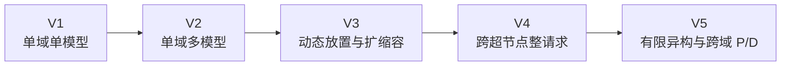
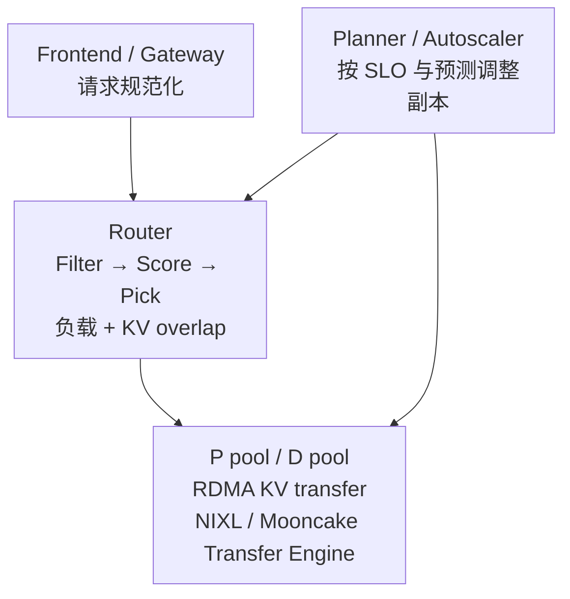
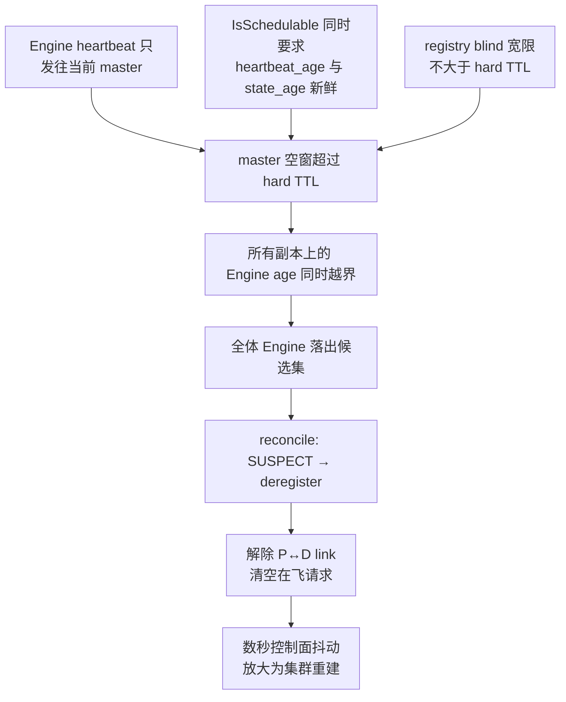

# xLLM Service 设计评估：与业界现状及演进方向的对照

## 1. 文档定位

- 状态：外部视角的独立架构评估，不是设计基线。**第 2–10 章的结论已于第 14 轮评审（commit `411ccb2bbb33`）全部吸收进 01/02/05/06/08，现按历史记录保留**；当前有效要求以权威文档为准，本文不再是待办清单
- 日期：2026-08-05（第 15–21 轮追记见第 11–13 章）
- 评估对象：本目录 01–09 设计文档；原始外部对照基于 01–08，第 16–21 轮复核包含新增 09
- 核对基线：xllm-service `322bcda03793`，xLLM `8164a701bab7`，Mooncake `129a9db9579c`
- 业界核实范围：NVIDIA Dynamo（主干及 v0.7/v0.8 设计文档）、llm-d 与 Kubernetes Gateway API Inference Extension、SGLang PD 分离与 Model Gateway、Mooncake、LMCache、vLLM×Mooncake，以及 2026 年 KV Cache 管理综述与 NetKV、LAPS 等论文

本文回答一个问题：**xLLM Service 所设定的目标，是否就是 LLM Service 的未来演进方向？** 结论章节给出判断，第 6、7 章列出不一致处，第 8 章给出建议。本文的效力低于 01/02；发生冲突时以 01 的架构边界和 02 的当前阶段实现规格为准。

### 1.1 吸收状态

第 14 轮评审逐条处理了本文结论，第 6–8 章所列问题现已全部关闭。下表是对照索引，用于回归时定位"这条当初是怎么解决的"；括注章节均指吸收后的现行文本。

| 本文条目 | 处理结果 | 关闭依据 |
| --- | --- | --- |
| §2、§6.1 内存层级轴缺阶段编号 | 已吸收，且范围比建议更宽 | README/01 §2 改为请求调度、执行拓扑、KV 内存三轴；05 升为 V2.5 主路线并新增"D 生成 KV 写穿共享层"命名交付项；08 §11 增 V2.5-S0/S1/S2/S3 |
| §6.1 08 §8 末段"正常重算" | 已改写 | 08 §8：说明 KVIndex 只定位不搬运，V2.5 前退化为重算，V2.5 后按 D 本地 append → D→P 直传 → Store restore → 重算降级 |
| §6.2 角色变更与逐请求 prefill 模式混同 | 已拆分 | 06 D22、01 §7.2、05 §5 第 2 条：注册角色变更仍由 V3 慢环 drain + 新 incarnation，逐请求本地 Prefill 进 V2 快环并受 capability/混批隔离/SLO 门禁约束 |
| §6.3 Service 侧无队列 | 已决策 | 06 D21、01 §7.2、02 §1/§12.2：V1 维持稳定拒绝并固定拒绝率产品门禁，V2 交付有界 work-conserving 优先级 band、租户 flow、flow 内 FCFS/EDF 与整池饱和门控；越界时最小队列作为 V1.x 独立评审 |
| §7.1 跨副本 pending 不同步 | 已记录代价与复议条件 | 06 D23 |
| §7.2 域内带宽均匀假设未验证 | 已进 G0 | 02 §11 G0：增测同 domain 内不同 P/D pair 的 KV 传输带宽与尾延迟离散度 |
| §7.3 未采用 GIE 无决策记录 | 已补记 | 06 D24 |
| §7.4 workload bucket 未覆盖 agentic | 已补 | 01 §5.2、05 §7、08 §12 增 agentic bucket 及其报告项 |
| §7.5 batch/离线推理未定义 | 已并入 | 05 §1 把 batch 与共享前缀列为 V2.5 目标 workload |
| §8.7 D 绑定时机的三角约束 | 已补记 | 06 D20 |

第 14 轮另有两项是设计侧自查发现、本文未提出的实质改进，记录于此以免被误读为本文成果：**06 D25 的 Engine self-fencing**（修正了 F18"lease 过期即物理终态" 这一不严谨的关闭依据）与 **05 §4 默认 full-history / strict-session 语义拆分**（修正了旧 05 会让无状态兼容请求因 KV 提示陈旧而返回冲突的缺陷）。

## 2. 核心结论

**当前设计精准命中了业界"现在"的生产前沿，并且在资源安全和故障语义上比参考系统更严谨；但它没有命中业界"下一步"的重心。**

原因是两者的演进轴不同：

**本设计的拓扑演进轴**



**业界 2026 年的内存层级演进轴**


两条轴正交，都成立。问题是本目录只有前者：内存层级轴的设计存在（05 的 Mooncake Store 与跨轮 KV），但 05 第 6 行明确"不占用主路线阶段编号"，而唯一在阶梯上的 08 对多轮场景给出的答案是重算（08 §8 末段）。

## 3. 业界现状核实

### 3.1 已经收敛的形状

Dynamo、llm-d、SGLang、Mooncake 已收敛到与 01 §4 基本同构的架构：



以下四条是共识，01/02 的对应判断都得到业界背书：

| 共识 | 本设计对应位置 |
| --- | --- |
| 软路由 + 引擎侧硬准入是唯一容量事实 | 06 D9、01 §3.1 |
| 控制面不提供在飞流式请求跨副本续传 | 06 D3、07 §5.1 |
| KV-aware 路由必须是事件驱动的精确索引，而非一致性哈希或近似缓存 | 08 §5 |
| P/D 比例与副本数由慢环控制，不进请求关键路径 | 06 D2、01 §3.3 |

07 §5.1 把"单副本崩溃时在飞请求必须被另一副本接管"认定为全部复杂度的唯一真实来源并删除它，这个归因经业界四家一致印证：Dynamo、llm-d、SGLang、AIBrix 均不提供该保证。这是本目录最有价值的一次简化。

### 3.2 关键细节一：延迟绑定 D 的方向正确，且选点有充分理由

Dynamo 主干的 disagg 流程是：Router 用 KV-aware 选 P → P 算完 prefill 返回 `disaggregated_params` → Router 此时才选 D。这比 02 §5.2 的"P 即将 admit 时绑定 D"更晚。

但这里存在一个三选二约束：

```text
(a) KV-aware 选择 P
(b) 尽可能晚地绑定 D
(c) 逐层 PUSH 与 prefill 计算重叠

(c) 要求 prefill 第一层开始前就已知 D 的目标 buffer
  => (b) 与 (c) 不可同时最大化
```

三家的选择：

| 系统 | 选择 | 放弃 |
| --- | --- | --- |
| Dynamo 主干（prefill router → decode router） | (a) + (b) | (c) 逐层重叠 |
| Dynamo v0.7/v0.8（decode-first + 全局 prefill 队列） | (b) + (c) | (a) 对 P 的 KV-aware 选择弱化 |
| SGLang（D 预分配后把 page 索引给 P） | (c) | (b) |
| 本设计 V1 | (a) + (c)，(b) 取到约束下最晚点 | 无 |

**V1 的"P 队列等完、admission 前绑定 D"恰好是保住逐层重叠的前提下能推到的最晚位置。** 这不是保守折中，是该约束下的最优解。建议在 06 中新增一条决策显式记录这个三角，否则后续评审很容易把"Dynamo 绑得更晚"误读为本设计落后。

xLLM 的逐层 PUSH 与 prefill 重叠已实现（07 §2 引 `llm_worker_impl.cpp:253-276`、`mooncake_kv_cache_transfer.cpp:667-687`），(c) 是既有资产，放弃它没有道理。

### 3.3 关键细节二：Dynamo 做了一件 V1 明确不做的事

Dynamo 的 disaggregated router 逐请求决定这个请求要不要用远程 prefill，判据两条：

1. 扣除 prefix 命中后的绝对 prefill 长度是否超过阈值。短 prompt 可以高效地以 chunked prefill 形式与正在进行的 decode 拼批；prefix 命中很长时 prefill 转为 memory-bound，同样更适合在 decode 引擎内完成。
2. 全局 prefill 队列（NATS stream）中的积压是否低于阈值。队列长说明 P 池跟不上，此时退回本地 prefill。

这与"改变实例的注册角色"是两件不同的事。后者才需要 drain 与换 incarnation。第 6.2 节详述这一点对本设计的影响。

同时注意 Dynamo 的 P 侧采用**拉模型**：decode worker 把带内存描述符的远程 prefill 请求推入全局队列，P worker 主动拉取。拉模型天然免疫状态陈旧和多 Router 同时选中同一目标的问题。本设计是纯推模型，02 §8.1 的 State Stream、soft/hard TTL、`OBSERVATION_STATE_BLIND`、负缓存、有序 D 候选、有界重选这一整套机器，很大程度上是在让推模型在陈旧状态下仍然正确。这是一条 06 从未评估过的设计轴——不是说拉模型更好（多一跳、多一个组件，且 D 侧因为 reservation 语义仍必须推），但它值得作为被显式否决的备选记录下来。

### 3.4 关键细节三：网关侧排队已成为标准能力

llm-d 与 GIE 的 EPP 现在有完整的三层 flow control：

```text
Tier 1 优先级 band      高优先级队列先于低优先级全部出队
Tier 2 租户公平         band 内在 flow 间轮转（round-robin / global-strict）
Tier 3 序内排序         flow 内 FCFS / EDF / SLO-deadline
  v
Saturation Detector    出队前门控；饱和则整个 dispatch 周期暂停
```

设计理由是 no-regret scheduling：把过量负载压在网关的策略感知队列里，而不是提交到某个 server 的本地队列里卡住失去重新决策的能力。语义是 work-conserving——GPU 有余量时绝不人为节流；负priority 请求不再在饱和时立即 429，而是进入受容量上限约束的队列，由内存保护边界触发 load shedding。

## 4. 业界的演进方向

从 2026 年的实际产出看，重心高度一致：

**KV Cache 成为集群级分层资源。** Dynamo KVBM 已是 G1–G4 四层（HBM / CPU DRAM / 本地 SSD / 远端共享存储），其中 G4 承担跨小时跨天的会话持久化。LMCache 正在把 KV 管理从引擎进程拆成独立容器（LMCache Operator）。llm-d 发布了 FS backend 连接器，并明确说单请求 TTFT 改善只是副产品，主目标是"随并发与上下文增长维持稳定吞吐与低延迟，靠显著扩大缓存空间并支持跨副本跨节点 KV 复用"。vLLM×Mooncake 的原话是"我们不能再把推理服务看成一组孤立的 vLLM 副本"。

**综述层面已改用 CDN 语言描述它。** 2026 年的 KV Cache 管理综述把 KV 状态跨越的边界形式化为 P1–P4（跨 GPU、跨节点、跨内存层、跨请求/会话），每次跨越都需要定义语义与代价。另一篇提出"Internet for the KV Cache"：KV 不再绑定于 GPU 或存储，而是可放置、可复制、可预取、也可重算的移动状态；路由的目标不再是可达性，而是存储-网络-重算三者的最低成本路径；如果投送太慢或太贵，系统可以选择重算并据此更新放置。

**驱动力是 agentic 负载。** 模式是长 prefill → 工具调用 → 追加 prefix → 重复，外加子 agent 扇出。研究正从请求级调度转向 program-aware 编排（KVFlow、TokenDance 等按 agent 步骤图管理依赖、跨 agent 集体复用、copy-on-write 语义）。

**其他并行方向**（相对次要但已进入产品）：网络与拓扑感知选点（NetKV 论证网络成本是 load 与 cache 之外缺失的第三信号；Dynamo 已从 P 的拓扑元数据推导 D 的 `RoutingConstraints`；Grove/KAI 做拓扑感知放置）、E/P/D 三段分离（llm-d 实验性支持 Encode/Prefill/Decode 及其全部排列）、变体感知的成本最优扩缩容（llm-d Workload Variant Autoscaler 跨硬件/服务变体做全局成本最小化）、Batch/离线推理一等公民化（llm-d Batch Gateway + Async Processor）。

### 4.1 请求迁移已从研究方向变成主干产品能力

> **[第 21 轮修订]** 本小节原先只作为"其他并行方向"里的半句话，用 Llumnix 与 BanaServe 两个研究工作举例。该定位已过时，独立成节。

Dynamo 主干已提供 worker 级请求迁移，且已进入正式 user guide 而非仅 dev 文档：Frontend 在 pipeline 中保留 prompt 与累计生成 token，worker 失败后把完整上下文重放到另一个 worker 继续生成，客户端看到的 token 流不中断。`--migration-limit` 默认 0（关闭），`--migration-max-seq-len` 限制状态缓存规模，超过即对该请求关闭迁移，且不支持 `n > 1`。

**关键结构事实：token replay 不需要 Decode KV checkpoint。** 它只需要一个存活的、持有 prompt 与累计输出的上游组件，新 worker 对完整上下文重新 Prefill 即可续算。因此 "首 token 之后的透明恢复"与"Decode 侧 KV/sampler checkpoint"之间**不存在依赖关系**，把两者绑定会让前者被后者的代价错误定价。

**必须与 §3.1 的那条判断区分开，两者不是同一件事。** 本文 §3.1 与 07 §5.1 认定业界不提供的是"**控制面副本**崩溃时在飞流式请求被**另一副本**接管"。Dynamo 的迁移是**引擎 worker** 失败、而 Frontend 存活时由 Frontend 重放；Frontend 自身崩溃，请求同样丢失。所以 Dynamo 的请求迁移**不构成**对 §3.1 的反例，07 §5.1 的简化依然成立。这两件事很容易被合并成一句"业界现在支持在飞请求迁移了"，而一旦合并，就会被用来论证应该恢复 Coordination Store、Journal、跨副本 fence 那一整套已被删除的机器——那是本目录最有价值的一次简化，不应被这个混淆推翻。

由此建议把恢复能力单列为一条与 V1–V5 正交的轴，而不是反向塞进 V1：

```text
R0  客户端重试            连接断开由客户端重试        V1 现状
R1  同 Service 内 replay   worker 故障后重放上下文续算  建议纳入目标并设门禁
R2  跨 Service durable     cursor / request journal
R3  Decode KV + sampler    真正的状态迁移
```

V1 选择 R0 完全合理。需要补的只是把 R1 写进路线图并明确其评估门禁，避免"恢复"这个话题只能以 R3 的形态被讨论、进而因代价过高被整体否决。

**R1 应排在 V2.5 之后评估，而不是独立定价。** replay 的代价是对 prompt 加已生成 token 做一次完整重新 Prefill，这恰好是 V2.5 共享前缀 Store 能大幅摊薄的开销：有共享层时重放的绝大部分前缀直接命中，R1 的实际成本远低于裸重算。两者是协同关系，若按裸重算成本评估 R1，会得到一个偏悲观的结论。

## 5. 当前设计的对齐与领先项

以下五项经对比确认在参考系统的公开文档中找不到对应物，是本设计的实质贡献。

### 5.1 引擎侧资源安全协议

02 §6 这一套是本目录质量最高的部分：

- 两级本地 TTL（`transfer_start_ttl` 短 / `reservation_ttl` 长），且正确地把短 TTL 限定在可靠逐层 PUSH，豁免 PULL；
- D 在同一临界区内先 `RESERVED -> RECEIVING` 并切换长 TTL，**再**发送 `BeginTransfer` ACK，P 只有收到 ACK 才允许第一次 DMA 写（07 §7.2 F17 的修法）；
- 带容量公式与 safety factor 的 outcome tombstone，触发 `TOMBSTONE_CAPACITY` 即置 UNHEALTHY 摘流以切断"拒绝 → 重试 → 更多 tombstone"的正反馈；
- 统一幂等 `ReleaseRequestResources`，明令禁止只 erase map；
- transfer 回收的逐级升级：逐 task cancel → 轮询终态 → drain transport → quarantine/retire buffer generation → 最后才重启 worker；
- `max_unresolved_reservations_per_request=1` 作为协议常量而非配置项；
- "Registry 证明 incarnation 死亡即为 reservation 终态证明"这条逃生规则（F18）。

SGLang 面对同一类问题的公开答案是 `SGLANG_DISAGGREGATION_BOOTSTRAP_TIMEOUT` 默认 300 秒、建议调到 600 秒。而这套协议对着的是代码里已确认的真实缺陷——`received_request_map_` 条目无任何超时（`disagg_pd_scheduler.cpp:839`）、`unlink_instance` 只 erase 不 deallocate（`disagg_pd_scheduler.cpp:1132-1143`）。这不是理论洁癖。

### 5.2 观测失明与成员身份分离

07 §14.1 F43 的分析质量很高。三个前提叠加会产生集群级故障放大：



D16 的修法（Registry lease/incarnation 管成员身份，State Stream freshness 只管路由健康；软状态超时绝不触发破坏性删除）、`STATE_BLIND` 与 `REGISTRY_BLIND` 分档、同量纲 enter/exit ratio 加时间迟滞、direct-evidence TTL、以及 D18 的 readiness 与 listener 生命周期分离，都是正确的。业界对应物是 Envoy 的 panic threshold 和 k8s node controller 按 zone 抑制驱逐；LLM serving 栈里普遍没有这一层。

### 5.3 KV 收益作为统一成本模型的抵扣项

08 §7 把 prefix 命中表达为 `effective_prefill_tokens`、`effective_transfer_bytes`、`incremental_d_kv_bytes` 三个抵扣量，直接代入既有 `ttft_ub` / `completion_ub`，而不是维护一个手工加权的 `cache_weight - load_weight` 分数。这比 Dynamo 的可调 cost function 和 llm-d 的加法式 scorer 都更干净：Engine 忙时排队上界自然抵消 prefix 收益，不需要"命中最多者必胜"的特例，也不需要在权重上做无法解释的调参。

`tier_credit` 明确要求不同介质不等价（HBM 近 1，DRAM/SSD/Store 必须扣掉加载、网络与排队成本）也是对的。

### 5.4 门禁纪律

以下两条 catch 的价值高于设计本身：

**F12 / 02 §12.2 的 prefix 命中率门禁。** 从"到达时锁定单个 D"迁到动态池会**降低**有效 prefix 命中率，从而抬高 prefill 负载，可能出现"上了动态池 TTFT 反而变差"而根因在容量规划不在选点算法。要求 CapacityProfile 与 trace 重放都显式声明命中率假设、历史 trace 必须按目标动态路由重新模拟 prefix 归属、并把上线前后 `prefix_hit_rate` 变化本身列入门禁——这是一个很容易漏掉的混淆变量。

**F31 的对照组修正。** 现网默认 RR 早已在全池逐请求选点，用"固定 1P1D"做对照会把 RR 已经拿到的收益记到 V1 账上，压测结论无法支撑上线决策。改为以现网默认 RR 为主对照、固定 1P1D 仅用于拆分协议税，是对的。

### 5.5 引擎性能建模深度

03 的 `StepFeatures` 粒度建模（不是 batch size 标量）、硬件下界 / 栈 Oracle / 校准 residual 三层结构、预测低于硬件下界即判 `INCONSISTENT` 并触发重标定、Scheduler 离散事件重放、多保真配置搜索加真实 benchmark 收口，比 Dynamo 的 AIConfigurator 和 llm-d 的 WVA 都更扎实。§12.4 明确 DP rank 不可独立预测（需 max over ranks 加 collective DAG）、§13.4 警告外部预测器不得在重放中替换 Scheduler 内部 `TimePredictor`，这两条都是很实的工程判断。

## 6. 关键错配

> **[第 14 轮已全部关闭]** 本章三条错配已按 §1.1 的对照表吸收进 01/02/05/06/08。以下原文保留评估当时的论证与证据，便于回归时理解改动动机；**不要把本章当作未决问题清单**。

### 6.1 跨轮与跨实例 KV 复用：解法已设计，但未排期；排了期的文档用重算糊过去

05 §3 把跨轮复用写得很完整，降级顺序也正确：

| 优先级 | 条件 | 执行路径 |
| ---: | --- | --- |
| 1 | 原 D 健康且支持 append-prefill | 在原 D 追加 |
| 2 | 支持对称传输 | 原 D 将 KV 直传新 P |
| 3 | Store 中存在完整轮次 KV | 恢复到兼容 P |
| 4 | 以上均不满足 | 完整 Prefill |

问题在于交付承诺。05 第 6 行："状态：独立性能扩展；不占用主路线阶段编号……可在任一后续阶段独立立项。"而唯一在主阶梯上的 08，§8 末段对多轮的答复是：

> 多轮对话不需要 session sticky 状态。下一轮完整历史自然生成相同 Prefix hash；KV index 会把它导向仍持有历史 KV 的 P/D。若历史已淘汰，正常重算。

**这句话在 PD 分离下不成立。** 上一轮生成的 KV 在 D 上（是 D 生成的），下一轮的 prefill 要在 P 上。`kv_routing_enabled` 再精确，索引也只会告诉你"这段 prefix 位于某个 D 上"，而那个 D 不承担 prefill 角色。08 §8 的表格把 P 命中与 D 命中分别建模是对的，但两行讲的都是**同一轮内**的收益（P 少做 forward、D 少分配少传输），没有覆盖**跨轮**的 D→P 方向。

再叠加 08 §7 的"V2 首个生产 bucket 只启用 HBM credit"：HBM prefix cache 在满负载下的存活期是秒级到分钟级，而 agent 的轮次间隔恰好是工具调用的秒级到分钟级。所以对最重要的那类负载，这套机制结构性地只能落到第 4 档重算。

Dynamo 把同一问题讲得很直白，并给出解法：D 把新生成的 block 写穿到共享层，任何 P 在下一轮都能通过 NIXL RDMA read 取回而非重算；同一机制顺带解决子 agent 冷启动（四次冗余 prefill 变成一次计算加三次加载）。

需要澄清一处，避免误读为本设计拒绝共享存储：01 §2「明确不做」那条是"不用共享 Store **替代**正常 P→D 直传"，范围完全正确，Dynamo 也是 NIXL 直传管同轮 handoff、共享层管跨轮，两者不矛盾。06 D7 同样只是把 Store 定位为独立性能扩展。真正缺的是**D 侧生成 KV 写穿共享层**这一条路径的阶段归属。

### 6.2 固定 P/D 角色：把慢环问题的结论用到了快环上

06 D14 禁用 MIX 翻转的理由完全成立，而且 07 §12.1 补的那条理由比"收益未证明"更强：`flip_prefill_to_decode` / `flip_decode_to_prefill`（`instance_mgr.cpp:1033-1073`）改写的是**本副本内存**里的 `current_type`，不通知 Engine、不换 incarnation，唯一约束是"另一角色至少剩一个"；每个副本有独立 `instances_` map 且翻转由各自本地视图触发，副本越多分叉越严重。多副本正是 V1 的方向，所以这确实不是可以延后的优化取舍。

但结论推过头了，因为它把两件事合并成了一件：

| | 是什么 | 应该由谁做 |
| --- | --- | --- |
| (i) 改变实例的注册角色 | PREFILL ↔ DECODE 的持久身份变更 | 慢环。drain → 撤 lease → 新 incarnation 重注册。V3 placement。D14 正确 |
| (ii) 逐请求决定是否使用远程 prefill | 纯候选生成规则，不改变任何实例身份，只要求引擎支持本地 chunked prefill | 快环。请求路由的一部分 |

Dynamo 做 (ii) 而不做 (i)。本设计的 V1–V5 全程没有 (ii) 的对应物。02 §5.4 的 `PREFILL_ONLY` 是另一件事（`max_new_tokens == 1`，不创建 D reservation）。

代价是具体的：

- 固定切分意味着 prompt-heavy 突发时 P 池是硬瓶颈、decode-heavy 时 P 池闲置。
- 02 §8.2 那整套 `seed_P` / `seed_D` 公式 + BootstrapEnvelope + trace 重放 + `target_util_role <= (ready - f) / ready` 的容量规划机器，很大程度上是在为一个可以在运行时消掉的刚性做离线补偿。
- V1 的价值主张就是"消除请求到达时过早锁定单个 D、静态固定配对带来的热点、碎片和扩缩容耦合"（01 §2 核心目标 1），而 (ii) 是最直接的手段。
- 08 §7 已经算出了 `effective_prefill_tokens`，也就是说 (ii) 的第一个判据（扣除命中后的 prefill 长度）在 V2 是免费的；第二个判据（P 池积压）本来就在 EngineState 的 queue histogram 里。

### 6.3 Service 侧没有队列：这个决定的论证强度不匹配它的影响面

V1 的过载行为是稳定拒绝：`BEST_EFFORT` 在 Engine 硬容量允许时继续准入并打 `slo_at_risk`，硬容量也没有时返回 `CAPACITY_EXHAUSTED`（02 §4.3）。没有任何 Service 侧缓冲。

07 §5.2 的 F06 曾提出这个问题："V1 无 Service 侧排队，过载从'变慢'改为'返 5xx'，需产品决策与灰度护栏。"关闭依据是 STRICT / BEST_EFFORT 分档（07 §7.1）。但分档解决的是"不该把容量耗尽误报成 SLO 合同失败"，没有解决"过载时客户端可见行为发生变更"。而且 F06 要求的"产品决策与灰度护栏"没有落到 02 §13 的上线前固定配置清单里。

三个后果：

**其一，它和 F05 是同一个问题的两面。** F05 是"D 候选列表在 P 队列等待后陈旧"，当前解法是打点 `plan_age_at_admission_ms` 与 `plan_failure_after_queue_wait_rate`、M0 优先选更短队列的 P、或不突破上限时扩大 D 列表（02 §4.4）。网关排队是这个问题的根因解——请求不进引擎队列，就不存在计划陈旧。llm-d 给 flow control 的理由正是这一条：no-regret scheduling，不要把请求提交到某个 server 的本地队列里失去重新决策的能力。现有做法是在症状上加度量，并接受"失败代价是双倍队列等待"（07 §5.2 F05 原文）。

**其二，V2 的公平性机制无处落地。** 01 §7.2 计划 V2 加入 priority/SLO class、租户配额、保留容量、借用/回收和抢占对照。但没有队列，这些只能在准入拒绝的那一瞬间表达，退化成配额检查而非调度。llm-d 的三层结构（优先级 band → 租户公平 → 序内 FCFS/EDF/SLO-deadline）之所以能表达"高优先级请求排在队首等待，同时刻意压住低优先级以免它偷走高优先级正在等的那几个 GPU 周期"，前提就是有队列。

**其三，饱和检测缺位。** llm-d 的 Saturation Detector 评估整池的聚合健康（KV 利用率、本地队列深度）后再决定是否出队。本设计的等价物散落在各 Engine 的硬准入里，Service 只能靠负缓存事后感知。02 §8.1 明确"瞬时 queue/KV/credit 不足不切 readiness，副本保持 READY 并返回稳定容量拒绝"——这条本身是对的（避免负载尖峰导致全体副本同步摘流），但它把"整池饱和"这个信号完全丢掉了。

## 7. 次要问题

> **[第 14 轮已全部关闭]** 五条均已吸收，对照见 §1.1。原文保留。

### 7.1 跨副本 pending work 不同步

08 §9 第 2 条把"刚下发、尚未进入下一份 StateBatch 的请求"记为**本地** pending work；01 §4.2 明确"普通 Service 不保存其他 Service 的请求、负载或 ownership 信息，也不执行 Service 间请求级调用"。

Dynamo 的 router 副本之间通过 NATS core 同步 active block 的本地预测（slot manager），文档称之为"双层结构：worker 可恢复的 KV cache 状态 + 跨 router 副本的易失 active-block 同步"。

影响：N 个副本、状态发布周期 T，每个副本会系统性低估约 (N-1)/N 的"已下发但未上报"工作量。08 §9 的四层缓解（shortlist 保留 least-load、本地 pending、同分 hash 随机化、Engine 原子准入兜底）都是实的，而且 02 §12.2 的 `AddNewRequests` 冲突率门禁能测到它，所以不是盲区。但这是一个被默认取的风险，建议在 06 显式记一条决策加复议条件（例如"冲突率越界且扩大 guard 无效时引入副本间 pending 同步"），而不是留在"不做 Service 间调用"这条通则里被顺带否决。

### 7.2 域内带宽均匀假设未验证

V1 固定 `link_class = intra_domain`（02 §3.1），`transfer_ub` 是 (P,D) pair 上的一个标量（01 §5.2）。域的定义是"一组具备已验证直连 KV 传输能力、共同故障与容量边界的 Engine；V1 为一个超节点内的单 domain"（01 §2.1）。

如果目标 domain 是几百芯片规模的超节点，域内带宽未必均匀。NetKV（2026）的论点是：网络成本是 load 与 cache 之外缺失的第三个信号，一个"90% prefix 命中但跨 pod 链路拥塞"的 D 可能比"冷 cache 但同机架"的 D 给出更差的 TTFT；文中同时指出 DistServe 只在部署期偏好同节点放置、Mooncake Conductor 只按 cache match 与 instance load 打分、llm-d 与 Dynamo 也都不含 per-request 网络信号。Dynamo 已经开始补：启用拓扑感知 KV 传输时，prefill router 会先从选中的 P worker 的运行时拓扑元数据推导 D 的 `RoutingConstraints`。

建议在 G0 压测阶段实测同一 domain 内不同 (P,D) 对的传输带宽离散度，再决定 `transfer_ub` 是否需要按拓扑分组，而不是等到 V4/V5 才引入 link 建模。

### 7.3 未采用 GIE / K8s 生态没有决策记录

llm-d 与 Dynamo 现在都对外暴露 GIE 的 Endpoint Picker 协议（Dynamo 有 Endpoint Picker Plugin，可由 GAIE gateway 调用），`InferencePool` 正在成为标准发现抽象，EPP 的 filter/scorer 是插件化的，autoscaler（HPA/KEDA/WVA）复用同一套指标。

自建 etcd Registry + brpc 对私有超节点栈是合理选择。但代价需要记账：V3 的 placement controller 等于从零重造 Planner / Workload Variant Autoscaler，且拿不到生态的 scorer 与 autoscaler。这是战略决策不是技术缺陷，但 06 里应该有它和重新引入条件。

### 7.4 workload bucket 未覆盖 agentic

01 §5.2 与 02 §4.3 的排序规则按三个 bucket 固定：交互短请求、长生成、低优先级吞吐。没有一个 bucket 是"多轮 + 工具调用间隔"，而这恰好是跨轮 KV 收益唯一能被测出来的地方。08 §12 要求"必须按 workload bucket 报告 Prefix 长度分布、P/D predicted/actual hit……"，但如果 bucket 集合里没有 agentic 形态，这套报告测不到 6.1 节所述的那个缺口。

### 7.5 Batch / 离线推理未定义

`Request::offline` 字段在现网存在但从未参与调度。01/02 全文没有 batch 或离线推理路径。01 §5.2 的排序规则里有"低优先级吞吐：边际设备时间、抢占代价、完成时间"这一档，但没有任何地方定义这类请求怎么进来、怎么被限流、怎么被抢占。llm-d 已经把它做成独立模块（Batch Gateway 提供 OpenAI 兼容 Batch API，Async Processor 做带 flow-control 门控的派发）。优先级不高，但"低优先级吞吐"这一档目前是悬空的。

## 8. 建议

按优先级排列。1–3 建议在 V1 冻结前决策，4–5 可与 G0 并行，6–7 是收尾。

> **[第 14 轮已全部采纳]** 七条建议均已落入权威文档，对照见 §1.1。两处编号提醒：§8.6 建议的两条决策实际落为 **06 D23（跨副本 pending 不同步）** 和 **06 D24（不采用 GIE）**，§8.7 落为 **06 D20**，与本文当时的建议编号不同。以 06 的实际编号为准。

### 8.1 给内存层级轴一个阶段编号

不是"现在就上 Mooncake Store"，而是三件事：

1. 把 05 挂到主阶梯上（可以是 V2.5 或 V3 的并行子项），去掉"不占用主路线阶段编号"。
2. 把 **D 侧生成 KV 写穿共享层** 单列为命名交付项。这是 6.1 节所述缺口的最小充分解，且不影响"Store 不替代正常 P→D 直传"这条边界。
3. 修改 08 §8 末段。把"若历史已淘汰，正常重算"改为对 05 §3 四档降级顺序的显式引用，并说明在共享层交付之前该场景确实退化为重算、以及这一退化的量化影响。现状是唯一在阶梯上的文档给出了一个已知不足的答案，而完整答案藏在一份声明自己不占编号的文档里。

08 §7 的 `tier_credit` 已经把路由侧的模型准备好了，08 §11 也已把"低层 tier credit"放在 V2-K2、"Store 传输与加载收益"放在 V5。所以缺的不是模型，是它要路由到的那个基础设施的交付承诺。

### 8.2 把"角色变更"与"逐请求是否远程 prefill"拆开

- 保留 D14 管前者，理由（跨副本分叉）无需改动。
- 给 V1-M1 或 M2 增加一个快环谓词 `use_remote_prefill(request, cluster_snapshot)`，判据为扣除 prefix 命中后的 `effective_prefill_tokens` 与 P 池排队深度。
- 这不需要新 RPC、不需要 reservation 协议变更、不改变任何实例的注册身份——它是 `SelectCandidates` 内部的候选生成规则，返回一个不含远程 P 的 plan 即可。
- 前置条件是引擎侧 D 实例支持本地 chunked prefill，需按 04 的能力基线核实；如果不支持，则这条建议降级为 V3 的输入。

收益直接落在 V1 的核心目标 1 上，且能显著放宽 02 §8.2 那套离线容量规划的精度要求。

### 8.3 在 V1 冻结前重新评估网关侧有界队列

范围可以很小：只对 `BEST_EFFORT` 增加一个有界的、按 `slo_class` 分档的 Service 侧队列，出队前检查整池饱和信号。

三个收益：F05 的根因解（而非在症状上加度量）、过载从 5xx 回到降级、以及为 V2 的 priority / 租户配额 / 抢占提供落地位置。

如果决定不做，建议在 06 新增一条决策明确记录"V1 不做 Service 侧排队"及其重新引入条件（例如过载期客户端错误率越过固定阈值，或 `plan_failure_after_queue_wait_rate` 长期越界），并把 F06 要求的产品决策与灰度护栏补进 02 §13。目前这个决定是通过"V1 无 Service 侧排队"这个既成事实存在的,没有被作为决策评估过。

### 8.4 补 agentic workload bucket 进门禁

在 01 §5.2 / 02 §4.3 的 bucket 集合中增加一档"多轮会话"，特征至少包括轮次数分布、轮次间隔分布（工具调用时长）、每轮新增 token 比例。并在 08 §12 的报告要求中显式列出该 bucket 的跨轮 `prefix_hit_rate`。没有这一档，6.1 节的缺口在门禁上不可见。

### 8.5 G0 实测域内带宽离散度

在 G0 记录现网 etcd 状态年龄和冲突率的同时，测同一超节点内不同 (P,D) 对的实际 KV 传输带宽与尾延迟分布。若离散度显著，则 `transfer_ub` 需要按拓扑分组，这会影响 02 §4.3 的上界公式形态，越早知道越好。

### 8.6 补两条 06 决策记录

- **D20（建议）跨副本 pending work 不同步。** 记录 Dynamo 的对照做法、本设计的四层缓解、以及以 `AddNewRequests` 冲突率门禁作为复议触发条件。
- **D21（建议）不采用 GIE / Kubernetes Gateway API Inference Extension。** 记录理由（私有超节点栈、既有 etcd/brpc 资产、Engine 侧对纯 `ip:port` value 的解析依赖）、代价（V3 重造 Planner/WVA、无法复用生态 scorer）、以及重新引入条件。

### 8.7 补一条 06 决策记录 D 绑定时机的三角约束

把 3.2 节的三选二约束写进 06，明确 V1 的"P admission 前绑定 D"是在保住逐层 PUSH 重叠这个既有资产的前提下能取到的最晚绑定点。否则后续评审会反复把"Dynamo 绑得更晚"读成落后，并可能提议放弃重叠。

## 9. 总体判断

作为 **V1 的工程规格**，这套文档质量很高。07 里 F01–F49 的收敛是实的——每一条都有关闭依据的文档位置，被推翻的当轮结论（第 11、12 章关于 State Stream 推迟的结论被第 13 章推翻）保留在原处并标注，这是很少见的评审纪律。第 5 章列的五项对齐与领先也是实的，尤其是资源安全协议和观测失明分离，参考系统里确实没有对应物。V1 可以开工。

问题不在 V1，在于 V1–V5 这个阶梯的组织方式预设了未来几年的竞争发生在拓扑维度——单域到多域、单模型到多模型、静态到自动放置。而 2026 年的证据指向内存层级维度——KV 从每实例 HBM 缓冲变成集群级分层持久资源，算力围着它调度，驱动力是 agentic 负载。

这两条轴不冲突，可以并行推进。但本目录只有一条；另一条的设计（05）存在且质量不差，只是挂在编号之外，而在阶梯上的那份文档（08）对它负责的场景给出了一个不完整的答案。第 8.1 节是本文最主要的建议。

## 10. 参考资料

业界核实来源，用于确认架构边界，不替代本集群实测：

- NVIDIA Dynamo：[Overall Architecture](https://docs.nvidia.com/dynamo/dev/design-docs/overall-architecture)、[Router Design](https://docs.nvidia.com/dynamo/dev/design-docs/component-design/router-design)、[Disaggregated Serving](https://docs.nvidia.com/dynamo/components/router/disaggregated-serving)、[disagg-serving.md](https://github.com/ai-dynamo/dynamo/blob/main/docs/design-docs/disagg-serving.md)、[Full-Stack Optimizations for Agentic Inference](https://developer.nvidia.com/blog/full-stack-optimizations-for-agentic-inference-with-nvidia-dynamo/)、[Request Migration](https://docs.nvidia.com/dynamo/latest/user-guides/fault-tolerance/request-migration)、[Fault Tolerance](https://docs.nvidia.com/dynamo/dev/user-guides/fault-tolerance)
- llm-d / GIE：[Architecture](https://llm-d.ai/docs/architecture)、[EPP](https://github.com/llm-d/llm-d/tree/main/docs/architecture/core/router/epp)、[Flow Control](https://llm-d.ai/docs/architecture/core/router/epp/flow-control)、[GIE Flow Control](https://gateway-api-inference-extension.sigs.k8s.io/guides/flow-control/)、[KV Cache 系列博客](https://llm-d.ai/blog/tags/kv-cache)
- SGLang：[PD Disaggregation](https://docs.sglang.io/docs/advanced_features/pd_disaggregation)
- Mooncake / LMCache：[Mooncake 论文](https://arxiv.org/html/2407.00079)、[vLLM x Mooncake Store](https://vllm.ai/blog/2026-05-06-mooncake-store)、[LMCache + Dynamo 1.0](https://blog.lmcache.ai/en/2026/03/16/lmcache-nvidia-dynamo-1-0-a-match-made-in-inference-heaven/)
- 综述与论文：[From Tensor Buffer to Distributed Memory Hierarchy: A Survey of KV Cache Management](https://arxiv.org/html/2607.02574v1)、[An Internet for the KV Cache](https://arxiv.org/html/2608.01526)、[NetKV: Network-Aware Decode Instance Selection](https://arxiv.org/html/2606.03910v1)、[DistServe](https://arxiv.org/abs/2401.09670)

## 11. 追记：对第 14 轮刷新本身的复核（第 15–16 轮）

第 14 轮把本文第 2–10 章的结论吸收进权威文档后，对新增文本又做了一轮复核。第 15 轮登记的 **F50–F54** 已在第 16 轮全部关闭，完整论证和关闭依据见 [评审日志第 19–20 章](./07_XLLM_SERVICE_REVIEW_LOG.md)。此处只留索引，避免两处维护同一套论证：

| ID | 状态 | 关闭依据 |
| --- | --- | --- |
| F50 | CLOSED | 02 §6.5 固定 backing-memory 不变量；05 §3.2/§6/§7 定义默认 `COPY_ON_PUT`、可选 `PIN_ON_PUT` 和 terminal/quarantine；06 D28 |
| F51 | CLOSED | 08 §4 是唯一前像，多模态逐 block，storage layout 只进对象键；01 §3.5、05 §3.1、06 D27 同步 |
| F52 | CLOSED | 09 §2–§4/§9 定义三种显式模式、共用账本和共驻 TPOT/SLO 外部性；08 §6–§7 接入比较；06 D29 |
| F53 | CLOSED | 09 §5–§7/§9 定义有界队列、`QUEUED + DISPATCHED` 崩溃预算和 drain policy；02 §12.3；06 D30 |
| F54 | CLOSED | README、01 §7、05 §7 和 06 D31 明确 V2.5/V3 可并行、独立上线，Store 不可用时 V3 保守计入 cache loss |

这些修复没有把 Store connector、Service 排队或本地 Prefill 反向加入 V1。本文第 9 章“V1 可以开工”的判断在第 16 轮关闭后维持不变。

## 12. 追记：09 与既有不变量的衔接（第 17–18 轮）

第 17 轮复核确认 F50–F54 的关闭成立，同时发现 09 与 02/05 之间四个接缝问题。第 18 轮已全部关闭，论证与对第 17 轮示例修法的两处收紧见 [评审日志第 21–22 章](./07_XLLM_SERVICE_REVIEW_LOG.md)。

| ID | 状态 | 关闭依据 |
| --- | --- | --- |
| F56 | CLOSED | 02 §3.2/§4.4/§5.3/§13 和 09 §2.1/§3.3/§9 统一 outcome 不明的 Decode resource hold；06 D32；约束不包含普通 P submission |
| F57 | CLOSED | 02 §8.1 与 09 §5.1–§5.3/§9 定义三态 saturation、有界 blind probe、queue 退回和唯一 readiness；06 D34 |
| F58 | CLOSED | 01 请求流程、02 §3.2/G1、09 §2/§3.2–§3.3/§9 与 06 D33 定义 mode-specific `GenerationCommit`；远程路径仍必须 FirstGeneration ACK |
| F59 | CLOSED | 01 §7.2、05 §3.2/§7、08 §7、09 §3.2/§4/§9 与 06 D35 共用 `DInterferenceBudget`，并固定四组联合门禁 |

第 18 轮没有把 V2/V2.5 能力反向加入 V1，也没有弱化 FirstGeneration、Engine 原子准入或 `STATE_BLIND/REGISTRY_BLIND` 边界。V1 继续可开工；V2-L1、V2-Q1 和 V2.5-S1 分别按自身门禁交付。

## 13. 追记：候选集 hold 与本地时间边界（第 19–21 轮）

第 19 轮发现第 18 轮新增的 Service 侧 hold 在 P 回填实际 D 前失联时无法定位资源，并登记 F60–F63。第 20 轮先推翻“未知 Cancel 不留痕”的错误修法；第 21 轮继续消除 Query `ABSENT`、跨机绝对 deadline 和异步 intent 收窄安全集合三处残留，最终全部关闭。完整演变见[评审日志第 23–25 章](./07_XLLM_SERVICE_REVIEW_LOG.md)。

| ID | 状态 | 关闭依据 |
| --- | --- | --- |
| F60 | CLOSED | 01 §5.1/§6、02 §3.2/§5.1–§6.3/§9–§14、09 §2.1/§9–§10、06 D32/D36：候选集 hold、`CANCELLED_BEFORE_CREATE`、独立 fence 池、本地硬 duration 与 dispatch 前预留容量的有界 cleanup |
| F61 | CLOSED | 09 §5.1/§5.3/§9、06 D34：按 band/tenant 的 work-ahead、衰减到 0 的 probe-rate 置信下界，以及不旁路 readiness 的 immediate probe |
| F62 | CLOSED | 05 §3.2/§7、09 §4/§9–§10、06 D35：单一绝对 TPOT guard、当前快照 marginal delta、分类 share 和原子总账 |
| F63 | CLOSED | 02 §5.2：只有明确未创建或已 terminal 才换 D；precommit 先 cancel，传输另受不变量 4/§6.4 约束 |

第 21 轮仍不引入跨副本请求恢复、分布式事务或跨机 deadline。F60 作为 V1 blocker 关闭后，V1 可以开工；V2/V2.5 继续按自身阶段门禁交付。

## 14. 追记：V1 开工就绪度与三个实现侧缺陷（第 22 轮）

第 22 轮把评审对象从设计文档转向**开工就绪度**，逐条核对了设计侧提出的四个 P0，结论是全部成立，Conditional Go 的分级也成立。完整记录见 [评审日志第 26 章](./07_XLLM_SERVICE_REVIEW_LOG.md)。

与本文直接相关的有两点。

其一，本文 §4 原先只把请求迁移列为"其他并行方向"里的半句话，用 Llumnix 与 BanaServe 两个研究工作举例，该定位已过时，已独立为 §4.1：Dynamo 主干的 worker 级 token replay 迁移已进入正式 user guide。同时在 §4.1 中加入了一处必须保留的区分——它是**引擎 worker** 失败而 Frontend 存活时的重放，与本文 §3.1 所说的"**控制面副本**崩溃时在飞请求被另一副本接管"不是同一件事，不构成对 §3.1 的反例，07 §5.1 的简化依然成立。

其二，三个 P0 派生出的实现侧缺陷（F64 Engine 以原 incarnation 复活、F65 注册竞态产生无 link 的 P-D pair、F66 跨仓 proto 契约缺机械检查）都不是架构方向问题，而是跨仓协议、并发状态与故障检测在实现层的语义分叉。这与本文 §9 的总体判断一致：方向已经对齐业界演进路线，当前的主要风险已经转移到实现契约上。
